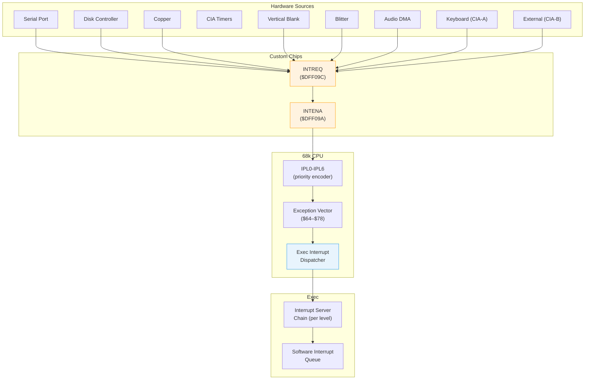
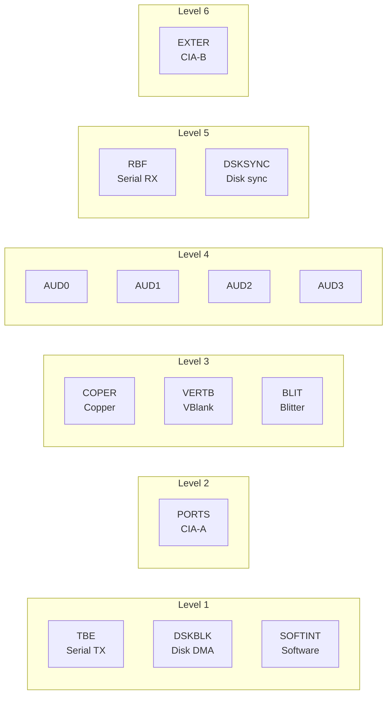

[← Home](../README.md) · [Exec Kernel](README.md)

# Interrupts — Levels, INTENA, AddIntServer, CIA Interrupts

## Overview

AmigaOS supports 7 hardware interrupt levels (68k IPL0–IPL6) plus a software interrupt mechanism. Custom chip interrupts are filtered through the `INTENA` / `INTREQ` registers; CIA-generated interrupts arrive on level 2 (CIA-A) and level 6 (CIA-B). The interrupt system is the foundation of all real-time behavior — audio DMA, vertical blank timing, keyboard input, and the scheduler itself all depend on it.

---

## Architecture



---

## Interrupt Priority Levels

| IPL | Source Bits | AmigaOS Use | Typical Latency |
|---|---|---|---|
| 1 | TBE, DSKBLK, SOFTINT | Software interrupts, serial TX, disk DMA complete | ~10 µs |
| 2 | PORTS (CIA-A) | Keyboard, CIA-A timers, parallel port, floppy index | ~15 µs |
| 3 | COPER, VERTB, BLIT | Copper, vertical blank, blitter done | ~10 µs |
| 4 | AUD0–AUD3 | Audio channel DMA completion | ~10 µs |
| 5 | RBF, DSKSYNC | Serial receive, disk sync word | ~8 µs |
| 6 | EXTER (CIA-B) | CIA-B timers, external interrupts, TOD alarm | ~8 µs |
| 7 | NMI | Non-maskable (unused on stock Amiga hardware) | — |

Higher IPL = higher priority. A level 6 interrupt can preempt level 1–5 handlers. The CPU's SR (Status Register) mask bits determine which levels are currently enabled.

### Interrupt Sources per Level



---

## Custom Chip Interrupt Registers

| Register | Address | R/W | Description |
|---|---|---|---|
| `INTENAR` | `$DFF01C` | R | Interrupt enable status (read) |
| `INTENA` | `$DFF09A` | W | Interrupt enable set/clear (write) |
| `INTREQR` | `$DFF01E` | R | Interrupt request status (read) |
| `INTREQ` | `$DFF09C` | W | Interrupt request clear/set (write) |

### INTENA / INTREQ Bit Map

| Bit | Constant | Level | Source |
|---|---|---|---|
| 0 | `INTF_TBE` | 1 | Serial transmit buffer empty |
| 1 | `INTF_DSKBLK` | 1 | Disk DMA block complete |
| 2 | `INTF_SOFTINT` | 1 | Software interrupt |
| 3 | `INTF_PORTS` | 2 | CIA-A interrupt (keyboard, timers) |
| 4 | `INTF_COPER` | 3 | Copper interrupt |
| 5 | `INTF_VERTB` | 3 | Vertical blank |
| 6 | `INTF_BLIT` | 3 | Blitter finished |
| 7 | `INTF_AUD0` | 4 | Audio channel 0 DMA done |
| 8 | `INTF_AUD1` | 4 | Audio channel 1 DMA done |
| 9 | `INTF_AUD2` | 4 | Audio channel 2 DMA done |
| 10 | `INTF_AUD3` | 4 | Audio channel 3 DMA done |
| 11 | `INTF_RBF` | 5 | Serial receive buffer full |
| 12 | `INTF_DSKSYNC` | 5 | Disk sync word match |
| 13 | `INTF_EXTER` | 6 | CIA-B / external interrupt |
| 14 | `INTF_INTEN` | — | **Master interrupt enable** |
| 15 | `INTF_SETCLR` | — | Set/Clear control bit (write only) |

### Enabling and Clearing Interrupts

```c
/* Enable vertical blank interrupt:
   Bit 15 (SET) | Bit 14 (INTEN) | Bit 5 (VERTB) = $C020 */
custom.intena = INTF_SETCLR | INTF_INTEN | INTF_VERTB;

/* Disable vertical blank (clear bit 5): */
custom.intena = INTF_VERTB;  /* Bit 15 clear = CLEAR mode */

/* Acknowledge (clear) a vertical blank request: */
custom.intreq = INTF_VERTB;
```

> **Important**: You must write `INTF_SETCLR` (bit 15) to SET bits. Without it, you CLEAR them. This is a common source of bugs.

---

## Exec Interrupt Dispatch

### Server Chain vs Direct Handler

Exec provides two models for handling interrupts:

| Model | Function | Use Case |
|---|---|---|
| **Server chain** | `AddIntServer()` / `RemIntServer()` | Shared interrupts (multiple handlers per level) |
| **Direct handler** | `SetIntVector()` | Exclusive interrupt ownership |

For levels with multiple sources (VBL, PORTS), use the **server chain**. Each handler in the chain checks if the interrupt is for it and returns D0=0 (not mine) or D0≠0 (handled).

### Adding an Interrupt Server

```c
/* Vertical blank interrupt server */
struct Interrupt myVBL;

myVBL.is_Node.ln_Type = NT_INTERRUPT;
myVBL.is_Node.ln_Pri  = 0;          /* Priority within this level */
myVBL.is_Node.ln_Name = "MyApp VBL";
myVBL.is_Data          = myDataPtr;  /* Passed in A1 */
myVBL.is_Code          = myVBLFunc;  /* Handler address */

AddIntServer(INTB_VERTB, &myVBL);   /* INTB_VERTB = 5 */

/* ... application runs ... */

RemIntServer(INTB_VERTB, &myVBL);   /* MUST remove before exit! */
```

### Interrupt Handler Implementation

```c
/* C handler — called at interrupt level */
ULONG __saveds __interrupt MyVBLHandler(
    struct Interrupt *irq __asm("a1"))  /* is_Data in A1 */
{
    struct MyData *data = (struct MyData *)irq;

    /* Do fast work only */
    data->frameCount++;

    if (data->needUpdate)
    {
        data->needUpdate = FALSE;
        Signal(data->mainTask, data->updateSig);  /* Wake main task */
    }

    return 1;  /* Handled — stop chain (for exclusive sources)
                  Return 0 to let next server in chain try */
}
```

### Assembly Handler (Maximum Performance)

```asm
; A1 = is_Data pointer
; Must preserve D2-D7, A2-A6
; May trash D0, D1, A0, A1
MyVBLHandler:
    move.l  (a1),a0         ; Load data pointer
    addq.l  #1,FRAMECOUNT(a0)
    moveq   #1,d0           ; Handled
    rts
```

---

## Handler Rules

| Rule | Reason | Consequence |
|---|---|---|
| **No `Wait()` or `WaitPort()`** | Can't sleep at interrupt level | System freeze |
| **No `AllocMem()` / `FreeMem()`** | May internally `Wait()` | System freeze |
| **No DOS calls** | DOS is not reentrant | Corruption |
| **No Intuition calls** | May `Wait()` internally | Deadlock |
| **Preserve D2-D7, A2-A6** | Calling convention | Register corruption |
| **Minimize execution time** | Blocks all lower-priority interrupts | Audio glitches, serial data loss |
| **Use `Signal()` for deferred work** | Only safe IPC from interrupt context | — |
| **Always acknowledge the interrupt** | Write to INTREQ to clear the request | Infinite interrupt loop |

---

## CIA Interrupts

CIA-A (`$BFE001`) generates level 2 (PORTS) interrupts. CIA-B (`$BFD000`) generates level 6 (EXTER) interrupts. Each CIA has an ICR (Interrupt Control Register) with 5 sources:

| Bit | Source | CIA-A Use | CIA-B Use |
|---|---|---|---|
| 0 | Timer A underflow | Keyboard scan timer | System timer |
| 1 | Timer B underflow | Available | Available |
| 2 | TOD alarm | Real-time clock alarm | VSync counter |
| 3 | Serial register (SP) | Keyboard data received | Available |
| 4 | FLAG pin | Accent key / disk index | Available |

### CIA Interrupt Handler

```c
/* CIA-A keyboard interrupt (level 2) */
struct Interrupt kbdHandler;
kbdHandler.is_Code = KbdISR;
kbdHandler.is_Data = kbdData;
kbdHandler.is_Node.ln_Pri = 120;  /* High priority within level 2 */

AddIntServer(INTB_PORTS, &kbdHandler);  /* Level 2 = CIA-A */

ULONG __interrupt KbdISR(struct Interrupt *irq __asm("a1"))
{
    UBYTE icr = ciaa.ciaicr;  /* Read + acknowledge CIA-A interrupts */

    if (icr & 0x08)  /* Bit 3 = serial port (keyboard data) */
    {
        UBYTE rawKey = ciaa.ciasdr;
        /* Process key... */
        Signal(mainTask, keySig);
        return 1;  /* Handled */
    }

    return 0;  /* Not ours — pass to next handler */
}
```

---

## Software Interrupts

Software interrupts run at level 1 priority but are scheduled by exec, not hardware. They're used for deferred interrupt processing — a hardware interrupt handler can queue a software interrupt to do longer processing at a lower priority:

```c
/* Cause a software interrupt */
struct Interrupt softInt;
softInt.is_Code = MySoftHandler;
softInt.is_Data = myData;
softInt.is_Node.ln_Pri = 0;  /* -32, -16, 0, +16, +32 are typical */

Cause(&softInt);   /* LVO -78 */
/* MySoftHandler runs at next opportunity (level 1) */
```

### Software Interrupt Priorities

| Priority | Constant | Use |
|---|---|---|
| +32 | `SIH_PRIMOUSE` | Mouse/gameport processing |
| +16 | — | High-priority deferred work |
| 0 | — | Normal deferred work |
| -16 | — | Low-priority deferred work |
| -32 | `SIH_PRISERIAL` | Serial port processing |

---

## Disable / Enable vs Forbid / Permit

| Function | Effect | Scope | Max Safe Duration |
|---|---|---|---|
| `Forbid()` | Disables task switching | Tasks only (interrupts still run) | ~100 ms |
| `Permit()` | Re-enables task switching | Reverses `Forbid()` | — |
| `Disable()` | Masks all hardware interrupts | Hardware + task switching | **~250 µs** |
| `Enable()` | Unmasks hardware interrupts | Reverses `Disable()` | — |

> **Caution**: `Disable()` / `Enable()` stop ALL hardware — serial data loss, audio DMA glitches, floppy read errors. Use only for accessing data structures shared between task and interrupt context.

---

## Pitfalls

### 1. Forgetting to Acknowledge

```c
/* BUG — interrupt fires infinitely */
ULONG MyHandler(void)
{
    DoWork();
    return 1;
    /* Forgot: custom.intreq = INTF_VERTB; */
    /* INTREQ bit still set → interrupt fires again immediately → system hangs */
}
```

> **Note**: For server-chain interrupts (AddIntServer), exec handles INTREQ acknowledgment. For `SetIntVector`, you must do it yourself.

### 2. RemIntServer After Handler Memory Freed

```c
/* BUG — handler struct on stack */
void SetupVBL(void)
{
    struct Interrupt vbl;  /* ON STACK */
    AddIntServer(INTB_VERTB, &vbl);
    /* Function returns — stack frame destroyed */
    /* VBL interrupt fires → jumps to garbage → Guru */
}
```

### 3. Spending Too Long in Handler

```c
/* BUG — complex processing at interrupt level */
ULONG MyAudioHandler(void)
{
    DecodeMP3Frame(buffer);  /* Takes >250 µs on 68000 */
    /* During this time, keyboard, serial, and disk are unserviced */
    return 1;
}

/* CORRECT — signal task for heavy processing */
ULONG MyAudioHandler(void)
{
    Signal(decoderTask, decodeSig);  /* ~5 µs */
    return 1;
}
```

---

## Best Practices

1. **Use server chains** (`AddIntServer`) for VBL, PORTS, EXTER — these are shared levels
2. **Always `RemIntServer`** before exit or freeing handler memory
3. **Keep handlers fast** — signal your main task for heavy work
4. **Use software interrupts** for deferred processing from high-priority hardware handlers
5. **Acknowledge interrupts** by writing to `INTREQ` when using `SetIntVector`
6. **Preserve registers** D2-D7, A2-A6 in your handler
7. **Use `Disable()`/`Enable()`** only to protect interrupt-shared data — never for general synchronization
8. **Set appropriate priority** in `is_Node.ln_Pri` — higher priority handlers check first

---

## References

- NDK39: `hardware/intbits.h`, `hardware/cia.h`, `exec/interrupts.h`
- ADCD 2.1: `AddIntServer`, `RemIntServer`, `SetIntVector`, `Cause`, `Disable`, `Enable`
- See also: [CIA Chips](../01_hardware/common/cia_chips.md) — CIA timer and ICR details
- See also: [Custom Registers](../01_hardware/ocs_a500/custom_registers.md) — INTENA/INTREQ register listing
- See also: [Multitasking](multitasking.md) — how interrupts drive the scheduler
- *Amiga ROM Kernel Reference Manual: Exec* — interrupts chapter
