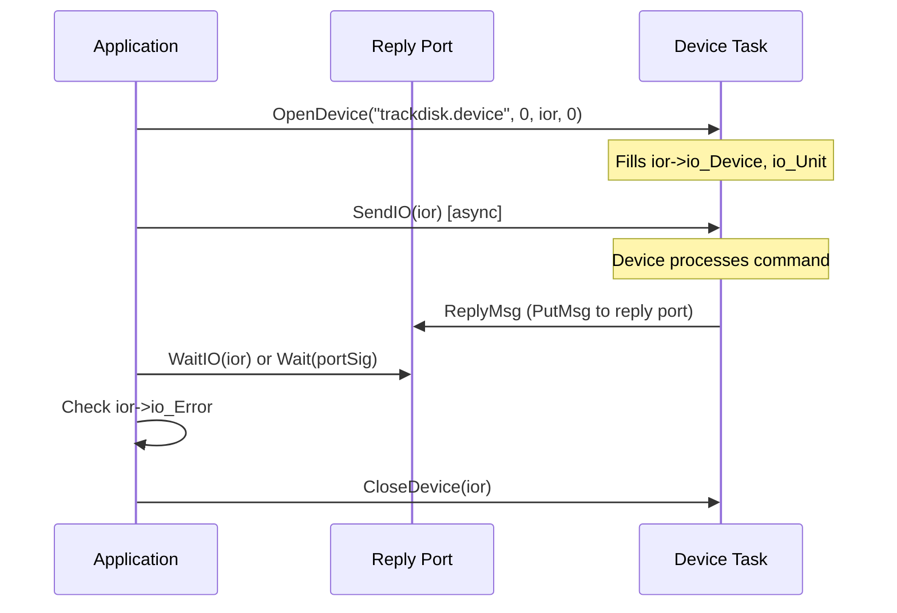

[← Home](../README.md) · [Exec Kernel](README.md)

# IO Requests — IORequest, DoIO, SendIO, CheckIO, AbortIO

## Overview

AmigaOS device I/O uses a **message-based** asynchronous protocol. Every device operation is described by an `IORequest` structure sent to a device's command port. The device processes it (synchronously or in the background) and replies when done. This model unifies all hardware — disks, serial, parallel, audio, timers, network — under a single consistent API.

The IO system is built directly on top of [message ports](message_ports.md). An `IORequest` contains an embedded `Message`, and device I/O is literally message passing between your task and the device's task.

---

## Architecture



### The IORequest Lifecycle

```
1. CreateIORequest / CreateStdIO → allocate request
2. OpenDevice → bind to device/unit
3. Fill io_Command, io_Data, io_Length, io_Offset
4. DoIO (sync) or SendIO (async) → submit
5. Check io_Error, io_Actual
6. Repeat 3–5 as needed
7. CloseDevice → unbind
8. DeleteIORequest / DeleteStdIO → free
```

---

## Structures

```c
/* exec/io.h — NDK39 */

struct IORequest {
    struct Message io_Message;  /* embedded Message (has MsgPort reply port) */
    struct Device *io_Device;   /* filled by OpenDevice */
    struct Unit   *io_Unit;     /* filled by OpenDevice */
    UWORD          io_Command;  /* CMD_READ, CMD_WRITE, TD_FORMAT, ... */
    UBYTE          io_Flags;    /* IOF_QUICK = attempt synchronous fast path */
    BYTE           io_Error;    /* result: 0 = success, negative = error code */
};

struct IOStdReq {               /* extended version with data fields */
    struct IORequest io_Request;
    ULONG  io_Actual;           /* actual bytes transferred */
    ULONG  io_Length;           /* requested byte count */
    APTR   io_Data;             /* data buffer pointer */
    ULONG  io_Offset;           /* byte offset (for random-access devices) */
};
```

### IORequest Field Reference

| Field | Set By | Description |
|---|---|---|
| `io_Message.mn_ReplyPort` | App | Reply port — device sends reply here when done |
| `io_Device` | `OpenDevice` | Pointer to device base — do not modify |
| `io_Unit` | `OpenDevice` | Pointer to device unit — do not modify |
| `io_Command` | App | Operation to perform (`CMD_READ`, `CMD_WRITE`, etc.) |
| `io_Flags` | App | `IOF_QUICK` for synchronous fast path attempt |
| `io_Error` | Device | 0 = success, negative = error (set after completion) |
| `io_Actual` | Device | Bytes actually transferred |
| `io_Length` | App | Bytes to transfer |
| `io_Data` | App | Buffer pointer |
| `io_Offset` | App | Device-specific offset |

---

## Standard Command Codes

```c
/* exec/io.h */
#define CMD_INVALID   0   /* not a valid command */
#define CMD_RESET     1   /* reset the device/unit to initial state */
#define CMD_READ      2   /* read io_Length bytes into io_Data from io_Offset */
#define CMD_WRITE     3   /* write io_Length bytes from io_Data at io_Offset */
#define CMD_UPDATE    4   /* flush write cache to media */
#define CMD_CLEAR     5   /* discard device read buffers */
#define CMD_STOP      6   /* suspend device operation */
#define CMD_START     7   /* resume device operation */
#define CMD_FLUSH     8   /* abort all pending requests */
#define CMD_NONSTD    9   /* first device-specific command number */
```

Device-specific commands start at `CMD_NONSTD` (9):

| Device | Command | Number | Description |
|---|---|---|---|
| trackdisk.device | `TD_FORMAT` | 10 | Low-level format a track |
| trackdisk.device | `TD_MOTOR` | 11 | Motor on/off control |
| trackdisk.device | `TD_CHANGESTATE` | 14 | Check disk insertion |
| serial.device | `SDCMD_SETPARAMS` | 10 | Set baud rate, stop bits |
| timer.device | `TR_ADDREQUEST` | 9 | Schedule a timer event |
| audio.device | `ADCMD_ALLOCATE` | 32 | Allocate audio channels |

---

## Error Codes (`io_Error`)

```c
/* exec/errors.h — NDK39 */
#define IOERR_OPENFAIL   -1   /* device/unit could not be opened */
#define IOERR_ABORTED    -2   /* request was aborted via AbortIO */
#define IOERR_NOCMD      -3   /* unknown command */
#define IOERR_BADLENGTH  -4   /* io_Length invalid for this command */
#define IOERR_BADADDRESS -5   /* io_Data not aligned or accessible */
#define IOERR_UNITBUSY   -6   /* unit in use, cannot complete */
#define IOERR_SELFTEST   -7   /* hardware self-test failed */
```

Device-specific error codes are positive values defined in each device's header.

---

## Opening and Closing Devices

### Opening

```c
/* Create a reply port and IO request */
struct MsgPort *replyPort = CreateMsgPort();
struct IOStdReq *ior = (struct IOStdReq *)
    CreateIORequest(replyPort, sizeof(struct IOStdReq));

/* Open the device */
BYTE err = OpenDevice("trackdisk.device", 0,   /* unit 0 = DF0: */
    (struct IORequest *)ior, 0);                /* flags = 0 */

if (err != 0)
{
    Printf("OpenDevice failed: %ld\n", err);
    DeleteIORequest(ior);
    DeleteMsgPort(replyPort);
    return RETURN_FAIL;
}
```

### Closing

```c
/* Close and free — MUST abort pending requests first */
CloseDevice((struct IORequest *)ior);
DeleteIORequest((struct IORequest *)ior);
DeleteMsgPort(replyPort);
```

---

## Synchronous I/O: DoIO

Blocks the calling task until the device completes the request:

```c
ior->io_Command = CMD_READ;
ior->io_Data    = buffer;
ior->io_Length  = 512;
ior->io_Offset  = 0;

LONG err = DoIO((struct IORequest *)ior);   /* LVO -456 */

if (err == 0)
{
    /* Success — io_Actual contains bytes read */
    Printf("Read %ld bytes\n", ior->io_Actual);
}
else
{
    Printf("Error: %ld\n", ior->io_Error);
}
```

### How DoIO Works Internally

1. Sets `IOF_QUICK` in `io_Flags`
2. Calls the device's `BeginIO` vector
3. If the device completes synchronously (kept `IOF_QUICK` set), returns immediately
4. If the device cleared `IOF_QUICK` (will complete async), calls `WaitIO` to block

---

## Asynchronous I/O: SendIO + WaitIO

```c
/* Queue the request — returns immediately: */
ior->io_Command = CMD_READ;
ior->io_Data    = buffer;
ior->io_Length  = 65536;
ior->io_Offset  = 0;

SendIO((struct IORequest *)ior);   /* LVO -462 */

/* Do other work while device operates... */
UpdateUI();
ProcessInput();

/* Block until this specific request completes: */
WaitIO((struct IORequest *)ior);   /* LVO -474 */
BYTE err = ior->io_Error;
```

### Combining Async IO with Event Loop

```c
ULONG ioSig = 1L << replyPort->mp_SigBit;
ULONG idcmpSig = 1L << win->UserPort->mp_SigBit;

SendIO((struct IORequest *)ior);

BOOL ioDone = FALSE;
while (!ioDone)
{
    ULONG sigs = Wait(ioSig | idcmpSig | SIGBREAKF_CTRL_C);

    if (sigs & idcmpSig) HandleGUI();

    if (sigs & ioSig)
    {
        if (CheckIO((struct IORequest *)ior))
        {
            WaitIO((struct IORequest *)ior);  /* Must still call to clean up */
            ioDone = TRUE;
        }
    }

    if (sigs & SIGBREAKF_CTRL_C)
    {
        AbortIO((struct IORequest *)ior);
        WaitIO((struct IORequest *)ior);
        break;
    }
}
```

---

## CheckIO — Non-Blocking Status Check

```c
/* Returns non-NULL if request is complete: */
struct IORequest *result = CheckIO((struct IORequest *)ior);   /* LVO -468 */

if (result)
{
    WaitIO((struct IORequest *)ior);  /* Must still call to dequeue reply */
    /* io_Error is valid now */
}
else
{
    /* Still in progress */
}
```

> **Warning**: Even after `CheckIO()` returns non-NULL, you **must** call `WaitIO()` to remove the reply message from the port. Failing to do so leaves a stale message in the queue.

---

## AbortIO — Cancel a Pending Request

```c
AbortIO((struct IORequest *)ior);   /* LVO -480 — request cancellation */
WaitIO((struct IORequest *)ior);    /* Wait for acknowledgment */
/* io_Error will be IOERR_ABORTED (-2) */
```

> **Important**: `AbortIO` is a **request** — the device may not abort immediately. Always follow with `WaitIO` to ensure the request is fully complete before reusing or freeing the IORequest.

---

## The IOF_QUICK Fast Path

When `IOF_QUICK` is set in `io_Flags`, the device MAY complete the request synchronously within `BeginIO()` — without queuing, signaling, or replying via message. This avoids the overhead of message passing for trivial operations.

```c
/* Fast-path attempt */
ior->io_Flags = IOF_QUICK;
BeginIO((struct IORequest *)ior);

if (ior->io_Flags & IOF_QUICK)
{
    /* Completed synchronously — no WaitIO needed */
}
else
{
    /* Device cleared IOF_QUICK — must wait */
    WaitIO((struct IORequest *)ior);
}
```

`DoIO` uses this mechanism internally.

---

## Practical: Timer Device Usage

```c
/* Open timer.device */
struct MsgPort *timerPort = CreateMsgPort();
struct timerequest *tr = (struct timerequest *)
    CreateIORequest(timerPort, sizeof(struct timerequest));

OpenDevice(TIMERNAME, UNIT_VBLANK, (struct IORequest *)tr, 0);

/* Set a 2-second timer */
tr->tr_node.io_Command = TR_ADDREQUEST;
tr->tr_time.tv_secs    = 2;
tr->tr_time.tv_micro   = 0;
SendIO((struct IORequest *)tr);

/* Wait for timer or user interrupt */
ULONG timerSig = 1L << timerPort->mp_SigBit;
ULONG sigs = Wait(timerSig | SIGBREAKF_CTRL_C);

if (sigs & timerSig)
{
    WaitIO((struct IORequest *)tr);
    Printf("Timer expired!\n");
}
else
{
    AbortIO((struct IORequest *)tr);
    WaitIO((struct IORequest *)tr);
}

/* Cleanup */
CloseDevice((struct IORequest *)tr);
DeleteIORequest((struct IORequest *)tr);
DeleteMsgPort(timerPort);
```

---

## Pitfalls

### 1. Reusing IORequest While In Flight

```c
/* BUG — request is still being processed by device */
SendIO(ior);
ior->io_Command = CMD_WRITE;  /* WRONG — device is reading from this struct */
SendIO(ior);                   /* Double-send = corruption */
```

### 2. Forgetting WaitIO After CheckIO

```c
/* BUG — reply message left in port */
if (CheckIO(ior)) { /* done! */ }
/* But WaitIO was never called — stale message in reply port */
/* Next Wait() on this port returns immediately with garbage */
```

### 3. Freeing IORequest Without CloseDevice

```c
/* BUG — device still references this unit */
DeleteIORequest(ior);  /* Device's internal pointers now dangle */
```

---

## Best Practices

1. **Always pair** `OpenDevice` / `CloseDevice` and `CreateIORequest` / `DeleteIORequest`
2. **Always call `WaitIO`** after `CheckIO` returns non-NULL
3. **Always call `WaitIO`** after `AbortIO`
4. **Use `SendIO`** for async operations — `DoIO` blocks your task completely
5. **Combine IO with event loop** using `Wait()` on the reply port's signal
6. **Don't reuse IORequest** until the previous operation completes
7. **Check `io_Error`** after every operation — errors are common with removable media
8. **Use `UNIT_VBLANK`** for timer.device unless you need microsecond precision (use `UNIT_MICROHZ`)

---

## References

- NDK39: `exec/io.h`, `exec/errors.h`, `exec/devices.h`
- ADCD 2.1: `OpenDevice`, `CloseDevice`, `DoIO`, `SendIO`, `WaitIO`, `CheckIO`, `AbortIO`, `CreateIORequest`, `DeleteIORequest`
- See also: [Message Ports](message_ports.md) — IORequest is built on message passing
- See also: `10_devices/` — per-device command codes and structures
- *Amiga ROM Kernel Reference Manual: Exec* — I/O requests chapter
