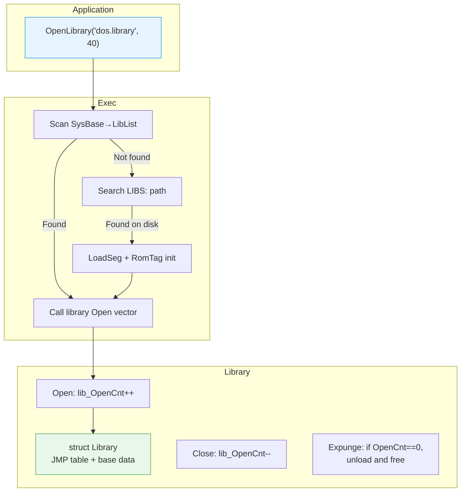
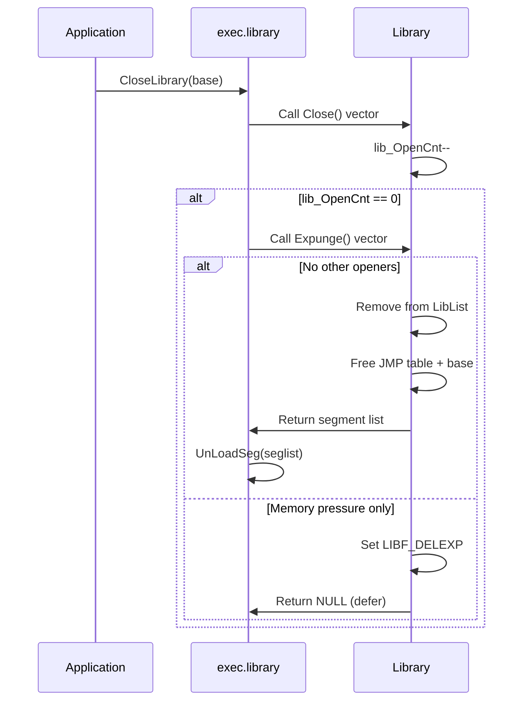

[← Home](../README.md) · [Exec Kernel](README.md)

# Library System — OpenLibrary Lifecycle, Version Management

## Overview

The AmigaOS library system provides **versioned, shared code** via a standardised interface. Libraries are identified by name, opened with a version check, and reference-counted for safe unloading. This system is the backbone of the Amiga's modular architecture — everything from `dos.library` to `intuition.library` to third-party libraries uses the same open/close/expunge lifecycle.

---

## Architecture



---

## Library Node

Every library is an `NT_LIBRARY` node on `SysBase→LibList`:

```c
/* exec/libraries.h — NDK39 */
struct Library {
    struct Node  lib_Node;       /* ln_Name = "dos.library" */
    UBYTE        lib_Flags;      /* LIBF_SUMUSED | LIBF_DELEXP */
    UBYTE        lib_Pad;
    UWORD        lib_NegSize;    /* size of JMP table in bytes */
    UWORD        lib_PosSize;    /* size of library base struct */
    UWORD        lib_Version;    /* major version */
    UWORD        lib_Revision;   /* minor revision */
    APTR         lib_IdString;   /* "dos.library 40.1 (16.7.93)" */
    ULONG        lib_Sum;        /* JMP table checksum */
    UWORD        lib_OpenCnt;    /* reference count */
};
```

### Field Reference

| Field | Description |
|---|---|
| `lib_Node.ln_Name` | Library name used for `OpenLibrary()` lookup |
| `lib_Flags` | `LIBF_SUMUSED`, `LIBF_CHANGED`, `LIBF_DELEXP` |
| `lib_NegSize` | Total size of the JMP table (negative offsets from base) |
| `lib_PosSize` | Size of the library base structure (positive offsets) |
| `lib_Version` | Major version number — checked by `OpenLibrary()` |
| `lib_Revision` | Minor revision — informational, not checked at open time |
| `lib_IdString` | Human-readable ID string with date |
| `lib_Sum` | Checksum of the JMP table (for integrity verification) |
| `lib_OpenCnt` | Number of active openers — library can't expunge while > 0 |

### Library Memory Layout

```
                    JMP table (lib_NegSize bytes)
                    ┌─────────────────────────────┐
    base - N×6:     │ JMP function_N              │
                    │ ...                         │
    base - 24:      │ JMP Reserved                │
    base - 18:      │ JMP Expunge                 │
    base - 12:      │ JMP Close                   │
    base -  6:      │ JMP Open                    │
                    ├─────────────────────────────┤
    base +  0: ───→ │ struct Library (header)      │ ← OpenLibrary returns this
                    │ (library-specific data...)   │
    base + PosSize: │ (end of base struct)        │
                    └─────────────────────────────┘
```

---

## OpenLibrary / CloseLibrary

### Opening

```c
struct DosLibrary *DOSBase =
    (struct DosLibrary *)OpenLibrary("dos.library", 40);

if (!DOSBase)
{
    /* Library not found, or version too old */
    /* This is how you enforce minimum OS version requirements */
}
```

### What OpenLibrary Does

1. **Scan `SysBase→LibList`** for a node whose `ln_Name` matches
2. **If not found**: search the resident module list (`FindResident`)
3. **If not resident**: search `LIBS:` assign path, `LoadSeg` the file, find RomTag, initialize
4. **Check version**: `lib_Version >= requestedVersion`?
5. **Call library's `Open()` vector** — library-specific initialization, `lib_OpenCnt++`
6. **Return** library base pointer (or NULL on failure)

### Closing

```c
CloseLibrary((struct Library *)DOSBase);
DOSBase = NULL;   /* Good practice — prevent use-after-close */
```

### What CloseLibrary Does

1. **Call library's `Close()` vector** — `lib_OpenCnt--`
2. **If `lib_OpenCnt == 0` and `LIBF_DELEXP` is set**: call `Expunge()` to unload
3. **If `Expunge()` returns a segment list**: `UnLoadSeg` to free the code

---

## Library Flags

| Flag | Value | Meaning |
|---|---|---|
| `LIBF_SUMUSED` | `$01` | JMP table checksum is maintained — exec verifies on close |
| `LIBF_CHANGED` | `$02` | Checksum needs recalculation (after `SetFunction`) |
| `LIBF_DELEXP` | `$04` | Deferred expunge — will expunge when last opener closes |

---

## The Expunge Lifecycle



### When Expunge Happens

- **Automatic**: When `CloseLibrary` drops `lib_OpenCnt` to 0 and memory is needed
- **System pressure**: Exec calls `Expunge()` on all libraries when `AllocMem` fails (trying to reclaim memory)
- **Manual**: `RemLibrary()` requests expunge regardless of open count

### Implementing Expunge in a Library

```c
BPTR __saveds LibExpunge(void)
{
    struct MyLibBase *base = (struct MyLibBase *)REG_A6;

    if (base->lib_OpenCnt > 0)
    {
        /* Can't unload — still in use */
        base->lib_Flags |= LIBF_DELEXP;
        return 0;  /* Signal: deferred */
    }

    /* Remove from system list */
    Remove(&base->lib_Node);

    /* Free library-specific resources */
    FreeMyResources(base);

    /* Free the library base + JMP table */
    BPTR segList = base->segList;
    ULONG negSize = base->lib_NegSize;
    ULONG posSize = base->lib_PosSize;
    FreeMem((UBYTE *)base - negSize, negSize + posSize);

    return segList;  /* Exec calls UnLoadSeg on this */
}
```

---

## Version Numbering Convention

| Version | OS Release | Example Libraries |
|---|---|---|
| 33.x | OS 1.2 | exec 33.180, dos 33.124 |
| 34.x | OS 1.3 | exec 34.2, dos 34.75 |
| 36.x | OS 2.0 | exec 36.174, dos 36.68 |
| 37.x | OS 2.04 | exec 37.175, dos 37.10 |
| 39.x | OS 3.0 | exec 39.46, dos 39.22 |
| 40.x | OS 3.1 | exec 40.70, dos 40.42 |
| 44.x | OS 3.1.4 | exec 44.5 |
| 45.x | OS 3.2 | exec 45.20 |
| 47.x | OS 3.2.2 | exec 47.3 |

### Version Check Pattern

```c
/* Require OS 3.0+ features */
struct Library *base = OpenLibrary("intuition.library", 39);
if (!base)
{
    /* Display error using OS 1.x compatible methods */
    /* Can't use features that require V39+ */
}
```

---

## Finding a Library Without Opening

```c
/* Read-only peek — no open count increment */
Forbid();
struct Library *lib = (struct Library *)
    FindName(&SysBase->LibList, "graphics.library");
if (lib)
{
    Printf("Found: %s V%ld.%ld (open: %ld)\n",
        lib->lib_Node.ln_Name,
        lib->lib_Version,
        lib->lib_Revision,
        lib->lib_OpenCnt);
}
Permit();
```

> **Caution**: The returned pointer is only valid inside the `Forbid()` section. After `Permit()`, the library could be expunged. If you need to use it, call `OpenLibrary()` instead.

---

## Pitfalls

### 1. Using Library After Close

```c
DOSBase = OpenLibrary("dos.library", 40);
/* ... */
CloseLibrary(DOSBase);
Open("RAM:test", MODE_NEWFILE);  /* CRASH — DOSBase is closed */
```

### 2. Not Checking OpenLibrary Return

```c
IntuitionBase = OpenLibrary("intuition.library", 99);
/* IntuitionBase is NULL — V99 doesn't exist */
OpenWindowTags(NULL, ...);  /* Guru — calling through NULL base */
```

### 3. Version Mismatch

```c
/* Opened V36 but calling a V39 function */
OpenLibrary("exec.library", 36);
CreatePool(...);  /* CreatePool was added in V39 — calling garbage */
```

---

## Best Practices

1. **Always check** the return value of `OpenLibrary()` — NULL means failure
2. **Request the minimum version** you actually need — don't over-specify
3. **Close in reverse order** of opening — prevents dangling references
4. **Set base pointer to NULL** after `CloseLibrary()` — catches use-after-close
5. **Use `OpenLibrary` for runtime version detection** — it's cleaner than checking `lib_Version` manually
6. **Don't use `FindName` as a substitute** for `OpenLibrary` — it doesn't bump the reference count

---

## References

- NDK39: `exec/libraries.h`, `exec/resident.h`
- ADCD 2.1: `OpenLibrary`, `CloseLibrary`, `MakeLibrary`, `RemLibrary`, `FindName`
- See also: [Library Vectors](library_vectors.md) — JMP table and LVO details
- See also: [Resident Modules](resident_modules.md) — how libraries are found in ROM
- See also: [Shared Libraries Runtime](../04_linking_and_libraries/shared_libraries_runtime.md) — full expunge lifecycle
- *Amiga ROM Kernel Reference Manual: Exec* — libraries chapter
