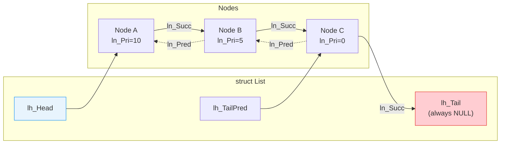

[← Home](../README.md) · [Exec Kernel](README.md)

# Lists and Nodes — MinList, List, Node, MinNode

## Overview

AmigaOS uses **intrusive doubly-linked lists** throughout exec: the task list, library list, device list, memory list, port list, and more all use the same `List`/`Node` structures defined in `exec/lists.h`. Understanding this data structure is prerequisite to understanding anything else in the kernel — every system object is a node on some list.

The term "intrusive" means the link pointers are embedded directly inside the data structure, not in a separate container. This eliminates dynamic allocation overhead but means each object can only be on one list at a time.

---

## Architecture



### The Sentinel Design

The AmigaOS list uses a clever **3-pointer sentinel** layout that eliminates special-casing for empty lists:

```
Full list:

lh_Head ──→ [Node A] ──→ [Node B] ──→ [Node C] ──→ NULL (lh_Tail)
                                         ↑
lh_TailPred ─────────────────────────────┘

Empty list:

lh_Head ──→ NULL (lh_Tail)    ← lh_Head points to lh_Tail
                ↑
lh_TailPred ────┘              ← lh_TailPred points to lh_Head
```

The `lh_Tail` field is always NULL and acts as a "dummy tail node". Walking the list stops when `node->ln_Succ == NULL` — no need to compare against a separate end marker.

---

## Structures

```c
/* exec/nodes.h — NDK39 */

struct Node {
    struct Node *ln_Succ;   /* pointer to next node (NULL at tail sentinel) */
    struct Node *ln_Pred;   /* pointer to prev node (NULL at head sentinel) */
    UBYTE        ln_Type;   /* node type — NT_TASK, NT_LIBRARY, NT_MEMORY... */
    BYTE         ln_Pri;    /* scheduling priority (used by Enqueue) */
    char        *ln_Name;   /* optional name string (NULL = anonymous) */
};

struct MinNode {
    struct MinNode *mln_Succ;
    struct MinNode *mln_Pred;
    /* no type, priority, or name — saves 6 bytes per node */
};
```

```c
/* exec/lists.h — NDK39 */

struct List {
    struct Node *lh_Head;      /* first node (or &lh_Tail if empty) */
    struct Node *lh_Tail;      /* always NULL — marks end of list */
    struct Node *lh_TailPred;  /* last node (or &lh_Head if empty) */
    UBYTE        lh_Type;      /* list type */
    UBYTE        lh_pad;
};

struct MinList {
    struct MinNode *mlh_Head;
    struct MinNode *mlh_Tail;      /* always NULL */
    struct MinNode *mlh_TailPred;
};
```

### Size Comparison

| Structure | Size | Use Case |
|---|---|---|
| `MinNode` | 8 bytes | Private lists, message queues, semaphore wait queues |
| `Node` | 14 bytes | Named/typed nodes — tasks, libraries, ports |
| `MinList` | 12 bytes | Lightweight list header |
| `List` | 14 bytes | Full list header with type |

---

## Node Type Constants

```c
/* exec/nodes.h — NDK39 */
#define NT_UNKNOWN    0    /* Unknown or uninitialized */
#define NT_TASK       1    /* exec Task */
#define NT_INTERRUPT  2    /* Interrupt server */
#define NT_DEVICE     3    /* Device driver */
#define NT_MSGPORT    4    /* Message port */
#define NT_MESSAGE    5    /* In-transit message */
#define NT_FREEMSG    6    /* Free message */
#define NT_REPLYMSG   7    /* Replied message */
#define NT_RESOURCE   8    /* System resource */
#define NT_LIBRARY    9    /* Shared library */
#define NT_MEMORY    10    /* Memory region (MemHeader) */
#define NT_SOFTINT   11    /* Software interrupt */
#define NT_FONT      12    /* Font */
#define NT_PROCESS   13    /* DOS Process (extends Task) */
#define NT_SEMAPHORE 14    /* Old-style semaphore */
#define NT_SIGNALSEM 15    /* SignalSemaphore */
#define NT_BOOTNODE  16    /* Boot node */
#define NT_KICKMEM   17    /* Kick memory */
#define NT_GRAPHICS  18    /* Graphics resource */
#define NT_DEATHMESSAGE 19 /* Task death notification */
```

---

## Initializing a List

```c
struct List myList;
NewList(&myList);   /* MANDATORY — sets up sentinel pointers */

/* Expands to: */
myList.lh_Head     = (struct Node *)&myList.lh_Tail;
myList.lh_Tail     = NULL;
myList.lh_TailPred = (struct Node *)&myList.lh_Head;
```

> **Critical**: An uninitialized list has garbage pointers. Calling `AddHead`/`AddTail` on an uninitialized list corrupts random memory.

---

## Adding Nodes

```c
/* Add at head (newest first — stack semantics): */
AddHead(&myList, &myNode);     /* LVO -240 */

/* Add at tail (oldest first — queue semantics): */
AddTail(&myList, &myNode);     /* LVO -246 */

/* Priority-ordered insert (highest ln_Pri first): */
Enqueue(&myList, &myNode);     /* LVO -270 */
/* Scans from head, inserts before first node with lower priority
   Equal priority: inserts AFTER existing nodes of same priority (FIFO) */
```

### How Enqueue Works

```
Before: [Pri 10] → [Pri 5] → [Pri 0] → NULL
Insert node with Pri 7:
After:  [Pri 10] → [Pri 7] → [Pri 5] → [Pri 0] → NULL
```

This is how `SysBase->TaskReady` stays sorted — `Enqueue` ensures the highest-priority task is always at the head.

---

## Removing Nodes

```c
/* Remove a specific node (no list pointer needed): */
Remove(&myNode);   /* LVO -252 */
/* Patches prev->ln_Succ and next->ln_Pred to skip this node */

/* Remove and return the first node: */
struct Node *first = RemHead(&myList);   /* LVO -258 */
/* Returns NULL if list is empty */

/* Remove and return the last node: */
struct Node *last = RemTail(&myList);    /* LVO -264 */
```

---

## Walking a List

### Standard Traversal

```c
struct Node *node;
for (node = myList.lh_Head;
     node->ln_Succ != NULL;    /* Stop at tail sentinel */
     node = node->ln_Succ)
{
    Printf("Node: %s (pri %ld)\n", node->ln_Name, node->ln_Pri);
}
```

### Safe Removal While Iterating

```c
/* Save next BEFORE removing, because Remove() corrupts ln_Succ */
struct Node *node, *next;
for (node = myList.lh_Head;
     (next = node->ln_Succ) != NULL;
     node = next)
{
    if (ShouldRemove(node))
    {
        Remove(node);
        FreeNode(node);
    }
}
```

### Checking if a List is Empty

```c
/* The canonical empty check: */
if (IsListEmpty(&myList)) { /* empty */ }

/* Expands to: */
if (myList.lh_TailPred == (struct Node *)&myList) { /* empty */ }
```

---

## Finding Nodes

```c
/* Find by name (case-sensitive): */
struct Node *found = FindName(&myList, "dos.library");   /* LVO -276 */
/* Returns NULL if not found */
/* Scans from head — returns first match */

/* Find next occurrence (continue scanning): */
struct Node *next = FindName(found, "dos.library");
/* Starts searching from 'found' node forward */
```

> **Warning**: `FindName` on a system list (`LibList`, `PortList`) must be done under `Forbid()` — the list can change between `FindName` and your use of the returned node.

---

## Where Lists Are Used

| System List | Location | Node Type | Purpose |
|---|---|---|---|
| `SysBase->LibList` | ExecBase | `NT_LIBRARY` | All loaded libraries |
| `SysBase->DeviceList` | ExecBase | `NT_DEVICE` | All loaded devices |
| `SysBase->ResourceList` | ExecBase | `NT_RESOURCE` | System resources |
| `SysBase->PortList` | ExecBase | `NT_MSGPORT` | Public message ports |
| `SysBase->TaskReady` | ExecBase | `NT_TASK` | Tasks ready to run |
| `SysBase->TaskWait` | ExecBase | `NT_TASK` | Tasks blocked on Wait() |
| `SysBase->MemList` | ExecBase | `NT_MEMORY` | Memory regions |
| `SysBase->SemaphoreList` | ExecBase | `NT_SIGNALSEM` | Public semaphores |
| `SysBase->IntrList` | ExecBase | `NT_INTERRUPT` | Interrupt servers |
| `MsgPort->mp_MsgList` | Per-port | `NT_MESSAGE` | Pending messages |

---

## Pitfalls

### 1. Forgetting NewList

```c
/* BUG — uninitialized list */
struct List myList;  /* Contains garbage */
AddTail(&myList, &node);  /* Writes to garbage address → Guru */
```

### 2. Node on Two Lists

```c
/* BUG — intrusive list = one list per node */
AddTail(&listA, &node);
AddTail(&listB, &node);  /* Corrupts listA — node's prev/next now point into listB */
```

### 3. Walking Without Forbid

```c
/* RACE — another task modifies the list */
struct Node *n;
for (n = SysBase->LibList.lh_Head; n->ln_Succ; n = n->ln_Succ)
{
    /* Context switch here — another task calls CloseLibrary → node removed */
    Printf("%s\n", n->ln_Name);  /* n may be freed memory */
}
```

### 4. Using Freed Node's Links

```c
Remove(&node);
FreeMem(node, ...);
/* node->ln_Succ is now garbage — never dereference after Remove+Free */
```

---

## Best Practices

1. **Always call `NewList()`** before using a list — no exceptions
2. **Use `Forbid()`** when walking system lists
3. **Use safe iteration** (save `ln_Succ` before `Remove()`) when modifying during traversal
4. **Use `Enqueue()`** for priority-sorted insertion — don't manually scan
5. **Use `MinNode`/`MinList`** for private lists to save memory
6. **Set `ln_Type`** when adding to typed lists — debugging tools rely on it
7. **Never put a node on two lists** — use a wrapper struct with two embedded nodes if needed
8. **Check `IsListEmpty()`** before `RemHead()`/`RemTail()` if NULL return is unacceptable

---

## References

- NDK39: `exec/nodes.h`, `exec/lists.h`
- ADCD 2.1: `AddHead`, `AddTail`, `Remove`, `RemHead`, `RemTail`, `Enqueue`, `FindName`, `NewList`, `IsListEmpty`
- See also: [ExecBase](exec_base.md) — system lists stored in ExecBase
- *Amiga ROM Kernel Reference Manual: Exec* — lists chapter
