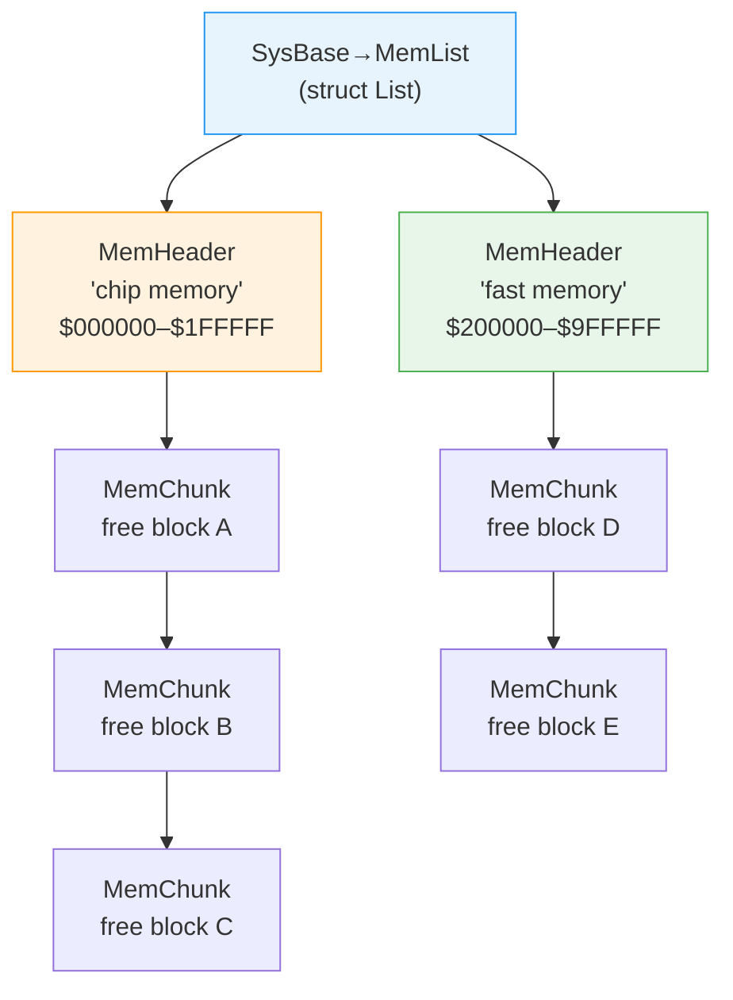

[← Home](../README.md) · [Exec Kernel](README.md)

# Memory Management — AllocMem, FreeMem, MemHeader

## Overview

AmigaOS memory management is built directly into `exec.library`. There is no `malloc`/`free` in the OS itself — applications call `AllocMem` and `FreeMem` which operate on a linked list of `MemHeader` regions representing physical RAM. The allocator is a simple **first-fit free-list** with no garbage collection, no automatic cleanup on task exit, and no memory protection. Understanding how it works is essential for writing stable Amiga software.

---

## Architecture



### How AllocMem Works

1. Walk `SysBase→MemList` — each `MemHeader` describes a physical RAM region
2. Check `mh_Attributes` against the requested `MEMF_*` flags
3. Walk the `MemChunk` free-list within the matching region
4. Find the first chunk large enough (first-fit)
5. Split the chunk: return the requested portion, keep the remainder on the free list
6. If `MEMF_CLEAR` is set, zero-fill the returned block

### How FreeMem Works

1. Find the `MemHeader` whose range contains the freed address
2. Walk the `MemChunk` free-list to find the correct insertion point (address-ordered)
3. Insert a new `MemChunk` at that position
4. Coalesce with adjacent free chunks if they're contiguous

> **Warning**: `FreeMem` trusts the caller completely. Wrong address or wrong size → free-list corruption → next `AllocMem` returns overlapping memory → system crash.

---

## MemHeader — Memory Region Descriptor

```c
/* exec/memory.h — NDK39 */
struct MemHeader {
    struct Node  mh_Node;       /* ln_Type=NT_MEMORY, ln_Pri=region priority */
                                /* ln_Name = e.g. "chip memory" */
    UWORD        mh_Attributes; /* MEMF_* flags describing this region */
    struct MemChunk *mh_First;  /* pointer to first free chunk in this region */
    APTR         mh_Lower;      /* lowest byte address of region */
    APTR         mh_Upper;      /* highest byte address + 1 */
    ULONG        mh_Free;       /* total free bytes currently */
};

struct MemChunk {
    struct MemChunk *mc_Next;   /* next free chunk (NULL = end of list) */
    ULONG            mc_Bytes;  /* size of this free chunk in bytes */
};
```

| Field | Description |
|---|---|
| `mh_Node.ln_Pri` | Region priority — higher priority regions are searched first. Fast RAM typically has higher priority than Chip RAM |
| `mh_Attributes` | `MEMF_*` flags describing this region's type |
| `mh_First` | Head of free-chunk linked list within this region |
| `mh_Lower` | Lowest byte address in this region |
| `mh_Upper` | First byte past the end of this region |
| `mh_Free` | Total bytes currently free (sum of all chunks) |

The OS maintains a doubly-linked list of `MemHeader` regions at `SysBase→MemList`. On a stock A1200:
- `"chip memory"` covering `$000000–$1FFFFF` (2 MB Chip RAM)
- `"fast memory"` covering `$200000–$9FFFFF` (up to 8 MB Fast RAM if fitted)

---

## MEMF_ Flag Constants

```c
/* exec/memory.h — NDK39 */
#define MEMF_ANY      0L          /* no placement preference */
#define MEMF_PUBLIC   (1L<<0)     /* accessible by all hardware/software */
#define MEMF_CHIP     (1L<<1)     /* must be in Chip RAM (DMA-reachable) */
#define MEMF_FAST     (1L<<2)     /* prefer Fast RAM (CPU-only, faster) */
#define MEMF_LOCAL    (1L<<8)     /* CPU-local (non-DMA) — OS 3.1+ */
#define MEMF_24BITDMA (1L<<9)     /* within 24-bit address range (for A2091) */
#define MEMF_KICK     (1L<<10)    /* Kickstart image memory */
#define MEMF_CLEAR    (1L<<16)    /* zero-fill the allocation */
#define MEMF_LARGEST  (1L<<17)    /* return single largest free block */
#define MEMF_REVERSE  (1L<<18)    /* allocate from top of list */
#define MEMF_TOTAL    (1L<<19)    /* AvailMem: report total, not largest free */
#define MEMF_NO_EXPUNGE (1L<<31)  /* do NOT expunge libraries when low — OS 3.0+ */
```

### When to Use Each Flag

| Flag | Use Case | Example |
|---|---|---|
| `MEMF_ANY` | General purpose — let the OS decide | Data buffers, structures |
| `MEMF_PUBLIC` | Shared between tasks | Message structures, port data |
| `MEMF_CHIP` | Custom chip DMA targets | Bitmaps, audio samples, Copper lists, sprite data |
| `MEMF_FAST` | CPU-only data, avoid DMA contention | Application data, code |
| `MEMF_CHIP \| MEMF_CLEAR` | Zero-filled DMA buffer | Screen bitmaps |
| `MEMF_PUBLIC \| MEMF_CLEAR` | Clean shared structure | Task structures |

**Chip RAM** is required for anything the custom chips DMA from — bitmaps, audio samples, Copper lists, blitter sources/destinations, sprite data. The custom chip DMA controllers cannot reach Fast RAM.

**Fast RAM** has no DMA contention with the custom chips, making it faster for pure CPU use. On systems with both, Exec prefers Fast RAM for `MEMF_ANY` allocations (higher `mh_Node.ln_Pri`).

---

## AllocMem / FreeMem

```c
/* exec/execbase.h — LVO -198 */
APTR AllocMem(ULONG byteSize, ULONG requirements);
/* Returns: pointer to allocated block, or NULL on failure */
/* Minimum allocation: 8 bytes (MemChunk header size) */
/* All allocations rounded up to 8-byte boundary */

/* LVO -210 */
void FreeMem(APTR memoryBlock, ULONG byteSize);
/* byteSize MUST match the original AllocMem size exactly */
```

### Usage

```c
/* Allocate 512 bytes of Chip RAM, zero-filled: */
UBYTE *buf = AllocMem(512, MEMF_CHIP | MEMF_CLEAR);
if (!buf)
{
    /* Handle out-of-memory — no exceptions, just NULL */
    return RETURN_FAIL;
}

/* Use the buffer... */

/* Free it — size MUST match exactly: */
FreeMem(buf, 512);
```

> **Critical**: `FreeMem` requires the **exact same size** as `AllocMem`. The OS does not store the size internally — you must track it yourself. Passing the wrong size corrupts the free list.

### Alignment and Granularity

| Property | Value |
|---|---|
| Minimum allocation | 8 bytes |
| Alignment | 8-byte boundary (long-word aligned) |
| Size rounding | Up to next 8-byte multiple |
| Header overhead | 0 bytes (size is caller's responsibility) |
| Thread safety | Yes — Exec disables interrupts during alloc/free |

---

## AllocVec / FreeVec (OS 2.0+)

```c
/* LVO -684 (exec.library 36+) */
APTR AllocVec(ULONG byteSize, ULONG requirements);
void FreeVec(APTR memoryBlock);   /* LVO -690 */
```

`AllocVec` stores the size in the 4 bytes immediately before the returned pointer, allowing `FreeVec` to work without a size argument:

```
AllocVec internals:
  AllocMem(byteSize + 4, requirements)
  → store byteSize at returned address
  → return (address + 4) to caller

FreeVec internals:
  size = *(ULONG *)(memoryBlock - 4)
  FreeMem(memoryBlock - 4, size + 4)
```

**Prefer `AllocVec`/`FreeVec` in new code** — eliminates the most common source of memory corruption (mismatched sizes).

---

## AvailMem — Query Free Memory

```c
/* LVO -216 */
ULONG AvailMem(ULONG requirements);
```

```c
ULONG chip_free = AvailMem(MEMF_CHIP);             /* Largest contiguous Chip block */
ULONG fast_free = AvailMem(MEMF_FAST);             /* Largest contiguous Fast block */
ULONG total_chip = AvailMem(MEMF_CHIP | MEMF_TOTAL); /* Total free Chip RAM */
ULONG total_any  = AvailMem(MEMF_TOTAL);            /* Total free memory */
```

> **Warning**: `AvailMem()` is only a snapshot — memory can be allocated by other tasks between your check and your allocation. Never rely on it for pre-flight checks.

---

## Pool Allocator (OS 3.0+)

For many small allocations, use the pool API which reduces fragmentation and improves performance:

```c
/* LVO -696 */
APTR pool = CreatePool(MEMF_ANY, 4096, 1024);
/* puddleSize = 4096 — allocate puddles of this size from the main heap
   threshSize = 1024 — allocations larger than this bypass the pool */

APTR p1 = AllocPooled(pool, 32);   /* LVO -702 */
APTR p2 = AllocPooled(pool, 64);
APTR p3 = AllocPooled(pool, 128);

FreePooled(pool, p1, 32);           /* LVO -708 */
/* p2, p3 still allocated */

DeletePool(pool);                   /* LVO -714 — frees ALL pool memory */
```

### Why Use Pools?

| Problem | Pool Solution |
|---|---|
| **Fragmentation** | Many small allocs fragment the main free list. Pools allocate large "puddles" from the main heap, sub-allocate from those |
| **Cleanup** | `DeletePool()` frees everything at once — no need to track individual allocations |
| **Performance** | Pool allocation is faster — no need to walk the entire system free list |

### Pool vs AllocMem Decision Guide

| Scenario | Use |
|---|---|
| Few large allocations (buffers, bitmaps) | `AllocMem` / `AllocVec` |
| Many small allocations (nodes, records, strings) | `CreatePool` / `AllocPooled` |
| Need to free individual items | `AllocVec` / `FreeVec` (pools can too, but no benefit) |
| Bulk cleanup on exit | `DeletePool` — frees everything |
| Need Chip RAM | `AllocMem(size, MEMF_CHIP)` (pools work too) |

---

## Memory Fragmentation

The Amiga's first-fit allocator is vulnerable to fragmentation. Over time, the free list develops many small holes that can't satisfy larger requests:

```
Initial:  [████████████████████████] 512 KB free

After use: [██░░██░██░░░░██░░██░░░░] 256 KB free
           Largest contiguous: 64 KB
           
           Even though 256 KB is free, a 128 KB allocation fails!
```

### Mitigation Strategies

1. **Use pools** for small, frequent allocations
2. **Allocate large blocks early** before fragmentation develops
3. **Use `MEMF_REVERSE`** for long-lived allocations (allocate from top of memory)
4. **Free in reverse order** when possible
5. **Pre-allocate** and sub-manage your own buffers for performance-critical code

---

## Memory Map (A1200 Example)

| Range | Type | Used for |
|---|---|---|
| `$000000–$000003` | Chip | ExecBase pointer (absolute address $4) |
| `$000004–$000400` | Chip | 68k exception vectors |
| `$000400–$000BFF` | Chip | exec library, SysBase |
| `$000C00–$07FFFF` | Chip | Application allocations, DMA buffers (512 KB) |
| `$080000–$1FFFFF` | Chip | Additional Chip RAM (if 2 MB fitted) |
| `$200000–$9FFFFF` | Fast | Fast RAM expansion (PCMCIA, trapdoor) |
| `$A00000–$BEFFFF` | — | Unmapped (A1200) |
| `$BFD000–$BFDFFF` | CIA | CIA-B registers |
| `$BFE001–$BFEFFF` | CIA | CIA-A registers |
| `$C00000–$D7FFFF` | Slow | Ranger/Slow RAM (A500 only) |
| `$DC0000–$DCFFFF` | RTC | Real-time clock (A1200) |
| `$DFF000–$DFF1FF` | Custom | Custom chip registers |
| `$E00000–$E7FFFF` | — | Reserved |
| `$E80000–$EFFFFF` | Autoconfig | Zorro II autoconfig space |
| `$F00000–$F7FFFF` | — | Reserved |
| `$F80000–$FFFFFF` | ROM | Kickstart 3.1 (512 KB) |

---

## Pitfalls

### 1. Mismatched FreeMem Size

```c
/* BUG — corrupts the free list */
APTR buf = AllocMem(100, MEMF_ANY);
FreeMem(buf, 50);   /* WRONG SIZE — free list now has a phantom 50-byte hole */
/* Next AllocMem may return memory that overlaps buf's remaining 50 bytes */
```

### 2. Double Free

```c
/* BUG — memory is already on the free list */
FreeMem(buf, 100);
FreeMem(buf, 100);  /* Corrupts free list — duplicate MemChunk */
```

### 3. Use After Free

```c
/* BUG — another task may have already received this memory */
FreeMem(buf, 100);
buf[0] = 0x42;      /* Writing to potentially allocated memory */
```

### 4. Not Checking for NULL

```c
/* BUG — MEMF_CHIP may fail if Chip RAM is exhausted */
UBYTE *bitmap = AllocMem(320 * 256 / 8, MEMF_CHIP);
memset(bitmap, 0, ...);  /* Guru if bitmap is NULL */
```

### 5. Forgetting MEMF_CHIP for DMA

```c
/* BUG — audio.device DMA can't reach Fast RAM */
WORD *samples = AllocMem(44100, MEMF_ANY);  /* May get Fast RAM */
/* Custom chip audio DMA reads garbage or causes bus error */

/* CORRECT */
WORD *samples = AllocMem(44100, MEMF_CHIP);
```

### 6. Memory Leak on Task Exit

```c
/* BUG — OS does NOT reclaim memory when task exits */
void MyTask(void)
{
    APTR buf = AllocMem(4096, MEMF_ANY);
    /* ... crash or return without FreeMem ... */
    /* 4096 bytes leaked PERMANENTLY until reboot */
}
```

---

## Best Practices

1. **Use `AllocVec`/`FreeVec`** for new code — eliminates size-tracking bugs
2. **Use pools** for many small allocations — reduces fragmentation
3. **Always check for NULL** — memory exhaustion is common on 512 KB–2 MB systems
4. **Use `MEMF_CHIP`** only when required — don't waste DMA-capable memory on CPU-only data
5. **Track all allocations** — use a resource list or goto-cleanup pattern
6. **Free in reverse order** — reduces fragmentation
7. **Use `MEMF_CLEAR`** for structures — prevents uninitialized field bugs
8. **Pre-allocate** during initialization — don't allocate in tight loops or interrupt handlers
9. **Never call `AllocMem` from interrupt context** — it may need to `Wait()`
10. **Use TypeSizeOf** — define `#define MYSIZE sizeof(struct MyStruct)` once and use everywhere

---

## References

- NDK39: `exec/memory.h`, `exec/execbase.h`
- ADCD 2.1: `AllocMem`, `FreeMem`, `AllocVec`, `FreeVec`, `CreatePool`, `AllocPooled`, `AvailMem`
- [address_space.md](../01_hardware/common/address_space.md) — full address map
- See also: [Multitasking](multitasking.md) — memory safety in multi-task environments
- *Amiga ROM Kernel Reference Manual: Exec* — memory management chapter
