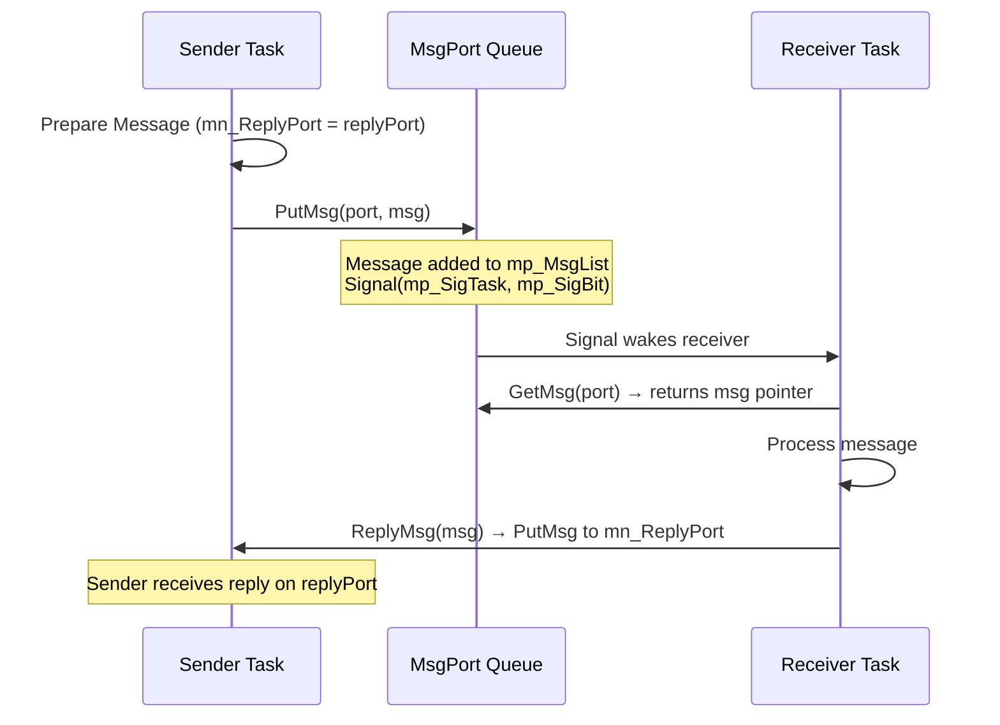

[← Home](../README.md) · [Exec Kernel](README.md)

# Message Ports — MsgPort, Message, PutMsg, GetMsg, WaitPort

## Overview

AmigaOS inter-task communication uses a **message passing** system. Tasks send `Message` structures to `MsgPort` queues. The receiving task either polls (`GetMsg`) or blocks (`WaitPort`) for incoming messages. This is the fundamental IPC mechanism — everything from [IDCMP](../09_intuition/idcmp.md) to device I/O to ARexx scripting is built on top of message ports.

Unlike pipes or sockets in Unix, Amiga messages are **zero-copy pointer exchanges**. The sender and receiver share the same physical memory — no data is copied. This makes message passing extremely fast but requires careful ownership discipline.

---

## Architecture



### Ownership Rules

This is the most critical concept in Amiga message passing:

| Phase | Message Owned By | Who Can Read/Write? |
|---|---|---|
| Before `PutMsg()` | Sender | Sender only |
| After `PutMsg()`, before `GetMsg()` | Port (in transit) | **Nobody** — message is in the queue |
| After `GetMsg()`, before `ReplyMsg()` | Receiver | Receiver only |
| After `ReplyMsg()` | Sender (via reply port) | Sender only |

> **Critical**: The sender must **not** modify or free the message between `PutMsg()` and receiving the reply. The message structure lives in the sender's memory, but it's logically owned by the receiver until replied.

---

## Core Structures

```c
/* exec/ports.h — NDK39 */

struct MsgPort {
    struct Node  mp_Node;       /* ln_Name = port name (for public ports) */
    UBYTE        mp_Flags;      /* PA_SIGNAL, PA_SOFTINT, PA_IGNORE */
    UBYTE        mp_SigBit;     /* signal bit used for PA_SIGNAL ports */
    APTR         mp_SigTask;    /* task to signal on message arrival */
    struct List  mp_MsgList;    /* queue of pending messages */
};

struct Message {
    struct Node  mn_Node;       /* ln_Type = NT_MESSAGE */
    struct MsgPort *mn_ReplyPort; /* port to send reply to (or NULL) */
    UWORD        mn_Length;     /* total size of message including header */
};
```

### MsgPort Field Reference

| Field | Description |
|---|---|
| `mp_Node.ln_Name` | Port name — set for public (findable) ports, NULL for private |
| `mp_Flags` | Notification method when message arrives |
| `mp_SigBit` | Which signal bit to set when message arrives (for `PA_SIGNAL`) |
| `mp_SigTask` | Which task to signal (for `PA_SIGNAL`) or softint to trigger |
| `mp_MsgList` | Standard exec List — pending messages queue (FIFO) |

### mp_Flags Values

| Value | Constant | Behavior |
|---|---|---|
| 0 | `PA_SIGNAL` | Signal `mp_SigTask` with `1L << mp_SigBit` when message arrives |
| 1 | `PA_SOFTINT` | Trigger the software interrupt pointed to by `mp_SigTask` |
| 2 | `PA_IGNORE` | Do nothing — port must be polled with `GetMsg()` |

---

## Creating and Destroying Ports

### OS 2.0+ (Preferred)

```c
struct MsgPort *port = CreateMsgPort();   /* LVO -732 */
/* Automatically:
   - Allocates memory
   - Allocates a signal bit
   - Sets mp_Flags = PA_SIGNAL
   - Sets mp_SigTask = FindTask(NULL)
   - Initializes mp_MsgList */

if (!port) { /* All signal bits exhausted */ }

/* Cleanup: */
DeleteMsgPort(port);   /* LVO -738 */
/* Frees signal bit and memory */
```

### Manual Creation (OS 1.x Compatible)

```c
struct MsgPort *port = AllocMem(sizeof(struct MsgPort), MEMF_PUBLIC | MEMF_CLEAR);
port->mp_Node.ln_Type = NT_MSGPORT;
port->mp_Flags        = PA_SIGNAL;
port->mp_SigBit       = AllocSignal(-1);
port->mp_SigTask      = FindTask(NULL);
NewList(&port->mp_MsgList);

/* Cleanup (reverse order): */
FreeSignal(port->mp_SigBit);
FreeMem(port, sizeof(struct MsgPort));
```

---

## Sending Messages

```c
/* PutMsg: add message to queue, signal receiver */
PutMsg(targetPort, (struct Message *)myMsg);
/* Non-blocking — returns immediately
   Can be called from interrupt context
   Sender must NOT modify msg until reply received */
```

### What PutMsg Does Internally

1. Adds the message to the tail of `targetPort->mp_MsgList`
2. Sets `mn_Node.ln_Type = NT_MESSAGE`
3. If `mp_Flags == PA_SIGNAL`: calls `Signal(mp_SigTask, 1L << mp_SigBit)`
4. If `mp_Flags == PA_SOFTINT`: triggers the software interrupt
5. Returns — does not wait

---

## Receiving Messages

### Blocking Wait

```c
/* Block until at least one message is pending: */
WaitPort(myPort);   /* LVO -384 */
/* Equivalent to: Wait(1L << myPort->mp_SigBit) + signal clear */

/* Drain the queue (may have multiple messages): */
struct Message *msg;
while ((msg = GetMsg(myPort)) != NULL)
{
    /* Process message */
    ReplyMsg(msg);  /* Send reply — required for request-reply pattern */
}
```

### Non-Blocking Poll

```c
struct Message *msg = GetMsg(myPort);   /* LVO -372 */
/* Returns NULL if queue is empty — never blocks */
```

### Multi-Port Wait

```c
/* Wait on multiple ports simultaneously */
ULONG portSig1 = 1L << port1->mp_SigBit;
ULONG portSig2 = 1L << port2->mp_SigBit;

ULONG received = Wait(portSig1 | portSig2 | SIGBREAKF_CTRL_C);

if (received & portSig1)
{
    struct Message *msg;
    while ((msg = GetMsg(port1))) { /* ... */ ReplyMsg(msg); }
}
if (received & portSig2)
{
    struct Message *msg;
    while ((msg = GetMsg(port2))) { /* ... */ ReplyMsg(msg); }
}
```

---

## The Request-Reply Pattern

The standard bidirectional communication idiom:

```c
/* --- Sender --- */
struct MyMessage {
    struct Message msg;     /* MUST be first field */
    ULONG  command;
    ULONG  result;
    APTR   data;
};

struct MsgPort *replyPort = CreateMsgPort();

struct MyMessage request;
request.msg.mn_ReplyPort = replyPort;
request.msg.mn_Length    = sizeof(struct MyMessage);
request.command          = CMD_DO_WORK;
request.data             = myData;

PutMsg(serverPort, &request.msg);

/* Wait for reply */
WaitPort(replyPort);
GetMsg(replyPort);

/* Now request.result contains the server's response */
DeleteMsgPort(replyPort);

/* --- Receiver (Server) --- */
WaitPort(serverPort);
struct MyMessage *req;
while ((req = (struct MyMessage *)GetMsg(serverPort)))
{
    /* Process */
    req->result = DoWork(req->command, req->data);

    /* Reply — wakes sender */
    ReplyMsg(&req->msg);
}
```

---

## Public Named Ports

Public ports are registered on `SysBase→PortList` and findable by name:

```c
/* Register: */
port->mp_Node.ln_Name = "myapp.port";
AddPort(port);   /* LVO -354 — adds to SysBase→PortList */

/* Find from another task: */
Forbid();
struct MsgPort *remote = FindPort("myapp.port");   /* LVO -390 */
if (remote)
    PutMsg(remote, myMsg);
Permit();

/* Unregister: */
RemPort(port);   /* LVO -360 */
```

> **Critical**: `Forbid()` is required around `FindPort()` + `PutMsg()`. Without it, the server task could call `RemPort()` between your `FindPort()` and `PutMsg()`, leaving you with a dangling pointer.

---

## Pitfalls

### 1. Not Replying to Messages

```c
/* BUG — sender is blocked waiting for reply forever */
msg = GetMsg(port);
/* ... process but forget to ReplyMsg ... */
/* Sender hangs on WaitPort(replyPort) indefinitely */
```

### 2. Modifying Message Before Reply

```c
/* BUG — message is logically owned by receiver */
PutMsg(server, &msg);
msg.data = newData;      /* WRONG — receiver may be reading msg.data right now */
WaitPort(replyPort);     /* Race condition */
```

### 3. Deleting Port with Pending Messages

```c
/* BUG — messages in queue still reference the port */
DeleteMsgPort(port);   /* Leaked messages, dangling reply port pointers */

/* SAFE — drain first */
struct Message *msg;
while ((msg = GetMsg(port)))
    ReplyMsg(msg);
DeleteMsgPort(port);
```

### 4. FindPort Without Forbid

```c
/* RACE — server may RemPort between find and send */
struct MsgPort *p = FindPort("SERVER");   /* Port exists... */
/* Context switch — server task exits, calls RemPort() */
PutMsg(p, msg);   /* CRASH — p is now freed memory */
```

### 5. Stack-Allocated Messages with Async Reply

```c
/* BUG — message on stack, function returns before reply */
void SendRequest(struct MsgPort *server)
{
    struct MyMessage msg;
    msg.msg.mn_ReplyPort = replyPort;
    PutMsg(server, &msg.msg);
    /* Function returns — stack frame destroyed */
    /* Reply arrives later → writes to invalid stack memory */
}
```

---

## Best Practices

1. **Always drain ports** before deleting — `while (GetMsg(port)) ReplyMsg(msg)`
2. **Always reply** to received messages — the sender may be waiting
3. **Use `Forbid()`** around `FindPort()` + `PutMsg()` for public ports
4. **Use heap-allocated messages** for async patterns — never stack-local
5. **Set `mn_Length`** correctly — some system code uses it for validation
6. **Set `mn_ReplyPort`** to NULL if no reply is expected — receiver checks this
7. **Use `PA_SIGNAL`** for normal ports — `PA_SOFTINT` only for device-level code
8. **Create separate reply ports** per conversation — don't share reply ports between multiple pending requests

---

## References

- NDK39: `exec/ports.h`, `exec/messages.h`
- ADCD 2.1: `CreateMsgPort`, `DeleteMsgPort`, `PutMsg`, `GetMsg`, `WaitPort`, `ReplyMsg`, `AddPort`, `RemPort`, `FindPort`
- See also: [Signals](signals.md), [Multitasking](multitasking.md) — IPC strategies comparison
- *Amiga ROM Kernel Reference Manual: Exec* — messages and ports chapter
