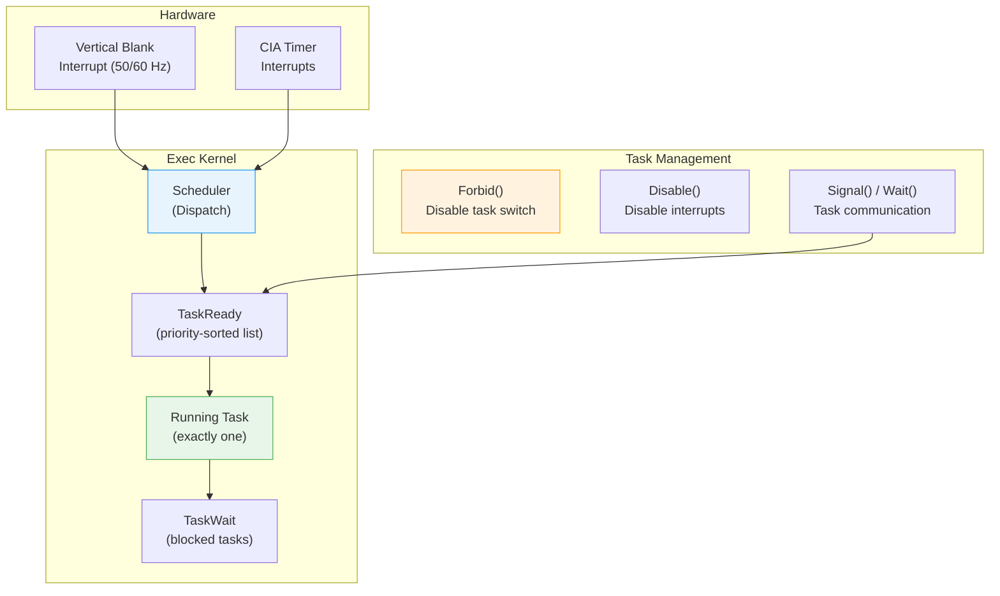
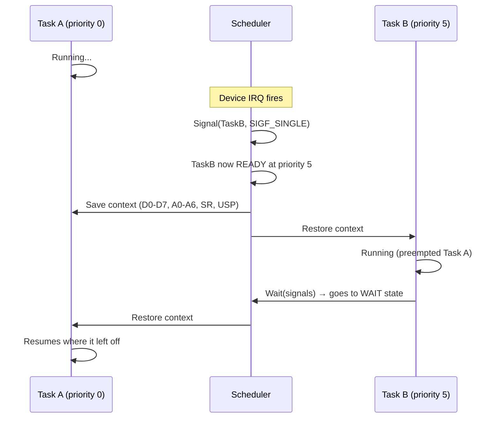
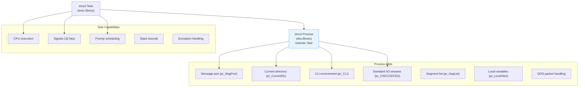
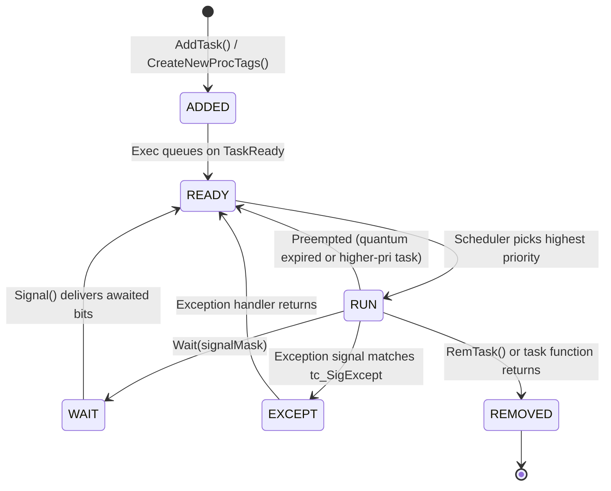
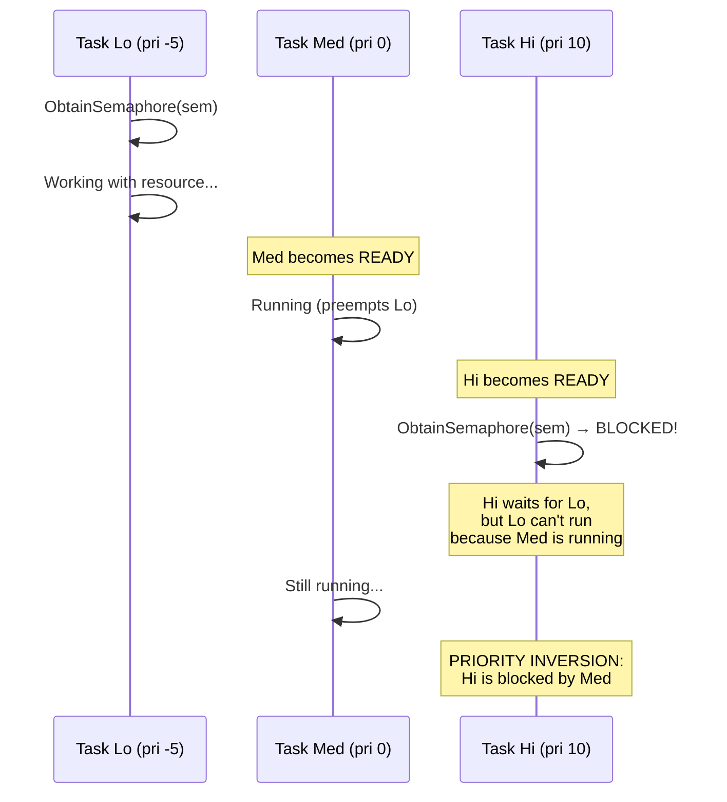
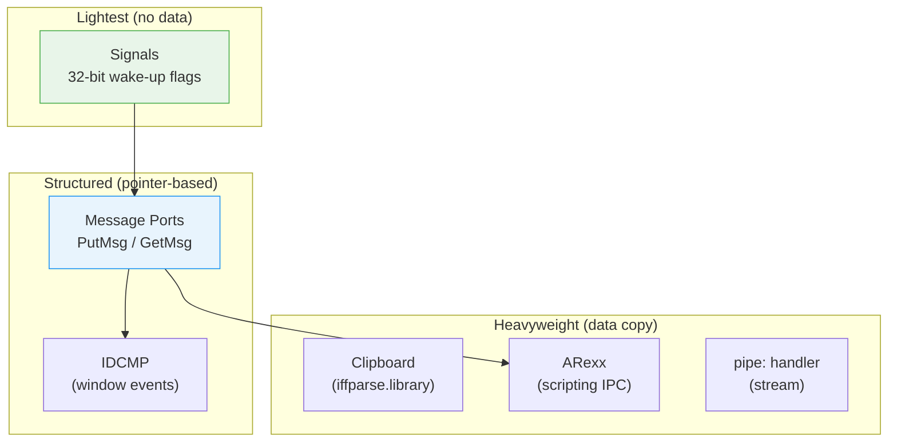

[← Home](../README.md) · [Exec Kernel](README.md)

# Multitasking — How AmigaOS Runs Multiple Programs

## Why This Article Exists

Amiga multitasking is one of the most misunderstood topics in retrocomputing. It's often described as "cooperative" when it's actually **preemptive**. It's called "primitive" when it actually implements patterns found in modern RTOS kernels. And its most dangerous characteristics — no memory protection, flat address space, voluntary resource management — are also the source of its most impressive qualities: near-zero context switch overhead, zero-copy message passing, and real-time responsiveness on a 7 MHz processor.

This article explains exactly how it works, from the interrupt that drives scheduling to the patterns that keep it from crashing.

---

## Architecture Overview



### The Key Facts

| Property | Value |
|---|---|
| **Type** | Preemptive, priority-based with round-robin among equals |
| **Designer** | Carl Sassenrath (also designed REBOL) |
| **Address space** | Single flat space — all tasks share one map |
| **Memory protection** | None — any task can read/write any address |
| **Context switch cost** | ~78 µs on 68000 (save/restore D0-D7, A0-A6, SR, USP) |
| **Minimum quantum** | 1 VBL period (20 ms PAL, 16.7 ms NTSC) |
| **Max tasks** | Limited only by available memory |
| **Task priorities** | −128 to +127 (signed byte) |
| **Signals per task** | 32 bits (16 system-reserved + 16 application) |

---

## The Scheduler

### How Scheduling Decisions Are Made

The scheduler runs in three situations:

1. **Timer interrupt** — the VBL interrupt (level 3) fires every 20 ms (PAL) or 16.7 ms (NTSC). If the current task's quantum has expired and another ready task exists at the same priority, the scheduler rotates.

2. **Explicit rescheduling** — calling `Wait()`, `Signal()`, `RemTask()`, or `SetTaskPri()` triggers an immediate scheduling decision. This is how the system achieves sub-quantum response times.

3. **Interrupt exit** — after any interrupt handler completes, the scheduler checks whether the interrupt handler changed the task state (e.g., `Signal()` from a device driver). If a higher-priority task became ready, the context switch happens immediately.

### The Algorithm

```
1. If Forbid() is active (tc_TDNestCnt >= 0):
     → Do NOT switch. Return to current task.
     
2. Scan TaskReady list (sorted by priority, highest first):
     → Pick the first task (highest priority).
     
3. If selected task has HIGHER priority than current:
     → Preempt: save current context, switch immediately.
     
4. If selected task has EQUAL priority to current:
     → If quantum expired: rotate (round-robin).
     → If quantum not expired: continue current task.
     
5. If selected task has LOWER priority than current:
     → Continue current task.
```

### What Makes It "Preemptive"

The term "preemptive" means the OS can forcibly stop a running task and switch to another — the task does not need to volunteer. On the Amiga, this happens via the VBL interrupt:



### Why It's Sometimes Called "Cooperative"

The system is preemptive by design, but several factors give it cooperative characteristics:

| Factor | Impact |
|---|---|
| **No memory protection** | A misbehaving task can overwrite the scheduler itself |
| **`Forbid()`** | Any task can disable preemption indefinitely |
| **`Disable()`** | Any task can stop all interrupts (and thus scheduling) |
| **Shared resources** | Libraries, hardware registers, Chip RAM — all unprotected |
| **No automatic cleanup** | If a task crashes, its memory, ports, and signals leak |

The OS *provides* preemption, but it *cannot enforce* it. A "cooperative" culture was required because the hardware couldn't protect against abuse.

---

## Context Switching Internals

### What Gets Saved

When Exec switches from Task A to Task B:

```
1. Save Task A's registers:
   - D0–D7 (8 × 32-bit data registers)
   - A0–A6 (7 × 32-bit address registers)
   - USP (user stack pointer)
   - SR (status register — condition codes, interrupt mask)
   - PC (program counter — saved by the exception frame)
   
2. Store saved SP in Task A's tc_SPReg

3. Move Task A to TaskReady list (or TaskWait if it called Wait())

4. Load Task B's context from tc_SPReg:
   - Restore D0–D7, A0–A6, USP, SR
   
5. RTE (Return from Exception) → resumes Task B at its saved PC
```

### What Does NOT Get Saved

| Component | Saved? | Consequence |
|---|---|---|
| CPU registers (D0-D7, A0-A6) | ✅ Yes | |
| Stack pointer (USP) | ✅ Yes | |
| Status register | ✅ Yes | |
| FPU registers (FP0-FP7) | ⚠️ Only if FPU task switch enabled | Must enable `FPUINIT` or tasks corrupt each other's FPU state |
| MMU state (TC, TT, SRP) | ❌ No | All tasks share one translation tree |
| Hardware registers | ❌ No | Tasks must save/restore their own custom chip state |
| Open file handles | ❌ No | Belong to the Process, not managed by context switch |

### Performance: Context Switch Cost

| CPU | Clock | Switch Time | Relative |
|---|---|---|---|
| 68000 | 7.09 MHz | ~78 µs | Baseline |
| 68020 | 14 MHz | ~25 µs | 3× faster |
| 68030 | 25 MHz | ~12 µs | 6× faster |
| 68040 | 25 MHz | ~6 µs | 13× faster |
| 68060 | 50 MHz | ~2 µs | 39× faster |

For comparison, a Linux context switch on a modern x86 takes ~1–5 µs but must also flush TLB entries, switch page tables, and potentially handle speculative execution cleanup. The Amiga's flat address space eliminates all of that overhead.

---

## Forbid() and Disable() — Critical Sections

### Forbid() — Task-Level Lock

```c
Forbid();
/* No other task can run here — but interrupts still fire */
/* Safe to access shared data structures */
Permit();
```

**How it works**: Increments `SysBase->TDNestCnt`. While ≥ 0, the scheduler skips task switching. Interrupts continue to run — hardware is not affected.

**Critical rule**: If you call `Wait()` inside a `Forbid()` section, the forbid is **temporarily suspended**. Other tasks run while you're waiting. When your wait completes, the forbid is automatically re-established.

### Disable() — Interrupt-Level Lock

```c
Disable();
/* No interrupts, no task switching — system is frozen */
/* Only use for accessing interrupt-shared hardware state */
Enable();
```

**How it works**: Masks all CPU interrupts by setting the interrupt priority level to 7 in the SR. Also implies Forbid().

### When to Use What

| Situation | Use | Why |
|---|---|---|
| Accessing a shared linked list | `Forbid()`/`Permit()` | Other tasks can't modify the list |
| Reading IntuitionBase fields | `Forbid()`/`Permit()` | Prevents Intuition from changing state |
| Modifying hardware registers that an interrupt handler also touches | `Disable()`/`Enable()` | Stops the interrupt handler from running |
| Walking `SysBase->LibList` | `Forbid()`/`Permit()` | Prevents library open/close during walk |
| Modifying interrupt vectors | `Disable()`/`Enable()` | An interrupt during modification = crash |
| Signaling another task | Neither | `Signal()` is atomic — no protection needed |

### Nesting

Both functions nest correctly:

```c
Forbid();         /* TDNestCnt = 0 */
  Forbid();       /* TDNestCnt = 1 */
  Permit();       /* TDNestCnt = 0 */
Permit();         /* TDNestCnt = -1 → scheduling re-enabled */
```

### Timing Constraints

| Function | Maximum Safe Duration | Consequence of Exceeding |
|---|---|---|
| `Forbid()` | ~100 ms (several frames) | System feels "stuck" — mouse stops, audio stutters |
| `Disable()` | **~250 µs** | Serial data loss, audio DMA glitches, floppy errors |

---

## Task vs Process



| Feature | Task | Process |
|---|---|---|
| CPU scheduling | ✅ | ✅ |
| Signals | ✅ | ✅ |
| `FindTask()` | ✅ | ✅ |
| `OpenLibrary()` | ✅ | ✅ |
| DOS functions (`Open()`, `Read()`, etc.) | ❌ | ✅ |
| `Printf()` / console I/O | ❌ | ✅ |
| AmigaDOS path resolution | ❌ | ✅ |
| CLI / Shell interaction | ❌ | ✅ |
| Workbench startup | ❌ | ✅ |

**Rule**: If you need to access files, the console, or any DOS function — you need a Process, not a Task.

---

## Creating Tasks and Processes

### Creating a Raw Task (exec level)

```c
#define STACK_SIZE 4096

APTR stack = AllocMem(STACK_SIZE, MEMF_PUBLIC | MEMF_CLEAR);
struct Task *task = AllocMem(sizeof(struct Task), MEMF_PUBLIC | MEMF_CLEAR);

task->tc_Node.ln_Type = NT_TASK;
task->tc_Node.ln_Name = "MyWorker";
task->tc_Node.ln_Pri  = 0;
task->tc_SPLower = stack;
task->tc_SPUpper = (APTR)((ULONG)stack + STACK_SIZE);
task->tc_SPReg   = task->tc_SPUpper;  /* Stack grows downward */

AddTask(task, WorkerEntry, CleanupEntry);
/* WorkerEntry = task's main function
   CleanupEntry = called if WorkerEntry returns (optional, can be NULL) */
```

> **Warning**: The creating task must NOT free the stack or Task structure after `AddTask()` — the new task is using them. Cleanup must happen inside the task itself or via a finalizer.

### Creating a Process (DOS level)

```c
struct Process *proc = CreateNewProcTags(
    NP_Entry,       MyProcessFunc,
    NP_Name,        "MyProcess",
    NP_StackSize,   8192,
    NP_Priority,    0,
    NP_CurrentDir,  DupLock(GetProgramDir()),
    NP_Input,       NULL,       /* No input stream */
    NP_Output,      NULL,       /* No output stream */
    NP_CloseInput,  FALSE,
    NP_CloseOutput, FALSE,
    TAG_DONE);

if (!proc)
{
    Printf("Failed to create process\n");
}
```

### Common NP_ Tags

| Tag | Type | Description |
|---|---|---|
| `NP_Entry` | `APTR` | Entry point function |
| `NP_Name` | `STRPTR` | Task name (must persist!) |
| `NP_StackSize` | `ULONG` | Stack size in bytes |
| `NP_Priority` | `LONG` | Scheduling priority (−128 to +127) |
| `NP_CurrentDir` | `BPTR` | Working directory lock |
| `NP_Input` | `BPTR` | Input file handle |
| `NP_Output` | `BPTR` | Output file handle |
| `NP_Error` | `BPTR` | Error output (OS 3.0+) |
| `NP_CloseInput` | `BOOL` | Close input handle on exit? |
| `NP_CloseOutput` | `BOOL` | Close output handle on exit? |
| `NP_CopyVars` | `BOOL` | Copy parent's local variables? |
| `NP_Seglist` | `BPTR` | Pre-loaded segment list |

---

## Task Lifecycle



### Task State Transitions in Code

```c
/* Task creation */
AddTask(task, entry, cleanup);           /* ADDED → READY */

/* Running task voluntarily blocks */
Wait(SIGBREAKF_CTRL_C | mySig);         /* RUN → WAIT */

/* Another task or interrupt wakes it */
Signal(task, mySig);                     /* WAIT → READY */

/* Scheduler preempts for higher priority */
/* (automatic — no code needed)           /* RUN → READY */

/* Task exits */
/* (task function returns)                /* RUN → REMOVED */
RemTask(NULL);  /* Or explicit removal */ /* RUN → REMOVED */
```

---

## Priority Guidelines

| Priority | Typical User | Notes |
|---|---|---|
| **21** | input.device | Must process input before anything else |
| **20** | Intuition input handler | GUI event dispatch |
| **10** | DOS/filesystem handlers | Disk I/O, packet handling |
| **5** | Time-critical applications | Real-time audio, network |
| **0** | Normal applications | Default — most programs run here |
| **−1** | Background tasks | Low-priority batch work |
| **−128** | Idle task | Only runs when nothing else can |

### Priority Inversion

The Amiga has **no priority inheritance**. If a high-priority task waits on a semaphore held by a low-priority task, and a medium-priority task is running — the high-priority task starves:



**Mitigation**: Keep critical sections short. Don't `Forbid()` or hold semaphores across I/O operations.

---

## Signal and Wait — The Scheduling Primitives

Every `Wait()` call is a scheduling decision. Every `Signal()` call may trigger one.

```c
/* Allocate a private signal */
BYTE sigBit = AllocSignal(-1);
if (sigBit == -1) { /* error: all 16 application bits used */ }
ULONG mySig = 1L << sigBit;

/* Wait for any of multiple sources */
ULONG received = Wait(mySig | SIGBREAKF_CTRL_C);

if (received & mySig)         /* Our custom signal */
if (received & SIGBREAKF_CTRL_C) /* User pressed Ctrl+C */

/* Free when done */
FreeSignal(sigBit);
```

### Signal Bit Map

```
Bit 31            Bit 16  Bit 15            Bit 0
┌────────────────┬────────────────────────────┐
│  System-reserved │  Application-allocatable  │
│  (Exec internal) │  (AllocSignal)            │
└────────────────┴────────────────────────────┘

Bit 4:  SIGB_SINGLE  (single-step/blitter)
Bit 5:  SIGB_INTUITION
Bit 8:  SIGB_DOS
Bit 12: SIGBREAKB_CTRL_C  (Ctrl+C break)
Bit 13: SIGBREAKB_CTRL_D
Bit 14: SIGBREAKB_CTRL_E
Bit 15: SIGBREAKB_CTRL_F
```

---

## The Memory Protection Question

### What Other OSes Do

| OS | Memory Model | Task Isolation | Context Switch Cost |
|---|---|---|---|
| **AmigaOS** | Flat — single address space | None | ~78 µs (68000) |
| **Unix (1985)** | Per-process virtual memory | Full MMU protection | ~500 µs+ (VAX) |
| **Mac OS Classic** | Flat — single address space | None | ~100 µs (68000) |
| **Windows 3.x** | Segmented, cooperative | Minimal | N/A (cooperative) |
| **Linux (modern)** | Per-process virtual memory | Full MMU + ASLR | ~1–5 µs (x86-64) |

### Why No Protection?

1. **Hardware cost**: The 68000 has no MMU. The 68010+ can support one, but the add-on cards were expensive
2. **Performance**: Page table walks and TLB flushes would destroy the real-time responsiveness
3. **Design philosophy**: Zero-copy message passing requires tasks to share memory directly
4. **Memory constraints**: 256 KB–512 KB systems couldn't afford per-process page tables

### Consequences

| Risk | Impact | Mitigation |
|---|---|---|
| **Wild pointer** | Corrupts any memory — OS, other tasks, hardware | Use Enforcer/MuForce (requires MMU) |
| **Stack overflow** | Silently corrupts memory below the stack | Monitor `tc_SPLower`; use adequate stack sizes |
| **Memory leak** | No automatic cleanup on task exit | Manually free all allocations; use memory tracking tools |
| **Port leak** | `FindPort()` finds a dead task's port → crash | Remove ports before exiting; use `Forbid()` around port operations |
| **Library base corruption** | One task corrupts a library base used by all tasks | Never write to library base structures |

### Enforcer — Retrospective Protection

On 68020+ systems with an MMU, the **Enforcer** tool maps page 0 and unallocated memory as invalid. This catches:

```
Enforcer Hit:  READ-WORD FROM 0000000C    PC: 00F80234
        Task: MyBuggyApp  Data: 00000000 00F80100 ...
```

This does not prevent the crash — it merely reports it. True memory isolation was never part of AmigaOS's design.

---

## Shutdown and Cleanup Patterns

### Task Self-Cleanup

```c
void __saveds MyTaskEntry(void)
{
    struct Task *me = FindTask(NULL);

    /* Allocate resources */
    BYTE sigBit = AllocSignal(-1);
    struct MsgPort *port = CreateMsgPort();
    APTR mem = AllocMem(1024, MEMF_PUBLIC);

    /* Main loop */
    BOOL running = TRUE;
    while (running)
    {
        ULONG received = Wait((1L << sigBit) | SIGBREAKF_CTRL_C);
        if (received & SIGBREAKF_CTRL_C) running = FALSE;
    }

    /* MUST free everything — OS does NOT do this for Tasks */
    FreeMem(mem, 1024);
    DeleteMsgPort(port);
    FreeSignal(sigBit);

    /* Task function return → RemTask() is called automatically */
}
```

### Parent-Child Signaling

```c
/* Parent creates child and waits for it to exit */
struct Task *parent = FindTask(NULL);
BYTE childDoneSig = AllocSignal(-1);
ULONG childDoneMask = 1L << childDoneSig;

/* Pass parent task pointer and signal to child via a shared structure */
struct ChildArgs args = {
    .parentTask = parent,
    .doneSig    = childDoneMask,
};

struct Process *child = CreateNewProcTags(
    NP_Entry,    ChildFunc,
    NP_Name,     "ChildProcess",
    NP_StackSize, 4096,
    TAG_DONE);

/* Child receives args via a message or global; signals parent when done: */
/* Signal(args->parentTask, args->doneSig); */

/* Parent waits */
Wait(childDoneMask);
FreeSignal(childDoneSig);
```

---

## Inter-Process Communication (IPC) Strategies

AmigaOS provides multiple IPC mechanisms, each with different trade-offs:



### Choosing the Right IPC Mechanism

| Mechanism | Overhead | Data Transfer | Direction | Best For |
|---|---|---|---|---|
| **Signals** | Zero — single 68k instruction | None (just a wake-up) | One-way | "Something happened" notifications |
| **Message Ports** | Low — pointer exchange, no copy | Pointer to message struct | Two-way (request-reply) | Structured task-to-task communication |
| **Shared Memory** | Zero — direct access | Pointer agreement | Multi-way | High-speed data sharing (with semaphore) |
| **IDCMP** | Medium — Intuition overhead | IntuiMessage fields | One-way (Intuition → app) | Window/GUI events |
| **ARexx** | High — string parsing | String messages | Two-way | Inter-application scripting |
| **Clipboard** | High — data copy + format | IFF chunks via iffparse | Multi-way (global) | User-visible cut/copy/paste |
| **pipe: handler** | High — stream I/O + DOS overhead | Byte stream | One-way | Shell pipeline, process chaining |

### Pattern: Message Port Communication

```c
/* --- Server task --- */
struct MsgPort *serverPort = CreateMsgPort();
serverPort->mp_Node.ln_Name = "MY_SERVER";
AddPort(serverPort);  /* Make it public — findable by name */

while (running)
{
    WaitPort(serverPort);
    struct MyMessage *msg;
    while ((msg = (struct MyMessage *)GetMsg(serverPort)))
    {
        /* Process the request */
        msg->result = DoWork(msg->command, msg->data);

        /* Reply — sender is blocked until we do this */
        ReplyMsg((struct Message *)msg);
    }
}

RemPort(serverPort);
DeleteMsgPort(serverPort);

/* --- Client task --- */
struct MsgPort *replyPort = CreateMsgPort();

Forbid();
struct MsgPort *server = FindPort("MY_SERVER");
if (server)
{
    struct MyMessage msg = { 0 };
    msg.msg.mn_ReplyPort = replyPort;
    msg.msg.mn_Length = sizeof(struct MyMessage);
    msg.command = CMD_DO_SOMETHING;
    msg.data = myData;

    PutMsg(server, (struct Message *)&msg);
    Permit();

    /* Wait for reply */
    WaitPort(replyPort);
    GetMsg(replyPort);

    /* msg.result now has the server's response */
}
else
{
    Permit();
    /* Server not running */
}

DeleteMsgPort(replyPort);
```

### Pattern: Shared Memory with Semaphore

Zero-copy data sharing for high-frequency communication:

```c
/* Shared data structure */
struct SharedBuffer {
    struct SignalSemaphore lock;
    ULONG  writeCount;
    UBYTE  data[4096];
};

/* Initialize (before creating child tasks) */
struct SharedBuffer *shared = AllocMem(sizeof(struct SharedBuffer),
    MEMF_PUBLIC | MEMF_CLEAR);
InitSemaphore(&shared->lock);

/* Writer */
ObtainSemaphore(&shared->lock);        /* Exclusive access */
CopyMem(newData, shared->data, size);
shared->writeCount++;
ReleaseSemaphore(&shared->lock);
Signal(readerTask, updateSig);          /* Notify reader */

/* Reader */
ObtainSemaphoreShared(&shared->lock);   /* Multiple readers OK */
ProcessData(shared->data);
ReleaseSemaphoreShared(&shared->lock);
```

### Pattern: ARexx Inter-Application Scripting

```c
/* Register an ARexx port */
struct MsgPort *arexxPort = CreateMsgPort();
arexxPort->mp_Node.ln_Name = "MYAPP";
AddPort(arexxPort);

/* Handle incoming ARexx commands */
struct RexxMsg *rmsg;
while ((rmsg = (struct RexxMsg *)GetMsg(arexxPort)))
{
    STRPTR command = ARG0(rmsg);

    if (stricmp(command, "QUIT") == 0)
    {
        rmsg->rm_Result1 = 0;  /* Success */
        running = FALSE;
    }
    else if (stricmp(command, "GETVERSION") == 0)
    {
        rmsg->rm_Result1 = 0;
        rmsg->rm_Result2 = (LONG)CreateArgstring("1.0", 3);
    }
    else
    {
        rmsg->rm_Result1 = 10;  /* Error: unknown command */
    }

    ReplyMsg((struct Message *)rmsg);
}
```

This lets users script your application from the Shell:
```
rx "ADDRESS MYAPP; GETVERSION"
```

---

## Defensive Programming Without Memory Protection

### The Ground Rules

In a no-MMU system, **your bug crashes everyone**. Defensive programming isn't optional — it's the only thing between your application and a Guru Meditation:

### 1. Validate Before Dereference

```c
/* BAD — NULL dereference = read from address 0 = system vectors */
struct Window *win = OpenWindowTags(...);
win->RPort->...  /* If OpenWindowTags failed, win is NULL → Guru */

/* GOOD — always check */
struct Window *win = OpenWindowTags(...);
if (!win)
{
    Cleanup();
    return RETURN_FAIL;
}
```

### 2. Track Every Allocation

```c
/* Use a resource tracker — free everything on any exit path */
struct Window *win     = NULL;
struct Screen *scr     = NULL;
APTR           mem     = NULL;
struct MsgPort *port   = NULL;

/* Acquire */
if (!(mem = AllocMem(1024, MEMF_PUBLIC))) goto cleanup;
if (!(port = CreateMsgPort())) goto cleanup;
if (!(scr = OpenScreenTags(NULL, ...))) goto cleanup;
if (!(win = OpenWindowTags(NULL, ...))) goto cleanup;

/* Work... */

cleanup:
    /* Free in reverse order — always safe, even if some are NULL */
    if (win)  CloseWindow(win);
    if (scr)  CloseScreen(scr);
    if (port) DeleteMsgPort(port);
    if (mem)  FreeMem(mem, 1024);
```

### 3. Never Pass Stack Addresses to Other Tasks

```c
/* LETHAL — child task accesses parent's stack frame */
void ParentFunc(void)
{
    char buffer[256];
    LaunchChild(buffer);  /* buffer is ON THE STACK */
    return;               /* Stack frame destroyed — child reads garbage */
}

/* SAFE — allocate from heap */
void ParentFunc(void)
{
    char *buffer = AllocMem(256, MEMF_PUBLIC);
    LaunchChild(buffer);
    /* Child frees buffer when done, or parent waits for child */
}
```

### 4. Use TypedMem Patterns

```c
/* Always pair AllocMem with FreeMem using the SAME size */
#define MYBUF_SIZE 4096

APTR buf = AllocMem(MYBUF_SIZE, MEMF_PUBLIC);
/* ... use buf ... */
FreeMem(buf, MYBUF_SIZE);  /* MUST match exactly */

/* If you pass wrong size to FreeMem, you corrupt the free list
   and the NEXT AllocMem may return overlapping memory */
```

### 5. Protect Public Port Lookups

```c
/* RACE CONDITION — port may vanish between FindPort and PutMsg */
struct MsgPort *port = FindPort("SOME_SERVER");
PutMsg(port, msg);  /* Server may have exited! → crash */

/* SAFE — Forbid() prevents the server from RemPort() between find and send */
Forbid();
struct MsgPort *port = FindPort("SOME_SERVER");
if (port)
    PutMsg(port, msg);
Permit();
```

### 6. Drain Ports Before Closing

```c
/* CRASH — messages still in port reference your task's memory */
DeleteMsgPort(port);  /* Messages from other tasks now point to freed memory */

/* SAFE — drain and reply first */
struct Message *msg;
while ((msg = GetMsg(port)))
    ReplyMsg(msg);
DeleteMsgPort(port);
```

---

## Real-World Scenarios

### Glitch-Free Audio Playback

Audio on the Amiga uses DMA — the Paula chip reads samples directly from Chip RAM. If the CPU doesn't refill the buffer before DMA reaches the end, you hear a click or loop of stale data. The solution is a **double-buffered interrupt-driven** design:

```c
/* Two buffers in Chip RAM — Paula reads one while CPU fills the other */
#define BUFSIZE 8192
WORD *bufA = AllocMem(BUFSIZE, MEMF_CHIP);
WORD *bufB = AllocMem(BUFSIZE, MEMF_CHIP);
volatile WORD *currentBuf = bufA;
volatile BOOL  needRefill  = FALSE;

/* Audio interrupt — fires when DMA finishes a buffer */
void __interrupt AudioDone(void)
{
    /* Swap buffers — Paula now reads the other one */
    currentBuf = (currentBuf == bufA) ? bufB : bufA;

    /* Point audio DMA to the freshly filled buffer */
    custom.aud[0].ac_ptr = (UWORD *)currentBuf;
    custom.aud[0].ac_len = BUFSIZE / 2;  /* word count */

    /* Signal the main task — DON'T decode audio here! */
    needRefill = TRUE;
    Signal(playerTask, audioSig);
}

/* Player task — runs at priority 5 (above normal apps) */
void PlayerTask(void)
{
    while (playing)
    {
        Wait(audioSig | SIGBREAKF_CTRL_C);

        if (needRefill)
        {
            needRefill = FALSE;
            WORD *fillBuf = (currentBuf == bufA) ? bufB : bufA;
            DecodeNextChunk(fillBuf, BUFSIZE);  /* CPU-intensive — safe here */
        }
    }
}
```

**Why priority 5?** Normal applications at priority 0 may compute for an entire quantum (20 ms). At 22 kHz stereo, an 8 KB buffer lasts ~93 ms. A priority-5 task preempts priority-0 immediately when signaled, ensuring the buffer is refilled well before DMA underruns.

**Why not priority 20?** You'd starve the input handler and make the system unresponsive during playback. Priority 5 is high enough to preempt normal apps but low enough to let input and filesystem handlers run.

### How Debuggers Pause and Resume Tasks

A debugger like SAS/C's `cpr` or the ROM Wack needs to stop another task's execution, inspect its state, and resume it. Here's how:

```c
/* 1. Prevent the target from being scheduled */
Forbid();

/* 2. Check if it's running (it shouldn't be — we're in Forbid) */
struct Task *target = FindTask("TargetApp");
if (target && target->tc_State != TS_RUN)
{
    /* 3. Save the target's signal state */
    ULONG savedSigs = target->tc_SigRecvd;

    /* 4. Remove from TaskReady or TaskWait */
    Remove(&target->tc_Node);
    target->tc_State = TS_SUSPENDED;  /* custom state — debugger's concept */

    Permit();

    /* 5. Now inspect registers — they're saved in the task's stack frame */
    /* tc_SPReg points to the saved context on the task's stack:
       SP → [SR] [PC] [D0-D7] [A0-A6] */

    /* 6. User examines state, sets breakpoints, etc. */
    WaitForDebuggerCommand();

    /* 7. Resume: re-add to the ready list */
    Forbid();
    Enqueue(&SysBase->TaskReady, &target->tc_Node);
    target->tc_State = TS_READY;
    Permit();
    /* Scheduler will pick it up on next reschedule */
}
else
{
    Permit();
}
```

**Trap-based breakpoints**: The debugger writes a `TRAP #0` instruction (opcode `$4E40`) at the breakpoint address. When the target hits it, the 68k vectors to the trap handler (vector $80). The debugger's trap handler saves all registers, signals the debugger task, and suspends the target.

> **Note**: This is why the Amiga has no "process isolation" for debugging — the debugger directly reads/writes the target's memory and manipulates its task structure. Modern debuggers use `ptrace()` system calls; Amiga debuggers use `Forbid()` + direct memory access.

### Background File Copy with Progress

A file copier that stays responsive while copying large files:

```c
/* Main task: GUI + event loop at priority 0 */
/* Worker task: file copy at priority -1 (below normal) */

struct CopyState {
    struct SignalSemaphore lock;
    volatile ULONG  bytesCopied;
    volatile ULONG  totalBytes;
    volatile BOOL   cancel;
    volatile BOOL   done;
    struct Task    *mainTask;
    ULONG           progressSig;
};

/* Worker (priority -1 — yields to GUI) */
void CopyWorker(void)
{
    struct CopyState *cs = /* ... received via message ... */;

    while (!cs->cancel && bytesLeft > 0)
    {
        LONG n = Read(src, buf, MIN(4096, bytesLeft));
        Write(dst, buf, n);
        bytesLeft -= n;

        /* Update progress — protected because main task reads it */
        ObtainSemaphore(&cs->lock);
        cs->bytesCopied += n;
        ReleaseSemaphore(&cs->lock);

        /* Signal main task to update progress bar */
        Signal(cs->mainTask, cs->progressSig);
    }

    cs->done = TRUE;
    Signal(cs->mainTask, cs->progressSig);
}

/* Main task event loop */
if (sigs & progressSig)
{
    ObtainSemaphoreShared(&cs->lock);
    ULONG pct = (cs->bytesCopied * 100) / cs->totalBytes;
    ReleaseSemaphoreShared(&cs->lock);
    UpdateProgressBar(pct);

    if (cs->done) DisplayBeep(NULL);  /* Done! */
}
```

**Why priority -1?** File I/O involves disk seeks and DMA — the worker spends most of its time in `Wait()` inside `Read()`/`Write()`. At priority -1, it never preempts GUI event handling, so the mouse stays smooth. When the disk is idle, it runs immediately.

### Screen Blanker (Commodities Pattern)

A screen blanker monitors input activity and blanks the screen after a timeout — a perfect use case for the [Commodities Exchange](../09_intuition/input_events.md):

```c
/* Commodities broker — priority 51, above Intuition */
/* Sees all input events before Intuition processes them */

struct InputEvent *BlankerHandler(struct InputEvent *events, APTR data)
{
    struct BlankerData *bd = (struct BlankerData *)data;

    /* Any input at all = reset the idle timer */
    if (events)
    {
        bd->lastActivity = ReadEClock(&bd->ecval);
        if (bd->blanked)
        {
            bd->blanked = FALSE;
            Signal(bd->mainTask, bd->unblankSig);
        }
    }

    return events;  /* Always pass through — blanker doesn't consume */
}

/* Main task checks timer */
while (running)
{
    ULONG sigs = Wait(timerSig | unblankSig | SIGBREAKF_CTRL_C);

    if (sigs & timerSig)
    {
        ULONG now = ReadEClock(&ecval);
        if ((now - bd.lastActivity) > BLANK_TIMEOUT && !bd.blanked)
        {
            bd.blanked = TRUE;
            ScreenToBack(IntuitionBase->ActiveScreen);
            /* Or use LoadRGB4() to set all colors to black */
        }
        /* Restart timer */
    }

    if (sigs & unblankSig)
    {
        ScreenToFront(wbScreen);
        /* Restore colors */
    }
}
```

---

## Comparison with Modern Systems

| Concept | AmigaOS Exec | POSIX (Linux/macOS) | Windows NT | FreeRTOS |
|---|---|---|---|---|
| **Unit of execution** | Task / Process | Thread / Process | Thread / Process | Task |
| **Creation** | `AddTask()` / `CreateNewProcTags()` | `pthread_create()` / `fork()` | `CreateThread()` | `xTaskCreate()` |
| **Scheduling** | Priority + round-robin | CFS / priority | Priority + round-robin | Priority (no round-robin) |
| **Synchronization** | Signals + Semaphores | Signals + Mutexes + Condvars | Events + Mutexes + Semaphores | Notifications + Mutexes |
| **IPC** | Message ports (`PutMsg`/`GetMsg`) | Pipes / Sockets / SHM | Named pipes / COM / RPC | Queues |
| **Memory isolation** | None | Full (MMU) | Full (MMU) | None (typically) |
| **Context switch** | ~78 µs (68000) | ~1–5 µs (x86-64) | ~1–5 µs | ~1–10 µs (ARM Cortex-M) |
| **Idle behavior** | `Wait()` halts CPU | `sched_yield()` / sleep | `WaitForSingleObject()` | `vTaskDelay()` |

---

## Pitfalls

### 1. Forgetting That Tasks Share Memory

```c
/* BUG — stack-local buffer shared with another task */
char buffer[256];
LaunchChildTask(buffer);  /* Child accesses parent's stack! */
/* If parent returns, child reads garbage or crashes system */
```

### 2. Forbid() Across I/O

```c
/* BUG — Forbid blocks all tasks, but I/O takes time */
Forbid();
Read(file, buf, 65536);  /* Other tasks starve for seconds */
Permit();

/* CORRECT — use a semaphore */
ObtainSemaphore(&mySem);
Read(file, buf, 65536);   /* Other tasks still run */
ReleaseSemaphore(&mySem);
```

### 3. Leaking Resources on Exit

Unlike modern OSes, AmigaOS does **not** reclaim a dead task's memory, ports, or signals. If your task crashes:

- All `AllocMem()` blocks are leaked permanently
- All `CreateMsgPort()` ports remain on the system port list
- All `AllocSignal()` bits are lost from the task's signal pool
- All open file handles are leaked

### 4. Stack Overflow

There is no guard page. If a task overflows its stack, it silently writes into whatever memory is below:

```c
/* Typical stack overflow scenario */
void RecursiveFunction(int depth)
{
    char localBuffer[256];  /* Eats 256+ bytes per call */
    RecursiveFunction(depth + 1);  /* Eventually corrupts system */
}
```

**Rule of thumb**: Allocate at least 4 KB for simple tasks, 8 KB for tasks that call DOS, 16+ KB for tasks that use floating point or deep call chains.

### 5. Using Intuition/DOS from a Task

```c
/* CRASH — DOS functions require a Process */
struct Task *t = AllocMem(sizeof(struct Task), ...);
AddTask(t, MyFunc, NULL);

void MyFunc(void)
{
    Open("RAM:test", MODE_NEWFILE);  /* Guru Meditation — no pr_MsgPort */
}

/* CORRECT — use CreateNewProcTags() instead of AddTask() */
```

---

## Best Practices

1. **Use `CreateNewProcTags()`** for anything that needs DOS — raw `AddTask()` only for OS-level workers
2. **Use `Wait()`** instead of busy-polling — it yields the CPU and costs zero cycles while sleeping
3. **Keep `Forbid()` sections short** — microseconds, not milliseconds
4. **Never use `Disable()` for task-level synchronization** — use `Forbid()` or semaphores
5. **Use semaphores** for shared data access — they allow other tasks to run while waiting
6. **Always clean up resources** — `FreeMem()`, `DeleteMsgPort()`, `FreeSignal()` before task exit
7. **Use Enforcer** during development — catches NULL pointer and wild memory accesses
8. **Set adequate stack sizes** — 4 KB minimum, 8 KB if calling DOS, more for deep recursion
9. **Handle `SIGBREAKF_CTRL_C`** — users expect Ctrl+C to stop your task
10. **Use priority 0** for normal applications — raising priority without justification starves other tasks

---

## References

- NDK 3.9: `exec/tasks.h`, `exec/execbase.h`, `dos/dosextens.h`, `dos/dostags.h`
- ADCD 2.1: `AddTask()`, `RemTask()`, `FindTask()`, `SetTaskPri()`, `CreateNewProcTags()`, `Forbid()`, `Permit()`, `Disable()`, `Enable()`
- *Amiga ROM Kernel Reference Manual: Exec* — Chapters on Tasks, Scheduling, and Multitasking
- See also: [Tasks & Processes](tasks_processes.md), [Signals](signals.md), [Semaphores](semaphores.md), [Message Ports](message_ports.md)
