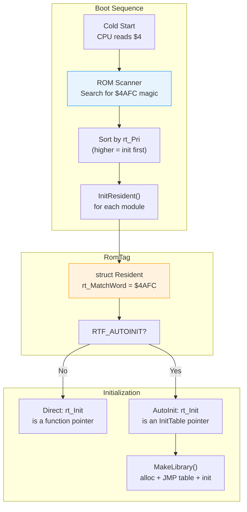

[← Home](../README.md) · [Exec Kernel](README.md)

# Resident Modules — RomTag, RTF_AUTOINIT, FindResident

## Overview

AmigaOS ROM and disk-resident modules (libraries, devices, resources) identify themselves via a **RomTag** structure. At boot, exec scans the Kickstart ROM and any loaded segments for RomTags and initialises every module it finds. The RomTag system is how the kernel discovers and bootstraps itself — exec.library, graphics.library, dos.library, and all ROM-resident code use this mechanism.

---

## Architecture



---

## struct Resident (RomTag)

```c
/* exec/resident.h — NDK39 */
struct Resident {
    UWORD  rt_MatchWord;    /* always $4AFC — magic identifier */
    struct Resident *rt_MatchTag; /* pointer back to this struct (self-ref) */
    APTR   rt_EndSkip;      /* pointer past end of this module's code */
    UBYTE  rt_Flags;        /* RTF_* flags */
    UBYTE  rt_Version;      /* module version number */
    UBYTE  rt_Type;         /* NT_LIBRARY, NT_DEVICE, NT_RESOURCE, ... */
    BYTE   rt_Pri;          /* initialisation priority (higher = earlier) */
    char  *rt_Name;         /* module name string, e.g. "dos.library" */
    char  *rt_IdString;     /* human-readable ID, e.g. "dos.library 40.1" */
    APTR   rt_Init;         /* init function or InitTable pointer */
};
```

### Field Reference

| Field | Description |
|---|---|
| `rt_MatchWord` | `$4AFC` — the 68k `ILLEGAL` opcode. If CPU accidentally executes a RomTag, it traps immediately instead of running garbage |
| `rt_MatchTag` | Self-referential pointer — must point back to this struct. Used to verify the match isn't a false positive |
| `rt_EndSkip` | Address past the end of this module's code/data. Scanner skips to here after finding the tag |
| `rt_Flags` | `RTF_AUTOINIT`, `RTF_SINGLETASK`, `RTF_COLDSTART`, `RTF_AFTERDOS` |
| `rt_Version` | Module version number — used by `FindResident` version checks |
| `rt_Type` | Node type: `NT_LIBRARY`, `NT_DEVICE`, `NT_RESOURCE` |
| `rt_Pri` | Initialization priority. Higher = initialized earlier in boot. exec.library has the highest |
| `rt_Name` | Module name — matches the `OpenLibrary`/`OpenDevice` name |
| `rt_IdString` | Human-readable string with version, date. Convention: `"name version.revision (dd.mm.yy)\r\n"` |
| `rt_Init` | If `RTF_AUTOINIT`: pointer to `InitTable`. Otherwise: pointer to init function |

---

## RTF_ Flags

```c
#define RTF_AUTOINIT   (1<<7)   /* rt_Init → InitTable (auto library creation) */
#define RTF_AFTERDOS   (1<<2)   /* init after DOS is available (OS 2.0+) */
#define RTF_SINGLETASK (1<<1)   /* init in single-task mode (before multitasking) */
#define RTF_COLDSTART  (1<<0)   /* init on cold boot only (not warm reset) */
```

| Flag | Timing | Use Case |
|---|---|---|
| `RTF_SINGLETASK` | Before multitasking starts | exec.library, expansion.library |
| `RTF_COLDSTART` | During cold boot, multitasking active | graphics.library, intuition.library |
| `RTF_AFTERDOS` | After dos.library is initialized | diskfont.library, workbench.library |

---

## RTF_AUTOINIT — Automatic Initialisation

When `RTF_AUTOINIT` is set, `rt_Init` points to an `InitTable`:

```c
struct InitTable {
    ULONG  it_DataSize;     /* AllocMem size for library base struct */
    APTR  *it_FuncTable;    /* function pointer array (for MakeFunctions) */
    APTR   it_DataTable;    /* InitStruct data (INITBYTE/INITWORD/INITLONG) */
    APTR   it_InitRoutine;  /* called after base is allocated and populated */
};
```

### What AUTOINIT Does

1. `AllocMem(it_DataSize, MEMF_PUBLIC | MEMF_CLEAR)` — allocate library base
2. `MakeFunctions(base, it_FuncTable, NULL)` — build JMP table
3. `InitStruct(it_DataTable, base, 0)` — fill in default field values
4. `it_InitRoutine(base)` — library-specific initialization
5. `AddLibrary(base)` — add to `SysBase→LibList`

This automates the boilerplate that every library needs.

### Data Initialization Macros

```c
/* exec/initializers.h */
#define INITBYTE(offset, value)  0xE000|(offset), (value)
#define INITWORD(offset, value)  0xD000|(offset), (value)
#define INITLONG(offset, value)  0xC000|(offset), (value)

/* Example data table: */
UWORD dataTable[] = {
    INITBYTE(OFFSET(Library, lib_Node.ln_Type), NT_LIBRARY),
    INITLONG(OFFSET(Library, lib_Node.ln_Name), (ULONG)"mylib.library"),
    INITBYTE(OFFSET(Library, lib_Flags), LIBF_SUMUSED | LIBF_CHANGED),
    INITWORD(OFFSET(Library, lib_Version), 1),
    INITWORD(OFFSET(Library, lib_Revision), 0),
    0  /* terminator */
};
```

---

## ROM Scan at Boot

During exec initialisation:

1. Walk from Kickstart base (`$F80000` for 512K ROM, `$FC0000` for 256K) upward
2. Search for the `$4AFC` magic word at even addresses
3. For each match, verify:
   - `rt_MatchTag` points back to itself (self-referential)
   - `rt_EndSkip` is past the RomTag structure
4. Add valid entries to `SysBase→ResModules` (a NULL-terminated array of Resident pointers)
5. Sort by `rt_Pri` (highest first)
6. Call `InitResident()` for each, in priority order

### Boot Priority Order

| Priority | Module | Why First |
|---|---|---|
| 126 | exec.library | Kernel — must be first |
| 120 | expansion.library | Autoconfig hardware detection |
| 105 | graphics.library | Custom chip initialization |
| 100 | layers.library | Display layer management |
| 70 | intuition.library | GUI system |
| 50 | cia.resource | CIA chip management |
| 0 | dos.library | File system |
| −50 | ram-handler | RAM disk |
| −120 | workbench.library | Desktop environment |

---

## Finding a Resident by Name

```c
struct Resident *res = FindResident("dos.library");   /* LVO -96 */
if (res)
{
    Printf("Found: %s V%ld (pri %ld)\n",
        res->rt_Name, res->rt_Version, res->rt_Pri);
}
```

`FindResident` scans the `SysBase→ResModules` array — the list of all RomTag pointers collected at boot.

---

## Disk-Resident Modules

Libraries not in ROM are loaded from `LIBS:` when first opened:

1. `OpenLibrary("mylib.library", 0)` — not found in `LibList` or `ResModules`
2. Exec searches `LIBS:` assign path
3. `LoadSeg("LIBS:mylib.library")` — loads the HUNK executable
4. Scan loaded segments for RomTag (`$4AFC`)
5. `InitResident()` — creates the library
6. Add to `LibList` — subsequent opens find it in memory

---

## Writing a Minimal RomTag

### Assembly

```asm
; Minimal ROM tag for a library
        CNOP    0,4              ; long-word align
_RomTag:
        dc.w    $4AFC            ; rt_MatchWord (ILLEGAL opcode)
        dc.l    _RomTag          ; rt_MatchTag (self-reference)
        dc.l    _EndTag          ; rt_EndSkip
        dc.b    RTF_AUTOINIT     ; rt_Flags
        dc.b    1                ; rt_Version
        dc.b    NT_LIBRARY       ; rt_Type
        dc.b    0                ; rt_Pri
        dc.l    _Name            ; rt_Name
        dc.l    _IdString        ; rt_IdString
        dc.l    _InitTable       ; rt_Init → InitTable

_Name:
        dc.b    "mylib.library",0
_IdString:
        dc.b    "mylib.library 1.0 (23.4.2026)",13,10,0
        even

_InitTable:
        dc.l    MYLIB_SIZE       ; it_DataSize
        dc.l    _FuncTable       ; it_FuncTable
        dc.l    _DataTable       ; it_DataTable
        dc.l    _InitRoutine     ; it_InitRoutine

_FuncTable:
        dc.l    _LibOpen
        dc.l    _LibClose
        dc.l    _LibExpunge
        dc.l    _LibNull         ; Reserved
        dc.l    _MyFunction1
        dc.l    _MyFunction2
        dc.l    -1               ; terminator

_EndTag:
```

### C (with SAS/C)

```c
struct Resident myRomTag = {
    RTC_MATCHWORD,
    &myRomTag,        /* self-reference */
    &endTag,
    RTF_AUTOINIT,
    1,                /* version */
    NT_LIBRARY,
    0,                /* priority */
    "mylib.library",
    "mylib.library 1.0 (23.4.2026)\r\n",
    &initTable
};
```

---

## Pitfalls

### 1. Missing Self-Reference

```asm
; BUG — rt_MatchTag doesn't point back to the RomTag
_RomTag:
    dc.w    $4AFC
    dc.l    0           ; WRONG — must be _RomTag
```

Scanner won't recognize this as a valid RomTag.

### 2. Incorrect EndSkip

```asm
; BUG — EndSkip points inside the module code
    dc.l    _RomTag+20  ; WRONG — scanner may skip data it shouldn't
```

`rt_EndSkip` must point past ALL code and data belonging to this module.

### 3. Wrong Priority

```c
/* BUG — initializing before a dependency is ready */
.rt_Pri = 100,  /* Higher than graphics.library */
/* If your library opens graphics.library in init, it's not loaded yet */
```

---

## References

- NDK39: `exec/resident.h`, `exec/initializers.h`, `exec/execbase.h`
- ADCD 2.1: `FindResident`, `InitResident`, `MakeLibrary`, `InitStruct`
- See also: [Library System](library_system.md) — how OpenLibrary uses RomTags
- See also: [Library Vectors](library_vectors.md) — JMP table construction
- *Amiga ROM Kernel Reference Manual: Exec* — resident modules chapter
