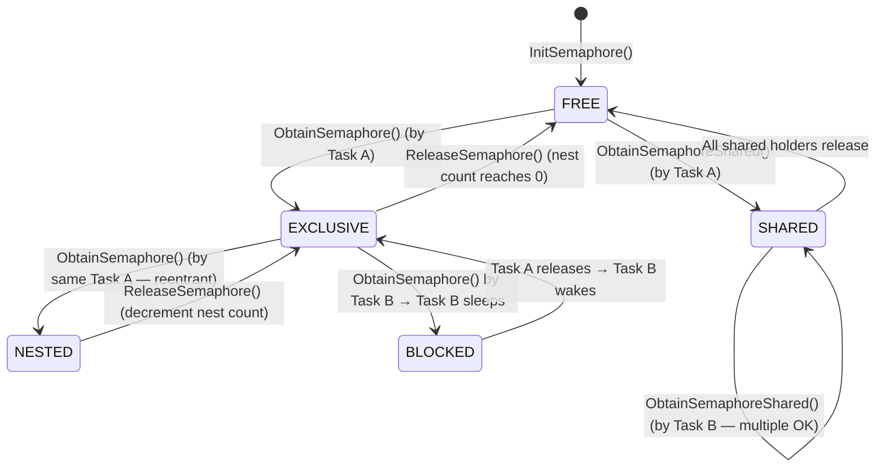
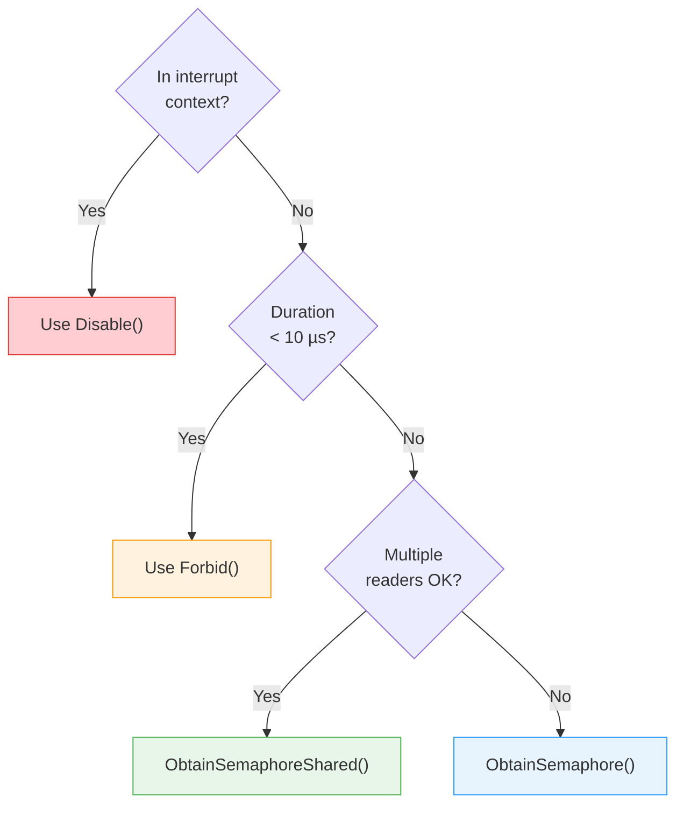

[← Home](../README.md) · [Exec Kernel](README.md)

# Semaphores — SignalSemaphore, ObtainSemaphore, Shared/Exclusive

## Overview

Semaphores are the AmigaOS mechanism for **mutual exclusion and shared-read access** to resources. Unlike `Forbid()` (which blocks all scheduling), semaphores allow other tasks to run while waiting — the waiting task simply sleeps until the resource is available. They are the correct synchronization primitive for anything that takes more than a few microseconds.

---

## Architecture



### Shared vs Exclusive

| Mode | Multiple holders? | Use case |
|---|---|---|
| **Exclusive** (`ObtainSemaphore`) | No — only one task at a time | Writing/modifying shared data |
| **Shared** (`ObtainSemaphoreShared`) | Yes — multiple readers allowed | Read-only access to shared data |

When a task requests exclusive access while shared holders exist, it blocks until ALL shared holders release. When a task requests shared access while an exclusive holder exists, it blocks until the exclusive holder releases.

---

## struct SignalSemaphore

```c
/* exec/semaphores.h — NDK39 */
struct SignalSemaphore {
    struct Node  ss_Link;       /* ln_Type = NT_SIGNALSEM */
                                /* ln_Name = semaphore name (public) */
    WORD         ss_NestCount;  /* how many times THIS task has obtained it */
    struct MinList ss_WaitQueue;/* tasks waiting for access */
    struct SemaphoreRequest ss_MultipleLink; /* shared-reader management */
    struct Task *ss_Owner;      /* task holding exclusive lock (or NULL) */
    WORD         ss_QueueCount; /* internal waiter tracking */
};
```

| Field | Description |
|---|---|
| `ss_Link.ln_Name` | Name string — set for public (findable) semaphores |
| `ss_NestCount` | How many times the current owner has obtained it (reentrant) |
| `ss_WaitQueue` | Queue of tasks waiting for access |
| `ss_Owner` | Task holding exclusive lock, or NULL if free/shared-only |
| `ss_QueueCount` | Internal — tracks waiting tasks and shared readers |

---

## Initializing a Semaphore

```c
/* Stack or heap — always initialize before use: */
struct SignalSemaphore sem;
InitSemaphore(&sem);   /* LVO -558 */

/* Public (named) semaphore — findable by other tasks: */
sem.ss_Link.ln_Name = "myapp.lock";
sem.ss_Link.ln_Pri  = 0;
AddSemaphore(&sem);    /* LVO -564 — adds to SysBase→SemaphoreList */

/* Find from another task: */
Forbid();
struct SignalSemaphore *found = FindSemaphore("myapp.lock");  /* LVO -576 */
Permit();

/* Cleanup: */
RemSemaphore(&sem);    /* LVO -570 */
```

---

## Exclusive (Write) Lock

```c
/* Block until this task holds the semaphore exclusively: */
ObtainSemaphore(&sem);    /* LVO -534 */

/* --- critical section: only one task in here at a time --- */
ModifySharedData();

ReleaseSemaphore(&sem);   /* LVO -546 */
```

### Non-Blocking Try

```c
/* Returns TRUE if obtained, FALSE if someone else holds it: */
if (AttemptSemaphore(&sem))     /* LVO -540 */
{
    /* Got exclusive access */
    ModifySharedData();
    ReleaseSemaphore(&sem);
}
else
{
    /* Resource busy — do something else or retry later */
}
```

### Shared-to-Exclusive Upgrade (OS 3.0+)

```c
/* AttemptSemaphoreShared — try shared lock without blocking */
if (AttemptSemaphoreShared(&sem))   /* LVO -774 */
{
    /* Got shared access */
    ReadSharedData();
    ReleaseSemaphore(&sem);
}
```

---

## Shared (Read) Lock

Multiple tasks may hold a shared lock simultaneously. An exclusive lock request blocks until all shared holders release.

```c
ObtainSemaphoreShared(&sem);   /* LVO -768 */

/* --- read-only access: multiple tasks may be here at once --- */
result = ReadSharedData();

ReleaseSemaphore(&sem);        /* Same release for both modes */
```

---

## Nesting (Reentrancy)

Semaphores are **reentrant** — the same task can call `ObtainSemaphore` multiple times without deadlocking itself:

```c
ObtainSemaphore(&sem);   /* NestCount = 1, Owner = thisTask */
ObtainSemaphore(&sem);   /* NestCount = 2 — safe, same task */
ObtainSemaphore(&sem);   /* NestCount = 3 */
ReleaseSemaphore(&sem);  /* NestCount = 2 */
ReleaseSemaphore(&sem);  /* NestCount = 1 */
ReleaseSemaphore(&sem);  /* NestCount = 0 — fully released, waiters wake */
```

This is essential for recursive functions or library code that may be called from contexts that already hold the lock.

---

## Obtaining Multiple Semaphores

To avoid deadlocks when you need multiple semaphores, use `ObtainSemaphoreList`:

```c
/* Build a list of semaphores to obtain atomically: */
struct SemaphoreRequest reqA, reqB;
struct List semList;
NewList(&semList);

reqA.sr_Semaphore = &semA;
reqB.sr_Semaphore = &semB;
AddTail(&semList, &reqA.sr_Link);
AddTail(&semList, &reqB.sr_Link);

ObtainSemaphoreList(&semList);   /* LVO -582 */
/* Both semaphores held — no deadlock risk */

ReleaseSemaphore(&semA);
ReleaseSemaphore(&semB);
```

---

## Semaphore vs Forbid vs Disable

| Mechanism | Blocks | Other tasks run? | Interrupt safe? | Cost | Max duration |
|---|---|---|---|---|---|
| `Forbid()` | All task switching | ❌ No | ✅ Ints still run | Very low | ~100 ms |
| `Disable()` | All ints + tasks | ❌ No | ✅ (is the lock) | Lowest | **~250 µs** |
| `ObtainSemaphore()` | Only contending tasks | ✅ Yes | ❌ Not from IRQ | Medium | Unlimited |
| `ObtainSemaphoreShared()` | Only if exclusive held | ✅ Yes | ❌ Not from IRQ | Medium | Unlimited |

### Decision Guide



---

## Pitfalls

### 1. Deadlock (Lock Ordering)

```c
/* Task A */                    /* Task B */
ObtainSemaphore(&semX);        ObtainSemaphore(&semY);
ObtainSemaphore(&semY); /*!*/  ObtainSemaphore(&semX); /*!*/
/* Task A waits for Y           Task B waits for X
   → DEADLOCK — both tasks sleep forever */
```

**Solution**: Always obtain semaphores in the same global order (alphabetical, by address, etc.).

### 2. Priority Inversion

```c
/* Low-pri task holds semaphore, medium-pri task runs,
   high-pri task waits for semaphore → high-pri starves.
   AmigaOS has NO priority inheritance. */
```

**Solution**: Keep critical sections short; don't hold semaphores across I/O.

### 3. ObtainSemaphore from Interrupt Context

```c
/* CRASH — ObtainSemaphore may Wait(), which is illegal from interrupts */
void __interrupt MyHandler(void)
{
    ObtainSemaphore(&sem);  /* DEADLOCK or crash */
}
```

**Solution**: Use `Disable()`/`Enable()` for interrupt-level synchronization, or use `AttemptSemaphore()` (non-blocking) and skip if busy.

### 4. Forgetting to Release

```c
/* BUG — semaphore held forever */
ObtainSemaphore(&sem);
if (error) return;          /* Returns without releasing! */
ReleaseSemaphore(&sem);

/* CORRECT — use cleanup pattern */
ObtainSemaphore(&sem);
if (error) goto cleanup;
/* ... work ... */
cleanup:
ReleaseSemaphore(&sem);
```

### 5. Shared/Exclusive Mismatch

```c
/* Not a bug, but confusing — ReleaseSemaphore works for both modes */
ObtainSemaphoreShared(&sem);
ReleaseSemaphore(&sem);      /* Correct — same function for both */
```

---

## Best Practices

1. **Use semaphores** instead of `Forbid()` for anything > ~10 µs
2. **Prefer shared locks** for read-only access — maximizes parallelism
3. **Keep critical sections short** — don't do I/O while holding a semaphore
4. **Use consistent lock ordering** to prevent deadlocks
5. **Use `AttemptSemaphore()`** for non-blocking try-lock patterns
6. **Always release** on every code path — use goto-cleanup pattern
7. **Never call from interrupts** — use `Disable()` or `AttemptSemaphore()` instead
8. **Use `ObtainSemaphoreList()`** when you need multiple semaphores atomically

---

## References

- NDK39: `exec/semaphores.h`
- ADCD 2.1: `InitSemaphore`, `ObtainSemaphore`, `ObtainSemaphoreShared`, `ReleaseSemaphore`, `AttemptSemaphore`, `ObtainSemaphoreList`
- See also: [Multitasking](multitasking.md) — priority inversion and synchronization strategies
- *Amiga ROM Kernel Reference Manual: Exec* — semaphores chapter
