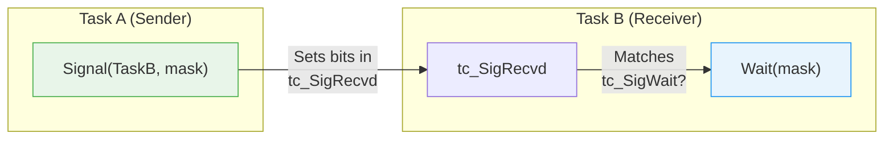

[← Home](../README.md) · [Exec Kernel](README.md)

# Signals — AllocSignal, SetSignal, Wait

## Overview

Signals are the lightest AmigaOS synchronization primitive — a single `Signal()` call compiles to a handful of 68k instructions. Each task has 32 signal bits (`tc_SigAlloc`). A task blocks on `Wait(mask)` until any of the specified bits are set by another task or interrupt handler calling `Signal()`. Signals carry no data — they are pure wake-up notifications. For data transfer, combine signals with [message ports](message_ports.md) or shared memory protected by [semaphores](semaphores.md).

---

## Architecture



### How Wait/Signal Works Internally

```
Signal(task, mask):
  1. task->tc_SigRecvd |= mask          (set the bits)
  2. If (tc_SigRecvd & tc_SigWait):     (does task want any of these?)
       Move task from TaskWait → TaskReady
       Trigger reschedule if task has higher priority

Wait(mask):
  1. tc_SigWait = mask                  (record what we're waiting for)
  2. If (tc_SigRecvd & mask):           (already received?)
       Clear matched bits, return immediately
  3. Else:
       Move task from Running → TaskWait
       Schedule next task
       (task sleeps until Signal sets matching bits)
  4. Return: received = tc_SigRecvd & mask
             tc_SigRecvd &= ~mask       (clear returned bits)
```

---

## Signal Bit Layout

```
Bit 31                    Bit 16  Bit 15                    Bit 0
┌──────────────────────────┬──────────────────────────────────┐
│    System-reserved       │    Application-allocatable       │
│    (Exec internal)       │    (AllocSignal)                 │
└──────────────────────────┴──────────────────────────────────┘
```

### Reserved Signal Bits

| Bit | Constant | Mask | Used By |
|---|---|---|---|
| 0 | `SIGB_ABORT` | `$00000001` | Break/abort |
| 1 | `SIGB_CHILD` | `$00000002` | Child task notification |
| 4 | `SIGB_SINGLE` / `SIGB_BLIT` | `$00000010` | Single-step, blitter completion |
| 5 | `SIGB_INTUITION` | `$00000020` | Intuition IDCMP delivery |
| 8 | `SIGB_DOS` | `$00000100` | DOS packet completion |
| 12 | `SIGBREAKB_CTRL_C` | `$00001000` | User break (Ctrl+C) |
| 13 | `SIGBREAKB_CTRL_D` | `$00002000` | User break (Ctrl+D) |
| 14 | `SIGBREAKB_CTRL_E` | `$00004000` | User break (Ctrl+E) |
| 15 | `SIGBREAKB_CTRL_F` | `$00008000` | User break (Ctrl+F) |

> **Note**: Bits 12–15 (`SIGBREAKF_CTRL_C` through `SIGBREAKF_CTRL_F`) are pre-allocated but can be `Wait()`ed on by applications. The Shell sends `SIGBREAKF_CTRL_C` when the user presses Ctrl+C.

### Application Bits

Bits 0–15 are allocatable via `AllocSignal()`, but some are pre-reserved by the system. In practice, most tasks have **10–12 free signal bits** available. If you need more concurrent signal sources than that, use message ports instead.

---

## Allocating and Freeing Signals

```c
/* Allocate an unused signal bit (-1 = any free bit): */
BYTE sigBit = AllocSignal(-1);   /* LVO -330 */
if (sigBit < 0)
{
    /* All application bits in use — serious problem */
    /* Consider using message ports or sharing signals */
}

ULONG sigMask = 1L << sigBit;

/* Free when done: */
FreeSignal(sigBit);   /* LVO -336 */
```

### Requesting a Specific Bit

```c
/* Allocate a specific bit (if available): */
BYTE bit = AllocSignal(7);   /* Request bit 7 specifically */
if (bit < 0) { /* Bit 7 is already in use */ }
```

---

## Waiting for Signals

```c
/* Block until any of the listed signals arrive: */
ULONG received = Wait(sigMask | SIGBREAKF_CTRL_C);   /* LVO -318 */

if (received & SIGBREAKF_CTRL_C)
{
    /* User pressed Ctrl+C */
    cleanup_and_exit();
}
if (received & sigMask)
{
    /* Our custom signal fired */
    handle_event();
}
```

### Key Properties of Wait()

| Property | Behavior |
|---|---|
| **Blocks?** | Yes — task moves to `TaskWait`, CPU freed |
| **CPU cost while waiting** | Zero — task is completely dormant |
| **Returns when** | At least one bit in the mask is set |
| **Clears bits?** | Yes — only the matched bits are cleared from `tc_SigRecvd` |
| **Re-entrant?** | No — one `Wait()` per task at a time |
| **Forbid() interaction** | `Wait()` inside `Forbid()` temporarily breaks the forbid |

### Spurious Wakeups

Signals can accumulate. If a signal arrives before you call `Wait()`, the wait returns immediately:

```c
/* Signal arrives here — sets bit in tc_SigRecvd */
/* ... other code runs ... */
Wait(sigMask);   /* Returns IMMEDIATELY — bit was already set */
```

This means `Wait()` never misses a signal, but you may get woken up for signals that were sent during a previous processing cycle. Always re-check your condition after waking.

---

## Sending Signals

```c
/* From another task: */
Signal(targetTask, sigMask);   /* LVO -324 */

/* From an interrupt handler: */
Signal(targetTask, sigMask);   /* Safe — Signal is interrupt-safe */
```

### Signal() is Atomic

`Signal()` disables interrupts internally, so it's safe to call from:
- Normal task context
- Interrupt handlers (all levels)
- Software interrupts
- Timer callbacks

No `Forbid()` or `Disable()` is needed around `Signal()`.

---

## SetSignal — Read and Modify Signal State

```c
/* Read and atomically modify signal bits: */
ULONG oldState = SetSignal(newBits, changeMask);   /* LVO -306 */
/* Result: old value of all 32 bits
   New value = (old & ~changeMask) | (newBits & changeMask) */
```

### Common Uses

```c
/* Check if Ctrl+C was pressed WITHOUT blocking: */
if (SetSignal(0, SIGBREAKF_CTRL_C) & SIGBREAKF_CTRL_C)
{
    /* Ctrl+C was pending — now cleared */
    running = FALSE;
}

/* Read all pending signals without clearing any: */
ULONG pending = SetSignal(0, 0);  /* changeMask=0 → no modification */

/* Pre-clear a signal before entering a processing loop: */
SetSignal(0, mySignalMask);  /* Clear bit — prevent stale wakeup */
```

---

## Practical Patterns

### Multi-Source Event Loop

The canonical AmigaOS event loop waits on multiple sources simultaneously:

```c
struct MsgPort *idcmpPort = win->UserPort;
struct MsgPort *timerPort = CreateMsgPort();
BYTE customSig = AllocSignal(-1);

ULONG idcmpMask  = 1L << idcmpPort->mp_SigBit;
ULONG timerMask  = 1L << timerPort->mp_SigBit;
ULONG customMask = 1L << customSig;
ULONG breakMask  = SIGBREAKF_CTRL_C;

ULONG waitMask = idcmpMask | timerMask | customMask | breakMask;

BOOL running = TRUE;
while (running)
{
    ULONG sigs = Wait(waitMask);

    if (sigs & idcmpMask)
    {
        struct IntuiMessage *imsg;
        while ((imsg = GT_GetIMsg(idcmpPort)))
        {
            /* Handle GUI events */
            GT_ReplyIMsg(imsg);
        }
    }

    if (sigs & timerMask)
    {
        /* Handle timer expiry */
        WaitIO(timerReq);
        /* Restart timer... */
    }

    if (sigs & customMask)
    {
        /* Handle custom inter-task signal */
    }

    if (sigs & breakMask)
    {
        running = FALSE;  /* Clean exit on Ctrl+C */
    }
}
```

### Producer-Consumer with Signal

```c
/* Producer (interrupt handler or high-priority task) */
volatile ULONG g_DataReady;

/* In producer: */
g_DataReady = TRUE;
Signal(consumerTask, dataSig);

/* Consumer: */
while (running)
{
    Wait(dataSig | SIGBREAKF_CTRL_C);

    if (g_DataReady)
    {
        g_DataReady = FALSE;
        ProcessNewData();
    }
}
```

---

## Pitfalls

### 1. Running Out of Signal Bits

Each task only has 16 application bits. Opening multiple windows, ports, and timers can exhaust them:

```c
/* Each of these allocates a signal bit: */
CreateMsgPort();     /* 1 bit */
CreateMsgPort();     /* 1 bit */
/* ... 14 more ... */
CreateMsgPort();     /* FAILS — returns NULL */
```

**Solution**: Share ports between related message sources, or use `PA_IGNORE` ports with polling.

### 2. Signaling a Dead Task

```c
/* BUG — task may have exited */
Signal(savedTaskPtr, mask);  /* savedTaskPtr may point to freed memory */

/* No safe way to check — the task pointer is just an address */
/* Use message ports (FindPort) for robust inter-task communication */
```

### 3. Forgetting to Free Signals

```c
/* BUG — signal bit leaked on task exit */
BYTE sig = AllocSignal(-1);
/* ... use it ... */
/* Task exits without FreeSignal(sig) → bit is gone until reboot */
```

### 4. Not Handling All Waited Signals

```c
/* BUG — Ctrl+C accumulates but is never checked */
Wait(idcmpSig | SIGBREAKF_CTRL_C);
if (sigs & idcmpSig) { /* ... */ }
/* Forgot to check SIGBREAKF_CTRL_C — user can't break! */
```

---

## Best Practices

1. **Always handle `SIGBREAKF_CTRL_C`** — users expect Ctrl+C to work
2. **Free all signals** before task exit — `FreeSignal(sigBit)`
3. **Use `Wait()`** instead of busy-polling — zero CPU cost while sleeping
4. **Combine multiple signal sources** with `Wait(mask1 | mask2 | ...)`
5. **Pre-clear stale signals** with `SetSignal(0, mask)` before processing loops
6. **Never assume signal means data** — always re-check the condition after waking
7. **Use message ports** for data transfer — signals only carry "something happened"
8. **Don't cache task pointers** for signaling — use message ports for reliability

---

## References

- NDK39: `exec/tasks.h`, `exec/execbase.h`
- ADCD 2.1: `AllocSignal`, `FreeSignal`, `Signal`, `Wait`, `SetSignal`
- See also: [Tasks & Processes](tasks_processes.md) — `tc_SigAlloc`, `tc_SigRecvd` fields
- See also: [Multitasking](multitasking.md) — Signal/Wait scheduling interaction
- *Amiga ROM Kernel Reference Manual: Exec* — signals chapter
