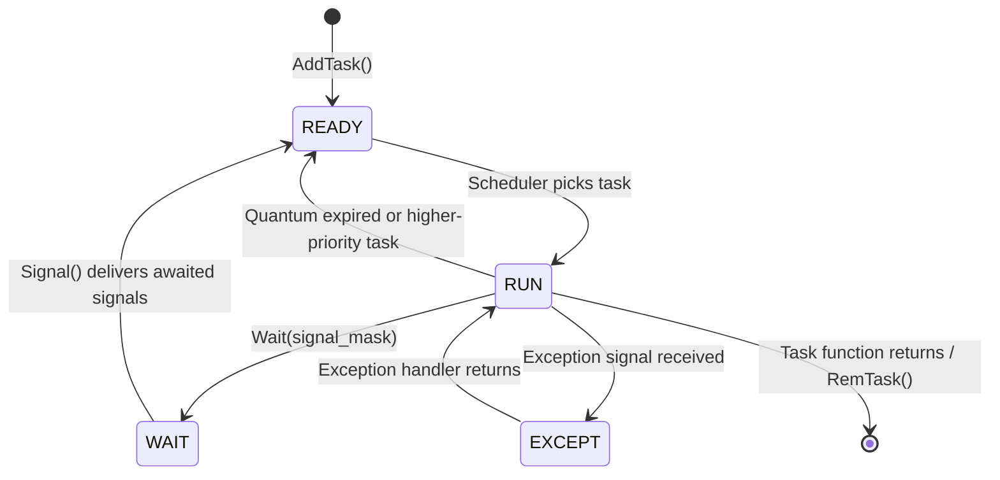

[← Home](../README.md) · [Exec Kernel](README.md)

# Tasks and Processes — Structures, States, Scheduling

## Overview

AmigaOS uses **cooperative/preemptive** scheduling. Tasks are the fundamental unit of execution; Processes are Tasks with an additional DOS environment (message port, CLI, segment list). The scheduler runs at each quantum (50 Hz VBL interrupt) and after any `Signal()` or `Wait()` call.

---

## struct Task

```c
/* exec/tasks.h */
struct Task {
    struct Node  tc_Node;      /* ln_Type=NT_TASK or NT_PROCESS */
                               /* ln_Pri = scheduling priority */
                               /* ln_Name = task name string */
    UBYTE        tc_Flags;     /* TF_LAUNCH, TF_STRIKE, TF_EXCEPT */
    UBYTE        tc_State;     /* TS_RUN, TS_READY, TS_WAIT, TS_EXCEPT */
    BYTE         tc_IDNestCnt; /* interrupt disable nesting */
    BYTE         tc_TDNestCnt; /* task disable (Forbid) nesting */
    ULONG        tc_SigAlloc;  /* allocated signal bits mask */
    ULONG        tc_SigWait;   /* signals task is waiting for */
    ULONG        tc_SigRecvd;  /* signals received */
    ULONG        tc_SigExcept; /* exception signals */
    /* ... stack bounds, context, exception handler ... */
    APTR         tc_SPLower;   /* lowest valid stack address */
    APTR         tc_SPUpper;   /* highest valid stack address + 2 */
    APTR         tc_SPReg;     /* saved stack pointer (when not running) */
};
```

---

## struct Process (extends Task)

```c
/* dos/dosextens.h */
struct Process {
    struct Task  pr_Task;       /* embedded Task */
    struct MsgPort pr_MsgPort;  /* I/O message port */
    UWORD        pr_Pad;
    BPTR         pr_SegList;    /* BPTR to segment list */
    LONG         pr_StackSize;
    APTR         pr_GlobVec;    /* BCPL global vector */
    LONG         pr_TaskNum;    /* CLI task number */
    BPTR         pr_StackBase;  /* base of stack (BPTR) */
    LONG         pr_Result2;    /* secondary result */
    BPTR         pr_CurrentDir; /* current directory lock */
    BPTR         pr_CIS;        /* current input stream */
    BPTR         pr_COS;        /* current output stream */
    APTR         pr_ConsoleTask;
    APTR         pr_FileSystemTask;
    BPTR         pr_CLI;        /* CLI structure (NULL if WB) */
    ...
    struct MsgPort *pr_ReturnAddr; /* return address for CLI tasks */
    APTR         pr_PktWait;
    struct SaveMsg pr_ExitData;
    UBYTE        *pr_Arguments;  /* argument string */
    struct MinList pr_LocalVars; /* local shell variables */
    ULONG        pr_ShellPrivate;
    BPTR         pr_CES;         /* current error stream */
};
```

---

## Task States

| State | Value | Meaning |
|---|---|---|
| `TS_INVALID` | 0 | Not a valid task |
| `TS_ADDED` | 1 | Just added, not yet scheduled |
| `TS_RUN` | 2 | Currently running (only one task) |
| `TS_READY` | 3 | On the `TaskReady` list, waiting for CPU |
| `TS_WAIT` | 4 | Blocked on `Wait()` — on `TaskWait` list |
| `TS_EXCEPT` | 5 | Handling an exception |
| `TS_REMOVED` | 6 | Removed from scheduling |

---

## Scheduling: Priority-Based Round Robin

The scheduler (`exec.library` internal) picks the highest-priority task from `SysBase→TaskReady`. Among equal-priority tasks, they get equal time slices (round-robin).

- Default priority: 0
- Range: −128 to +127 (higher = more CPU)
- OS tasks run at priority 10–20
- Input handler: priority 20
- Disk tasks: priority 10

```c
SetTaskPri(FindTask(NULL), 5);  /* raise current task to priority 5 */
```

---

## Creating Tasks and Processes

```c
/* Simple task (exec level): */
struct Task *t = AllocMem(sizeof(struct Task), MEMF_PUBLIC|MEMF_CLEAR);
t->tc_Node.ln_Name = "MyTask";
t->tc_Node.ln_Pri  = 0;
t->tc_SPLower = stack;
t->tc_SPUpper = stack + stacksize;
t->tc_SPReg   = (APTR)((ULONG)stack + stacksize);
AddTask(t, myTaskFunc, NULL);

/* DOS Process (with message port, filesystem access): */
struct Process *p = CreateNewProcTags(
    NP_Entry,     myFunc,
    NP_Name,      "MyProcess",
    NP_StackSize, 8192,
    NP_Priority,  0,
    TAG_DONE);
```

---

## Task State Machine



---

## FindTask and Task Identity

```c
struct Task *me = FindTask(NULL);   /* NULL = current task */
printf("Running as: %s\n", me->tc_Node.ln_Name);

/* Check if we are a Process (vs plain Task): */
if (me->tc_Node.ln_Type == NT_PROCESS) {
    struct Process *pr = (struct Process *)me;
    /* access pr_CLI, pr_MsgPort, etc. */
}
```

---

## References

- NDK39: `exec/tasks.h`, `dos/dosextens.h`
- ADCD 2.1: `AddTask`, `RemTask`, `FindTask`, `SetTaskPri`, `CreateNewProc`
- *Amiga ROM Kernel Reference Manual: Exec* — tasks and scheduling chapter
