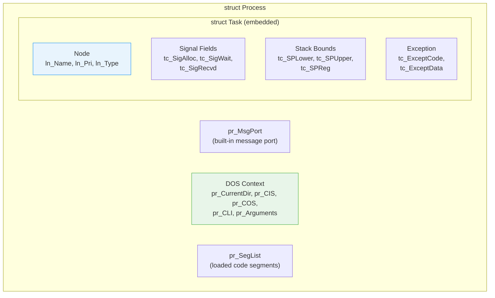
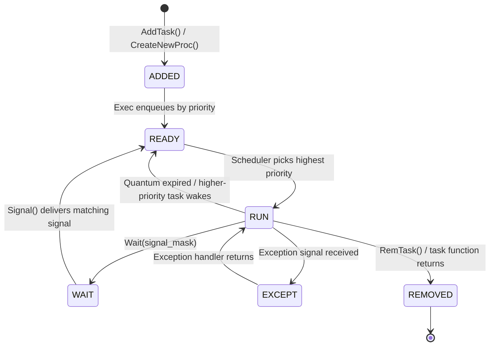

[← Home](../README.md) · [Exec Kernel](README.md)

# Tasks and Processes — Structures, States, Creation, Scheduling

## Overview

AmigaOS uses **preemptive priority-based scheduling** with round-robin time-sharing among equal-priority tasks. Tasks are the fundamental unit of execution; Processes are Tasks with an additional DOS environment (message port, CLI context, segment list, filesystem handles). The scheduler runs at each vertical blank interrupt (50/60 Hz) and after any `Signal()` or `Wait()` call.

For the full multitasking deep-dive — scheduler algorithm, context switch costs, IPC strategies, and memory safety — see [Multitasking](multitasking.md).

---

## Task vs Process



| Capability | Task | Process |
|---|---|---|
| Scheduling | ✅ | ✅ |
| Signals | ✅ | ✅ |
| Message Ports | Manual setup | ✅ Built-in `pr_MsgPort` |
| DOS I/O (Open/Read/Write) | ❌ | ✅ |
| CLI environment | ❌ | ✅ (if started from Shell) |
| Current directory | ❌ | ✅ `pr_CurrentDir` |
| stdin/stdout/stderr | ❌ | ✅ `pr_CIS`/`pr_COS`/`pr_CES` |
| Local variables | ❌ | ✅ `pr_LocalVars` |

> **Rule of thumb**: Use `CreateNewProcTags()` for everything. Use raw `AddTask()` only for bare-metal interrupt-level code or when you explicitly don't need DOS.

---

## struct Task

```c
/* exec/tasks.h — NDK39 */
struct Task {
    struct Node  tc_Node;       /* ln_Type=NT_TASK or NT_PROCESS */
                                /* ln_Pri = scheduling priority (-128 to +127) */
                                /* ln_Name = task name string */
    UBYTE        tc_Flags;      /* TF_LAUNCH, TF_SWITCH, TF_EXCEPT */
    UBYTE        tc_State;      /* TS_RUN, TS_READY, TS_WAIT, TS_EXCEPT */
    BYTE         tc_IDNestCnt;  /* interrupt disable nesting (-1 = enabled) */
    BYTE         tc_TDNestCnt;  /* task disable (Forbid) nesting (-1 = enabled) */
    ULONG        tc_SigAlloc;   /* allocated signal bits mask */
    ULONG        tc_SigWait;    /* signals this task is waiting for */
    ULONG        tc_SigRecvd;   /* signals received but not yet consumed */
    ULONG        tc_SigExcept;  /* signals that trigger tc_ExceptCode */
    UWORD        tc_TrapAlloc;  /* allocated trap vectors */
    UWORD        tc_TrapAble;   /* enabled trap vectors */
    APTR         tc_ExceptData; /* data pointer passed to exception handler */
    APTR         tc_ExceptCode; /* exception handler function */
    APTR         tc_TrapData;   /* data pointer passed to trap handler */
    APTR         tc_TrapCode;   /* trap handler function */
    APTR         tc_SPReg;      /* saved stack pointer (when not running) */
    APTR         tc_SPLower;    /* lowest valid stack address */
    APTR         tc_SPUpper;    /* highest valid stack address + 2 */
    void       (*tc_Switch)();  /* called when task is switched OUT */
    void       (*tc_Launch)();  /* called when task is switched IN */
    struct List  tc_MemEntry;   /* list of memory entries to free on RemTask */
    APTR         tc_UserData;   /* application-private data pointer */
};
```

### Key Field Reference

| Field | Description |
|---|---|
| `tc_Node.ln_Pri` | Scheduling priority (−128 to +127). Higher = more CPU time |
| `tc_State` | Current state: `TS_RUN`, `TS_READY`, `TS_WAIT`, `TS_EXCEPT`, `TS_REMOVED` |
| `tc_IDNestCnt` | Interrupt disable nesting counter. −1 = interrupts enabled |
| `tc_TDNestCnt` | Task disable nesting counter. −1 = task switching enabled |
| `tc_SigAlloc` | Bitmask of allocated signal bits (1 = allocated) |
| `tc_SigWait` | Bitmask of signals this task will wake for (set by `Wait()`) |
| `tc_SigRecvd` | Bitmask of signals received (set by `Signal()`, cleared by `Wait()`) |
| `tc_SPReg` | Saved SP when task is not running — points to saved context on stack |
| `tc_SPLower` / `tc_SPUpper` | Stack bounds — exec fills these with guard patterns for stack overflow detection |
| `tc_MemEntry` | List of `MemEntry` structures — automatically freed by `RemTask()` |
| `tc_Switch` / `tc_Launch` | Optional callbacks on context switch — used by FPU context save/restore |

---

## struct Process (extends Task)

```c
/* dos/dosextens.h — NDK39 */
struct Process {
    struct Task   pr_Task;         /* embedded Task — MUST be first field */
    struct MsgPort pr_MsgPort;     /* built-in message port for DOS packets */
    UWORD         pr_Pad;
    BPTR          pr_SegList;      /* segment list (loaded code) */
    LONG          pr_StackSize;    /* stack size in bytes */
    APTR          pr_GlobVec;      /* BCPL global vector (legacy) */
    LONG          pr_TaskNum;      /* CLI task number (0 = Workbench) */
    BPTR          pr_StackBase;    /* base of stack (BPTR) */
    LONG          pr_Result2;      /* secondary result (IoErr()) */
    BPTR          pr_CurrentDir;   /* current directory lock */
    BPTR          pr_CIS;          /* current input stream (stdin) */
    BPTR          pr_COS;          /* current output stream (stdout) */
    APTR          pr_ConsoleTask;  /* console handler task */
    APTR          pr_FileSystemTask; /* filesystem handler task */
    BPTR          pr_CLI;          /* pointer to CommandLineInterface */
    APTR          pr_ReturnAddr;   /* return address for exit */
    APTR          pr_PktWait;      /* custom packet wait function */
    APTR          pr_WindowPtr;    /* window for error requesters (or −1 to suppress) */
    BPTR          pr_HomeDir;      /* home directory of program */
    LONG          pr_Flags;        /* PR_FREESEGLIST, PR_FREEARGS, etc. */
    void        (*pr_ExitCode)();  /* exit handler */
    LONG          pr_ExitData;     /* data for exit handler */
    UBYTE        *pr_Arguments;    /* argument string */
    struct MinList pr_LocalVars;   /* local shell environment variables */
    ULONG         pr_ShellPrivate; /* shell private data */
    BPTR          pr_CES;          /* current error stream (stderr) — V39+ */
};
```

### Important Process Fields

| Field | Description |
|---|---|
| `pr_MsgPort` | Built-in message port — used for DOS packet communication |
| `pr_CurrentDir` | Lock on current directory — inherited from parent |
| `pr_CIS` / `pr_COS` / `pr_CES` | File handles for stdin, stdout, stderr |
| `pr_CLI` | Non-NULL if started from CLI/Shell, NULL if from Workbench |
| `pr_WindowPtr` | Window for error requesters. Set to `−1` to suppress "Please insert volume" dialogs |
| `pr_Arguments` | Raw argument string (not parsed — use `ReadArgs()`) |
| `pr_Result2` | Secondary error code — retrieved by `IoErr()` |
| `pr_ExitCode` | Called when process exits — cleanup handler |

---

## Task States

| State | Constant | Value | Meaning |
|---|---|---|---|
| Invalid | `TS_INVALID` | 0 | Not a valid task |
| Added | `TS_ADDED` | 1 | Just added, not yet scheduled |
| Running | `TS_RUN` | 2 | Currently executing (exactly one task) |
| Ready | `TS_READY` | 3 | On `SysBase→TaskReady`, waiting for CPU |
| Waiting | `TS_WAIT` | 4 | Blocked on `Wait()` — on `SysBase→TaskWait` |
| Exception | `TS_EXCEPT` | 5 | Handling a task-level exception |
| Removed | `TS_REMOVED` | 6 | Removed from scheduling |

### State Machine



---

## Scheduling: Priority-Based Round Robin

The scheduler (`exec.library` internal) picks the highest-priority task from `SysBase→TaskReady`:

| Priority Range | Typical Use |
|---|---|
| +127 | (Unused — would starve everything) |
| +20 | input.device handler |
| +10 | trackdisk.device, filesystem handlers |
| +5 | Real-time applications (audio players) |
| 0 | **Normal applications** |
| −1 | Background workers (file copy, indexing) |
| −128 | Idle task |

```c
/* Change priority of current task */
BYTE oldPri = SetTaskPri(FindTask(NULL), 5);   /* LVO -300 */
/* Returns old priority */
```

> **Warning**: Priority > 20 will starve the input handler. Priority > 10 will starve filesystem tasks. Choose wisely.

---

## Creating Tasks

### Raw Task (exec level)

```c
#define STACKSIZE 4096

/* Allocate task structure and stack together */
struct Task *task = AllocMem(sizeof(struct Task), MEMF_PUBLIC | MEMF_CLEAR);
APTR stack = AllocMem(STACKSIZE, MEMF_ANY);

task->tc_Node.ln_Type = NT_TASK;
task->tc_Node.ln_Name = "MyTask";
task->tc_Node.ln_Pri  = 0;
task->tc_SPLower      = stack;
task->tc_SPUpper      = (APTR)((ULONG)stack + STACKSIZE);
task->tc_SPReg        = task->tc_SPUpper;  /* Stack grows downward */

/* AddTask(task, initialPC, finalPC) */
AddTask(task, MyTaskEntry, NULL);   /* LVO -282 */
/* NULL finalPC = exec's default task cleanup */
```

> **Caution**: Raw `AddTask()` tasks cannot call DOS functions (Open, Read, Write, Printf). They have no `pr_MsgPort`, no current directory, no stdin/stdout. Use `CreateNewProcTags()` for anything that needs I/O.

### Process (DOS level — preferred)

```c
struct Process *proc = CreateNewProcTags(
    NP_Entry,      MyProcEntry,     /* entry function */
    NP_Name,       "MyProcess",     /* process name */
    NP_StackSize,  8192,            /* stack size in bytes */
    NP_Priority,   0,               /* scheduling priority */
    NP_CurrentDir, DupLock(GetProgramDir()),  /* inherit directory */
    NP_Input,      NULL,            /* or a file handle for stdin */
    NP_Output,     NULL,            /* or a file handle for stdout */
    NP_CloseInput, FALSE,           /* don't close stdin on exit */
    NP_CloseOutput,FALSE,           /* don't close stdout on exit */
    TAG_DONE
);

if (!proc) { /* creation failed */ }
```

### Task Cleanup: tc_MemEntry

Memory added to `tc_MemEntry` is automatically freed when the task is removed:

```c
/* Add stack + task struct to auto-cleanup list */
struct MemList *ml = AllocMem(sizeof(struct MemList) + sizeof(struct MemEntry),
    MEMF_PUBLIC | MEMF_CLEAR);
ml->ml_NumEntries = 2;
ml->ml_ME[0].me_Un.meu_Addr = task;
ml->ml_ME[0].me_Length = sizeof(struct Task);
ml->ml_ME[1].me_Un.meu_Addr = stack;
ml->ml_ME[1].me_Length = STACKSIZE;
AddHead(&task->tc_MemEntry, &ml->ml_Node);
/* Now RemTask() will free both task struct and stack */
```

---

## Task Identity

```c
/* Get current task */
struct Task *me = FindTask(NULL);   /* LVO -294 — NULL = current */
Printf("Running as: %s (pri %ld)\n", me->tc_Node.ln_Name, me->tc_Node.ln_Pri);

/* Find another task by name */
Forbid();
struct Task *other = FindTask("TargetApp");  /* Returns NULL if not found */
Permit();

/* Check if current task is a Process */
if (me->tc_Node.ln_Type == NT_PROCESS)
{
    struct Process *pr = (struct Process *)me;
    /* Safe to use pr_CLI, pr_MsgPort, pr_CurrentDir, etc. */
}
```

---

## Removing Tasks

```c
/* Remove current task (task commits suicide): */
RemTask(NULL);   /* LVO -288 — NULL = remove self */
/* Never returns — task is destroyed */

/* Remove another task (dangerous!): */
Forbid();
struct Task *victim = FindTask("OtherTask");
if (victim) RemTask(victim);
Permit();
```

> **Caution**: `RemTask()` on another task does NOT:
> - Close its open files
> - Free its message ports
> - Reply to pending messages
> - Close its libraries
>
> This leaks resources permanently. Use `Signal()` + cooperative shutdown instead.

---

## Pitfalls

### 1. Calling DOS from a Raw Task

```c
/* BUG — raw Task has no DOS environment */
void __saveds MyTaskFunc(void)
{
    BPTR fh = Open("RAM:test", MODE_NEWFILE);  /* CRASH — no pr_FileSystemTask */
}
```

### 2. Stack Overflow

```c
/* BUG — recursive function exhausts 4 KB stack */
void MyTask(void)
{
    char buffer[2048];  /* Half the stack gone in one frame */
    ProcessData(buffer);
    MyTask();  /* Stack overflow → corrupts next task's memory */
}
```

The system does NOT catch stack overflows — memory just gets silently corrupted. Use `StackSwap()` for deep recursion.

### 3. RemTask Without Cleanup

```c
/* BUG — resources leaked */
void MyProcess(void)
{
    struct Library *base = OpenLibrary("mylib.library", 0);
    struct MsgPort *port = CreateMsgPort();
    /* ... */
    RemTask(NULL);  /* Library not closed, port not freed */
}
```

### 4. Caching Task Pointers

```c
/* BUG — task may have exited */
struct Task *t = FindTask("Worker");
/* ... some time passes ... */
Signal(t, mask);  /* t may be freed memory */
```

---

## Best Practices

1. **Use `CreateNewProcTags()`** — raw `AddTask()` is for kernel-level code only
2. **Use `tc_MemEntry`** for automatic cleanup of task-allocated memory
3. **Always check `FindTask()` return** — tasks can exit at any time
4. **Use cooperative shutdown** — send a signal, let the task clean up and exit itself
5. **Set `pr_WindowPtr = -1`** to suppress "Please insert volume" dialogs in background tasks
6. **Size stacks generously** — 8192+ bytes for processes, 4096+ for tasks
7. **Use `StackSwap()`** if you need temporary deep stack for recursive algorithms
8. **Never `RemTask()` another task** in production code — it leaks everything

---

## References

- NDK39: `exec/tasks.h`, `dos/dosextens.h`, `dos/dostags.h`
- ADCD 2.1: `AddTask`, `RemTask`, `FindTask`, `SetTaskPri`, `CreateNewProcTags`, `StackSwap`
- See also: [Multitasking](multitasking.md) — scheduler algorithm, context switch, IPC strategies
- See also: [Signals](signals.md) — tc_SigAlloc, tc_SigRecvd, tc_SigWait
- *Amiga ROM Kernel Reference Manual: Exec* — tasks and scheduling chapter
