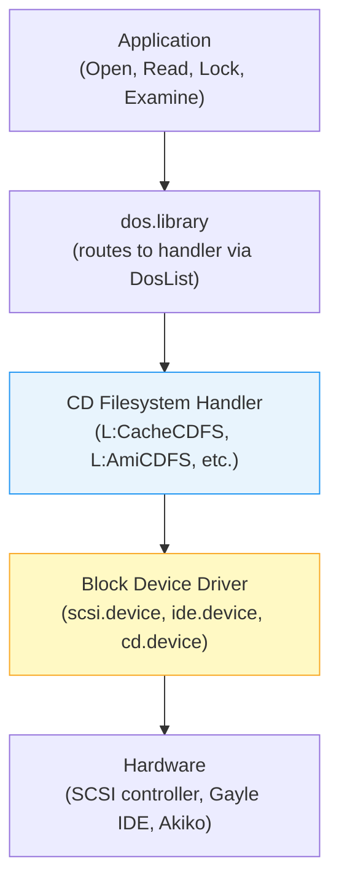
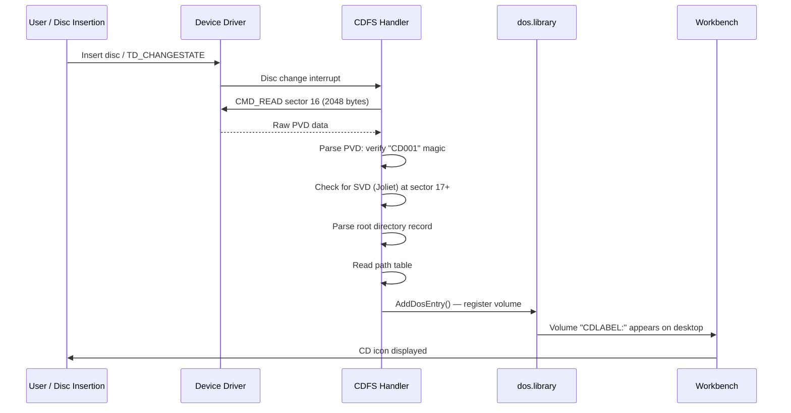
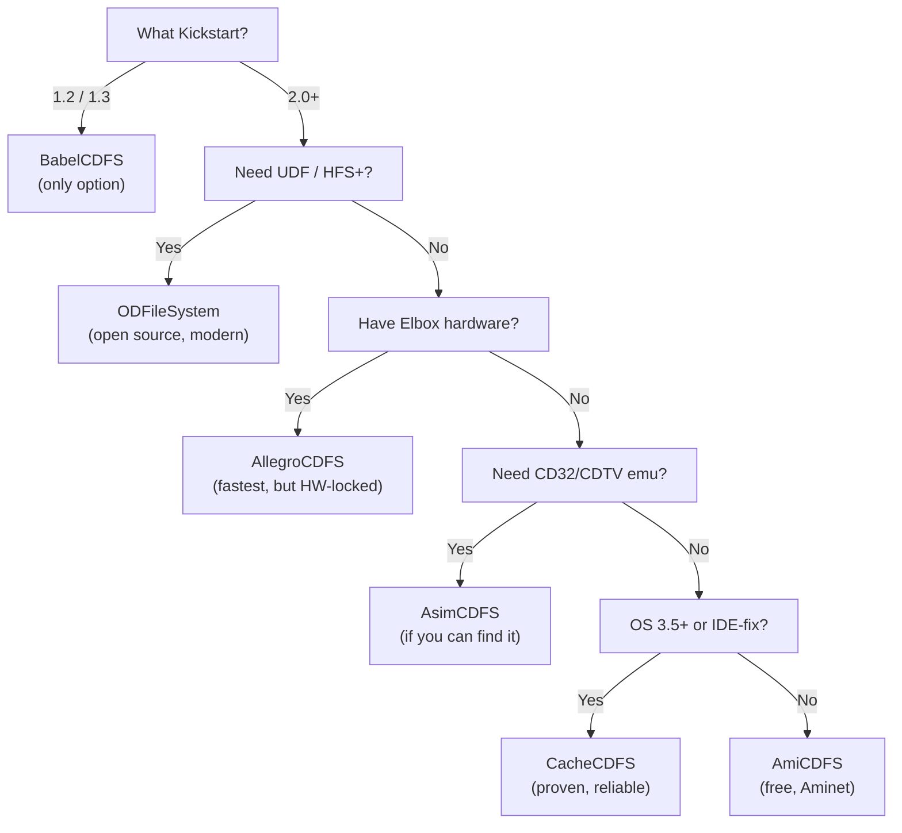

[← Home](../README.md) · [AmigaDOS](README.md)

# CD-ROM Filesystems — ISO 9660, Rock Ridge, Joliet, UDF, and Amiga Handlers

## Overview

The Amiga never had a CD-ROM drive in its original design — the A1000 shipped in 1985 with a single 880 KB floppy — but by 1991, Commodore had bolted optical drives onto two entirely different hardware platforms. The CDTV used a **1× SCSI CD-ROM** driven by a DMAC/WD33C93 chip pair borrowed from the A3000, while the CD32 used a **2× proprietary PIO interface** controlled by the Akiko custom chip. Neither machine's Kickstart ROM knew how to read ISO 9660. That job fell to filesystem handlers: user-space programs loaded from ROM expansion, RDB, or `DEVS:DOSDrivers/` that translated ISO volume descriptors into AmigaDOS locks, file handles, and directory scans.

The result was a decade-long ecosystem of competing CD filesystem drivers — from Commodore's bare-minimum `CDFileSystem` to the community's beloved CacheCDFS, the commercial powerhouse AsimCDFS, and the modern open-source ODFileSystem. Each driver made different trade-offs between format coverage (ISO 9660 levels, Rock Ridge, Joliet, UDF, HFS), caching strategy, audio CD support, and minimum Kickstart version. Choosing the wrong one meant truncated filenames, unreadable PC-burned discs, or no CD-DA playback at all.

This article covers the optical disc standards that matter on the Amiga, the architecture of CD filesystem handlers within AmigaDOS, every major CDFS implementation with honest trade-offs, and practical configuration for real hardware, emulators, and FPGA cores.

---

## Optical Disc Standards — What the Amiga Reads

A CD-ROM is not a floppy with more space — it uses a fundamentally different physical format. Understanding the layered standard stack is essential before touching any Amiga CDFS configuration.

### Physical Sector Format

Every CD stores data in **2352-byte raw frames**. The frame is subdivided differently depending on the disc mode:

```
Raw CD frame: 2352 bytes total
┌──────────┬──────────┬────────────────────────┬───────────────────┐
│ 12 bytes │ 4 bytes  │ User data              │ EDC/ECC           │
│ Sync     │ Header   │ (size varies by mode)  │ (error correction)│
└──────────┴──────────┴────────────────────────┴───────────────────┘

Mode 1 (data):  2048 bytes user data + 288 bytes EDC/ECC
Mode 2 (multimedia): 2336 bytes user data, no ECC
CD-DA (audio):  2352 bytes raw PCM (16-bit stereo, 44.1 kHz)
```

| Mode | User Data | ECC | Typical Use |
|---|---|---|---|
| **Mode 1** | 2048 bytes | 288 bytes (Reed-Solomon) | Computer data — ISO 9660 filesystems |
| **Mode 2 Form 1** | 2048 bytes | 280 bytes | CD-ROM XA data sectors |
| **Mode 2 Form 2** | 2328 bytes | None | CD-ROM XA multimedia (video, audio) |
| **CD-DA** | 2352 bytes | None (Red Book audio) | Music tracks — raw 16-bit PCM |

> [!NOTE]
> Amiga filesystem handlers work exclusively with **Mode 1 sectors** (2048 bytes). The handler requests logical sectors from the device driver, which strips the sync, header, and ECC fields. CD-DA tracks are invisible to the filesystem — they require separate handling via SCSI audio playback commands or dedicated ripping software.

### ISO 9660 — The Universal Standard

ISO 9660 (ECMA-119) is the cross-platform filesystem standard for CD-ROMs, published in 1988. Every Amiga CDFS implementation supports it as the baseline.

**On-disc layout:**

```
Sector 0–15:    System Area (reserved — unused on Amiga, used for boot code on PC)
Sector 16:      Primary Volume Descriptor (PVD) — the root of everything
Sector 17+:     Supplementary Volume Descriptors (Joliet SVD, etc.)
Sector N:       Volume Descriptor Set Terminator (type 255)
Sector N+1:     Path Table (L-type, little-endian)
Sector N+2:     Path Table (M-type, big-endian)
Sector M:       Root Directory Record → directory tree begins
Sector M+:      File data extents
```

**Primary Volume Descriptor (PVD) — Sector 16, 2048 bytes:**

```
Offset  Size    Field                     Description
──────  ──────  ────────────────────────  ──────────────────────────────
$000    1       Type Code                 1 = Primary Volume Descriptor
$001    5       Standard Identifier       "CD001"
$006    1       Version                   1
$007    1       (unused)
$008    32      System Identifier         e.g., "AMIGA" or blank
$028    32      Volume Identifier         Volume name (d-characters)
$058    8       Volume Space Size         Total logical blocks (both-endian)
$078    4       Volume Set Size           1 for single disc
$07C    4       Volume Sequence Number    1 for single disc
$080    4       Logical Block Size        2048 (both-endian)
$084    8       Path Table Size           Bytes (both-endian)
$08C    4       L Path Table Location     LBA of little-endian path table
$094    4       M Path Table Location     LBA of big-endian path table
$09C    34      Root Directory Record     Directory record for root
$0BE    128     Volume Set Identifier
$13E    128     Publisher Identifier
$1BE    128     Data Preparer Identifier
$23E    128     Application Identifier
$2BE    37      Copyright File Identifier
$2E3    37      Abstract File Identifier
$308    37      Bibliographic File ID
$32D    17      Volume Creation Date      "YYYYMMDDHHMMSSFF" + timezone
$33E    17      Volume Modification Date
$34F    17      Volume Expiration Date
$360    17      Volume Effective Date
$371    1       File Structure Version    1
```

> [!IMPORTANT]
> ISO 9660 stores all multi-byte integers in **both-endian** format — little-endian first, then big-endian. The Amiga (big-endian 68000) reads the second copy. PC (little-endian x86) reads the first. This dual encoding is why ISO 9660 discs work on both platforms without byte-swapping.

### ISO 9660 Levels

| Level | Filename Rules | Max Depth | File Fragmentation |
|---|---|---|---|
| **Level 1** | 8.3 uppercase (A–Z, 0–9, _) | 8 directories | Files must be contiguous |
| **Level 2** | 31 characters | 8 directories | Files must be contiguous |
| **Level 3** | 31 characters | 8 directories | Files may be non-contiguous (multi-extent) |

Level 1 is the common denominator — every CDFS reads it. Level 3's non-contiguous files are used by packet-writing software; most Amiga CDFS implementations do **not** support Level 3.

### Rock Ridge Extensions (IEEE P1282)

Rock Ridge adds POSIX semantics to ISO 9660 by embedding extra metadata in the System Use area of each directory record. It uses the **System Use Sharing Protocol (SUSP, IEEE P1281)** as a transport layer.

| Tag | Name | What It Stores |
|---|---|---|
| `PX` | POSIX Attributes | Permissions, UID, GID, link count |
| `PN` | Device Node | Major/minor device numbers |
| `SL` | Symbolic Link | Link target path components |
| `NM` | Alternate Name | Real filename (case-sensitive, up to 255 chars) |
| `CL` | Child Link | Pointer to relocated directory |
| `RE` | Relocation | Marks a relocated directory entry |
| `TF` | Timestamps | POSIX create/modify/access times |

**Why it matters on Amiga:** Rock Ridge's `NM` tag provides the **real filename** — without it, a file named `ReadMe.txt` on a Linux machine appears as `README.TXT;1` on the Amiga. CacheCDFS, AsimCDFS, and ODFileSystem all parse Rock Ridge; BabelCDFS does too, but Commodore's stock `CDFileSystem` does not.

### Joliet Extension

Microsoft's extension to ISO 9660, defined via a **Supplementary Volume Descriptor (SVD)** at sector 17 or later. Key properties:

| Property | Value |
|---|---|
| **Character encoding** | UCS-2 (16-bit Unicode) |
| **Max filename length** | 64 characters (128 bytes) |
| **Max directory depth** | 8 levels (same as ISO 9660) |
| **Identification** | SVD with escape sequences `%/@`, `%/C`, or `%/E` |

Joliet preserves Windows-style long filenames. A disc burned on Windows with "My Documents" in the filename will show the full name on a Joliet-capable Amiga CDFS, versus the truncated `MY_DOCUM.;1` from plain ISO 9660. CacheCDFS, AllegroCDFS, and ODFileSystem support Joliet; BabelCDFS does not.

### UDF (Universal Disk Format)

UDF (ECMA-167 / ISO 13346) is the modern optical disc filesystem used on DVDs, Blu-rays, and packet-written CDs. It replaces ISO 9660 entirely with a more capable structure supporting:

- Filenames up to **255 characters** in Unicode
- Files larger than 4 GB
- Read-write capability (for CD-RW/DVD-RW)
- Defect management and space reclamation

**Amiga support is limited.** Only AllegroCDFS and ODFileSystem advertise UDF support, and AllegroCDFS's implementation is restricted to pure-UDF discs — it cannot handle UDF/ISO 9660 bridge discs (the common format for most commercial DVDs). In practice, most DVDs that an Amiga encounters are bridge discs where the ISO 9660 portion is readable by any standard CDFS.

### HFS (Hierarchical File System)

Apple's Macintosh filesystem, used on Mac-formatted CDs and hybrid Mac/ISO discs. HFS uses a B-tree catalog structure, resource/data fork separation, and Creator/Type metadata. AmiCDFS, AsimCDFS, CacheCDFS, and ODFileSystem can read HFS volumes, exposing the data fork as a standard file. Resource forks are typically inaccessible.

---

## Architecture — How CD Filesystem Handlers Work

### Three-Layer Stack

CD-ROM access on the Amiga follows the same handler architecture as native filesystems (FFS, PFS3), but with a critical difference: the filesystem is read-only and the sector size is 2048 bytes instead of 512.



| Layer | Role | Example |
|---|---|---|
| **Application** | Issues standard AmigaDOS calls (`Open()`, `Read()`, `Lock()`, `Examine()`) | Any Amiga program |
| **dos.library** | Routes requests to the correct handler via the `DosList` | Built into Kickstart ROM |
| **Filesystem handler** | Translates ISO 9660 / Rock Ridge / Joliet structures into AmigaDOS responses | `L:CacheCDFS`, `L:AmiCDFS` |
| **Device driver** | Reads raw 2048-byte sectors from the hardware | `scsi.device`, `cd.device` |
| **Hardware** | Physical CD-ROM controller | Gayle (IDE), DMAC/WD33C93 (SCSI), Akiko (CD32) |

### The Mounting Mechanism — DOSDrivers

To mount a CD-ROM, AmigaOS needs a **mount entry** — a text file in `DEVS:DOSDrivers/` (auto-mount at boot) or `SYS:Storage/DOSDrivers/` (manual mount). The entry binds a device name, unit number, and filesystem handler together.

**Standard mount entry (`DEVS:DOSDrivers/CD0`):**

```
/* $VER: CD0 1.0 (01.01.95) */
Handler     = L:CacheCDFS       /* filesystem handler binary */
Device      = scsi.device        /* block device driver */
Unit        = 2                  /* SCSI ID or IDE unit of CD-ROM */
Flags       = 0
Surfaces    = 1
SectorsPerTrack = 1
SectorSize  = 2048               /* CD-ROM sector size — NOT 512! */
Mask        = 0x7ffffffe          /* DMA alignment mask */
MaxTransfer = 0x100000            /* 1 MB max transfer per I/O */
Reserved    = 0
Interleave  = 0
LowCyl      = 0
HighCyl     = 0                   /* 0 = auto-detect disc size */
Buffers     = 100                 /* cache buffer count */
BufMemType  = 0                   /* any memory type */
StackSize   = 8192                /* handler stack size */
Priority    = 10
GlobVec     = -1                  /* standard global vector */
DosType     = 0x43444653          /* "CDFS" — handler identifier */
Mount       = 1
```

> [!WARNING]
> Setting `SectorSize` to 512 (the default for hard disks) is the **single most common CDFS configuration error**. CD-ROM sectors are 2048 bytes. A wrong sector size causes the handler to read garbage — the PVD at sector 16 won't be found, and the volume will never mount.

### Key Mount Parameters

| Parameter | CD-ROM Value | HDD Value | Why Different |
|---|---|---|---|
| `SectorSize` | **2048** | 512 | CD-ROM Mode 1 sector size |
| `Surfaces` | 1 | Varies (heads) | CD has no geometry — single surface |
| `SectorsPerTrack` | 1 | Varies | No track geometry on optical media |
| `LowCyl` / `HighCyl` | 0 / 0 | Partition range | 0 = entire disc; handler auto-detects |
| `Buffers` | 50–200 | 30–50 | More buffers improve read-ahead for sequential access |
| `DosType` | `0x43444653` | `0x444F5301` | `"CDFS"` vs `"DOS\1"` — identifies handler type |

### DosType Identifiers for CD-ROM Handlers

Unlike native Amiga filesystems (where DosType matches the on-disk signature), CD-ROM handlers use their own identifier that tells the Kickstart which handler binary to load. The on-disc format is always ISO 9660 (identified by `"CD001"` at sector 16, offset 1).

| DosType | Hex (BE) | Handler | Notes |
|---|---|---|---|
| `CDFS` | `$43444653` | AmiCDFS, generic | Most common default |
| `CD01` | `$43443031` | CacheCDFS, some configs | Alternative identifier |
| `UCD\0` | `$55434400` | ODFileSystem | Modern replacement |

> [!NOTE]
> The DosType in the mount entry is **not** an on-disk signature — it is an internal AmigaOS identifier that matches the handler to the mount entry. The handler itself identifies the disc format by reading sector 16 and checking for the `"CD001"` magic string.

### Mount-Time Sequence — What Happens When a CD Is Inserted



### Disc Removal and Change Detection

CD filesystem handlers must detect disc changes — a problem that doesn't exist for hard disks. The handler periodically polls the device driver using `TD_CHANGESTATE` (or receives interrupts on hardware that supports them). When a disc change is detected:

1. All open file handles become invalid — reading from them returns `ERROR_DEVICE_NOT_MOUNTED`
2. The handler calls `RemDosEntry()` to remove the old volume from the DosList
3. If a new disc is present, the mount-time sequence runs again
4. If the tray is empty, no volume appears until the next insertion

> [!WARNING]
> Some older SCSI controllers and device drivers do not implement `TD_CHANGESTATE` correctly — they always report "no change." On these systems, the handler never detects disc swaps. The workaround: manually unmount and remount the CD volume, or use a CDFS that provides a `Diskchange CD0:` ARexx command (CacheCDFS and AsimCDFS both do).

---

## CDFS Handler Implementations — The Ecosystem

Seven distinct CD filesystem handlers competed for the Amiga's optical disc market between 1991 and the present day. Each targets a different niche — from KS 1.3 compatibility to modern UDF support.

### CDFileSystem (Commodore Stock)

The original CD filesystem shipped with the CDTV and CD32, stored in extended ROM. It is the most primitive implementation:

- **Formats:** ISO 9660 Level 1 only — no Rock Ridge, no Joliet, no long filenames
- **Caching:** None — every directory read goes to disc
- **Audio:** No CD-DA support
- **Min OS:** Kickstart 2.0 (CDTV), Kickstart 3.1 (CD32)

The stock handler was barely adequate for the CDTV's multimedia titles, which controlled their own disc access. For general-purpose file browsing, it was painfully slow and produced mangled 8.3 filenames from any disc burned on a PC or Unix machine. Commodore never updated it.

### CacheCDFS (IDE-fix 97 / IDE-max 97)

Developed by **Oliver Kastl** of Elaborate Bytes, CacheCDFS became the de facto standard for Amiga CD-ROM access. It shipped as part of the IDE-fix 97 suite (later renamed IDE-max 97 for trademark reasons) and was eventually integrated into **AmigaOS 3.5 and 3.9**.

**Key features:**

- **Formats:** ISO 9660 Levels 1–2, Rock Ridge (with Amiga extensions), Joliet, HFS (Macintosh)
- **Caching:** LRU (Least Recently Used) sector cache — dramatically reduces disc access for repeated reads
- **Audio:** Embedded CD-DA playback support
- **Multisession:** Reads multisession and multivolume discs
- **Preferences:** `CDFSprefs` — Intuition-based GUI for adjusting cache size, format priority, and playback settings at runtime
- **CD32 emulation:** Can emulate CD32 boot sequence on A1200/A4000
- **Min OS:** Kickstart 2.0

**Pros:**

- The most widely tested and deployed Amiga CDFS — virtually every A1200 hard disk setup ran it
- LRU caching makes directory browsing tolerable on slow drives
- Rock Ridge + Joliet = reads PC-burned and Linux-burned discs correctly
- Integrated into official AmigaOS releases (3.5/3.9)
- Reliable disc change detection

**Cons:**

- No UDF support — cannot read DVD-only filesystems
- No ISO 9660 Level 3 — cannot read packet-written discs
- Development ended ~2000; no updates since
- Originally required IDE-fix 97 license; now freely distributed with OS 3.5+

### AmiCDFS (AmiCDROM)

Originally written by **Frank Munkert**, significantly reworked by **Martin Berndt**. The most common freely available CDFS on Aminet (`disk/cdrom/amicdfs240.lha`).

**Key features:**

- **Formats:** ISO 9660 Levels 1–2, Rock Ridge, HFS (Macintosh)
- **Caching:** Circular cache for file buffering
- **Audio:** CD-DA AppIcon interaction (click to play)
- **Compatibility flags:** `TOSHIBA` and `OLDMODE` flags for problematic SCSI adapters (HardFrame, Supra)
- **PhotoCD:** Handles Kodak PhotoCD disc quirks with Toshiba drives
- **Min OS:** Kickstart 2.0

**Pros:**

- Free (Aminet) — no license required
- Good performance with circular cache
- HFS support for reading Mac-formatted discs
- Broad hardware compatibility via adapter-specific flags

**Cons:**

- **No Joliet** — Windows-burned discs with long filenames show truncated 8.3 names
- Less polished than CacheCDFS; fewer configuration options
- No multisession support in most versions
- Development stalled after v2.40

### AsimCDFS

A commercial product developed by **Asimware Innovations**. The most feature-rich classic-era CDFS.

**Key features:**

- **Formats:** ISO 9660, High Sierra (pre-ISO 9660), Rock Ridge, HFS (Macintosh)
- **Audio:** **AsimTunes** — integrated audio librarian and CD player; direct audio ripping to AIFF files
- **Emulation:** CDTV and CD32 disc emulation (boots CDTV/CD32 titles on desktop Amigas)
- **PhotoCD:** Kodak and Corel PhotoCD support
- **ARexx:** Full ARexx command set for scripted disc operations
- **Preferences:** Dedicated preferences editor
- **Min OS:** Kickstart 1.3 (limited), Kickstart 2.0 (full features)

**Pros:**

- Richest feature set of any classic-era CDFS
- AsimTunes is the best integrated CD audio solution
- CDTV/CD32 emulation is unique — no other CDFS offers it
- ARexx support enables automation
- Broad drive compatibility (explicit support lists per version: Yamaha, Sony, Plextor, Teac)

**Cons:**

- **Commercial — no longer sold**; difficult to obtain legally
- **No Joliet** — same truncation problem as AmiCDFS
- No UDF support
- Last updated ~1998 (version 3.9a)

### BabelCDFS (BabelCDROMfs)

Authored by **Ralph Babel** (of *The AmigaDOS Manual* fame). The specialist choice for pre-2.0 systems.

**Key features:**

- **Formats:** High Sierra, ISO 9660, Rock Ridge
- **Min OS:** **Kickstart 1.2** — the only CDFS that runs on KS 1.x
- **Requirements:** Block device driver must support 2048-byte `CMD_READ` blocks and `TD_REMOVE` for disc change detection; does not use `HD_SCSICMD`

**Pros:**

- **The only KS 1.2/1.3 CDFS** — essential for A1000 and unexpanded A500 systems with SCSI add-ons
- Rock Ridge support means real filenames on Unix-burned discs
- Small, focused codebase

**Cons:**

- **No Joliet** — no Windows long filename support
- No HFS — cannot read Mac discs
- No caching — every read goes to disc
- No audio CD features
- Requires specific device driver capabilities (2048-byte block support)

### AllegroCDFS

Marketed by **Elbox Computer**, typically bundled with their hardware controllers (FastATA, PowerFlyer, 4xEIDE'99).

**Key features:**

- **Formats:** ISO 9660 Levels 1–3, Rock Ridge (with Amiga extensions), Joliet, **UDF**, CD-DA
- **Audio:** Direct audio track access and grabbing
- **Multisession:** Supported
- **Amiga protection bits:** Preserved from Rock Ridge extensions
- **Min OS:** Kickstart 2.0

**Pros:**

- **UDF support** — one of only two Amiga CDFS drivers that reads UDF at all
- ISO 9660 Level 3 — reads packet-written discs
- Historically benchmarked as one of the fastest Amiga CDFS implementations
- Complete format coverage (ISO + Rock Ridge + Joliet + UDF)

**Cons:**

- **Hardware-locked** — functions as a dongle tied to Elbox controllers; will not work without the matching hardware
- UDF implementation is limited — pure-UDF discs only; cannot read UDF/ISO 9660 bridge discs (the common DVD format)
- Not available as a standalone purchase; only bundled with Elbox products
- Development ended with Elbox's decline

### ODFileSystem (Modern, Open Source)

Developed by **Stefan Reinauer** (of coreboot fame). The state-of-the-art replacement, actively maintained on GitHub (`reinauer/ODFileSystem`).

**Key features:**

- **Formats:** ISO 9660, Rock Ridge, Joliet, **UDF**, **HFS**, **HFS+**, CD-DA (virtual WAV tracks)
- **Architecture:** Modular plugin-based backend — each filesystem format is a separate parser
- **Audio:** Exposes CD-DA tracks as virtual `.wav` files in the filesystem — no separate player needed
- **Hybrid discs:** Robust handling with precedence rules and deterministic duplicate name resolution
- **Multisession:** Auto-selects last session by default
- **Testing:** Host-side tools for testing parser and cache logic on modern OS with image files
- **Min OS:** Kickstart 2.0

**Pros:**

- **The most comprehensive format support** — reads everything every other CDFS reads, plus HFS+
- Open source (GitHub) — actively maintained, bug-fixable
- Virtual CD-DA WAV files is an elegant solution to the audio access problem
- Clean, modern codebase designed for maintainability
- Works with any block device driver — no hardware lock-in

**Cons:**

- Relatively new — less battle-tested than CacheCDFS on exotic hardware
- Requires a modern AmigaOS setup (some users on ancient configurations may prefer the simplicity of AmiCDFS)

### Master Comparison Table

| Feature | CDFileSystem | CacheCDFS | AmiCDFS | AsimCDFS | BabelCDFS | AllegroCDFS | ODFileSystem |
|---|---|---|---|---|---|---|---|
| **ISO 9660 L1** | ✅ | ✅ | ✅ | ✅ | ✅ | ✅ | ✅ |
| **ISO 9660 L2** | ❌ | ✅ | ✅ | ✅ | ✅ | ✅ | ✅ |
| **ISO 9660 L3** | ❌ | ❌ | ❌ | ❌ | ❌ | ✅ | ✅ |
| **High Sierra** | ❌ | ❌ | ❌ | ✅ | ✅ | ❌ | ❌ |
| **Rock Ridge** | ❌ | ✅ | ✅ | ✅ | ✅ | ✅ | ✅ |
| **Joliet** | ❌ | ✅ | ❌ | ❌ | ❌ | ✅ | ✅ |
| **UDF** | ❌ | ❌ | ❌ | ❌ | ❌ | ⚠️¹ | ✅ |
| **HFS** | ❌ | ✅ | ✅ | ✅ | ❌ | ❌ | ✅ |
| **HFS+** | ❌ | ❌ | ❌ | ❌ | ❌ | ❌ | ✅ |
| **CD-DA access** | ❌ | ✅ | ✅ | ✅ | ❌ | ✅ | ✅² |
| **Multisession** | ❌ | ✅ | ❌ | ✅ | ❌ | ✅ | ✅ |
| **Caching** | ❌ | ✅ (LRU) | ✅ (circular) | ✅ | ❌ | ✅ | ✅ |
| **CDTV/CD32 emu** | N/A | ✅ | ❌ | ✅ | ❌ | ❌ | ❌ |
| **ARexx** | ❌ | ❌ | ❌ | ✅ | ❌ | ❌ | ❌ |
| **Min Kickstart** | 2.0 | 2.0 | 2.0 | 1.3³ | **1.2** | 2.0 | 2.0 |
| **License** | Bundled | OS 3.5+ free | Free (Aminet) | Commercial | Free | HW-bundled | Open source |
| **Status** | Abandoned | Final (~2000) | Stalled (v2.40) | Abandoned (~1998) | Maintained | Abandoned | **Active** |

¹ AllegroCDFS UDF: pure-UDF discs only; bridge discs fall back to ISO 9660.
² ODFileSystem exposes CD-DA tracks as virtual `.wav` files.
³ AsimCDFS: limited functionality on KS 1.3; full features require KS 2.0.

### Which CDFS Should I Use?



---

## Practical: Reading an ISO 9660 PVD from a CD Image

This Python 3 script reads the Primary Volume Descriptor from a raw `.iso` image — the same operation every Amiga CDFS handler performs at mount time. Zero dependencies, runs on any modern machine.

```python
import struct

def read_pvd(filename):
    with open(filename, 'rb') as f:
        # Sector 16, offset = 16 * 2048 = 32768
        f.seek(16 * 2048)
        pvd = f.read(2048)

    # Verify PVD signature
    type_code = pvd[0]
    std_id = pvd[1:6]
    version = pvd[6]

    if std_id != b'CD001':
        print(f"Not ISO 9660: got {std_id!r}")
        return
    if type_code != 1:
        print(f"Not a PVD: type={type_code}")
        return

    # Volume name (32 bytes at offset 0x28, padded with spaces)
    vol_name = pvd[0x28:0x48].decode('ascii').rstrip()

    # Volume space size — big-endian copy at offset 0x54
    # (little-endian at 0x50, big-endian at 0x54)
    vol_size_blocks = struct.unpack('>I', pvd[0x54:0x58])[0]

    # Logical block size — big-endian at offset 0x82
    block_size = struct.unpack('>H', pvd[0x82:0x84])[0]

    # Root directory record starts at offset 0x9C (34 bytes)
    root_rec = pvd[0x9C:0x9C + 34]
    root_lba = struct.unpack('>I', root_rec[6:10])[0]  # big-endian extent LBA
    root_size = struct.unpack('>I', root_rec[14:18])[0]  # big-endian data length

    # Creation date: 17 bytes at offset 0x32D
    # Format: "YYYYMMDDHHMMSSFF" + timezone byte
    create_date = pvd[0x32D:0x33D].decode('ascii')

    print(f"Volume:       {vol_name}")
    print(f"Blocks:       {vol_size_blocks}")
    print(f"Block size:   {block_size}")
    print(f"Total size:   {vol_size_blocks * block_size / (1024*1024):.1f} MB")
    print(f"Root dir LBA: {root_lba}")
    print(f"Root dir sz:  {root_size} bytes")
    print(f"Created:      {create_date}")

    # Check for Joliet SVD at sector 17
    f.seek(17 * 2048)
    svd = f.read(2048)
    if svd[1:6] == b'CD001' and svd[0] == 2:
        # Check escape sequence for Joliet
        esc = svd[88:91]
        if esc in [b'%/@', b'%/C', b'%/E']:
            print("Joliet SVD:   present (UCS-2 filenames)")
        else:
            print("SVD present:  non-Joliet supplementary descriptor")
    else:
        print("Joliet SVD:   not present")
```

> [!NOTE]
> This script reads the **big-endian copies** of multi-byte fields — the same bytes an Amiga 68000 would read natively. The little-endian copies (4 bytes earlier in each both-endian pair) are what an x86 PC reads. Both contain identical values.

---

## CD-DA Audio — How the Amiga Plays Music CDs

Audio CD tracks are invisible to the ISO 9660 filesystem — they contain raw 16-bit PCM samples, not files. The Amiga handles CD-DA through three distinct mechanisms:

### 1. SCSI/ATAPI Audio Commands

The most common approach. The application sends SCSI commands directly to the device driver:

```c
/* PLAY AUDIO MSF — play tracks by minute:second:frame address */
UBYTE cdb[10];
memset(cdb, 0, sizeof(cdb));
cdb[0] = 0x47;       /* PLAY AUDIO MSF */
cdb[3] = 0;          /* start M */
cdb[4] = 2;          /* start S */
cdb[5] = 0;          /* start F */
cdb[6] = 5;          /* end M */
cdb[7] = 30;         /* end S */
cdb[8] = 0;          /* end F */
/* Send via HD_SCSICMD — see scsi.device documentation */
```

The audio output is analog — it comes from the CD-ROM drive's headphone jack or analog audio cable, **not** from the Amiga's Paula chip. On a standard A1200 with an external CD-ROM, you need a physical cable from the drive's audio output to speakers or an amplifier.

### 2. Platform-Specific Audio Routing

| Platform | Audio Path | Mixing |
|---|---|---|
| **CDTV** | Internal 1× CD → internal mixer → main audio output | CD-DA mixes with Paula automatically |
| **CD32** | Internal 2× CD → Akiko → main audio output | CD-DA mixes with Paula; games use both simultaneously |
| **A1200 + IDE CD** | CD drive analog out → external | **No mixing** — separate output from Paula |
| **A2000 + SCSI CD** | CD drive analog out → external | **No mixing** — separate output from Paula |

### 3. Digital Audio Extraction (Ripping)

Some CDFS handlers and standalone tools can read CD-DA data digitally:

- **AsimCDFS:** Rips to AIFF via AsimTunes
- **ODFileSystem:** Exposes tracks as virtual `.wav` files — simply copy `CD0:Track01.wav` to hard disk
- **CacheCDFS:** Basic audio access
- **Standalone tools:** `CDRip`, `OptiFrog`

Digital extraction bypasses the analog path entirely — the data goes through the device driver as raw bytes, gets decoded in software, and can be saved or played through Paula via `audio.device`.

---

## Hardware Platforms — CDTV, CD32, and Desktop Amigas

### CDTV (1991)

The CDTV's CD-ROM subsystem is SCSI-based:

```
Application → dos.library → CDFileSystem → scsi.device → DMAC → WD33C93 → 1× CD-ROM
```

- **Controller:** DMAC (DMA Controller) + WD33C93 SCSI Bus Interface Controller
- **Speed:** 1× (150 KB/s sustained)
- **Extended ROM:** `CDFileSystem` and `scsi.device` live in a 512 KB Extended ROM at `$E00000`–`$E3FFFF`
- **Boot:** Boots from CD if no floppy inserted; checks for CDTV-specific disc signature

See [CDTV Hardware](../01_hardware/ocs_a500/cdtv_hardware.md) for register-level details.

### CD32 (1993)

The CD32 uses Akiko's proprietary PIO interface — no SCSI, no IDE:

```
Application → dos.library → CDFileSystem → cd.device → Akiko registers → 2× CD-ROM
```

- **Controller:** Akiko custom chip at `$B80000`
- **Speed:** 2× (300 KB/s sustained)
- **ROM:** `CDFileSystem` and `cd.device` in Kickstart 3.1 ROM
- **Boot:** CD-only (no floppy); requires a `CDTV.TM` trademark file on disc for validation
- **CD-DA:** Hardware mixing — CD audio is routed to the main output alongside Paula

See [Akiko — CD32](../01_hardware/aga_a1200_a4000/akiko_cd32.md) for the register protocol.

### Desktop Amigas (A1200, A2000, A4000)

Desktop Amigas require aftermarket CD-ROM drives connected via:

| Connection | Device Driver | Typical Setup |
|---|---|---|
| **Gayle IDE** (A600/A1200) | `scsi.device` or `atapi.device` | ATAPI CD-ROM on IDE cable (master/slave) |
| **Zorro SCSI** (A2000/A4000) | Card-specific `.device` | External SCSI CD-ROM (ID 2–6) |
| **Buddha/Catweasel** | `buddha.device` | Zorro IDE with multiple channels |
| **A4000T SCSI** | `2nd.scsi.device` | NCR 53C710 — fastest native option |

All configurations require a DOSDrivers mount entry pointing to the correct device driver, unit number, and CDFS handler.

---

## Burning CDs for the Amiga — Cross-Platform Tips

When creating CDs on a modern PC for use on an Amiga:

### Recommended Settings

| Setting | Value | Why |
|---|---|---|
| **Filesystem** | ISO 9660 Level 2 + Joliet | Best compatibility; preserves long filenames on Joliet-capable handlers |
| **Character set** | ASCII or ISO 8859-1 | Avoids Unicode issues on older handlers |
| **Rock Ridge** | Enable if burning from Linux | Provides real filenames for Rock Ridge-capable handlers |
| **Session** | Single session, disc-at-once | Multisession works but not all handlers support it |
| **Block size** | 2048 (default for data CD) | Always correct for Mode 1 |

### What to Avoid

1. **UDF-only format** — most Amiga handlers cannot read it; use ISO 9660 + Joliet instead
2. **Packet writing (UDF/ISO hybrid)** — requires Level 3 support; only AllegroCDFS and ODFileSystem handle it
3. **Filenames with Unicode beyond Latin-1** — Joliet supports UCS-2 but Amiga handlers may not render all characters
4. **Files larger than 4 GB** — even if the disc standard supports it, 32-bit AmigaDOS cannot address it
5. **Deep directory nesting (>8 levels)** — ISO 9660 limits depth to 8; Rock Ridge relaxes this but not all handlers honor it

---

## Pitfalls

### 1. "The Sector Size Trap"

**What fails:** Mounting a CD-ROM with default hard disk geometry:

```
/* BROKEN mount entry */
SectorSize  = 512              /* wrong — this is HDD sector size */
Surfaces    = 16
SectorsPerTrack = 63
```

**Why it fails:** CD-ROM sectors are 2048 bytes. With `SectorSize=512`, the handler reads 512 bytes starting at byte offset `16 × 512 = 8192` when looking for the PVD. The actual PVD lives at byte offset `16 × 2048 = 32768`. The handler reads garbage and never mounts.

**Correct:**

```
SectorSize  = 2048
Surfaces    = 1
SectorsPerTrack = 1
```

### 2. "The Endian Assumption"

**What fails:** Reading ISO 9660 fields assuming native byte order:

```python
# BROKEN on x86 — reads little-endian copy
vol_size = struct.unpack('<I', pvd[0x50:0x54])[0]  # might work on x86
# BROKEN on 68000 — reads little-endian copy meant for x86
```

**Why it fails:** ISO 9660 stores every multi-byte integer twice — little-endian first, big-endian second. If you're on a 68000 (big-endian), you must read from the second copy. If you're writing cross-platform tools, always be explicit about which copy you read.

**Correct (68000 / big-endian):**

```python
vol_size = struct.unpack('>I', pvd[0x54:0x58])[0]  # big-endian copy
```

### 3. "The Joliet Blindspot"

**What fails:** Assuming all CDFS handlers show real filenames:

```
User burns disc on Windows with file: "Project Documentation.pdf"
Mounts on Amiga with AmiCDFS (no Joliet):
  Dir listing shows: PROJECT_.PDF;1
User can't find their file.
```

**Why it fails:** Without Joliet support, the handler falls back to the ISO 9660 Level 1 directory, which truncates filenames to 8.3. AmiCDFS and BabelCDFS lack Joliet — use CacheCDFS, AllegroCDFS, or ODFileSystem.

### 4. "The Missing TD_REMOVE"

**What fails:** Swapping CDs but the volume doesn't change:

```
1. Insert CD "Games"     → CD0: shows "Games" volume ✓
2. Eject, insert "Music" → CD0: still shows "Games" ✗
```

**Why it fails:** The device driver doesn't implement `TD_CHANGESTATE` or `TD_REMOVE`, so the handler never learns the disc changed. This is common with early SCSI controllers (A590, some A2091 firmware versions). BabelCDFS requires `TD_REMOVE` explicitly and refuses to mount if the driver lacks it.

**Workaround:** Run `DiskChange CD0:` from the Shell, or use a handler that supports manual change notification.

---

## Historical Context — The CD-ROM Landscape (1988–1998)

### The Rainbow Book Standards

The CD standards are named after the color of their original specification binders. These are the physical and logical foundations that every CDFS implementation builds on:

| Book | Standard | Year | Defines | Formal Standard |
|---|---|---|---|---|
| **Red Book** | CD-DA | 1980 | Digital audio (44.1 kHz, 16-bit stereo) | IEC 60908 |
| **Yellow Book** | CD-ROM | 1983 | Computer data on CD (Mode 1/2 sectors) | ECMA-130 / ISO/IEC 10149 |
| **Green Book** | CD-i | 1986 | Interactive multimedia (Philips CD-i) | IEC 61893 |
| **Orange Book** | CD-R/CD-RW | 1990 | Recordable and rewritable media | ECMA-359 (CD-RW) |
| **White Book** | Video CD | 1993 | MPEG-1 video on CD | IEC 62107 |
| **Blue Book** | Enhanced CD | 1995 | Combined audio + data sessions | — |
| **Beige Book** | Photo CD | 1992 | Kodak digital photography storage | — |

### Filesystem Standards Stack

| Standard | Body | Scope | Free Download |
|---|---|---|---|
| **ECMA-119** | Ecma International | ISO 9660 filesystem for CD-ROM | ecma-international.org |
| **ECMA-130** | Ecma International | Yellow Book CD-ROM physical format (Mode 1/2) | ecma-international.org |
| **ECMA-167** | Ecma International | Volume and file structure for write-once/rewritable media (UDF foundation) | ecma-international.org |
| **ECMA-168** | Ecma International | Volume and file structure for CD-WO (write-once extension of ECMA-119) | ecma-international.org |
| **ISO 9660:1988** | ISO | Volume and file structure of CD-ROM for information interchange | Paid (ISO store) |
| **ISO/IEC 13346** | ISO/IEC | Volume and file structure for write-once/rewritable media (= ECMA-167) | Paid (ISO store) |
| **IEEE P1281** | IEEE | SUSP — System Use Sharing Protocol (transport for Rock Ridge) | — |
| **IEEE P1282** | IEEE | RRIP — Rock Ridge Interchange Protocol (POSIX on ISO 9660) | — |
| **UDF 2.60** | OSTA | Universal Disk Format (profile of ECMA-167 for optical media) | osta.org |

> [!TIP]
> ECMA standards are freely downloadable from ecma-international.org — they are technically identical to their ISO counterparts but don't require purchase. For ISO 9660 implementation, read **ECMA-119**. For UDF, read **ECMA-167** plus the OSTA UDF specification.

### Cross-Platform Comparison (1988–1998)

| Platform | Default CD Filesystem | Extensions | Long Filenames | UDF | Year of CD Support |
|---|---|---|---|---|---|
| **Amiga (CDTV)** | ISO 9660 L1 (CDFileSystem) | None stock | No (8.3) | No | 1991 |
| **Amiga (CacheCDFS)** | ISO 9660 L1–2 | Rock Ridge + Joliet + HFS | Yes (64 chars via Joliet) | No | ~1995 |
| **MS-DOS / Windows 3.1** | MSCDEX + ISO 9660 L1 | None | No (8.3) | No | 1988 |
| **Windows 95** | CDFS + Joliet | Joliet | Yes (64 chars) | No | 1995 |
| **Windows 98 / 2000** | CDFS + Joliet + UDF | Joliet + UDF | Yes | Yes | 1998 |
| **Mac System 7** | ISO 9660 + HFS | HFS, Apple Extensions | Yes (31 chars HFS) | No | 1991 |
| **Linux** | isofs kernel module | Rock Ridge + Joliet | Yes (255 chars RR) | Yes (UDF module) | 1993 |
| **Atari ST** | ISO 9660 L1 | None | No (8.3) | No | ~1990 (third-party) |

**What made the Amiga different:**

- The Amiga's modular handler architecture meant CD filesystem support was **user-replaceable** — you could swap CacheCDFS for ODFileSystem without touching the OS kernel
- No other platform of the era had this flexibility; MS-DOS required MSCDEX (a TSR locked to ISO 9660), and Mac OS had a monolithic CDFS in ROM
- The CDTV was one of the first consumer CD-ROM computers (alongside Philips CD-i), predating mainstream PC CD-ROM adoption by 2–3 years

### Modern Analogies

| Amiga Concept | Modern Equivalent |
|---|---|
| CDFS handler in `L:` | Linux FUSE filesystem or kernel module (`isofs.ko`, `udf.ko`) |
| DOSDrivers mount entry | Linux `/etc/fstab` entry or `udev` automount rule |
| `TD_CHANGESTATE` polling | Linux `udev` device events / D-Bus notifications |
| DosType identifier | Linux filesystem magic number (`/etc/filesystems`) |
| CacheCDFS LRU cache | Linux page cache for block devices |
| Multiple competing handlers | Linux: single kernel implementation; macOS: single `diskutil` stack |

---

## FAQ

### Q: Why does my CD show 8.3 filenames on the Amiga?

Your CDFS handler doesn't support Joliet. Switch to CacheCDFS, AllegroCDFS, or ODFileSystem. Alternatively, burn the disc with Rock Ridge extensions (if your handler supports it) or re-burn with ISO 9660 Level 2 (31-character filenames, no extensions needed).

### Q: Can the Amiga read DVDs?

Partially. A DVD contains either a UDF filesystem or a UDF/ISO 9660 bridge. If the DVD has an ISO 9660 component (most commercial DVDs do), any Amiga CDFS can read the data files. For pure-UDF DVDs, only AllegroCDFS (with limitations) or ODFileSystem work. The bigger problem is the drive interface — you need an IDE or SCSI DVD-ROM drive, and the device driver must handle the larger sector addresses.

### Q: Can I boot from CD-ROM on a desktop Amiga?

Not without special software. The CDTV and CD32 have CD boot support in ROM. Desktop Amigas (A1200, A4000) lack CD boot ROMs — you must boot from floppy or hard disk, then mount the CD. Some accelerator cards with boot ROMs (e.g., Blizzard) can add CD boot capability, and IDE-fix 97's `MountCD` utility provides auto-boot from IDE CD-ROM.

### Q: Why doesn't my CD-ROM drive work after swapping discs?

Your device driver likely doesn't implement `TD_CHANGESTATE`. See the "Missing TD_REMOVE" pitfall above. Run `DiskChange CD0:` from the Shell to force re-detection.

### Q: What's the fastest CDFS handler?

Benchmarks from the era consistently ranked **AllegroCDFS** as the fastest, but it requires Elbox hardware. Among freely available handlers, **CacheCDFS** with a large buffer count (150–200) provides the best performance thanks to its LRU cache. ODFileSystem is competitive but has less benchmark data.

### Q: Can I use multiple CDFS handlers simultaneously?

No — each mount entry (`CD0:`, `CD1:`, etc.) uses one handler. You can have different handlers on different mount points (e.g., `CD0:` with CacheCDFS, `CD1:` with ODFileSystem), but the same physical drive can only be mounted once.

### Q: What's the difference between `cd.device` and `scsi.device` for CD-ROMs?

`cd.device` is the CD32/CDTV-specific device driver for the internal CD-ROM (Akiko PIO on CD32, DMAC/WD33C93 SCSI on CDTV). `scsi.device` is the generic block device driver used on desktop Amigas with SCSI or IDE controllers. Your DOSDrivers entry must specify the correct device for your hardware. See [scsi.device](../10_devices/scsi.md) for details.

---

## References

### Formal Standards

- **ECMA-119** — Volume and File Structure of CD-ROM for Information Interchange (= ISO 9660) — https://ecma-international.org/publications-and-standards/standards/ecma-119/
- **ECMA-130** — Data Interchange on Read-only 120 mm Optical Data Discs (CD-ROM) — https://ecma-international.org/publications-and-standards/standards/ecma-130/
- **ECMA-167** — Volume and File Structure for Write-Once and Rewritable Media using Non-Sequential Recording (= ISO/IEC 13346; UDF foundation) — https://ecma-international.org/publications-and-standards/standards/ecma-167/
- **ECMA-168** — Volume and File Structure of Read-Only and Write-Once Compact Disc Media for Information Interchange — https://ecma-international.org/publications-and-standards/standards/ecma-168/
- **IEC 60908** — Audio Recording — Compact Disc Digital Audio System (Red Book formal standard)
- **IEEE P1281** — System Use Sharing Protocol (SUSP) — transport layer for Rock Ridge extensions
- **IEEE P1282** — Rock Ridge Interchange Protocol (RRIP) — POSIX semantics on ISO 9660
- **OSTA UDF 2.60** — Universal Disk Format Specification — https://www.osta.org/specs/

### Amiga-Specific

- Ralph Babel: *The AmigaDOS Manual* (3rd edition) — definitive AmigaDOS handler protocol reference; author of BabelCDFS
- Laurent Cleavy: *The Amiga Filesystem* — http://lclevy.free.fr/adflib/
- ODFileSystem source — https://github.com/reinauer/ODFileSystem
- AmiCDFS on Aminet — https://aminet.net/package/disk/cdrom/amicdfs240
- PFS3 on Aminet (related) — https://aminet.net/package/disk/misc/PFS3_53

### Cross-References in This Repository

- [scsi.device — Hard Disk, CD-ROM, and Mass Storage I/O](../10_devices/scsi.md) — device driver layer, SCSI commands for CD-ROM, TOC reading, audio playback
- [Filesystem — FFS/OFS Block Structure](filesystem.md) — native Amiga filesystem block layout; DosType identifiers for native FS
- [CDTV Hardware](../01_hardware/ocs_a500/cdtv_hardware.md) — DMAC/WD33C93 SCSI CD-ROM controller, Extended ROM, boot sequence
- [Akiko — CD32](../01_hardware/aga_a1200_a4000/akiko_cd32.md) — CD32 CD-ROM controller (Akiko PIO), register protocol, boot validation
- [Packet System](packet_system.md) — handler protocol: how filesystem handlers communicate with dos.library
- [Locks & Examine](locks_examine.md) — lock semantics used by CDFS handlers for directory traversal
- [File I/O](file_io.md) — Open/Read/Write/Seek used by applications to access CD-ROM files
- [DOS Boot](../02_boot_sequence/dos_boot.md) — boot device selection, BootPri, filesystem loading from RDB
- [ATA/ATAPI Protocol](../10_devices/atapi.md) — ATAPI packet commands used by CD-ROM drives, SFF-8020i/MMC command reference, IDE driver ecosystem
