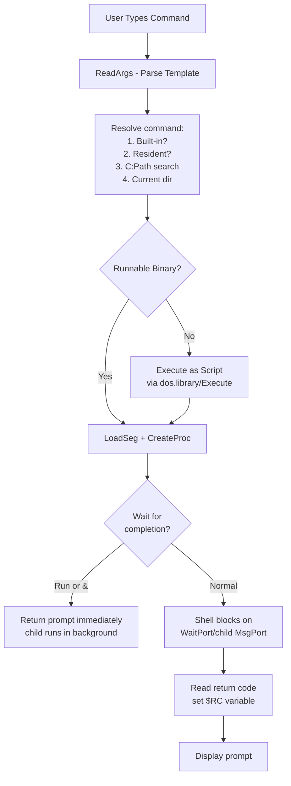

[← Home](../README.md) · [AmigaDOS](README.md)

# CLI and Shell — Command Interpreter, Scripting, and Cookbook

## Overview

AmigaDOS provides two command interpreters: the original **CLI** (Command Line Interface, OS 1.0–1.3) and its successor, the **Shell** (OS 2.0+). Both read text commands from the user or from script files, launch programs as separate Exec Processes, and provide I/O redirection, environment variables, and control-flow primitives (IF/ELSE/LAB/SKIP). Unlike Unix shells which are separate user-space programs, the Amiga Shell is tightly integrated with `dos.library` — it calls `ReadArgs()` for argument parsing, `SystemTagList()` for sub-process creation, and `Execute()` for script file interpretation. This integration means Shell scripting shares the exact same argument syntax as every AmigaDOS command and every C program that uses `ReadArgs()`.

The Shell inherited its design from the **BCPL CLI** of the original AmigaDOS (written at MetaComCo in BCPL, running on the CAOS kernel). When AmigaDOS was rewritten in C for OS 2.0, the CLI evolved into the Shell — gaining command history, line editing, pipes, and resident commands — while retaining full backward compatibility with CLI scripts.

> [!NOTE]
> Throughout this article, "Shell" refers to the OS 2.0+ interpreter and "CLI" refers to the OS 1.x predecessor. In practice, Amiga users use the terms interchangeably, and `NewShell` is the command that opens a Shell window on OS 2.0+.

---

## Architecture — How Shell Creates Processes



**Key principle**: Every command — built-in or external — runs as a separate **Exec Process** with its own message port, stack, and input/output filehandles. The Shell inherits the parent Shell's `Input()` and `Output()` filehandles, which are typically connected to the `CON:` console window. This is fundamentally different from Unix where built-in commands run within the shell process — on AmigaOS, `CD` and `Echo` are internal to the Shell, but `Dir`, `List`, and `Copy` are separate programs launched via `SystemTagList()`.

---

## Shell vs CLI — Evolution

| Feature | CLI (OS 1.0–1.3) | Shell (OS 2.0+) |
|---|---|---|
| **Binary** | `CLI` command in ROM | `Shell-Seg` in L: directory |
| **Open command** | `NewCLI` | `NewShell` |
| **Command history** | No | Yes (↑/↓ arrows, CON: history buffer) |
| **Line editing** | Backspace only | Full: cursor keys, delete word, insert/overtype |
| **Pipes** | No | Yes (`|` for stdout, `|&` for stdout+stderr) |
| **Wildcard expansion** | Manual `#?` in command code | Automatic in many built-in commands |
| **Resident commands** | No | Yes (`Resident` command keeps binary in RAM) |
| **Background execution** | `Run` command only | `Run` + `&` suffix + `RunBack` |
| **Return code ($RC)** | Limited | Full — stored after every command |
| **Script control** | IF/ELSE/SKIP/LAB/QUIT | Same, plus WARN/ERROR/FAIL interactive handling |
| **Aliases** | No | Yes (`Alias` command, local and global) |
| **Prompt customization** | Fixed format | `Prompt` command with escape sequences |
| **Path resolution** | C: only for commands | Full search path via `Path` command |

### The BCPL to C Transition

The original CLI was written in **BCPL** (the precursor to C) by MetaComCo in 1985. BCPL's word-oriented memory model (no byte addressing) and lack of standard string handling produced the infamous **BPTR** (Byte Pointer — actually a word pointer shifted left by 1) and **BSTR** (byte-length-prefixed string) conventions that still persist in `dos.library` today. The C rewrite for OS 2.0 preserved these conventions for backward compatibility but replaced the CLI binary with `Shell-Seg`, a relocatable code segment loaded from `L:Shell-Seg` at boot.

---

## I/O Redirection

AmigaDOS supports a complete set of redirection operators, all handled by the Shell before the child process is created (the child sees only its `Input()` and `Output()` filehandles):

| Operator | Meaning | Example |
|---|---|---|
| `<` | Redirect stdin from file | `Type <RAM:data.txt` |
| `>` | Redirect stdout to file (overwrite) | `Dir >RAM:listing.txt SYS:` |
| `>>` | Redirect stdout to file (append) | `Echo "entry" >>RAM:log.txt` |
| `*>` | Redirect stderr to file (OS 2.0+) | `command *>RAM:errors.txt` |
| `*>>` | Append stderr to file | `command *>>RAM:errors.txt` |
| `>NIL:` | Discard stdout | `Copy >NIL: file1 file2` |
| `*>NIL:` | Discard stderr | `command *>NIL:` |
| `<>` | Redirect both stdout and stderr (3.2+) | `command <>RAM:all.txt` |

> [!NOTE]
> Redirection operators are processed **left to right**. `command >out.txt *>err.txt` sends stdout to `out.txt` and stderr to `err.txt`. The `*>` operator is unique to AmigaDOS — it comes from the BCPL convention where `*` represents the "alternate" or error output stream.

### NIL: — The Bit Bucket

`NIL:` is a special DOS device that discards all writes and returns EOF on reads. It is not a file — it is handled internally by `dos.library` without touching any filesystem. Use it to suppress output without creating temporary files:

```
; Suppress all output from a noisy command:
Copy >NIL: *>NIL: SYS:C/#? RAM: ALL CLONE QUIET
```

---

## Pipes

### Syntax

```
; Pipe stdout of cmd1 to stdin of cmd2:
List SYS:C | Sort

; Multi-stage pipeline:
List SYS:C ALL | Sort | More

; Pipe both stdout and stderr:
command |& Filter
```

### Internal Implementation

Pipes are NOT true Unix-style byte streams. The Shell implements them as follows:

1. **Create a temporary file** in `T:` (which is typically assigned to `RAM:T`)
2. **Run the first command** with stdout redirected to the temp file: `cmd1 >T:pipe.XXXXXX`
3. **Wait for the first command to complete** (this is the key difference from Unix — Amiga pipes are **sequential**, not concurrent)
4. **Run the second command** with stdin redirected from the temp file: `cmd2 <T:pipe.XXXXXX`
5. **Delete the temp file** when done

This has important implications:

| Property | Unix Pipe | Amiga Pipe |
|---|---|---|
| Concurrency | Producer and consumer run **simultaneously** | Producer completes **before** consumer starts |
| Memory usage | Fixed kernel buffer (~64 KB) | Temp file — can be MBs in RAM |
| Back-pressure | Producer blocks when buffer full | No back-pressure — producer runs to completion |
| Failure isolation | SIGPIPE if consumer exits early | Consumer's failure does not affect producer |
| Disk I/O | None (in-memory) | If T: is on disk, heavy disk I/O |

> [!WARNING]
> Because Amiga pipes are sequential, you cannot write interactive pipelines like `tail -f log | grep ERROR`. The first command must exit before the second starts. If the first command runs forever, the second never executes and the temp file grows until RAM is exhausted.

### PIPE: Device (Alternative)

For concurrent, Unix-like pipes, OS 2.0+ provides the `PIPE:` device:

```
; Create a named pipe:
Run >PIPE:mypipe MyProducer
MyConsumer <PIPE:mypipe
```

`PIPE:` is a RAM-based handler that implements a true circular buffer between producer and consumer. Unlike Shell pipes, `PIPE:` allows concurrent execution. The buffer defaults to 4 KB and blocks the producer when full.

---

## Script Execution

### Running Scripts

Scripts are plain text files containing AmigaDOS commands. Three ways to execute:

```
; Method 1: Execute command (always works):
Execute S:MyScript

; Method 2: Set script bit and run by name:
Protect S:MyScript +s
S:MyScript

; Method 3: Dot command (interactive, runs in current Shell):
. S:MyScript
```

> [!WARNING]
> Method 3 (`.`) runs the script **within the current Shell process** — not as a sub-process. If the script calls `EndCLI`, your Shell window closes. If it calls `FailAt 30`, that error threshold is now set in your interactive Shell. Use `.` only for scripts that set environment variables or aliases that you want to persist.

### The PORT Argument

Scripts launched by icon double-click or via `Execute` receive a **message port name** as their first argument (accessible as `<scriptname>.PORT`). This is how Workbench communicates with running scripts:

```
; Script checks if it was launched with a PORT:
.key PORT
.bra {
.ket }
If "{PORT}" EQ ""
    Echo "Running interactively"
Else
    Echo "Launched from Workbench, PORT = {PORT}"
EndIf
```

> [!NOTE]
> When launching scripts from other scripts, pass an empty string as the port argument to avoid confusion: `Execute S:MyScript ""`

---

## Script Control Structures

### IF / ELSE / ENDIF

```
; IF with EXISTS, VAL, WARN, ERROR, FAIL:
IF EXISTS SYS:Libs/68040.library
    Echo "68040 detected"
ELSE IF EXISTS SYS:Libs/68881.library
    Echo "68881 FPU detected"
ELSE
    Echo "No accelerator"
ENDIF

; String comparison:
IF "$CPU" EQ "68060"
    Echo "060 rules"
ENDIF

; Numeric comparison:
IF $RC GT 5 VAL
    Echo "Return code > 5"
ENDIF
```

IF tests available:

| Test | Meaning | Example |
|---|---|---|
| `EXISTS` | File or directory exists | `IF EXISTS SYS:Prefs` |
| `WARN` | Last return code ≥ 5 (warning) | `IF WARN` |
| `ERROR` | Last return code ≥ 10 (error) | `IF ERROR` |
| `FAIL` | Last return code ≥ 20 (failure) | `IF FAIL` |
| `EQ` / `GT` / `GE` / `NOT` | String comparison | `IF "$A" EQ "hello"` |
| `VAL` | Treat arguments as numeric (precedes EQ/GT/GE) | `IF $RC GT 10 VAL` |

### LAB / SKIP — Loops

```
; Infinite loop with EXIT condition:
LAB loop
    Ask "Continue? (Y/N)"
    IF WARN
        QUIT
    ENDIF
    Echo "Looping..."
SKIP loop BACK

; Counted loop:
Set count 1
LAB countloop
    Echo "Iteration $count"
    Set count `Evaluate $count + 1`
    IF $count GT 10 VAL
        QUIT
    ENDIF
SKIP countloop BACK
```

`SKIP` with `BACK` jumps backward (creates a loop). Without `BACK`, it jumps forward (like `GOTO`). The `LAB` target name is case-insensitive.

### QUIT — Exit Script

```
; QUIT with return code:
QUIT 5    ; Exit script, return code 5 (warning)
QUIT 20   ; Exit script, return code 20 (failure)
QUIT      ; Exit with current $RC
```

### FAILAT — Error Threshold

```
FailAt 21   ; Tolerate return codes up to 20
Copy SYS:Missing RAM:
IF WARN     ; True if return code 5-9
    Echo "Copy had minor issues"
ENDIF
IF FAIL     ; True only if return code ≥ 21
    Echo "Copy failed"
    QUIT 20
ENDIF
```

The default FAILAT value is 10. `FailAt 21` is standard in `Startup-Sequence` to prevent a single missing file from aborting the entire boot. The maximum useful value is 30 (return codes above 30 are Guru-level failures that cannot be caught).

### ASK — Interactive Prompts

```
; Simple yes/no:
Ask "Proceed with installation?"
IF WARN
    Echo "Installation cancelled"
    QUIT 5
ENDIF

; ASK with default answer:
Ask "Format disk? (N)"
```

The user presses `Y` (return code 0, no warning) or `N`/anything else (return code 5, warning). `IF WARN` catches a "No" answer.

### REQUESTCHOICE — GUI Prompt

```
; OS 2.0+: Show a requester dialog from a script:
RequestChoice "Title" "Select action" "Save" "Discard" "Cancel"
IF $RC EQ 0
    Echo "Save selected"
ELSE IF $RC EQ 1
    Echo "Discard selected"
ENDIF
```

Returns 0 for the first button, 1 for the second, etc. Useful for scripts that need a quick GUI without writing a full Intuition application.

---

## Script Cookbook

### 1. Safe Copy with Verification

```
.key SRC/A,DST/A
.bra {
.ket }
FailAt 21
If NOT EXISTS {SRC}
    Echo "Source {SRC} not found"
    Quit 20
EndIf
Copy {SRC} {DST} CLONE
If WARN
    Echo "Copy had warnings — check destination"
    Quit 10
EndIf
Echo "{SRC} → {DST} OK"
```

### 2. Conditional Hardware Detection

```
; Detect accelerator and load appropriate libraries:
If EXISTS SYS:Libs/68060.library
    Echo "68060 detected"
    SetEnv CPU 68060
Else If EXISTS SYS:Libs/68040.library
    Echo "68040 detected"
    SetEnv CPU 68040
Else
    SetEnv CPU 68000
EndIf
```

### 3. Backup with Timestamp

```
; Create dated backup of a file:
.key FILE/A
.bra {
.ket }
Set date `Date`
Copy {FILE} RAM:Backup/{FILE}.$date
If NOT WARN
    Echo "Backed up to RAM:Backup/{FILE}.$date"
Else
    Echo "Backup failed!"
EndIf
```

### 4. Multi-Volume Copy with Prompt

```
.key SRC/A,DST/A
.bra {
.ket }
FailAt 21
Lab retry
Copy {SRC} {DST} ALL CLONE
If ERROR
    Ask "Disk full or error. Retry?"
    If NOT WARN
        Skip retry BACK
    EndIf
EndIf
```

### 5. Loop Over Files with Pattern Matching

```
; Process all .info files in a directory:
List SYS:Prefs/#?.info LFORMAT="Process %s" >T:filelist
Execute T:filelist
Delete T:filelist QUIET
```

### 6. Wait for a Volume to Appear

```
; Wait up to 30 seconds for a disk to be inserted:
Lab waitdisk
Wait 2
If NOT EXISTS DF0:Disk.info
    Set count `Evaluate $count + 2`
    If $count GT 30 VAL
        Echo "Timeout waiting for disk"
        Quit 20
    EndIf
    Skip waitdisk BACK
EndIf
Echo "Disk found"
```

### 7. Toggle a Feature

```
; Toggle DF0: boot priority check:
If EXISTS ENVARC:NoDiskBoot
    Delete ENVARC:NoDiskBoot QUIET
    Echo "Disk boot will be checked at startup"
Else
    Echo "" >ENVARC:NoDiskBoot
    Echo "Disk boot will NOT be checked"
EndIf
```

---

## ReadArgs — Argument Parsing

`ReadArgs()` is the standard AmigaDOS argument parser used by both C programs and the Shell itself. It implements keyword-based argument passing with type validation:

```c
/* From dos/rdargs.h — NDK 3.9 */
struct RDArgs *ReadArgs(CONST_STRPTR template,
                         LONG *array,
                         struct RDArgs *rdargs);
void FreeArgs(struct RDArgs *args);
```

### Template Format

| Qualifier | Meaning | What ReadArgs Returns | Example |
|---|---|---|---|
| `/A` | Required argument | Error if not provided | `FROM/A` |
| `/K` | Keyword (must use `KEYWORD=value`) | String pointer | `PUBSCREEN/K` |
| `/S` | Switch (boolean flag) | Non-zero if present, zero if absent | `ALL/S` |
| `/N` | Numeric value (base-10) | Pointer to LONG containing value | `BUF/N` |
| `/M` | Multiple values (array) | Pointer to array, terminated by NULL | `FILES/M` |
| `/F` | Rest of line (everything after keyword) | String pointer to remainder | `CMD/F` |
| `=` | Alias (make one name an alias for another) | Same slot | `FILE=FROM/A` |
| `/T` | Toggle (set to opposite of default) | Toggles value | `CASE/T` |

### Complete Example

```c
/* Command template: "COPY FROM/A,TO/A,ALL/S,CLONE/S,BUF/N"
 * Usage: Copy FROM DH0:file TO RAM: ALL CLONE BUF 4096
 */

LONG args[5] = {0};
struct RDArgs *rd = ReadArgs("FROM/A,TO/A,ALL/S,CLONE/S,BUF/N",
                               args, NULL);
if (rd) {
    STRPTR from  = (STRPTR)args[0];   /* FROM/A — always present */
    STRPTR to    = (STRPTR)args[1];   /* TO/A — always present */
    BOOL  all    = (BOOL)args[2];     /* ALL/S — TRUE if present */
    BOOL  clone  = (BOOL)args[3];     /* CLONE/S — TRUE if present */
    LONG *buf    = (LONG *)args[4];   /* BUF/N — pointer if given, NULL if not */

    printf("Copy %s to %s, all=%d clone=%d buf=%ld\n",
           from, to, all, clone, buf ? *buf : 0);

    FreeArgs(rd);
}
```

### How the Shell Uses ReadArgs

When the user types `Copy FROM DH0:file TO RAM: ALL CLONE`, the Shell:

1. Searches `C:Copy` and finds the binary
2. Reads the binary's **resident template string** (embedded in the executable at a known offset, or stored in the resident list if the command is Resident)
3. Calls `ReadArgs("FROM/A,TO/A,ALL/S,CLONE/S,BUF/N", array, NULL)` with the user's argument string
4. `ReadArgs()` parses the string against the template, fills the array
5. The Shell passes the filled array to the child process via the **WBenchMsg** or via registers (implementation-specific)
6. The child process receives already-parsed arguments — it never sees the raw command line

This differs from Unix where each program parses its own `argv[]`. On AmigaOS, `ReadArgs()` centralizes parsing, ensuring consistent behavior across all commands.

---

## Resident Commands

Making a command **Resident** keeps its binary in memory, eliminating disk access on every invocation:

```
; Make resident:
Resident C:Dir PURE ADD
Resident C:List PURE ADD
Resident C:Copy PURE ADD

; List resident commands:
Resident

; Remove a resident:
Resident C:Dir REMOVE
```

### Requirements for Resident

| Requirement | Why |
|---|---|
| **PURE** | Binary must be position-independent — no self-modifying code, no writable data in code section. Compiled with `-resident` flag or equivalent. |
| **Single segment** | Multi-segment executables cannot be made resident (the resident system stores a single contiguous hunk). |
| **No global constructors** | The binary's init code runs only on first load. If it allocates memory or opens libraries in constructors, those must be guarded against re-execution. |

> [!WARNING]
> A resident command that is NOT truly PURE (writes to its own code section) will work once, then produce corrupted results on subsequent invocations. The corruption is silent — no error, just wrong output. Always test a command with `Resident ... PURE` and run it 3+ times to verify correct behavior before adding it to `S:Shell-Startup`.

### Benefits and Costs

| Benefit | Cost |
|---|---|
| Instant command execution (no disk I/O) | Consumes RAM (~size of binary, permanently) |
| Reduces floppy swapping on floppy-only systems | Memory fragmentation from many small resident segments |
| Commands available even if C: is not assigned | Cannot be updated without reboot (or `REMOVE` + `ADD`) |

On a stock A500 with 1 MB RAM, keeping 10 common commands resident consumes ~50 KB — a reasonable trade-off for eliminating floppy access during script execution.

---

## Shell Environment

### Startup File Chain

The following files execute in order, each building on the previous:

| File | When Executed | Purpose |
|---|---|---|
| `S:Startup-Sequence` | At system boot (after `dos.library` init) | Core system configuration: assigns, mounts, SetPatch, IPrefs, LoadWB |
| `S:User-Startup` | Called by Startup-Sequence (before LoadWB) | User customizations: extra assigns, resident commands, startup programs |
| `S:Shell-Startup` | Each time a NEW Shell window opens | Per-Shell setup: aliases, prompt, local variables, path |

> [!NOTE]
> Do NOT modify `S:Startup-Sequence` directly. Add customizations to `S:User-Startup` instead. If `S:User-Startup` doesn't exist, create it — the default `Startup-Sequence` checks for it with `IF EXISTS S:User-Startup` and executes it if present.

### Local vs Global Variables

| Scope | Command | Storage | Example |
|---|---|---|---|
| **Local** | `Set` | In Shell's private memory — lost when Shell closes | `Set myvar hello` |
| **Global (volatile)** | `SetEnv` | `ENV:` (RAM) — shared across all Shells, lost on reboot | `SetEnv EDITOR C:ED` |
| **Global (persistent)** | `SetEnv` + `Copy ENV: ENVARC:` | `ENVARC:` (disk) — survives reboot | `SetEnv SAVE EDITOR C:ED` |

```
; Set a persistent global variable:
SetEnv SAVE MYAPP_DATA DH1:MyApp/Data

; Reference in any Shell:
Echo $MYAPP_DATA          ; Shows "DH1:MyApp/Data"

; Override locally:
Set MYAPP_DATA RAM:Temp
Echo $MYAPP_DATA          ; Shows "RAM:Temp" (local overrides global)

; Remove local override:
Unset MYAPP_DATA
Echo $MYAPP_DATA          ; Shows "DH1:MyApp/Data" (back to global)
```

### Aliases

```
; Local alias (this Shell only):
Alias ll "List LFORMAT=\\"%M %L %N\""

; Global alias (add to S:Shell-Startup):
Alias x "Execute"
Alias .. "CD /"
Alias ? "Which"
```

### Prompt Customization

```
; Default: 1.Workbench:>

; Show return code of last command:
Prompt "%R.%S> "
; Result: 0.Workbench:>

; Show only current directory:
Prompt "%S> "
; Result: Workbench:>

; Minimal prompt:
Prompt "> "
; Result: >

; Multi-line prompt with escape codes:
Prompt "*E[33m%S*E[0m*N$ "
; Result: (directory in blue, newline, dollar sign)
```

Prompt format codes:

| Code | Meaning |
|---|---|
| `%S` | Current directory |
| `%N` | Process number |
| `%R` | Return code of last command |
| `%E` | $RC as text (OK/WARN/ERROR/FAIL) |
| `*E` | Escape character (for ANSI sequences) |
| `*N` | Newline |

---

## Console Window Customization

Shell windows are `CON:` console windows. You can control their appearance via the Shell icon's Tool Types or the `NewShell` command:

```
; Open a custom Shell window from command line:
NewShell "CON:0/10/640/200/My Shell/CLOSE/SCREEN=Workbench"

; Shell icon Tool Type:
WINDOW=CON:100/50/600/400/Custom/CLOSE/AUTO/SCREEN=Workbench
```

| CON: Option | Meaning |
|---|---|
| `CLOSE` | Window has close gadget |
| `AUTO` | Auto-scroll output |
| `SCREEN=<name>` | Open on named public screen |
| `BACKDROP` | Window is a backdrop (no depth arrangement) |
| `NOBORDER` | No window border |
| `SIMPLE` | Simple refresh (faster, no smart refresh) |
| `SMART` | Smart refresh (saves obscured content) |
| `WAIT` | Window waits for user to close it after command exits |

### ANSI Escape Sequences

The Shell console supports ANSI X3.64 escape sequences for text styling:

```
; Print "Error" in red (CSI 31m = red foreground):
Echo "*E[31mError*E[0m: something went wrong"

; Bold text:
Echo "*E[1mImportant*E[22m notice"

; Clear screen:
Echo "*Ec"
```

Common sequences: color (30–37 foreground, 40–47 background), bold (1), underline (4), reverse video (7), reset (0), clear screen (`*Ec`).

---

## Built-in Shell Commands

These commands execute within the Shell process — they do NOT create sub-processes:

| Command | Function | Example |
|---|---|---|
| `CD` | Change current directory | `CD SYS:Prefs` |
| `Echo` | Print text to stdout | `Echo "Hello $USER"` |
| `If`/`Else`/`EndIf` | Conditional execution | `IF EXISTS file ... ENDIF` |
| `Skip`/`Lab` | Jump / loop | `LAB loop ... SKIP loop BACK` |
| `Quit` | Exit script with return code | `Quit 10` |
| `FailAt` | Set error threshold | `FailAt 21` |
| `Set`/`Unset` | Local variables | `Set myvar value` |
| `SetEnv`/`GetEnv` | Global environment variables | `SetEnv SAVE EDITOR C:ED` |
| `Alias` | Command aliases | `Alias ll List` |
| `Path` | Manage command search path | `Path C: SYS:Utilities ADD` |
| `Prompt` | Set Shell prompt format | `Prompt "%S> "` |
| `Protect` | Set file protection bits | `Protect file rwed` |
| `Run` | Execute command in background | `Run C:Dir SYS:` |
| `Execute` | Run script file | `Execute S:Script` |
| `EndCLI` | Close this Shell | `EndCLI` |
| `NewCLI`/`NewShell` | Open new Shell window | `NewShell` |
| `Stack` | Display or set stack size | `Stack 20000` |
| `Why` | Explain last error code | `Why` |
| `Which` | Show which binary a command resolves to | `Which Dir` |
| `Wait` | Pause for specified seconds | `Wait 5` |
| `Ask` | Prompt user for Y/N | `Ask "Continue?"` |
| `RequestChoice` | GUI requester with buttons | `RequestChoice "Title" "Body" "OK" "Cancel"` |
| `Status` | Show last command return info | `Status` |
| `Date` | Display or set system date/time | `Date` |

---

## Best Practices

1. **Always quote strings with spaces** — `Echo "Hello World"` not `Echo Hello World`
2. **Put `FailAt 21` at the top of every script** — prevents one failed command from aborting the entire script
3. **Test commands interactively before adding to scripts** — syntax errors in `S:Startup-Sequence` can prevent booting
4. **Use `>NIL:` to suppress output in scripts** — keeps the console clean and avoids filling `RAM:` with temp output
5. **Check return codes with `IF WARN` / `IF ERROR`** — never assume a command succeeded; AmigaDOS commands are chatty about failures
6. **Use full paths in startup scripts** — during boot, `C:` may not be in the search path yet; write `C:Copy` not just `Copy`
7. **Make heavily-used commands Resident before they're needed** — put `Resident C:Dir PURE ADD` in `S:User-Startup` so it's ready before scripts run
8. **Add `QUIET` to Copy/Delete in scripts** — suppresses per-file progress output
9. **Use `Execute` with an empty string port argument when calling scripts from scripts** — `Execute S:SubScript ""`
10. **Do not use `.` (dot) for general scripting** — it runs in the current Shell and can corrupt your interactive environment

## Antipatterns

### 1. The Naked WARN

**Bad**:
```
Copy SYS:Important RAM:
IF WARN
    Echo "Something went wrong"
EndIf
```

**Good**:
```
Copy SYS:Important RAM:
IF WARN
    Echo "Copy of Important had warnings — check destination"
    Ask "Continue anyway?"
    IF WARN
        Quit 10
    EndIf
EndIf
```

**Why it breaks**: `IF WARN` fires for return codes 5–9 (warnings). The Copy may have partially succeeded — reporting "Something went wrong" gives no actionable information. Always provide context and offer the user a choice when possible.

### 2. The Phantom PORT

**Bad**:
```
; Top-level script launched by icon double-click
Echo "Starting backup..."
Copy DH0: DH1: ALL CLONE
```

**Good**:
```
.key PORT
.bra {
.ket }
If NOT "{PORT}" EQ ""
    Echo "Running from Workbench"
EndIf
Echo "Starting backup..."
Copy DH0: DH1: ALL CLONE
```

**Why it breaks**: When Workbench launches a script (via icon double-click), it passes a message port name as the first argument. If the script uses `.key` with no `PORT` argument, the port name becomes the value of the first `.key` parameter — or worse, causes argument parsing to fail. Always declare `.key PORT` in scripts intended for icon launch.

### 3. The Dot-Eater

**Bad**:
```
; In S:User-Startup:
. S:MyAliases
. S:MyAssigns
```

**Good**:
```
; In S:User-Startup:
Execute S:MyAliases
Execute S:MyAssigns
```

**Why it breaks**: The dot command executes the script in the current Shell. If `S:MyAliases` contains `EndCLI` (even as a stray commented-out line), the entire boot sequence terminates. If it calls `FailAt 30`, the rest of `User-Startup` and `Startup-Sequence` continues under that threshold. Use `Execute` for robustness — it creates a separate process that cannot damage the parent Shell.

### 4. The Infinite Pipe

**Bad**:
```
; This never returns!
Run >T:log MyServer
MyClient <T:log
```

**Good**:
```
; Use PIPE: for concurrent producer/consumer
Run >PIPE:mylog MyServer
MyClient <PIPE:mylog
```

**Why it breaks**: Amiga Shell pipes are sequential — the first command must finish before the second starts. `Run >T:log MyServer` detaches the server, so it never "finishes" from the Shell's perspective. The pipe never completes. Use `PIPE:` for concurrent producer-consumer patterns.

---

## Pitfalls

### 1. Resident Command Corruption

Commands made Resident that are not truly PURE will corrupt themselves on second invocation. The classic example: a C program compiled with BSS (zero-initialized globals) that actually writes to BSS during first execution. On second invocation, those BSS values are whatever the first invocation left them as.

**Symptom**: Dir works correctly the first time, shows garbled output the second time.

**Fix**: Recompile with `-resident` (SAS/C) or ensure all global writes go through `AllocMem`-allocated buffers, not BSS. Test commands 5+ times before making them resident in `Shell-Startup`.

### 2. FAILAT Won't Catch Division by Zero

`FailAt` controls whether the Shell continues after a command returns a non-zero return code. It does NOT prevent the 68000 exception that results from a division by zero (which triggers a Guru Meditation). The Shell cannot intercept hardware exceptions — that's the job of `exec.library`'s trap handling.

**Symptom**: Script with `FailAt 999` still crashes on division by zero.

**Fix**: `FailAt` handles DOS return codes only (0–30). Protect against arithmetic errors in the program itself, not in the script.

### 3. Pipe Temp File Exhausts RAM

Since Shell pipes create a temporary file in `T:` (usually `RAM:T`), piping large data streams fills RAM:

```
; DANGER: List ALL on a large volume → temp file may be MBs
List SYS: ALL | Sort
```

On a 1 MB A500, a `List ALL` of a full hard drive can produce a temp file larger than available RAM, causing the system to freeze.

**Fix**: For large data, use `PIPE:` with a known buffer size, or redirect to a disk-based `T:`:
```
Assign T: DH1:T
List SYS: ALL | Sort     ; Temp file now on DH1: (disk)
```

### 4. CON: Window Options Case Sensitivity

CON: window specifiers are case-sensitive. `CLOSE` enables the close gadget; `Close` is silently ignored. This is a frequent source of "my Shell window won't close" bugs.

```
; WRONG — lowercase 'close' is ignored:
NewShell "CON:0/10/640/200/My Shell/close"

; CORRECT:
NewShell "CON:0/10/640/200/My Shell/CLOSE"
```

---

## Use Cases

### Real-World Applications

| Scenario | Shell Feature | Example |
|---|---|---|
| **System boot** | Startup-Sequence script | Every Amiga — configures assigns, runs IPrefs, loads Workbench |
| **WHLoad slave launchers** | Script with icon + PORT | WHDLoad game icons launch `.info`-associated scripts that set up assigns before running the slave |
| **Demo scene** | Execute + ASK | Demo disks with menu scripts: "Press Y for main demo, N for credits" |
| **Software installers** | `RequestChoice` + GUI | Commodore's Installer utility is script-driven; many third-party installers are pure Shell scripts |
| **Build systems** | `Execute` from Makefile | Amiga Make can call Shell scripts for pre/post build steps |
| **ARexx → Shell bridge** | `ADDRESS COMMAND` | ARexx scripts execute Shell commands via the command address — ReadArgs ensures consistent parsing |
| **Network boot** | Custom Startup-Sequence | SANA-II network-booted systems use Shell scripts to mount remote volumes before Workbench starts |
| **Emergency recovery** | Boot-with-no-startup | Holding both mouse buttons → "Boot With No Startup-Sequence" drops to a raw Shell for disk repair |

---

## Historical Context

### BCPL Heritage

The Amiga Shell's design is a direct descendant of the **TRIPOS** operating system (developed at Cambridge University, 1978), which was written in BCPL. Commodore licensed TRIPOS from MetaComCo in 1985 to provide the Amiga's disk operating system. BCPL's influence persists in:

- **BPTR** (Byte Pointer): actually a word pointer — in BCPL, the machine word IS the addressable unit
- **BSTR** (Byte String): length-prefixed strings (a leading byte stores the length) — BCPL had no native string type
- **`*` for stderr**: BCPL used `*` as the standard error stream prefix
- **`Execute` and script files**: BCPL's CLI had the same concept of text-based command files

### Competitive Landscape (1985–1994)

| Platform | Shell | Year | Key Features |
|---|---|---|---|
| **AmigaDOS (CLI 1.x)** | CLI | 1985 | IF/ELSE/SKIP/LAB, redirection, no pipes, BCPL-based |
| **AmigaDOS (Shell 2.0+)** | Shell-Seg | 1990 | Full scripting + pipes + aliases + history + resident commands |
| **MS-DOS** | COMMAND.COM | 1981 | Batch files with GOTO, IF EXIST; no structured loops until DOS 6 CHOICE (1993) |
| **Macintosh System 1–6** | None | 1984 | No CLI at all — GUI only until A/UX and MPW Shell |
| **Atari ST TOS** | COMMAND.PRG (GEMDOS) | 1985 | Minimal batch support in early versions; no pipes until MiNT |
| **Unix (BSD/SysV)** | sh / csh / ksh | 1977+ | Pipes, backticks, job control — far more powerful, but multi-user focus |

The Amiga Shell was competitive for its era: more capable than MS-DOS batch files (structured IF/ELSE vs GOTO), and dramatically more accessible than Unix shells (the template system meant every command had discoverable syntax via `?`). Its main weakness was the lack of true concurrent pipes and the absence of sub-shell command substitution (no backticks — you need `Execute` + temp files instead).

---

## Modern Analogies

| Amiga Concept | Modern Equivalent | Why the Analogy Holds | Where It Breaks |
|---|---|---|---|
| **Shell-Seg** | **bash** (/bin/bash) | Both read commands, launch sub-processes, provide scripting | bash has sub-shells `$()`, job control, signals; Shell has no sub-shell command substitution |
| **ReadArgs template** | **argparse / clap (Rust) / getopt** | Both provide declarative argument definition with type validation | ReadArgs is centralized — every program uses the same parser; Unix has dozens of incompatible parsers |
| **Resident command** | **shell built-in** (bash's `echo`, `cd`) | Both keep binary in memory to avoid disk I/O | Resident works on ANY executable; shell built-ins are hard-coded into the shell binary |
| **PIPE: device** | **Unix pipe `|`** | Both provide concurrent streaming between processes | Unix pipes are anonymous; Amiga PIPE: is named and must be opened by filename |
| **Startup-Sequence** | **systemd units / init scripts** | Both orchestrate system initialization | systemd is declarative (dependencies, parallel); Startup-Sequence is imperative and sequential |
| **`Execute` with PORT** | **D-Bus activation** | Both allow external events to trigger script execution | D-Bus is IPC; PORT is a simple MsgPort name string with no structured messaging |

---

## FAQ

### Q: How do I run a command and capture its output in a variable?

AmigaDOS has no backtick or `$()` equivalent. You must redirect to a temp file and read it back:
```
Date >T:myoutput
Set mydate `Type T:myoutput`
```
The backtick syntax `` `command` `` used with `Set` runs the command and substitutes its output into the variable.

### Q: Why does my script fail when launched from Workbench but work from Shell?

Workbench passes a PORT name as the first argument. Your script MUST declare `.key PORT` as the first line to consume this argument. Without it, the PORT name becomes a stray argument that may cause template parsing errors.

### Q: Can I read keyboard input without pressing Enter?

No. The Shell reads complete lines via `CON:` console input. For single-key input, use `inkey.library` or write a small C program that calls `RawKeyConvert()`. This is a fundamental limitation of line-buffered console I/O.

### Q: What's the maximum script nesting depth?

There is no hard limit, but each nested `Execute` call consumes ~4 KB of stack. After ~20 levels of nesting on a default 4096-byte stack, the script will overflow and crash. Use `Stack 20000` before deeply nested scripts.

### Q: Can I pass arguments with spaces to a script?

Yes — use double quotes. The `.key` directive respects quoted arguments:
```
; Script with KEY:
.key FILENAME/A
Echo "File: {FILENAME}"

; Invocation:
Execute MyScript "My Long Filename.txt"
```

### Q: How do I detect if I'm running in a script vs interactive Shell?

Check for `.KEY` or test if a PORT was passed:
```
.key PORT
If "{PORT}" EQ ""
    Echo "Interactive"
Else
    Echo "Script with PORT = {PORT}"
EndIf
```

### Q: Why doesn't `FailAt 999` prevent my script from stopping?

`FailAt` only affects return codes 0–30. A return code of 31+ always aborts the script. Additionally, `FailAt` does not catch hardware exceptions (division by zero, bus errors) — those trigger Guru Meditation at the exec level, not at the DOS level.

---

## References

- **NDK 3.9**: `dos/rdargs.h` — ReadArgs structure and constants
- **RKRM: AmigaDOS Manual** — Shell commands, scripting, template system
- **ADCD 2.1**: AmigaDOS Guide — complete command reference
- **AmigaDOS Inside & Out** (Kerkloh/Tornsdorf/Zoller, Abacus, 1991) — practical script cookbook
- **AmigaOS Wiki**: [AmigaDOS Advanced Features](https://wiki.amigaos.net/wiki/AmigaOS_Manual:_AmigaDOS_Advanced_Features) — Pipe, escape sequences, startup files

## See Also

- [File I/O](file_io.md) — Open/Close/Read/Write that Shell scripts rely on
- [Process Management](process_management.md) — CreateNewProc, SystemTagList — how Shell launches programs
- [Environment](environment.md) — GetVar/SetVar, ENV:/ENVARC: variable system
- [Error Handling](error_handling.md) — IoErr, PrintFault — the return codes that FailAt catches
