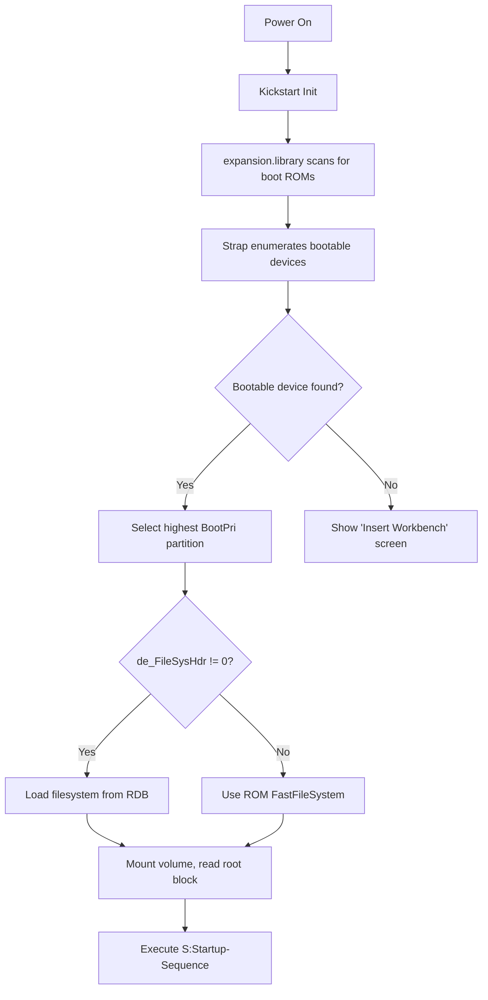
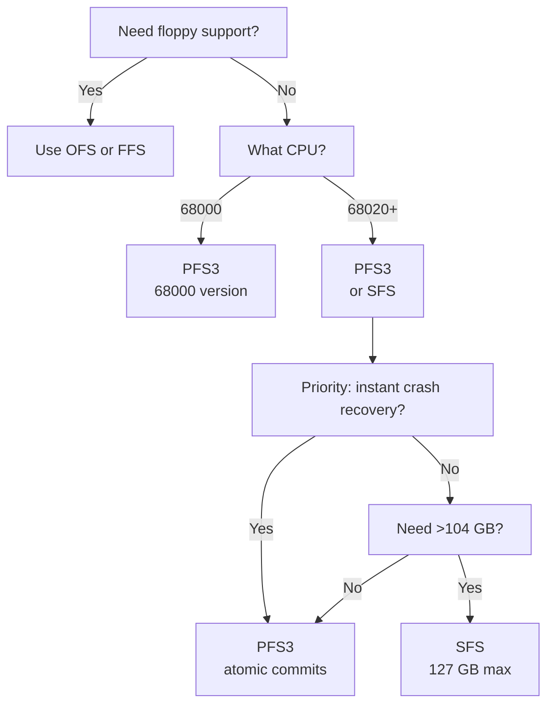

[← Home](../README.md) · [AmigaDOS](README.md)

# Filesystem — FFS/OFS Block Structure and Disk Layout

## Overview

AmigaOS supports two native filesystem types: **OFS** (Old File System, OS 1.x) and **FFS** (Fast File System, OS 2.0+). Both use a block-based layout with 512-byte blocks and work on floppies and hard disks alike. FFS improves throughput by stripping per-block headers from data blocks. Both are limited to 4 GB partitions (32-bit signed arithmetic), 30-character filenames (107 with DOS\6/\7 on OS 3.5+), and offer no journaling — a crash forces a full validation pass that rebuilds the bitmap, sometimes losing files. Third-party replacements (**PFS3**, **SFS**, **FFS2** in OS 3.5+) address these limits with atomic commits, >100 GB volumes, and extent-based allocation. Understanding the on-disk layout is essential for FPGA core developers implementing virtual filesystems, HDF support, and ADF image handling.

---

## Filesystem Capabilities & Limits

### Native Filesystems — OFS & FFS

| Capability | OFS (DOS\0) | FFS (DOS\1) | Notes |
|---|---|---|---|
| **Max partition size** | 4 GB | 4 GB (2 GB on KS 1.3) | 32-bit signed block/byte arithmetic; FFS2 in OS 3.5+ raises this with NSD/TD64 |
| **Max file size** | ~4 GB | ~4 GB | 32-bit `byte_size` field in file header |
| **Max files per directory** | Unlimited¹ | Unlimited¹ | Hash chains grow without bound; practical limit is volume block exhaustion |
| **Max filename length** | 30 chars | 30 chars (107 with DOS\6/\7) | BSTR length-prefixed; OS 3.5+ adds long filename support |
| **Max path length** | ~256 chars | ~256 chars | Limited by DOS packet buffer; no explicit OS-enforced limit |
| **Max directory nesting** | No hard limit | No hard limit | Practical limit: ~50 levels before path buffer overflows |
| **Block size** | 512 bytes (fixed) | 512 bytes (fixed) | Hardcoded; block size is never configurable |
| **Media support** | Floppy + HDD | Floppy + HDD | Both work identically on any block device |
| **International mode** | DOS\2 | DOS\3 | Case-insensitive filename comparison for non-ASCII locales |
| **Directory caching** | No | DOS\4 | Caches directory block lookups in RAM |
| **Crash resilience** | None | None | Both require full validation after unclean shutdown; no journaling, no atomic writes |
| **Metadata checksums** | Yes | Yes | Every block (root, file header, directory, data) has a checksum at offset $014 |
| **Self-describing blocks** | Yes | No | OFS data blocks contain back-pointers to file header; FFS data blocks are raw — unrecoverable if lost |

¹ **Directory file count in practice:** A directory's hash table has 72 slots (DD floppy) or 128+ (hard disk partitions). Each slot starts a collision chain. With a good hash distribution, 72-entry tables comfortably handle ~500 files before chain-walking overhead becomes noticeable. The theoretical limit is the number of free blocks on the volume — every file/directory entry consumes at least one block.

### Third-Party Filesystems

| Capability | PFS3 (TD64) | PFS3 (DirectSCSI) | SFS | FFS2 (OS 3.5+) |
|---|---|---|---|---|
| **Max volume size** | 104 GB | 104 GB | 127 GB | >4 GB (NSD/64-bit) |
| **Max file size** | ~4 GB | ~4 GB | 4 GB | >4 GB (64-bit offsets) |
| **Max filename** | 107 chars | 107 chars | 107 chars | 107 chars |
| **Block sizes** | 512, 1024, 2048, 4096 | 512, 1024, 2048, 4096 | 512 to 32768 | 512 (fixed) |
| **Media support** | **HDD only** | **HDD only** | **HDD only** | Floppy + HDD |
| **Atomic commits** | ✅ Yes | ✅ Yes | ✅ (journaling) | ❌ No |
| **Crash recovery** | Instant — always consistent | Instant — always consistent | Replays journal (~seconds) | Full validation (minutes) |
| **Delayed writes** | Yes (safe — atomic) | Yes (safe — atomic) | Yes | Dangerous — can corrupt bitmap |
| **Extent-based allocation** | ✅ | ✅ | ✅ | ❌ (bitmap) |
| **Multi-user support** | MuFS variant available | MuFS variant available | ❌ | ❌ |
| **Min CPU requirement** | 68000 | 68000 | 68020+ | 68020+ (OS 3.5 req.) |
| **KS version** | 2.0+ | 2.0+ | 2.0+ | 3.5+ |

---

## Disk Geometry and Layout

### ADF (Amiga Disk File) — Floppy Disk

```
Total: 880 KB = 1,760 sectors = 80 tracks × 2 sides × 11 sectors
Block size: 512 bytes
Blocks 0–1: Boot block (1 KB)
Block 880:  Root block (always at disk midpoint)
```

### HDF (Hard Disk File) — Hard Drive

Hard disks use the **RDB (Rigid Disk Block)** partitioning scheme — a flexible linked-list structure far more capable than the PC MBR of the same era. There is no distinction between "primary" and "logical" partitions; all partitions are peers in a singly-linked list.

```
Block 0:       RDB (Rigid Disk Block) — "RDSK" signature
Block 1–N:     Partition blocks (linked list, one per partition)
               ├─ Partition 0: DH0 (Workbench)
               ├─ Partition 1: DH1 (Work)
               ├─ Partition 2: DH2 (Games)
               └─ Partition N: ...
Block N+1:     First partition data begins
               (may be offset for cylinder alignment)
```

### RDB (Rigid Disk Block) — Block 0

The RDB is the master header for the entire physical disk. Its 4-byte signature is `RDSK` ($5244534B):

```
Offset  Size    Field                Description
──────  ──────  ───────────────────  ──────────────────────────────────
$00     4       rdb_ID               "RDSK" signature
$04     4       rdb_SummedLongs      Size of checksummed area (usually 64)
$08     4       rdb_ChkSum           Checksum
$0C     4       rdb_HostID           Host SCSI ID (for multi-initiator buses)
$10     4       rdb_BlockBytes       Block/sector size (usually 512)
$14     4       rdb_Flags            Disk flags
$18     4       rdb_BadBlockList     Pointer to bad-block list
$1C     4       rdb_PartitionList    ➜ First PartitionBlock in linked list
$20     4       rdb_FileSysHdrList   ➜ Filesystem header list
$24     4       rdb_DriveInit        Drive initialization code pointer
$2C     4       rdb_Cylinders        Physical cylinders
$30     4       rdb_Sectors          Sectors per track
$34     4       rdb_Heads            Heads (surfaces)
$38     4       rdb_Interleave       Interleave factor
$3C     4       rdb_ParkingZone      Head parking cylinder
$44     4       rdb_LoCyl            Low cylinder (start of partitionable area)
$48     4       rdb_HiCyl            High cylinder (end of partitionable area)
$4C     4       rdb_CylBlocks        Blocks per cylinder = Heads × Sectors
$50     4       rdb_AutoParkSeconds  Auto-park timeout
$54     4       rdb_HighRSVDBlock    Highest reserved block for RDB area
```

> [!NOTE]
> Solaris fields `rdb_LoCyl` and `rdb_HiCyl` define the partitionable region. The RDB and partition blocks occupy the reserved area *before* `rdb_LoCyl`. Partition data starts at `rdb_LoCyl`.

### PartitionBlock — Linked List

Each partition is described by a PartitionBlock chained via `de_Next` pointers. TheRDB's `rdb_PartitionList` field points to the first one:

```
Offset  Size    Field                  Description
──────  ──────  ─────────────────────  ──────────────────────────────────
$00     4       de_ID                  "PART" signature ($50415254)
$04     4       de_SummedLongs         Checksum range size
$08     4       de_ChkSum              Partition block checksum
$10     4       de_DosType             Filesystem identifier (e.g., DOS\1 for FFS)
$18     4       de_Flags               Partition flags (see below)
$1C     4       de_BootPri             Boot priority (-127 to 127)
$20     4       de_LowCyl              Start cylinder
$24     4       de_HighCyl             End cylinder
$28     4       de_NumBuffers          Suggested buffer count
$2C     4       de_BufMemType          Memory type for buffers (MEMF_PUBLIC)
$30     4       de_MaxTransfer         Max transfer size per I/O operation
$34     4       de_Mask                Address mask for DMA alignment
$38     4       de_BootBlocks          Boot block range (for KS 1.3: first block)
$3C     4       de_Surfaces            Heads/surfaces for this partition
$40     4       de_SectorsPerTrack     Sectors per track (usually 1 for modern)
$44     4       de_ReservedBlocks      Reserved boot area at partition start
$48     4       de_PreAlloc            Pre-allocated blocks (special use)
$4C     4       de_Interleave          Interleave
$50     4       de_Next                ➜ Next PartitionBlock in linked list (0 = end)
$54     4       de_SizeBlock           Block size in bytes (usually 512, PFS3 can use 1024+)
$58     4       de_FileSysHdr          ➜ Filesystem header for this partition (0 = use ROM FS)
```

### Partition Flags (de_Flags)

| Bit | Constant | Meaning |
|---|---|---|
| 0 | `PBF_BOOTABLE` | Partition can be selected for boot |
| 1 | `PBF_AUTOMOUNT` | Automatically mount on boot (off = not mounted) |

> [!WARNING]
> A partition with `PBF_AUTOMOUNT`=0 still exists on disk but will **not appear** as a DOS device until manually mounted. The Kickstart ignores non-automount partitions during the boot device scan. This is how "hidden" partitions for dual-boot are configured.

### Filesystem Header in RDB

The RDB can store **complete filesystem binaries** inline — this is how PFS3 and SFS work without patches to the Kickstart ROM. The `rdb_FileSysHdrList` field chains FileSysHdr blocks, each containing:

```
Offset  Size    Field           Description
──────  ──────  ──────────────  ──────────────────────────────────
$00     4       fh_ID           "FSHD" signature
$04     4       fh_SummedLongs  Checksum range
$08     4       fh_ChkSum       Checksum
$0C     4       fh_DosType      Filesystem DosType this binary handles
$10     4       fh_Version      Filesystem version
$14     4       fh_Size         Binary code size in bytes
$18     4       fh_Next         ➜ Next FileSysHdr in linked list
$1C     ...     fh_Code[]       Filesystem binary code
```

Each PartitionBlock's `de_DosType` encoding matches a FileSysHdr's `fh_DosType`. When the Kickstart boots, it looks up the filesystem code from the RDB, loads it into RAM, and uses it instead of (or alongside) the ROM filesystem.

### Partition Limits

| Limit | Value | Notes |
|---|---|---|
| **Max partitions** | Unlimited (RDB space limited) | Practical: 8–16 typical; ~30+ on large disks with expanded RDB area |
| **Min partition size** | 1 cylinder (~1–8 MB typical) | Depends on geometry; smaller is possible with logical sizes |
| **Max partition size** | ~2^73 bytes (8 ZiB) theoretical | Practical: 104 GB (PFS3), 127 GB (SFS), ~128 GB (FFS2 NSD) |
| **Bootable partitions** | Any number can be marked bootable | Kickstart selects highest BootPri; tie = first in list |
| **Filesystems per disk** | Multiple — each partition can use a different FS | OFS on DH0, PFS3 on DH1, SFS on DH2 — all valid |
| **KB included for RDB area** | Configurable via `rdb_HighRSVDBlock` | Default: ~2–8 MB; increase for many partitions or large FS binaries |

---

## Kickstart Boot Process — From Power-On to Bootable Partition

### Phase 1: ROM Initialization

1. **Early Startup** — Kickstart initializes exec, expansion.library scans for boot ROMs (Zorro cards, accelerator auto-boot ROMs)
2. **Device enumeration** — All block device drivers (scsi.device, trackdisk.device, expansion card drivers) register themselves with exec
3. **Strap module** — exec passes control to the Strap module, which builds a list of bootable devices

### Phase 2: Boot Device Selection

Strap enumerates every block device that reports a bootable partition and sorts by **boot priority** (highest first):

```
Device           BootPri  Partition    Filesystem
──────────────────────────────────────────────────
DH0 (HDD)        5        Workbench    FFS (DOS\1)
DF0 (Floppy)     3        —            OFS or custom
CC0 (CD-ROM)     1        CD-ROM       ISO 9660
```

- **Highest BootPri wins** — If DH0 has BootPri=5 and DF0 has BootPri=3, the hard disk boots first
- **Floppy override at ≥ BootPri 15**: Setting a hard disk partition's BootPri ≥ 15 overrides the floppy even when a floppy is inserted (normal behavior = floppy boots before HDD at default priorities)
- **Tie-breaking**: If two partitions have the same BootPri, the **first** in the RDB partition linked list wins
- **Custom boot blocks**: On floppies, the boot block can contain custom code that takes over before the normal DOS boot. Hard disks ignore boot blocks — they always use the RDB-internal boot path

### Phase 3: Loading the Filesystem

For the chosen partition:

1. Follow `de_FileSysHdr` pointer to the FileSysHdr block
2. If non-zero: copy the filesystem binary into RAM and jump to its Init routine (this is how PFS3/SFS load from RDB without being in Kickstart ROM)
3. If zero: use the built-in ROM filesystem (FFS at `L:FastFileSystem` from Kickstart)
4. The filesystem mounts the volume, reads the root block, and locates `S:Startup-Sequence`



### Phase 4: Early Startup Menu

Holding both mouse buttons at power-on interrupts the boot and displays the **Early Startup Menu**. This lets the user:

- Select a specific partition to boot (overrides BootPri)
- Disable individual partitions (useful for incompatible setups or RAM conservation)
- Toggle CPU caches on/off
- Display expansion board diagnostics

This is the primary way to dual-boot: you install multiple OS components on different partitions, set one as default (high BootPri), and use Early Startup to select alternatives. No bootloader software needed.

### Valid Multi-Boot Configurations

| Scenario | Setup | How to Boot |
|---|---|---|
| **Dual OS (3.1 + 3.9)** | Two bootable partitions: DH0=3.1 (BootPri 5), DH1=3.9 (BootPri 4) | Default boots 3.1; Early Startup selects DH1 for 3.9 |
| **OS 4.x Classic + 3.x** | Requires separate Kickstart ROMs (OS4 uses its own) | Typically hardware Kickstart switcher + Early Startup |
| **MorphOS + AmigaOS** | Separate partitions; MorphOS uses SFS-based fixing | Early Startup or MorphOS boot loader |
| **Recovery + Main** | Small emergency partition (OFS/FFS, BootPri 10) + Main partition (PFS3, BootPri 5) | Recovery auto-boots if main FS absent; Early Startup overrides |
| **Games-only + Workbench** | Games partition (BootPri 0, or Automount off) + Workbench partition (BootPri 5) | Early Startup to select games; otherwise invisible |

> [!NOTE]
> There is **no bootloader discovery mechanism** on classic Amigas — each OS install is independent. You can't chain-load from one partition to another (like GRUB). The Early Startup Menu or BootPri remapping tools (`BootPri`, `ChangeBootPri`) are the standard methods.

---

## Block Types

| Type | ID | Constant | Purpose |
|---|---|---|---|
| Boot block | — | (bytes 0–1023) | Boot code + filesystem ID (`DOS\0` to `DOS\7`) |
| Root block | 2 | `T_HEADER` | Volume root directory — always at midpoint |
| File header | 2 | `T_HEADER` | File metadata + first 72 data block pointers |
| Directory | 2 | `T_HEADER` | Subdirectory — contains 72-slot hash table |
| Data block | 8 | `T_DATA` | OFS: 24-byte header + 488 data bytes |
| Extension | 16 | `T_LIST` | Overflow block pointers for files >72 blocks |
| Bitmap block | — | — | Free/allocated block tracking |

---

## Boot Block (Blocks 0–1)

```
Offset  Size  Field
──────  ────  ─────────────────────
$00     4     Filesystem ID — "DOS\0" to "DOS\7"
$04     4     Checksum
$08     4     Root block number (usually 880)
$0C     1012  Boot code (optional — loaded by ROM bootstrap)
```

### Filesystem ID Variants

| ID | Hex | Description |
|---|---|---|
| `DOS\0` | $444F5300 | OFS (original) |
| `DOS\1` | $444F5301 | FFS (fast file system) |
| `DOS\2` | $444F5302 | OFS + International mode (case-insensitive) |
| `DOS\3` | $444F5303 | FFS + International mode |
| `DOS\4` | $444F5304 | FFS + Directory cache |
| `DOS\5` | $444F5305 | OFS + International + Directory cache |
| `DOS\6` | $444F5306 | OFS + Long filenames (OS 3.5+) |
| `DOS\7` | $444F5307 | FFS + Long filenames (OS 3.5+) |

---

## Root Block (Block 880 on Floppy)

The root block is the entry point for the entire filesystem. It always lives at the midpoint of the partition:

```
root_block_number = (total_blocks) / 2  /* e.g., 1760/2 = 880 */
```

### Root Block Layout (512 bytes)

```
Offset  Size    Field                   Description
──────  ──────  ──────────────────────  ────────────────────────────────
$000    4       type                    Always 2 (T_HEADER)
$004    4       header_key              Own block number
$008    4       high_seq                0 (unused for root)
$00C    4       ht_size                 Hash table size (72 for DD floppy)
$010    4       first_data              0 (unused)
$014    4       checksum                Block checksum
$018    288     ht[72]                  Hash table: LONG[72] block pointers
                                        for directory entries (0 = empty slot)
$138    4       bm_flag                 Bitmap valid flag (-1 = valid)
$13C    100     bm_pages[25]            LONG[25] pointers to bitmap blocks
$1A0    4       bm_ext                  Pointer to extended bitmap block
$1A4    12      last_root_alteration    DateStamp: root last modified
$1B0    32      disk_name               BSTR: volume name (length-prefixed)
$1D0    4       (reserved)
$1D4    12      last_disk_alteration    DateStamp: disk last modified
$1E0    12      creation_date           DateStamp: volume creation date
$1EC    4       (reserved)
$1F0    4       extension              0 (unused for root)
$1F4    4       sec_type               1 = ST_ROOT
$1F8    4       (reserved)
$1FC    ← end of 512-byte block
```

---

## Hash Function

File and directory names are hashed into the hash table slots:

```c
/* The canonical AmigaDOS hash function: */
ULONG HashName(const char *name, ULONG table_size)
{
    ULONG hash = (ULONG)strlen(name);
    for (int i = 0; name[i]; i++)
    {
        hash = (hash * 13 + toupper((unsigned char)name[i])) & 0x7FF;
    }
    return hash % table_size;
}
/* table_size = 72 for DD floppy, 128 for HD floppy */
```

### Hash Collision Resolution

Collisions are resolved by **chaining**: each file/directory header has a `hash_chain` pointer (at offset `$1F0`) linking to the next entry that hashed to the same slot. The chain ends with 0.

```
Hash Table (root block):
  Slot 0: → 0 (empty)
  Slot 1: → Block 950 ("Startup-Sequence")
           └→ Block 1100 ("System-Startup") ← hash_chain
               └→ 0 (end)
  Slot 2: → Block 882 ("Libs")
  ...
```

---

## File Header Block

```
Offset  Size    Field                   Description
──────  ──────  ──────────────────────  ──────────────────────────────
$000    4       type                    2 (T_HEADER)
$004    4       header_key              Own block number
$008    4       high_seq                Number of data block pointers stored here
$00C    4       data_size               0 (unused in file header)
$010    4       first_data              First data block (OFS only — FFS uses table)
$014    4       checksum
$018    288     data_blocks[72]         LONG[72] — block pointers to data blocks
                                        Stored in REVERSE ORDER: [71]=first, [0]=last
$138    — ...   (padding/reserved)
$144    4       protect                 Protection bits (RWED)
$148    4       byte_size               File size in bytes
$14C    80      comment                 BSTR: file comment
$19C    12      date                    DateStamp: file modification date
$1A8    32      filename                BSTR: file name (length-prefixed)
$1D0    4       real_entry              For hard links: the real file header
$1D4    4       next_link               For hard links: next link to same file
$1EC    4       hash_chain              Next entry in same hash slot (0 = end)
$1F0    4       parent                  Block number of parent directory
$1F4    4       extension              Block number of extension block (0 = none)
$1F8    4       sec_type               -3 = ST_FILE
```

> **Reverse order**: Data block pointers in `data_blocks[]` are stored **last-to-first**. Index 71 points to the first data block, index 70 to the second, etc. This is a BCPL heritage quirk.

---

## OFS vs FFS — Data Block Differences

### OFS Data Block (T_DATA = 8)

```
$000    4       type            8 (T_DATA)
$004    4       header_key      Pointer back to file header
$008    4       seq_num         Sequence number (1-based)
$00C    4       data_size       Bytes of valid data in this block
$010    4       next_data       Next data block (0 = last)
$014    4       checksum
$018    488     data[488]       Actual file data (488 usable bytes)
```
**Efficiency**: 488 / 512 = **95.3%** — 24 bytes wasted per block on headers.

### FFS Data Block

```
$000    512     data[512]       Pure file data — no header overhead
```
**Efficiency**: 512 / 512 = **100%**

| Feature | OFS | FFS |
|---|---|---|
| Bytes per data block | 488 | 512 |
| Header overhead | 24 bytes/block | 0 |
| Self-describing blocks | Yes (can recover from corruption) | No |
| Max filename | 30 chars | 30 chars (107 with DOS\6/\7) |
| Throughput | ~5% slower | Baseline |
| International mode | DOS\2 | DOS\3 |
| Directory cache | No | DOS\4 |
| Min OS version | 1.0 | 2.0 |

---

## Bitmap Blocks — Free Space Tracking

The bitmap tracks which blocks are free (1) or allocated (0):

```c
/* Each bitmap block covers up to (512-4) × 8 = 4064 blocks */
struct BitmapBlock {
    ULONG checksum;         /* block checksum */
    ULONG map[127];         /* bit 1 = free, bit 0 = allocated */
    /* bit 0 of map[0] = block corresponding to this bitmap's range */
};
```

The root block's `bm_pages[25]` array can reference up to 25 bitmap blocks, covering 25 × 4064 = **101,600 blocks** (≈49 MB). Larger partitions need `bm_ext` extension blocks.

---

## Checksum Algorithm

```c
LONG ComputeBlockChecksum(ULONG *block, LONG longs)
{
    LONG sum = 0;
    block[5] = 0;  /* clear checksum field before computing */
    for (int i = 0; i < longs; i++)
        sum += block[i];
    return -sum;   /* store at block[5] so total = 0 */
}
/* Verify: if sum of all 128 longs (incl. checksum) = 0, block is valid */
```

---

## File Extension Blocks

Files larger than 72 data blocks need extension blocks to store additional pointers:

```
extension_block.data_blocks[72] → next 72 data block pointers
extension_block.extension → next extension block (or 0)
```

Each extension block adds 72 more data block pointers. With FFS (512 bytes/block):
- 72 blocks = 36 KB directly in file header
- +72 per extension = 36 KB more per extension
- Maximum chain depth is effectively unlimited

---

## Third-Party Filesystems — Deep Dive

### Why Replace FFS?

OFS and FFS were designed for floppy-sized media in the mid-1980s. By the mid-1990s, hard drives exceeded 4 GB routinely, and FFS's lack of crash resilience made it a liability. Three major replacements emerged, each tackling different pain points.

### PFS3 (Professional File System 3)

Developed by Michiel Pelt (Greed Developments), PFS3 is the gold standard for modern Amiga setups. Originally commercial (GBP 36), now open-source and freely available on Aminet (`PFS3_53.lha`).

**How it works:** PFS3 uses **atomic commits** — metadata changes are written to a new location first, then a single pointer update makes them visible. If power fails mid-write, the old state remains intact. The filesystem is always consistent; there is no validation pass, ever.

**Key features:**
- **Delayed writes are safe** — dirty buffers commit atomically; unlike FFS, where a crash during delayed writes corrupts the bitmap
- **Extent-based allocation** — contiguous runs of blocks reduce fragmentation and improve sequential read speed
- **Configurable block sizes** — 512, 1024, 2048, or 4096 bytes; larger blocks reduce metadata overhead for big files
- **Directory indexing** — internal B-tree-style structure ("anode" tree) eliminates hash chain walking for large directories
- **Long filenames** — 107 characters, same as DOS\6/\7
- **Multi-user variant** — MuFS version integrates with Geert Uytterhoeven's multi-user filesystem for UNIX-style permissions

**Two variants:**
| Variant | Driver Interface | When to Use |
|---|---|---|
| **TD64** | TrackDisk64 commands | Modern IDE/SCSI controllers that support TD64 (PowerFlyer, FastATA, etc.) |
| **DirectSCSI** | Raw SCSI commands, bypasses device layer | A1200/A4000 internal IDE port; older controllers without TD64 support |

> [!WARNING]
> PFS3 is **hard disk only**. It cannot be used on floppy disks — its metadata structures require more space than an 880 KB floppy provides.

**Pros:**
- Zero validation time — reboot is instant after any crash
- 2–5× faster than FFS on accelerated machines (68030+), especially with large directories
- No fragmentation problems with extent-based allocation
- Open source, actively maintained (Aminet `PFS3_53`)
- Block size tuning for workload (512 for many small files, 4096 for large media files)

**Cons:**
- No floppy support — floppy-only workflows must stay on OFS/FFS
- Manual installation — must be copied into RDB and each partition reconfigured
- Version confusion — PFS2 CD + PFS3 update disk was the original distribution; modern users should get PFS3_53 directly from Aminet
- Older-era sizing quirks — 68000 version exists but is slow; real benefits only on 68020+

### SFS (Smart File System)

Developed by John Hendrikx, SFS takes a journaling approach rather than PFS3's atomic-commit model. It records pending changes to a journal before applying them; after a crash, the journal is replayed.

**Key features:**
- **Journaling** —changes logged before application; replay takes seconds, not minutes
- **Large block support** — up to 32 KB blocks, reducing metadata overhead for media files
- **Extent-based allocation** — similar to PFS3; contiguous runs reduce fragmentation
- **Defragmentation tools** — SFS includes built-in defrag utilities (PFS3 largely doesn't need them)
- **127 GB max volume** — slightly larger than PFS3's 104 GB limit

**Pros:**
- Larger max volume than PFS3 (127 GB vs 104 GB)
- Journal replay is fast (seconds vs FFS minutes)
- Large block support good for media-heavy workloads
- Built-in defragmentation

**Cons:**
- Requires 68020+ CPU minimum (no 68000 version)
- Journal replay still takes time (PFS3 is instant)
- 4 GB max file size (same as FFS)
- Less widely adopted than PFS3 in the modern Amiga community
- HDD only — same as PFS3

### FFS2 — Fast File System 2 (OS 3.5 / 3.9)

AmigaOS 3.5 and 3.9 ship an updated FFS that adds 64-bit support via NSD (New Style Device) or TD64. This is the "official" large-disk solution, but carries forward FFS's fundamental validation problem.

**Key features:**
- **64-bit arithmetic** — partitions and files >4 GB (requires NSD patching at boot via `SetPatch`)
- **Long filenames** — 107 characters (DOS\6/\7)
- **Backward compatible** — still works on floppies; still uses bitmap allocation
- **NO journaling or atomic commits** — crashes still trigger full validation

**Pros:**
- Official Commodore/Haage & Partner solution
- Works on floppies (unlike PFS3/SFS)
- Backward compatible with all old tools
- No third-party installation needed on OS 3.5+

**Cons:**
- Still validates after every crash — can take minutes on large drives and sometimes fails
- NSD requires boot-time patching (`NSDPatch.cfg` in `DEVS:`)
- Old disk tools (DiskSalv, Quarterback, ReOrg) break on >4 GB partitions
- Some older buffered IDE interfaces incompatible with NSD
- Still 512-byte blocks, still bitmap allocation, still no atomicity

### Which Filesystem Should I Use?



---

## Crash Resilience — Validation vs Atomic Commits vs Journaling

### FFS/OFS: Validation

When an Amiga with FFS suffers an unclean shutdown (power loss, guru meditation, reset), the bitmap — which tracks free vs allocated blocks — may be out of sync with actual block usage. On next boot, DOS triggers **validation**:

1. Scan every block on the partition
2. Rebuild the bitmap from scratch by checking which blocks are referenced
3. Mark all unreferenced blocks as free
4. DOS generates "checksum error on block N" for any corrupt metadata

**Cost:**
| Drive Size | Typical Validation Time (68030/50) |
|---|---|
| 100 MB | ~10–15 seconds |
| 500 MB | ~45–90 seconds |
| 2 GB | ~3–6 minutes |
| 4 GB | ~6–12 minutes |

If validation fails (corrupt root block, broken hash chain), the volume remains inaccessible until DiskSalv or Quarterback repairs it — and files are often lost in the process.

### PFS3: Atomic Commits

PFS3 never validates. Every metadata operation follows a write-twice protocol:

1. Write new metadata to a free block (the "shadow copy")
2. Update a single root pointer to point to the new metadata
3. Mark the old block as free

If power fails at step 1 — old pointer still points to valid old data. If power fails at step 2 — the pointer update either completes (new state) or doesn't (old state). There is no intermediate corrupt state. The filesystem is **always consistent**.

### SFS: Journaling

SFS writes pending changes to a journal (a reserved area on disk) before modifying the main structures. After a crash:

1. On mount, check journal for uncommitted entries
2. Replay them in order (redo log)
3. Mark journal clean

Replay is fast (seconds) but not instant like PFS3. The journal itself can be corrupted by a crash during journal writes — a well-known journaling vulnerability that PFS3's atomic-pointer approach avoids entirely.

### Comparison

| Crash Scenario | OFS/FFS | FFS2 (OS 3.5+) | PFS3 | SFS |
|---|---|---|---|---|
| Power loss during file write | Validation required | Validation required | Instant recovery | Journal replay (~seconds) |
| Power loss during directory create | Validation required | Validation required | Instant recovery | Journal replay |
| Power loss during rename | Validation required | Validation required | Instant recovery | Journal replay |
| Power loss during format | Volume likely lost | Volume likely lost | Volume consistent (atomic) | Journal replay |
| Risk of file loss | Moderate to high | Moderate to high | **Zero** (by design) | Very low |
| Best for... | Floppy-only, 68000 | OS 3.5+ with floppy needs | **Any hard disk Amiga** | Large volumes >104 GB |

> [!WARNING]
> FFS "delayed writes" (buffered writes that flush later) are dangerous. If a crash occurs before the flush, the bitmap is corrupt. PFS3's delayed writes are safe because the atomic-commit protocol guarantees either the full write or nothing. **On FFS, always disable delayed writes** by not using `ACTION_WRITE` with buffering — or use `ACTION_FLUSH` after every critical write.

---

## Fragmentation & Defragmentation

### How Bitmap Allocation Causes Fragmentation

OFS and FFS allocate blocks from a bitmap — a flat, per-partition table where each bit represents one block (1 = free, 0 = allocated). The allocator scans the bitmap linearly and takes the first available block:

```
Allocating a 10-block file on a busy volume:

Free bitmap before:  1111011110 0001101111 1111001110 ...
                     ^^^^      ^  ^^ ^
File blocks end up:  [0][1][2][3]  [4]  [5][6] [7][8][9]
                     scattered across the bitmap
```

After files are created, modified, and deleted over weeks or months, the free blocks become a Swiss-cheese pattern of isolated gaps. A new file that needs 50 contiguous blocks will be split across dozens of non-contiguous groups — **fragmentation**.

### Quantified Impact

Fragmentation affects different media differently:

| Media | Seek Time | Fragmentation Penalty |
|---|---|---|
| **DD Floppy** (880 KB) | ~30 ms track-to-track | Negligible — small total blocks; everything is ~seeks away regardless |
| **Mechanical HDD** (1990s) | ~15–20 ms avg | **Severe** — fragmented file can be 3–10× slower to read sequentially |
| **Mechanical HDD** (late 1990s) | ~8–12 ms avg | Moderate — faster seeks help, but still 2–4× penalty |
| **CF Card / SSD** (IDE adapter) | ~0.1 ms | **Negligible** — no mechanical seek; random access is nearly as fast as sequential |

> [!NOTE]
> On CF cards and SSDs connected via IDE adapter, fragmentation has effectively zero performance impact. The seek time is ~0.1 ms regardless of block location. This makes PFS3's anti-fragmentation features less critical on solid-state — the main reason to use PFS3 on a CF setup is **crash resilience**, not fragmentation avoidance.

### Visual: Fragmented vs Contiguous

```
Fragmented file (OFS/FFS bitmap allocation):
┌────┬────┬────┬────┬────┬────┬────┬────┬────┬────┐
│ B0 │    │    │ B1 │ B2 │    │    │ B3 │ B4 │ B5 │
└────┴────┴────┴────┴────┴────┴────┴────┴────┴────┘
  ↑         ↑    ↑              ↑    ↑    ↑
  Disk head seeks 4 times to read 6 blocks

Contiguous file (PFS3/SFS extent allocation):
┌────┬────┬────┬────┬────┬────┬────┬────┬────┬────┐
│ B0 │ B1 │ B2 │ B3 │ B4 │ B5 │    │    │    │    │
└────┴────┴────┴────┴────┴────┴────┴────┴────┴────┘
  ↑                             
  Disk head reads all 6 blocks in one sweep
```

### Defragmentation Tools

Since OFS/FFS has no built-in defragmentation, third-party tools filled the gap:

| Tool | Author | How It Works | Limitations |
|---|---|---|---|
| **ReOrg** | Dirk Stoecker | Reads all files, sorts by directory, rewrites contiguously; rebuilds bitmap | OS 3.1 only; breaks on >4 GB partitions (FFS2/NSD) |
| **DiskSafe** | — | Block-level defrag with safety checks; can resume after interruption | Slower than ReOrg; limited to FFS partitions |
| **Quarterback Tools** | — | Full suite: defrag, backup, repair, undelete | Commercial; breaks on >4 GB partitions; last update ~1997 |
| **SFS Defrag** | John Hendrikx | Built into SFS; moves extents to consolidate free space | SFS only; not needed for PFS3 |

**How ReOrg works:**

1. Scan the entire partition, building a file list sorted by directory path
2. For each file: read all data blocks into a buffer, then write them to a new contiguous region
3. Update the file header with new block pointers
4. Mark old blocks as free in a new bitmap
5. Relocate directory headers so files in the same directory are physically close

> [!WARNING]
> ReOrg and Quarterback rewrite every block on the partition. A power failure during defragmentation **destroys the filesystem** — all files become inaccessible. Always back up before defragmenting. PFS3 and SFS make this at-risk operation unnecessary.

### PFS3: Why It Rarely Fragments

PFS3 uses **extent-based allocation** instead of a bitmap. When a file grows, PFS3:

1. Reserves a contiguous run of blocks (an "extent")
2. If the file outgrows the extent, allocates a second extent — but each extent is internally contiguous
3. On delete, free extents can be merged with adjacent free space

The result: files are always stored in large contiguous chunks. Even "fragmented" PFS3 files are far less scattered than typical FFS files. In practice, PFS3 volumes rarely need defragmentation — the extent allocator's anti-fragmentation behavior is built-in.

### SFS: Extent + Defrag

SFS also uses extent-based allocation (like PFS3) but includes a user-invoked defragmenter. After heavy create/delete cycles, SFS volumes can develop free-space fragmentation (many small free extents rather than few large ones). Running `SFSdefrag` consolidates free space into fewer, larger extents.

### Best Practices to Avoid Fragmentation

1. **Use PFS3 or SFS** — extent-based allocation eliminates the bitmap scatter problem entirely
2. **Keep Workbench on a dedicated partition** — the boot partition sees frequent small writes (prefs files, env variables); isolating it prevents fragmenting your data partition
3. **Avoid filling partitions past 85%** — near-full volumes force the allocator to use every scattered free block
4. **On FFS: defragment quarterly** if using a mechanical hard drive; never defragment without a backup
5. **Large files first** — when creating a new FFS volume, copy large static files (archives, disk images) first so they get the big contiguous runs
6. **On CF/SD/SSD: don't bother defragmenting** — the seek time advantage is zero; the write-cycle cost of rewriting every block outweighs any benefit

---

## Practical: Reading an ADF Image

The following exercise runs on a modern computer (macOS, Linux, or Windows) using standard Python 3 with zero dependencies. We open a raw `.adf` floppy disk image — the bit-exact dump of an Amiga DD disk — and walk its on-disk structures from first principles: identify the filesystem type from the boot block signature, locate the root block at the partition midpoint, extract the volume name from its BSTR field, and enumerate every file and directory by traversing the hash table. By the end, you'll have a functional filesystem reader that understands OFS/FFS block layout without any Amiga runtime or emulator.

```python
import struct

def read_adf(filename):
    with open(filename, 'rb') as f:
        data = f.read()

    # Boot block — filesystem type
    fs_type = data[0:4]
    print(f"Filesystem: {fs_type}")  # b'DOS\x00' = OFS, b'DOS\x01' = FFS

    # Root block at block 880 (offset 880 * 512 = 450560)
    root_off = 880 * 512
    root = data[root_off:root_off + 512]

    # Volume name (BSTR at offset $1B0)
    name_len = root[0x1B0]
    vol_name = root[0x1B1:0x1B1 + name_len].decode('ascii')
    print(f"Volume: {vol_name}")

    # Hash table: 72 entries starting at offset $018
    ht = struct.unpack('>72I', root[0x18:0x18 + 72 * 4])
    for i, blk in enumerate(ht):
        if blk != 0:
            # Read the file/dir header at that block
            hdr_off = blk * 512
            hdr = data[hdr_off:hdr_off + 512]
            fname_len = hdr[0x1A8]
            fname = hdr[0x1A9:0x1A9 + fname_len].decode('ascii')
            sec_type = struct.unpack('>i', hdr[0x1F4:0x1F8])[0]
            kind = "DIR" if sec_type == 2 else "FILE"
            print(f"  [{i:2d}] {kind} {fname} (block {blk})")
```

---

## Partition IDs, Signatures & On-Disk Data Layout

### Two-Layer Identification: RDB DosType vs On-Disk Boot Block

Understanding what you see in a disk editor requires knowing the **two-layer identification system**:

1. **RDB DosType** (`de_DosType` in PartitionBlock): Tells the Kickstart **which filesystem handler** to load from the RDB or ROM. This is the identifier you configure in HDToolBox when you "Change Filesystem" on a partition.
2. **On-Disk Boot Block Signature** (first 4 bytes of block 0/1 within the partition): The filesystem handler verifies this at **mount time** to confirm the partition was actually formatted with this filesystem and hasn't been corrupted.

> [!NOTE]
> For OFS and FFS, these two identifiers are **identical** — the RDB DosType IS the on-disk signature. For PFS3, **they are different** — the RDB uses `PFS\3` but the on-disk boot block uses `PFS\1` or `PFS\2`. This distinction is critical when analyzing raw disk images: the hex you see at the partition's first block may not match the hex you expect from HDToolBox's dropdown.

### Complete DosType & Signature Reference

#### OFS (Original File System)

| RDB DosType | Hex (BE uint32) | On-Disk Boot Block | Modes Enabled |
|---|---|---|---|
| `DOS\0` | `$444F5300` | `44 4F 53 00` | OFS (original), case-insensitive |
| `DOS\2` | `$444F5302` | `44 4F 53 02` | OFS International (case-sensitive) |
| `DOS\4` | `$444F5304` | `44 4F 53 04` | OFS Intl + Directory Cache |
| `DOS\6` | `$444F5306` | `44 4F 53 06` | OFS Intl + DirCache + Long Filenames (107 chars) |

#### FFS (Fast File System) & FFS2

| RDB DosType | Hex (BE uint32) | On-Disk Boot Block | Modes Enabled |
|---|---|---|---|
| `DOS\1` | `$444F5301` | `44 4F 53 01` | FFS (original), case-insensitive |
| `DOS\3` | `$444F5303` | `44 4F 53 03` | FFS International (case-sensitive) |
| `DOS\5` | `$444F5305` | `44 4F 53 05` | FFS Intl + Directory Cache |
| `DOS\7` | `$444F5337` | `44 4F 53 37` | FFS Intl + DirCache + Long Filenames (107 chars); = FFS2 on OS 3.5+ with NSD/TD64 64-bit support |

> [!NOTE]
> The byte at offset 3 increments with each feature tier: bit 0 = FFS (vs OFS), bit 1 = International, bit 2 = DirCache. `DOS\7` has bits 0+1+2 set (7 = 0b0111). This bitmask design means a simpler handler can read a more-capable partition's metadata, though only a matching handler can use all features.

#### PFS3 (Professional File System III)

| Use | Identifier | Hex (BE uint32) | Raw Bytes |
|---|---|---|---|
| **RDB DosType** — TD64 mode | `PFS\3` | `$50465303` | `50 46 53 03` |
| **RDB DosType** — DirectSCSI mode | `PDS\3` | `$50445303` | `50 44 53 03` |
| **RDB DosType** — Multi-User | `muFS` | `$6D754653` | `6D 75 46 53` |
| **On-disk boot block** — old format¹ | `PFS\1` | `$50465301` | `50 46 53 01` |
| **On-disk boot block** — new format² | `PFS\2` | `$50465302` | `50 46 53 02` |

¹ Reserved blocksize ≤ 1024 bytes, 512-byte sectors only.  
² Reserved blocksize > 1024 bytes, or non-512-byte sectors (format introduced in PFS3 v17.4).

> [!WARNING]
> If you see `PFS\1` at block 0 of a PFS3 partition, that's **correct behavior** — it's the mount-time signature, not the RDB DosType. Do NOT change the RDB DosType expecting to match the hex boot block bytes. PFS3 intentionally separates these so that different versions can share the same RDB identifier while changing internal on-disk structures.

#### SFS (Smart File System)

| Use | Identifier | Hex (BE uint32) | Raw Bytes |
|---|---|---|---|
| **RDB DosType** — SFS v1.x | `SFS\0` | `$53465300` | `53 46 53 00` |
| **RDB DosType** — SFS v2.x | `SFS\2` | `$53465302` | `53 46 53 02` |
| **On-disk superblock** | `SFS\0` or `SFS\2` | matches RDB | matches RDB |

SFS uses the same identifier for both RDB and on-disk purposes, unlike PFS3's split system.

### Summary: What You See at Partition Block 0

When you open a raw partition in a hex editor, the first 4 bytes identify the filesystem:

| Bytes at Block 0 | Filesystem | What It Means |
|---|---|---|
| `44 4F 53 00` | OFS (DOS\0) | Original File System, suitable for floppy or hard disk |
| `44 4F 53 01` | FFS (DOS\1) | Fast File System, 512-byte data blocks only |
| `44 4F 53 03` | FFS Intl (DOS\3) | FFS with case-sensitive international filenames |
| `44 4F 53 05` | FFS Intl+DC (DOS\5) | FFS Intl with directory cache enabled |
| `44 4F 53 37` | FFS2/LNFS (DOS\7) | FFS with long filenames (and NSD/TD64 on OS 3.5+) |
| `50 46 53 01` | PFS3 (old format) | PFS3 boot block, metadata zone ≤ 1024B/block |
| `50 46 53 02` | PFS3 (new format) | PFS3 boot block, metadata zone > 1024B/block or non-512B sectors |
| `53 46 53 00` | SFS v1.x | Smart File System v1 |
| `53 46 53 02` | SFS v2.x | Smart File System v2 |

### On-Disk Data Layout — Where Does the FAT Live?

A common question from users familiar with FAT/NTFS/ext4: **"Where is the allocation table?"** The answer differs radically per filesystem, and knowing where metadata lives is essential for forensic analysis and emulator development.

#### OFS/FFS: Root Block at the Midpoint

```
OFS/FFS Partition Layout:
┌──────────────────────────────────────────────────────────────┐
│ BLOCK 0-1       │ ...data blocks scattered...     │ ROOT     │
│ Boot Block      │    ◄── half of disk ──►         │ BLOCK    │
│ "DOS\x"         │  (file headers, data blocks,    │ ┌──────┐ │
│                 │   bitmap blocks interleaved)    │ │Volume│ │
│                 │                                 │ │ Name │ │
│                 │                                 │ │Hash  │ │
│                 │                                 │ │ Tbl  │ │
│                 │                                 │ │──────│ │
│                 │                                 │ │Bitmap│ │
│                 │                                 │ │ Ptrs │ │
│                 │                                 │ └──────┘ │
│                 │                                 │          │
│                 │ ...data blocks continue...      │          │
└──────────────────────────────────────────────────────────────┘
│◄───────── total_blocks / 2 ────────►│◄── total_blocks / 2 ──►│
```

**Key insight:** There is no FAT at the beginning. Metadata is at the **midpoint**:
- **Root block** at `⌈total_blocks / 2⌉` (e.g., block 880 on a DD floppy of 1760 blocks)
- **Bitmap** blocks are scattered — the root block points to them via extension fields; they track free/used blocks (1 = free, 0 = used)
- **File header blocks** are everywhere — they contain the data block pointer list (last-to-first ordering), file size, name, and protection bits
- **Data blocks** are everywhere — in FFS, 100% payload (512 bytes); in OFS, 488 bytes of payload + 24 bytes of self-describing header

This midpoint placement was inherited from early Unix filesystem design (the superblock was placed at the center to minimize average seek distance). It makes OFS/FFS distinctive: in a hex editor, the first interesting metadata after the boot block doesn't appear until halfway through the image.

#### PFS3: Metadata Zone at the Beginning

```
PFS3 Partition Layout:
┌──────────────────────────────────────────────────────────────┐
│ BLOCK   BLOCK            ...metadata blocks...    │          │
│   0      1–N                                      │  DATA    │
│ ┌──────┬──────────────────────────────────────┐   │  BLOCKS  │
│ │Boot  │   RESERVED / METADATA ZONE           │   │ (extent- │
│ │Blk   │ ┌──────┬──────┬──────┬──────┬──────┐ │   │  based   │
│ │PFS\1 │ │Root  │Rsrvd │Anode │Dir   │Anode │ │   │  alloc)  │
│ │or    │ │Block │Bitmap│Idx   │Blocks│Blocks│ │   │          │
│ │PFS\2 │ │      │      │Blks  │(DB)  │(AB)  │ │   │  ...     │
│ └──────┘ └──────┴──────┴──────┴──────┴──────┘ │   │          │
│◄── reserved area (2–256+ blocks) ──────────►  │              │
└──────────────────────────────────────────────────────────────┘
```

**Key insight:** Unlike OFS/FFS, PFS3 stores **all metadata at the beginning**:
- **Boot block** at block 0 (512 bytes; second copy at block 1 for redundancy)
- **Root block** immediately after boot block in the reserved zone. Its `disktype` field matches the boot block (`PFS\1` or `PFS\2`)
- **Reserved bitmap** tracks free blocks within the metadata zone itself
- **Anode index blocks** — an anode is an "allocation node" that describes a contiguous extent of data blocks. Index blocks are indirect pointers for large numbers of anodes
- **Directory blocks** (signature `DB` at UWORD offset 0): contain directory entries (filenames, protection bits, anode numbers) in variable-length records
- **Anode blocks** (signature `AB`): contain the extent descriptors — `blocknr` (start), `clustersize` (length in blocks), `next` (pointer to next anode for file)
- **Data blocks** begin after the metadata zone — allocated as extents (contiguous runs), tracked by anodes, with no per-block metadata overhead

This "metadata-first" design has two advantages: (a) the root is always at a known location (block ~1), no midpoint calculation needed; (b) the metadata zone is read once at mount time and cached, so all subsequent I/O goes directly to data blocks with no metadata interleaving.

#### SFS: Combining Both Approaches

```
SFS Partition Layout:
┌─────────────────────────────────────────────────────────────────┐
│ BLK 0   BLK 1   BLK 2          ...early blocks...     │         │
│ ┌──────┬──────┬─────────────────────────────────────┐ │  DATA   │
│ │Super-│Reser-│  MASTER DIRECTORY BLOCK (MDB)       │ │  BLOCKS │
│ │block │ved   │ ┌──────┬──────┬──────┬───────────┐  │ │ (extent │
│ │SFS\0 │      │ │Obj   │Extent│Dir   │Free Space │  │ │  based) │
│ │or    │      │ │Tree  │B-Tree│B-Tree│Bitmaps    │  │ │         │
│ │SFS\2 │      │ │Root  │Root  │Root  │           │  │ │  ...    │
│ └──────┴──────┘ └──────┴──────┴──────┴───────────┘  │ │         │
│◄── metadata at beginning ──────────────────────────►│           │
└─────────────────────────────────────────────────────────────────┘
```

**Key insight:** SFS, like PFS3, places metadata at the beginning but uses a different structure:
- **Superblock** at block 0 (`SFS\0` or `SFS\2`), block 1 reserved
- **Master Directory Block** at logical block 2 — the root of all filesystem metadata
- **Object tree** (B-tree): maps object IDs to file/directory metadata
- **Extent B-tree**: tracks allocated extents (similar to PFS3's anodes but organized as a B-tree for O(log n) lookup)
- **Directory B-tree**: stores directory entries, allowing O(log n) filename lookups (vs FFS's O(n) hash chain traversal)
- **Free space bitmaps** for allocation bookkeeping
- SFS supports much larger block sizes (up to 32 KB), which can reduce the metadata-to-data ratio for large files

### Quick Comparison: Where Is Everything?

| Question | OFS/FFS | PFS3 | SFS |
|---|---|---|---|
| Where is the root block? | **Midpoint** (total/2 up) | **Block ~1** (after boot) | **Block 2** (MDB) |
| Where is the free-space map? | Bitmap blocks, pointed to by root | Reserved bitmap (in metadata zone) | Free space bitmaps + Extent B-tree |
| Where are directory entries? | Hash table in root/dir header blocks → file header blocks | Directory blocks (`DB`) in metadata zone | Directory B-tree (in metadata zone) |
| Where are file data blocks? | Everywhere, linked via singly-linked lists | After metadata zone, allocated as extents | After metadata zone, allocated as extents |
| Is metadata interleaved with data? | Yes — OFS embeds headers; FFS separates but scatters | No — metadata zone is contiguous at beginning | No — metadata is at beginning, separate from data |
| What identifies a file's data blocks? | Last-to-first pointer list in file header block | Anode chain (contiguous extent descriptors) | Extent B-tree entries |

> [!NOTE]
> The "root block at midpoint" vs "metadata at beginning" distinction is the single most important difference when scanning a raw disk image. If you see meaningful structured data at block 0 and then nothing recognizable for thousands of blocks, you're looking at FFS/OFS — the root block lives at the midpoint. If you see structured metadata immediately after the boot block, you're looking at PFS3 or SFS.

### 1. "The Big-Endian Blindfold"

**What fails:** reading on-disk structures with native-endian assumptions:

```python
# BROKEN: interprets multi-byte fields in host byte order
type_id = struct.unpack('<I', block[0:4])[0]  # Little-endian!
# On x86, reads byte-swapped value
```

**Why it fails:** The Amiga is Big-Endian (Motorola byte order). Every multi-byte value on disk (type, header_key, checksum, byte_size) is big-endian. Modern x86 and ARM are little-endian. Using native byte order produces swapped field values that fail checksums and point to garbage blocks.

**Correct:**

```python
# Always use big-endian unpack format:
type_id = struct.unpack('>I', block[0:4])[0]
```

### 2. "The Checksum Cheater"

**What fails:** reading a block without validating its checksum:

```c
/* BROKEN: trusts block data */
ULONG fileSize = header[0x148];  /* possibly garbage */
for (int i = 0; i < 72; i++) {
    ULONG dataBlock = header[0x18 + i * 4];
    ReadBlock(dataBlock, buffer);
}
```

**Why it fails:** A single bit-flip passes the type check but corrupts all subsequent fields. OFS/FFS uses a checksum (sum of 128 longs must be 0). Always verify before trusting field values.

**Correct:**

```c
LONG sum = 0;
for (int i = 0; i < 128; i++)
    sum += ((ULONG *)block)[i];
if (sum != 0) return ERROR_CHECKSUM_FAIL;
ULONG fileSize = ((ULONG *)header)[0x148 / 4];
```

### 3. "The Forward Hash Walker"

**What fails:** walking data_blocks in natural index order:

```c
/* BROKEN: reads blocks in index order */
for (int i = 0; i < 72; i++) {
    ReadDataBlock(fileHeader->data_blocks[i], &buf[i * 488]);
}
/* File content assembled BACKWARDS */
```

**Why it fails:** Data block pointers are stored last-to-first (BCPL heritage). Index 71 = first data block, index 0 = last. Reading in index order assembles the file backwards.

**Correct:**

```c
/* Read in REVERSE index order */
for (int i = 71; i >= 0; i--) {
    if (fileHeader->data_blocks[i] == 0) continue;
    ReadDataBlock(fileHeader->data_blocks[i], &buf[offset]);
    offset += (isFFS ? 512 : 488);
}
```

### 4. "The BSTR Stumble"

**What fails:** treating BSTR as a null-terminated C string:

```c
/* BROKEN: assumes null-terminated */
printf("Volume: %s\n", rootBlock[0x1B0]);
/* Prints garbage past the name */
```

**Why it fails:** AmigaDOS uses BSTR format: first byte = length, followed by characters, NO null terminator. Passing to printf reads random memory until a null appears.

**Correct:**

```c
UBYTE len = rootBlock[0x1B0];
char name[32];
memcpy(name, &rootBlock[0x1B1], len);
name[len] = '\0';
printf("Volume: %s\n", name);
```

### 5. "The Partition Table Skipper"

**What fails:** assuming every image starts with a boot block:

```python
# BROKEN: checks for DOS at offset 0
fs_type = data[0:4]
if fs_type not in [b'DOS\x00', b'DOS\x01']:
    raise ValueError("Bad filesystem")
# Fails on hard disk images with RDB
```

**Why it fails:** HDF images start with RDB (Rigid Disk Block, "RDSK" signature) at block 0, followed by partition table. The filesystem starts at the partition's first block, not at image offset 0.

**Correct:**

```python
sig = data[0:4]
if sig == b'RDSK':
    # Parse partition table, find DOS partition
    for part in parse_partitions(data):
        handle_filesystem(data, part.start_block)
elif sig.startswith(b'DOS'):
    handle_filesystem(data, 0)  # Direct ADF
```

---

## Pitfalls

### 1. Checksum Omission

Every block has a checksum at offset $014. Failing to verify means trusting corrupt data. The parser works on clean images but silently produces garbage from degraded disks.

### 2. Endianness Errors

AmigaDOS is Big-Endian everywhere: types, block numbers, sizes, hash entries, protection bits, dates. Cross-platform tools on x86/ARM must explicitly byte-swap every multi-byte field.

### 3. BSTR Overflow Risks

BSTR fields have fixed max sizes, but the length byte controls content. A corrupt length byte exceeding the field size causes buffer over-reads. Always clamp: min(length_byte, MAX_FIELD_SIZE).

### 4. Root Block Hardcoding

Root block is at total_blocks/2, not a hardcoded 880. Code assuming 880 fails on HD floppies (root at 1216) and every hard disk partition.

---

## Best Practices

1. **Always validate checksums before trusting any block field.**
2. **Use big-endian byte order for ALL multi-byte reads/writes.**
3. **Compute root_block as total_blocks/2, never hardcode 880.**
4. **Clamp BSTR length to the field maximum size.**
5. **Read data_blocks in REVERSE index order (71 to 0).**
6. **Check for RDB signature before assuming direct FS.**
7. **Use hash_chain for collision resolution, not linear scan.**
8. **Write tools that handle both OFS and FFS paths separately.**

---

## When to Use / When NOT to Use

### Filesystem Selection

| Scenario | Use | Avoid | Why |
|---|---|---|---|
| Bootable floppy for any Amiga | OFS (DOS\0) — universal boot | FFS needs KS 2.0+ | OFS boots on 68000 through 68060, all Kickstart versions |
| Daily-use hard disk (stock) | FFS + Intl + DirCache (DOS\5) | OFS loses 5% to headers | DirCache reduces directory scan overhead on mechanical drives |
| Daily-use hard disk (expanded) | **PFS3** — atomic, fast, zero validation | FFS — validation on every crash | 68030+ with PFS3 is 2–5× faster; instant recovery after power loss |
| Large media files (>50 MB) | PFS3 (block=4096) or SFS (block=32768) | FFS (block=512 fixed) | Larger blocks reduce metadata overhead and fragmentation for big files |
| Data recovery / forensics | OFS — self-describing blocks | FFS — no per-block back-pointers | OFS data blocks point back to file headers; FFS data blocks are anonymous |
| FPGA core implementation | OFS — easier to bootstrap | FFS — harder to test edge cases | OFS block headers provide validation points; FFS needs external context |
| OS 3.5+ with floppy needs | OFS/FFS DOS\6/\7 (long filenames) | PFS3/SFS (no floppy support) | Long filenames on floppies require DOS\6 (OFS) or DOS\7 (FFS) |

### Partition Layout Strategy

| Goal | Partition Layout | Best Practices |
|---|---|---|
| Single OS, single user | DH0=Workbench (1–2 GB), DH1=Work (rest of disk) | Separate Work keeps fragmentation off boot partition |
| Single OS, multi-purpose | DH0=Workbench (1 GB), DH1=Work, DH2=Games, DH3=Media | Each workload gets its own volume; failure of one partition leaves others intact |
| Dual-boot (3.1 + 3.9) | DH0=3.1 (BootPri 5), DH1=3.9 (BootPri 4) | Both bootable; Early Startup switches; share DH2 for data |
| Game archive (WHDLoad) | DH0=Workbench (small), DH1=Games (large, PFS3) | PFS3 block=1024 good balance for games; Automount games partition off for fastest Workbench boot |
| Development system | DH0=Workbench, DH1=Source, DH2=Build artifacts | Separates OS crashes from source data; builds benefit from PFS3's extent alloc |
| FPGA development target | DH0=Boot (FFS, 500 MB), DH1=Transfer/Data (FFS, small) | Keep boot partition FFS for ROM compatibility; small sizes for fast validation if needed |
| Large modern SSD | DH0=System (2 GB PFS3 blk=1024), DH1=Data (rest, PFS3 blk=4096) | Boot partition <4 GB for KS ROM compatibility; large block size on data for media throughput |

---

## FPGA & MiSTer Impact

| Topic | Real Hardware | FPGA Concern |
|---|---|---|
| Track I/O layer | trackdisk.device reads sectors; filesystem interprets blocks | FPGA cores need trackdisk emulation first, then filesystem |
| Checksum validation | CPU computes sequentially per block | FPGA can parallel-sum 128 longs using DSP blocks |
| BSTR parsing | 68000 handles byte-by-byte copies | FPGA can DMA length-prefixed data directly |
| Hash function | Called once per file during directory read | Can hash while reading raw block data from flash |
| Image format handling | Amiga uses TrackDisk; block processing in software | Modern FPGAs can read directly from SD card FAT/exFAT |
| OFS recovery | Recovery utils use per-block back-pointers | On raw block access, OFS can reconstruct files from independent blocks |

---

## Historical Context & Modern Analogies

### 1985-1994 Filesystem Landscape

**Native Amiga filesystems vs contemporary competitors and third-party successors:**

| System | Type | Max Partition | Max File | Filename | Journaling | Checksums | Floppy | Notes |
|---|---|---|---|---|---|---|---|---|
| **Amiga OFS** (1985) | Native | 4 GB | ~4 GB | 30 | ❌ | ✅ Block-level | ✅ | BCPL metadata; hash directories; self-describing data blocks for recovery |
| **Amiga FFS** (1990) | Native | 4 GB | ~4 GB | 30 / 107¹ | ❌ | ✅ Block-level | ✅ | No per-block header overhead; international mode; directory cache options |
| **MS-DOS FAT16** (1984) | Contemporary | 2 GB | 2 GB | 8.3 | ❌ | ❌ | ✅ | Simplest design; no checksums; no fragmentation resistance; widely compatible |
| **Mac HFS** (1986) | Contemporary | 2 GB | 2 GB | 31 | ❌ | ❌ | ✅ | B-tree catalog for fast lookup; resource forks; Creator/Type metadata |
| **BSD FFS** (1984) | Contemporary | 2 GB | 2 GB | 255 | ❌ | ❌ | ❌ | Cylinder groups minimize seek; symlinks; soft updates (later); UNIX permissions |
| **PFS3** (1995) | 3rd-party Amiga | **104 GB** | ~4 GB | 107 | **Atomic** | ✅ Atomic | ❌ | Instant recovery; extent allocation; configurable block sizes; open source now |
| **SFS** (1998) | 3rd-party Amiga | **127 GB** | 4 GB | 107 | **Journal** | ✅ Journal | ❌ | Journal replay in seconds; huge block sizes up to 32 KB; built-in defrag |
| **FFS2** (1999) | Official (OS 3.5+) | >4 GB² | >4 GB² | 107 | ❌ | ✅ Block | ✅ | 64-bit via NSD/TD64; still validates on crash; floppy-compatible |

¹ 107-character filenames with DOS\6 (OFS) or DOS\7 (FFS), requires OS 3.5+.
² Requires NSD (New Style Device) or TD64 driver support; old tools break on >4 GB partitions.

**Key Amiga innovations:** Checksummed metadata (neither FAT nor HFS had it), hash-based O(1) directory lookup, BSTR format immune to null-byte injection. Commodore anticipated validation as a safety measure for a primarily floppy-based world — it became a liability when hard drives grew.

### Modern Analogies

| Amiga Concept | Modern Equivalent |
|---|---|
| Block checksums | ZFS / Btrfs metadata checksums |
| Hash-based directories | Ext4 HTree / NTFS B-tree |
| BSTR format | Protocol Buffers / wire format with length prefix |
| Self-describing OFS blocks | PostgreSQL WAL blocks |
| Extension block chains | Ext4 extent trees / NTFS run lists |
| RDB partition table | GPT / MBR partition schemes |

---

## FAQ

### Q: Can FFS and OFS coexist on the same disk?
No. A partition is either OFS or FFS. Multiple partitions on one disk can use different types, but each partition is one and only one format.

### Q: Why is the root block at the midpoint?
Minimizes average seek distance on mechanical drives. Half the data is before the root, half after. Inherited from early Unix superblock placement.

### Q: Does AmigaOS suffer from fragmentation?
Yes. OFS/FFS allocates from the bitmap and never defragments. Impact is minimal on floppies but noticeable on hard drives over time. Third-party tools (ReOrg, DiskSafe) existed.

### Q: Can I convert OFS to FFS in-place?
Not safely. Requires backup-format-restore cycle. In-place tools existed but were fragile and not recommended.

### Q: What happens when a checksum fails?
The filesystem handler rejects the block with ERROR_DISK_NOT_VALIDATED. The operation fails with no attempted recovery. Self-healing was not designed into AmigaOS.

### Q: How do PFS3, SFS, and FFS2 differ from FFS?
See the [Third-Party Filesystems](#third-party-filesystems--deep-dive) section above for detailed pros/cons. In brief: PFS3 uses atomic commits (instant recovery, always consistent), SFS uses journaling (replay takes seconds), and FFS2 adds 64-bit support but still requires full validation after crashes. PFS3 is the recommended choice for any hard disk Amiga today.

### Q: What is the maximum hard disk size AmigaOS can handle?
Depends on the filesystem: stock FFS = 4 GB per partition, FFS2 (OS 3.5+) = >4 GB with NSD/TD64, PFS3 = 104 GB, SFS = 127 GB. The boot partition must be entirely within the first 4 GB of the drive regardless of filesystem (a Kickstart ROM limitation, not a filesystem one).

### Q: How many files can a single directory hold?
No hard limit — directory entries are chained through hash collision lists. With a 72-slot hash table (DD floppy), ~500 files is comfortable; with 128+ slots (hard disk partitions), thousands work fine. The real limit is block exhaustion on the volume. PFS3's B-tree-style anode tree handles very large directories (10,000+ files) far better than FFS's linear hash chains.

### Q: Does a crash always require disk validation?
Only on OFS/FFS/FFS2. PFS3 uses atomic commits and is always consistent — zero validation time after any crash. SFS replays its journal in seconds. This is one of the strongest reasons to move off FFS: on a 4 GB partition, FFS validation takes 6–12 minutes on a 68030; PFS3 takes zero seconds.

### Q: Do PFS3 or SFS work on floppy disks?
No. Both require hard disk storage. PFS3's atomic commit structures alone exceed the 880 KB capacity of a DD floppy. For floppy-only workflows, use OFS (universal boot) or FFS (KS 2.0+). For cross-media workflows, use FFS on floppies and PFS3 on hard disk partitions.

### Q: How many partitions can I create on one disk?
There is no hard limit — all partitions are peers in a singly-linked list within the RDB. The only practical limit is the reserved RDB area size (`rdb_HighRSVDBlock`). Typical configurations support 8–16 partitions comfortably; expanding the RDB reserved area allows 30+. Unlike MBR, there are no "primary" vs "logical" distinctions.

### Q: Can I mix different filesystems on one disk?
Yes. Each partition independently specifies its filesystem via `de_DosType`. A common setup: DH0=FFS (bootable, for ROM compatibility), DH1=PFS3 (Work, fast recovery), DH2=SFS (Games, large blocks). The Kickstart loads the correct filesystem binary from the RDB for each partition at mount time.

### Q: How does dual-boot work without a bootloader?
The Amiga's **Early Startup Menu** (hold both mouse buttons at power-on) lets you select any bootable partition regardless of its BootPri. To set up dual-boot: create two bootable partitions with different OS installs, assign the preferred default a higher BootPri, and use Early Startup to select the alternative when needed. Toolbox tools like `ChangeBootPri` can also remap BootPri from software.

### Q: Does the Kickstart ROM limit which filesystem I can boot from?
For stock Kickstart 3.1: the boot partition must use a filesystem the ROM knows how to read — FFS (DOS\1) or OFS (DOS\0). However, if the filesystem binary is stored in the RDB (the standard for PFS3/SFS), the Kickstart loads it before mounting, so the boot partition can use PFS3 or SFS even on KS 3.1. The real constraint: the **boot partition must be within the first 4 GB of the drive** (a Kickstart scsi.device limitation, not a filesystem limitation).

---

## References

- NDK39: `dos/filehandler.h`
- Ralph Babel: *The AmigaDOS Manual* (3rd edition) — definitive FFS reference
- Laurent Cleavy: *The Amiga Filesystem* — http://lclevy.free.fr/adflib/
- See also: [packet_system.md](packet_system.md) — filesystem handler protocol
- See also: [locks_examine.md](locks_examine.md) — lock/examine API layer
- See also: [file_io.md](file_io.md) — Read/Write buffering on OFS/FFS backends
- See also: [dos_base.md](dos_base.md) — DOS library structure, handler startup
