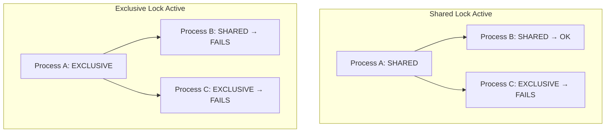

[← Home](../README.md) · [AmigaDOS](README.md)

# Locks, Examine, and Directory Scanning

## Overview

A **Lock** is AmigaDOS's equivalent of a Unix file descriptor for directory operations. It represents a reference to a filesystem object (file or directory) and is the primary mechanism for navigating the filesystem, examining metadata, and preventing concurrent modifications. Understanding lock semantics — especially the shared/exclusive model — is critical for writing robust AmigaOS applications.

---

## Lock Types

| Mode | Constant | Dec | Meaning |
|---|---|---|---|
| Shared | `SHARED_LOCK` / `ACCESS_READ` | −2 | Multiple readers allowed simultaneously |
| Exclusive | `EXCLUSIVE_LOCK` / `ACCESS_WRITE` | −1 | Only one holder; blocks all other locks |

```c
/* Obtain a shared lock: */
BPTR lock = Lock("SYS:Libs", SHARED_LOCK);

/* Obtain an exclusive lock: */
BPTR lock = Lock("RAM:temp.dat", EXCLUSIVE_LOCK);

/* Always unlock when done: */
UnLock(lock);
```

### Lock Semantics



| Scenario | Result | Error Code |
|---|---|---|
| Shared + Shared | Both succeed | — |
| Shared + Exclusive | Exclusive fails | `ERROR_OBJECT_IN_USE` (202) |
| Exclusive + Shared | Shared fails | `ERROR_OBJECT_IN_USE` (202) |
| Exclusive + Exclusive | Second fails | `ERROR_OBJECT_IN_USE` (202) |

> [!IMPORTANT]
> `Lock()` is **non-blocking** — it returns immediately with 0 and sets `IoErr()` if the lock cannot be obtained. There is no "wait for lock" mechanism in AmigaDOS. You must poll or retry.

---

## Lock Internals — struct FileLock

```c
/* dos/dosextens.h */
struct FileLock {
    BPTR            fl_Link;     /* BPTR to next lock (handler's list) */
    LONG            fl_Key;      /* block number on disk (handler-specific) */
    LONG            fl_Access;   /* SHARED_LOCK or EXCLUSIVE_LOCK */
    struct MsgPort *fl_Task;     /* handler's MsgPort — THIS IS HOW YOU
                                    FIND THE FILE HANDLER */
    BPTR            fl_Volume;   /* BPTR to DosList volume node */
};
```

### Finding a File's Handler Process

This is a common need — e.g., to send custom packets:

```c
/* Get the handler MsgPort from any lock: */
struct FileLock *fl = (struct FileLock *)BADDR(lock);
struct MsgPort *handler = fl->fl_Task;
/* Now you can PutMsg(handler, &packet) */

/* From a filename (without an existing lock): */
struct DevProc *dp = GetDeviceProc("DF0:myfile", NULL);
if (dp) {
    struct MsgPort *handler = dp->dvp_Port;
    /* ... send packets ... */
    FreeDeviceProc(dp);
}

/* From a file handle: */
struct FileHandle *fhp = (struct FileHandle *)BADDR(filehandle);
struct MsgPort *handler = fhp->fh_Type;
```

---

## Examining Files and Directories

### Examine a Single Object

```c
struct FileInfoBlock *fib = AllocDosObject(DOS_FIB, NULL);
BPTR lock = Lock("SYS:C/Dir", SHARED_LOCK);

if (lock && Examine(lock, fib))
{
    Printf("Name: %s\n", fib->fib_FileName);
    Printf("Size: %ld bytes\n", fib->fib_Size);
    Printf("Type: %s\n",
           fib->fib_DirEntryType > 0 ? "Directory" : "File");

    /* Protection bits: */
    Printf("Protect: %08lx\n", fib->fib_Protection);
    /* Bits are ACTIVE-LOW: bit set = permission DENIED */
    /* FIBF_READ=8, FIBF_WRITE=4, FIBF_EXECUTE=2, FIBF_DELETE=1 */
    /* Bits 4-7: hold/script/pure/archive (active-HIGH) */
}

UnLock(lock);
FreeDosObject(DOS_FIB, fib);
```

> [!WARNING]
> **Protection bits are inverted** for RWED: bit set means the permission is **denied**, not granted. This is opposite to Unix. `fib_Protection = 0` means "all permissions granted".

### Scan a Directory (ExNext Loop)

```c
/* Classic directory enumeration pattern: */
BPTR dirLock = Lock("SYS:Libs", SHARED_LOCK);
struct FileInfoBlock *fib = AllocDosObject(DOS_FIB, NULL);

if (dirLock && Examine(dirLock, fib))  /* examine the dir itself first */
{
    while (ExNext(dirLock, fib))
    {
        Printf("  %s  (%ld bytes)\n",
               fib->fib_FileName, fib->fib_Size);
    }
    /* ExNext returns FALSE when done — check error: */
    if (IoErr() != ERROR_NO_MORE_ENTRIES)
        PrintFault(IoErr(), "ExNext error");
}

UnLock(dirLock);
FreeDosObject(DOS_FIB, fib);
```

### ExAll — Bulk Directory Scan (OS 2.0+)

`ExAll` is significantly faster than `ExNext` for large directories — it batches results:

```c
#define BUFSIZE 4096
APTR buf = AllocVec(BUFSIZE, MEMF_ANY);
struct ExAllControl *eac = AllocDosObject(DOS_EXALLCONTROL, NULL);
eac->eac_LastKey = 0;

BPTR dirLock = Lock("SYS:Libs", SHARED_LOCK);
BOOL more;

do {
    more = ExAll(dirLock, buf, BUFSIZE, ED_SIZE, eac);

    if (!more && IoErr() != ERROR_NO_MORE_ENTRIES)
    {
        PrintFault(IoErr(), "ExAll error");
        break;
    }

    struct ExAllData *ead = (struct ExAllData *)buf;
    while (ead)
    {
        Printf("  %s  (%ld bytes)\n", ead->ed_Name, ead->ed_Size);
        ead = ead->ed_Next;
    }
} while (more);

FreeDosObject(DOS_EXALLCONTROL, eac);
FreeVec(buf);
UnLock(dirLock);
```

---

## Practical Patterns

### Safe File Replacement (Atomic Write)

```c
/* Anti-pattern: overwriting directly — corruption on crash */
/* WRONG: */
fh = Open("config.prefs", MODE_NEWFILE);  /* truncates original! */
Write(fh, data, size);  /* crash here = lost config */
Close(fh);

/* Correct: write-to-temp then rename */
fh = Open("config.prefs.tmp", MODE_NEWFILE);
Write(fh, data, size);
Close(fh);

/* Atomic swap: */
DeleteFile("config.prefs.bak");              /* remove old backup */
Rename("config.prefs", "config.prefs.bak");  /* backup current */
Rename("config.prefs.tmp", "config.prefs");  /* install new */
```

### Check If File Exists (Without Opening)

```c
/* Use Lock — lighter than Open: */
BPTR lock = Lock("SYS:Libs/68040.library", SHARED_LOCK);
if (lock) {
    UnLock(lock);
    /* file exists */
} else {
    /* file doesn't exist (or permission denied — check IoErr()) */
}
```

### Get Parent Directory

```c
BPTR fileLock = Lock("SYS:Libs/68040.library", SHARED_LOCK);
BPTR parentLock = ParentDir(fileLock);
if (parentLock) {
    /* parentLock = lock on SYS:Libs */
    NameFromLock(parentLock, buf, sizeof(buf));
    Printf("Parent: %s\n", buf);  /* "SYS:Libs" */
    UnLock(parentLock);
}
UnLock(fileLock);
```

### Resolve Full Path from Lock

```c
/* Get the full filesystem path of any lock: */
BPTR lock = Lock("PROGDIR:data", SHARED_LOCK);
char fullpath[256];
if (NameFromLock(lock, fullpath, sizeof(fullpath)))
    Printf("Full path: %s\n", fullpath);
    /* e.g. "DH0:Games/MyGame/data" */
UnLock(lock);
```

### Determine Volume / Device Name

```c
/* Find which volume a lock belongs to: */
struct InfoData *id = AllocVec(sizeof(struct InfoData), MEMF_ANY);
BPTR lock = Lock("SYS:", SHARED_LOCK);
if (Info(lock, id))
{
    struct DosList *vol = (struct DosList *)BADDR(id->id_VolumeNode);
    UBYTE *bname = (UBYTE *)BADDR(vol->dol_Name);
    Printf("Volume: %.*s\n", bname[0], &bname[1]);  /* BSTR */
    Printf("Disk type: $%08lx\n", id->id_DiskType);  /* 'DOS\1'=FFS */
    Printf("Used: %ld / %ld blocks\n",
           id->id_NumBlocksUsed, id->id_NumBlocks);
}
UnLock(lock);
FreeVec(id);
```

---

## Common Antipatterns

### ❌ Leaking Locks

```c
/* WRONG: lock is never released → filesystem handler keeps reference
   forever, preventing volume ejection */
void bad_function(void) {
    BPTR lock = Lock("DF0:file", SHARED_LOCK);
    if (!lock) return;
    /* ... forgot UnLock(lock) ... */
}

/* CORRECT: always pair Lock/UnLock */
void good_function(void) {
    BPTR lock = Lock("DF0:file", SHARED_LOCK);
    if (!lock) return;
    /* ... do work ... */
    UnLock(lock);  /* ALWAYS release */
}
```

> Leaked locks are the #1 cause of "please insert volume X" requesters that never go away. The filesystem handler keeps the volume "in use" because an outstanding lock exists.

### ❌ Holding Exclusive Lock Too Long

```c
/* WRONG: other processes blocked for entire read operation */
BPTR lock = Lock("shared_data.dat", EXCLUSIVE_LOCK);
fh = OpenFromLock(lock);   /* lock consumed by OpenFromLock */
/* ... lengthy processing ... */
Close(fh);

/* BETTER: use shared lock, only exclusive for the write phase */
BPTR lock = Lock("shared_data.dat", SHARED_LOCK);
fh = OpenFromLock(lock);
Read(fh, buf, size);       /* shared — others can read too */
Close(fh);
/* Now open exclusively just for writing: */
fh = Open("shared_data.dat", MODE_READWRITE);
Write(fh, newdata, newsize);
Close(fh);
```

### ❌ Not Checking IoErr() After Lock Failure

```c
/* WRONG: can't distinguish "file not found" from "disk error" */
BPTR lock = Lock("DF0:important", SHARED_LOCK);
if (!lock) Printf("Not found!\n");  /* might be disk error! */

/* CORRECT: */
BPTR lock = Lock("DF0:important", SHARED_LOCK);
if (!lock) {
    LONG err = IoErr();
    switch (err) {
        case ERROR_OBJECT_NOT_FOUND:  Printf("Not found\n"); break;
        case ERROR_OBJECT_IN_USE:     Printf("Locked by another process\n"); break;
        case ERROR_DISK_NOT_VALIDATED: Printf("Disk not ready\n"); break;
        default: PrintFault(err, "Lock failed"); break;
    }
}
```

### ❌ Using DupLock on Exclusive Locks

```c
/* WRONG: DupLock on an exclusive lock creates a SHARED copy.
   This breaks the exclusivity guarantee! */
BPTR excl = Lock("data.dat", EXCLUSIVE_LOCK);
BPTR dup  = DupLock(excl);    /* dup is SHARED — exclusivity lost */

/* DupLock always creates a shared lock, regardless of the source. */
```

---

## Pattern Matching (Directory Wildcards)

```c
/* Match files against AmigaDOS wildcard patterns: */
/* #? = any string (like Unix *) */
/* ? = any single char */
/* ~ = NOT */
/* | = OR */
/* ( ) = grouping */

char tokenBuf[256];
LONG tok = ParsePattern("#?.library", tokenBuf, sizeof(tokenBuf));
if (tok >= 0) {
    /* tok > 0 means pattern contains wildcards */
    /* tok = 0 means literal string (no wildcards) */

    while (ExNext(dirLock, fib)) {
        if (MatchPattern(tokenBuf, fib->fib_FileName))
            Printf("  Match: %s\n", fib->fib_FileName);
    }
}
```

| AmigaDOS Pattern | Unix Equivalent | Meaning |
|---|---|---|
| `#?` | `*` | Any string |
| `?` | `?` | Any single character |
| `#?.library` | `*.library` | All library files |
| `~(#?.info)` | (no equiv) | Everything except .info files |
| `(a|b)#?` | `{a,b}*` | Starting with a or b |

---

## References

- NDK39: `dos/dos.h`, `dos/dosextens.h`, `dos/exall.h`
- ADCD 2.1: `Lock`, `UnLock`, `Examine`, `ExNext`, `ExAll`, `NameFromLock`
- Ralph Babel: *The AmigaDOS Manual* — lock semantics chapter
- See also: [packet_system.md](packet_system.md) — how locks translate to handler packets
- See also: [file_io.md](file_io.md) — file operations using handles
