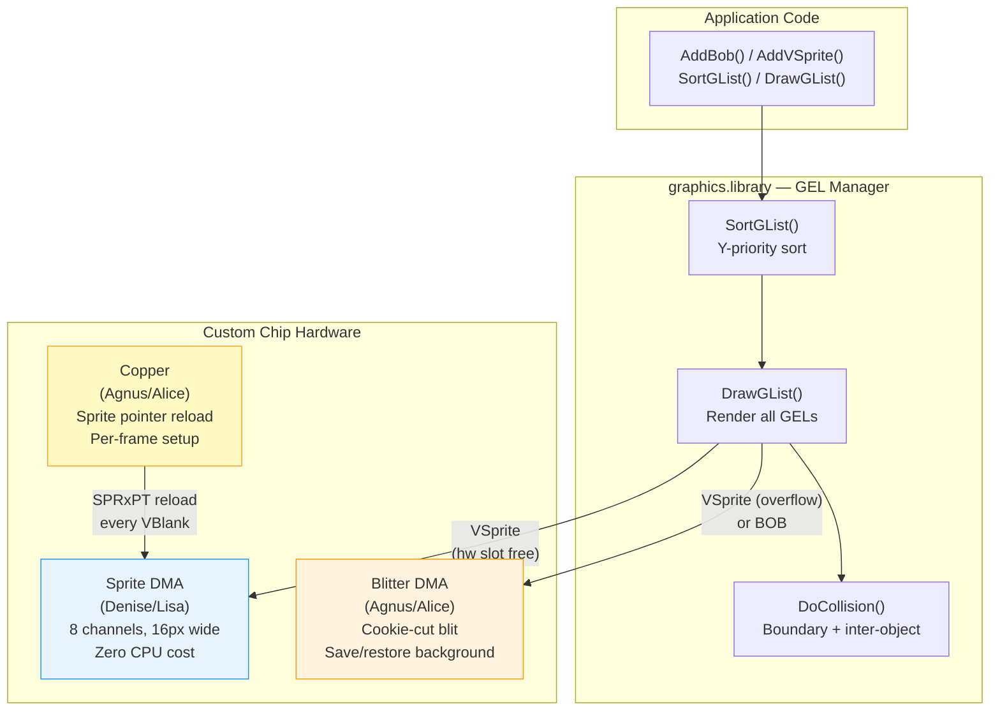
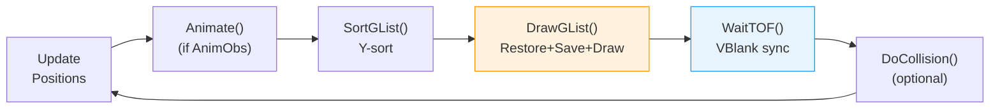

[← Home](../README.md) · [Graphics](README.md)

# Animation — GEL System: BOBs, VSprites, AnimObs

## Overview

The **GEL (Graphics ELement)** system is the Amiga's high-level animation framework, built into `graphics.library`. It provides a managed abstraction over the three animation-capable hardware subsystems — **hardware sprites**, the **Blitter**, and the **Copper** — unifying them into a single sorted, rendered, and collision-detected object list.

The GEL system manages three object types in a priority-sorted doubly-linked list:

| Object | Full Name | Backing Hardware | Size Limit | Color Limit | CPU Cost | Typical Use |
|---|---|---|---|---|---|---|
| **VSprite** | Virtual Sprite | Hardware sprite DMA (Denise/Lisa) | 16px wide × any height | 3 colors + transparent (15 attached) | Near zero | Mouse pointers, crosshairs, score digits |
| **BOB** | Blitter Object | Blitter DMA (Agnus/Alice) | Arbitrary | Full playfield palette | Moderate (blitter time) | Player characters, enemies, projectiles |
| **AnimOb** | Animation Object | BOBs + sequencing engine | Arbitrary | Full playfield palette | Moderate + frame logic | Walk cycles, explosions, multi-part characters |

The key insight is that the GEL system **does not bypass the OS** — it uses `graphics.library` internally and cooperates with Intuition. This makes it the correct choice for system-friendly applications. Games that take over the hardware typically implement their own blitter-based object systems instead.

### Why a Unified System?

On most platforms of the era, sprites and software-drawn objects were entirely separate subsystems. The Amiga's GEL system merges them:

- **VSprites** can transparently **fall back to BOB rendering** when all 8 hardware sprite channels are exhausted — the application code doesn't change
- All GEL objects share a **single Y-sorted render list**, so draw order is automatic
- **Collision detection** works uniformly across VSprites and BOBs
- The `SortGList()` → `DrawGList()` → `WaitTOF()` loop handles everything in one pass

### Historical Context — The 1985 Competitive Landscape

The GEL system was architecturally unprecedented. No competing platform of the era offered anything resembling a unified, hardware-abstracted animation compositor:

| Platform (1985) | Sprite Hardware | Software Objects | Unified System? |
|---|---|---|---|
| **Amiga (OCS)** | 8 DMA sprites, 16px wide, Copper-multiplexed | Blitter-composited BOBs, arbitrary size | **Yes** — GEL system merges both into one sorted, collision-detected render list |
| **Atari ST** | None — no hardware sprites at all | CPU-driven block copies (no blitter until STE in 1989) | No — everything is manual software rendering |
| **Commodore 64** | 8 hardware sprites (VIC-II), 24px wide | Character-based; no blitter | No — sprites and character graphics are completely separate; collision is hw-only |
| **NES (Famicom)** | 64 OAM sprites, 8px wide, 8 per scanline | Tile-based background via PPU | No — OAM and background are independent subsystems with no unified API |
| **Apple Macintosh** | None | QuickDraw (CPU-only, 1-bit) | No — no sprites, no DMA, no animation framework whatsoever |
| **IBM PC (CGA/EGA)** | None | CPU block copies to video RAM | No — no hardware assistance; animation is entirely application responsibility |
| **Atari 7800** | Up to 100 sprites via display list | Background tiles | Partially — display list is a flat sorted structure, but no OS API or collision framework |

The Amiga was the only home computer where the OS itself provided:
- **Automatic hardware resource arbitration** (sprite channel assignment)
- **Transparent fallback** between rendering backends (sprite DMA → blitter)
- **Integrated collision detection** across all object types
- **A physics-aware animation sequencer** (AnimOb with velocity and acceleration)

This was essentially a **scene graph with a composer** — a concept that wouldn't become mainstream until GPU-accelerated window managers appeared 20 years later ([Quartz Composer](https://developer.apple.com/documentation/quartz/quartz-composer), Aero 2006).

> [!NOTE]
> The arcade world had more sophisticated sprite hardware (Namco System 16, Sega System 16 — 128+ sprites with scaling and rotation), but these were fixed-function ASICs with no OS, no API, and no concept of resource sharing between applications. The Amiga's innovation was the **software architecture** layered on top of capable-but-limited hardware.

### Modern Analogies

The GEL system's design foreshadows patterns that became standard decades later:

| GEL System (1985) | Modern Equivalent | Shared Concept |
|---|---|---|
| Unified VSprite + BOB render list | **macOS WindowServer / Core Animation** | A compositor merges GPU-accelerated layers (≈ VSprites) and software-rendered surfaces (≈ BOBs) into a single display pass — apps don't choose the backend |
| `SortGList()` → `DrawGList()` | **Vulkan/Metal render graph** | A sorted submission pipeline where the framework decides resource scheduling and draw order |
| VSprite hw→sw fallback | **GPU tile-based deferred rendering** | When fast-path resources (tile memory, shader units) are exhausted, the driver transparently falls back to a slower path |
| `DoCollision()` with MeMask/HitMask | **Unity/Unreal collision layers** | Bitmask-based collision filtering — each object declares what it is and what it can hit |
| AnimOb velocity + acceleration | **Core Animation implicit animations** | The framework applies physics (timing curves, momentum) so the app just sets target values |
| Copper-driven sprite pointer reload | **Display controller scanout** | A DMA engine composites layers in sync with the display refresh — no CPU in the hot path |

### Pros and Cons (in 1985 Context)

| | Pro | Con |
|---|---|---|
| **Abstraction** | Write once — system picks hw sprites or blitter automatically | Abstraction layer costs CPU cycles on a 7.09 MHz 68000 |
| **Unified collision** | One API for all object types; no manual overlap checks | O(n²) scaling is brutal with >30 objects and no spatial index |
| **Auto sort/draw** | Correct painter's-order for free | Y-only sort — no X or Z priority control without workarounds |
| **OS integration** | Cooperates with Intuition; no system takeover required | Competing with Workbench for blitter time and DMA slots |
| **Animation engine** | Built-in velocity, acceleration, frame sequencing | Rigid fixed-point math; no easing curves, no interpolation |
| **Save/restore cycle** | Clean non-destructive compositing | 3 blitter ops per BOB per frame — expensive at scale |


---

## Hardware Foundation — Blitter, Copper, and Sprites

The GEL system is an API layer over three independent DMA engines. Understanding which hardware backs each operation is essential for performance tuning.



### How Each Hardware Unit Contributes

**Blitter (BOB rendering)**
- Performs the **cookie-cut blit** (minterm `$CA`) to composite BOB imagery onto the playfield: `A`=mask, `B`=source image, `C`=background read-back, `D`=output
- **Saves and restores background** under each BOB via the `SaveBuffer` — this is what makes BOBs non-destructive
- Handles arbitrary sizes (not limited to 16px width like hardware sprites)
- See [blitter_programming.md](blitter_programming.md) for minterm details

**Copper (VSprite pointer management)**
- Reloads `SPRxPTH`/`SPRxPTL` registers every frame during vertical blank
- The GEL system's `DrawGList()` builds Copper instructions that point each hardware sprite channel to the correct VSprite data
- Enables **sprite multiplexing** — reusing the same hardware channel for multiple VSprites at different Y positions
- See [copper_programming.md](copper_programming.md) for Copper list construction

**Hardware Sprites (VSprite rendering)**
- 8 DMA channels in Denise/Lisa fetch sprite data from Chip RAM with **zero CPU overhead**
- Each channel: 16 pixels wide, 3 colors + transparent (or 15 colors when attached in pairs)
- The GEL system assigns VSprites to available hardware channels automatically; overflow VSprites are rendered as BOBs via the Blitter

### DMA Budget Impact

All three engines share the Chip RAM bus. During a typical animation frame:

| Phase | DMA Consumer | Approx. Cycles | Notes |
|---|---|---|---|
| VBlank | Copper reloads sprite pointers | 16–32 cycles | 2 MOVEs × 8 sprites |
| Active display | Sprite DMA fetches | 2 words/line/sprite | Continuous, interleaved with bitplane DMA |
| Between frames | Blitter save/restore + draw | Varies with BOB count | Competes with CPU for bus |
| Between frames | Blitter collision masks | Varies | Only if `DoCollision()` is called |

> [!WARNING]
> **BOBs are expensive.** Each BOB requires three blitter operations per frame: (1) restore previous background, (2) save new background, (3) cookie-cut blit. With 20 BOBs at 32×32 pixels across 4 bitplanes, the blitter is busy for a significant fraction of the frame time. Profile early.

---

## VSprite — Virtual Sprite

A **VSprite** is the fundamental GEL object. It represents a small, moveable graphic element that the system will render using **hardware sprite DMA** if a channel is available, or **fall back to blitter-based BOB rendering** if all 8 hardware channels are occupied.

This dual-path rendering is the key architectural feature: the application creates VSprites without specifying how they will be rendered. The GEL manager decides at `DrawGList()` time based on availability.

### Hardware vs. Software Path

```
VSprite created with VSPRITE flag set
         │
    DrawGList() called
         │
    ┌────▼────────────────────┐
    │ Hardware sprite channel │──→ Yes ──→ Render via sprite DMA
    │ available?              │            (zero CPU cost)
    └────┬────────────────────┘
         │ No
         ▼
    Render as BOB via Blitter
    (cookie-cut blit, save/restore background)
```

### VSprite Flags

| Flag | Value | Meaning |
|---|---|---|
| `VSPRITE` | `$0001` | This is a true VSprite (not a BOB's backing VSprite) |
| `SAVEBACK` | `$0002` | Save background before drawing (for BOB fallback) |
| `OVERLAY` | `$0004` | Use cookie-cut (masked) rendering |
| `MUSTDRAW` | `$0008` | Always draw, even if off-screen |
| `BACKSAVED` | `$0100` | (Internal) Background has been saved |
| `BOBUPDATE` | `$0200` | (Internal) BOB image has changed |
| `GELGONE` | `$0400` | (Internal) GEL has been removed |
| `VSOVERFLOW` | `$0800` | (Internal) No hardware sprite slot — using BOB fallback |

### Structure

```c
/* graphics/gels.h — NDK39 */
struct VSprite {
    struct VSprite *NextVSprite;  /* GEL list links (managed by system) */
    struct VSprite *PrevVSprite;
    struct VSprite *DrawPath;    /* draw-order traversal (set by SortGList) */
    struct VSprite *ClearPath;   /* clear-order traversal (reverse of draw) */
    WORD   OldY, OldX;          /* previous position (for background restore) */
    WORD   Flags;                /* VSPRITE, SAVEBACK, OVERLAY, MUSTDRAW */
    WORD   Y, X;                 /* current screen position */
    WORD   Height;               /* height in lines */
    WORD   Width;                /* width in WORDS (not pixels!) */
    WORD   Depth;                /* number of bitplanes */
    WORD   MeMask;               /* "I am this type" — collision identity */
    WORD   HitMask;              /* "I collide with these types" */
    WORD   *ImageData;           /* interleaved sprite image (Chip RAM!) */
    WORD   *BorderLine;          /* 1-line collision boundary */
    WORD   *CollMask;            /* full collision mask bitmap */
    WORD   *SprColors;           /* color table (3 entries for hw sprites) */
    struct Bob *VSBob;           /* non-NULL if this VSprite backs a BOB */
    BYTE   PlanePick;            /* which bitplanes to render into */
    BYTE   PlaneOnOff;           /* default state for non-picked planes */
    /* ... */
};
```

> [!IMPORTANT]
> `ImageData`, `BorderLine`, `CollMask`, and `SprColors` **must reside in Chip RAM** (`AllocMem(size, MEMF_CHIP|MEMF_CLEAR)`). The Blitter and sprite DMA cannot access Fast RAM.

---

## BOB — Blitter Object

A **BOB** is an arbitrary-sized bitmap overlay composited onto the playfield using the Blitter. Unlike VSprites (which are limited to 16 pixels wide and 3 colors), BOBs can be **any size** and use the **full playfield palette**.

Every BOB has a paired **VSprite** that provides its position, collision data, and list linkage. The BOB struct adds blitter-specific fields: the save buffer, the shadow mask, and optional double-buffering and animation component links.

### The BOB Rendering Cycle

Each frame, `DrawGList()` performs three blitter operations per BOB:

```
Frame N:
  1. RESTORE  — Blit SaveBuffer back to screen at OldX,OldY
                (erase previous frame's image)
  2. SAVE     — Copy screen rectangle at new X,Y into SaveBuffer
                (preserve background before drawing)
  3. DRAW     — Cookie-cut blit: ImageData through ImageShadow
                onto screen at X,Y (composite the BOB)
```

This is why `SaveBuffer` must be allocated large enough to hold the BOB's footprint plus alignment padding. The `ImageShadow` is a 1-bitplane mask — 1 where the BOB is opaque, 0 where transparent.

### BOB vs. VSprite Decision Matrix

| Criterion | Use VSprite | Use BOB |
|---|---|---|
| Size ≤ 16px wide, ≤ 3 colors | ✓ Ideal | Overkill |
| Size > 16px wide | Cannot | ✓ Required |
| Need full palette | Cannot (3 colors) | ✓ Yes |
| Many objects (> 8) | Overflow → BOB fallback | ✓ Direct |
| CPU budget is tight | ✓ Zero cost if hw slot | Higher cost |
| Need per-pixel collision | Limited (boundary only) | ✓ Full mask |

### Structure

```c
struct Bob {
    WORD   Flags;               /* SAVEBOB, BOBISCOMP (internal) */
    WORD   *SaveBuffer;         /* background save area (Chip RAM!) */
    WORD   *ImageShadow;        /* 1-bitplane cookie mask (Chip RAM!) */
    struct Bob *Before;         /* draw-order links (set by SortGList) */
    struct Bob *After;
    struct VSprite *BobVSprite; /* REQUIRED — provides position & collision */
    struct AnimComp *BobComp;   /* non-NULL if part of an AnimOb */
    struct DBufPacket *DBuffer; /* double-buffer packet (or NULL) */
};
```

### Object Relationships

```
AnimOb (optional — animation sequence controller)
  │
  └─→ AnimComp (animation component — one "part" of the object)
        │
        ├─→ Bob (blitter rendering data)
        │     │
        │     └─→ VSprite (position, image, collision)
        │
        └─→ AnimComp→NextSeq (next frame in sequence)
              │
              └─→ Bob → VSprite ...
```

### SaveBuffer Size Calculation

```c
/* SaveBuffer must accommodate worst-case word alignment */
LONG saveSize = (LONG)sizeof(WORD) * bob->BobVSprite->Width
              * bob->BobVSprite->Height
              * bob->BobVSprite->Depth;
/* Add 2 extra words for word-boundary overflow: */
saveSize += sizeof(WORD) * bob->BobVSprite->Height * bob->BobVSprite->Depth;

bob->SaveBuffer = AllocMem(saveSize, MEMF_CHIP | MEMF_CLEAR);
```

## GEL System Initialisation and Render Loop

The GEL system requires explicit initialisation before use. The core lifecycle is: **init → add objects → sort → draw → sync → repeat → cleanup**.

### Initialisation

```c
#include <graphics/gels.h>
#include <graphics/gfxmacros.h>

struct GelsInfo    gelsInfo;
struct VSprite     headVS, tailVS;        /* sentinel nodes (never rendered) */
struct collTable   collisionTable;        /* 16 collision handler slots */

/* Clear all structures: */
memset(&gelsInfo, 0, sizeof(gelsInfo));
memset(&headVS, 0, sizeof(headVS));
memset(&tailVS, 0, sizeof(tailVS));

/* Set up the GEL list with head/tail sentinels: */
InitGels(&headVS, &tailVS, &gelsInfo);

/* Optional: install collision handler table: */
gelsInfo.collHandler = &collisionTable;

/* Attach to RastPort: */
myRastPort->GelsInfo = &gelsInfo;
```

### The Render Loop

```c
/* Main animation loop — runs once per frame: */
while (!done)
{
    /* 1. Update positions: */
    for (each object) {
        myBob->BobVSprite->X += velocityX;
        myBob->BobVSprite->Y += velocityY;
    }

    /* 2. If using AnimObs, advance animation clock: */
    Animate(&gelsInfo.gelHead, myRastPort);

    /* 3. Sort all GELs by Y position (draw order): */
    SortGList(myRastPort);

    /* 4. Render: restore backgrounds, save new backgrounds, draw: */
    DrawGList(myRastPort, &myViewPort);

    /* 5. Sync to vertical blank (avoid tearing): */
    WaitTOF();

    /* 6. Optional: detect collisions this frame: */
    DoCollision(myRastPort);
}
```



### Adding and Removing Objects

```c
/* Add a VSprite to the GEL list: */
AddVSprite(&myVSprite, myRastPort);

/* Add a BOB (internally adds its backing VSprite too): */
AddBob(&myBob, myRastPort);

/* Add an AnimOb (adds all its component BOBs): */
AddAnimOb(&myAnimOb, &gelsInfo.gelHead, myRastPort);

/* Remove — sets GELGONE flag; actual removal happens at next DrawGList: */
RemVSprite(&myVSprite);
RemBob(&myBob);             /* deferred — call DrawGList to finish */
RemIBob(&myBob, myRastPort, &myViewPort);  /* immediate removal */
```

### Cleanup

```c
/* Remove all objects first, then: */
myRastPort->GelsInfo = NULL;
/* Free all allocated SaveBuffers, ImageData, CollMasks, etc. */
```

---

## AnimOb — Animation Sequences

An **AnimOb** (Animation Object) adds automatic **frame sequencing**, **velocity**, and **acceleration** on top of the BOB system. It models a complete animated entity — a walking character, an explosion, a rotating power-up — as a tree of **AnimComps** (animation components), each being a sequence of animation frames.

### Concepts

| Term | Meaning |
|---|---|
| **AnimOb** | The top-level animation object with position, velocity, acceleration |
| **AnimComp** | One "part" of the object (e.g., a character's body, or its sword) |
| **Sequence** | A ring of AnimComps linked via `NextSeq`/`PrevSeq` — the animation frames |
| **Clock/Timer** | Per-component frame counter; when it hits `TimeSet`, advances to next frame |
| **RingXTrans/RingYTrans** | Position offset applied when the sequence wraps (for walk cycles) |
| **YVel/XVel** | Per-frame velocity (added to position each `Animate()` call) |
| **YAccel/XAccel** | Per-frame acceleration (added to velocity each `Animate()` call) |

### How Animate() Works

Each call to `Animate()`:

1. For every AnimOb in the list:
   - Add `XAccel` to `XVel`, `YAccel` to `YVel`
   - Add `XVel` to `AnX`, `YVel` to `AnY`
2. For every AnimComp in the AnimOb:
   - Decrement `Timer`
   - If `Timer` reaches 0:
     - Advance to `NextSeq` (next frame in the ring)
     - Reset `Timer` to `TimeSet`
     - Update the BOB's `ImageData` and `ImageShadow`
   - Apply component's relative offset to AnimOb position

### AnimOb Structure

```c
struct AnimOb {
    struct AnimOb *NextOb;       /* linked list of AnimObs */
    struct AnimOb *PrevOb;
    LONG   Clock;                /* master clock (incremented each Animate) */
    WORD   AnOldY, AnOldX;       /* previous position */
    WORD   AnY, AnX;             /* current position (16.0 fixed) */
    WORD   YVel, XVel;           /* velocity (added to position each frame) */
    WORD   YAccel, XAccel;       /* acceleration (added to velocity) */
    WORD   RingYTrans;           /* Y offset applied on sequence wrap */
    WORD   RingXTrans;           /* X offset applied on sequence wrap */
    struct AnimComp *HeadComp;   /* first component in this AnimOb */
    /* ... */
};
```

### AnimComp Structure

```c
struct AnimComp {
    WORD   Flags;                /* RINGTRIGGER, ANIMHALF */
    WORD   Timer;                /* counts down to 0, then advance frame */
    WORD   TimeSet;              /* reset value for Timer */
    struct AnimComp *NextComp;   /* next component (parallel part) */
    struct AnimComp *PrevComp;
    struct AnimComp *NextSeq;    /* next frame in sequence (ring) */
    struct AnimComp *PrevSeq;    /* previous frame in sequence */
    /* ... */
    WORD   XTrans, YTrans;       /* offset relative to AnimOb position */
    struct Bob *AnimBob;         /* the BOB for this frame */
    /* ... */
};
```

### Example: 4-Frame Walk Cycle

```
AnimOb (XVel = 2, YVel = 0)
  │
  └─→ HeadComp: AnimComp ring of 4 frames
        ┌─→ Frame 0 (stand)  ─→ Frame 1 (step-L)
        │                              │
        └── Frame 3 (step-R) ←─ Frame 2 (stride)
        
        TimeSet = 6 → each frame shows for 6 Animate() calls
        RingXTrans = 0 (no jump on wrap — smooth loop)
```

```c
/* Building a 4-frame AnimOb: */
struct AnimOb   walkOb;
struct AnimComp frames[4];
struct Bob      bobs[4];
struct VSprite  vsprites[4];

/* Set up each frame's VSprite with different ImageData: */
for (int i = 0; i < 4; i++) {
    vsprites[i].ImageData = walkFrameImages[i];  /* Chip RAM! */
    vsprites[i].Height = 32;
    vsprites[i].Width  = 2;   /* 32px = 2 words */
    vsprites[i].Depth  = 4;
    /* ... set collision masks, etc. ... */
    
    bobs[i].BobVSprite = &vsprites[i];
    bobs[i].ImageShadow = walkFrameMasks[i];
    bobs[i].SaveBuffer = AllocMem(saveSize, MEMF_CHIP | MEMF_CLEAR);
    
    frames[i].AnimBob = &bobs[i];
    frames[i].TimeSet = 6;    /* 6 frames per animation cel */
    frames[i].Timer   = 6;
    frames[i].YTrans  = 0;
    frames[i].XTrans  = 0;
}

/* Link frames into a ring: */
frames[0].NextSeq = &frames[1];  frames[1].PrevSeq = &frames[0];
frames[1].NextSeq = &frames[2];  frames[2].PrevSeq = &frames[1];
frames[2].NextSeq = &frames[3];  frames[3].PrevSeq = &frames[2];
frames[3].NextSeq = &frames[0];  frames[0].PrevSeq = &frames[3];

/* AnimOb: */
walkOb.HeadComp = &frames[0];
walkOb.AnX  = 50;  walkOb.AnY  = 100;
walkOb.XVel = 2;   walkOb.YVel = 0;
walkOb.XAccel = 0; walkOb.YAccel = 0;

AddAnimOb(&walkOb, &gelsInfo.gelHead, myRastPort);
```

---

## Collision Detection

The GEL system provides **two levels** of collision detection, both managed through bitmask matching:

### Collision Masks

Each VSprite has two 16-bit masks:

- **`MeMask`** — "I am this type" (identity)
- **`HitMask`** — "I care about hitting these types" (filter)

A collision between objects A and B is reported when: `(A.HitMask & B.MeMask) != 0`

```c
/* Example: define object types via bit positions */
#define TYPE_PLAYER    (1 << 0)    /* bit 0 */
#define TYPE_ENEMY     (1 << 1)    /* bit 1 */
#define TYPE_BULLET    (1 << 2)    /* bit 2 */
#define TYPE_POWERUP   (1 << 3)    /* bit 3 */
#define TYPE_BORDER    (1 << 15)   /* bit 15 = border collision */

/* Player collides with enemies, powerups, and borders: */
playerVS.MeMask  = TYPE_PLAYER;
playerVS.HitMask = TYPE_ENEMY | TYPE_POWERUP | TYPE_BORDER;

/* Enemy collides with player and bullets: */
enemyVS.MeMask  = TYPE_ENEMY;
enemyVS.HitMask = TYPE_PLAYER | TYPE_BULLET;

/* Bullet collides with enemies only: */
bulletVS.MeMask  = TYPE_BULLET;
bulletVS.HitMask = TYPE_ENEMY;
```

### Collision Handlers

```c
/* Install collision callback for each type bit: */
struct collTable ct;
memset(&ct, 0, sizeof(ct));

/* When any object with MeMask bit 1 (ENEMY) is hit: */
ct.collPtrs[1] = (APTR)EnemyHitHandler;

/* When border collision occurs (bit 15): */
ct.collPtrs[15] = (APTR)BorderHitHandler;

gelsInfo.collHandler = &ct;

/* Collision handler prototype: */
void __asm EnemyHitHandler(register __a0 struct VSprite *vs1,
                           register __a1 struct VSprite *vs2)
{
    /* vs1 and vs2 collided */
    struct Bob *hitBob = vs2->VSBob;
    if (hitBob) {
        /* Mark enemy for removal, spawn explosion, etc. */
    }
}
```

> [!NOTE]
> `DoCollision()` performs **O(n²)** pairwise checks. For large object counts (50+), this becomes a significant per-frame cost. Consider spatial partitioning or manual collision checks for performance-critical games.

---

## Double Buffering with BOBs

To eliminate flicker, BOBs can be double-buffered using `DBufPacket`:

```c
struct DBufPacket dbuf;
WORD *buf1, *buf2;

/* Allocate two buffers: */
LONG bufSize = /* same as SaveBuffer calculation */;
buf1 = AllocMem(bufSize, MEMF_CHIP | MEMF_CLEAR);
buf2 = AllocMem(bufSize, MEMF_CHIP | MEMF_CLEAR);

dbuf.BufY = dbuf.BufX = 0;
dbuf.BufPath = NULL;     /* set by system */

myBob.DBuffer = &dbuf;

/* The system alternates between buf1 and buf2 each frame,
   so the restore operation never tears the current frame's display. */
```

For full-screen double buffering (swapping entire bitplane pointers), use `ChangeVPBitMap()` instead — that's a ViewPort-level mechanism independent of the GEL system.

---

## When to Use the GEL System

### Good Use Cases

| Scenario | Why GELs Work Well |
|---|---|
| **System-friendly applications** | GELs cooperate with Intuition and the OS display system |
| **Moderate object counts** (< 20 BOBs) | Manageable blitter load, sorted rendering is convenient |
| **Prototyping and tools** | Quick to set up; collision detection included |
| **Mixed hw-sprite + BOB scenes** | VSprite overflow handling is automatic |
| **Educational / demo programs** | Clean API, well-documented in RKMs |

### When NOT to Use GELs

| Scenario | Why | Alternative |
|---|---|---|
| **High-performance games** (20+ objects) | GEL overhead: sorting, collision, save/restore per BOB | Custom blitter object manager with dirty-rectangle lists |
| **System-takeover games** | GELs assume OS is running; adds overhead | Direct blitter/sprite register programming |
| **Large scrolling playfields** | GELs don't manage scrolling; BOB restore interacts poorly with scroll | Copper-driven scroll with manual blitter objects |
| **Complex z-ordering** | GELs sort by Y only; no arbitrary Z | Custom draw-order lists |
| **Tile-based rendering** | GELs aren't designed for tile maps | Blitter tile-copy routines |

> [!TIP]
> Most **commercial Amiga games** (Turrican, Shadow of the Beast, Speedball 2) did **not** use the GEL system. They implemented custom blitter object engines for maximum control over DMA scheduling, draw order, and memory layout. The GEL system is best understood as a convenience layer for **system-friendly software** and as a **reference implementation** of the patterns that custom engines replicate.

---

## Complete Example — Animated BOB

```c
#include <exec/types.h>
#include <graphics/gels.h>
#include <graphics/gfxmacros.h>
#include <proto/graphics.h>
#include <proto/exec.h>

#define BOB_WIDTH_WORDS  2    /* 32 pixels */
#define BOB_HEIGHT       24
#define BOB_DEPTH        4    /* 16 colors */

/* Pre-computed image data (must be in Chip RAM): */
extern WORD shipImage[];     /* BOB_WIDTH_WORDS * BOB_HEIGHT * BOB_DEPTH words */
extern WORD shipMask[];      /* BOB_WIDTH_WORDS * BOB_HEIGHT words (1 plane) */

struct GelsInfo    gi;
struct VSprite     headVS, tailVS;
struct VSprite     shipVS;
struct Bob         shipBob;

void SetupGELSystem(struct RastPort *rp)
{
    memset(&gi, 0, sizeof(gi));
    InitGels(&headVS, &tailVS, &gi);
    rp->GelsInfo = &gi;
}

void CreateShipBob(void)
{
    /* VSprite (provides position and collision): */
    memset(&shipVS, 0, sizeof(shipVS));
    shipVS.X       = 100;
    shipVS.Y       = 80;
    shipVS.Height  = BOB_HEIGHT;
    shipVS.Width   = BOB_WIDTH_WORDS;
    shipVS.Depth   = BOB_DEPTH;
    shipVS.Flags   = SAVEBACK | OVERLAY;
    shipVS.MeMask  = 1;     /* I am type 1 */
    shipVS.HitMask = 2;     /* I collide with type 2 */
    shipVS.PlanePick  = 0x0F;  /* draw into planes 0-3 */
    shipVS.PlaneOnOff = 0x00;
    shipVS.ImageData  = shipImage;   /* Chip RAM */

    /* Collision mask: */
    shipVS.CollMask = AllocMem(
        BOB_WIDTH_WORDS * BOB_HEIGHT * sizeof(WORD),
        MEMF_CHIP | MEMF_CLEAR);
    shipVS.BorderLine = AllocMem(
        BOB_WIDTH_WORDS * sizeof(WORD),
        MEMF_CHIP | MEMF_CLEAR);
    InitMasks(&shipVS);     /* auto-generate collision mask from image */

    /* BOB: */
    memset(&shipBob, 0, sizeof(shipBob));
    shipBob.BobVSprite  = &shipVS;
    shipBob.ImageShadow = shipMask;
    shipBob.SaveBuffer  = AllocMem(
        (BOB_WIDTH_WORDS + 1) * BOB_HEIGHT * BOB_DEPTH * sizeof(WORD),
        MEMF_CHIP | MEMF_CLEAR);
    shipBob.DBuffer     = NULL;

    shipVS.VSBob = &shipBob;
}

void AnimationLoop(struct RastPort *rp, struct ViewPort *vp)
{
    WORD dx = 2, dy = 1;

    AddBob(&shipBob, rp);

    while (!(ReadJoyPort(1) & JPF_BTN1))  /* until fire pressed */
    {
        /* Move: */
        shipVS.X += dx;
        shipVS.Y += dy;

        /* Bounce off edges: */
        if (shipVS.X < 0 || shipVS.X > 288) dx = -dx;
        if (shipVS.Y < 0 || shipVS.Y > 232) dy = -dy;

        SortGList(rp);
        DrawGList(rp, vp);
        WaitTOF();
    }

    RemIBob(&shipBob, rp, vp);
}
```

---

## Performance Guidelines

| Factor | Impact | Mitigation |
|---|---|---|
| **BOB count** | 3 blitter ops per BOB per frame | Keep under 15–20 for 50 fps |
| **BOB size** | Blitter time ∝ width × height × depth | Use smallest bounding box possible |
| **Collision detection** | O(n²) mask comparisons | Reduce `HitMask` to skip irrelevant pairs |
| **SortGList** | O(n log n) sort | Fast for < 50 objects |
| **Deep bitplanes** | Each additional plane = +1 blit per operation | 2-plane BOBs on 4-plane playfield via `PlanePick` |
| **Word alignment** | Non-word-aligned X positions require shifting | Costs extra DMA cycle per shifted blit |
| **Chip RAM bandwidth** | Bitplane DMA + sprite DMA + blitter compete | Profile with DMA timeline; consider nasty mode |

### Reducing BOB Cost with PlanePick

```c
/* Draw a 2-color BOB on a 4-bitplane display: */
myVS.Depth     = 1;          /* BOB image is only 1 plane */
myVS.PlanePick = 0x01;       /* render into plane 0 only */
myVS.PlaneOnOff = 0x00;      /* planes 1-3 get 0 (transparent) */

/* This reduces blitter work by 4× compared to a full 4-plane BOB! */
```

---

## Common Pitfalls

| Pitfall | Symptom | Fix |
|---|---|---|
| Data not in Chip RAM | BOB invisible or garbage pixels | `AllocMem(size, MEMF_CHIP)` for all image/mask/save buffers |
| SaveBuffer too small | Memory corruption, random crashes | Include +1 word width for alignment overflow |
| Missing `WaitTOF()` | Tearing — half old frame, half new | Always sync to VBlank after `DrawGList()` |
| Forgetting `InitMasks()` | No collision detection works | Call `InitMasks()` after setting up `ImageData` |
| `RemBob` without `DrawGList` | BOB ghost remains on screen | Use `RemIBob()` for immediate removal, or call `DrawGList()` after `RemBob()` |
| Not clearing `GelsInfo` | Stale pointers → crash | `memset` all GEL structures before `InitGels()` |
| AnimComp ring not closed | `Animate()` follows NULL pointer → crash | Ensure `NextSeq`/`PrevSeq` form a complete ring |
| Modifying BOB image without `InitMasks` | Collision mask doesn't match new image | Re-call `InitMasks()` when changing `ImageData` |

---

## API Quick Reference

| Function | Description |
|---|---|
| `InitGels(head, tail, gi)` | Initialise GEL list with sentinel VSprites |
| `AddVSprite(vs, rp)` | Add a VSprite to the GEL list |
| `AddBob(bob, rp)` | Add a BOB (and its backing VSprite) |
| `AddAnimOb(ao, head, rp)` | Add an AnimOb and all its components |
| `SortGList(rp)` | Sort GEL list by Y position |
| `DrawGList(rp, vp)` | Render all GELs (restore → save → draw) |
| `DoCollision(rp)` | Run collision detection on all GELs |
| `Animate(headPtr, rp)` | Advance AnimOb clocks, sequence frames |
| `RemVSprite(vs)` | Remove a VSprite from the list |
| `RemBob(bob)` | Mark BOB for deferred removal |
| `RemIBob(bob, rp, vp)` | Immediately remove BOB and restore background |
| `InitMasks(vs)` | Generate collision mask from `ImageData` |
| `SetCollision(type, fn, gi)` | Install collision handler for a mask bit |
| `GetGBuffers(ac, rp, db)` | Allocate all buffers for an AnimComp |
| `FreeGBuffers(ac, rp, db)` | Free buffers allocated by `GetGBuffers()` |
| `WaitTOF()` | Wait for next vertical blank (frame sync) |

---

## References

- NDK39: `graphics/gels.h`, `graphics/gelsinternal.h`, `graphics/collide.h`
- ADCD 2.1: `InitGels`, `AddVSprite`, `AddBob`, `AddAnimOb`, `SortGList`, `DrawGList`, `DoCollision`, `Animate`
- *Amiga ROM Kernel Reference Manual: Libraries* — Chapter 28: GELs (BOBs, VSprites, AnimObs)
- *Amiga ROM Kernel Reference Manual: Libraries* — Chapter 29: Animation (AnimOb/AnimComp sequencing)
- See also: [blitter_programming.md](blitter_programming.md) — Blitter minterm and cookie-cut details
- See also: [sprites.md](sprites.md) — Hardware sprite DMA, multiplexing, and priority
- See also: [copper_programming.md](copper_programming.md) — Copper-driven sprite pointer management
- See also: [rastport.md](rastport.md) — RastPort drawing context used by GELs
- See also: [memory_types.md](../01_hardware/common/memory_types.md) — BOB/VSprite data must reside in Chip RAM

