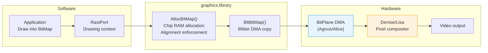
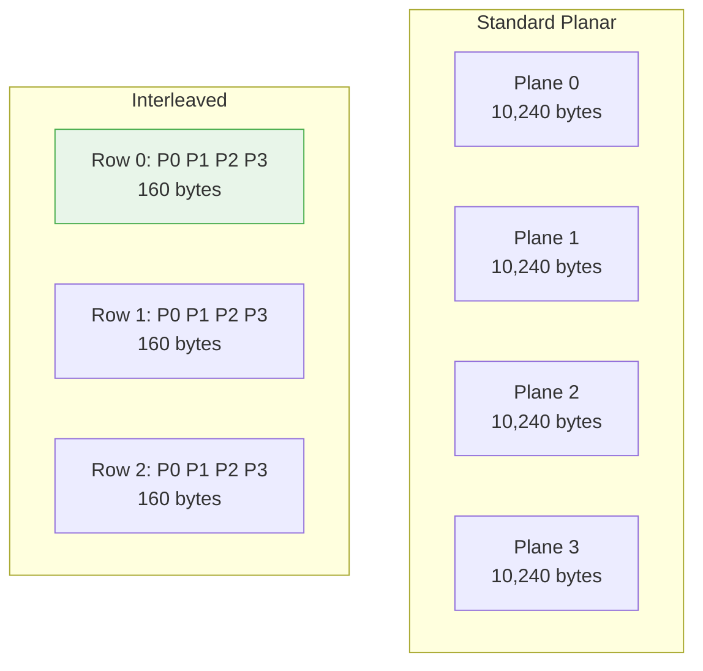

[← Home](../README.md) · [Graphics](README.md)

# BitMap — Planar Layout, AllocBitMap, Interleaving, and the RastPort Relationship

## Overview

The Amiga's display system is built on **planar bitmaps**: rather than storing each pixel's color in a contiguous byte or word (chunky), the display hardware reads one bit from each of several independent memory regions called **bitplanes**. A pixel's color index is the concatenation of bits at the same (x, y) coordinate across all planes. This design was chosen in 1985 because it minimizes DMA bandwidth: a 16-color screen needs only 4 bits per pixel across the bus, and the Copper can manipulate individual bitplanes with simple pointer changes. The trade-off is software complexity — drawing a single pixel requires read-modify-write across multiple planes, and modern developers accustomed to RGB framebuffers must rethink their mental model. The `struct BitMap` is the central data structure that describes this layout, and `graphics.library` provides `AllocBitMap()` (OS 3.0+) to manage its allocation, alignment, and Chip RAM requirements automatically.

---

## Architecture

### BitMap in the Display Pipeline



### Standard vs Interleaved Layout



In **standard planar**, each plane is a contiguous block. In **interleaved**, planes are striped row-by-row within a single allocation. Interleaving improves cache locality and allows the Blitter to fetch all planes for a given row in one pass.

---

## Data Structures

### struct BitMap

```c
/* graphics/gfx.h — NDK 3.9 */
struct BitMap {
    UWORD  BytesPerRow;    /* bytes per row per plane (must be even) */
    UWORD  Rows;           /* height in pixels */
    UBYTE  Flags;          /* BMF_* flags */
    UBYTE  Depth;          /* number of bitplanes (1–8) */
    UWORD  pad;
    PLANEPTR Planes[8];    /* pointers to each bitplane buffer */
};
```

### Field Reference

| Field | Type | Description | Constraints |
|---|---|---|---|
| `BytesPerRow` | `UWORD` | Bytes per scanline **per plane** | Must be even; minimum 2; typically `width / 8` rounded up to even |
| `Rows` | `UWORD` | Height in pixels | Maximum 1024 on OCS/ECS; 2048+ on AGA with large-modulo tricks |
| `Flags` | `UBYTE` | `BMF_*` allocation flags | Set by `AllocBitMap`; do not modify directly |
| `Depth` | `UBYTE` | Number of bitplanes | 1–8 (AGA); 1–6 (OCS/ECS practical limit) |
| `Planes[]` | `PLANEPTR` | Pointers to each plane's base address | All must be in Chip RAM if displayable; `NULL` for unused planes |

### BMF_ Flags

```c
#define BMF_CLEAR        (1<<0)  /* Zero-fill planes on allocation */
#define BMF_DISPLAYABLE  (1<<1)  /* Allocate in Chip RAM (DMA-visible) */
#define BMF_INTERLEAVED  (1<<2)  /* Row-interleaved plane layout */
#define BMF_STANDARD     (1<<3)  /* Use standard (non-super) allocation */
#define BMF_MINPLANES    (1<<4)  /* Allocate minimum planes; rest NULL */
```

---

## Planar Memory Layout

### Standard Planar

For a 320×256×4 display (16 colors):

```
BytesPerRow = 320/8 = 40 bytes
Rows = 256
Depth = 4

Plane 0: 40 × 256 = 10,240 bytes  (bit 0 of color index)
Plane 1: 40 × 256 = 10,240 bytes  (bit 1)
Plane 2: 40 × 256 = 10,240 bytes  (bit 2)
Plane 3: 40 × 256 = 10,240 bytes  (bit 3)

Total = 4 × 10,240 = 40,960 bytes
```

Pixel color at (x, y):
```c
UBYTE byte =Planes[p][y * bm->BytesPerRow + x / 8];
UBYTE bit  = (byte >> (7 - (x & 7))) & 1;
```

> **Big-Endian note**: The 68000 stores the leftmost pixel of each byte in bit 7, not bit 0. `(7 - (x & 7))` extracts the correct bit. Modern little-endian developers often get this backwards.

### Interleaved Planar

With `BMF_INTERLEAVED`, memory is organized as:

```
BytesPerRow = 40 * 4 = 160   /* covers all planes for one row */

Row 0: [Plane0 bytes][Plane1 bytes][Plane2 bytes][Plane3 bytes]
Row 1: [Plane0 bytes][Plane1 bytes][Plane2 bytes][Plane3 bytes]
...
```

Pointer arithmetic:
```c
/* Planes[i] points to Plane i's data within the interleaved block */
Planes[0] = base;
Planes[1] = base + 40;
Planes[2] = base + 80;
Planes[3] = base + 120;

/* Accessing pixel (x, y) in plane p: */
UBYTE *row = base + y * 160;
UBYTE byte = row[p * 40 + x / 8];
```

**Why interleave?**
- **Cache efficiency**: All planes for a row are contiguous
- **Blitter speed**: Single modulo value advances to next row; fewer setup registers
- **ScrollRaster**: Hardware scroll works correctly with interleaved layout

**Trade-off**: Interleaved BitMaps are harder to manipulate with custom CPU rendering because plane pointers are not independent.

---

## API Reference

### Allocation

```c
/* OS 3.0+ — preferred method */
struct BitMap *AllocBitMap(ULONG width, ULONG height, ULONG depth,
                           ULONG flags, struct BitMap *friend);

/* Free */
void FreeBitMap(struct BitMap *bm);
```

| Parameter | Description |
|---|---|
| `width` | Width in pixels |
| `height` | Height in pixels |
| `depth` | Number of bitplanes (1–8) |
| `flags` | `BMF_*` flags |
| `friend` | Optional "friend" BitMap for compatibility (usually `NULL` or a screen's BitMap) |

> [!WARNING]
> **Requires Chip RAM**: When `BMF_DISPLAYABLE` is set, `AllocBitMap()` allocates from Chip RAM (`MEMF_CHIP`). The Blitter, Copper, bitplane DMA, and sprite DMA cannot access Fast RAM. Pointing display hardware at a Fast RAM BitMap produces silent corruption.

### Manual Allocation (OS 1.x Compatible)

```c
struct BitMap bm;
InitBitMap(&bm, 4, 320, 256);
for (int i = 0; i < 4; i++)
    bm.Planes[i] = AllocRaster(320, 256);  /* AllocMem(..., MEMF_CHIP) */

/* Free: */
for (int i = 0; i < 4; i++)
    FreeRaster(bm.Planes[i], 320, 256);
```

### RastPort Relationship

A `RastPort` is the drawing context; it contains a pointer to a `BitMap` plus pen, draw mode, and layer state:

```c
/* graphics/rastport.h — NDK 3.9 */
struct RastPort {
    struct Layer *Layer;
    struct BitMap *BitMap;    /* Target bitmap for drawing */
    UWORD  cp_x, cp_y;        /* Current pen position */
    UBYTE  DrawMode;          /* JAM1, JAM2, COMPLEMENT, INVERSVID */
    UBYTE  AreaPtrn;          /* Areafill pattern pointer */
    UBYTE  linpatcnt;
    UBYTE  dummy;
    UWORD  Flags;
    UWORD  LinePtrn;
    SHORT  cp_minx, cp_maxx;
    SHORT  cp_miny, cp_maxy;
    UBYTE  APen, BPen;
    UBYTE  AlphaThreshold;
    /* ... additional fields ... */
};
```

```c
/* Initialize a RastPort for a BitMap */
struct RastPort rp;
InitRastPort(&rp);
rp.BitMap = myBitMap;

/* Now draw: */
SetAPen(&rp, 3);
Move(&rp, 10, 10);
Draw(&rp, 100, 50);   /* Line rendered into myBitMap */
```

---

## Decision Guide: Standard vs Interleaved

| Criterion | Standard Planar | Interleaved |
|---|---|---|
| **When to use** | Custom CPU rendering, per-plane effects, easy pointer math | Blitter-heavy code, scrolling, OS-friendly rendering |
| **BytesPerRow** | `width / 8` (rounded up) | `width / 8 * depth` |
| `AllocBitMap()` flag | None (default) | `BMF_INTERLEAVED` |
| `ScrollRaster()` | Requires manual plane loop | Works with single call |
| `BltBitMap()` | Multiple blits or per-plane loops | Single blit with modulo |
| **CPU pixel access** | Simple: `Planes[p][offset]` | Complex: `base + row * bpr * depth + p * bpr` |
| **Memory fragmentation** | `depth` separate allocations | One contiguous block |
| **Display hardware** | Identical — DMA doesn't care | Identical — DMA doesn't care |

---

## Practical Examples

### Example 1: Allocate and Clear a Displayable BitMap

```c
#include <graphics/gfx.h>
#include <proto/graphics.h>

struct BitMap *CreateDisplayBitMap(ULONG width, ULONG height, ULONG depth)
{
    struct BitMap *bm = AllocBitMap(width, height, depth,
                                    BMF_CLEAR | BMF_DISPLAYABLE,
                                    NULL);
    if (!bm)
    {
        /* Out of Chip RAM — this is common on stock A500 */
        return NULL;
    }

    /* Verify allocation succeeded for all requested planes */
    for (int i = 0; i < depth; i++)
    {
        if (!bm->Planes[i])
        {
            FreeBitMap(bm);
            return NULL;
        }
    }

    return bm;
}
```

### Example 2: CPU Pixel Plot (Standard Planar)

```c
void PutPixel(struct BitMap *bm, WORD x, WORD y, UBYTE color)
{
    if (x < 0 || x >= bm->BytesPerRow * 8 || y < 0 || y >= bm->Rows)
        return;

    UWORD byteOffset = y * bm->BytesPerRow + (x >> 3);
    UBYTE bitMask    = 0x80 >> (x & 7);   /* bit 7 = leftmost pixel */

    for (int p = 0; p < bm->Depth; p++)
    {
        if (color & (1 << p))
            bm->Planes[p][byteOffset] |= bitMask;   /* Set bit */
        else
            bm->Planes[p][byteOffset] &= ~bitMask;  /* Clear bit */
    }
}
```

### Example 3: CPU Pixel Plot (Interleaved)

```c
void PutPixelInterleaved(struct BitMap *bm, WORD x, WORD y, UBYTE color)
{
    if (!(bm->Flags & BMF_INTERLEAVED)) return;

    UWORD rowBytes  = bm->BytesPerRow;        /* total per row, all planes */
    UWORD planeBytes = rowBytes / bm->Depth;   /* bytes per plane per row */
    UWORD byteOffset = y * rowBytes + (x >> 3);
    UBYTE bitMask    = 0x80 >> (x & 7);

    for (int p = 0; p < bm->Depth; p++)
    {
        UBYTE *planePtr = bm->Planes[0] + byteOffset + p * planeBytes;
        if (color & (1 << p))
            *planePtr |= bitMask;
        else
            *planePtr &= ~bitMask;
    }
}
```

### Example 4: Blitter Copy Between BitMaps

```c
/* Copy a rectangle from source to destination */
void CopyRect(struct BitMap *src, WORD sx, WORD sy,
              struct BitMap *dst, WORD dx, WORD dy,
              WORD width, WORD height)
{
    BltBitMap(src, sx, sy, dst, dx, dy, width, height,
              0xC0,        /* minterm: D = C (straight copy) */
              0x01,        /* mask: all planes */
              NULL);       /* no temporary mask */
}
```

### Example 5: Attach BitMap to ViewPort

```c
struct ViewPort vp;
struct BitMap *bm = CreateDisplayBitMap(320, 256, 5);

InitVPort(&vp);
vp.DWidth  = 320;
vp.DHeight = 256;
vp.DxOffset = 0;
vp.DyOffset = 0;
vp.RasInfo = &ri;
vp.Modes   = HIRES | SPRITES;

ri.BitMap = bm;
ri.RxOffset = 0;
ri.RyOffset = 0;
```

---

## When to Use / When NOT to Use

### When to Use AllocBitMap

| Scenario | Why It Fits |
|---|---|
| **OS 3.0+ application** | `AllocBitMap()` handles alignment, Chip RAM, and friend-BitMap compatibility |
| **Off-screen buffers** | Allocate non-displayable BitMaps for pre-rendering, then blit to screen |
| **Double buffering** | Two displayable BitMaps swapped per frame via `ChangeVPBitMap()` |
| **Interleaved scrolling** | `BMF_INTERLEAVED` + `ScrollRaster()` is the correct path for smooth scroll |

### When NOT to Use AllocBitMap / Manual BitMaps

| Scenario | Problem | Better Approach |
|---|---|---|
| **Direct hardware banging** | `AllocBitMap()` may allocate structures you don't need | Direct `AllocMem(MEMF_CHIP)` and manual `Planes[]` setup |
| **Copper-only displays** | If the CPU never draws, a raw bitplane array is sufficient | Manual `AllocRaster()` per plane |
| **Chunky-to-planar rendering** | C2P output needs specific plane alignment; `AllocBitMap` may not match | Allocate manually with `MEMF_CHIP` and verify alignment |
| **Custom DMA tricks** | Some demo effects need non-standard `BytesPerRow` or plane spacing | Manual allocation with exact sizes |

---

## Best Practices & Antipatterns

### Best Practices

1. **Always check `AllocBitMap()` return value** — Chip RAM exhaustion is common on stock machines.
2. **Verify all `Planes[]` are non-NULL** — `BMF_MINPLANES` can leave upper planes unset.
3. **Use `TypeOfMem(bm->Planes[0])` to confirm Chip RAM** when debugging DMA issues.
4. **Round width up to 16-pixel boundaries** for Blitter efficiency: `width = ((width + 15) / 16) * 16`.
5. **Prefer interleaved for scrolling games** — `ScrollRaster()` and the Blitter work optimally.
6. **Use standard planar for per-plane effects** — color cycling, parallax, and palette tricks are easier.
7. **Free with `FreeBitMap()`** if allocated with `AllocBitMap()` — do not mix manual and automatic free.
8. **Set `friend` BitMap when possible** — improves compatibility with graphics cards and RTG systems.

### Antipatterns

#### 1. The Odd-Width Trap

```c
/* ANTIPATTERN — BytesPerRow not even */
struct BitMap bm;
InitBitMap(&bm, 4, 321, 200);   /* 321 pixels = 41 bytes (odd!) */
/* Blitter requires even alignment; DMA may corrupt adjacent memory */

/* CORRECT — round up to even bytes */
InitBitMap(&bm, 4, 320, 200);   /* 40 bytes — even, safe */
```

#### 2. The Fast RAM BitMap

```c
/* ANTIPATTERN — allocating display BitMap in Fast RAM */
struct BitMap bm;
InitBitMap(&bm, 4, 320, 256);
for (int i = 0; i < 4; i++)
    bm.Planes[i] = AllocMem(10240, MEMF_ANY);  /* May return Fast RAM! */

/* CORRECT — force Chip RAM for displayable bitmaps */
for (int i = 0; i < 4; i++)
    bm.Planes[i] = AllocMem(10240, MEMF_CHIP | MEMF_CLEAR);
```

#### 3. The Uninitialized RastPort

```c
/* ANTIPATTERN — using a RastPort without initialization */
struct RastPort rp;
rp.BitMap = myBitMap;
Move(&rp, 0, 0);   /* rp contains garbage pen, mode, layer ptr → crash */

/* CORRECT — always InitRastPort() */
struct RastPort rp;
InitRastPort(&rp);
rp.BitMap = myBitMap;
```

---

## Pitfalls & Common Mistakes

### 1. Modulo Misalignment in Blitter Operations

The Blitter uses **word-aligned** addressing. If `BytesPerRow` is odd, or if you compute offsets incorrectly for interleaved BitMaps, the Blitter wraps to the wrong memory location.

```c
/* PITFALL — wrong modulo for interleaved BitMap */
struct BitMap *bm = AllocBitMap(320, 256, 4, BMF_INTERLEAVED, NULL);
/* BytesPerRow = 40 * 4 = 160 */

/* If you tell the Blitter modulo = 40 (per-plane), it advances
   by 40 bytes per row — landing in the middle of the next plane. */

/* CORRECT — modulo for interleaved is total row bytes */
UWORD modulo = bm->BytesPerRow;   /* 160, not 40 */
```

### 2. Depth Mismatch in BltBitMap

```c
/* PITFALL — copying from 5-plane to 3-plane BitMap */
BltBitMap(src, 0, 0, dst, 0, 0, 320, 200, 0xC0, 0x1F, NULL);
/* If dst->Depth < 5, BltBitMap writes past Plane[] array → crash */

/* CORRECT — ensure destination depth >= source depth, or mask
   to only the planes that exist: */
UBYTE planeMask = (1 << dst->Depth) - 1;
BltBitMap(src, 0, 0, dst, 0, 0, 320, 200, 0xC0, planeMask, NULL);
```

### 3. Forgetting PlaneClear on Manual Allocations

```c
/* PITFALL — uninitialized planes contain garbage */
struct BitMap bm;
InitBitMap(&bm, 4, 320, 256);
for (int i = 0; i < 4; i++)
    bm.Planes[i] = AllocRaster(320, 256);
/* Planes contain random data → visual garbage on first display */

/* CORRECT — clear after allocation */
for (int i = 0; i < 4; i++)
    memset(bm.Planes[i], 0, bm.BytesPerRow * bm.Rows);
```

### 4. Width vs BytesPerRow Confusion

```c
/* PITFALL — using width in bytes where pixels are expected */
UWORD widthInBytes = bm->BytesPerRow;   /* 40 bytes = 320 pixels */
BltBitMap(src, 0, 0, dst, 0, 0, widthInBytes, 200, ...);
/* BltBitMap expects PIXELS, not bytes! Copies only 40 pixels. */

/* CORRECT */
BltBitMap(src, 0, 0, dst, 0, 0, 320, 200, ...);
```

---

## Use Cases

| Software Pattern | BitMap Approach | Why |
|---|---|---|
| **Scrolling platformer** | Interleaved, `ScrollRaster()` | Single hardware scroll register update per frame |
| **Double-buffered animation** | Two standard BitMaps + `ChangeVPBitMap()` | Clean VBlank swap with no tearing |
| **Parallax background** | Multiple standard BitMaps at different depths | Independent scroll per layer via separate ViewPorts |
| **Off-screen sprite preshift** | Standard planar, 16 copies per frame | CPU pre-renders shifted frames for fast Blitter copy |
| **Chunky-rendered 3D** | Standard planar + C2P conversion | Render in Fast RAM chunky buffer, convert to BitMap planes |
| **Color-cycling water/sky** | Standard planar, modify one plane only | Animate palette index via plane manipulation |

---

## Historical Context & Modern Analogies

### Why Planar?

In 1985, DRAM bandwidth was the bottleneck. A 320×200 display at 60 Hz requires:

| Format | Bits/Pixel | Bytes/Frame | DMA Bandwidth |
|---|---|---|---|
| **Chunky 256-color** | 8 | 64,000 | ~3.8 MB/s |
| **Planar 32-color (5 planes)** | 5 | 40,000 | ~2.4 MB/s |
| **Planar 16-color (4 planes)** | 4 | 32,000 | ~1.9 MB/s |
| **Planar 8-color (3 planes)** | 3 | 24,000 | ~1.4 MB/s |

Planar layout reduces DMA bandwidth proportionally to color depth. It also enables tricks impossible in chunky:
- **Color cycling**: Change palette entries, not pixels
- **Parallax**: Scroll one plane while others stay fixed
- **Transparency**: Omit a plane to see through to background

### Modern Analogies

| Amiga Planar Concept | Modern Equivalent | Shared Concept |
|---|---|---|
| `BitMap` + `Planes[]` | **OpenGL texture array / Vulkan image layers** | Multiple memory planes composited into final pixel |
| Interleaved planar | **GPU tile-based render target** | Contiguous per-row layout for cache efficiency |
| `BytesPerRow` | **Vulkan ` VkSubresourceLayout.rowPitch`** | Stride between scanlines, often larger than width |
| `AllocBitMap(BMF_DISPLAYABLE)` | **`vkAllocateMemory` with `DEVICE_LOCAL_BIT`** | Explicit allocation in GPU-visible (DMA-able) memory |
| `BltBitMap()` | **OpenGL `glBlitFramebuffer`** | Hardware-accelerated rectangular copy between surfaces |
| Planar color cycling | **Palette-based texture animation** | Modify lookup table instead of texels for animated effects |

### Where Analogies Break Down

- **No alpha channel**: Planar pixels are color indices, not RGBA. Transparency requires hold-and-modify (HAM) or sprite overlay.
- **No arbitrary pixel writes**: Drawing a single pixel requires RMW across all planes — no simple `framebuffer[y*w+x] = color`.
- **Blitter as coprocessor**: Unlike modern GPUs, the Blitter is a fixed-function DMA engine with no shader programmability.

---

## FAQ

**Q: Can I use `AllocBitMap()` on OS 1.3?**
> No. `AllocBitMap()` was introduced in OS 2.0 (V36). On 1.3, use `InitBitMap()` + `AllocRaster()` / `AllocMem(MEMF_CHIP)`.

**Q: How do I detect if a BitMap is interleaved?**
> Check `bm->Flags & BMF_INTERLEAVED`. If set, `bm->BytesPerRow` is the total bytes per row across all planes.

**Q: Why does my Blitter copy look garbled?**
> Most likely causes: (1) `BytesPerRow` is odd, (2) source/destination BitMaps are not in Chip RAM, (3) modulo values are wrong for interleaved layout, (4) plane mask includes nonexistent planes.

**Q: Can I draw directly into a screen's BitMap?**
> Yes, but only through a `RastPort` obtained from the window (`win->RastPort`) or by creating your own RastPort pointing to the screen's BitMap. Never write to `screen->RastPort.BitMap` directly without proper locking — it bypasses layers clipping.

**Q: What is the maximum BitMap size?**
> Theoretical: 32767×32767 (16-bit Rows/BytesPerRow). Practical: Chip RAM limits. A 640×512×8 BitMap consumes 320 KB — large but feasible on a 2 MB Chip RAM AGA machine.

---

## Impact on FPGA/Emulation

For MiSTer and emulator developers, planar BitMap emulation has specific requirements:

- **Bitplane DMA must respect `BytesPerRow`**: The Agnus/Alice DMA controller fetches one row per bitplane per scanline using `BytesPerRow` as the stride. Emulators must implement this correctly, not assume contiguous layout.
- **Interleaved is a software convention**: The hardware does not distinguish interleaved from standard — it only sees plane pointers. Interleaving is achieved by software setting `Planes[i]` to offsets within a single block.
- **Alignment enforcement**: `AllocBitMap()` ensures even `BytesPerRow` and proper Chip RAM alignment. Emulators need not enforce this for manually constructed BitMaps, but should document that misaligned BitMaps produce undefined behavior on real hardware.
- **AGA 64-bit fetches**: Alice can fetch 64 bits (8 bytes) per DMA cycle when `FMODE` is set. Emulators must support wider fetches for correct AGA high-resolution modes.

---

## References

- NDK 3.9: `graphics/gfx.h`, `graphics/rastport.h`
- ADCD 2.1: `AllocBitMap()`, `FreeBitMap()`, `InitBitMap()`, `InitRastPort()`, `BltBitMap()`
- *Amiga Hardware Reference Manual* — Bitplane DMA chapter
- See also: [memory_types.md](../01_hardware/common/memory_types.md) — Chip RAM requirements for DMA-visible BitMaps
- See also: [blitter.md](blitter.md) — Blitter DMA operations on BitMaps
- See also: [blitter_programming.md](blitter_programming.md) — Advanced Blitter minterms and cookie-cut
- See also: [views.md](views.md) — Attaching BitMaps to ViewPorts for display
- See also: [rastport.md](rastport.md) — RastPort drawing context and primitives
- See also: [dma_architecture.md](../01_hardware/common/dma_architecture.md) — bitplane DMA slot budget, DDFSTRT/DDFSTOP registers, bandwidth calculations
