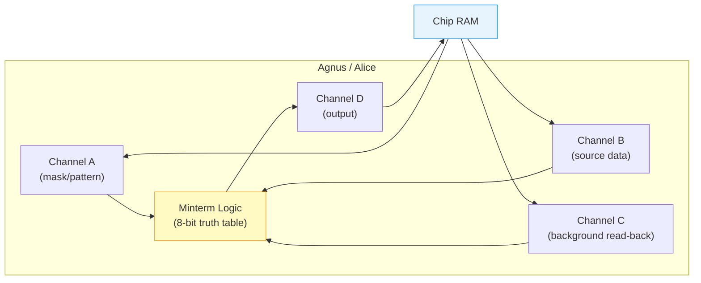

[← Home](../README.md) · [Graphics](README.md)

# Blitter Programming — Deep Dive

## Overview

The **[Blitter](../01_hardware/ocs_a500/blitter.md)** (Block Image Transferrer) is a DMA coprocessor inside the Agnus chip that performs raster operations on rectangular memory blocks at bus speed — **without CPU involvement**. While the 68000 executes game logic, physics, or AI, the Blitter simultaneously clears screens, copies bitmap regions, composites masked sprites ("cookie-cut"), draws lines, and fills polygons. This parallelism is fundamental to why the Amiga could deliver arcade-quality 2D graphics on a 7 MHz processor with 512 KB of RAM.

The Blitter operates on up to **4 DMA channels** (A, B, C → D) using a programmable **8-bit minterm** truth table that encodes any Boolean function of three inputs. Combined with per-channel shift, modulo, and first/last word masking, this makes the Blitter a general-purpose 2D rasterization engine — not merely a memory copier.

> [!WARNING]
> The Blitter can **only** access Chip RAM. Pointing any channel register at Fast RAM causes silent data corruption or system crashes. Always allocate blitter-visible memory with `AllocMem(size, MEMF_CHIP)`.

```
Channel A ──→ ┐
Channel B ──→ ├──→ Minterm Logic ──→ Channel D (output)
Channel C ──→ ┘

A = mask/pattern (e.g., cookie shape, font glyph)
B = source image data
C = background / destination read-back
D = output destination
```

---

## Architecture

The Blitter sits inside **Agnus** (OCS/ECS) or **Alice** (AGA), sharing the DMA bus with the Copper, bitplane fetches, sprite DMA, disk, and audio. It accesses memory through 4 independent DMA channels, each with its own pointer and modulo register:



The **Minterm Logic** block is the Blitter's core innovation. It takes the current bit from channels A, B, and C (three Boolean inputs) and produces one output bit for channel D according to a programmable **8-bit truth table** stored in BLTCON0 bits 7–0. Since 3 inputs have 8 possible combinations (2³), the 8-bit minterm encodes **any** Boolean function of three variables — that's 256 possible logic operations in a single register write. This is what lets one piece of hardware do copies (`D=A`, minterm `$F0`), clears (`D=0`, minterm `$00`), cookie-cut compositing (`D=A·B+¬A·C`, minterm `$CA`), XOR highlighting (`D=A⊕C`, minterm `$5A`), and any other combination — all without changing hardware, just the 8-bit minterm value. See [Minterm Logic](#minterm-logic) below for the full truth table and common values.

Each channel reads (or writes, for D) from a different memory pointer with independent modulo, allowing operations on sub-rectangles within larger bitmaps. **Writing to `BLTSIZE` ($DFF058) starts the blit immediately** — always configure all other registers first.

### Channel Roles

| Channel | DMA Direction | Typical Role | Has Shift? | Has Mask? |
|---|---|---|---|---|
| **A** | Read | Mask, cookie shape, font glyph, line texture | Yes (ASH, 0–15 px) | Yes (BLTAFWM/BLTALWM) |
| **B** | Read | Source image data | Yes (BSH, 0–15 px) | No |
| **C** | Read | Background / destination read-back | No | No |
| **D** | Write | Output destination | No | No |

> [!NOTE]
> Any channel can be disabled per operation via BLTCON0 bits 11–8 (USEA/B/C/D). Disabling unused channels **saves DMA cycles** — a D-only clear (1 channel) runs 4× faster than a full ABCD blit.

### CPU / Blitter Bus Interaction

The Blitter and the 68000 CPU share the **Chip RAM bus** — they cannot access it simultaneously. Agnus arbitrates access on a cycle-by-cycle basis:

```
┌────────────────────────────────────────────────────────────┐
│                    Chip RAM Bus (16-bit)                   │
├──────────┬──────────┬──────────┬──────────┬────────────────┤
│ Bitplane │  Sprite  │  Copper  │ Blitter  │   CPU (left-   │
│   DMA    │   DMA    │   DMA    │   DMA    │   over slots)  │
├──────────┴──────────┴──────────┴──────────┴────────────────│
│               Fixed priority (high → low)                  │
└────────────────────────────────────────────────────────────┘
```

- **Without `BLTPRI`**: The Blitter gets every other free DMA slot. The CPU gets the remaining slots. Both run at roughly half speed on the Chip RAM bus.
- **With `BLTPRI` (nasty mode)**: The Blitter takes **all** free DMA slots. The CPU is completely frozen on any Chip RAM access until the blit completes. The CPU can still execute from Fast RAM or ROM — but any Chip RAM read/write stalls.
- **Display DMA always wins**: Bitplane, sprite, and audio DMA have fixed priority above the Blitter. In high-resolution modes, display DMA alone consumes most of the bus, leaving few slots for blitter operations.

### Chip RAM vs. Fast RAM

The Blitter is physically wired to the Chip RAM bus inside Agnus. It has **no connection** to the Fast RAM (Zorro) bus:

| Memory Type | Blitter Access? | CPU Access? | Notes |
|---|---|---|---|
| **Chip RAM** (first 512 KB–2 MB) | ✓ Yes | ✓ Yes (contended) | Screen buffers, audio, sprites, all DMA-visible data |
| **Fast RAM** (Zorro II/III) | ✗ No | ✓ Yes (uncontended) | Code, variables, non-DMA data |
| **ROM** ($F80000–$FFFFFF) | ✗ No | ✓ Yes | Kickstart, libraries |

This creates the key optimization opportunity on accelerated Amigas (A1200, A3000, A4000): **the CPU can execute code and access Fast RAM at full speed while the Blitter simultaneously works on Chip RAM**. On a stock A500 with only Chip RAM, the CPU and Blitter always contend for the same bus.

> [!IMPORTANT]
> There is no hardware error when pointing blitter registers at Fast RAM addresses. The Blitter's 22-bit address lines (OCS/ECS) simply wrap into Chip RAM space — producing silent data corruption at an unpredictable Chip RAM location.

## Minterm Logic

The minterm is an **8-bit value** stored in BLTCON0 (bits 7–0) that tells the Blitter what to do with each pixel. Think of it as a tiny program: for every pixel position, the Blitter reads the current bit from channels A, B, and C, looks up the answer in the minterm, and writes that answer to channel D (destination memory).

Since there are 3 inputs (A, B, C), each either 0 or 1, there are exactly **8 possible input combinations**. The 8-bit minterm has one bit for each combination — that bit decides whether the output pixel is on (1) or off (0):

| Minterm Bit | Input A (mask) | Input B (source) | Input C (background) | "If these inputs look like this…" |
|---|---|---|---|---|
| Bit 7 | 1 | 1 | 1 | …mask on, source on, background on |
| Bit 6 | 1 | 1 | 0 | …mask on, source on, background off |
| Bit 5 | 1 | 0 | 1 | …mask on, source off, background on |
| Bit 4 | 1 | 0 | 0 | …mask on, source off, background off |
| Bit 3 | 0 | 1 | 1 | …mask off, source on, background on |
| Bit 2 | 0 | 1 | 0 | …mask off, source on, background off |
| Bit 1 | 0 | 0 | 1 | …mask off, source off, background on |
| Bit 0 | 0 | 0 | 0 | …mask off, source off, background off |

Each bit is a simple yes/no: **"should the output pixel be on for this combination?"**

### Worked Example: Cookie-Cut (`$CA`)

The most important minterm is `$CA` — the cookie-cut blit used for sprite compositing. In binary, `$CA` = `11001010`. Let's read each bit:

| Bit | A (mask) | B (source) | C (background) | `$CA` bit value | Output pixel | Why |
|---|---|---|---|---|---|---|
| 7 | on | on | on | **1** | **on** | Inside the shape, source pixel is on → show it |
| 6 | on | on | off | **1** | **on** | Inside the shape, source pixel is on → show it |
| 5 | on | off | on | **0** | **off** | Inside the shape, source pixel is off → show it (it's dark) |
| 4 | on | off | off | **0** | **off** | Inside the shape, source pixel is off → show it |
| 3 | off | on | on | **1** | **on** | Outside the shape → keep background (it's on) |
| 2 | off | on | off | **0** | **off** | Outside the shape → keep background (it's off) |
| 1 | off | off | on | **1** | **on** | Outside the shape → keep background (it's on) |
| 0 | off | off | off | **0** | **off** | Outside the shape → keep background (it's off) |

The pattern: **where the mask (A) is set → take the source pixel (B). Where the mask is clear → keep the background pixel (C).** That's a sprite draw with transparency — exactly what every Amiga game uses.

### Common Minterms

| Minterm | Hex | Operation | Description | Real-World Use Case |
|---|---|---|---|---|
| `D = A` | `$F0` | Copy A | Output is a copy of channel A — every A-set pixel appears in D | **Block copy**: duplicate a screen region, copy a font glyph to the display |
| `D = B` | `$CC` | Copy B | Output is a copy of channel B regardless of A and C | **Shifted copy**: B has a barrel shift, so this copies with pixel-level repositioning |
| `D = C` | `$AA` | Copy C | Output is a copy of the destination read-back | **No-op / readback**: useful for fill mode where C→D with fill carry toggling |
| `D = A·B + ¬A·C` | `$CA` | Cookie-cut | Where mask (A) is 1: show source (B). Where mask is 0: show background (C) | **Sprite compositing**: draw a player character with transparency onto the game world |
| `D = 0` | `$00` | Clear | Output is always 0 regardless of inputs | **Screen clear**: zero out a bitplane, erase a region |
| `D = $FFFF` | `$FF` | Set all | Output is always 1 | **Fill with 1s**: set all pixels in a region (useful for masks) |
| `D = A XOR C` | `$5A` | XOR | Output toggles wherever A has a set bit | **Cursor blink**: XOR the cursor shape to toggle it on/off without saving background |
| `D = A OR C` | `$FA` | OR | Output is set wherever either A or C has a set bit | **Overlay**: stamp a shape onto the background without erasing existing pixels |
| `D = ¬A AND C` | `$0A` | Mask out | Output keeps C pixels only where A is clear — erases through the mask | **Erase shape**: cut a hole in the background matching the mask shape (first pass of two-pass sprite draw) |
| `D = A AND B` | `$C0` | AND | Output is set only where both A and B agree | **Masked pattern**: apply a fill pattern (B) clipped to a shape (A) |
| `D = A XOR B` | `$3C` | XOR (A,B) | Output toggles between A and B differences | **Difference detection**: find which pixels changed between two frames |
| `D = NOT A` | `$0F` | Invert | Output is the bitwise complement of A | **Mask inversion**: generate a negative mask from a positive one |

### Cookie-Cut Explained

```
A = mask (1 = sprite pixel, 0 = transparent)
B = sprite image data
C = background
D = result

Minterm $CA:
  Where A=1: D = B  (show sprite)
  Where A=0: D = C  (show background)
```

---

## Register Reference

| Address | Name | R/W | Description |
|---------|------|-----|-------------|
| `$DFF040` | BLTCON0 | W | Control: ASH (bits 15–12), channel enables (bits 11–8), minterm (bits 7–0) |
| `$DFF042` | BLTCON1 | W | Control: BSH (bits 15–12), fill/line mode (bits 4–0) |
| `$DFF044` | BLTAFWM | W | First word mask for channel A |
| `$DFF046` | BLTALWM | W | Last word mask for channel A |
| `$DFF048` | BLTCPTH/L | W | Channel C pointer (32-bit) |
| `$DFF04C` | BLTBPTH/L | W | Channel B pointer (32-bit) |
| `$DFF050` | BLTAPTH/L | W | Channel A pointer (32-bit) |
| `$DFF054` | BLTDPTH/L | W | Channel D pointer (32-bit) |
| `$DFF058` | BLTSIZE | W | Blit dimensions + **START** (write triggers blit!) |
| `$DFF05A` | BLTSIZV | W | Blit height — **AGA only** (15-bit, up to 32768 lines) |
| `$DFF05C` | BLTSIZH | W | Blit width + START — **AGA only** (11-bit, up to 2048 words) |
| `$DFF060` | BLTCMOD | W | Channel C modulo (bytes to skip per row) |
| `$DFF062` | BLTBMOD | W | Channel B modulo |
| `$DFF064` | BLTAMOD | W | Channel A modulo |
| `$DFF066` | BLTDMOD | W | Channel D modulo |
| `$DFF070` | BLTCDAT | W | Channel C data register (preload) |
| `$DFF072` | BLTBDAT | W | Channel B data register (preload) |
| `$DFF074` | BLTADAT | W | Channel A data register (preload / line texture) |
| `$DFF002` | DMACONR | R | DMA status — bit 14 (BBUSY) = blitter busy |

### BLTCON0 Encoding

```
Bits 15–12: ASH  — A channel barrel shift (0–15 pixels right)
Bit  11:    USEA — enable channel A DMA
Bit  10:    USEB — enable channel B DMA
Bit   9:    USEC — enable channel C DMA
Bit   8:    USED — enable channel D DMA (almost always 1)
Bits  7–0:  LF   — minterm (logic function truth table)
```

### BLTCON1 Encoding

```
Bits 15–12: BSH  — B channel barrel shift (0–15 pixels right)
Bit   4:    IFE  — inclusive fill enable
Bit   3:    EFE  — exclusive fill enable
Bit   2:    FCI  — fill carry input (initial state)
Bit   1:    DESC — descending mode (blit bottom-right → top-left)
Bit   0:    LINE — line draw mode
```

### BLTSIZE Encoding (OCS/ECS)

```
Bits 15–6: Height in lines (1–1024, 0 = 1024)
Bits  5–0: Width in words  (1–64,   0 = 64)
```

> [!WARNING]
> **Writing BLTSIZE starts the blit!** Always configure all other registers (pointers, modulos, control, masks) before writing BLTSIZE. On AGA, write BLTSIZV first, then BLTSIZH (which triggers the blit).

### Ascending vs. Descending Mode

When source and destination overlap in memory, the blit direction determines whether data is corrupted:

```
Ascending (default, DESC=0):
  Reads/writes top-left → bottom-right
  Use when: dest address > source address

Descending (DESC=1):
  Reads/writes bottom-right → top-left
  Use when: dest address < source address
  Pointers must be set to the LAST word of the block
  Modulos are subtracted instead of added
```

This is critical for **scrolling** — shifting the screen contents by a few pixels requires an overlapping copy, and using the wrong direction produces garbage.

### Shift and Alignment

The Blitter is a **word-aligned** (16-bit) processor. Moving objects to arbitrary pixel positions requires the barrel shifter:

- **ASH** (channel A shift) and **BSH** (channel B shift) shift data 0–15 pixels to the right
- A rectangle N pixels wide at a non-aligned X position spans `⌈(N + shift) / 16⌉` words — one more than aligned
- **BLTAFWM** (first word mask) and **BLTALWM** (last word mask) prevent the shifted data from corrupting pixels outside the target area

---

## Complete Examples

### Example 1: Clear Screen (320×256, 1 bitplane)

```asm
    lea     $DFF000,a5

    ; Wait for blitter idle:
.bwait:
    btst    #14,$002(a5)    ; DMACONR bit 14 = BBUSY
    bne.s   .bwait

    ; D channel only, minterm $00 (clear):
    move.l  #$01000000,$040(a5)  ; BLTCON0: USED=1, minterm=$00
    clr.w   $042(a5)             ; BLTCON1: 0
    move.l  #ScreenMem,$054(a5)  ; BLTDPT
    clr.w   $066(a5)             ; BLTDMOD: 0 (contiguous)
    move.w  #(256<<6)|20,$058(a5) ; BLTSIZE: 256 lines × 20 words (320/16)
    ; Blit is now running!
```

### Example 2: Block Copy (No Shift)

```asm
    ; Copy 64×64 pixel block from source to dest (1 bitplane)
    ; Source and dest are in contiguous bitmap, 320 pixels wide

    ; Width = 64 pixels = 4 words
    ; Modulo = (320 - 64) / 16 = 16 words = 32 bytes

    lea     $DFF000,a5

.bwait:
    btst    #14,$002(a5)
    bne.s   .bwait

    move.l  #$09F00000,$040(a5)  ; BLTCON0: USEA+USED, minterm=$F0 (A→D)
    clr.w   $042(a5)             ; BLTCON1
    move.w  #$FFFF,$044(a5)      ; BLTAFWM = all bits
    move.w  #$FFFF,$046(a5)      ; BLTALWM = all bits
    move.l  #SourceAddr,$050(a5) ; BLTAPT
    move.l  #DestAddr,$054(a5)   ; BLTDPT
    move.w  #32,$064(a5)         ; BLTAMOD = 32 bytes
    move.w  #32,$066(a5)         ; BLTDMOD = 32 bytes
    move.w  #(64<<6)|4,$058(a5)  ; BLTSIZE: 64 lines × 4 words → GO!
```

### Example 3: Cookie-Cut Blit (Masked Sprite)

```asm
    ; Blit a 16×16 masked sprite onto background
    ; A = mask, B = sprite data, C = background, D = destination

    lea     $DFF000,a5

.bwait:
    btst    #14,$002(a5)
    bne.s   .bwait

    move.l  #$0FCA0000,$040(a5)  ; BLTCON0: A+B+C+D, minterm=$CA
    clr.w   $042(a5)             ; BLTCON1
    move.w  #$FFFF,$044(a5)      ; BLTAFWM
    move.w  #$FFFF,$046(a5)      ; BLTALWM
    move.l  #MaskData,$050(a5)   ; BLTAPT = mask
    move.l  #SpriteData,$04C(a5) ; BLTBPT = sprite imagery
    move.l  #ScreenPos,$048(a5)  ; BLTCPT = background (read-back)
    move.l  #ScreenPos,$054(a5)  ; BLTDPT = same as C (overwrite)
    clr.w   $064(a5)             ; BLTAMOD = 0 (mask is 16px = 1 word wide)
    clr.w   $062(a5)             ; BLTBMOD = 0
    move.w  #38,$060(a5)         ; BLTCMOD = (320-16)/8 = 38 bytes
    move.w  #38,$066(a5)         ; BLTDMOD = 38
    move.w  #(16<<6)|1,$058(a5)  ; BLTSIZE: 16 lines × 1 word → GO!
```

### Example 4: Line Drawing

```asm
    ; Draw a line from (x1,y1) to (x2,y2) using blitter line mode
    ; This is complex — blitter line mode uses a Bresenham-style algorithm
    ; implemented in hardware

    ; BLTCON1 bit 0 = LINE mode
    ; Channel A = single word (texture pattern)
    ; Channel C/D = destination bitmap

    ; See HRM for the full algorithm; here's the concept:
    move.l  #$0B4A0000,$040(a5)  ; BLTCON0: A+C+D, minterm=$4A (XOR), ASH=dx
    move.w  #$0001,$042(a5)      ; BLTCON1: LINE=1, octant bits set per slope
    move.w  #$8000,$074(a5)      ; BLTADAT: single pixel pattern
    move.w  #$FFFF,$044(a5)      ; BLTAFWM
    move.l  #StartPos,$048(a5)   ; BLTCPT: line start position in bitmap
    move.l  #StartPos,$054(a5)   ; BLTDPT: same
    move.w  #Modulo,$060(a5)     ; BLTCMOD
    move.w  #Modulo,$066(a5)     ; BLTDMOD
    move.w  #(len<<6)|2,$058(a5) ; BLTSIZE: length × 2 → GO!
```

---

## Advanced Use Cases & Cookbook

### Use Case 1: Shifted BOB (Sprite at Arbitrary X Position)

The most common real-world blitter task: draw a 16×16 sprite at pixel position (x, y) on a 320-pixel-wide screen. Since x may not be word-aligned, the barrel shifter handles sub-word positioning:

```asm
    ; Draw 16×16 BOB at pixel (x, y) on a 320px wide screen
    ; Inputs: d0.w = x position, d1.w = y position
    ;         a0 = mask data, a1 = sprite data, a2 = screen base

    lea     $DFF000,a5

    ; Calculate screen byte offset:
    move.w  d1,d2
    mulu    #40,d2              ; y × 40 bytes/row (320 pixels / 8)
    move.w  d0,d3
    lsr.w   #3,d3               ; x / 8 = byte offset in row
    and.w   #$FFFE,d3           ; word-align (drop bit 0)
    add.w   d3,d2               ; total byte offset into screen
    lea     (a2,d2.w),a3        ; a3 = screen pointer for this BOB

    ; Calculate shift amount:
    move.w  d0,d3
    and.w   #$000F,d3           ; shift = x mod 16 (0–15 pixels)
    ror.w   #4,d3               ; move to bits 15–12 for BLTCON0
    or.w    #$0FCA,d3           ; channels A+B+C+D, minterm $CA

.bwait:
    btst    #14,$002(a5)
    bne.s   .bwait

    move.w  d3,$040(a5)         ; BLTCON0: shift + channels + minterm
    clr.w   $042(a5)            ; BLTCON1: ascending, no fill
    move.w  #$FFFF,$044(a5)     ; BLTAFWM: all bits in first word
    move.w  #$0000,$046(a5)     ; BLTALWM: mask off last word (shift overflow)
    move.l  a0,$050(a5)         ; BLTAPT = mask
    move.l  a1,$04C(a5)         ; BLTBPT = sprite imagery
    move.l  a3,$048(a5)         ; BLTCPT = background read-back
    move.l  a3,$054(a5)         ; BLTDPT = write back to same position
    clr.w   $064(a5)            ; BLTAMOD = 0 (mask is 1 word wide)
    clr.w   $062(a5)            ; BLTBMOD = 0 (sprite is 1 word wide)
    move.w  #36,$060(a5)        ; BLTCMOD = 40 - (2 words × 2) = 36 bytes
    move.w  #36,$066(a5)        ; BLTDMOD = 36
    move.w  #(16<<6)|2,$058(a5) ; BLTSIZE: 16 lines × 2 words (1 extra for shift) → GO!
```

**Key insight**: the blit is 2 words wide even though the sprite is only 16 pixels (1 word). The barrel shift pushes bits into the second word, so we need that extra word — and `BLTALWM=$0000` masks it so we don't corrupt adjacent pixels.

### Use Case 2: Hardware Scroll (Left by N Pixels)

Scrolling the screen left means the destination is at a lower address than the source — we must use **descending mode** to avoid overwriting source data:

```asm
    ; Scroll 320×256 screen left by 16 pixels (1 word = fastest case)
    ; Source: screen + 2 bytes (one word right)
    ; Dest:   screen base
    ; No shift needed for 16-pixel increments

    lea     $DFF000,a5

.bwait:
    btst    #14,$002(a5)
    bne.s   .bwait

    move.l  #$09F00000,$040(a5) ; BLTCON0: A+D, minterm $F0 (copy)
    clr.w   $042(a5)            ; BLTCON1: ascending (dest > source is OK here)
    move.w  #$FFFF,$044(a5)     ; BLTAFWM
    move.w  #$FFFF,$046(a5)     ; BLTALWM
    move.l  #Screen+2,$050(a5)  ; BLTAPT: source is 1 word to the right
    move.l  #Screen,$054(a5)    ; BLTDPT: destination is screen start
    clr.w   $064(a5)            ; BLTAMOD = 0 (full-width rows)
    clr.w   $066(a5)            ; BLTDMOD = 0
    move.w  #(256<<6)|20,$058(a5) ; BLTSIZE: 256 lines × 20 words → GO!
    ; After blit: draw new column at right edge (column 19)
```

For sub-word scrolling (1–15 pixels), combine this with the barrel shifter and draw the new edge column from tile data.

### Use Case 3: Area Fill (Filled Polygon)

The blitter's fill mode is a two-step process: (1) draw the polygon outline with XOR lines, (2) fill the region. This is how games like *Carrier Command* and *Starglider 2* achieved real-time filled 3D:

```asm
    ; Step 1: Draw polygon edges using blitter line mode (XOR, single-bit)
    ; (Repeat for each edge of the polygon)
    ; Use minterm $4A (A XOR C) and BLTCON1 bit 0 = LINE, bit 1 = SING

    ; Step 2: Fill the outlined region
    ; Fill works RIGHT-TO-LEFT, BOTTOM-TO-TOP — requires descending mode
    ; Pointers must point to the LAST word of the bitmap region

    lea     $DFF000,a5

.bwait:
    btst    #14,$002(a5)
    bne.s   .bwait

    ; Set up inclusive fill (IFE):
    move.l  #$09F00000,$040(a5)  ; BLTCON0: A+D, minterm $F0 (copy with fill)
    move.w  #$000A,$042(a5)      ; BLTCON1: DESC=1 (bit 1), IFE=1 (bit 3)
                                  ; IFE = inclusive fill enable
    move.w  #$FFFF,$044(a5)      ; BLTAFWM
    move.w  #$FFFF,$046(a5)      ; BLTALWM

    ; Pointers to LAST word of the fill region (descending!):
    move.l  #FillBufferEnd,$050(a5) ; BLTAPT: last word of source
    move.l  #FillBufferEnd,$054(a5) ; BLTDPT: last word of dest (same buffer)
    clr.w   $064(a5)               ; BLTAMOD = 0
    clr.w   $066(a5)               ; BLTDMOD = 0
    move.w  #(Height<<6)|Width,$058(a5)  ; BLTSIZE → GO!
```

**How it works**: the fill carry bit (`FCI`) toggles on every set pixel. Between two outline pixels on the same scanline, the carry stays on — filling the interior. This is why the outline must use **single-bit mode** (SING=1) — otherwise double-width line pixels break the fill toggle.

### Use Case 4: Interleaved Bitplane BOBs

Standard bitplane layout stores all of plane 0, then all of plane 1, etc. **Interleaved** layout stores one row of plane 0, then one row of plane 1, alternating. This allows a single blit to draw a BOB across all bitplanes at once:

```asm
    ; Interleaved screen layout:
    ;   Row 0, Plane 0 (40 bytes)
    ;   Row 0, Plane 1 (40 bytes)
    ;   Row 0, Plane 2 (40 bytes)
    ;   Row 0, Plane 3 (40 bytes)
    ;   Row 0, Plane 4 (40 bytes)
    ;   Row 1, Plane 0 (40 bytes)
    ;   ...

    ; Blit a 16×16 cookie-cut BOB across all 5 bitplanes in ONE operation:
    ; Height = 16 lines × 5 planes = 80 rows
    ; Modulo = 40 - 2 = 38 bytes per interleaved row (skip rest of scanline row)
    ; BOB data is also stored interleaved

    lea     $DFF000,a5

.bwait:
    btst    #14,$002(a5)
    bne.s   .bwait

    move.l  #$0FCA0000,$040(a5) ; BLTCON0: A+B+C+D, minterm $CA
    clr.w   $042(a5)            ; BLTCON1
    move.w  #$FFFF,$044(a5)     ; BLTAFWM
    move.w  #$FFFF,$046(a5)     ; BLTALWM
    move.l  #BOBMask,$050(a5)   ; BLTAPT (interleaved mask: same mask for all planes)
    move.l  #BOBData,$04C(a5)   ; BLTBPT (interleaved sprite data)
    move.l  a3,$048(a5)         ; BLTCPT (screen position)
    move.l  a3,$054(a5)         ; BLTDPT (same)
    clr.w   $064(a5)            ; BLTAMOD = 0 (mask repeats)
    clr.w   $062(a5)            ; BLTBMOD = 0
    move.w  #38,$060(a5)        ; BLTCMOD = 38 (skip to next interleaved row)
    move.w  #38,$066(a5)        ; BLTDMOD = 38
    move.w  #(80<<6)|1,$058(a5) ; BLTSIZE: 80 rows (16×5) × 1 word → GO!
```

**Why this matters**: without interleaving, drawing one BOB on a 5-plane screen requires **5 separate blits** (one per plane), each with its own WaitBlit + register setup overhead. Interleaving does it in **1 blit** — 5× less setup time, critical when drawing 15+ BOBs per frame.

### Use Case 5: Double-Buffered Game Loop

The standard pattern for flicker-free game rendering:

```asm
MainLoop:
    ; --- Wait for vertical blank ---
    bsr     WaitVBL             ; Wait for beam to reach line 0

    ; --- Swap display buffer ---
    ; Copper list points to the currently visible buffer
    ; We draw into the hidden back buffer
    move.l  BackBuffer,a0
    move.l  FrontBuffer,a1
    move.l  a0,FrontBuffer      ; Back buffer becomes front (display)
    move.l  a1,BackBuffer       ; Old front becomes new back (draw target)

    ; Update Copper list bitplane pointers to show new front buffer:
    bsr     UpdateCopperBPLPTRs

    ; --- Clear back buffer ---
    bsr     WaitBlit
    move.l  #$01000000,$040(a5) ; D-only, minterm $00
    clr.w   $042(a5)
    move.l  a1,$054(a5)         ; BLTDPT = back buffer
    clr.w   $066(a5)
    move.w  #(256<<6)|20,$058(a5) ; Clear 320×256 → GO!

    ; --- Draw all BOBs ---
    ; CPU can process game logic while the clear blit runs!
    bsr     UpdateGameLogic     ; Physics, AI, input — runs on CPU
    bsr     WaitBlit            ; Wait for clear to finish
    bsr     DrawAllBOBs         ; Chain of cookie-cut blits

    bra     MainLoop
```

**Key optimization**: `UpdateGameLogic` runs on the CPU *while* the screen clear runs on the Blitter. This is the core of the Amiga's parallelism — ~1.5 ms of free CPU time per frame from a single D-only clear.

### Use Case 6: GUI Window Drag (System-Friendly)

Workbench and applications use `graphics.library` for window dragging, icon rendering, and menu drawing. The OS handles Blitter synchronization:

```c
#include <graphics/gfx.h>
#include <graphics/rastport.h>

/* Scroll a window's contents up by 8 pixels (text scroll): */
ScrollRaster(rp,       /* RastPort */
             0, 8,     /* dx=0, dy=8 (scroll up by 8 pixels) */
             0, 0,     /* top-left corner of scroll area */
             319, 199); /* bottom-right */
/* The OS automatically uses an ascending/descending blit, sets modulos, */
/* and clears the exposed bottom strip. */

/* Copy a rectangular region between two bitmaps: */
BltBitMap(srcBM, 0, 0,       /* source bitmap, x, y */
          dstBM, 100, 50,    /* dest bitmap, x, y */
          64, 32,            /* width, height */
          0xC0,              /* minterm: A AND B → masked copy */
          0xFF,              /* all bitplanes */
          NULL);             /* no temp buffer needed */

/* Draw a filled rectangle (uses the Blitter internally): */
SetAPen(rp, 3);              /* Set pen color to index 3 */
RectFill(rp, 10, 10, 100, 50); /* Filled rectangle */
```

### Use Case 7: Tile Map Renderer

Games like *The Settlers*, *Cannon Fodder*, and most platformers render backgrounds from tile maps. Each tile is a 16×16 (or 32×32) block blitted to screen coordinates:

```asm
    ; Render a 20×16 tile map (320×256 screen, 16×16 tiles)
    ; TileMap: array of 320 bytes (20×16), each byte = tile index
    ; TileGfx: tile graphics, 16×16 pixels × 5 planes, interleaved

    lea     TileMap,a0
    lea     Screen,a2
    moveq   #16-1,d7            ; 16 tile rows

.tilerow:
    moveq   #20-1,d6            ; 20 tiles per row

.tilecol:
    moveq   #0,d0
    move.b  (a0)+,d0            ; Get tile index
    mulu    #16*5*2,d0          ; Tile data offset (16 rows × 5 planes × 2 bytes)
    lea     TileGfx,a1
    add.l   d0,a1               ; a1 = tile graphics pointer

    bsr     WaitBlit
    move.l  #$09F00000,$040(a5) ; BLTCON0: A+D, minterm $F0 (straight copy)
    clr.w   $042(a5)            ; BLTCON1
    move.w  #$FFFF,$044(a5)     ; BLTAFWM
    move.w  #$FFFF,$046(a5)     ; BLTALWM
    move.l  a1,$050(a5)         ; BLTAPT = tile data (interleaved)
    move.l  a2,$054(a5)         ; BLTDPT = screen position
    clr.w   $064(a5)            ; BLTAMOD = 0 (tile data is contiguous)
    move.w  #38,$066(a5)        ; BLTDMOD = 40 - 2 = 38 (interleaved screen)
    move.w  #(80<<6)|1,$058(a5) ; BLTSIZE: 80 rows (16×5) × 1 word → GO!

    addq.l  #2,a2               ; Next tile position (1 word right)
    dbf     d6,.tilecol

    ; Move to next tile row: advance screen pointer by 16 scanlines × 5 planes × 40 bytes
    add.l   #16*5*40-40,a2      ; Subtract the 40 bytes already advanced by 20 tiles
    dbf     d7,.tilerow
```

---

## Good and Bad Patterns

### ✓ Pattern: "Blit and Compute" — Overlap CPU and Blitter Work

```asm
    ; Start a blit, then do CPU work while it runs:
    bsr     SetupAndStartBlit   ; Triggers BLTSIZE write
    bsr     UpdatePlayerPhysics ; CPU work — runs in parallel!
    bsr     ProcessInput        ; More CPU work
    bsr     WaitBlit            ; NOW wait for blit to finish
    bsr     SetupNextBlit       ; Safe to touch registers
```

This is the **entire point** of having a Blitter. Any code that busy-waits immediately after starting a blit wastes the Amiga's key advantage.

### ✗ Antipattern: "The Busy-Wait Hog"

```asm
    ; ✗ BAD: Wait immediately after every blit — wastes CPU cycles
    bsr     StartBlit
.wait1: btst #14,$002(a5)
    bne.s   .wait1              ; CPU does NOTHING while blitter runs
    bsr     StartNextBlit
.wait2: btst #14,$002(a5)
    bne.s   .wait2              ; More wasted time
```

### ✓ Pattern: "Batch Then Wait" — Chain Setup, Single Sync Point

```asm
    ; Process all game logic FIRST:
    bsr     RunAI
    bsr     RunPhysics
    bsr     AnimateFrames
    ; THEN start the rendering blits in sequence:
    bsr     WaitBlit
    bsr     BlitBOB1
    bsr     WaitBlit
    bsr     BlitBOB2
    bsr     WaitBlit
    bsr     BlitBOB3
    ; The CPU-intensive work happened during the previous frame's display time
```

### ✗ Antipattern: "The Single-Plane-At-A-Time"

```asm
    ; ✗ BAD: Blit each bitplane separately (5× setup overhead)
    lea     Plane0,a0
    bsr     BlitBOBOnePlane
    lea     Plane1,a0
    bsr     BlitBOBOnePlane
    lea     Plane2,a0
    bsr     BlitBOBOnePlane
    lea     Plane3,a0
    bsr     BlitBOBOnePlane
    lea     Plane4,a0
    bsr     BlitBOBOnePlane     ; 5 blits, 5 WaitBlit calls, 5× register setup
```

```asm
    ; ✓ GOOD: Use interleaved bitplanes — ONE blit for all planes
    bsr     BlitBOBInterleaved  ; 1 blit, 1 WaitBlit, 1× register setup
```

### ✗ Antipattern: "System-Unfriendly Direct Access"

```c
/* ✗ BAD: Hit blitter registers directly from a Workbench app */
custom.bltcon0 = 0x09F00000;
/* The OS may be using the blitter RIGHT NOW for window operations */
```

```c
/* ✓ GOOD: Use OwnBlitter/DisownBlitter for exclusive access */
OwnBlitter();           /* Wait for and lock the blitter */
WaitBlit();              /* Ensure previous blit is done */
/* ... safe to program registers directly ... */
DisownBlitter();         /* Release for OS use */
```

### ✗ Antipattern: "Hardcoded 320-Pixel Modulo"

```asm
    ; ✗ BAD: Assumes screen width is always 320 pixels (modulo = 40 - blit_width*2)
    move.w  #36,$066(a5)        ; BLTDMOD = 36 (hardcoded for 320px)
```

Many Amiga programs run on PAL overscan (352 or 384 pixels), productivity modes (640+), or RTG screens. Always calculate modulo from the actual screen byte width:

```asm
    ; ✓ GOOD: Calculate modulo from actual bitmap width
    move.w  ScreenBytesPerRow,d0
    sub.w   BlitWidthBytes,d0
    move.w  d0,$066(a5)         ; BLTDMOD = dynamic
```

### ✗ Antipattern: "Ignoring the DMA Budget"

The Blitter shares the DMA bus with display, audio, and disk. In high-bandwidth display modes, there are fewer free DMA slots:

| Display Mode | DMA Slots Used by Display | Remaining for Blitter | Effect |
|---|---|---|---|
| Lores 320×256 × 5 planes | ~100 per line | ~126 per line | Full blitter speed |
| Hires 640×256 × 4 planes | ~160 per line | ~66 per line | Blitter runs at ~50% speed |
| Super Hires 1280 × 4 planes | ~200+ per line | ~26 per line | Blitter barely runs |
| HAM8 (AGA) | ~200 per line | ~26 per line | Blitter barely runs |

**Rule of thumb**: if your game stutters in hires modes, it's probably DMA contention, not CPU speed.

---

## Practical Limitations

| Limitation | Detail | Workaround |
|---|---|---|
| **Max blit size (OCS/ECS)** | 1024 lines × 64 words (1024×1024 pixels) | Split into multiple blits |
| **Max blit size (AGA)** | 32768 lines × 2048 words (BLTSIZV/BLTSIZH) | Rarely a practical issue |
| **Word alignment** | Blitter operates on 16-bit word boundaries only | Use barrel shift + masks for sub-word positioning; costs 1 extra word of width |
| **No scaling** | Cannot scale or rotate — purely rectangular block ops | Use CPU for affine transforms, then blit the result |
| **No clipping** | Blitter will happily write outside the screen bitmap | Implement clipping in software before setting up the blit |
| **Single operation at a time** | Only one blit can run at a time — no queue | Pipeline setup: compute next blit's parameters on CPU while current blit runs |
| **Chip RAM only** | All 4 channels must point to Chip RAM | Use `MEMF_CHIP` for all blitter-visible allocations; see [memory_types.md](../01_hardware/common/memory_types.md) |
| **Fill carry direction** | Fill mode only works right-to-left (descending) | Always use DESC=1 with fill; set pointers to the end of the data |
| **No transparency levels** | Boolean operations only — 1-bit masking, no alpha | Dithering or multiple passes for graduated transparency |
| **Line mode limitations** | Lines drawn with SING=1 for fill prep are single-dot-per-row — visible gaps on steep angles | Use non-SING mode for visible lines, SING only for fill boundaries |

---

## Performance Analysis

### DMA Cycle Costs

The Blitter consumes DMA cycles proportional to the number of **active channels**. Each active channel adds 1 DMA cycle per word per row:

| Channels Active | Cycles/Word | Example Operation | Time for 320×256 (1 plane) |
|---|---|---|---|
| D only | 1 cycle | Screen clear | ~0.3 ms |
| A + D | 2 cycles | Simple copy (A→D) | ~0.6 ms |
| A + B + D | 3 cycles | Masked copy | ~0.9 ms |
| A + B + C + D | 4 cycles | Cookie-cut blit | ~1.3 ms |

> At 3.58 MHz DMA clock, 1 cycle ≈ 280 ns. A full 320×256×5-plane screen clear takes ~1.5 ms (D-only × 5 planes).

### CPU vs. Blitter Crossover

The Blitter is not always faster than the 68000:

| Operation Size | Winner | Why |
|---|---|---|
| < ~40 words | CPU (68000) | Blitter setup overhead (~20 cycles) exceeds the DMA savings |
| 40–200 words | Tie | Depends on whether CPU needs the bus |
| > 200 words | Blitter | DMA runs independently; CPU can compute in parallel |
| Any size (A1200) | **Measure** | 68020 can access 32-bit Fast RAM while Blitter uses Chip RAM bus — often faster to do both |

### Nasty Mode (`BLTPRI`)

Setting bit 10 of DMACON (`BLTPRI`) gives the Blitter absolute DMA priority — the CPU is **frozen** until the blit completes. This maximizes blitter throughput but:
- Disables all interrupt servicing during the blit
- Breaks timing-sensitive code (audio, serial)
- Most professional software avoids it; demos use it freely

---

## When to Use / When NOT to Use

### When to Use the Blitter

- **Screen clearing** — D-only blit at 1 cycle/word is unbeatable
- **BOB/sprite compositing** — cookie-cut blit is the standard technique for all Amiga game objects
- **Scrolling** — overlapping copy with correct ascending/descending mode
- **Polygon filling** — exclusive/inclusive fill after boundary line drawing
- **Large memory copies** — any block > ~40 words benefits from DMA parallelism
- **Line drawing** — hardware Bresenham is faster than any software implementation on 68000

### When NOT to Use

- **Small copies (< 40 words)** — 68000 `MOVEM` or `MOVE.L` loop is faster due to blitter setup overhead
- **Fast RAM operations** — the Blitter cannot access Fast RAM at all; use CPU
- **Pixel-level operations** — the Blitter works on word-aligned rectangles; per-pixel logic requires CPU
- **A1200/A4000 with Fast RAM** — the 68020/030 running from 32-bit Fast RAM can often outperform the Blitter on Chip RAM, especially if you can overlap CPU work with display DMA

### Applicability Ranges

- **BOBs**: Practical limit ~15–20 per frame at 320×256×5 planes before exhausting DMA bandwidth
- **Fill mode**: Works on single bitplanes only — filling a 5-plane display requires 5 passes
- **Line mode**: Maximum line length limited by BLTSIZE height field (1024 on OCS/ECS, 32768 on AGA)

---

## Historical Context — The 1985 Competitive Landscape

The Blitter was architecturally unprecedented in 1985. No competing home computer shipped with a comparable 2D rasterization coprocessor:

| Feature | Amiga (1985) | Atari ST (1985) | PC EGA (1984) | Mac 128K (1984) | C64 (1982) |
|---|---|---|---|---|---|
| **Hardware blitter** | Yes — 4-channel DMA with minterm logic | No (added in Mega ST/STE, 1987 — 1 source only) | No | No | No |
| **Channels** | 3 source + 1 dest | 1 source + 1 dest (STE) | — | — | — |
| **Boolean ops** | 256 minterms (arbitrary 3-input logic) | 16 logic ops (STE) | — | — | — |
| **Line drawing** | Hardware Bresenham | No | No | No | No |
| **Area fill** | Hardware inclusive/exclusive fill | No | No | No | No |
| **Shift/mask** | Per-channel barrel shift + first/last word masks | Shift + endmask (STE) | — | — | — |
| **CPU relief** | Full DMA — CPU free during blit | Partial — CPU still involved (STE) | CPU does everything | CPU does everything | CPU does everything |

### Pros (in 1985 context)

- **Parallelism**: The 68000 could execute game logic while the Blitter handled all rendering — this was the Amiga's key advantage over every competitor
- **Generality**: 256 minterm combinations meant any Boolean compositing operation was a single register write, not a software loop
- **Integration**: Shared DMA bus with Copper and sprites meant the entire display pipeline was hardware-driven
- **Line + fill in hardware**: Enabled real-time filled polygon rendering (used in games like Carrier Command, Starglider 2) that was impossible on competing platforms

### Cons (in 1985 context)

- **Chip RAM only**: All blitter-visible data had to live in the first 512 KB (later 1–2 MB), competing with screen memory, audio, and disk buffers
- **Word alignment**: Sub-pixel positioning required shift + extra word width + masking — complex setup for simple operations
- **No scaling/rotation**: Purely rectangular block operations; affine transforms required CPU
- **DMA contention**: Heavy blitter use starved the CPU of bus cycles even without nasty mode

---

## Modern Analogies

| Amiga Blitter Concept | Modern Equivalent | Notes |
|---|---|---|
| 4-channel minterm blit | GPU blend equations (Vulkan `VkBlendOp`) | The minterm is a fixed-function Boolean blend; modern GPUs use programmable shaders but the concept of combining sources through a logic function is identical |
| Cookie-cut (A·B + ¬A·C) | Alpha compositing / Porter-Duff `SrcOver` | The Amiga used 1-bit masks; modern systems use 8-bit alpha channels, but the compositing algebra is the same |
| DMA-driven blit | `vkCmdCopyImage` / `MTLBlitCommandEncoder` | Modern GPUs have dedicated DMA/copy engines that run asynchronously, exactly like the Blitter ran independently of the 68000 |
| OwnBlitter/DisownBlitter | Vulkan queue submission / Metal command buffer | Exclusive access to a shared hardware resource, then release — the synchronization pattern is identical |
| BLTPRI (nasty mode) | GPU preemption priority | Giving the transfer engine absolute bus priority at the cost of starving other consumers |
| Fill mode | GPU rasterizer fill | Hardware polygon fill is now done by the rasterizer stage; the Blitter's XOR-toggle fill was a clever 1985 approximation |
| BLTSIZE triggers blit | Command buffer submission | Writing the final register starts execution — analogous to `vkQueueSubmit` or `[commandBuffer commit]` |
| Barrel shift + word masks | Texture sampling with sub-texel offset | Achieving sub-pixel positioning through hardware shift and masking |

---

## Pitfalls & Common Mistakes

### Pitfall 1: "The Silent Corruption" — Fast RAM Pointers

```asm
    ; ✗ BAD: Buffer allocated in Fast RAM
    move.l  #FastRAMBuffer,$054(a5)  ; BLTDPT points to Fast RAM
    move.w  #(256<<6)|20,$058(a5)   ; Blit runs... but writes garbage
```

The Blitter's DMA engine is wired to the Chip RAM bus only. Fast RAM addresses silently alias to Chip RAM addresses or produce random data. **There is no error signal** — the blit completes "successfully" with corrupt output.

```asm
    ; ✓ GOOD: Buffer in Chip RAM
    move.l  #ChipRAMBuffer,$054(a5) ; Allocated with MEMF_CHIP
```

### Pitfall 2: "The Race Condition" — Missing WaitBlit

```asm
    ; ✗ BAD: Start a new blit without waiting for previous one
    move.l  #$09F00000,$040(a5)  ; Overwrite BLTCON0 while previous blit runs!
    move.l  #NewSource,$050(a5)  ; Corrupt the in-progress blit
    move.w  #(64<<6)|4,$058(a5)  ; Start another blit — undefined behavior
```

Modifying blitter registers while a blit is in progress produces unpredictable results — partial data, corrupted pointers, or system crashes.

```asm
    ; ✓ GOOD: Always wait
.bwait:
    btst    #14,$002(a5)         ; Test BBUSY in DMACONR
    bne.s   .bwait
    ; Now safe to set up the next blit
```

### Pitfall 3: "The Wrong Direction" — Overlapping Copy Corruption

```asm
    ; ✗ BAD: Scrolling left (dest < source) with ascending mode
    ; Source at offset 2, dest at offset 0 — ascending overwrites source data
    ; before it's read, producing smeared garbage
```

```asm
    ; ✓ GOOD: Use descending mode when dest < source
    move.w  #$0002,$042(a5)      ; BLTCON1: DESC=1
    ; Set pointers to LAST word of block, not first
```

### Pitfall 4: "The Off-By-One Word" — Forgetting Shift Width Expansion

```asm
    ; ✗ BAD: 32-pixel wide blit at non-aligned X — width still set to 2 words
    ; Shifted data spills into adjacent word, corrupting neighboring pixels
    move.w  #(16<<6)|2,$058(a5)  ; Only 2 words wide — but shift needs 3!
```

```asm
    ; ✓ GOOD: Add 1 word when shift > 0
    move.w  #(16<<6)|3,$058(a5)  ; 3 words: 2 for data + 1 for shift overflow
    move.w  #$FFF0,$046(a5)      ; BLTALWM masks off the rightmost 4 pixels
```

### Pitfall 5: "The Stale Pointer" — Reusing Registers After a Blit

After a blit completes, all pointer registers have advanced to the **end** of the data. A second blit with the same pointers starts where the first one left off — not at the original position.

```asm
    ; ✓ GOOD: Always reload all pointers before each blit
    move.l  #SourceAddr,$050(a5) ; Reload BLTAPT
    move.l  #DestAddr,$054(a5)   ; Reload BLTDPT
```

---

## Impact on FPGA/Emulation

The Blitter is one of the most complex subsystems to reproduce accurately in an FPGA core:

- **DMA slot timing**: The Blitter shares DMA slots with bitplane, sprite, Copper, disk, and audio DMA. Incorrect slot allocation produces visible glitches in demos that count cycles
- **Barrel shifter pipeline**: The A and B channel shifts operate on a word pipeline — off-by-one in the shift register produces 1-pixel horizontal offset errors visible in scrolling
- **Fill mode carry propagation**: The fill carry bit (`FCI`) must propagate correctly from right to left within each word and across word boundaries; errors produce "zebra stripe" artifacts
- **Line mode octant handling**: The Bresenham algorithm implementation requires precise handling of 8 octants with correct sign and direction — many emulators get diagonal lines wrong in edge cases
- **BLTSIZE write-trigger**: The blit must start on the exact cycle that BLTSIZE is written, not one cycle later; demos that chain blits back-to-back depend on this timing
- **Nasty mode interaction**: `BLTPRI` must correctly freeze the CPU *and* still allow DMA from other sources (Copper, bitplanes) — freezing everything breaks display output

---

## Real-World Software Usage

| Software | Blitter Usage | Notes |
|---|---|---|
| **Deluxe Paint** | Brush compositing, flood fill, line tools | Canonical use of BltBitMap + BltMaskBitMapRastPort through the OS |
| **Shadow of the Beast** | Multi-layer parallax scrolling | Custom blitter routines for layer compositing, bypasses OS |
| **Carrier Command** | Filled polygon 3D rendering | Blitter line draw + fill mode for real-time vector graphics |
| **Lemmings** | Terrain destruction, character compositing | Cookie-cut blits for each lemming; XOR blits for terrain modification |
| **Workbench** | Window dragging, icon rendering, menu drawing | All through graphics.library — system-friendly blitter usage |
| **Demo scene** | Virtually everything | Chunky-to-planar conversion, texture mapping, copper+blitter co-programming |

---

## Best Practices

1. **Always call `WaitBlit()` or poll BBUSY before touching any blitter register**
2. **Write BLTSIZE last** — it triggers the blit; all other registers must be configured first
3. **Use `OwnBlitter()`/`DisownBlitter()`** for system-friendly code — never assume you have exclusive access
4. **Disable unused channels** — fewer channels = fewer DMA cycles = faster blit
5. **Set BLTAFWM and BLTALWM to `$FFFF`** for word-aligned blits — forgetting this produces partial-word masking bugs
6. **Account for shift width expansion** — non-aligned blits are 1 word wider than you expect
7. **Choose ascending/descending correctly** for overlapping copies — test both scroll directions
8. **Interleave CPU work with blitter operations** — the whole point of DMA is parallelism; don't busy-wait when you could be computing
9. **Profile before choosing Blitter vs CPU** — on accelerated Amigas, the 68020+ with Fast RAM often wins

---

## References

- HRM: *Amiga Hardware Reference Manual* — Blitter chapter (complete register descriptions and timing)
- NDK 3.9: `hardware/blit.h`, `hardware/custom.h`, `graphics/gfx.h`
- ADCD 2.1: Hardware Manual — [Blitter chapter](http://amigadev.elowar.com/read/ADCD_2.1/Hardware_Manual_guide/node006D.html)
- See also: [blitter.md](../01_hardware/ocs_a500/blitter.md) — hardware register reference
- See also: [animation.md](animation.md) — GEL system (BOBs use the Blitter internally)
- See also: [copper.md](copper.md) — Copper coprocessor (often co-programmed with the Blitter)
- See also: [rastport.md](rastport.md) — RastPort drawing context (uses Blitter for all draw operations)
- See also: [display_modes.md](display_modes.md) — DMA slot budget (Blitter competes for bus bandwidth)
- See also: [Akiko — CD32 C2P](../01_hardware/aga_a1200_a4000/akiko_cd32.md) — hardware Chunky-to-Planar conversion (CD32 alternative to CPU/Blitter C2P)
