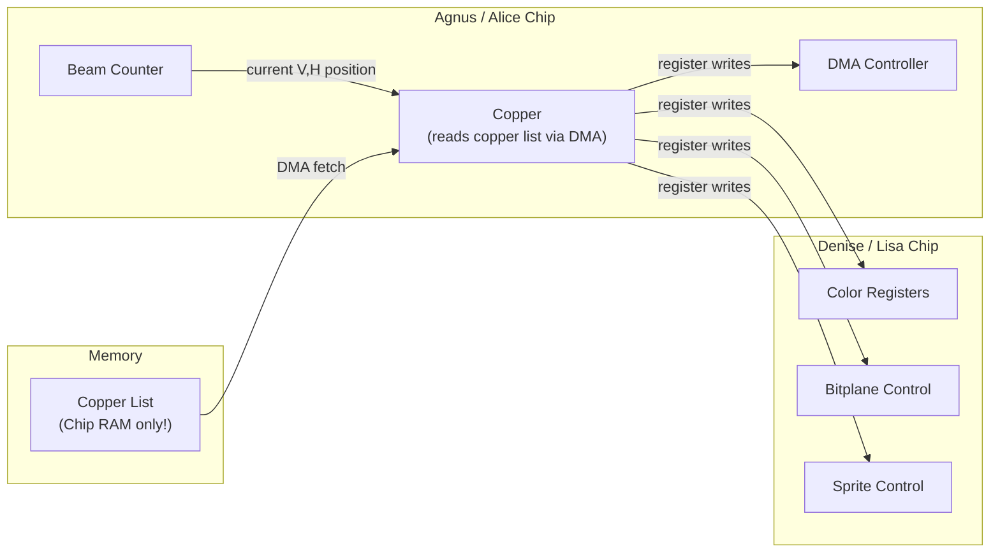

[← Home](../README.md) · [Graphics](README.md)

# Copper Programming — Deep Dive

## What Is the Copper?

The **Copper** (Co-Processor) is a tiny DMA-driven programmable engine inside Agnus (OCS/ECS) or Alice (AGA). It executes a list of instructions — the **copper list** — in lockstep with the video beam as it sweeps across the CRT. Its sole purpose is to write values to custom chip registers at precise screen positions.

Despite having only **3 instructions** and no arithmetic, branching, or memory read capability, the Copper is what gives the Amiga its distinctive visual character.

### Where It Lives in the System



**Key points:**
- The Copper reads its program from **Chip RAM** via DMA — no CPU involvement
- It writes directly to custom chip registers (the same `$DFF000–$DFF1FE` space)
- It synchronizes with the **beam counter** — it knows exactly where the electron beam is
- The CPU can modify the copper list in memory at any time; changes take effect next frame

### What the Copper Can Do

| Capability | How | Typical Use |
|---|---|---|
| **Per-line color changes** | WAIT for line → MOVE to COLORxx | Gradient skies, rainbow bars, water effects |
| **Split-screen displays** | Change bitplane pointers mid-frame | Status bar + scrolling game area |
| **Parallax scrolling** | Change BPLCON1 scroll offset at different lines | Multi-layer side-scrollers |
| **Resolution mixing** | Change BPLCON0 mid-frame | HiRes title bar + LoRes gameplay |
| **Sprite multiplexing** | Repoint sprite DMA pointers after sprite ends | 24+ sprites using 8 physical slots |
| **Palette animation** | CPU modifies copper list words each frame | Cycling water, fire, lava |
| **Display window shaping** | Change DIWSTRT/DIWSTOP | Overscan, borders, letterbox |
| **DMA scheduling** | Enable/disable bitplane/sprite DMA per line | Hide artifacts during setup |

### What the Copper Cannot Do

| Limitation | Detail |
|---|---|
| No arithmetic | Cannot add, subtract, multiply, or compare values |
| No branching/loops | Executes linearly top-to-bottom; no jumps or calls |
| No memory read | Can only WRITE to registers — cannot read anything |
| No CPU memory access | Writes only to custom chip registers (`$DFF000`+), not RAM or CIA |
| No sub-pixel timing | Horizontal resolution: 4 color clocks (~8 low-res pixels) |
| V counter wraps at 255 | PAL lines 256–311 require a double-WAIT trick |
| Chip RAM only | The copper list itself must reside in Chip RAM (DMA-accessible) |

### How the System Uses It

**AmigaOS** — `graphics.library` builds the system copper list automatically when you call `MakeVPort()` / `LoadView()`. This list sets up bitplane pointers, sprite pointers, display window, and palette for every ViewPort. User code adds instructions via `UCopList`.

**Games (system takeover)** — Disable the OS display system, point COP1LC to your own copper list, and have total control. The copper list typically sets up the display, changes colors per line, and handles sprite multiplexing.

**Demos** — Push the Copper to its limits: hundreds of color changes per frame, dynamic copper list generation, and tricks like "copper bars" (changing colors mid-scanline using horizontal WAITs).

---

## Instruction Set

The Copper has exactly **3 instructions**, each 32 bits (2 words):

### MOVE — Write to Register

```
Word 1:  RRRRRRRR R0000000     R = register address (9 bits)
Word 2:  DDDDDDDD DDDDDDDD    D = 16-bit data value

Constraints:
  - Register address must be even ($000–$1FE range)
  - Registers below COPCON threshold ($040) are protected by default
  - COPCON ($02E) bit 1 can unlock dangerous registers ($000–$03E)
```

**Example:** Set COLOR00 to red
```
  dc.w    $0180, $0F00    ; MOVE $0F00 → COLOR00 ($DFF180)
```

### WAIT — Wait for Beam Position

```
Word 1:  VVVVVVVV HHHHHHHH    V = vertical pos (8 bits), H = horizontal pos
Word 2:  MMMMMMMM MMMMMM01    M = mask bits, bit 0 = 1 (WAIT marker)

If bit 15 of word 2 is 0: also blitter-finished wait
Default mask: $FFFE (match all V and H bits except bit 0)
```

**Example:** Wait for line 100, any horizontal position
```
  dc.w    $6401, $FFFE    ; WAIT V=$64 (100), H=$01
```

### SKIP — Conditional Skip

```
Word 1:  VVVVVVVV HHHHHHHH    same format as WAIT
Word 2:  MMMMMMMM MMMMMM11    bit 0 = 1, bit 1 = 1 (SKIP marker)

If beam position ≥ specified position, skip next instruction.
```

---

## Beam Position Encoding

```
Vertical:   bits 15–8 of word 1 = V7–V0 (range 0–255)
            For PAL lines > 255, use WAIT twice or the LOF bit
Horizontal: bits 7–1 of word 1 = H8–H1 (range 0–$E2, step 2)
            Bit 0 always 0 in WAIT word 1 (distinguishes from MOVE)

Full PAL:   312 lines, but copper V wraps at 256
            Lines 0–255: V = line number
            Lines 256+: V wraps; use two WAITs:
              WAIT for V=$FF (end of first field)
              WAIT for actual line - 256
```

---

## Copper List Termination

```
; End-of-list sentinel (wait for impossible position):
  dc.w    $FFFF, $FFFE    ; WAIT $FF,$FF — never reached
```

---

## Complete Examples

### Example 1: Rainbow Bars (Color Per Scanline)

```asm
; copperlist.s — 256-color rainbow using Copper
    SECTION copperlist,DATA_C    ; MUST be in Chip RAM!

CopperList:
    ; Set up a basic display first
    dc.w    $0100, $1200    ; BPLCON0: 1 bitplane, color on
    dc.w    $0092, $0038    ; DDFSTRT
    dc.w    $0094, $00D0    ; DDFSTOP
    dc.w    $008E, $2C81    ; DIWSTRT
    dc.w    $0090, $2CC1    ; DIWSTOP

    ; Line 44 ($2C): start of visible display
    dc.w    $2C01, $FFFE    ; WAIT line 44
    dc.w    $0180, $0F00    ; COLOR00 = bright red

    dc.w    $2D01, $FFFE    ; WAIT line 45
    dc.w    $0180, $0E10    ; COLOR00 = red-orange

    dc.w    $2E01, $FFFE    ; WAIT line 46
    dc.w    $0180, $0D20    ; COLOR00 = orange

    dc.w    $2F01, $FFFE    ; WAIT line 47
    dc.w    $0180, $0C30    ; COLOR00 = yellow-orange

    ; ... repeat for each line with incrementing colors ...

    dc.w    $FFFF, $FFFE    ; end of copper list

    SECTION code,CODE

start:
    move.l  4.w,a6              ; SysBase
    lea     $DFF000,a5          ; custom chips base

    ; Install copper list:
    move.l  #CopperList,$080(a5) ; COP1LCH/COP1LCL
    move.w  #0,$088(a5)          ; COPJMP1 — strobe to restart

    ; Enable DMA:
    move.w  #$8280,$096(a5)      ; DMACON: SET + COPEN + DMAEN

.wait:
    btst    #6,$BFE001           ; left mouse button
    bne.s   .wait
    rts
```

### Example 2: Split Screen (Two Different Backgrounds)

```asm
SplitCopperList:
    ; Top half: blue background
    dc.w    $0180, $000F    ; COLOR00 = blue

    ; Wait for middle of screen (line 128)
    dc.w    $8001, $FFFE    ; WAIT line $80 = 128

    ; Bottom half: green background
    dc.w    $0180, $00F0    ; COLOR00 = green

    dc.w    $FFFF, $FFFE    ; end
```

### Example 3: Parallax Scrolling via Copper

```asm
ParallaxCopperList:
    ; Background layer: scroll position 0
    dc.w    $0102, $0000    ; BPLCON1 = no scroll

    ; Wait for horizon line
    dc.w    $6001, $FFFE    ; WAIT line 96

    ; Middle layer: scroll by 2 pixels
    dc.w    $0102, $0022    ; BPLCON1 = scroll 2px both playfields

    ; Wait for ground layer
    dc.w    $A001, $FFFE    ; WAIT line 160

    ; Ground layer: scroll by 4 pixels
    dc.w    $0102, $0044    ; BPLCON1 = scroll 4px

    dc.w    $FFFF, $FFFE
```

---

## System-Friendly Copper (via graphics.library)

For programs that coexist with the OS:

```c
#include <graphics/copper.h>

/* Allocate a user copper list: */
struct UCopList *ucl = AllocMem(sizeof(struct UCopList), MEMF_CLEAR);

/* Build instructions: */
CINIT(ucl, 100);                    /* init, max 100 instructions */
CWAIT(ucl, 0, 0);                   /* wait for top of display */
CMOVE(ucl, custom.color[0], 0x00F); /* set COLOR00 = blue */
CWAIT(ucl, 128, 0);                 /* wait for line 128 */
CMOVE(ucl, custom.color[0], 0x0F0); /* set COLOR00 = green */
CEND(ucl);                           /* end */

/* Install on ViewPort: */
vp->UCopIns = ucl;
RethinkDisplay();  /* rebuild system copper list with our additions */

/* Cleanup: */
vp->UCopIns = NULL;
RethinkDisplay();
FreeVPortCopLists(vp);
FreeCopList(ucl);
```

---

## Copper Timing

| Item | Cycles |
|---|---|
| Each Copper instruction | 4 color clocks (= 8 low-res pixels) |
| WAIT resolution (horizontal) | 4 color clocks minimum |
| Maximum instructions per line | ~112 (NTSC) / ~114 (PAL) |
| PAL visible lines | 256 (lines 44–300) |
| NTSC visible lines | 200 (lines 44–244) |

---

## Advanced Techniques

### Copper-Driven Sprite Multiplexing

Reposition sprites mid-frame to display more than 8 sprites:

```asm
    ; Display sprite 0 at Y=50
    dc.w    $3001, $FFFE          ; WAIT line 48 (before sprite)
    dc.w    $0120, SprData1>>16   ; SPR0PTH
    dc.w    $0122, SprData1&$FFFF ; SPR0PTL

    ; After sprite 0 finishes at Y=66, reuse for position Y=100
    dc.w    $6801, $FFFE          ; WAIT line 104
    dc.w    $0120, SprData2>>16   ; SPR0PTH — repoint to different data
    dc.w    $0122, SprData2&$FFFF ; SPR0PTL
```

### Copper-Driven Palette Animation

```asm
    ; Animate copper list by modifying color values each frame
    ; (DMA reads new values each frame automatically)
    ; Just update the data words in the copper list in Chip RAM
    move.w  d0, CopperList+6     ; modify the MOVE data word
```

---

## References

- HRM: *Copper* chapter — complete instruction encoding
- [copper.md](../01_hardware/ocs_a500/copper.md) — register-level reference
- [copper.md](copper.md) — graphics.library UCopList API
- [Video Signal & Timing](../01_hardware/common/video_timing.md) — beam counters, scanline anatomy, clock tree
