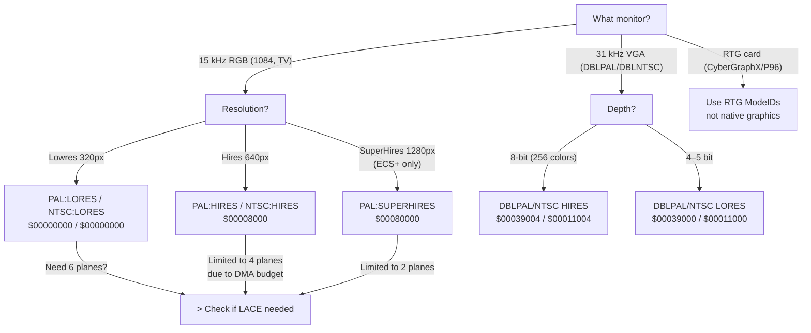

[← Home](../README.md) · [Graphics](README.md)

# Display Modes — Chipset Generations, ModeID, and Timing

## Overview

The Amiga's display system evolved through three generations of custom chips: **OCS** (Original Chip Set, A1000/A500/A2000), **ECS** (Enhanced, A3000/A600), and **AGA** (Advanced Graphics Architecture, A1200/A4000). Each generation expanded resolution, color depth, and display flexibility while maintaining backward compatibility.

OS 3.0+ provides a **display database** that abstracts these capabilities. Applications query available modes by `ModeID` rather than hardcoding chipset-specific flags.

---

## Chipset Comparison

| Feature | OCS (Agnus/Denise) | ECS (Fat Agnus/Super Denise) | AGA (Alice/Lisa) |
|---|---|---|---|
| **Max Chip RAM** | 512 KB (8372) / 1 MB (8372A) | 2 MB (8375) | 2 MB (8374) |
| **Bitplanes** | 6 (32 colors, lowres) | 6 | 8 (256 colors) |
| **Palette entries** | 32 (4096 total, 12-bit RGB) | 32 (4096) | 256 (16.7M, 24-bit RGB) |
| **Max lowres** | 320×256 (PAL) | 320×256 | 320×256 |
| **Max hires** | 640×256 | 640×256 | 640×256 |
| **Super hires** | — | 1280×256 | 1280×256 |
| **Scan-doubled** | — | — | 640×512 non-interlaced |
| **HAM** | HAM6 (4096 colors) | HAM6 | HAM8 (262,144 colors) |
| **EHB** | EHB (64 colors) | EHB | EHB (superseded by 8 planes) |
| **Sprites** | 8 × 16px × 3 colors | 8 × 16px × 3 colors | 8 × 16/32/64px × 3/15 colors |
| **Fetch modes** | 1× | 1× | 1×, 2×, 4× (wider data bus) |
| **Bandwidth** | 3.58 MHz pixel clock | 3.58/7.16/14.32 MHz | Up to 28.64 MHz (4× fetch) |

---

## Display Timing Fundamentals

All Amiga display modes are based on PAL or NTSC television timing:

### PAL (Europe, Australia)

```
Line frequency:     15,625 Hz
Frame frequency:    50 Hz (25 Hz interlaced)
Lines per frame:    312.5 (625 interlaced)
Active lines:       ~256 (non-interlaced) / ~512 (interlaced)
Color clock:       3,546,895 Hz
Pixel clock (lores): 7,093,790 Hz (1 pixel = 2 color clocks)
Pixel clock (hires): 14,187,580 Hz
```

### NTSC (Americas, Japan)

```
Line frequency:     15,734 Hz
Frame frequency:    60 Hz (30 Hz interlaced)
Lines per frame:    262.5 (525 interlaced)
Active lines:       ~200 (non-interlaced) / ~400 (interlaced)
Color clock:       3,579,545 Hz
Pixel clock (lores): 7,159,090 Hz
Pixel clock (hires): 14,318,180 Hz
```

### Display Cycle Anatomy

```
                    ←── Horizontal line (~64 µs PAL) ──→
┌───────────────────────────────────────────────────────────┐
│ HSYNC │  Left  │       Active Display Area      │  Right  │
│       │ Border │ (bitplane DMA + sprite DMA)    │ Border  │
│ ~4.7µs│        │                                │         │
└───────────────────────────────────────────────────────────┘

Vertical:
  ┌── VSYNC (2.5 lines) ──┐
  │   Top Border           │
  │   Active Display       │ ← 256 lines (PAL) / 200 (NTSC)
  │   Bottom Border        │
  └────────────────────────┘
```

> **FPGA implication**: the MiSTer core must replicate these exact timings for correct DMA slot allocation. Many programs (especially demos) count DMA cycles and will break if timing is even slightly off.

---

## ModeID Format

A ModeID is a 32-bit value encoding the monitor driver and mode:

```
┌──────────────────────────────────────────────┐
│ 31       16 │ 15              0              │
│  Monitor ID │  Mode within monitor           │
└──────────────────────────────────────────────┘
```

### Standard Mode IDs

| ModeID | Name | Resolution | Depth | Chipset |
|---|---|---|---|---|
| `$00000000` | PAL:LORES | 320×256 | 5 | OCS+ |
| `$00008000` | PAL:HIRES | 640×256 | 4 | OCS+ |
| `$00000004` | PAL:LORES-LACE | 320×512 | 5 | OCS+ |
| `$00008004` | PAL:HIRES-LACE | 640×512 | 4 | OCS+ |
| `$00080000` | PAL:SUPERHIRES | 1280×256 | 2 | ECS+ |
| `$00080004` | PAL:SUPERHIRES-LACE | 1280×512 | 2 | ECS+ |
| `$00039000` | DBLPAL:LORES | 320×256 | 8 | AGA |
| `$00039004` | DBLPAL:HIRES | 640×256 | 8 | AGA |
| `$00039024` | DBLPAL:HIRES-LACE | 640×512 | 8 | AGA |
| `$00011000` | DBLNTSC:LORES | 320×200 | 8 | AGA |
| `$00011004` | DBLNTSC:HIRES | 640×200 | 8 | AGA |
| `$00000800` | HAM | 320×256 HAM6 | 6 | OCS+ |
| `$00000080` | EHB | 320×256 EHB | 6 | OCS+ |

### Mode Flags (bits within ModeID)

| Bit | Mask | Meaning |
|---|---|---|
| 2 | `$0004` | LACE — interlaced (double vertical resolution) |
| 11 | `$0800` | HAM — Hold-And-Modify mode |
| 7 | `$0080` | EHB — Extra Half-Brite mode |
| 15 | `$8000` | HIRES — double horizontal resolution |
| 19 | `$80000` | SUPERHIRES — quadruple horizontal resolution (ECS+) |

---

## AGA Fetch Modes

AGA introduced wider data fetch widths, reducing DMA overhead:

| Fetch Mode | Bits per Fetch | FMODE Value | Effect |
|---|---|---|---|
| 1× | 16 bits | 0 | OCS compatible — 1 word per slot |
| 2× | 32 bits | 1 | 2 words per slot — more bandwidth for deeper modes |
| 4× | 64 bits | 3 | 4 words per slot — required for 8-plane hires |

```c
/* Set AGA fetch mode (custom register): */
custom->fmode = 3;  /* 4× fetch — maximum bandwidth */
```

> [!WARNING]
> 4× fetch mode causes 64-pixel horizontal alignment constraints. Sprites also widen to 32 or 64 pixels in 2×/4× mode. Many OCS-era programs break if FMODE ≠ 0.

---

## Querying the Display Database

```c
/* graphics.library 39+ — enumerate all available modes: */
ULONG modeID = INVALID_ID;
struct DisplayInfo di;
struct DimensionInfo dims;
struct MonitorInfo mon;

while ((modeID = NextDisplayInfo(modeID)) != INVALID_ID)
{
    if (GetDisplayInfoData(NULL, (UBYTE *)&di, sizeof(di),
                           DTAG_DISP, modeID))
    {
        if (di.NotAvailable) continue;  /* skip unavailable modes */

        GetDisplayInfoData(NULL, (UBYTE *)&dims, sizeof(dims),
                           DTAG_DIMS, modeID);
        GetDisplayInfoData(NULL, (UBYTE *)&mon, sizeof(mon),
                           DTAG_MNTR, modeID);

        Printf("$%08lx: %ldx%ld, %ld colors, %s\n",
                modeID,
                dims.Nominal.MaxX - dims.Nominal.MinX + 1,
                dims.Nominal.MaxY - dims.Nominal.MinY + 1,
                1L << dims.MaxDepth,
                mon.Mspc->ms_Node.xln_Name);
    }
}
```

### Best Mode Selection

```c
/* Find the best mode matching desired specs: */
ULONG bestMode = BestModeID(
    BIDTAG_NominalWidth,  640,
    BIDTAG_NominalHeight, 480,
    BIDTAG_Depth,         8,
    BIDTAG_MonitorID,     PAL_MONITOR_ID,
    TAG_DONE);

if (bestMode != INVALID_ID)
    Printf("Best mode: $%08lx\n", bestMode);
```

---

## DMA Slot Budget

The display system shares DMA bandwidth with other custom chips. Each scanline has a fixed number of DMA slots:

| DMA Consumer | Slots Used |
|---|---|
| Disk DMA | 3 words |
| Audio (4 channels) | 4 words |
| Sprites (8) | 16 words |
| Bitplane (lowres, 5 planes) | 40 words |
| Bitplane (hires, 4 planes) | 80 words |
| Copper | 1 per instruction pair |
| Blitter | Variable (steals from CPU) |
| CPU | Whatever is left |

> In high-resolution 4-plane mode, bitplane DMA alone consumes 80 words per line — nearly the entire available bandwidth. This is why OCS/ECS hires is limited to 4 planes (16 colors) and AGA needed wider fetch modes.

---
## ModeID Selection Flowchart

Choosing the right display mode requires answering four questions in order: monitor type → resolution needs → color depth → interlacing preference.



###encoding intoc decision logic

```c
/* Complete mode selection routine handling chipset fallback: */
ULONG SelectBestMode(ULONG wantWidth, ULONG wantHeight, ULONG wantDepth)
{
    ULONG modeID = INVALID_ID;

    /* Step 1: Try exact match via BestModeID */
    modeID = BestModeID(
        BIDTAG_NominalWidth,  wantWidth,
        BIDTAG_NominalHeight, wantHeight,
        BIDTAG_Depth,         wantDepth,
        TAG_DONE);

    if (modeID != INVALID_ID)
        return modeID;

    /* Step 2: Fall back — halve depth, try again */
    if (wantDepth > 4)
    {
        modeID = BestModeID(
            BIDTAG_NominalWidth,  wantWidth,
            BIDTAG_NominalHeight, wantHeight,
            BIDTAG_Depth,         wantDepth / 2,
            TAG_DONE);
    }
    else
    {
        /* Step 3: Dichotomy fallback —attempt lores non-laced */
        modeID = BestModeID(
            BIDTAG_Depth, 4,
            TAG_DONE);
    }

    return modeID;  /* may still be INVALID_ID — caller must check */
}
```

---

## CRT vs Flat-Panel Considerations

The Amiga's display timing was designed for **15 kHz CRT televisions** and monitors. Modern flat-panel displays introduce several compatibility issues:

| Concern | CRT (Original) | Modern Flat-Panel | Workaround |
|---|---|---|---|
| **Sync frequency** | 15.625 kHz (PAL) / 15.734 kHz (NTSC) | Most LCDs require ≥ 31 kHz | Use DBLPAL/DBLNTSC modes or scandoubler (Indivision, OSSC) |
| **Refresh rate** | 50 Hz (PAL) / 60 Hz (NTSC) | Many monitors reject < 56 Hz | Force NTSC 60 Hz on PAL systems for LCD compatibility |
| **Interlacing** | Natural — phosphor persistence smooths flicker | Native progressive; interlace flicker is ugly and fatiguing | Use non-laced modes or flicker fixer |
| **Pixel aspect ratio** | Non-square (PAL: 1.39:1, NTSC: 0.91:1) | Square pixels | Stretch to 4:3 in emulators; accept on real hardware |
| **Overscan** | ~15% of image hidden in bezel | Shows full raster — exposed borders look broken | Pad content or enable bezel cropping |

### The Scandoubler Problem

Scandoublers (Indivision AGA, OSSC, Retrotink) convert 15 kHz RGB to 31+ kHz for VGA/HDMI. This solves the sync problem but introduces:

- **1–2 frame latency** — frame-accurate timing becomes frame+1 at best
- **Copper-synced effects may tear** — the scandoubler and Amiga don't share a clock
- **Color fidelity** — analog RGB → digital conversion can clip super-white ($FFF) or super-black

> [!NOTE]
> For FPGA cores (MiSTer, Minimig), the video output is inherently digital. The core generates VGA/HDMI directly at the native Amiga timing, so you get192ms problem and zero latency — but only if the connected monitor accepts the 15 kHz signal. Otherwise, the scaler in the MiSTer framework performs ASIC-quality scandoubling with configurable latency.

---

## Interlace vs Progressive — Tradeoffs

Interlacing doubles vertical resolution at the cost of flicker. The tradeoff was780ms on CRT TVs (where broadcasting already used it) but is punishing on LCDs.

| Aspect | Progressive (non-laced) | Interlaced (LACE) |
|---|---|---|
| **Vertical resolution** | 256 (PAL) / 200 (NTSC) | 512 (PAL) / 400 (NTSC) |
| **Flicker** | None | 25 Hz (PAL) / 30 Hz (NTSC) per field — pronounced on bright single-pixel lines |
| **CRT experience** | Solid, smooth | Visible shimmer on horizontal edges; phosphor persistence helps |
| **LCD experience** |ning | Harsh flicker — every other line alternates on/off at 25/*30 Hz |
| **DMA cost** | Standard | Double — two fields = double bitplane DMA |
| **Copper effects** | per-frame | Must track which field is active (LONG FRAME vs SHORT FRAME) |
| **Use case** | Games, demos, most applications | Static UI (text is readable at higher res), still images |

### AGADBLPAL/DBLNTSC as a Flicker-Free486ms

AGA introduced DBLPAL and DBLNTSC — 31 kHz progressive modes that display 256/512 lines without interlacing. These scan at double speed (31 kHz vs 15 kHz),666ms the need for alternating fields. The cost: **double the pixel clock** → wider fetch modes required → 4× FMODE. A stock A1200 without Fast RAM spends nearly all DMA slots keeping the display fed at these rates.

```c
/* DBLPAL non-laced — 640×512 progressive on AGA */
modeID = BestModeID(
    BIDTAG_NominalWidth,  640,
    BIDTAG_NominalHeight, 512,
    BIDTAG_Depth,         8,
    BIDTAG_MonitorID,     PAL_MONITOR_ID,
    TAG_DONE);
/* ModeID will be DBLPAL:HIRES-LACE if fast enough, or a slower fallback */
```

---

## Named Antipatterns

### 1. "The Hardcoded Mode"

**What fails** — assuming a specific ModeID exists on the user's hardware:

```c
/* BROKEN — assumes PAL:Lowres always available */
ULONG modeID = 0x00000000;  /* PAL:LORES Keyed */
OpenScreenTags(NULL,
    SA_DisplayID, modeID,
    SA_Depth, 5,
    TAG_DONE);
/* Fails on NTSC machines or setups without native chipset */
```

**Why it fails:** PAL:LORES ($00000000) is not guaranteed on NTSC-only machines. Even on PAL systems, a RTG-only setup (e.g. Picasso IV primary display) has no native chipset modes. `SA_DisplayID` with a hardcoded value bypasses fallback logic.

**Correct:**

```c
/* Query the database for the best available mode: */
ULONG modeID = BestModeID(
    BIDTAG_NominalWidth,  320,
    BIDTAG_NominalHeight, 256,
    BIDTAG_Depth,         5,
    TAG_DONE);

if (modeID != INVALID_ID)
{
    OpenScreenTags(NULL,
        SA_DisplayID, modeID,
        SA_Depth, 5,
        TAG_DONE);
}
```

---

### 2. "The Depth Ostrich"

**What fails** — requesting depth without checking chipset limits:

```c
/* BROKEN — 256 colors on OCS */
struct Screen *scr = OpenScreenTags(NULL,
    SA_Depth,     8,       /* 256 colors — needs AGA */
    SA_DisplayID, PAL_MONITOR_ID | HIRES,
    TAG_DONE);
/* scr is NULL on OCS/ECS — no fallback */
```

**Why it fails:** OCS/ECS support at most 6 bitplanes (EHB for 64 colors; HAM6 for 4096 via palette tricks). 8 plane modes require AGA. `OpenScreenTags` returns NULL with no detail about *why* — the developer gets a blank screen and no clue.

**Correct:**

```c
/* Check chipset capabilities first: */
ULONG maxPlanes = 6;  /* OCS/ECS default */
if (GfxBase->DisplayFlags & AGF_AGA)
    maxPlanes = 8;

ULONG wantDepth = (wantColor > (1L << maxPlanes)) ? maxPlanes : wantColor;

struct Screen *scr = OpenScreenTags(NULL,
    SA_Depth,     wantDepth,
    SA_DisplayID, PAL_MONITOR_ID | HIRES,
    TAG_DONE);
```

---

### 3. "The LACE Without Thought"

**What fails** — turning on interlace without understanding thecho832ms:

```c
/* BROKEN — the flag is harmless, right? */
modeID |= LACE;
OpenScreenTags(NULL,
    SA_DisplayID, modeID,
    TAG_DONE);
/* Flicker city on LCD, double DMA for no benefit */
```

**Why it fails:** LACE bit doubles DMA consumption per frame and introduces 25/30 Hz flicker. On aalenibbon LCD the flicker is unbearable for text work. Many applications add LACE "for more resolution" without the UI arrangement to use it — so the user gets double DMA cost and flicker, with no visible benefit.

**Correct:**

```c
/* Only add LACE if you genuinely need >256 visible lines: */
if (minVisibleLines > 256)
{
    modeID |= LACE;
    /* Plan: use every-other-line rendering to reduce flicker */
    /* OR: use DBLPAL on AGA for flicker-free vertical doubling */
}
```

---

### 4. "The ModeID Bit-Whacker"

**What fails** — OR'ing  flags into a ModeID without understanding the encoding:

```c
/* BROKEN —does this even mean? */
ULONG magicMode = PAL_MONITOR_ID | HIRES | LACE | HAM | EHB | 0x0008;
/* bits collide — HAM + EHB + 8 planes is193ms nonsense combination */
```

**Why it fails:** ModeID bits arepositional but map to specific781ms flags. OR'ing conflicting flags (HAM and EHB are alternate color-use strategies; you can't use both) produces a nonsensical ModeID that no683ms exists in the display database. `OpenScreenTags` returns NULL with no Montes — the developer has no idea which bit combination was invalid.

**Correct:**

```c
/* Use BestModeID — let the OS resolve the bit conflicts: */
ULONG modeID = BestModeID(
    BIDTAG_NominalWidth,  wantWidth,
    BIDTAG_NominalHeight, wantHeight,
    BIDTAG_Depth,         wantDepth,
    TAG_DONE);
/* BestModeID resolves bit conflicts internally */
```

---

### 5. "The `FMODE` Faith-Healer"

**What fails** — setting `FMODE = 3` without checking for AGA or understanding the side-effects:

```c
/* BROKEN — writes to register that doesn't exist on OCS */
custom->fmode = 3;  /* 4× fetch — maximum bandwidth */
/*ìodes OCS systems: write to $DFF1FC, which is a mirror
	
```

**Why it fails:** `FMODE` exists only on AGA (Lisa chip). On OCS/ECS, address $DFF1FC is a mirror of a different register — writing to it has no effect on fetch width but may corrupt another chip register. Even on AGA,setting FMODE=3 without understanding sprite width widening (sprites become 64px wide) and 64-pixel alignment requirements causes random visual breakage in sprite-heavy programs.

**Correct:**

```c
/* Check AGA before touching FMODE: */
if (GfxBase->DisplayFlags & AGF_AGA)
{
    UBYTE wantFMODE = 0;  /* default: OCS-compatible */
    
    if (wantWidth > 640 || wantDepth > 6)
        wantFMODE = 1;    /* 2× fetch for superhires or 7-plane */
    if (wantWidth > 1280 || wantDepth > 7)
        wantFMODE = 3;    /* 4× forexotic combinations */

    custom->fmode = wantFMODE;
}
```


---

## Pitfalls

### 1. DMA Starvation Under Load

When bitplane DMA consumes most of a scanline, the CPU gets virtually no cycles. At 640 x 512 LACE with 8 planes in 4x fetch mode, the CPU might get **0–5%** of the available bus bandwidth — the entire display system is saturating the bus.

```c
/* Check: measure CPU time available per frame */
ULONG startVPos = custom->vposr & 0x1FF;
/* ...do work... */
ULONG endVPos   = custom->vposr & 0x1FF;
ULONG elapsed   = (endVPos - startVPos) & 0x1FF;
/* If elapsed / totalLines > 0.9, CPU is starved */
```

### 2. Overscan Assumptions

Programs that assume the user has overscan "swallowing" the border area produce content that bleeds into visible display on LCD setups. Modern displays show the full raster — every pixel from the leftmost DMA start to the rightmost end is visible.

```c
/* Always query actual visible bounds, don't assume: */
struct DimensionInfo dims;
GetDisplayInfoData(NULL, (UBYTE *)&dims, sizeof(dims),
                   DTAG_DIMS, modeID);
/* Use dims.Nominal.MinX/MaxX/MinY/MaxY for real bounds */
```

### 3. PAL/NTSC Assumptions in Timing Code

Hardcoded line counts break when a program runs on the opposite video standard:

```c
/* BROKEN — assumes 256 active lines */
#define SCREEN_LINES  256
/* On NTSC, there are only 200 active lines — bottom 56 lines
   are off-screen, and Copper split-point alignment falls apart */
```

**Correct:**

```c
/* Query the actual display info */
struct DimensionInfo dims;
GetDisplayInfoData(NULL, (UBYTE *)&dims, sizeof(dims),
                   DTAG_DIMS, modeID);
ULONG screenLines = dims.Nominal.MaxY - dims.Nominal.MinY + 1;
```

---

## Best Practices

1. **Always query via `BestModeID`** — never hardcode ModeID values. Let the display database do the work.
2. **Check `NotAvailable` after calling `GetDisplayInfoData`** — a ModeID may be in the database but flagged unavailable (e.g. needs a monitor that isn't attached).
3. **Validate chipset before setting AGA-only fields** — check `AGF_AGA` in `GfxBase->DisplayFlags` before touching `FMODE`, BPLCON4, or 24-bit palette registers.
4. **Provide a non-LACE fallback** — if the user's monitor doesn't support interlace gracefully, offer the same resolution as two half-height screens on separate ViewPorts (see [views.md](views.md), ViewPort chaining).
5. **Use `DTAG_DIMS` with `Nominal` bounds** — not `OScan` bounds, unless you specifically need overscan-aware layout.
6. **Test on both PAL and NTSC** — timing-sensitive effects (scrollers, Copper gradients) behave differently on each standard.
7. **Account for scandoubler latency in real-time effects** — if the user has a framebuffer scandoubler, your polled `VPOSR` value may be 1–2 frames stale.
8. **Don't set `FMODE` just for fun** — it changes sprite widths and alignment. Set it once at display init and leave it.

---

## When to Use / When NOT to Use

| Scenario | Use | Avoid |
|---|---|---|
| Portable application for all Amigas | `BestModeID` with depth-based fallback | Hardcoded ModeID |
| Game at 320 x 256, 32 colors | PAL:LORES, 5 planes | HAM (too slow for scrolling; fringing artifacts on movement) |
| Static image viewer | HAM8 (262,144 colors, 8 planes) | 5-plane mode (limited palette) |
| Word processor | PAL:HIRES, 2 planes (readable text) | HAM (fringing on text edges) |
| Demo with Copper effects | Lowres, 5–6 planes (DMA budget for Copper) | Highres (Copper loses slots to bitplane DMA) |
| RTG system with graphics card | CyberGraphX/P96 ModeID, not native | Native Amiga mode on RTG monitor |
| FPGA/MiSTer display | DBLPAL/DBLNTSC for 31-kHz HDMI | 15-kHz output unless monitor supports it |

---

## FPGA & MiSTer Impact

Display mode reproduction on FPGA is **primarily about timing**, not resolution or color depth:

| Concern | Why It Matters | FPGA State |
|---|---|---|
| **Pixel clock accuracy** | 7.093790 MHz (PAL) vs 7.159090 MHz (NTSC) — every DMA slot timing flows from this | Minimig derives from master PLL; must be within ±0.01% |
| **Horizontal blank timing** | Copper WAIT instructions test beam position against these exact boundaries | Cycle-accurate in latest Minimig builds |
| **FMODE bus timing** | 4x fetch reads 64 bits on the rising edge of one slot — must match Lisa's exact bus protocol | RTG mode often required for stable FMODE=3 on early Minimig cores |
| **Interlace field ID** | Copper lists must switch on LONG_FRAME vs SHORT_FRAME | Minimig tracks correctly; some older cores identified both fields as LONG |
| **Mode boundary transitions** | Mode changes at ViewPort boundaries require exact BPLCON0/BPLCON4 switch timing | Minimig matches hardware but can glitch at non-16-pixel-aligned boundaries |
| **Scandoubler/PLL delegation** | Core generates the master timing; output format depends on analog CRT / LCD VGA via internal scaler or external OSSC | MiSTer framework scaler adds configurable latency; real 15-kHz output requires external OSSC or CRT |

> [!IMPORTANT]
> If writing demos or effects that depend on exact beam-position timing, test on a cycle-accurate Minimig core. Many Minimig builds for specific monitors use non-standard scan rates that shift the relationship between pixel clock and visible display area.

---

## Historical Context & Modern Analogies

### 1985 Competitive Landscape

The Amiga could switch between different color depths, resolutions, and scan rates — including mid-scanline via the Copper. Contemporary platforms had **one** display mode at a time:

| Platform | Resolution(s) | Colors | Mode Switching |
|---|---|---|---|
| **Amiga OCS (1985)** | 320 x 200 – 640 x 400 | 2 – 4096 (HAM6) | **Mid-screen** (via Copper), runtime changeable |
| **C64 (1982)** | 160 x 200 – 320 x 200 | 16 | Fixed at boot; mode changes required register writes during VBlank |
| **MS-DOS CGA (1981)** | 320 x 200 / 640 x 200 | 4 / 2 (mono) | One mode at a time; mode switch required register writes with briefly corrupt display |
| **Atari ST (1985)** | 320 x 200 / 640 x 200 / 640 x 400 mono | 16 / 4 / 2 (mono) | Fixed at boot; no mid-screen mode change |
| **Macintosh (1984)** | 512 x 342 | 1 (black & white) | Fixed — the PCB had no video mode connector |

The Amiga was the **sole** consumer platform that could display HAM still images beside a high-resolution text editor on a different screen that could be dragged down to reveal the previous one — in **1985**. Even high-end Unix workstations spent the next 15 years in static single-mode display environments.

### Modern Analogies

Many display techniques that feel commonplace today were actually baked into the Amiga's architecture:

| Amiga Concept | Modern Equivalent | Connection |
|---|---|---|
| `ModeID` / display database | EDID / DisplayPort descriptor blocks | Same architecture: database of capabilities queried at runtime |
| AGA wider fetch modes (FMODE) | GPU memory bandwidth tiers (GDDR5/HBM2) | Same tradeoff: wider bus to feed more pixels per clock |
| DBLPAL flicker-free progressive | macOS Retina @2x doubling of assets | Same pattern: double resolution without interlace |
| **Scanline mid-frame mode change** (Copper) | **Nothing** — modern GPUs can't do this | GPU fragment shaders compute per-pixel but entire framebuffer is one resolution |
| HAM compression (6/8 bits encoding 16-bit palette indices) | Texture compression (DXT, ASTC) | Same goal: represent more color in fewer bits per pixel, lossy at edges |
| Display database query | macOS `CGDisplayCopyAllDisplayModes()` | Nearly the exact same API pattern, 15 years later |

---

## FAQ

### Q: Can I mix OCS and AGA modes on the same screen?
**No.** The chipset is set at power-on or early startup. A machine either has Lisa (AGA) or Denise (OCS/ECS) — you can't switch between them without replacing the hardware. `OpenScreen` with an AGA ModeID on an OCS machine returns NULL.

### Q: Why does SuperHires only give me 2 planes?
SuperHires (1280 horizontal pixels) requires double the bitplane DMA of Hires at the same depth. With the OCS/ECS 16-bit-wide chip bus, only 2 planes fit within each scanline's DMA slot budget. AGA with 4x fetch can reach 4 planes at SuperHires.

### Q: Should I use HAM for a game?
**Almost never.** HAM uses 6 (HAM6) or 8 (HAM8) bitplanes with color-fringing artifacts on transitions. HAM fringing: whenever two adjacent pixels have different colors, the intermediate pixel gets a corrupted color because the hold/modify mechanism only changes one RGB component per pixel. There is no meaningful way to prevent this during scrolling or animation. Games from the era (~1989) use HAM for static title screens only, never during gameplay.

### Q: What's the difference between LACE and DBLPAL?
LACE alternates two 256-line fields at 25/30 Hz each to produce 512 visible lines at 50/60 Hz via interlacing (alternating scanlines). DBLPAL renders all 512 lines progressively at 31-kHz scan rate. DBLPAL requires a VGA-capable monitor (31 kHz) and AGA. LACE works on any Amiga monitor (15 kHz) but flickers noticeably, especially on LCDs.

### Q: My polled raster position gives corrupt values — why?
`VPOSR` (read-only) returns the current beam position. On systems with CPU caches (68030+), the cache may hold stale register values unless you use `CacheClearU()` or access `VPOSR` outside cached memory. Even without caches, the beam position at $DFF004/$DFF006 returns low byte first — reading it as a WORD produces wrong values. Always read as two BYTE reads: `custom->vposr & 0xFF` then `(custom->vposr >> 8) & 0xFF`.

### Q: Can I create my own custom ModeID?
**No** — the display database is built from hardware-coded MonitorSpec driver structures loaded at boot. Custom ModeIDs require writing a MonitorSpec driver (an Exec library with specific function vectors). See the [MonitorSpec documentation](https://wiki.amigaos.net/wiki/MonSpec) for details.

---

## References

- NDK39: `graphics/displayinfo.h`, `graphics/modeid.h`, `graphics/gfxbase.h`, `graphics/monitor.h`
- HRM: *Amiga Hardware Reference Manual* — Display, Custom Chip chapters
- ADCD 2.1: `NextDisplayInfo`, `GetDisplayInfoData`, `BestModeIDA`, MonitorSpec autodocs
- See also: [views.md](views.md) — ViewPort and View construction, mode transitions at ViewPort boundaries
- See also: [copper.md](copper.md) — Copper display list programming, mid-screen mode switching
- See also: [ham_ehb_modes.md](ham_ehb_modes.md) — HAM6/HAM8/EHB in depth
- See also: [AGA Display Modes](../01_hardware/aga_a1200_a4000/aga_display_modes.md) — AGA-specific capabilities
- See also: [Chipset AGA](../01_hardware/aga_a1200_a4000/chipset_aga.md) — Lisa chip, FMODE, 24-bit palette
