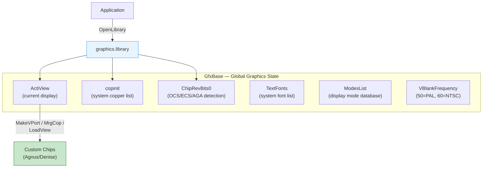
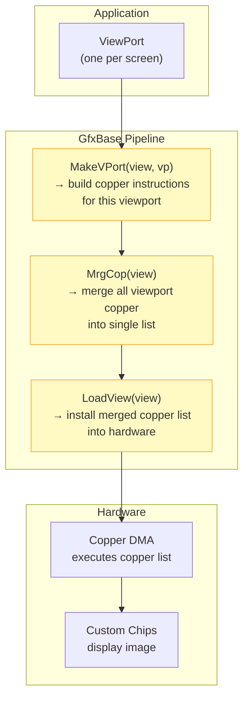

[← Home](../README.md) · [Graphics](README.md)

# GfxBase — Graphics Library Global State

## Overview

`graphics.library` is the core drawing library in AmigaOS. It manages all display output, drawing primitives, font rendering, and custom chip programming. `GfxBase` — the library base — contains the system's display state, chip revision info, system copper lists, and the display mode database.



---

## struct GfxBase (Key Fields)

```c
/* graphics/gfxbase.h — NDK39 */
struct GfxBase {
    struct Library   LibNode;
    struct View     *ActiView;        /* currently active View */
    struct copinit   *copinit;        /* system copper list initialization */
    LONG            *cia;             /* CIA base (deprecated) */
    LONG            *blitter;         /* blitter base (deprecated) */
    UWORD           *LOFlist;         /* long-frame copper list pointer */
    UWORD           *SHFlist;         /* short-frame copper list (interlace) */
    struct bltnode  *blthd;           /* blitter queue head */
    struct bltnode  *blttl;           /* blitter queue tail */
    struct bltnode  *bsblthd;
    struct bltnode  *bsblttl;
    struct Interrupt vbsrv;           /* vertical blank server chain */
    struct Interrupt timsrv;          /* timer server chain */
    struct Interrupt bltsrv;          /* blitter-done server chain */
    struct List      TextFonts;       /* system font list */
    struct TextFont *DefaultFont;     /* default system font (topaz.8) */
    UWORD           Modes;            /* current display mode bits */
    BYTE            VBlankFrequency;  /* 50 (PAL) or 60 (NTSC) */
    BYTE            DisplayFlags;     /* PAL/NTSC/GENLOCK flags */
    UWORD           NormalDisplayColumns;  /* default display width */
    UWORD           NormalDisplayRows;     /* default display height */
    UWORD           MaxDisplayColumn;
    UWORD           MaxDisplayRow;
    UWORD           ChipRevBits0;     /* chip revision flags — see below */
    /* ... many more fields ... */
    struct MonitorSpec *monitor_id;
    struct List      MonitorList;     /* installed monitors */
    struct List      ModesList;       /* display mode database */
    UBYTE            MemType;         /* memory type flags */
    /* OS 3.x additions */
    APTR             ChunkyToPlanarPtr; /* c2p conversion routine pointer */
};
```

---

## Chip Revision Detection

The `ChipRevBits0` field identifies which chipset generation is present — essential for FPGA cores that need to report their emulated chipset level:

```c
/* graphics/gfxbase.h */
#define GFXB_BIG_BLITS   0   /* big blitter (ECS Agnus — 1MB chip) */
#define GFXB_HR_AGNUS    0   /* hi-res Agnus (same bit as above) */
#define GFXB_HR_DENISE   1   /* ECS Denise (SuperHires, scan-doubling) */
#define GFXB_AA_ALICE    2   /* AGA Alice (A1200/A4000) */
#define GFXB_AA_LISA     3   /* AGA Lisa (A1200/A4000) */
#define GFXB_AA_MLISA    4   /* AGA modified Lisa */

#define GFXF_BIG_BLITS  (1<<0)
#define GFXF_HR_AGNUS   (1<<0)
#define GFXF_HR_DENISE  (1<<1)
#define GFXF_AA_ALICE   (1<<2)
#define GFXF_AA_LISA    (1<<3)
#define GFXF_AA_MLISA   (1<<4)
```

### Detecting the Chipset

```c
struct GfxBase *GfxBase = (struct GfxBase *)
    OpenLibrary("graphics.library", 0);

if (GfxBase->ChipRevBits0 & GFXF_AA_ALICE)
{
    /* AGA chipset (A1200/A4000) */
    /* 8-bit planar, 256 colors, 24-bit palette */
}
else if (GfxBase->ChipRevBits0 & GFXF_HR_DENISE)
{
    /* ECS chipset (A3000/A600) */
    /* SuperHires, productivity modes, scan-doubler */
}
else if (GfxBase->ChipRevBits0 & GFXF_HR_AGNUS)
{
    /* ECS Agnus with OCS Denise (A500+/A2000 upgraded) */
    /* 1 MB Chip RAM support, but no ECS display features */
}
else
{
    /* OCS chipset (original A500/A1000/A2000) */
    /* 512 KB Chip RAM, 4096 color palette */
}
```

| Bits Set | Chipset | Systems |
|---|---|---|
| None | OCS | A500, A1000, A2000 |
| `HR_AGNUS` | ECS Agnus only | A500+ (Fat Agnus upgrade) |
| `HR_AGNUS + HR_DENISE` | Full ECS | A600, A3000 |
| `AA_ALICE + AA_LISA` | AGA | A1200, A4000, CD32 |

---

## PAL vs NTSC Detection

```c
if (GfxBase->VBlankFrequency == 50)
{
    /* PAL: 50 Hz, 312 lines/field, 625 total (interlaced) */
    /* Standard resolution: 320×256 */
}
else /* 60 */
{
    /* NTSC: 60 Hz, 262 lines/field, 525 total (interlaced) */
    /* Standard resolution: 320×200 */
}

/* DisplayFlags also has the info: */
if (GfxBase->DisplayFlags & PAL)   /* PAL system */
if (GfxBase->DisplayFlags & NTSC)  /* NTSC system */
```

---

## The Display Pipeline



### Key Display Functions

| Function | Purpose |
|---|---|
| `MakeVPort(view, vp)` | Generate copper instructions for one ViewPort |
| `MrgCop(view)` | Merge all ViewPort copper lists into unified system list |
| `LoadView(view)` | Install the merged copper list into the hardware (LOF/SHF) |
| `WaitTOF()` | Wait for top of frame (vertical blank) — used to sync display updates |
| `WaitBOVP(vp)` | Wait for the beam to pass a specific ViewPort |

---

## Blitter Queue

GfxBase maintains a queue of pending Blitter operations (`blthd`/`blttl`). When an application calls `BltBitMap`, the operation may be queued and executed asynchronously by the Blitter interrupt:

```c
/* Start a blit — may be queued: */
BltBitMap(srcBM, sx, sy, dstBM, dx, dy, w, h, 0xC0, 0xFF, NULL);

/* Wait for ALL pending blits to complete: */
WaitBlit();

/* Or use OwnBlitter/DisownBlitter for exclusive access: */
OwnBlitter();     /* blocks until blitter is free, then locks it */
/* ... direct blitter register access ... */
DisownBlitter();  /* release for other tasks */
```

---

## System Fonts

```c
/* Get the default system font: */
struct TextFont *sysFont = GfxBase->DefaultFont;
Printf("System font: %s, size %d\n",
       sysFont->tf_Message.mn_Node.ln_Name,
       sysFont->tf_YSize);

/* Enumerate all loaded fonts: */
struct Node *node;
for (node = GfxBase->TextFonts.lh_Head;
     node->ln_Succ;
     node = node->ln_Succ)
{
    Printf("Font: %s\n", node->ln_Name);
}
```

---

## References

- NDK39: `graphics/gfxbase.h`
- ADCD 2.1: graphics.library autodocs
- See also: [views.md](views.md) — View/ViewPort construction
- See also: [copper.md](copper.md) — Copper coprocessor
- See also: [display_modes.md](display_modes.md) — display mode database
