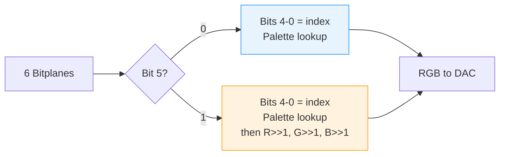
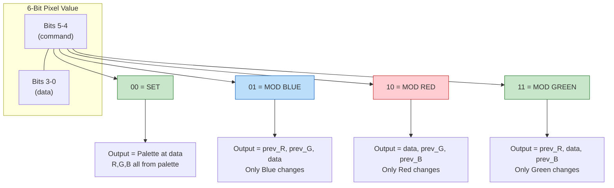
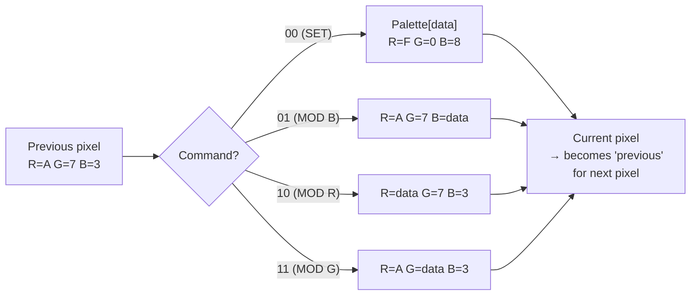
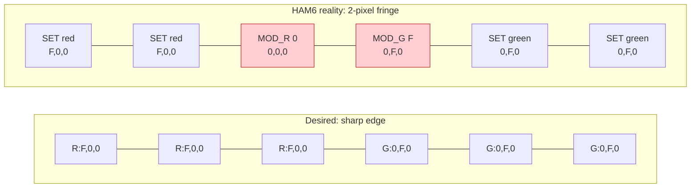
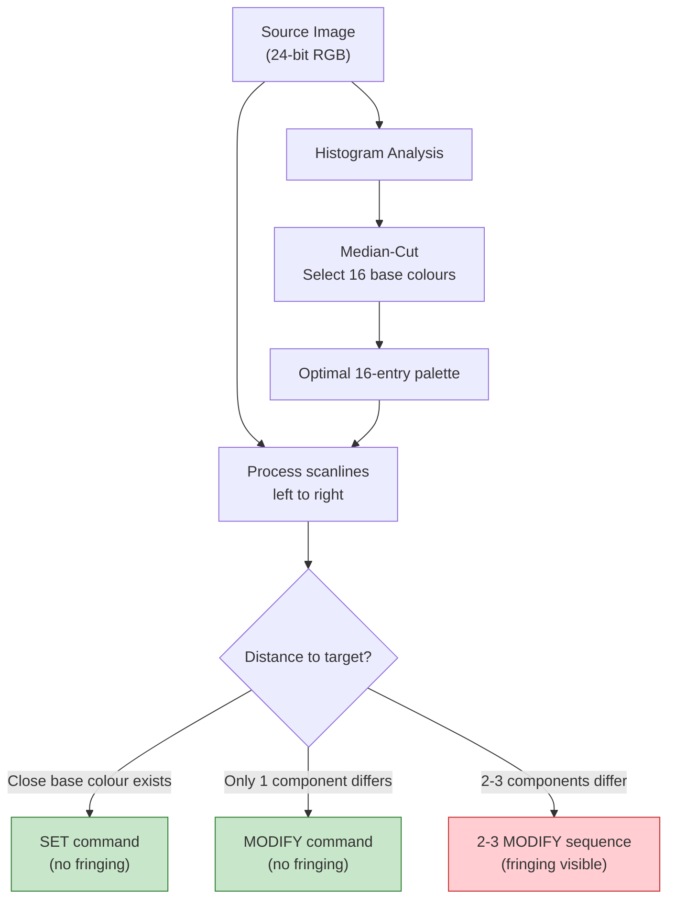
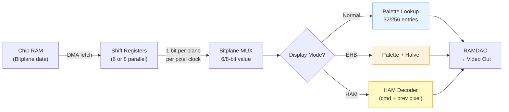

[← Home](../README.md) · [Graphics](README.md)

# HAM and EHB — Special Display Modes

## Overview

The Amiga offers two unique display modes that squeeze many more colours from limited bitplane hardware: **EHB** (Extra Half-Brite) and **HAM** (Hold-And-Modify). These modes have no direct equivalent on other platforms and are critical for understanding Amiga graphics capability and for FPGA implementation.

---

## EHB — Extra Half-Brite (OCS/ECS/AGA)

### How It Works

Uses **6 bitplanes** (64 possible values):
- Bitplane values 0–31: index into the 32-colour palette normally
- Bitplane values 32–63: display the colour from register (value − 32) at **half brightness** (all RGB components shifted right by 1)



```
Example pixel value = 37 (binary: 100101):
  Bit 5 = 1 → half-brite
  Bits 4-0 = 00101 = palette index 5
  Output colour = palette[5] >> 1 (each R,G,B component halved)

Example pixel value = 5 (binary: 000101):
  Bit 5 = 0 → normal
  Bits 4-0 = 00101 = palette index 5
  Output colour = palette[5] (full brightness)
```

### Programming EHB

```c
/* EHB is automatic when using 6 bitplanes without HAM flag: */
struct Screen *scr = OpenScreenTags(NULL,
    SA_Width,     320,
    SA_Height,    256,
    SA_Depth,     6,              /* 6 planes → EHB mode */
    SA_DisplayID, EXTRAHALFBRITE_KEY,
    TAG_DONE);

/* Set the 32 base colours: */
ULONG colours32[32 * 3 + 2];
colours32[0] = 32 << 16;  /* count = 32, first = 0 */
/* ... fill RGB values ... */
colours32[32 * 3 + 1] = 0;  /* terminator */
LoadRGB32(&scr->ViewPort, colours32);

/* Pixels 0–31 use base palette directly.
   Pixels 32–63 are automatically half-brightness versions.
   No need to set colours 32–63 — hardware does it. */
```

---

## HAM6 — Hold-And-Modify (OCS/ECS/AGA)

### Pixel Encoding

Uses **6 bitplanes**. Each pixel's 6 bits are split into a 2-bit command and 4-bit data:



### How the Hardware Decodes — Per-Pixel Pipeline



> [!IMPORTANT]
> **Each scanline starts fresh** — the first pixel of each line has no "previous pixel" to modify. The hardware resets to the background colour (register 0) at the start of each line. This is why HAM images often have a visible "colour ramp" at the left edge.

### Practical Example — Encoding a HAM6 Scanline

Suppose we want to display these colours on a scanline:

```
Target:  RGB(A,7,3) → RGB(A,7,F) → RGB(F,7,F) → RGB(F,0,8)

Encoding:
  Pixel 0: 00 xxxx (SET palette[n] = A,7,3)  → SET to base colour
  Pixel 1: 01 1111 (MOD BLUE = F)            → A,7,3 → A,7,F  ✓
  Pixel 2: 10 1111 (MOD RED = F)              → A,7,F → F,7,F  ✓
  Pixel 3: 00 xxxx (SET palette[m] = F,0,8)  → SET to nearest base colour

Note: pixel 3 needs to change ALL THREE components.
Since HAM can only modify ONE component per pixel, we must either:
  a) Use 3 pixels to transition (changing R, G, B separately) → "fringing"
  b) Pick a base palette colour that's close to the target → "SET"
```

### The Fringing Problem



Pixels H3 and H4 are **fringing artifacts** — wrong colours visible during the transition. The encoder must change R, G, B individually (one per pixel), so sharp multi-component transitions always produce visible intermediate colours.

The encoder (usually offline) optimises palette choice and pixel encoding to minimise fringing. Common strategies:
- Choose 16 base palette colours via **median-cut** from the image histogram
- Use SET pixels at strong edges
- Sequence MODIFY commands to approach target in fewest steps



### Programming HAM6 from C

```c
/* Open a HAM6 screen: */
struct Screen *scr = OpenScreenTags(NULL,
    SA_Width,     320,
    SA_Height,    256,
    SA_Depth,     6,
    SA_DisplayID, HAM_KEY,
    TAG_DONE);

/* Set the 16 base palette colours: */
ULONG hamPalette[16 * 3 + 2];
hamPalette[0] = 16 << 16;  /* count=16, first=0 */
/* Palette entry 0: R=$A0, G=$70, B=$30 (12-bit values scaled to 32-bit) */
hamPalette[1] = 0xA0000000;  /* R */
hamPalette[2] = 0x70000000;  /* G */
hamPalette[3] = 0x30000000;  /* B */
/* ... fill remaining 15 entries ... */
hamPalette[16 * 3 + 1] = 0;
LoadRGB32(&scr->ViewPort, hamPalette);

/* Write pixels directly to bitplane data: */
/* Each pixel = 6 bits across 6 bitplanes */
struct BitMap *bm = scr->RastPort.BitMap;
UBYTE *plane[6];
for (int p = 0; p < 6; p++)
    plane[p] = bm->Planes[p];

/* Encode pixel at position x on line y: */
void SetHAMPixel(UBYTE *plane[], int x, int y, UBYTE cmd, UBYTE data)
{
    int byteOffset = y * 40 + (x >> 3);  /* 40 bytes/line for 320px */
    int bitPos = 7 - (x & 7);
    UBYTE val = (cmd << 4) | (data & 0x0F);  /* 6-bit HAM value */

    for (int p = 0; p < 6; p++)
    {
        if (val & (1 << p))
            plane[p][byteOffset] |= (1 << bitPos);
        else
            plane[p][byteOffset] &= ~(1 << bitPos);
    }
}

/* Example: SET colour 5, then modify blue to $F: */
SetHAMPixel(plane, 0, 0, 0x00, 5);    /* 00 0101 = SET palette[5] */
SetHAMPixel(plane, 1, 0, 0x01, 0xF);  /* 01 1111 = MOD BLUE = $F */
```

---

## HAM8 — AGA Enhanced HAM

### Pixel Encoding

Uses **8 bitplanes**. Same principle, wider data:

| Bits 7–6 | Meaning | Bits 5–0 |
|---|---|---|
| `00` | **SET** — palette index | 6-bit index (0–63 of 256-entry palette) |
| `01` | **MODIFY BLUE** | 6-bit blue value (0–63) |
| `10` | **MODIFY RED** | 6-bit red value (0–63) |
| `11` | **MODIFY GREEN** | 6-bit green value (0–63) |

### Improvements over HAM6

| Aspect | HAM6 | HAM8 |
|---|---|---|
| Base palette entries | 16 | 64 |
| Colour component precision | 4-bit (16 levels) | 6-bit (64 levels) |
| Total colour space | 12-bit (4,096) | 18-bit (262,144) |
| Fringing severity | Severe | Mild (more base colours to SET from) |
| Memory per 320×256 screen | 6 × 40 × 256 = 60 KB | 8 × 40 × 256 = 80 KB |

### HAM8 Palette Setup

```c
/* HAM8 uses 64 of the 256 AGA palette entries as base colours: */
struct Screen *scr = OpenScreenTags(NULL,
    SA_Width,     320,
    SA_Height,    256,
    SA_Depth,     8,
    SA_DisplayID, HAM_KEY,  /* HAM flag + 8 planes = HAM8 on AGA */
    TAG_DONE);

/* Load all 256 palette entries (HAM8 uses entries 0–63 as base): */
ULONG palette[256 * 3 + 2];
palette[0] = 256 << 16;  /* count=256, first=0 */
/* AGA palette is 24-bit — each component is 8 bits stored in upper byte: */
palette[1] = 0xFF000000;  /* Entry 0 red = $FF */
palette[2] = 0x00000000;  /* Entry 0 green = $00 */
palette[3] = 0x00000000;  /* Entry 0 blue = $00 */
/* ... fill 255 more entries ... */
palette[256 * 3 + 1] = 0;
LoadRGB32(&scr->ViewPort, palette);
```

---

## DMA Timing — How Bitplane Data Reaches the Display

### Bitplane-to-Pixel Pipeline



### Scanline DMA Fetch Cycle

The display hardware fetches bitplane data in DMA slots during each scanline:

```
One scanline (~64 µs PAL):
┌────────┬──────────────────────────────────────────┬────────┐
│ HBlank │          Active Display Area             │ HBlank │
│        │← DMA fetch window (variable width) →     │        │
└────────┴──────────────────────────────────────────┴────────┘

DMA slots consumed per bitplane per lowres line:
  1 bitplane  = 8 DMA words (16 bytes)
  6 bitplanes = 48 DMA words  (HAM6/EHB)
  8 bitplanes = 64 DMA words  (HAM8)
```

### HAM Decode Pipeline (Hardware)

The HAM decoder operates **one pixel clock behind** the bitplane data output:

```
Bitplane DMA → Bitplane shift registers → HAM decoder → Colour register → DAC → Video out
                                          ↑
                                    1-pixel delay
                                    (needs previous pixel's colour)
```

For FPGA implementation, the HAM decoder is a simple combinational circuit:

```verilog
// HAM6 decoder (simplified)
always @(*) begin
    case (pixel_data[5:4])
        2'b00: begin  // SET
            out_r = palette[pixel_data[3:0]][11:8];
            out_g = palette[pixel_data[3:0]][7:4];
            out_b = palette[pixel_data[3:0]][3:0];
        end
        2'b01: begin  // MODIFY BLUE
            out_r = prev_r;
            out_g = prev_g;
            out_b = pixel_data[3:0];
        end
        2'b10: begin  // MODIFY RED
            out_r = pixel_data[3:0];
            out_g = prev_g;
            out_b = prev_b;
        end
        2'b11: begin  // MODIFY GREEN
            out_r = prev_r;
            out_g = pixel_data[3:0];
            out_b = prev_b;
        end
    endcase
end
```

---

## Standard Palette Modes — For Comparison

### Setting Palette Colours (Non-HAM)

```c
/* OS 3.0+ — 24-bit precision (AGA): */
ULONG colours[3 * 3 + 2];  /* 3 colours */
colours[0] = 3 << 16;  /* count=3, first entry=0 */
/* Entry 0: black */
colours[1] = 0x00000000; colours[2] = 0x00000000; colours[3] = 0x00000000;
/* Entry 1: bright red */
colours[4] = 0xFF000000; colours[5] = 0x00000000; colours[6] = 0x00000000;
/* Entry 2: pure blue */
colours[7] = 0x00000000; colours[8] = 0x00000000; colours[9] = 0xFF000000;
colours[10] = 0;  /* terminator */
LoadRGB32(vp, colours);

/* OCS/ECS — 12-bit precision: */
UWORD oldPalette[] = { 0x000, 0xF00, 0x00F };  /* 4 bits per channel */
LoadRGB4(vp, oldPalette, 3);

/* Direct hardware (bypass OS — for demos/games): */
custom->color[0] = 0x000;   /* $DFF180: COLOR00 (background) */
custom->color[1] = 0xF00;   /* $DFF182: COLOR01 */
custom->color[2] = 0x00F;   /* $DFF184: COLOR02 */
/* AGA: extra bits via BPLCON3 bank select */
```

### Colour Cycling (Palette Animation)

```c
/* Rotate palette entries for animation — common demo/game technique: */
void CyclePalette(struct ViewPort *vp, int first, int last)
{
    ULONG saved[3];  /* save last entry */
    GetRGB32(vp->ColorMap, last, 1, saved);

    /* Shift all entries up by one: */
    for (int i = last; i > first; i--)
    {
        ULONG rgb[3];
        GetRGB32(vp->ColorMap, i - 1, 1, rgb);
        SetRGB32(vp, i, rgb[0], rgb[1], rgb[2]);
    }

    /* Wrap last to first: */
    SetRGB32(vp, first, saved[0], saved[1], saved[2]);

    /* Force display update: */
    MakeVPort(GfxBase->ActiView, vp);
    MrgCop(GfxBase->ActiView);
    LoadView(GfxBase->ActiView);
}
```

> [!TIP]
> Colour cycling is extremely cheap — only palette registers change, not pixel data. A single `SetRGB32` call costs a few microseconds vs redrawing the entire screen. This is why palette animation was so popular on the Amiga.

---

## Comparison Table

| Feature | Normal (5-plane) | EHB | HAM6 | HAM8 |
|---|---|---|---|---|
| Bitplanes | 5 | 6 | 6 | 8 |
| Chipset | OCS/ECS/AGA | OCS/ECS/AGA | OCS/ECS/AGA | AGA only |
| Programmable colours | 32 | 32 | 16 | 64 |
| Total on-screen | 32 | 64 | 4,096 | 262,144 |
| Colour depth | 12-bit (OCS) / 24-bit (AGA) | 12/24-bit | 12-bit | 18-bit |
| Fringing | None | None | Significant | Mild |
| Good for | GUI, games | GUI with shadows | Photos, static art | Photos, video stills |
| Bad for | Photo-realism | Limited palette control | Animation, scrolling | Memory: 80 KB/frame |
| DMA words/line (lores) | 40 | 48 | 48 | 64 |

---

## References

- HRM: *Display modes* chapter — HAM decode logic
- NDK39: `graphics/displayinfo.h` — `HAM_KEY`, `EXTRAHALFBRITE_KEY`
- See also: [display_modes.md](display_modes.md) — ModeID system and chipset comparison
- See also: [copper_programming.md](copper_programming.md) — Copper-driven palette tricks
- See also: [bitmap.md](bitmap.md) — bitplane memory layout
