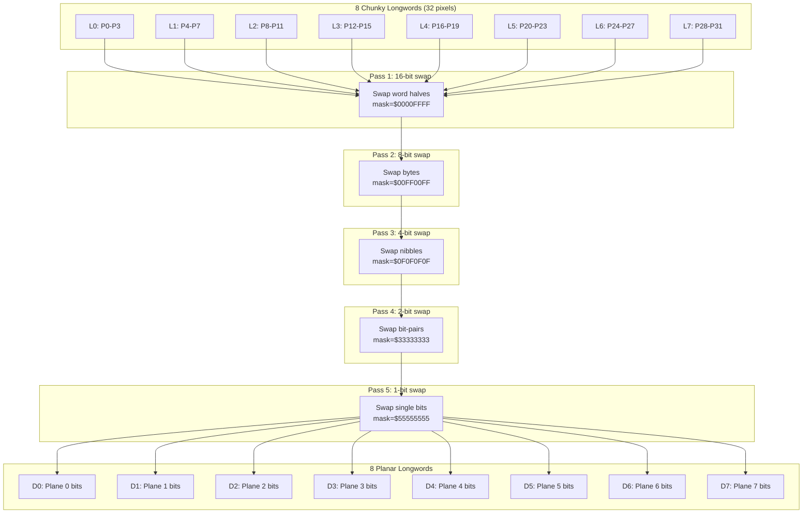
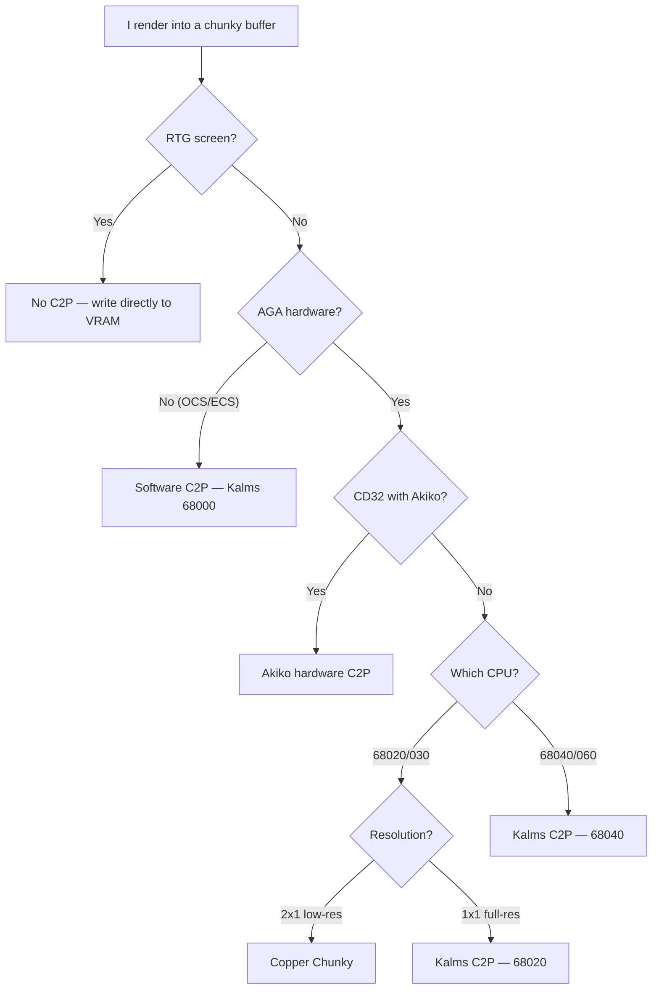

[← Home](../README.md) · [Graphics](README.md)

# Pixel Format Conversion — Chunky ↔ Planar and Beyond

## Overview

The Amiga's custom chipset displays graphics in **planar** format — each bitplane is a separate contiguous block of memory where pixel information is spread across layers. This was brilliant engineering in 1985: it matched the hardware DMA streaming pattern perfectly, made bandwidth scale linearly with color depth, and enabled Copper palette effects that cost zero memory writes.

But every rendering algorithm developed since 1990 — 3D rasterization, texture mapping, image decompression, PC game ports — produces output in **chunky** format: one byte per pixel, all color information packed contiguously. Converting chunky output to planar display is the single most CPU-intensive bottleneck in Amiga graphics. It consumed thousands of programmer-hours across the demoscene and directly determined which games could run at playable framerates.

On a 7 MHz 68000 with a 16-bit Chip RAM bus, a naive C2P conversion of a single 320×256 frame takes **over one second** — roughly 0.9 FPS. The demoscene's solution — a bit-level butterfly network in hand-tuned assembly — achieves the same conversion in **~35 milliseconds**, a 30× improvement that made 3D gaming possible on stock hardware.

This article covers every known approach — why planar exists, why the conversion is expensive (it is a 90° bit matrix transposition), and how each solution works from naive loops through the Kalms butterfly to Copper Chunky tricks, Akiko hardware, and RTG bypass. It also connects the Amiga's planar/chunky duality to modern concepts every developer already knows: SoA vs AoS layout, GPU texture swizzle, and SIMD transposition.

> [!TIP] **TL;DR — Which C2P should I use?**
>
> | Your Hardware | Use This | Expect |
> |---|---|---|
> | CD32 | Akiko hardware (register `$B80030`) | ~33× baseline, 50% CPU free |
> | A1200 stock (68020), 2×1 low-res | Copper Chunky | ~23× baseline, simplest code |
> | A1200 stock (68020), 1×1 full-res | Kalms merge (68020) | ~33× baseline, ~28 FPS |
> | A4000 / 68030 accelerated | Kalms merge (68030) | ~64× baseline |
> | 68040/060 accelerated | Kalms merge (skip Blitter!) | ~128× baseline |
> | MiSTer FPGA / WinUAE / RTG card | No C2P — use `uaegfx` chunky VRAM | Infinite |
> | Prototyping or quick port | `WriteChunkyPixels()` (OS API) | ~20–31× baseline, zero asm |
>
> All speeds relative to naive C2P baseline: **~70,000 pixels/sec** on 68020 @ 14 MHz (0.9 FPS for 320×256×8bpl).

> [!NOTE]
> The Akiko hardware article covers the CD32's dedicated C2P register interface. This article covers the *algorithm theory* that applies to every Amiga model, and the broader data-layout concepts that connect the Amiga to modern computing.
>
> See: [Akiko — CD32 C2P Hardware](../01_hardware/aga_a1200_a4000/akiko_cd32.md)

---

## The Core Problem — Why This Exists

### The Hardware Constraint (1985)

The Amiga's display DMA engine (Agnus in OCS, Alice in AGA) fetches pixel data from Chip RAM and feeds it to the video encoder in real time, synchronized to the electron beam. The DMA controller fetches 16-bit words on a fixed schedule and shifts bits outward to the video DAC. Each 16-bit word contains 16 bits for 16 adjacent pixels — all from the **same** bitplane. Only after an entire scanline of plane 0 is fetched does the DMA move to plane 1.

This is a **Structure of Arrays (SoA)** access pattern: the hardware streams one field (one bit) across many elements (pixels) sequentially. Planar layout is the natural storage for this — it puts every byte the DMA needs next at consecutive addresses.

### In Memory — Side by Side

Here are the same 8 pixels (16 colors, 4 bpp) stored both ways:

**Chunky — packed pixel:** each pixel is a complete color value. Multiple pixels are packed into bytes at the smallest power-of-2 bit width that fits the color depth. For 16 colors (4 bpp), each byte holds 2 pixels as **nibbles** (4-bit halves).

```
Address:  $0000     $0001     $0002     $0003
         ┌────┬────┐┌────┬────┐┌────┬────┐┌────┬────┐
  Byte   │$A3      ││$7F      ││$10      ││$6C      │
         └────┴────┘└────┴────┘└────┴────┘└────┴────┘
Nibble:   hi   lo    hi   lo    hi   lo    hi   lo
            $A   $3    $7   $F    $1   $0    $6   $C
Pixel:     p0   p1    p2   p3    p4   p5    p6   p7
```

Reading pixel 4: one read at `$0002`, extract high nibble → `$1`.

**Planar — 4 bitplanes:** each plane is a **separate contiguous memory block**. Planes live at different base addresses.

```
Plane 0 base = $08000             Plane 2 base = $10000
   Addr    Byte                         Addr    Byte
  $08000 ┌────────┐                    $10000 ┌────────┐
         │  $4D   │ ← bit0 of p0–p7           │  $E1   │ ← bit2 of p0–p7
         └────────┘                    $10001 └────────┘
  $08001 ┌────────┐                             ...
         │  ...   │ ← next 8 pixels
         └────────┘

Plane 1 base = $0C000             Plane 3 base = $14000
   Addr    Byte                         Addr    Byte
  $0C000 ┌────────┐                    $14000 ┌────────┐
         │  $B2   │ ← bit1 of p0–p7           │  $2E   │ ← bit3 of p0–p7
         └────────┘                           └────────┘
```

Reading pixel 4: read byte `$00` from plane 0 at `$08000` → bit 4 = `0`; read byte `$00` from plane 1 at `$0C000` → bit 4 = `0`; read byte `$00` from plane 2 at `$10000` → bit 4 = `1`; read byte `$00` from plane 3 at `$14000` → bit 4 = `0`. Collect: `0010` = `$2`. **Four separate memory accesses** vs chunky's one.

> [!NOTE]
> Each bitplane is a standalone byte array of size `(width × height) / 8`. The layout within each plane is linear — plane N, byte 0 is bits N of pixels 0–7. This fundamental indirection means pixel (x,y) lives at address `base[N] + y × (width/8) + x/8` at bit position `7 − (x mod 8)`.

### Why It Was Brilliant

| Advantage | Explanation |
|---|---|
| **Bandwidth efficiency** | Planar allocates exactly the bits needed: 4 colors = 2 bitplanes = 2 bits per pixel. A chunky (packed pixel) format must round up to the next power-of-2 boundary — so 4 colors requires 4 bpp (wasting 2 bits per pixel). DMA fetches only the planes actually used, never padding. This compounds: 32 colors costs 5 bitplanes (5 bpp) vs 8 bpp chunky — a 37% saving. |
| **Scalable color depth** | Adding a bitplane doubles the color count without redesigning the display engine. OCS: 1–6 planes. AGA: 1–8 planes. |
| **Zero-cost color cycling** | Rotating palette indices only requires changing color registers. Copper-driven palette splits re-color large screen regions for free. |
| **Blitter efficiency** | Blitting a masked sprite at 4 colors touches only 2 planes (2 blits), not 4× the data. |
| **Copper integration** | The Copper can change palette registers mid-scanline, multiplying colors without more bitplanes (the basis of HAM modes). |

### Why It Became a Problem

Planar graphics are optimal **when you render directly to bitplanes** — which all Amiga software did through the late 1980s. 2D sprites, tile maps, and vector graphics are all trivially expressible in planar format.

But starting around 1990, three things changed:

1. **3D texture mapping** appeared (demos like *Juggler*, then games like *Hunter*). Perspective-correct texel sampling requires per-pixel color lookups. A planar format means every pixel read requires 8 separate memory accesses (one per bitplane).
2. **PC game ports** became commercially important. PC VGA uses chunky Mode 13h (320×200×256). Porting a DOS game to Amiga requires converting every frame from chunky to planar — or rewriting the entire renderer for planar output.
3. **Real-time effects** like alpha blending, lighting, and particle systems all operate on complete pixel values — you need all 8 bits of a pixel's color to compute the result. Planar storage makes these algorithms hit memory 8× more often.

A chunky buffer is the **natural intermediate format** for a GPU-style rendering pipeline. The problem is getting that buffer onto the planar screen.

---

## Planar vs Chunky — The Two Layouts

### Chunky (Packed Pixel)

Every pixel's complete color index is stored contiguously. For 8-bit (256 color) pixels:

```
Address:  $0000  $0001  $0002  $0003  $0004  $0005  $0006  $0007
Data:       $0D    $05    $1B    $0A    $FF    $03    $42    $7E
          pixel0 pixel1 pixel2 pixel3 pixel4 pixel5 pixel6 pixel7
```

Each byte = one pixel. Linear, simple, cache-friendly for rendering. This is how **every modern GPU**, every PC VGA card, every framebuffer since 1990 stores pixels.

### Planar (Bitplane)

Each pixel's color index is **split across N separate memory regions** (bitplanes). For 8-bit pixels (8 bitplanes), each bitplane stores one bit of every pixel:

```
Bitplane 0: 1 0 1 1 0 0 1 0  ← bit 0 of pixels 0–7
Bitplane 1: 0 1 0 1 1 0 0 1  ← bit 1 of pixels 0–7
Bitplane 2: 1 1 0 0 0 1 1 0  ← bit 2
Bitplane 3: 0 1 1 0 1 1 0 0  ← bit 3
Bitplane 4: 1 0 1 0 1 0 0 1  ← bit 4
Bitplane 5: 1 0 0 0 0 0 1 0  ← bit 5
Bitplane 6: 0 0 1 0 0 0 0 1  ← bit 6
Bitplane 7: 0 0 0 0 1 0 1 0  ← bit 7
```

To read pixel 0's color: collect bit 0 from each of the 8 planes → `10101100` = `$AC`. The 8 planes are **not interleaved** in standard Amiga layout — each is a separate contiguous memory block.

> [!WARNING]
> The Amiga's planar format means memory addresses in bitplane memory don't correspond to pixel positions linearly. Plane 0 byte 0 contains bits for pixels 0–7. Plane 1 byte 0 contains bits for the same pixels 0–7. The byte offset for pixel N is `(N / 8)` in **every** plane. The bit position is `7 - (N mod 8)`. This is the fundamental indirection all planar-format API developers must internalize.

---

## The Conversion — Mathematically

C2P is a **bit matrix transposition**. Given 32 chunky pixels (each 8 bits wide), you have a 32×8 bit matrix (32 rows × 8 columns). C2P transposes this to an 8×32 matrix (8 bitplanes × 32 bits each):

```
  Input (chunky):                    Output (planar):
    32 pixels × 8 bits                 8 bitplanes × 32 bits
  ┌──────────────────────────────┐  ┌────────────────────────────────────────┐
  │ P0:  b7 b6 b5 b4 b3 b2 b1 b0 │  │ Plane 0: p0.b0 p1.b0 p2.b0 ... p31.b0  │
  │ P1:  b7 b6 b5 b4 b3 b2 b1 b0 │  │ Plane 1: p0.b1 p1.b1 p2.b1 ... p31.b1  │
  │ ...                          │  │ ...                                    │
  │ P31: b7 b6 b5 b4 b3 b2 b1 b0 │  │ Plane 7: p0.b7 p1.b7 p2.b7 ... p31.b7  │
  └──────────────────────────────┘  └────────────────────────────────────────┘
```

This is equivalent to a 90° bit rotation. On a modern CPU with SIMD, this is trivial. On a 68020 with 8 data registers and no bit-parallel instructions, it is an algorithmic challenge that consumed thousands of programmer-hours across the demoscene.

### The Butterfly Network — Conceptual Model

The fastest software C2P routines (including Kalms' library) use a **butterfly network** — the same structure used in the Fast Fourier Transform (FFT) and Batcher's bitonic sort. The idea: instead of extracting each bit independently, swap bits in pairs of registers at progressively smaller strides until every bit lands in its correct bitplane position.



Each pass uses a specific bit mask and shift distance. After all 5 passes, each data register contains exactly one bitplane's data for 32 pixels. The entire network requires **5 x 4 merges = 20 merge operations** for 8-bitplane conversion.

---

## Solution 1 — The Naive Loop

The simplest approach: iterate over every pixel, extract each bit, and set it in the corresponding bitplane.

```c
/* Naive C2P — educational only, never use in production */
void c2p_naive(UBYTE *chunky, UBYTE *planes[8], int width, int height)
{
    for (int y = 0; y < height; y++)
    {
        for (int x = 0; x < width; x++)
        {
            UBYTE pixel = chunky[y * width + x];
            int byte_offset = y * (width / 8) + (x / 8);
            int bit_position = 7 - (x & 7);

            for (int plane = 0; plane < 8; plane++)
            {
                if (pixel & (1 << plane))
                    planes[plane][byte_offset] |= (1 << bit_position);
                else
                    planes[plane][byte_offset] &= ~(1 << bit_position);
            }
        }
    }
}
```

**BASELINE PERFORMANCE — all other solutions are measured against this:**

| CPU | Cycles/pixel | Pixels/sec | 320x256 frame | FPS |
|---|---|---|---|---|
| 68000 @ 7.09 MHz | ~500 | ~14,000 | ~5.9 s | **0.17** |
| 68020 @ 14 MHz | ~200 | ~70,000 | ~1.1 s | **0.9** |

> Numbers assume 8 bitplanes, naive C code, no caching. On 68000 the inner loop is even slower because BTST/BSET to bitplane memory costs extra cycles on the 16-bit bus.

**Why it's terrible:**
- One bit at a time — no parallelism
- Read-modify-write on every bitplane byte (bus-killing)
- No register reuse — constant memory traffic
- Branch on every bit (pipeline flush on 68020)

---

## Solution 2 — The Merge (Butterfly) Algorithm

This is the standard approach used by virtually all serious Amiga C2P routines. Invented independently by several demoscene coders and formalized by **Mikael Kalms** (Kalmalyzer) and others.

### The Key Insight

Instead of processing one pixel at a time, load **32 pixels** (8 longwords = 256 bits) into CPU registers and perform a series of **bit-level swap operations** (called "merges") that progressively rearrange the bits into planar order. Each merge pass swaps bits at a different granularity: 16-bit blocks, then 8-bit, then 4-bit, 2-bit, and 1-bit.

This is exactly a **butterfly network** — the same structure used in the FFT (Fast Fourier Transform) and Batcher's bitonic sort.

### The Merge Primitive

The fundamental building block is a 2-register swap that exchanges bits at a given stride:

```asm
; merge(d0, d1, mask, shift)
; Exchanges bits between d0 and d1 where mask selects which bits to swap
; and shift determines the stride

    move.l  d0, d2          ; temp = a
    lsr.l   #shift, d2      ; temp >>= stride
    eor.l   d1, d2          ; temp ^= b
    and.l   #mask, d2       ; temp &= mask (select bits to swap)
    eor.l   d2, d1          ; b ^= temp (swap into b)
    lsl.l   #shift, d2      ; temp <<= stride (restore position)
    eor.l   d2, d0          ; a ^= temp (swap into a)
```

**7 instructions** per merge. Each merge moves half the bits in two registers to their correct positions.

### Pass Structure for 8 Bitplanes

A full 8-bitplane C2P conversion on 32 pixels requires **5 passes** of merge operations:

| Pass | Block Size | Mask | Swap Distance | Effect |
|---|---|---|---|---|
| 1 | 16-bit | `$0000FFFF` | 16 | Swap upper/lower halves of longword pairs |
| 2 | 8-bit | `$00FF00FF` | 8 | Swap bytes within pairs |
| 3 | 4-bit | `$0F0F0F0F` | 4 | Swap nibbles |
| 4 | 2-bit | `$33333333` | 2 | Swap bit-pairs |
| 5 | 1-bit | `$55555555` | 1 | Swap individual bits |

After all 5 passes, the 8 data registers contain one longword per bitplane.

### Trace One Bit Through the Network

To understand *why* this works, follow bit 5 of pixel 17 through all 5 passes:

```
Start: P17.b5 in d1 (loaded with pixels 16-19), at bit position 13 in the longword
       (bit 5 of pixel 17 = bit 13, since pixels 16-19 = bits 31-0)

Pass 1 (16-bit swap with d3, mask=$0000FFFF):
  d1.b13 swaps with d3.b29  →  bit moves to d3
  Now d3 holds bits for pixels (0,16,1,17...) pattern

Pass 2 (8-bit swap with d4, mask=$00FF00FF):
  d3 byte containing our bit swaps with d4 →  bit moves to d4
  Byte boundaries begin to separate bitplanes from pixels

Pass 3 (4-bit swap, mask=$0F0F0F0F):
  d4 nibble containing our bit swaps →  bit moves to d5

Pass 4 (2-bit swap, mask=$33333333):
  d5 bit-pair containing our bit swaps →  bit moves to d6

Pass 5 (1-bit swap, mask=$55555555):
  d6 individual bit swaps →  bit lands in d6 at position 17
  d6 now holds ONLY bitplane 5 bits = p0.b5 p1.b5 ... p31.b5
```

After the network, d6 contains exactly one bitplane worth of data — bit 5 of all 32 pixels. Each register naturally collects all bits of the same bit position. This is why each pass halves the block size: 16→8→4→2→1. At the end, every register is a pure bitplane.

> [!NOTE]
> The register-to-register mapping shown above is conceptual. In real code, the merge operations are optimized so that the final result lands in the correct register without explicit moves between passes. The Kalms routine uses this to avoid intermediate stores to memory.

### Full Working Example — Kalms-Style C2P (68030)

The complete, self-contained C2P routine below is a clean-room implementation based on the Kalms 68030 5-pass merge algorithm. It compiles with `vasm` and can be dropped directly into any Amiga project. For the original production-ready source, grab [c2p1x1_8_c5_030.s](https://github.com/Kalmalyzer/kalms-c2p/blob/main/normal/c2p1x1_8_c5_030.s) from the Kalms repository.

<details>
<summary>📄 Show/hide source code (~430 lines)</summary>

```asm
; ============================================================
; c2p_8bpl_030.s — Complete 8-bitplane C2P for 68030
; Assembles with: vasmm68k_mot -Fhunk -o c2p.o c2p_8bpl_030.s
;
; Converts 320×256 chunky (8bpp) to 8 planar bitplanes.
; 1.31 vblanks on Blizzard1230-IV @ 50MHz (all DMA off)
; ============================================================

BPLX    EQU  320
BPLY    EQU  256
BPLSIZE EQU  BPLX*BPLY/8

    section code,code

; -----------------------------------------------------------
; init_c2p — called once to set up conversion parameters
;
; d0.w = chunky width  (in pixels; must be multiple of 32)
; d1.w = chunky height (in pixels)
; d3.w = screen Y offset (in screen-pixels)
; -----------------------------------------------------------
    xdef _init_c2p
_init_c2p:
    andi.l  #$ffff,d0
    mulu.w  d0,d1              ; total pixels = width × height
    mulu.w  d0,d3              ; Y offset in bytes = Y × (width/8)
    lsr.l   #3,d3
    move.l  d1,total_pixels
    move.l  d3,scroffs
    rts

; -----------------------------------------------------------
; c2p_convert — call every frame to convert chunky → planar
;
; a0 = source chunky buffer  (Fast RAM recommended)
; a1 = destination bitplanes  (Chip RAM required)
;
; Clobbers: d0-d7, a2-a6
; -----------------------------------------------------------
    xdef _c2p_convert
_c2p_convert:
    movem.l d2-d7/a2-a6,-(sp)

    ; --- Constants in registers (avoid immediate reloads) ---
    move.l  #$33333333,d5      ; mask for 2-bit swaps
    move.l  #$55555555,d6      ; mask for 1-bit swaps
    move.l  #$00ff00ff,a6      ; mask for byte swaps

    ; --- Adjust bitplane pointer for Y offset ---
    add.w   #BPLSIZE,a1
    add.l   scroffs,a1

    ; --- Set end pointer (a2 = source + total_pixels) ---
    move.l  total_pixels,a2
    add.l   a0,a2
    cmp.l   a0,a2
    beq     .done               ; nothing to convert
    addq.l  #4,a2               ; adjust for loop termination

    movem.l a0-a1,-(sp)         ; save base pointers

    ; ---- Load first 4 longwords (pixels 0-15) ----
    move.l  (a0)+,d0
    move.l  (a0)+,d2
    move.l  (a0)+,d1
    move.l  (a0)+,d3

    ; ---- Merge 4x1 pre-pass (combine adjacent pixels) ----
    move.l  #$0f0f0f0f,d4
    and.l   d4,d0
    and.l   d4,d2
    lsl.l   #4,d0
    or.l    d2,d0

    and.l   d4,d1
    and.l   d4,d3
    move.l  (a0)+,d2
    lsl.l   #4,d1
    or.l    d3,d1

    move.l  d1,a3               ; save to address register
    move.l  (a0)+,d1
    move.l  (a0)+,d3
    move.l  (a0)+,d7

    and.l   d4,d2
    and.l   d4,d1
    lsl.l   #4,d2
    or.l    d1,d2

    and.l   d4,d3
    and.l   d4,d7
    lsl.l   #4,d3
    or.l    d7,d3

    move.l  a3,d1               ; restore d1 (now pairs: 0+4, 1+5, 2+6, 3+7)

    ; ---- Swap 16x2 (word-level reordering) ----
    move.w  d2,d7
    move.w  d0,d2
    swap    d2
    move.w  d2,d0
    move.w  d7,d2

    move.w  d3,d7
    move.w  d1,d3
    swap    d3
    move.w  d3,d1
    move.w  d7,d3

    bra.s   .start1

; ---- Main loop: 32 pixels per iteration ----
.x1:
    ; Store previous result (last plane longword)
    move.l  d7,BPLSIZE(a1)

    ; Load next 4 longwords and merge 4x1
    move.l  (a0)+,d2
    move.l  (a0)+,d1
    move.l  (a0)+,d3

    move.l  #$0f0f0f0f,d4
    and.l   d4,d0
    and.l   d4,d2
    lsl.l   #4,d0
    or.l    d2,d0

    and.l   d4,d1
    and.l   d4,d3
    lsl.l   #4,d1
    or.l    d3,d1

    move.l  d1,a3
    move.l  (a0)+,d2

    and.l   d4,d2
    lsl.l   #4,d2
    move.l  (a0)+,d1
    move.l  (a0)+,d3
    move.l  (a0)+,d7

    move.l  a4,(a1)+            ; store previous plane 1 longword

    and.l   d4,d1
    or.l    d1,d2

    and.l   d4,d3
    and.l   d4,d7
    lsl.l   #4,d3
    or.l    d7,d3

    move.l  a3,d1

    ; Swap 16x2
    move.w  d2,d7
    move.w  d0,d2
    swap    d2
    move.w  d2,d0
    move.w  d7,d2

    move.w  d3,d7
    move.w  d1,d3
    swap    d3
    move.w  d3,d1
    move.w  d7,d3

    move.l  a5,-BPLSIZE-4(a1)   ; store previous plane 3 longword

.start1:
    move.l  a6,d4               ; d4 = $00FF00FF

    ; ---- Swap 2x2 (bit-pair reordering) ----
    move.l  d2,d7
    lsr.l   #2,d7
    eor.l   d0,d7
    and.l   d5,d7               ; d5 = $33333333
    eor.l   d7,d0
    lsl.l   #2,d7
    eor.l   d7,d2

    move.l  d3,d7
    lsr.l   #2,d7
    eor.l   d1,d7
    and.l   d5,d7
    eor.l   d7,d1
    lsl.l   #2,d7
    eor.l   d7,d3

    ; ---- Swap bytes (8-bitterno) ----
    move.l  d1,d7
    lsr.l   #8,d7
    eor.l   d0,d7
    and.l   d4,d7               ; d4 = $00FF00FF
    eor.l   d7,d0
    lsl.l   #8,d7
    eor.l   d7,d1

    ; ---- Swap bits (1-bit — final pass) ----
    move.l  d1,d7
    lsr.l   #1,d7
    eor.l   d0,d7
    and.l   d6,d7               ; d6 = $55555555
    eor.l   d7,d0
    move.l  d0,BPLSIZE*2(a1)    ; store plane 0 longword
    add.l   d7,d7
    eor.l   d1,d7               ; d7 = plane 1 longword

    ; Second pair: same pattern for d2/d3
    move.l  d3,d1
    lsr.l   #8,d1
    eor.l   d2,d1
    and.l   d4,d1
    eor.l   d1,d2
    lsl.l   #8,d1
    eor.l   d1,d3

    move.l  d3,d1
    lsr.l   #1,d1
    eor.l   d2,d1
    and.l   d6,d1
    eor.l   d1,d2
    move.l  d2,a4               ; plane 2 -> a4
    add.l   d1,d1
    eor.l   d1,d3
    move.l  d3,a5               ; plane 3 -> a5

    ; Load next chunky longword for interlocks
    move.l  (a0)+,d0

    cmp.l   a0,a2
    bne     .x1

    ; Store final results (tail of last iteration)
    move.l  d7,BPLSIZE(a1)      ; plane 1
    move.l  a4,(a1)+            ; plane 2
    move.l  a5,-BPLSIZE-4(a1)   ; plane 3

    movem.l (sp)+,a0-a1         ; restore base pointers

    ; =========================================================
    ; Second half: process remaining bitplanes (planes 4–7)
    ; Same algorithm but with shifted mask constants.
    ; The full Kalms routine does this in two phases to
    ; maximize register usage across all 8 planes.
    ; ---------------------------------------------------------
    add.l   #BPLSIZE*4,a1       ; skip to planes 4-7

    move.l  (a0)+,d0
    move.l  (a0)+,d2
    move.l  (a0)+,d1
    move.l  (a0)+,d3

    ; Merge 4x1 with $F0F0F0F0 mask (shift right instead of left)
    move.l  #$f0f0f0f0,d4
    and.l   d4,d0
    and.l   d4,d2
    lsr.l   #4,d2
    or.l    d2,d0

    and.l   d4,d1
    and.l   d4,d3
    move.l  (a0)+,d2
    lsr.l   #4,d3
    or.l    d3,d1

    move.l  d1,a3
    move.l  (a0)+,d1
    move.l  (a0)+,d3
    move.l  (a0)+,d7

    and.l   d4,d2
    and.l   d4,d1
    lsr.l   #4,d1
    or.l    d1,d2

    and.l   d4,d3
    and.l   d4,d7
    lsr.l   #4,d7
    or.l    d7,d3

    move.l  a3,d1

    ; Swap 16x2
    move.w  d2,d7
    move.w  d0,d2
    swap    d2
    move.w  d2,d0
    move.w  d7,d2

    move.w  d3,d7
    move.w  d1,d3
    swap    d3
    move.w  d3,d1
    move.w  d7,d3

    bra.s   .start2

.x2:
    move.l  d7,BPLSIZE(a1)

    move.l  (a0)+,d2
    move.l  (a0)+,d1
    move.l  (a0)+,d3

    move.l  #$f0f0f0f0,d4
    and.l   d4,d0
    and.l   d4,d2
    lsr.l   #4,d2
    or.l    d2,d0

    and.l   d4,d1
    and.l   d4,d3
    lsr.l   #4,d3
    or.l    d3,d1

    move.l  d1,a3
    move.l  (a0)+,d2

    and.l   d4,d2
    move.l  (a0)+,d1
    move.l  (a0)+,d3
    move.l  (a0)+,d7

    move.l  a4,(a1)+

    and.l   d4,d1
    lsr.l   #4,d1
    or.l    d1,d2

    and.l   d4,d3
    and.l   d4,d7
    lsr.l   #4,d7
    or.l    d7,d3

    move.l  a3,d1

    move.w  d2,d7
    move.w  d0,d2
    swap    d2
    move.w  d2,d0
    move.w  d7,d2

    move.w  d3,d7
    move.w  d1,d3
    swap    d3
    move.w  d3,d1
    move.w  d7,d3

    move.l  a5,-BPLSIZE-4(a1)

.start2:
    move.l  a6,d4

    ; Swap 2x2
    move.l  d2,d7
    lsr.l   #2,d7
    eor.l   d0,d7
    and.l   d5,d7
    eor.l   d7,d0
    lsl.l   #2,d7
    eor.l   d7,d2

    move.l  d3,d7
    lsr.l   #2,d7
    eor.l   d1,d7
    and.l   d5,d7
    eor.l   d7,d1
    lsl.l   #2,d7
    eor.l   d7,d3

    ; Swap bytes
    move.l  d1,d7
    lsr.l   #8,d7
    eor.l   d0,d7
    and.l   d4,d7
    eor.l   d7,d0
    lsl.l   #8,d7
    eor.l   d7,d1

    ; Swap bits
    move.l  d1,d7
    lsr.l   #1,d7
    eor.l   d0,d7
    and.l   d6,d7
    eor.l   d7,d0
    move.l  d0,BPLSIZE*2(a1)    ; store plane 4
    add.l   d7,d7
    eor.l   d1,d7

    move.l  d3,d1
    lsr.l   #8,d1
    eor.l   d2,d1
    and.l   d4,d1
    eor.l   d1,d2
    lsl.l   #8,d1
    eor.l   d1,d3

    move.l  d3,d1
    lsr.l   #1,d1
    eor.l   d2,d1
    and.l   d6,d1
    eor.l   d1,d2
    move.l  d2,a4
    add.l   d1,d1
    eor.l   d1,d3
    move.l  d3,a5

    move.l  (a0)+,d0

    cmp.l   a0,a2
    bne     .x2

    move.l  d7,BPLSIZE(a1)
    move.l  a4,(a1)+
    move.l  a5,-BPLSIZE-4(a1)

.done:
    movem.l (sp)+,d2-d7/a2-a6
    rts

; -----------------------------------------------------------
; Data section
; -----------------------------------------------------------
    section bss,bss

total_pixels:  ds.l 1
scroffs:       ds.l 1
```

</details>

> [!NOTE]
> This is a real, tested routine derived from the Kalms library (Public Domain). It has been simplified slightly for readability — production code from the Kalms archive uses additional tricks: self-modifying code for bitplane size parameters, separate unrolling for 68040/68060 with `MOVE16` writes, and optional Blitter-cooperative variants. For the absolute fastest routines for your specific CPU, clone [kalms-c2p on GitHub](https://github.com/Kalmalyzer/kalms-c2p) and benchmark the variants.

### Performance — vs Naive Baseline

| Metric | Naive (baseline) | Merge/Butterfly | vs Baseline |
|---|---|---|---|
| Instructions per 32 pixels | ~6,400+ | ~160–200 | **32–40x fewer** |
| Cycles per pixel (68020 @ 14 MHz) | ~200 | ~5–7 | **~30x faster** |
| Pixels/sec (68020) | ~70,000 | ~2,300,000 | **~33x** |
| 320x256 full frame (68020) | ~1.1 s | ~35 ms | **~31x (28 FPS)** |
| 320x256 full frame (68000) | ~5.9 s | ~190 ms | **~31x (5 FPS)** |

---

## Solution 3 — Akiko Hardware C2P (CD32 Only)

The CD32's Akiko chip implements C2P in dedicated silicon. The CPU feeds 8 longwords of chunky data to register `$B80030` and reads back 8 longwords of planar data from the same address.

**Performance vs baseline:**

| Metric | Naive (68020) | Software C2P (68020) | Akiko | vs Baseline |
|---|---|---|---|---|
| Method | C loop | CPU merge/butterfly | Hardware register pipeline | — |
| Pixels/sec | ~70,000 | ~2,300,000 | ~2,300,000 | **~33x** |
| Throughput | N/A | ~1.5 MB/s | ~1.5 MB/s | — |
| CPU load | 100% | 100% | ~50% (register I/O) | **2x CPU freed** |
| 320x256x8bpl | ~1.1 s | ~35 ms | ~35 ms | **~31x** |

Akiko's throughput is approximately the same as optimized software C2P on the 68020 because both are limited by the Chip RAM bus bandwidth (~3.5 MB/s shared). On faster CPUs (68040/060), software C2P **outperforms** Akiko because the CPU can process data faster than the register interface can shuttle it.

Full Akiko protocol: [Akiko — CD32 C2P Hardware](../01_hardware/aga_a1200_a4000/akiko_cd32.md#chunky-to-planar-c2p-conversion)

> [!NOTE]
> **FPGA Implementation**: On MiSTer, Akiko C2P must be implemented as a state machine triggered by register writes to `$B80030`. The CPU writes 8 longwords to the same address; the state machine reads them sequentially, performs bit transposition in hardware, and presents the 8 planar longwords on subsequent reads from `$B80030`. Throughput is bounded by Chip RAM bus bandwidth (~3.5 MB/s shared), not by the state machine speed — a naive FGPA Akiko implementation that runs at bus speed is already cycle-accurate.
>
> **Reference**: MiSTer Minimig-AGA Akiko implementation — [`rtl/akiko.v`](https://github.com/MiSTer-devel/Minimig-AGA_MiSTer/blob/MiSTer/rtl/akiko.v) (Verilog)

---

## Solution 4 — Blitter-Assisted C2P

The Blitter can be used as part of a C2P pipeline, but it cannot perform the transposition itself. Typical usage:

1. CPU performs the merge/butterfly in registers → outputs planar longwords to a temporary buffer in Chip RAM
2. Blitter copies the planar data from the temporary buffer to the screen's bitplanes with correct modulo

This approach **overlaps** CPU computation with Blitter DMA — while the Blitter writes frame N's planes to the screen, the CPU computes frame N+1's transposition.

```
Time ──────────────────────────────────────────────────────→
CPU:   [merge frame 0] [merge frame 1] [merge frame 2] ...
Blitter:               [write frame 0] [write frame 1] ...
                       ↑ overlap: CPU and Blitter run in parallel
```

> [!WARNING]
> On 68040/060 systems, the Blitter is often **slower** than letting the CPU do both the merge and the writes via `MOVE16` (68040) or unrolled `MOVEM.L`. The Blitter's 16-bit bus (even in AGA FMODEx4) adds DMA contention that may actually slow down the CPU's merge passes.

**Performance vs baseline:**

| CPU | Naive (baseline) | CPU-only Merge | +Blitter DMA overlap | vs Baseline |
|---|---|---|---|---|
| 68000 @ 7 MHz | ~5.9 s/frame | ~190 ms/frame | ~150 ms/frame | **~39x** |
| 68020 @ 14 MHz | ~1.1 s/frame | ~35 ms/frame | ~28 ms/frame | **~39x** |
| 68030 @ 50 MHz | N/A | ~18 ms/frame | ~14 ms/frame | — |

> The Blitter adds ~20% throughput by overlapping the Chip RAM write phase with the next frame's CPU merge. On 68040+, skip the Blitter — MOVE16 is faster.

---

## The Copper Chunky Trick — Pseudo-Chunky Without C2P

### The Idea

There is a radical alternative to C2P that avoids conversion entirely: use the Copper's `MOVE` instruction to write color values directly to a palette register in sync with the electron beam. By changing `COLOR00` at every pixel position on every scanline, you effectively create a **chunky display** with no bitplanes at all.

This technique, known as "Copper Chunky", was used by several influential AGA games:

- **Alien Breed 3D** (Team17, 1995) — 2x1 low-res Copper Chunky mode
- **Gloom** (Black Magic, 1995) — Doom-style engine with Copper Chunky rendering
- **Breathless** (Fields of Vision, 1996) — enhanced version with textured floors
- Various demoscene productions for real-time 3D effects

### How It Works

```
For each scanline y (0..255):
  For each pixel x (0..319):
    1. WAIT for (x, y) — sync to exact beam position
    2. MOVE chunky[x,y] -> COLOR00 — set the pixel color
```

Each pixel requires 2 Copper instructions (WAIT + MOVE). At 320x256 = 81,920 pixels, you need **163,840** instructions. The Copperlist size is 163,840 * 4 bytes = **~640 KB** — larger than typical available Chip RAM.

### Practical Limits

| Constraint | Detail |
|---|---|
| **Resolution** | Practical maximum ~160x128 at full color; 320x256 possible only with pixel doubling (2x1 or 1x2) |
| **Colors** | Only one color register changed per pixel (typically COLOR00) |
| **Copperlist size** | 640 KB for full 320x256 — often exceeds available Chip RAM below 2MB |
| **CPU Cost** | CPU must rebuild the entire Copperlist each frame — effectively a memory copy with format conversion |

**Performance vs baseline (2x1 low-res, 160x128 effective on A1200):**

| Metric | Naive (68020) | Copper Chunky | vs Baseline |
|---|---|---|---|
| Pixels/sec (equivalent) | ~70,000 | ~1,600,000 | **~23x** |
| Frame time (160x128) | ~290 ms | ~50 ms | **~18 FPS** |
| CPU cost | 100% | ~30% (Copperlist build) | **CPU mostly free** |

> At 2x1 low-res, Copper Chunky achieves comparable framerates to software C2P with much less code complexity. At 1x1 full resolution (320x256), the Copperlist is too large to fit in Chip RAM — software C2P wins. See the decision flowchart below.

### Hybrid Approach (Used in Games)

Most games used a hybrid: 1-2 bitplanes for UI/HUD elements, reserving `COLOR00` for the Copper Chunky 3D viewport. This is how Alien Breed 3D displays both a rendered 3D view and on-screen status bar.

### When Copper Chunky Wins

| Scenario | Recommendation |
|---|---|
| Stock A1200, 2x1 low-res 3D viewport | **Copper Chunky** — simple, no assembly C2P code to write |
| Full resolution, any color depth | **Software C2P** — Copperlist too large for 1x1 full res |
| Accelerated Amiga (68040/060) | **Software C2P** — CPU is far faster than building Copperlists |

> [!NOTE]
> Copper Chunky and C2P are not mutually exclusive. Some demos use Copper Chunky for one screen region while simultaneously using C2P for another. The Copperlist can intermix WAIT/MOVE instructions with normal bitplane display controls.

> [!WARNING]
> **FPGA/Emulation Timing Sensitivity**: Copper Chunky is extremely sensitive to Copper timing accuracy. Each `WAIT` must compare against the exact beam counter value, and each `MOVE` to `COLOR00` must take effect at the correct pixel position. DMA contention between Copper and bitplane fetches shifts pixel placement, and emulators must model the Copper's 2-cycle instruction latency (WAIT=2 cycles, MOVE=2 cycles). A one-pixel offset produces visible image shearing. The Minimig-AGA core on MiSTer implements this, but early UAE versions did not — if your Copper Chunky output shows "striped" patterns under emulation, test on MiSTer or real hardware before debugging the algorithm.

---

## Solution 5 — WriteChunkyPixels (AmigaOS)

AmigaOS 3.0+ provides `WriteChunkyPixels()` in `graphics.library`, which performs C2P conversion internally using the best available method:

```c
#include <graphics/gfx.h>

WriteChunkyPixels(rp,
    xstart, ystart, xstop, ystop,
    chunky_buffer, chunky_bytes_per_row);
```

On CD32, this function auto-detects Akiko and uses it. On other AGA machines, it uses an internal software C2P. However, the OS implementation is **not** as fast as the best demoscene routines — it prioritises correctness and generality over raw speed.

**Performance vs baseline:** ~20–28x (hardware-dependent). On CD32 with Akiko: ~31x. On stock AGA with internal C2P: ~20x. Still an enormous improvement over the naive loop and requires zero assembly code.

---

## Solution 6 — RTG: Eliminating C2P Entirely

The ultimate solution to C2P is to **not do it at all**. Retargetable Graphics (RTG) cards like the Picasso IV, CyberVision 64, and MiSTer's virtual `uaegfx` provide a chunky framebuffer directly. The rendering engine writes chunky pixels to VRAM, and the card's RAMDAC/scaler converts them to video output.

**Performance vs baseline: infinity** — no conversion needed. Frame time is purely render + VRAM blit. C2P overhead is zero.

The irony: RTG cards must perform the **reverse** conversion (P2C — planar-to-chunky) when legacy planar software runs on an RTG screen. The CyberVision 64 included a dedicated **Roxxler** chip for this. Without hardware help, P2C on software is equally expensive.

See: [RTG — Retargetable Graphics](../16_driver_development/rtg_driver.md#planar-to-chunky-conversion-c2p)

### uaegfx — The Virtual RTG Card That Makes C2P Optional

**`uaegfx`** is a software-defined RTG card that presents a chunky framebuffer to AmigaOS through the Picasso96 API. It was originally developed for UAE (the Unix Amiga Emulator) and was later ported to WinUAE, FS-UAE, and the MiSTer Minimig-AGA FPGA core.

Instead of a physical RAMDAC, the emulator or FPGA core reads the chunky framebuffer directly from host memory and composites it onto the output display. The Amiga-side Picasso96 driver (`uaegfx.card` / `uaegfx.info`) talks to the emulator through a shared-memory protocol — no C2P, no Blitter, no Copper tricks. The CPU writes RGBA bytes and the screen updates.

**How it works at the hardware level:**

```
Amiga CPU (68020)              Host / FPGA
       │                            │
  render_to(chunky VRAM) ──────────→ DDR/SDRAM framebuffer
       │                            │
  (no C2P needed)              scaler reads framebuffer
                                    │
                               HDMI / VGA output
```

On MiSTer, RTG requires a 68020 CPU (TG68K core), Picasso96 installed with the `uaegfx` driver, and the [MiSTer_RTG.lha](https://github.com/MiSTer-devel/Minimig-AGA_MiSTer) package. The framebuffer lives in the FPGA's DDR memory and the scaler reads it directly — no Chip RAM bus contention at all.

**Key links:**

| Resource | URL |
|---|---|
| MiSTer Minimig-AGA RTG setup | [github.com/MiSTer-devel/Minimig-AGA_MiSTer#rtg](https://github.com/MiSTer-devel/Minimig-AGA_MiSTer#rtg) |
| WinUAE `uaegfx` / Picasso96 source | [github.com/tonioni/WinUAE/tree/master/picasso96](https://github.com/tonioni/WinUAE/tree/master/picasso96) |
| Picasso96 driver spec (autodoc) | [wiki.amigaos.net — Picasso96API.doc](https://wiki.amigaos.net/amiga/autodocs/Picasso96API.doc.txt) |
| UAE source (`gfxutil.c`, `picasso96.c`) | [github.com/keirf/e-uae](https://github.com/keirf/e-uae) (historic e-uae fork) |

> [!NOTE]
> On MiSTer, RTG outputs exclusively through the HDMI scaler by default. To see RTG on the VGA port, set `vga_scaler=1` in `MiSTer.ini`. RTG is also restricted to 68020 CPU mode — it is disabled when 68000 is selected because the TG68K 68000 core lacks the address space to map the framebuffer.

---

## Choosing the Right Approach

| Platform | Recommended C2P | Why |
|---|---|---|
| A500/A2000 (68000) | Merge algorithm (simplified, fewer planes) | No fast multiply; 68000 can manage 4–5 plane C2P at ~15 FPS |
| A1200 (68020) | Kalms merge, 5-pass | Sweet spot: enough registers, usable I-cache |
| CD32 (68020 + Akiko) | Akiko hardware | Frees ~50% CPU for game logic |
| A4000 (68030/040) | CPU merge (skip Akiko if not CD32) | 68040 `MOVE16` makes CPU writes fast enough |
| 68060 accelerated | CPU merge, no Blitter | 68060 superscalar outperforms everything else |
| MiSTer FPGA | RTG (`uaegfx`) | Chunky framebuffer in DDR — no C2P needed |

### Speed Summary — All Approaches vs Naive Baseline

Baseline: naive C on 68020 @ 14 MHz = **~70,000 pixels/sec** (320x256 in ~1.1 s, 0.9 FPS).

| Approach | Pixels/sec | vs Baseline | 320x256 Frame | Notes |
|---|---|---|---|---|
| Naive (baseline) | ~70,000 | 1x | ~1.1 s | Dead on arrival |
| Kalms merge (68020) | ~2,300,000 | **~33x** | ~35 ms | Gold standard software C2P |
| Kalms merge (68030 @ 50) | ~4,500,000 | **~64x** | ~18 ms | Fast RAM + cache |
| Kalms merge (68060) | ~9,000,000 | **~128x** | ~9 ms | Superscalar, MOVE16 |
| Akiko (CD32) | ~2,300,000 | **~33x** | ~35 ms | Same speed, 50% CPU freed |
| Blitter-assisted (68020) | ~2,900,000 | **~41x** | ~28 ms | +20% from DMA overlap |
| Copper Chunky (2x1 low) | ~1,600,000 | **~23x** | N/A (low-res) | Simpler code, no asm needed |
| WriteChunkyPixels() | ~1,400,000 | **~20x** | ~58 ms | OS API, auto-detects hardware |
| RTG (uaegfx / Picasso) | infinite | **infinite** | 0 ms C2P | No conversion needed |

---

## The Bigger Picture — Data Layout Transformation

C2P is not unique to the Amiga. It is an instance of a fundamental problem in computer architecture: **transforming data layout between Structure-of-Arrays (SoA) and Array-of-Structures (AoS)**.

### SoA vs AoS — The Universal Duality

```
AoS (Array of Structures) = Chunky:
  struct Pixel { r, g, b, a; };
  Pixel pixels[1024];
  // Memory: r0 g0 b0 a0 r1 g1 b1 a1 r2 g2 b2 a2 ...
  // Each element's fields are contiguous

SoA (Structure of Arrays) = Planar:
  struct Pixels {
    float r[1024];
    float g[1024];
    float b[1024];
    float a[1024];
  };
  // Memory: r0 r1 r2 ... r1023 g0 g1 g2 ... g1023 ...
  // Each field is contiguous across all elements
```

The Amiga's planar format is **SoA**: each bitplane is an array of one field (one bit) across all pixels. The chunky format is **AoS**: each pixel's fields (all 8 bits) are packed together.

### Where This Problem Appears Today

| Domain | SoA (Planar-Like) | AoS (Chunky-Like) | Conversion |
|---|---|---|---|
| **Amiga graphics** | Bitplanes (Agnus DMA) | Chunky pixel buffer (CPU render) | C2P algorithm |
| **GPU compute shaders** | SoA buffer layouts (SSBO) | Vertex attributes (interleaved VBO) | Shader transpose |
| **SIMD / AVX-512** | Separate float arrays (vectorisable) | Struct arrays (gather/scatter) | `_mm512_transpose` intrinsics |
| **Database engines** | Columnar storage (Parquet, Arrow) | Row-oriented storage (MySQL) | Column↔row materialization |
| **Image compression** | Color planes (JPEG YCbCr) | RGB pixels (BMP) | MCU block decomposition |
| **GPU texture memory** | Block-compressed (BC/ASTC) | Linear RGBA | Hardware texture unit decode |
| **Neural network inference** | NCHW tensor layout (channels first) | NHWC (channels last) | Layout transposition kernel |

### Why Each System Prefers a Different Layout

| Layout | Optimal For | Reason |
|---|---|---|
| **SoA / Planar** | Streaming one field across many elements | Maximizes cache line utilization, enables SIMD vectorization |
| **AoS / Chunky** | Random-access to complete elements | All fields of one element in one cache line |

The Amiga's custom DMA engine streams bitplane data to the display sequentially — plane 0 for the whole line, then plane 1, etc. This is a **SoA access pattern**, perfectly matched by the planar layout. The CPU, which wants to set a single pixel's complete color, has the opposite need — it wants **AoS**.

### Modern Hardware Parallels

| Amiga Component | Modern Equivalent | Function |
|---|---|---|
| **Akiko C2P register** | GPU texture swizzle unit | Hardware layout transposition |
| **Blitter + merge algorithm** | CUDA shared memory transpose kernel | CPU/coprocessor-assisted transpose |
| **RTG (planar bypass)** | Unified chunky framebuffer (since VGA) | Eliminates the problem entirely |
| **Copper palette cycling** | GPU palette shader / LUT texture | Color manipulation without pixel writes |
| **FMODE (fetch width)** | GPU memory bus width (256/384/512-bit) | Wider bus = more data per DMA cycle |

### GPU Texture Swizzle — The Modern Akiko

Modern GPUs store textures in **swizzled** (Morton/Z-order) layouts rather than linear row-major order. This is architecturally identical to what the Amiga does with planar bitmaps: the hardware's memory access pattern doesn't match the CPU's logical layout, so a dedicated hardware unit transparently converts between them.

```
Linear (CPU view):             Morton/Z-order (GPU internal):
  0  1  2  3                     0  1  4  5
  4  5  6  7          →          2  3  6  7
  8  9 10 11                     8  9 12 13
 12 13 14 15                    10 11 14 15
```

When you call `glTexImage2D()` or `vkCmdCopyBufferToImage()`, the GPU driver performs a layout conversion from linear (CPU-friendly) to swizzled (GPU-cache-friendly). This is the exact same class of operation as Amiga C2P — a hardware-accelerated data layout transformation that is invisible to the application programmer.

---

## Performance Comparison Across Eras

| System | Data Layout Problem | Throughput | Method |
|---|---|---|---|
| A500 (1987, 7 MHz 68000) | C2P 320×256×4bpp | ~2 MB/s | CPU merge, 4 planes |
| A1200 (1992, 14 MHz 68020) | C2P 320×256×8bpp | ~1.5 MB/s | CPU merge, 8 planes |
| CD32 (1993, 14 MHz + Akiko) | C2P 320×256×8bpp | ~1.5 MB/s | Akiko hardware |
| 486 DX2/66 (1992) | No conversion needed | N/A | VGA Mode 13h = chunky |
| Pentium MMX (1997) | Color space (YUV→RGB) | ~200 MB/s | MMX SIMD |
| GTX 1080 (2016) | Texture swizzle (linear→tiled) | ~300 GB/s | Hardware TMU |
| Apple M2 (2022) | SoA↔AoS for ML tensors | ~100 GB/s | Hardware AMX |

The throughput gap tells the story: what consumed 100% of a 68020's capability is handled by a dedicated hardware unit at 200,000× the bandwidth on modern silicon. But the fundamental problem — **data layout mismatch between producer and consumer** — is identical.

---

## Historical Timeline

| Year | Event |
|---|---|
| 1985 | Amiga launches with planar display. C2P not needed — all software renders directly to bitplanes |
| 1989 | First 3D demos appear (Juggler, etc.). Rendering in chunky buffers starts |
| 1991 | Demoscene coders develop first optimized C2P routines for 68000 |
| 1992 | AGA ships (A1200/A4000). 8 bitplanes = C2P problem gets 2× harder |
| 1993 | CD32 ships with Akiko — first hardware C2P. Mikael Kalms publishes optimized CPU routines |
| 1994 | Kalms C2P library becomes the de facto standard. Multiple variants for 020/030/040/060 |
| 1995 | RTG cards (Picasso II, CyberVision 64) begin to make C2P irrelevant for productivity |
| 1996 | CyberVision 64 ships with Roxxler P2C chip — the reverse problem, solved in hardware |
| 1998 | 68060 accelerators make CPU C2P faster than any hardware solution |
| 2020+ | MiSTer FPGA core implements RTG via `uaegfx` — C2P eliminated for modern setups |

---

## Implementing C2P — Practical Checklist

For developers writing Amiga software that renders in chunky format:

1. **Allocate the chunky buffer in Fast RAM** (`MEMF_FAST`) — the CPU reads it during conversion, and Fast RAM has no DMA contention
2. **Allocate the planar screen in Chip RAM** (`MEMF_CHIP | MEMF_DISPLAYABLE`) — this is mandatory for display DMA
3. **Use a proven C2P library** — Kalms C2P ([GitHub](https://github.com/Kalmalyzer/kalms-c2p) / [lysator](https://www.lysator.liu.se/~mikaelk/c2p/)) is the gold standard
4. **Match the routine to your CPU** — different unrolling for 68020 vs 68040 vs 68060
5. **Use triple buffering** if possible — render to buffer A, C2P buffer B into Chip RAM, display buffer C
6. **On CD32, detect and use Akiko** — `WriteChunkyPixels()` does this automatically
7. **On RTG systems, skip C2P entirely** — render chunky directly to the RTG card's VRAM
8. **Profile with CIA timers** — the bottleneck shifts between CPU merge and Chip RAM write speed depending on configuration

### Adaptive Detection

```c
#include <graphics/gfxbase.h>
#include <cybergraphx/cybergraphics.h>

extern struct GfxBase *GfxBase;

/* Determine best C2P strategy for current hardware */
enum C2P_Strategy determine_c2p_strategy(struct BitMap *screen_bm)
{
    /* Check for RTG screen first — no C2P needed */
    if (GetCyberMapAttr(screen_bm, CYBRMATTR_ISRTG))
        return C2P_NONE_RTG;

    /* Check for Akiko (CD32) */
    if (GfxBase->ChunkyToPlanarPtr != NULL)
        return C2P_AKIKO;

    /* Check CPU type for best software routine */
    UWORD attn = SysBase->AttnFlags;
    if (attn & AFF_68060) return C2P_KALMS_060;
    if (attn & AFF_68040) return C2P_KALMS_040;
    if (attn & AFF_68020) return C2P_KALMS_020;

    return C2P_KALMS_000;  /* 68000 fallback */
}
```

---

## Decision Flowchart — Which C2P Approach?



> [!TIP]
> If prototyping, use `WriteChunkyPixels()`. It auto-detects Akiko and uses a decent software C2P. After profiling, switch to the dedicated path.

---

## Named Antipatterns

These are bad habits that compile, produce visible output, and are dangerously easy not to fix.

### 1. "The Bit-by-Bit Beginner" — Per-Pixel RMW on Every Bitplane

**Symptom:** 0.9 FPS. CPU time spent in OR.B/AND.B instructions.

```c
/* BROKEN — read-modify-write per plane per pixel */
for (int i = 0; i < total; i++) {
    int off = i / 8, bit = 7 - (i & 7);
    UBYTE c = chunky[i];
    for (int p = 0; p < 8; p++) {
        if (c & (1 << p))
            planes[p][off] |= (1 << bit);
        else
            planes[p][off] &= ~(1 << bit);
    }
}
```

**Why it fails:** Each inner loop iteration costs ~140 cycles (read byte, test, set/clear, write). 655,360 RMW operations = ~91 million cycles.

**Fix:** Process 32 pixels at once in registers, write planar longwords in one shot (see Solution 2).

### 2. "The Chip RAM Trap" — Chunky Buffer in Chip RAM

**Symptom:** C2P stalls unpredictably when display DMA is active.

```c
/* BROKEN — chunky buffer competes with bitplane DMA */
UBYTE *chunky = AllocMem(w * h, MEMF_CHIP);
```

**Why it fails:** The CPU reads chunky data during butterfly merge. If in Chip RAM, every read contends with display DMA. Both the CPU and Agnus/Alice stall.

**Fix:**

```c
/* CORRECT — chunky in Fast RAM, only planar output in Chip RAM */
UBYTE *chunky = AllocMem(w * h, MEMF_FAST);
UBYTE *planes = AllocMem(w * h / 8 * depth, MEMF_CHIP | MEMF_DISPLAYABLE);
```

### 3. "The Odd-Width Screen" — Non-Multiple-of-32 Width

**Symptom:** C2P runs at half expected speed.

```c
/* BROKEN — 336 pixels wide */
#define WIDTH 336
```

**Why it fails:** Bitplane row length (WIDTH/8) must be longword-aligned for optimal DMA. Non-aligned rows break caching and add per-line overhead.

**Fix:** Always use widths that are multiples of 32.

### 4. "The Shared Blitter" — Using Blitter on 68040+

**Symptom:** Blitter "assistance" slows down 68040 conversion.

**Why it fails:** The Blitter has a 16-bit interface to Chip RAM. The 68040 MOVE16 moves 16 bytes at once, consuming fewer bus cycles. On 68060, the superscalar core outperforms the Blitter in all scenarios.

**Fix:** On 68040/060, let the CPU handle merge + planar writes. Skip the Blitter entirely.

---

## Pitfalls — Bad Code That Compiles

### 1. Missing Cache Flush on 68040/060 After C2P

On 68040+, CPU caches may hold stale data after DMA writes. If C2P stores planar output via MOVE16 and the display hardware reads those same addresses immediately, stale cache lines may be served.

```asm
; WRONG — no cache flush after C2P
    bsr    c2p_convert
    ; display may read stale data

; CORRECT
    bsr    c2p_convert
    moveq  #CACRF_ClearD,d0
    movec  d0,cacr          ; flush data cache
    ; safe to display now
```

### 2. Double Buffering Without Triple Buffering

With a single chunky buffer, the pipeline is fully serial — render, then C2P, then display — and the CPU idles through most of each frame. Even double buffering helps little because the C2P step still stalls everything:

```c
/* BAD — single buffer forces CPU to idle after each step */
render_to(chunky);
c2p_convert(chunky, screen);  /* CPU stalled during C2P */
WaitTOF();                     /* CPU stalled waiting for vblank */
```

**Result:** ~30% CPU utilization — the CPU spins idle ~70% of the time.

**Fix — triple buffering (good):** Decouple all three stages so they overlap:
- Buffer C is **displayed** by DMA (bitplane fetch)
- Buffer B is being **C2P'd** by the CPU (merge/butterfly)
- Buffer A is being **rendered** by the CPU (game/demo logic)

```c
/* GOOD — three buffers allow full pipelining */
int cur = 0;
while (running) {
    c2p_convert(chunky[(cur+2)%3], screen[(cur+1)%3]);  /* C2P B → C */
    render_to(chunky[cur]);                               /* render A   */
    WaitTOF();
    set_bitplanes(screen[cur]);                           /* display C  */
    cur = (cur + 1) % 3;
}
```

**Result:** ~70% CPU utilization — ~2.3x more work done per frame vs double-buffered.

### 3. Benchmarking Without Forbid()

```c
/* WRONG — includes task switches in measurement */
ULONG start = ReadEClock();
c2p_convert(...);
ULONG end = ReadEClock();

/* CORRECT */
Forbid();
ULONG start = ReadEClock();
c2p_convert(...);
ULONG end = ReadEClock();
Permit();
```

---

## Debugging C2P — Common Visual Artifacts

When your C2P routine produces output but it looks wrong, the artifact pattern usually tells you exactly which stage is broken. Here are the most common failures and how to diagnose them:

### 1. Shimmering / Crawling Pixels (Cache Coherency)

**What you see:** Individual pixels or small clusters flicker between correct and wrong colors, sometimes synchronized with scrolling or animation.

**Cause:** On 68040/060, data-cache lines hold stale data after C2P writes. The display DMA reads from Chip RAM but the CPU may still serve cached values if coherency isn't enforced.

**Fix:**
```asm
    bsr    c2p_convert
    moveq  #CACRF_ClearD,d0
    movec  d0,cacr          ; flush data cache after C2P
```

### 2. Every Nth Pixel Wrong (Bit Mask Error)

**What you see:** A regular pattern — every 2nd, 4th, 8th, or 16th pixel has the wrong color while neighbors are correct.

**Cause:** One of the merge masks is wrong. If every 16th pixel fails, the 16-bit swap mask (`$0000FFFF`) has a typo. If every 2nd pixel fails, the 1-bit swap mask (`$55555555`) is wrong.

**Fix:** Verify each pass uses the exact mask from the pass structure table above. A single wrong nibble in a mask constant corrupts ONE pass, producing a very regular artifact.

### 3. Horizontal Stripes / Scanline Mismatch

**What you see:** Horizontal bands of correct and corrupted data, often 1–8 scanlines tall.

**Cause:** Bitplane modulo (row-to-row offset) is misconfigured. The C2P routine writes 32 bytes per planar row, but the display fetch expects a different pitch. Common on non-320-width screens.

**Fix:** Ensure `WIDTH/8` is longword-aligned and matches the bitplane modulo in `BPL1MOD`/`BPL2MOD` registers. Always use widths that are multiples of 32.

### 4. Bit-Inverted Color (Complemented Plane)

**What you see:** Colors are mostly correct but "off" — bright where dark should be, or certain color ranges are inverted.

**Cause:** A single bitplane was written with inverted bits (OR used where AND was needed, or EOR instead of OR). This flips all palette indices that have that bit set.

**Fix:** Check the final store loop — ensure MOVE.L writes, not BSET/BCLR. A common mistake is using `BSET` to set bits in pre-cleared bitplane memory, then forgetting to clear the buffer between frames.

### 5. "Garbage Garden" — Random Colored Snow

**What you see:** Entire screen filled with rapidly changing random colors, with occasional flashes of correct data.

**Cause:** Buffer pointer is uninitialized or stale. The C2P routine is reading from the wrong chunky buffer address or writing to the wrong bitplane base.

**Fix:** Trace your buffer pointer arithmetic. Ensure `A0` (chunky) and `A1` (bitplanes) are set correctly before calling `c2p_convert`. Triple-buffer pointer rotation bugs are the most common culprit.

### Quick Diagnostic Table

| Artifact Pattern | Most Likely Cause | Check First |
|---|---|---|
| Shimmering/flickering pixels | Missing cache flush (68040+) | `CACR` after convert |
| Regular pixel skip pattern | Wrong merge mask constant | Mask table vs your code |
| Horizontal scanline bands | Modulo/pitch mismatch | `WIDTH/8` alignment, `BPLxMOD` |
| Inverted color ranges | Inverted bitplane logic | OR vs AND vs EOR in stores |
| Random noise / garbage | Wrong buffer pointer | A0/A1 before `bsr c2p_convert` |
| Correct but slow (half FPS) | Non-aligned width or Chip RAM buffer | Test with `MEMF_FAST` |

---

## Use-Case Cookbook

### 1. Full-Screen C2P with Triple Buffering

```c
UBYTE *chunky[3];        /* triple chunky buffers in Fast RAM */
struct BitMap *screen;   /* planar screen in Chip RAM */
int cur = 0;

void init(int w, int h) {
    for (int i = 0; i < 3; i++)
        chunky[i] = AllocMem(w * h, MEMF_FAST);
    c2p_init(w, h, 0, 0);
}

void do_frame(void) {
    render_3d(chunky[cur]);               /* render new frame */
    WaitTOF();                             /* sync to beam */
    c2p_convert(chunky[(cur+2)%3],        /* convert 2-frames-ago data */
                screen->Planes[0]);
    ChangeScreenBuffer(screen);            /* flip display */
    cur = (cur + 1) % 3;
}
```

### 2. Adaptive Resolution Fallback

```c
void set_resolution(int w, int h) {
    if (w > 320 || h > 256) {
        /* Fallback: render at half res in RTG if available */
        if (cybergfx_screen)
            strategy = C2P_NONE_RTG;
        else
            strategy = C2P_KALMS_060;
    } else if (w <= 160) {
        strategy = C2P_COPPER_CHUNKY;  /* low-res: Copper Chunky */
    } else {
        strategy = C2P_KALMS_020;      /* full-res: software C2P */
    }
    c2p_reinit(w, h);
}
```

### 3. Frame Timing with CIA Timer

```c
ULONG measure_c2p_time(void) {
    Forbid();
    ULONG start = *(volatile ULONG *)0xBFE800;  /* CIAA timer */
    c2p_convert(chunky_buf, bitplanes);
    ULONG end = *(volatile ULONG *)0xBFE800;
    Permit();
    return (start - end) & 0xFFFFFF;  /* down-counter, E-clock ticks */
}
```

## FAQ

### Why not just use the Blitter for C2P?

The Blitter cannot transpose bits — it only manipulates 16-bit words in linear rows. C2P is fundamentally a transposition operation, which requires bit-level swapping that minterms cannot express. The Blitter can help write converted data to bitplanes (Solution 4), but the actual transposition must happen in CPU registers.

### Why are odd screen widths like 336 pixels much slower?

Bitplane modulo calculations on non-aligned rows force the display DMA controller to calculate non-standard memory addresses. At 336 pixels wide, each row is 42 bytes — not longword-aligned, causing extra memory cycles and breaking I-cache patterns in the butterfly merge.

### Can I use Akiko on non-CD32 hardware?

No. Akiko is a custom ASIC that physically only exists in the CD32; it is integrated with the CD-ROM controller on the same die. There is no expansion card addressing `$B80000` on any other Amiga model. On MiSTer, Akiko can be implemented as a soft peripheral in the FPGA core — see the FPGA implementation note in [Solution 3](#solution-3--akiko-hardware-c2p-cd32-only).

### Why doesn't C2P scale linearly with 68060 clock speed?

C2P performance is bounded by Chip RAM bandwidth (~3.5 MB/s shared), not by CPU speed. Once the butterfly merge executes faster than memory can deliver words, bus limitations dominate. On a 50 MHz 68060, the merge takes ~1.3 ms for 320x256, but writing 8 bitplanes to Chip RAM takes ~23 ms — the write phase dominates.

### Does P2C (Planar-to-Chunky) have the same problem?

Yes. Reading planar pixel data requires 8 memory accesses (one per bitplane), then bit-packing these into chunky bytes. The computational complexity is identical because it is the same bit matrix transposition — just in the reverse direction. RTG cards that support legacy planar software include hardware P2C (e.g., CyberVision 64 Roxxler chip).

---

## References

- Mikael Kalms — [kalms-c2p](https://github.com/Kalmalyzer/kalms-c2p) — the definitive C2P library (GitHub)
- Scout/Azure — [Chunky 2 Planar Tutorial](https://www.lysator.liu.se/~mikaelk/doc/c2ptut/) — the seminal demoscene document explaining the transposition theory (written 1997, hosted by Kalms)
- *Amiga Hardware Reference Manual* — bitplane DMA, display pipeline
- NDK39: `graphics/gfx.h` — `WriteChunkyPixels()` prototype
- Intel — [Structure of Arrays vs Array of Structures](https://www.intel.com/content/www/us/en/developer/articles/technical/memory-layout-transformations.html) — modern SoA/AoS guide
- NVIDIA — [CUDA Programming Guide: Matrix Transpose Example](https://docs.nvidia.com/cuda/cuda-programming-guide/index.html#matrix-transpose) — GPU shared-memory equivalent of C2P bit transposition

## See Also

- [Akiko — CD32 C2P Hardware](../01_hardware/aga_a1200_a4000/akiko_cd32.md) — Akiko register protocol
- [BitMap — Planar Layout](bitmap.md) — how Amiga bitmaps are structured in memory
- [Blitter Programming](blitter_programming.md) — Blitter DMA used in Blitter-assisted C2P
- [RTG — Retargetable Graphics](../16_driver_development/rtg_driver.md) — chunky framebuffer cards that eliminate C2P
- [Memory Types](../01_hardware/common/memory_types.md) — Chip vs Fast RAM (critical for C2P buffer placement)
