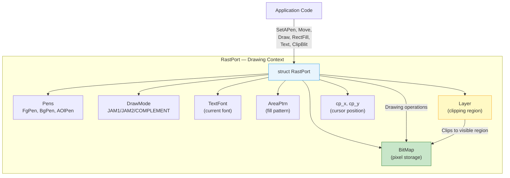
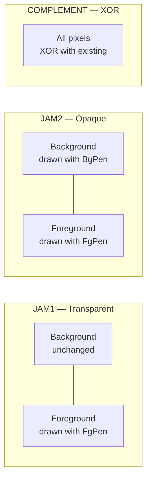
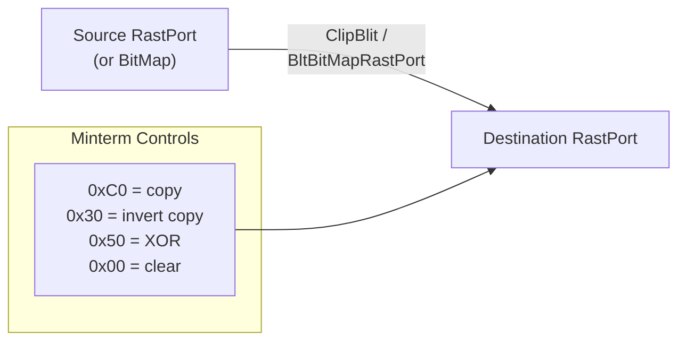
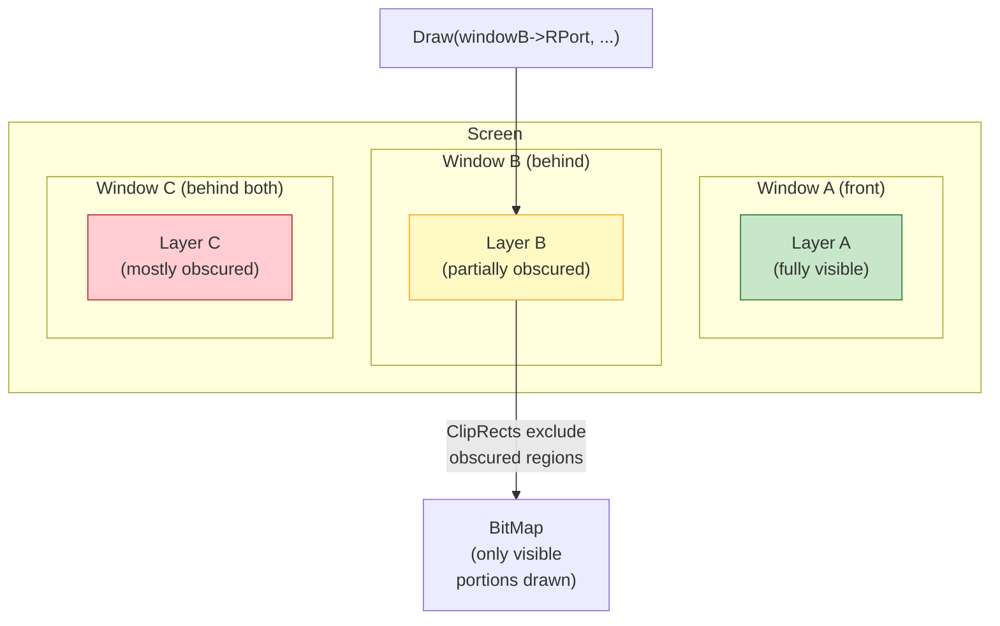

[← Home](../README.md) · [Graphics](README.md)

# RastPort — Drawing Primitives and Layers

## Overview

`RastPort` is the primary drawing context in AmigaOS — the equivalent of a "device context" (Windows) or "graphics context" (X11). All graphics primitives (pixel, line, rectangle, polygon, text) operate through a RastPort, which bundles together a target `BitMap`, drawing pen colors, patterns, font, draw mode, and an optional `Layer` for clipping.

Every Intuition window and screen has its own RastPort. When you draw into a window, you're drawing through its RastPort.



---

## struct RastPort

```c
/* graphics/rastport.h — NDK39 */
struct RastPort {
    struct Layer   *Layer;       /* associated layer (NULL = no clipping) */
    struct BitMap  *BitMap;      /* target bitmap */
    UWORD          *AreaPtrn;   /* area fill pattern */
    struct TmpRas  *TmpRas;     /* temp raster for area fills/floods */
    struct AreaInfo *AreaInfo;   /* area fill vertex buffer */
    struct GelsInfo *GelsInfo;   /* GEL (BOB/VSprite) list */
    UBYTE           Mask;        /* plane mask (which planes to draw to) */
    BYTE            FgPen;       /* foreground pen color index */
    BYTE            BgPen;       /* background pen color index */
    BYTE            AOlPen;      /* area outline pen */
    BYTE            DrawMode;    /* JAM1, JAM2, COMPLEMENT, INVERSVID */
    BYTE            AreaPtSz;    /* area pattern size (log2) */
    BYTE            linpatcnt;   /* line pattern counter */
    BYTE            dummy;
    UWORD           Flags;       /* FRST_DOT etc. */
    UWORD           LinePtrn;    /* 16-bit line dash pattern */
    WORD            cp_x, cp_y;  /* current pen position */
    UWORD           minterms[8];
    WORD            PenWidth;
    WORD            PenHeight;
    struct TextFont *Font;       /* current text font */
    UBYTE           AlgoStyle;   /* algorithmic style flags */
    UBYTE           TxFlags;
    UWORD           TxHeight;
    UWORD           TxWidth;
    UWORD           TxBaseline;
    WORD            TxSpacing;
    APTR           *RP_User;
    /* ... */
};
```

---

## Draw Modes

The draw mode controls how new pixels combine with existing content:



```c
#define JAM1        0   /* draw FgPen only; background pixels are NOT touched */
#define JAM2        1   /* draw FgPen AND BgPen — fully opaque */
#define COMPLEMENT  2   /* XOR all drawn pixels with existing content */
#define INVERSVID   4   /* swap foreground/background (for text inverse) */
```

| Mode | Text Example | Fill Example | Use Case |
|---|---|---|---|
| `JAM1` | Characters drawn, background shows through | Solid fill with FgPen | Transparent overlays, labels on images |
| `JAM2` | Characters + background box drawn | Same as JAM1 for fills | Opaque text on busy backgrounds |
| `COMPLEMENT` | XOR of text pixels with screen | XOR fill | Rubber-band selection, dragging cursors |
| `JAM1 | INVERSVID` | Background drawn with FgPen, chars transparent | — | Highlighted/selected text |

---

## Drawing Primitives

### Pen and Position Setup

```c
/* Set pen colors: */
SetAPen(rp, 1);       /* foreground = color register 1 */
SetBPen(rp, 0);       /* background = color register 0 */
SetDrMd(rp, JAM1);    /* transparent background mode */

/* OS 3.0+ — use named pen for correct Workbench colors: */
SetAPen(rp, screen->RastPort.BitMap->Depth > 1 ?
    ObtainBestPen(screen->ViewPort.ColorMap,
                  0xFF000000, 0x00000000, 0x00000000,  /* red */
                  OBP_Precision, PRECISION_GUI,
                  TAG_DONE) : 1);
```

### Lines and Pixels


```c
/* Move cursor (no drawing): */
Move(rp, 100, 50);

/* Draw line from current position to (x,y), update cp: */
Draw(rp, 200, 100);
/* cp is now (200, 100) — next Draw continues from here */

/* Draw a connected polygon: */
Move(rp, 10, 10);
Draw(rp, 100, 10);    /* top edge */
Draw(rp, 100, 80);    /* right edge */
Draw(rp, 10, 80);     /* bottom edge */
Draw(rp, 10, 10);     /* close: left edge */

/* Single pixel: */
WritePixel(rp, 160, 120);
LONG color = ReadPixel(rp, 160, 120);

/* Dashed lines: */
SetDrPt(rp, 0xF0F0);  /* 16-bit pattern: 1111000011110000 */
Draw(rp, 200, 100);    /* draws dashed line */
SetDrPt(rp, 0xFFFF);  /* restore solid */
```

### Rectangles and Fills

```c
/* Solid filled rectangle (uses FgPen + DrawMode): */
SetAPen(rp, 3);
RectFill(rp, 10, 10, 100, 50);  /* x1,y1 to x2,y2 inclusive */

/* Erase to background (clear a region): */
SetAPen(rp, 0);
SetDrMd(rp, JAM1);
RectFill(rp, 0, 0, 319, 255);

/* Scroll a region (with clear): */
ScrollRaster(rp, dx, dy, x1, y1, x2, y2);
/* Shifts content by (dx,dy); exposed area cleared to BgPen */
```

### Text Rendering


```c
/* Set font: */
struct TextAttr ta = {"topaz.font", 8, 0, FPF_ROMFONT};
struct TextFont *font = OpenFont(&ta);
SetFont(rp, font);

/* Render text at position: */
Move(rp, 20, 30);          /* baseline position */
Text(rp, "Hello Amiga", 11);

/* Measure text width before rendering (for alignment): */
UWORD width = TextLength(rp, "Hello Amiga", 11);
/* Right-align: */
Move(rp, screenWidth - width - 10, 30);
Text(rp, "Hello Amiga", 11);

/* Bold/italic (algorithmic): */
UWORD supported = AskSoftStyle(rp);
SetSoftStyle(rp, FSF_BOLD | FSF_ITALIC, supported);
Text(rp, "Bold Italic", 11);
SetSoftStyle(rp, 0, supported);  /* restore */
```

### Area Fills (Polygons)

```c
/* Area fills require setup: TmpRas + AreaInfo */
UBYTE areaBuffer[5 * 5];  /* 5 vertices × 5 bytes each */
struct AreaInfo areaInfo;
InitArea(&areaInfo, areaBuffer, 5);
rp->AreaInfo = &areaInfo;

PLANEPTR tmpRasData = AllocRaster(320, 256);
struct TmpRas tmpRas;
InitTmpRas(&tmpRas, tmpRasData, RASSIZE(320, 256));
rp->TmpRas = &tmpRas;

/* Draw a filled triangle: */
AreaMove(rp, 100, 10);     /* first vertex */
AreaDraw(rp, 200, 180);    /* second vertex */
AreaDraw(rp, 20, 180);     /* third vertex */
AreaEnd(rp);               /* fill and close */

/* Cleanup: */
FreeRaster(tmpRasData, 320, 256);
```

### Flood Fill

```c
/* Flood fill from a seed point: */
/* Requires TmpRas (same setup as area fills) */
Flood(rp, 1, 50, 50);
/* mode 1 = fill until FgPen color boundary */
/* mode 0 = fill all connected pixels of same color as seed */
```

### Blitting (Block Transfer)



```c
/* Copy region between RastPorts (respects clipping): */
ClipBlit(srcRP, sx, sy,     /* source position */
         dstRP, dx, dy,     /* destination position */
         width, height,
         0xC0);             /* minterm: straight copy */

/* Copy from BitMap to RastPort: */
BltBitMapRastPort(srcBM, sx, sy,
                  dstRP, dx, dy,
                  width, height,
                  0xC0);

/* Common minterms: */
/* 0xC0 = A (copy source)           */
/* 0x30 = NOT A (invert source)     */
/* 0x50 = A XOR B (toggle)          */
/* 0x00 = clear destination         */
/* 0xFF = set all bits               */
```

---

## Layers — Window Clipping

When `rp->Layer != NULL`, all drawing is automatically clipped to the layer's visible region. Intuition creates layers for every window — this is how overlapping windows work without drawing over each other.



Each layer maintains a list of **ClipRects** — rectangles defining which parts of the layer are visible. When you draw to a partially obscured window, `layers.library` breaks your drawing operation into multiple clipped sub-draws, one per visible ClipRect.

```c
/* Direct layer creation (Intuition does this for windows): */
struct Layer_Info *li = NewLayerInfo();
struct Layer *layer = CreateUpfrontLayer(li, bm,
    x1, y1, x2, y2,
    LAYERSIMPLE,  /* or LAYERSMART, LAYERSUPER */
    NULL);
struct RastPort *rp = layer->rp;  /* use this for drawing */

/* LAYERSIMPLE  — no backing store; app must redraw damaged areas */
/* LAYERSMART   — automatic backing store; OS handles redraw */
/* LAYERSUPER   — super bitmap; full offscreen buffer */

/* Layer clipping is automatic — Draw, RectFill, Text all respect it */
Draw(rp, 200, 100);  /* clipped to visible portion of layer */

/* Cleanup: */
DeleteLayer(0, layer);
DisposeLayerInfo(li);
```

### Layer Types

| Type | Flag | Backing Store | Damage Handling | Memory |
|---|---|---|---|---|
| Simple | `LAYERSIMPLE` | None | App receives `IDCMP_REFRESHWINDOW` and must redraw | Minimal |
| Smart | `LAYERSMART` | Auto-saved obscured regions | OS restores automatically | Moderate |
| Super | `LAYERSUPER` | Full off-screen bitmap | Full bitmap always valid | High |

> [!TIP]
> **`WFLG_SIMPLE_REFRESH`** windows use the least memory but require the most application code (you must handle `IDCMP_REFRESHWINDOW`). **`WFLG_SMART_REFRESH`** is the default for most applications — Intuition saves/restores obscured regions automatically.

---

## Patterns

### Line Patterns

```c
/* 16-bit repeating pattern for dashed lines: */
SetDrPt(rp, 0xFF00);   /* ████████░░░░░░░░ — long dash */
SetDrPt(rp, 0xF0F0);   /* ████░░░░████░░░░ — medium dash */
SetDrPt(rp, 0xAAAA);   /* █░█░█░█░█░█░█░█░ — dotted */
SetDrPt(rp, 0xFCFC);   /* ██████░░██████░░ — dash-dot */
```

### Area Fill Patterns

```c
/* Area patterns are powers-of-2 height, 16 bits wide: */
UWORD checkerPattern[] = { 0x5555, 0xAAAA };  /* 2-line checkerboard */
rp->AreaPtrn = checkerPattern;
rp->AreaPtSz = 1;    /* log2(2) = 1 */

/* Now RectFill uses the pattern instead of solid fill: */
RectFill(rp, 10, 10, 100, 80);

/* Multiplane patterns (one set per bitplane): */
UWORD brickPattern[] = {
    /* plane 0: */  0xFFFF, 0x8080, 0xFFFF, 0x0808,
    /* plane 1: */  0xFFFF, 0x8080, 0xFFFF, 0x0808
};
rp->AreaPtrn = brickPattern;
rp->AreaPtSz = 2;   /* log2(4 lines) = 2 */
rp->Mask |= 0x02;   /* enable plane 1 pattern */
```

---

## Plane Mask — Selective Bitplane Drawing

```c
/* Mask controls which bitplanes are affected by drawing: */
rp->Mask = 0xFF;  /* all planes — default */
rp->Mask = 0x01;  /* only plane 0 — fast for single-plane effects */
rp->Mask = 0x03;  /* planes 0 and 1 only */

/* Use case: draw a 2-color overlay without disturbing other planes: */
rp->Mask = 0x04;  /* only plane 2 */
SetAPen(rp, 4);   /* color index with bit 2 set */
RectFill(rp, 0, 0, 319, 255);
rp->Mask = 0xFF;  /* restore */
```

---

## References

- NDK39: `graphics/rastport.h`, `graphics/gfxmacros.h`
- ADCD 2.1: `SetAPen`, `Move`, `Draw`, `Text`, `RectFill`, `ClipBlit`
- See also: [bitmap.md](bitmap.md) — BitMap structure and allocation
- See also: [layers.md](../../11_libraries/layers.md) — layers.library detailed reference
- See also: [text_fonts.md](text_fonts.md) — font loading and rendering
- See also: [blitter.md](blitter.md) — hardware Blitter used by BltBitMap
