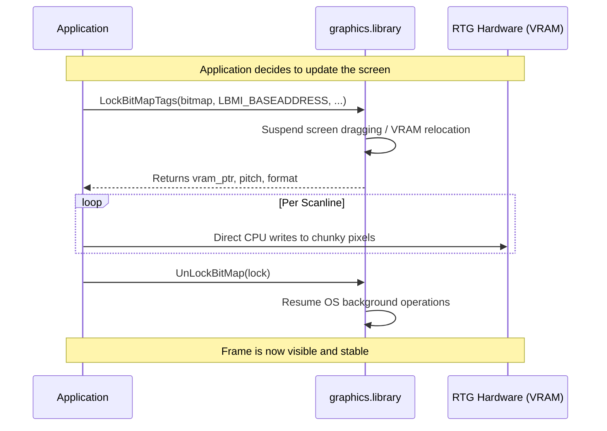
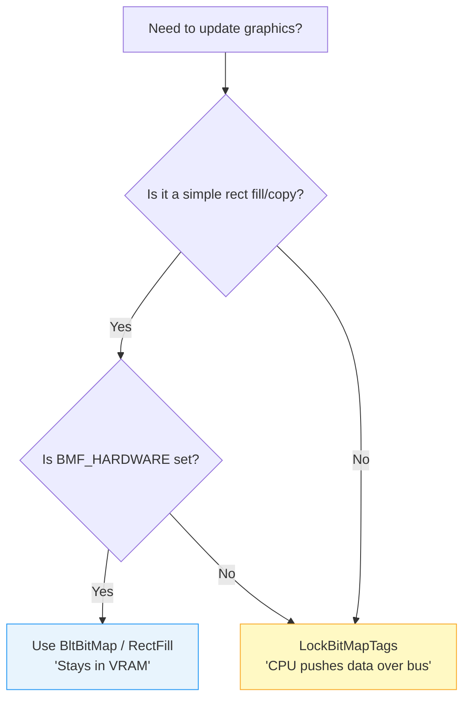

[← Home](../README.md) · [Graphics](README.md)

# RTG (Retargetable Graphics) Programming — Chunky Framebuffers and Hardware Abstraction

Retargetable Graphics (RTG) is an abstraction layer that decouples Amiga applications from the platform's native planar custom chipset (OCS/ECS/AGA), enabling transparent support for modern chunky-pixel graphics hardware connected via Zorro or PCI expansion buses. It lives as a set of library extensions (Picasso96 or CyberGraphX) to the standard AmigaOS `graphics.library`, solving the performance bottleneck of planar memory layouts for 3D rendering and high-resolution video. Understanding the interaction between CPU-side chunky framebuffers and the hardware expansion bus bandwidth is the critical constraint for any high-performance RTG software.

---

## 1. Architecture: The RTG Lifecycle

The core design of RTG moves the Amiga from **Planar** (bitplanes scattered in Chip RAM) to **Chunky** (linear pixels in VRAM). Because VRAM resides on a peripheral bus, the OS must arbitrate access between the CPU and the graphics card's internal blitter.

### 1.1 Framebuffer Lifecycle


### 1.2 Rendering Decision Matrix
When deciding between using OS-native draw functions or direct VRAM access, use this logic:



---

## 2. The Planar vs. Chunky Paradigm

*   **Planar (Custom Chipset)**: To draw a single 8-bit (256 color) pixel, the CPU or Blitter must write 1 bit to 8 separate areas of memory. This is computationally expensive for 3D texture mapping or unscaled sprites.
*   **Chunky (RTG)**: To draw a single 8-bit pixel, the CPU writes 1 byte to 1 memory address. To draw a 32-bit pixel, the CPU writes 1 longword (4 bytes).

> **Deep Dive**: For a comprehensive architectural breakdown of the Chunky-to-Planar conversion problem (including the Kalms algorithm, Akiko hardware, and Blitter-assisted conversion), refer to our dedicated [Chunky ↔ Planar Pixel Conversion](pixel_conversion.md) article.

---


## 3. Requesting an RTG ScreenMode

The standard way to open an RTG screen is to ask the user what resolution they want using `asl.library` (`screenmode.req`).

```c
#include <libraries/asl.h>
#include <proto/asl.h>

struct ScreenModeRequester *req;
ULONG displayID = INVALID_ID;

req = AllocAslRequest(ASL_ScreenModeRequest, NULL);
if (req) {
    // Filter for Chunky, TrueColor modes (e.g., >= 16-bit depth)
    if (AslRequestTags(req,
            ASLSM_MinDepth, 16,
            ASLSM_PropertyMask, DIPF_IS_RTG,
            TAG_DONE)) {
        displayID = req->sm_DisplayID;
    }
    FreeAslRequest(req);
}
```

Once you have the `displayID`, you can open an OS-friendly screen:

```c
struct Screen *rtgScreen = OpenScreenTags(NULL,
    SA_DisplayID, displayID,
    SA_Title, "My RTG Application",
    SA_Depth, 32,
    TAG_DONE);
```

---

## 4. Direct VRAM Access: `LockBitMapTags`

While AmigaOS provides functions like `WritePixel()` or `BltBitMap()`, these are far too slow for real-time video playback or 3D games. Game developers need a direct pointer to the graphics card's Video RAM (VRAM) to blast pixels via CPU loops.

Starting with `graphics.library` V39, AmigaOS provides `LockBitMapTags()`, which asks the graphics driver to lock the VRAM buffer and return its absolute memory address.

> [!WARNING]  
> **Never hold the lock!** You must call `UnLockBitMap()` as quickly as possible. While a bitmap is locked, the OS cannot move it in VRAM, and multitasking can be heavily degraded on some drivers.

### 3.1 The Framebuffer Lock Workflow

```c
#include <proto/cybergraphics.h> // Or graphics.library V39+ equivalents

APTR vram_base;
ULONG pitch, format;

// Lock the bitmap belonging to our window's screen
APTR lock = LockBitMapTags(rtgScreen->RastPort.BitMap,
    LBMI_BASEADDRESS, (ULONG)&vram_base,
    LBMI_BYTESPERROW, (ULONG)&pitch,
    LBMI_PIXFMT,      (ULONG)&format,
    TAG_DONE);

if (lock) {
    // We now have direct access to VRAM!
    // Example: Fill screen with red (Assuming 32-bit ARGB format)
    ULONG *pixel_ptr = (ULONG *)vram_base;
    for (int y = 0; y < rtgScreen->Height; y++) {
        for (int x = 0; x < rtgScreen->Width; x++) {
            pixel_ptr[x] = 0x00FF0000; // Red
        }
        // Advance pointer by 'pitch' (bytes), not pixels!
        pixel_ptr = (ULONG *)((UBYTE *)pixel_ptr + pitch);
    }

    // Release the lock immediately when done drawing the frame
    UnLockBitMap(lock);
}
```

### 3.2 Understanding Pitch (Modulo)
Never assume `pitch = Width * BytesPerPixel`. Graphics cards often align rows of VRAM to 16, 32, or 64-byte boundaries for burst-transfer optimization. You must always advance your `y` loop pointer by adding the `pitch` in bytes.

---

## 5. Pixel Formats & Endianness

Because Amiga RTG cards are historically PC VGA cards plugged into Zorro bus adapters, pixel formats can be complex.

When you query `LBMI_PIXFMT` (or use `GetCyberMapAttr()`), you will get one of several formats. Your rendering engine must check this format and output pixels accordingly.

| Format Constant | Depth | Structure | Notes |
|---|---|---|---|
| `PIXFMT_LUT8` | 8-bit | Index | 256 colors requiring a palette table. |
| `PIXFMT_RGB15` | 16-bit | `xRRRRRGG GGGBBBBB` | 5:5:5 format. |
| `PIXFMT_RGB16` | 16-bit | `RRRRRGGG GGGBBBBB` | 5:6:5 format (Common for fast 3D). |
| `PIXFMT_RGB24` | 24-bit | `R, G, B` | 3 bytes per pixel (unaligned, slow). |
| `PIXFMT_ARGB32` | 32-bit | `A, R, G, B` | Alpha is ignored by most cards. |
| `PIXFMT_BGRA32` | 32-bit | `B, G, R, A` | PC-native Little-Endian format. |

### 5.1 The Endianness Hazard
The Motorola 68000 is **Big-Endian**. Modern graphics cards are built for x86 (**Little-Endian**). Both Picasso96 and CyberGraphX drivers attempt to hide this by configuring the bridgeboard (like the Prometheus PCI bridge) to byte-swap the data automatically on the hardware bus.

However, older drivers or direct hardware manipulation might expose the Little-Endian VRAM directly. Always rely on the `PIXFMT` returned by the OS rather than hardcoding RGB bitshifts.

---

## 6. Double Buffering in RTG

For tear-free rendering, use standard AmigaOS double-buffering via `AllocScreenBuffer()` and `ChangeScreenBuffer()`.

1. Allocate two `ScreenBuffer` structures.
2. `LockBitMapTags()` on the *back buffer*.
3. Draw the frame.
4. `UnLockBitMap()`.
5. Call `ChangeScreenBuffer(screen, back_buffer)` to flip the display pointers during the next VBlank.
6. Swap your logic so the old front buffer becomes the new back buffer.

---

## 7. Vendor & Platform Comparison

Amiga RTG programming shares many concepts with modern desktop APIs, though it lacks the high-level scene graphs or shaders found in modern pipelines.

| Concept | Amiga RTG (P96/CGX) | Modern Equivalent (SDL / DirectX) |
|---|---|---|
| **Framebuffer Lock** | `LockBitMapTags()` | `SDL_LockSurface()` / `Map()` |
| **Pixel Format** | `LBMI_PIXFMT` | `SDL_PixelFormat` / `DXGI_FORMAT` |
| **Buffer Flip** | `ChangeScreenBuffer()` | `SDL_RenderPresent()` / `Present()` |
| **VRAM Buffer** | `BitMap` (RTG) | `Texture2D` / `Surface` |

---

## 8. Use-Case Cookbook: Minimal RTG Application

This complete example demonstrates the "Proper Lifecycle" for opening an RTG screen, locking it for direct access, and rendering a simple procedural pattern.

```c
/* RTG Minimal Renderer - AmigaOS 3.1+ */
#include <proto/exec.h>
#include <proto/graphics.h>
#include <proto/intuition.h>
#include <graphics/gfxmacros.h>

int main() {
    struct Screen *scr;
    struct BitMap *bm;
    APTR lock;
    UBYTE *vram;
    ULONG pitch, format;

    // 1. Open an 800x600 32-bit screen (assuming driver exists)
    scr = OpenScreenTags(NULL,
        SA_Width,  800,
        SA_Height, 600,
        SA_Depth,  32,
        SA_Title,  (ULONG)"RTG Cookbook Example",
        SA_Type,   PUBLICSCREEN,
        TAG_DONE);

    if (!scr) return 20;

    bm = scr->RastPort.BitMap;

    // 2. Lock the VRAM for direct CPU access
    lock = LockBitMapTags(bm,
        LBMI_BASEADDRESS, (ULONG)&vram,
        LBMI_BYTESPERROW, (ULONG)&pitch,
        LBMI_PIXFMT,      (ULONG)&format,
        TAG_DONE);

    if (lock) {
        // 3. Render a blue-to-black gradient
        for (int y = 0; y < 600; y++) {
            ULONG *row_ptr = (ULONG *)(vram + (y * pitch));
            for (int x = 0; x < 800; x++) {
                row_ptr[x] = (x & 0xFF); // Blue component
            }
        }

        // 4. Unlock immediately!
        UnLockBitMap(lock);
    }

    // 5. Cleanup
    Delay(150); // Show for 3 seconds
    CloseScreen(scr);
    return 0;
}
```

---

## 9. Best Practices & Antipatterns

### Best Practices
1. **Always use the Pitch**: Never calculate row offsets as `x * BytesPerPixel`. Use the pitch returned by the OS.
2. **Minimize Lock Time**: Hold the `BitMap` lock only during the actual memory copy/render loop.
3. **Check PIXFMT**: Verify the return pixel format. A 32-bit mode could be ARGB, BGRA, or RGBA depending on the PCI bridgeboard.
4. **Prefer Hardware Blits**: If doing a simple rectangular clear, use `RectFill()` instead of a CPU loop to keep data on the card.

### Antipatterns

#### 1. The Infinite Lock
Holding the VRAM lock across a blocking system call.
*   **The Bug**: Calling `WaitPort()` or `Delay()` while holding a lock returned by `LockBitMapTags()`.
*   **Why it fails**: It prevents the RTG driver from performing background tasks or handling screen depth-arrangements, potentially deadlocking the UI.
*   **The Fix**: Unlock the bitmap before waiting for user input or the next vertical blank.

#### 2. The Implicit Pitch Assumption
Assuming VRAM is a contiguous, unpadded array.
*   **The Bug**: `pixel_ptr = vram + (y * Width * 4);`
*   **Why it fails**: Graphics cards often align scanlines to 64-byte or 128-byte boundaries for hardware performance.
*   **The Fix**: `pixel_ptr = vram + (y * pitch);`

---

## 10. Pitfalls & Common Mistakes

### 8.1 The "Zorro II Crawl"
*   **Bad Code**: Attempting to render 1024x768 32-bit video over a Zorro II bus using direct CPU writes.
*   **Reality**: Zorro II tops out at ~3.5 MB/s. A single 32-bit 1024x768 frame is 3 MB. You will get **1 FPS**.
*   **Correct Version**: Use 8-bit indexed modes for high resolutions on Zorro II, or restrict 32-bit color to small windows/dirty rectangles.

---


## 11. Hardware Constraints & Limitations

While RTG liberates the Amiga from the planar custom chipset, developers must be acutely aware of the hardware bottlenecks introduced by the expansion bus.

### 6.1 Bus Bandwidth (The Ultimate Bottleneck)
The Amiga's expansion buses were never designed for modern chunky pixel-pushing:
*   **Zorro II (A2000/A500)**: Maximum bandwidth is theoretically ~3.5 MB/s. An 800x600 32-bit frame is ~1.9 MB. If the CPU pushes a full frame over Zorro II, you will achieve fewer than **2 Frames Per Second (FPS)**.
*   **Zorro III (A3000/A4000)**: Maximum bandwidth is ~12–15 MB/s. Still a severe bottleneck for full-screen 32-bit updates.
*   **PCI Bridgeboards (Mediator/Prometheus)**: Significantly faster, but still bottlenecked by the Amiga motherboard's interface to the bridge.

**The Solution:** Do not redraw the whole screen. Use dirty rectangles (only update what changed), or utilize the 2D acceleration features (Blits, Fills) of the graphics card via `graphics.library` so the data stays in VRAM and doesn't cross the Zorro bus.

### 6.2 Hardware VRAM Limits
Could you create a 4K (3840x2160) framebuffer if you had enough RAM? 

In short: **No, not on classic hardware.**
*   A 4K framebuffer at 32-bit color requires **~33.1 MB** of contiguous Video RAM.
*   Classic Amiga RTG cards (Picasso II, CyberVision 64) typically had 2 MB to 4 MB of VRAM.
*   Even the most advanced classic RTG setups (3dfx Voodoo 3 3000 via Mediator PCI) only possessed 16 MB of VRAM.

If `AllocBitMap()` fails to find contiguous VRAM on the graphics card, AmigaOS may fall back to allocating the bitmap in standard Fast RAM. If it does this, rendering happens in standard system RAM, but displaying it requires the OS to blindly copy it to the graphics card every frame, instantly suffocating the Zorro bus.

### 6.3 RTG Card Catalog

The following table catalogs the major RTG cards available for classic Amiga systems. Maximum resolution depends on both VRAM capacity and pixel clock; interlaced modes can push horizontal resolution higher at the cost of flicker.

| Card | Chipset | Bus | VRAM | Max 8-bit | Max 16-bit | Max 24/32-bit | Pixel Clock | Key Features |
|---|---|---|---|---|---|---|---|---|
| **Retina** | NCR 77C22E+ | Zorro II | 1–4 MB | 2400×1200 (i) | 1280×1024 | 1024×768 (ni) | 90 MHz | Early high-res; P96 / EGS |
| **Picasso II** | Cirrus GD5426/28 | Zorro II | 1–2 MB | 1600×1280 (i) | 1152×864 (i) | 800×600 (ni) | 85 MHz | PAL video out; maps into Z2 space |
| **Picasso II+** | Cirrus GD5428 | Zorro II | 2 MB | 1600×1280 (i) | 1152×864 (i) | 800×600 (ni) | 85 MHz | DPMS support; improved blitter |
| **Piccolo** | Cirrus GD5426 | Z2/Z3 | 1–2 MB | 1600×1280 (i) | 1152×864 (i) | 800×600 (ni) | 85 MHz | Z2/Z3 autosense; video encoder option |
| **1600GX** | Weitek 91460 | Zorro III | 2 MB | 1600×1280 (ni) | — | — | 180 MHz | Workstation-grade; X-Windows draw modes |
| **CyberVision 64** | S3 Trio64 | Zorro III | 2–4 MB | 1600×1200 (ni) | 1280×1024 (ni) | 1024×768 (ni) | 135 MHz | Monitor switcher; Roxxler C2P chip |
| **CyberVision 64/3D** | S3 ViRGE | Z2/Z3 | 4 MB | 1600×1200 (ni) | 1280×1024 (ni) | 1024×768 (ni) | 135 MHz | Built-in scan doubler; 3D functions |
| **Picasso IV** | Cirrus GD5446 | Z2/Z3 | 4 MB | 1600×1200 (ni) | 1600×1200 (i) | 1280×1024 (ni) | 135 MHz | Built-in flicker fixer; video in/out; TV tuner option |
| **Retina BLT Z3** | NCR 77C32BLT | Zorro III | 1–4 MB | 2400×1200 (i) | 1280×1024 (ni) | 1152×864 (ni) | 110 MHz | BLT engine; 15–80 kHz H-sync |
| **BlizzardVision PPC** | Permedia 2 | A1200 CPU | 8 MB | 1600×1200 (ni) | 1600×1200 (ni) | 1280×1024 (ni) | 230 MHz RAMDAC | 3D acceleration; no draggable screens |
| **CyberVision PPC** | Permedia 2 | CPU slot | 8 MB | 1600×1200 (ni) | 1600×1200 (ni) | 1280×1024×32 (ni) | 230 MHz RAMDAC | 3D acceleration; no draggable screens |
| **Voodoo 3 2000/3000** | 3dfx | PCI (Mediator) | 16 MB | 2048×1536 | 2048×1536 | 2048×1536 | 300+ MHz | Full 3D; CGX4 / P96 |
| **Voodoo 4/5** | 3dfx | PCI (Mediator) | 16–32 MB | 2048×1536 | 2048×1536 | 2048×1536 | 300+ MHz | Voodoo3-compatible mode; larger VRAM |
| **Radeon 7000/9200** | ATI | PCI (Mediator) | 32–128 MB | 1920×1200+ | 1920×1200+ | 1920×1200+ | 200+ MHz | DVI output; modern P96 drivers |
| **S3 Virge DX** | S3 | PCI (Mediator) | 4 MB | 1600×1200 | 1600×1200 | 1024×768 | 135 MHz | Budget PCI option |

> **Legend:** `(ni)` = non-interlaced; `(i)` = interlaced. Pixel clock values are maximum dot-clock frequencies; actual achievable refresh rates depend on the specific timing modeline.

### 11.4 OS & Library Constraints
*   **16-bit Coordinate Limits**: Deep inside `graphics.library` and `intuition.library`, dimensions and coordinates are frequently passed as signed 16-bit integers (`WORD`). This imposes a hard mathematical limit of 32,767 x 32,767 for logical bitmap sizes, though physical VRAM limits hit far earlier.
*   **Contiguity**: RTG drivers require *contiguous* blocks of VRAM to allocate a screen. Over time, opening and closing windows can fragment VRAM. If you request an 800x600 double-buffered screen (requiring two large blocks), it might fail due to fragmentation, even if total free VRAM is technically sufficient.

---

## 12. SDK & API Constraints

Programming against RTG is not transparent. Both Picasso96 and CyberGraphX expose extensions to `graphics.library`, but the APIs differ and not all features are available on all hardware.

---

## 13. Bypassing Bus Bottlenecks

For high-performance applications (3D games, video players), the Zorro bus is the primary bottleneck. Developers have historically used several strategies to overcome this.

### 13.1 Local Bus RTG (CPU-Slot)
High-end accelerators like the **CyberStorm PPC** or **Blizzard PPC** provide a proprietary local bus connector that bypasses Zorro entirely.
*   **The CyberVision PPC / BlizzardVision PPC**: These cards sit directly on the CPU's local bus, achieving bandwidth up to 60-80 MB/s—far exceeding the 10-15 MB/s limit of a typical Zorro III setup.
*   **Programming Impact**: No change to the RTG API; however, the speed of `LockBitMapTags()` based rendering increases dramatically.

### 13.2 PCI Bridgeboards & Peer-to-Peer
Bridgeboards like the **Mediator PCI** allow using PC-standard PCI cards (Voodoo, Radeon).
*   **Peer-to-Peer DMA**: PCI cards can transfer data to each other without crossing the Amiga's motherboard bus. A PCI TV-Tuner can write directly to a PCI Graphics Card's VRAM.
*   **Hardware Acceleration**: Utilizing the 3D features of the card (via Warp3D or StormMESA) moves the computation to the card, meaning the CPU only sends compact command lists rather than raw pixel data over the Zorro bus.

### 13.3 Software Mitigation: Dirty Rectangles
If stuck on a Zorro II bus (3.5 MB/s), you must minimize bus traffic.
*   **Technique**: Track exactly which regions of the screen have changed and only `LockBitMapTags()` and update those specific "Dirty Rectangles."
*   **Bad**: Redrawing the whole 640x480 screen every frame.
*   **Good**: Only updating the 32x32 sprite area and the UI text fields that changed.

---

## 14. References

### 14.1 Picasso96 vs CyberGraphX API Surface

| Feature | Picasso96 | CyberGraphX (CGX) |
|---|---|---|
| **Primary header** | `picasso96api.h` | `cybergraphics.h` |
| **Lock function** | `LockBitMapTags()` | `LockBitMapTags()` (compatible) |
| **Pixel format query** | `GetCyberMapAttr()` | `GetCyberMapAttr()` |
| **Mode creation** | `p96AllocModeListTags()` | `CGXAllocModeListTags()` |
| **Hardware blit** | `BltBitMapRastPort()` + flags | `BltBitMapRastPort()` + flags |
| **VRAM query** | `p96GetBitMapAttr()` | `CGXGetBitMapAttr()` |

> [!IMPORTANT]
> While `LockBitMapTags()` is API-compatible between P96 and CGX, the tags and return values for pixel format queries differ subtly. Always check `picasso96api.h` or `cybergraphics.h` for the exact constant names in your build environment.

### 14.2 LockBitMapTags Lifetime Constraints

`LockBitMapTags()` acquires an exclusive lock on the bitmap's VRAM. While locked:

- The driver **cannot move** the bitmap in VRAM.
- The OS **cannot page** the bitmap out.
- On some drivers (especially early CGX), multitasking is **degraded** for the duration.

**Rule**: Hold the lock for the shortest time possible — typically one frame render. Never hold a lock across a `Wait()` or `Delay()` call.

### 14.3 Hardware Acceleration Availability

Not all RTG cards accelerate 2D operations in VRAM. The following table maps common operations to typical hardware support:

| Operation | Retina / Picasso II | CyberVision 64 | Picasso IV | Permedia 2 | Voodoo 3 / Radeon |
|---|---|---|---|---|---|
| **Rect fill** | Software | S3 blitter | Cirrus blitter | GLINT | Yes |
| **Rect copy (Blit)** | Software | S3 blitter | Cirrus blitter | GLINT | Yes |
| **Line draw** | Software | S3 | Cirrus | GLINT | Yes |
| **Pattern fill** | Software | Limited | Limited | GLINT | Yes |
| **Scaled blit** | Software | Software | Software | GLINT | Yes |
| **3D triangle** | No | No (ViRGE: limited) | No | Yes | Yes |

To query acceleration at runtime, check the `BMA_FLAGS` attribute after allocating a bitmap. If `BMF_HARDWARE` is not set, the operation will fall back to CPU rendering — which on Zorro II means crossing the bus for every pixel.

### 14.4 ModeID and Display Database Constraints

RTG modes are identified by 32-bit `DisplayID` values, but they are **not** native Amiga chipset ModeIDs. Key constraints:

- **No guarantee of availability**: A ModeID that works on a CyberVision 64 may not exist on a Picasso II, even at the same resolution. Always query the display database with `NextDisplayInfo()` or use `asl.library` to let the user choose.
- **Refresh rate encoding**: RTG ModeIDs often encode refresh rate in the upper bits. A ModeID for 800×600@60 Hz is a different value than 800×600@75 Hz.
- **Interlace flag**: Setting the `DIPF_IS_LACE` bit in an RTG ModeID is legal only if the card and driver support interlaced output. Many PCI cards (Voodoo 3, Radeon) reject interlaced ModeIDs entirely.

### 14.5 VRAM Allocation Failures

When `AllocBitMap()` or `OpenScreenTags()` fails, the error code is often `NULL` with no explicit reason. Common causes:

1. **Insufficient contiguous VRAM** — fragmentation or oversized request.
2. **Unsupported pixel format** — requesting `PIXFMT_ARGB32` on a card that only supports `PIXFMT_RGB24`.
3. **ModeID not supported** — the driver rejected the requested resolution/depth combination.
4. **Bus timeout** — on Zorro II, very large allocations can trigger bus timeout during AutoConfig.

**Debugging strategy**: Reduce the request depth (32 → 16 → 8) and resolution until allocation succeeds. Query `AvailableMem(MEMF_FAST)` to check Fast RAM fallback; if it drops, VRAM is exhausted.

### 14.6 Draggable Screens and Passthrough

Some RTG cards cannot coexist with native chipset output:

| Card | Draggable Screens | Native Passthrough | Notes |
|---|---|---|---|
| **Picasso II/IV** | Yes | Automatic | Hardware monitor switcher |
| **CyberVision 64** | Yes | Hardware switcher | Digital video expansion bus |
| **CyberVision 64/3D** | Yes | Scan doubler | Doubles 15 kHz to 31 kHz |
| **CyberVision PPC** | **No** | External switch required | Permedia 2 design limitation |
| **BlizzardVision PPC** | **No** | External switch required | A1200 CPU-slot card |
| **Voodoo 3 (PCI)** | Yes | No native output | Pure RTG; no Amiga video |
| **Radeon (PCI)** | Yes | No native output | Pure RTG; no Amiga video |

If your application relies on dragging screens between native and RTG displays, test on hardware that supports it — or restrict usage to Picasso96/CyberGraphX cards with known switcher support.
