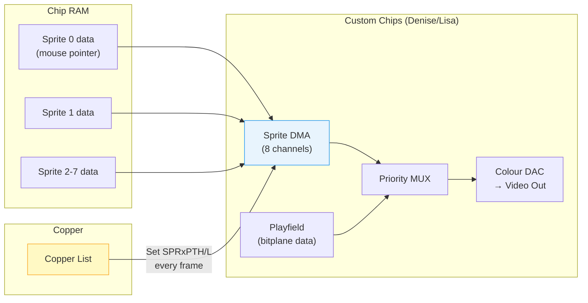
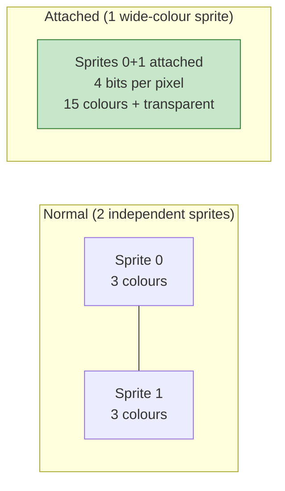
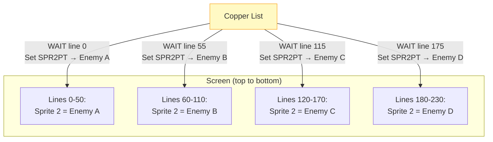
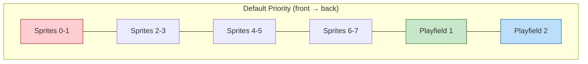

[← Home](../README.md) · [Graphics](README.md)

# Hardware Sprites — DMA Engine, Multiplexing, and Tricks

## Overview

The Amiga has **8 hardware sprites**, each 16 pixels wide with 3 colours + transparent. Sprites are entirely DMA-driven — the custom chips fetch sprite data from Chip RAM and composite them over the playfield with zero CPU overhead. The Copper reloads sprite pointers every frame.

Sprite 0 is reserved by Intuition for the **mouse pointer**. Sprites 1–7 are available for application use.



---

## Sprite DMA Data Format

Each sprite is stored as a contiguous block in Chip RAM:

```
┌──────────────────────────────────────────┐
│ Header Word 0: VSTART/HSTART            │  Position control
│ Header Word 1: VSTOP/Control            │
├──────────────────────────────────────────┤
│ Line 0: DATA word (bit 0 of each pixel) │  ← 16 pixels per line
│ Line 0: DATB word (bit 1 of each pixel) │
├──────────────────────────────────────────┤
│ Line 1: DATA word                       │
│ Line 1: DATB word                       │
├──────────────────────────────────────────┤
│ ...repeat for each line...              │
├──────────────────────────────────────────┤
│ Terminator: 0x0000                      │  End marker
│ Terminator: 0x0000                      │
└──────────────────────────────────────────┘
```

### Pixel Colour Encoding

```
Pixel colour = (DATB_bit << 1) | DATA_bit

  00 = transparent (playfield shows through)
  01 = sprite colour 1
  10 = sprite colour 2
  11 = sprite colour 3
```

### Header Bit Layout

```
Word 0 (SPRxPOS):
  Bits 15–8: VSTART[7:0]     (vertical start line, low 8 bits)
  Bits 7–0:  HSTART[8:1]     (horizontal start, in low-res pixels ÷ 2)

Word 1 (SPRxCTL):
  Bits 15–8: VSTOP[7:0]      (vertical stop line, low 8 bits)
  Bit 7:     unused
  Bit 6:     unused
  Bit 5:     unused
  Bit 4:     unused
  Bit 3:     VSTART[8]       (bit 8 of start — for lines > 255)
  Bit 2:     VSTOP[8]        (bit 8 of stop)
  Bit 1:     HSTART[0]       (low bit of horizontal position)
  Bit 0:     ATTACH          (1 = attached to previous sprite)
```

> [!IMPORTANT]
> **Horizontal position is in low-res pixel units ÷ 2** — a sprite can only be positioned on even low-res pixel boundaries. In hires/superhires modes, this means sprites have coarser horizontal positioning than playfield pixels.

---

## Sprite Colour Palette

Each pair of sprites shares 3 colour registers (colour 0 = transparent for all):

| Sprite Pair | Colour Registers | Custom Addresses | Notes |
|---|---|---|---|
| 0–1 | `COLOR17`–`COLOR19` | `$DFF1A2`–`$DFF1A6` | Pair with mouse pointer |
| 2–3 | `COLOR21`–`COLOR23` | `$DFF1AA`–`$DFF1AE` | |
| 4–5 | `COLOR25`–`COLOR27` | `$DFF1B2`–`$DFF1B6` | |
| 6–7 | `COLOR29`–`COLOR31` | `$DFF1BA`–`$DFF1BE` | |

```c
/* Set sprite 0-1 colours directly: */
custom->color[17] = 0xF00;  /* red */
custom->color[18] = 0x0F0;  /* green */
custom->color[19] = 0xFFF;  /* white */
```

---

## Attached Sprites — 15 Colours

Two sprites from the same pair can be **attached** to form a single 15-colour (+ transparent) sprite:



When attached, the even sprite provides bits 0–1 and the odd sprite provides bits 2–3 of the colour index. The 4-bit value indexes into colour registers 16–31.

```c
/* Enable attachment: set bit 0 of odd sprite's CTL word */
oddSpriteData[1] |= 0x0001;  /* ATTACH bit */
```

---

## Sprite Multiplexing — More Than 8 Sprites

The hardware only supports 8 simultaneous sprites, but demos and games use **multiplexing** to display many more by reusing sprite channels on different scanlines:



The Copper waits for a line after one sprite ends, then reprograms the sprite pointer register for the next object. This gives effectively **unlimited sprites** as long as they don't overlap vertically on the same channel.

### Multiplexing Rules

| Rule | Explanation |
|---|---|
| No vertical overlap on same channel | Two sprites using the same DMA channel cannot appear on the same scanline |
| 1-line gap required | After a sprite ends (VSTOP), the DMA channel needs at least 1 blank line before starting the next |
| Copper must be fast enough | Copper WAIT + MOVE takes 2 DMA cycles; pointer reload = 2 MOVEs (PTH+PTL) |
| Max per scanline: 8 | Absolute hardware limit — 8 DMA channels, one fetch per channel per line |

---

## AGA Sprite Enhancements

| Feature | OCS/ECS | AGA |
|---|---|---|
| Width | 16 pixels | 16, 32, or 64 pixels (via FMODE) |
| Colours (single) | 3 + transparent | 3 + transparent |
| Colours (attached) | 15 + transparent | 15 + transparent |
| Horizontal resolution | Low-res ÷ 2 | Same (unchanged) |

```c
/* AGA: wider sprites via FMODE register */
custom->fmode = 3;  /* 4× fetch — sprites become 64 pixels wide */
/* WARNING: this also affects bitplane fetch! */
```

---

## Sprite-Playfield Priority

Sprites interact with playfields via the **priority control register** (`BPLCON2`):

```c
/* BPLCON2 ($DFF104) priority bits: */
/*   PF2P2-PF2P0: playfield 2 priority vs sprites */
/*   PF1P2-PF1P0: playfield 1 priority vs sprites */

/* Priority order (front to back): */
/* SP01 > SP23 > SP45 > SP67 > PF1 > PF2  (default) */

/* Make sprites appear behind playfield 1: */
custom->bplcon2 = 0x0024;  /* PF1 in front of all sprites */
```



The priority can be configured so that sprites appear **between** playfield 1 and playfield 2 — creating the illusion of depth (e.g., a character walking behind foreground objects but in front of the background).

---

## Sprite Pointer Registers

| Register | Address | Sprite |
|---|---|---|
| `SPR0PTH/L` | `$DFF120–$DFF123` | Sprite 0 (mouse pointer) |
| `SPR1PTH/L` | `$DFF124–$DFF127` | Sprite 1 |
| `SPR2PTH/L` | `$DFF128–$DFF12B` | Sprite 2 |
| `SPR3PTH/L` | `$DFF12C–$DFF12F` | Sprite 3 |
| `SPR4PTH/L` | `$DFF130–$DFF133` | Sprite 4 |
| `SPR5PTH/L` | `$DFF134–$DFF137` | Sprite 5 |
| `SPR6PTH/L` | `$DFF138–$DFF13B` | Sprite 6 |
| `SPR7PTH/L` | `$DFF13C–$DFF13F` | Sprite 7 |

These must be set **every frame** — typically by the Copper list during vertical blank. If not set, the sprite DMA will fetch from wherever the pointer was left, producing garbage.

---

## OS-Level Sprite API

```c
/* graphics.library — system-friendly sprite access */
struct SimpleSprite ss;
WORD sprnum;

/* Obtain a free sprite (Intuition reserves sprite 0 for the pointer): */
sprnum = GetSprite(&ss, -1);   /* -1 = any available */
if (sprnum >= 0)
{
    ss.x = 100;
    ss.y = 50;
    ss.height = 16;

    /* Set sprite image data (must be in Chip RAM!): */
    ChangeSprite(NULL, &ss, spriteData);

    /* Move sprite to screen position: */
    MoveSprite(NULL, &ss, 100, 50);

    /* Release when done: */
    FreeSprite(sprnum);
}
```

### Custom Mouse Pointer

```c
/* Change the Intuition mouse pointer: */
UWORD pointerData[] = {
    0x0000, 0x0000,   /* reserved (position) */
    /* 16 lines of sprite data: */
    0x8000, 0xC000,   /* line 0 */
    0xC000, 0xE000,   /* line 1 */
    0xE000, 0xF000,   /* line 2 */
    /* ... etc ... */
    0x0000, 0x0000    /* terminator */
};
SetPointer(window, pointerData, height, width, xOffset, yOffset);
/* Restore default: */
ClearPointer(window);
```

---

## Common Pitfalls

| Pitfall | Consequence | Fix |
|---|---|---|
| Sprite data not in Chip RAM | DMA can't access it — sprite invisible or garbage | Use `AllocMem(MEMF_CHIP)` for sprite data |
| Not setting pointer every frame | Sprite DMA reads stale pointer → random data displayed | Use Copper list to reload SPRxPT |
| Forgetting `FreeSprite` | Sprite channel stays reserved → other apps can't use it | Always free in cleanup |
| Using sprite 0 directly | Conflicts with Intuition's mouse pointer | Use `GetSprite(-1)` to get a free one |

---

## References

- HRM: *Amiga Hardware Reference Manual* — Sprites chapter
- NDK39: `graphics/sprite.h`, `hardware/custom.h`
- ADCD 2.1: `GetSprite`, `MoveSprite`, `ChangeSprite`, `FreeSprite`
- See also: [copper_programming.md](copper_programming.md) — Copper-driven sprite multiplexing
- See also: [rastport.md](rastport.md) — BOBs (software sprites via Blitter)
- See also: [memory_types.md](../01_hardware/common/memory_types.md) — sprite data must reside in Chip RAM (sprite DMA)
