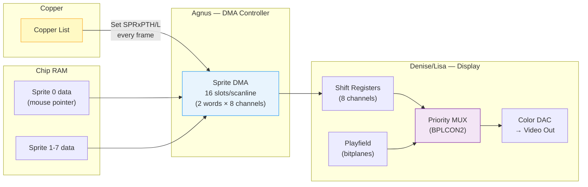
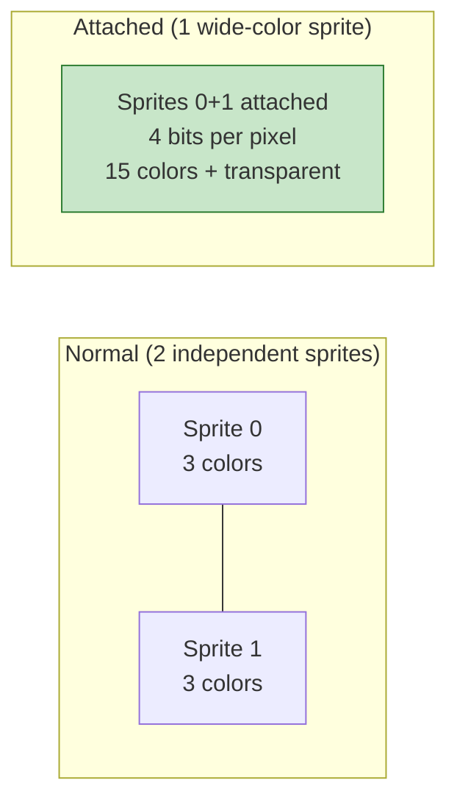
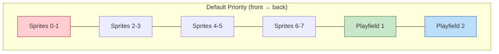
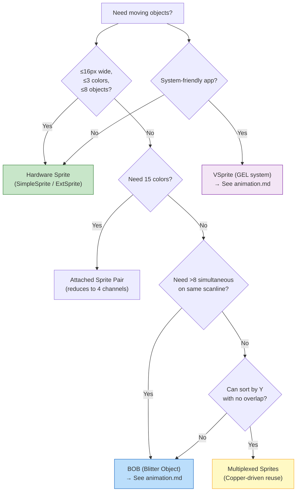
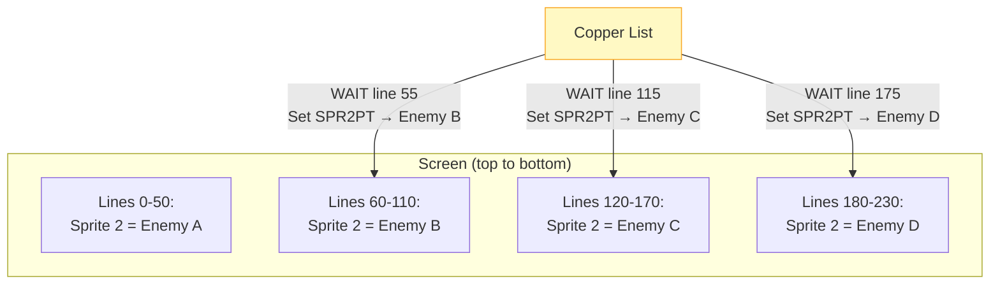

[← Home](../README.md) · [Graphics](README.md)

# Hardware Sprites — Architecture, API, and Techniques

## Why Hardware Sprites Matter

In 1985, the Amiga's sprite engine solved a problem that consumed most of its competitors' CPU budgets: **moving objects without redrawing the screen**. While the Atari ST had no sprite hardware at all and the C64's VIC-II required CPU-driven interrupt juggling, the Amiga's Denise chip composites up to 8 DMA-driven sprite channels over the playfield with **zero CPU cost**. The CPU never touches sprite pixels — Agnus fetches sprite data from Chip RAM, Denise renders it, and the Copper reloads pointers each frame. This architecture freed the 68000 to run game logic, audio mixing, and OS multitasking simultaneously.

> [!NOTE]
> **Modern analogy:** Think of hardware sprites as GPU-side instanced quads with automatic Z-compositing — the CPU submits position + texture pointer, and dedicated hardware handles all rendering. The `SimpleSprite` API maps to a GPU sprite batch submission; direct register programming maps to writing raw GPU command buffers.

### Competitive Landscape (1985–1992)

| Platform | Sprite Hardware | Width | Per-Line Limit | Colors | Multiplexing |
|---|---|---|---|---|---|
| **Amiga OCS** | 8 DMA channels (Denise) | 16px | 8 | 3 (+15 attached) | Copper-driven, unlimited vertical |
| C64 (VIC-II) | 8 hardware sprites | 24px | 8 (IRQ mux) | 3 (multicolor) | Software IRQ, limited |
| NES (PPU) | 64 OAM entries | 8px | 8 (flicker beyond) | 3 per tile | Hardware, with flicker |
| Atari ST | None | — | — | — | Software only |
| Arcade (System 16) | 128+ sprites | 8-32px | 32+/line | 15+ | Hardware ASIC |
| **Amiga AGA** | 8 DMA channels (Lisa) | 16/32/64px | 8 | 3 (+15 attached) | Same + wider fetch |

---

## Architecture Overview



---

## DMA Timing and Bus Budget

Sprite DMA occupies **dedicated time slots** in the Agnus scanline bus schedule. A *slot* (or *color clock*) is a single ~280 ns memory-access window on the Chip RAM bus — the fundamental quantum of all Amiga DMA. Each sprite channel fetches 2 words (position/control on the first line, data on subsequent lines), consuming 16 of the ~226 available DMA slots per scanline. See [DMA Architecture](../01_hardware/common/dma_architecture.md) for the complete scanline budget, bus arbitration, and bandwidth calculations.

### DMA Priority Hierarchy

```
Refresh > Disk > Audio > Sprites > Copper > Bitplane > Blitter > CPU
                         ^^^^^^^
                     16 slots guaranteed
```

Sprite DMA consumes approximately **7% of total Chip RAM bus bandwidth** at standard OCS/ECS 16px width. On AGA with 64px sprites (`SPR_FMODE=10`), this rises to **~28%** — see [AGA Sprite Enhancements](../01_hardware/aga_a1200_a4000/aga_sprites.md).

### Bitplane Stealing

> [!WARNING]
> In **6-bitplane display modes**, the expanded bitplane DMA fetch window can consume time slots normally reserved for sprites 6 and 7. This makes the highest-numbered sprite channels unreliable or invisible. In extreme overscan + 6-plane modes, sprites 4-5 can also be affected.
>
> **Rule of thumb:** If your game uses 5+ bitplanes, test sprite channels 6-7 carefully. Prefer lower-numbered channels for critical objects.

---

## Sprite DMA Data Format

Each sprite is stored as a contiguous block in Chip RAM:

```
┌──────────────────────────────────────────┐
│ Header Word 0: VSTART/HSTART            │  Position control
│ Header Word 1: VSTOP/Control/ATTACH     │
├──────────────────────────────────────────┤
│ Line 0: DATA word (bit 0 of each pixel) │  ← 16 pixels per line
│ Line 0: DATB word (bit 1 of each pixel) │
├──────────────────────────────────────────┤
│ Line 1: DATA word                       │
│ Line 1: DATB word                       │
├──────────────────────────────────────────┤
│ ...repeat for each line...              │
├──────────────────────────────────────────┤
│ Terminator: 0x0000                      │  End marker
│ Terminator: 0x0000                      │
└──────────────────────────────────────────┘
```

### Pixel Color Encoding

```
Pixel color = (DATB_bit << 1) | DATA_bit

  00 = transparent (playfield shows through)
  01 = sprite color 1
  10 = sprite color 2
  11 = sprite color 3
```

### Header Bit Layout

```
Word 0 (SPRxPOS):
  Bits 15–8: VSTART[7:0]     (vertical start line, low 8 bits)
  Bits 7–0:  HSTART[8:1]     (horizontal start, in low-res pixels ÷ 2)

Word 1 (SPRxCTL):
  Bits 15–8: VSTOP[7:0]      (vertical stop line, low 8 bits)
  Bit 3:     VSTART[8]       (bit 8 of start — for lines > 255)
  Bit 2:     VSTOP[8]        (bit 8 of stop)
  Bit 1:     HSTART[0]       (low bit of horizontal position)
  Bit 0:     ATTACH          (1 = attached to previous sprite)
```

> [!IMPORTANT]
> **Horizontal position is in low-res pixel units ÷ 2** — a sprite can only be positioned on even low-res pixel boundaries. In hires/superhires modes, this means sprites have coarser horizontal positioning than playfield pixels.

---

## Sprite Color Palette

Each pair of sprites shares 3 color registers (color 0 = transparent for all):

| Sprite Pair | Color Registers | Custom Addresses | Notes |
|---|---|---|---|
| 0–1 | `COLOR17`–`COLOR19` | `$DFF1A2`–`$DFF1A6` | Pair with mouse pointer |
| 2–3 | `COLOR21`–`COLOR23` | `$DFF1AA`–`$DFF1AE` | |
| 4–5 | `COLOR25`–`COLOR27` | `$DFF1B2`–`$DFF1B6` | |
| 6–7 | `COLOR29`–`COLOR31` | `$DFF1BA`–`$DFF1BE` | |

On AGA, sprites can draw from **any 16-color slice** of the 256-color palette via `BPLCON4` — see [AGA Sprite Enhancements](../01_hardware/aga_a1200_a4000/aga_sprites.md#bplcon4--sprite-color-bank-selection-dff10c).

---

## Attached Sprites — 15 Colors

Two sprites from the same pair can be **attached** to form a single 15-color (+ transparent) sprite:



When attached, the even sprite provides bits 0–1 and the odd sprite provides bits 2–3 of the color index. The 4-bit value indexes into color registers 16–31 (for pair 0/1).

```c
/* Enable attachment: set bit 0 of odd sprite's CTL word */
oddSpriteData[1] |= 0x0001;  /* ATTACH bit */
```

Valid attachment pairs: 0+1, 2+3, 4+5, 6+7. Attaching reduces available sprite channels from 8 to 4.

---

## Hardware Collision Detection (CLXCON / CLXDAT)

The Amiga provides **pixel-perfect hardware collision detection** between sprites and playfields via two registers:

### CLXCON — Collision Control ($DFF098, Write)

Configures which objects are tested for collision:

```
Bits 15-12: ENSP7-ENSP1    Enable sprite pair collision (odd sprites)
Bits 11-6:  ENBP6-ENBP1    Enable bitplane collision checks
Bits 5-0:   MVBP6-MVBP1    Match value for enabled bitplanes
```

### CLXDAT — Collision Data ($DFF00E, Read)

Returns collision results. **Auto-clears on read** — read once per frame:

```
Bit 14: SPR4-5 vs SPR6-7       Bit  9: SPR0-1 vs BPL (odd)
Bit 13: SPR2-3 vs SPR6-7       Bit  8: SPR0-1 vs BPL (even)
Bit 12: SPR2-3 vs SPR4-5       Bit  7: BPL (even) vs BPL (odd)
Bit 11: SPR0-1 vs SPR6-7       Bits 6-1: other sprite-vs-BPL pairs
Bit 10: SPR0-1 vs SPR4-5       Bit  0: SPR0-1 vs SPR2-3
```

### Practical Example

```c
/* Configure collision: sprite 0/1 vs bitplane 1 */
custom->clxcon = 0x0002;           /* Enable BP1, match value = 0 */

/* In game loop — read once per frame: */
UWORD coll = custom->clxdat;      /* Read & auto-clear */
if (coll & 0x0040) {
    /* Sprite 0/1 collided with bitplane 1 pixel */
    HandleCollision();
}
```

> [!NOTE]
> Hardware collision is **pixel-perfect** but provides no spatial information — you know *that* a collision occurred, not *where*. Most games supplement with software bounding-box checks for gameplay logic, using hardware collision only for effects (e.g., bullet-vs-terrain).

---

## Sprite-Playfield Priority

Sprites interact with playfields via `BPLCON2` ($DFF104):



The priority can be configured so sprites appear **between** playfields — creating depth illusions (e.g., a character walking behind foreground trees but in front of the sky).

```c
/* Make sprites appear between PF1 (front) and PF2 (back): */
custom->bplcon2 = 0x0024;  /* PF1 in front of all sprites */
```

---

## Choosing Your Sprite Strategy



---

## OS-Level Sprite API

### SimpleSprite (V33+ — All Kickstart Versions)

```c
#include <graphics/sprite.h>

struct SimpleSprite ss;
WORD sprnum;

/* Obtain a free sprite (Intuition reserves sprite 0): */
sprnum = GetSprite(&ss, -1);   /* -1 = any available */
if (sprnum >= 0)
{
    ss.x = 100;
    ss.y = 50;
    ss.height = 16;

    /* Set sprite image data (MUST be in Chip RAM): */
    ChangeSprite(NULL, &ss, spriteData);

    /* Move sprite to screen position: */
    MoveSprite(NULL, &ss, 100, 50);

    /* Release when done: */
    FreeSprite(sprnum);
}
```

### ExtSprite (V39+ — Kickstart 3.0+)

The V39 API provides tag-based sprite management with better AGA integration:

```c
#include <graphics/sprite.h>

struct ExtSprite *ext;
struct BitMap *spriteBM;  /* pre-prepared sprite bitmap */

/* Allocate ExtSprite from a BitMap: */
ext = AllocSpriteData(spriteBM,
    SPRITEA_Width, 16,
    SPRITEA_OutputHeight, 0,  /* natural height */
    TAG_DONE);

if (ext) {
    WORD num = GetExtSprite(ext, GSTAG_SPRITE_NUM, -1, TAG_DONE);
    if (num >= 0) {
        MoveSprite(NULL, (struct SimpleSprite *)ext, 120, 80);

        /* ... use sprite ... */

        FreeSprite(num);
    }
    FreeSpriteData(ext);
}
```

| Feature | `SimpleSprite` (V33) | `ExtSprite` (V39) |
|---|---|---|
| Allocation | `GetSprite()` with manual struct | `AllocSpriteData()` + `GetExtSprite()` |
| AGA width support | No | Yes (via tags) |
| Color bank control | Manual register writes | Tag-based |
| Data source | Raw word array in Chip RAM | `BitMap` structure |
| Recommended for | OCS/ECS games, simple use | AGA apps, OS-friendly code |

### Custom Mouse Pointer

```c
/* Change Intuition mouse pointer via Window: */
UWORD pointerData[] = {
    0x0000, 0x0000,   /* reserved (position) */
    0x8000, 0xC000,   /* line 0 */
    0xC000, 0xE000,   /* line 1 */
    0xE000, 0xF000,   /* line 2 */
    /* ... etc ... */
    0x0000, 0x0000    /* terminator */
};
SetPointer(window, pointerData, height, width, xOffset, yOffset);
ClearPointer(window);  /* restore system default */
```

---

## Sprite Multiplexing — Unlimited Vertical Sprites

The hardware supports 8 simultaneous sprites per scanline, but the Copper can **rearm** channels mid-frame to display many more objects:



### Multiplexing Rules

| Rule | Explanation |
|---|---|
| No vertical overlap on same channel | Two objects using the same DMA channel cannot share a scanline |
| 1-line gap required | After VSTOP, the DMA channel needs ≥1 blank line before restart |
| Copper timing | Pointer reload = WAIT + 2 MOVEs (PTH+PTL) = 3 Copper instructions |
| Max per scanline: 8 | Absolute hardware limit — 8 DMA channels, one fetch per channel per line |
| Sort objects by Y | Efficient multiplexing requires Y-sorted sprite lists |

---

## Advanced Techniques (Demoscene & Gamedev)

### Horizontal Sprite Reuse — "Chasing the Raster"

By updating `SPRxPOS` and the data pointer **mid-scanline** via tightly-timed Copper instructions, the same sprite channel can appear at multiple horizontal positions on a single line. The Copper "chases" the raster beam across the screen:

```asm
; Copper list: display sprite 0 at three horizontal positions on line 100
    dc.w    $6401,$FFFE     ; WAIT for line $64 (100), hpos $01
    dc.w    SPR0POS,$6440   ; position at H=$40
    dc.w    $6481,$FFFE     ; WAIT same line, hpos $81
    dc.w    SPR0POS,$6480   ; reposition at H=$80
    dc.w    $64C1,$FFFE     ; WAIT same line, hpos $C1
    dc.w    SPR0POS,$64C0   ; reposition at H=$C0
```

This technique was used in *Jim Power* to create pseudo-playfield background layers from sprite channels, freeing all bitplanes for the scrolling foreground.

### Color Multiplexing

The Copper can update sprite **color registers** per-scanline, giving different colors to each vertical zone of a multiplexed sprite:

```asm
; Change sprite 0-1 colors at line 100
    dc.w    $6401,$FFFE         ; WAIT line 100
    dc.w    COLOR17,$0F00       ; red
    dc.w    $C801,$FFFE         ; WAIT line 200
    dc.w    COLOR17,$00F0       ; green
```

### Sprite-as-Playfield

Using all 8 sprite channels horizontally multiplexed creates a full-width pseudo-playfield layer with independent scrolling — zero bitplane cost. Limited to sprite color depth (3 or 15 colors) and requires extensive Copper list bandwidth.

---

## Real-World Use Cases

| Game / Demo | Technique | What It Achieved |
|---|---|---|
| *Shadow of the Beast* | Multiplexing + priority layering | Moon/foreground objects behind 12-layer parallax |
| *Jim Power* | Sprite-as-playfield (horizontal reuse) | Background layers from sprite channels, freeing bitplanes |
| *Lionheart* | Full chipset integration | Sprites for player/enemies, blitter for large terrain objects |
| *State of the Art* (demo) | Horizontal + color multiplexing | Unprecedented visual complexity from 8 channels |
| *Workbench* | Sprite 0 via Intuition | System mouse pointer — `SetPointer()` / `ClearPointer()` |
| *Pinball Dreams* | Minimal sprite use | Ball and flippers as sprites; table as blitter-scrolled bitmap |

---

## ECS and AGA Enhancements

The sprite subsystem was significantly enhanced across chipset generations:

### ECS (Denise 8373)

| Feature | Register | Effect |
|---|---|---|
| Border sprites | `BPLCON3` bit 3 (`BRDSPRT`) | Sprites visible in overscan border area |
| Independent resolution | `BPLCON3` bits 7-6 (`SPRES`) | Lores/hires/shres pixel width independent of playfield |
| Color bank prep | `BPLCON3` bits 15-13 | Upper bits of color index (used by AGA) |

→ Full register details: **[ECS Sprite Enhancements](../01_hardware/ecs_a600_a3000/ecs_sprites.md)**

### AGA (Lisa)

| Feature | Register | Effect |
|---|---|---|
| 32/64px width | `FMODE` bits 15-14 (`SPR_FMODE`) | Global sprite width: 16, 32, or 64 pixels |
| Color bank (even) | `BPLCON4` bits 7-4 (`ESPRM`) | Even channels use any 16-color slice of 256 |
| Color bank (odd) | `BPLCON4` bits 3-0 (`OSPRM`) | Odd channels use a different slice |
| Scan doubling | `SSCAN2` | Vertical doubling for 31kHz display modes |

→ Full register details, DMA format changes, alignment: **[AGA Sprite Enhancements](../01_hardware/aga_a1200_a4000/aga_sprites.md)**

---

## Named Antipatterns

### "The Stolen Pointer"

Writing directly to `SPR0PTH/L` while Intuition owns sprite 0 for the mouse pointer. The OS will immediately overwrite your pointer on the next VBlank, and you'll corrupt the mouse display.

```c
/* ✗ BAD — conflicts with Intuition's mouse pointer */
custom->sprpt[0] = (ULONG)mySpriteData;

/* ✓ GOOD — use the OS API, or use sprite 1-7 */
WORD num = GetSprite(&ss, 2);  /* request specific channel 2 */
```

### "The Fast RAM Trap"

Allocating sprite data in Fast RAM. The DMA engine can **only** access Chip RAM — sprite data in Fast RAM is invisible to the hardware.

```c
/* ✗ BAD — Fast RAM is default on accelerated machines */
UWORD *data = AllocMem(size, MEMF_ANY);

/* ✓ GOOD — always specify MEMF_CHIP for DMA-accessed data */
UWORD *data = AllocMem(size, MEMF_CHIP | MEMF_CLEAR);
```

### "The Phantom Sprite"

Not reloading sprite pointers every frame. After the sprite DMA finishes displaying one frame's data, the pointer is left pointing past the terminator. If not reloaded by the Copper before the next frame, DMA reads **whatever follows in memory** — producing random garbage sprites.

```asm
; ✗ BAD — pointer set once, never refreshed
    move.l  #SprData, SPR2PTH+$DFF000

; ✓ GOOD — Copper list reloads pointer every frame
CopperList:
    dc.w    SPR2PTH, (SprData>>16)&$FFFF
    dc.w    SPR2PTL, SprData&$FFFF
```

### "The Missing Terminator"

Forgetting the `$0000/$0000` end marker in sprite data. Without it, the DMA engine reads past the sprite data into whatever follows in memory, potentially producing a tall strip of garbage down the screen.

### "The Color Bleed"

Not realizing that sprite pairs **share** 3 color registers. Changing colors for sprite 2 also changes sprite 3's colors — they use the same `COLOR21-23` registers.

```c
/* Setting COLOR21 affects BOTH sprite 2 AND sprite 3: */
custom->color[21] = 0x0F00;  /* both sprites now use red as color 1 */
```

---

## FPGA / Emulation Implementation Notes

For FPGA core developers (MiSTer Minimig, etc.) and emulator authors:

### Sprite DMA State Machine

```
IDLE → FETCH_POS_CTL → COMPARE_VPOS → FETCH_DATA → SHIFT_OUT → END/REARM
```

- **Fetch timing:** Sprite data must be fetched **before** the horizontal position counter reaches `HSTART` — account for the 2-cycle pipeline delay between fetch and pixel output in Denise/Lisa
- **VSTOP comparison:** Must be checked **after** data fetch, not before — off-by-one errors here cause sprites to be 1 line too tall or short
- **Terminator detection:** The `$0000/$0000` terminator is detected by the DMA controller, not Denise — it prevents further fetches until the pointer is reloaded

### Common FPGA Bugs

| Bug | Symptom | Root Cause |
|---|---|---|
| Sprite priority inversion | Sprite 4 appears in front of sprite 0 | Priority encoder bit ordering reversed |
| Attached mode color index off-by-one | Colors shifted by 1 in attached mode | Even/odd bit concatenation order wrong |
| Missing 1-line gap | Multiplexed sprites overlap | VSTOP comparison doesn't account for DMA prefetch cycle |
| AGA width mode corruption | Garbage pixels at 32/64px | FMODE not applied to DMA fetch state machine |

### Reference Implementations

- **Minimig AGA**: `denise.v` (sprite shift registers, collision), `agnus.v` (DMA slot allocation) — [GitHub](https://github.com/MiSTer-devel/Minimig-AGA_MiSTer)

---

## Sprite Pointer Registers

| Register | Address | Sprite |
|---|---|---|
| `SPR0PTH/L` | `$DFF120–$DFF123` | Sprite 0 (mouse pointer) |
| `SPR1PTH/L` | `$DFF124–$DFF127` | Sprite 1 |
| `SPR2PTH/L` | `$DFF128–$DFF12B` | Sprite 2 |
| `SPR3PTH/L` | `$DFF12C–$DFF12F` | Sprite 3 |
| `SPR4PTH/L` | `$DFF130–$DFF133` | Sprite 4 |
| `SPR5PTH/L` | `$DFF134–$DFF137` | Sprite 5 |
| `SPR6PTH/L` | `$DFF138–$DFF13B` | Sprite 6 |
| `SPR7PTH/L` | `$DFF13C–$DFF13F` | Sprite 7 |

These must be set **every frame** — typically by the Copper list during vertical blank. See antipattern ["The Phantom Sprite"](#the-phantom-sprite).

---

## References

- *Amiga Hardware Reference Manual* — Sprites chapter, DMA time slot allocation (Figure 6-9)
- NDK39: `graphics/sprite.h`, `hardware/custom.h`
- ADCD 2.1: `GetSprite`, `MoveSprite`, `ChangeSprite`, `FreeSprite`, `AllocSpriteData`, `GetExtSprite`
- Phaze101 — *Amiga 68000 Assembly Course* Chapter 7 (sprite programming tutorial)
- ChibiAkumas — *68000 Assembly Lessons* (sprite and blitter tutorials)
- Codetapper — Game reverse engineering analyses (Jim Power, Lionheart)

## See Also

- [OCS Sprite Hardware](../01_hardware/ocs_a500/sprites.md) — register-level reference (SPRxPOS/CTL/DATA)
- [ECS Sprite Enhancements](../01_hardware/ecs_a600_a3000/ecs_sprites.md) — border sprites, SPRES, color bank
- [AGA Sprite Enhancements](../01_hardware/aga_a1200_a4000/aga_sprites.md) — FMODE width, BPLCON4 palette banks
- [Copper Programming](copper_programming.md) — Copper-driven sprite multiplexing
- [Animation & GEL System](animation.md) — VSprites, BOBs, AnimObs (higher-level sprite abstractions)
- [Memory Types](../01_hardware/common/memory_types.md) — why sprite data must reside in Chip RAM
- [DMA Architecture](../01_hardware/common/dma_architecture.md) — scanline slot allocation, bus arbitration, bandwidth calculations
