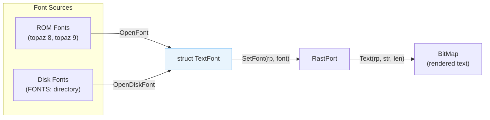

[← Home](../README.md) · [Graphics](README.md)

# Text and Fonts — TextFont, TextAttr, Rendering

## Overview

AmigaOS uses **bitmap fonts** rendered through `graphics.library`. Each font character is stored as a strip of pixels in a single bitmap. Fonts can be ROM-resident (topaz — always available), loaded from disk via `diskfont.library`, or generated algorithmically (bold, italic, underline).



---

## Key Structures

```c
/* graphics/text.h — NDK39 */

/* Font request — describes what you want: */
struct TextAttr {
    STRPTR  ta_Name;    /* font name, e.g. "topaz.font" */
    UWORD   ta_YSize;   /* desired height in pixels */
    UBYTE   ta_Style;   /* FSF_BOLD, FSF_ITALIC, FSF_UNDERLINED */
    UBYTE   ta_Flags;   /* FPF_ROMFONT, FPF_DISKFONT, etc. */
};

/* Loaded font instance: */
struct TextFont {
    struct Message tf_Message;    /* standard message header */
    UWORD   tf_YSize;      /* actual font height */
    UBYTE   tf_Style;      /* styles this font has built-in */
    UBYTE   tf_Flags;
    UWORD   tf_XSize;      /* nominal character width */
    UWORD   tf_Baseline;   /* pixels from top to baseline */
    UWORD   tf_BoldSmear;  /* extra pixels for algorithmic bold */
    UWORD   tf_Accessors;  /* current open count */
    UBYTE   tf_LoChar;     /* first character code (usually 32) */
    UBYTE   tf_HiChar;     /* last character code (usually 127 or 255) */
    APTR    tf_CharData;   /* bitmap strip containing all glyphs */
    UWORD   tf_Modulo;     /* bytes per row of font bitmap */
    APTR    tf_CharLoc;    /* location table: offset + width per char */
    APTR    tf_CharSpace;  /* proportional spacing table (NULL = fixed) */
    APTR    tf_CharKern;   /* kerning adjustment table (NULL = none) */
};
```

### Font Bitmap Layout

All characters are stored in a single bitmap strip. The `tf_CharLoc` table tells the renderer where each character starts:

```
tf_CharData bitmap:
┌──┬───┬──┬───┬──┬──┬───────────────────┐
│A │ B │C │ D │E │F │ ... all chars ...  │
└──┴───┴──┴───┴──┴──┴───────────────────┘

tf_CharLoc[ch - tf_LoChar]:
  bits 31–16 = bit offset into tf_CharData
  bits 15–0  = character width in pixels

tf_CharSpace[ch - tf_LoChar]:
  spacing advance (proportional fonts)
```

---

## Opening Fonts

```c
/* ROM font (topaz — always available, no disk access): */
struct TextAttr ta = {"topaz.font", 8, 0, FPF_ROMFONT};
struct TextFont *font = OpenFont(&ta);

/* Disk font (requires diskfont.library): */
struct Library *DiskfontBase = OpenLibrary("diskfont.library", 0);
struct TextAttr ta2 = {"helvetica.font", 24, 0, FPF_DISKFONT};
struct TextFont *font2 = OpenDiskFont(&ta2);

/* Request with style (may get algorithmically generated): */
struct TextAttr ta3 = {"topaz.font", 8, FSF_BOLD, FPF_ROMFONT};
struct TextFont *bold = OpenFont(&ta3);

/* Assign to RastPort: */
SetFont(rp, font);

/* Close when done: */
CloseFont(font);
```

---

## Rendering Text

```c
/* Position cursor then render: */
Move(rp, 10, 20 + rp->Font->tf_Baseline);  /* baseline-relative! */
Text(rp, "Hello Amiga", 11);

/* Measure width before rendering (for centering/alignment): */
UWORD width = TextLength(rp, "Hello Amiga", 11);

/* Centre text: */
WORD centreX = (screenWidth - width) / 2;
Move(rp, centreX, 100);
Text(rp, "Hello Amiga", 11);

/* Pixel-perfect extent info: */
struct TextExtent te;
TextExtent(rp, "Hello", 5, &te);
/* te.te_Width  = total pixel width */
/* te.te_Height = total pixel height */
/* te.te_Extent = bounding rectangle */
```

> [!IMPORTANT]
> `Text()` renders at the **current pen position**, which should be at the font's **baseline** — not the top of the character. The baseline offset is `font->tf_Baseline` pixels below the top.

---

## Algorithmic Styles

```c
/* Style flags: */
#define FSF_UNDERLINED  0x01
#define FSF_BOLD        0x02
#define FSF_ITALIC      0x04
#define FSF_EXTENDED    0x08

/* Ask which styles this font supports algorithmically: */
UWORD supported = AskSoftStyle(rp);

/* Apply bold + italic: */
SetSoftStyle(rp, FSF_BOLD | FSF_ITALIC, supported);
Text(rp, "Bold Italic Text", 16);

/* Reset to normal: */
SetSoftStyle(rp, 0, supported);
```

| Style | Method | Notes |
|---|---|---|
| Bold | Smear right by `tf_BoldSmear` | Characters become slightly wider |
| Italic | Shear top scanlines right | Fixed-angle slant |
| Underline | Draw line at descender level | 1-pixel line below baseline |
| Extended | Widen each character | Rarely used |

---

## Available Font Lists

```c
/* List all fonts available on FONTS: */
struct AvailFontsHeader *afh;
LONG bufSize = 4096;
do {
    afh = AllocMem(bufSize, MEMF_ANY);
    LONG shortBy = AvailFonts((STRPTR)afh, bufSize,
                               AFF_DISK | AFF_MEMORY | AFF_SCALED);
    if (shortBy > 0) {
        FreeMem(afh, bufSize);
        bufSize += shortBy;
        afh = NULL;
    }
} while (!afh);

struct AvailFonts *af = &afh->afh_AF;
for (int i = 0; i < afh->afh_NumEntries; i++)
{
    Printf("Font: %s, size %ld, type %s\n",
           af[i].af_Attr.ta_Name,
           af[i].af_Attr.ta_YSize,
           (af[i].af_Type & AFF_DISK) ? "disk" : "ROM");
}
FreeMem(afh, bufSize);
```

---

## Font Preferences

The system font can be changed via Preferences. Applications should respect the user's choice:

```c
/* Get the current screen font (user's preference): */
struct TextAttr *screenFont;
struct Preferences prefs;
GetPrefs(&prefs, sizeof(prefs));
/* prefs contains font info */

/* Better: use the screen's font directly: */
struct TextFont *scrFont = screen->RastPort.Font;
SetFont(myRastPort, scrFont);
```

---

## References

- NDK39: `graphics/text.h`, `graphics/rastport.h`
- ADCD 2.1: `OpenFont`, `OpenDiskFont`, `SetFont`, `Text`, `TextLength`
- See also: [diskfont.md](../11_libraries/diskfont.md) — disk font loading
- See also: [rastport.md](rastport.md) — RastPort text rendering context
