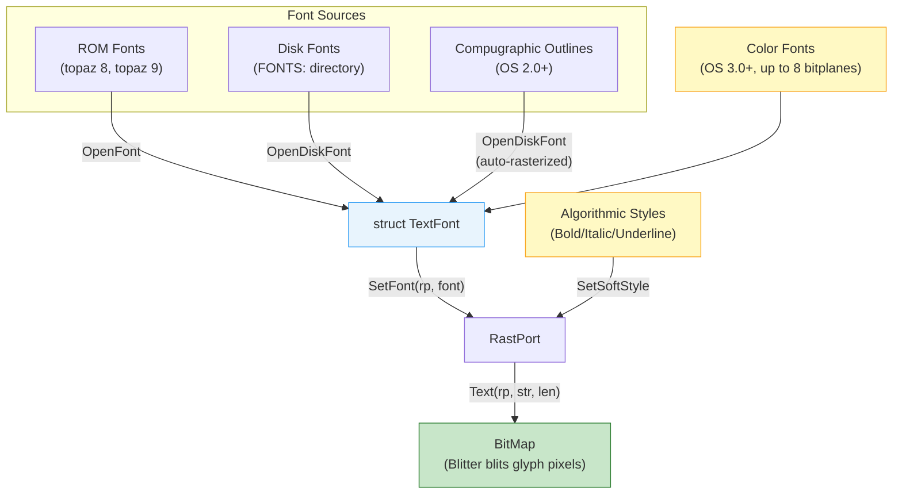
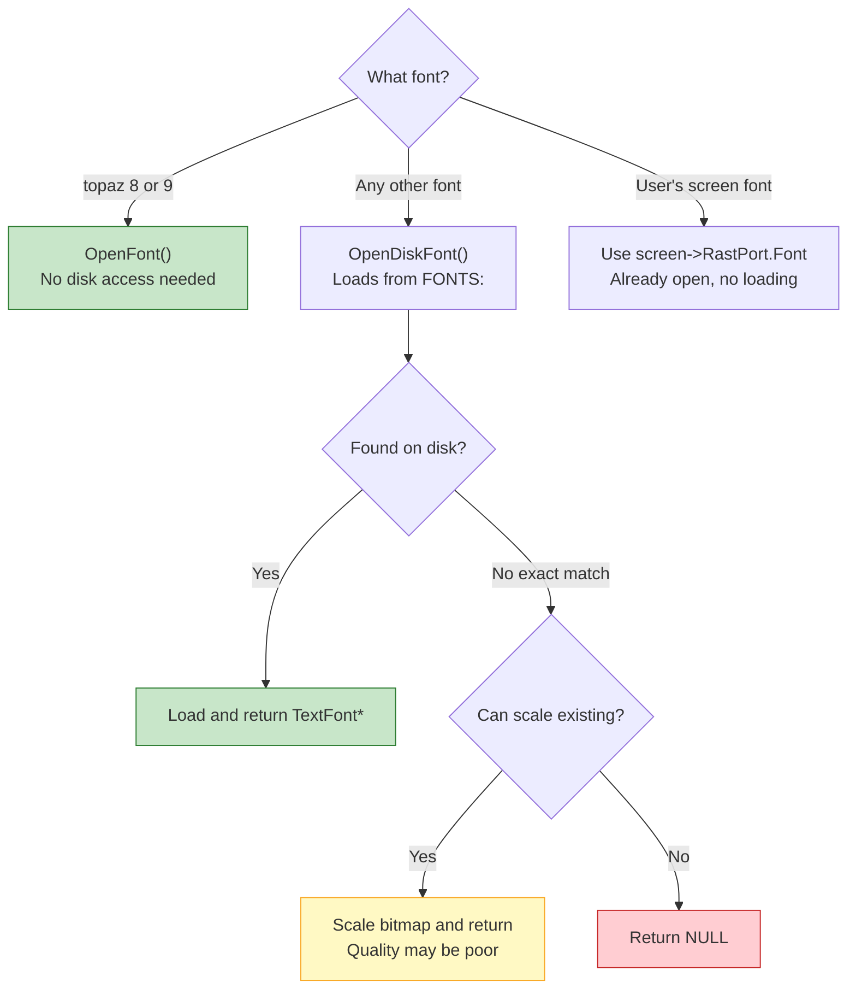

[← Home](../README.md) · [Graphics](README.md)

# Text and Fonts — TextFont, TextAttr, Rendering

## Overview

AmigaOS renders all text through **bitmap fonts** — each glyph is a pre-drawn grid of pixels stored in a single monolithic bitmap strip. The `graphics.library` `Text()` function blits these glyph pixels to the screen via the Blitter, making text rendering essentially free in CPU terms. This was a deliberate design: a 7 MHz 68000 could not rasterize TrueType curves at interactive speeds, so the Amiga pre-rendered everything.

Two fonts live in ROM — **topaz 8** and **topaz 9** — available instantly at boot with no disk access. Every other font (helvetica, times, courier, garnet, sapphire, third-party) lives on disk under the `FONTS:` assign and must be loaded via [diskfont.library](../11_libraries/diskfont.md).



---

## Key Structures

```c
/* graphics/text.h — NDK39 */

/* Font request — describes what you want: */
struct TextAttr {
    STRPTR  ta_Name;    /* font name, e.g. "topaz.font" */
    UWORD   ta_YSize;   /* desired height in pixels */
    UBYTE   ta_Style;   /* FSF_BOLD, FSF_ITALIC, FSF_UNDERLINED */
    UBYTE   ta_Flags;   /* FPF_ROMFONT, FPF_DISKFONT, FPF_PROPORTIONAL, etc. */
};

/* Loaded font instance: */
struct TextFont {
    struct Message tf_Message;    /* standard message header */
    UWORD   tf_YSize;      /* actual font height */
    UBYTE   tf_Style;      /* styles this font has built-in */
    UBYTE   tf_Flags;      /* FPF_ROMFONT, FPF_DISKFONT, FPF_PROPORTIONAL, etc. */
    UWORD   tf_XSize;      /* nominal character width */
    UWORD   tf_Baseline;   /* pixels from top to baseline */
    UWORD   tf_BoldSmear;  /* extra pixels for algorithmic bold */
    UWORD   tf_Accessors;  /* current open count */
    UBYTE   tf_LoChar;     /* first character code (usually 32) */
    UBYTE   tf_HiChar;     /* last character code (usually 127 or 255) */
    APTR    tf_CharData;   /* bitmap strip containing all glyphs */
    UWORD   tf_Modulo;     /* bytes per row of font bitmap */
    APTR    tf_CharLoc;    /* location table: offset + width per char */
    APTR    tf_CharSpace;  /* proportional spacing table (NULL = fixed) */
    APTR    tf_CharKern;   /* kerning adjustment table (NULL = none) */
};
```

### Field Reference

| Field | Purpose | Important Notes |
|-------|---------|----------------|
| `tf_YSize` | Font height in pixels | Amiga "point size" = pixel height, not typographic points |
| `tf_Baseline` | Distance from top to baseline | Position text here — not at the top of the cell |
| `tf_BoldSmear` | Pixels to smear for algorithmic bold | Usually 1; affects rendered width |
| `tf_LoChar` / `tf_HiChar` | Character range (typically 32–127 or 32–255) | Characters outside range render as default glyph |
| `tf_CharData` | Pointer to the monolithic glyph bitmap strip | 1 bitplane for monochrome; multiple for ColorFont |
| `tf_CharLoc` | Array of `{offset, width}` pairs, one per character | `ULONG` per char: high word = bit offset, low word = pixel width |
| `tf_CharSpace` | Per-character horizontal advance | `NULL` means fixed-width (`tf_XSize` used for all) |
| `tf_CharKern` | Per-character kerning offset | `NULL` means no kerning |

### Font Bitmap Layout

All characters are stored in a single bitmap strip. The `tf_CharLoc` table tells the renderer where each character starts:

```
tf_CharData bitmap:
┌──┬───┬──┬───┬──┬──┬───────────────────┐
│A │ B │C │ D │E │F │ ... all chars ... │
└──┴───┴──┴───┴──┴──┴───────────────────┘

tf_CharLoc[ch - tf_LoChar]:
  bits 31–16 = bit offset into tf_CharData
  bits 15–0  = character width in pixels

tf_CharSpace[ch - tf_LoChar]:
  spacing advance (proportional fonts)
```

---

## Opening and Closing Fonts

### Font Opening Decision Guide



### Code Examples

```c
/* ROM font (topaz — always available, no disk access): */
struct TextAttr ta = {"topaz.font", 8, 0, FPF_ROMFONT};
struct TextFont *font = OpenFont(&ta);

/* Disk font (requires diskfont.library): */
struct Library *DiskfontBase = OpenLibrary("diskfont.library", 0);
struct TextAttr ta2 = {"helvetica.font", 24, 0, FPF_DISKFONT};
struct TextFont *font2 = OpenDiskFont(&ta2);

/* Request with style (may get algorithmically generated): */
struct TextAttr ta3 = {"topaz.font", 8, FSF_BOLD, FPF_ROMFONT};
struct TextFont *bold = OpenFont(&ta3);

/* Use the screen's current font (respects user preferences): */
struct TextFont *scrFont = screen->RastPort.Font;
SetFont(rp, scrFont);
```

### Font Flags

| Flag | Meaning | Notes |
|------|---------|-------|
| `FPF_ROMFONT` | Font lives in ROM | Only topaz 8 and topaz 9 |
| `FPF_DISKFONT` | Font loaded from disk | Requires diskfont.library |
| `FPF_PROPORTIONAL` | Variable-width characters | `tf_CharSpace != NULL` |
| `FPF_DESIGNED` | Explicitly designed at this size | Set by the font designer; if absent, font was auto-scaled |
| `FPF_TALLDOT` | Designed for HiRes (640×200 NTSC non-interlaced) | Taller pixel aspect |
| `FPF_WIDEDOT` | Designed for LoRes interlaced (320×400 NTSC) | Wider pixel aspect |
| `FPF_REVPATH` | Right-to-left rendering | For Hebrew, Arabic |

---

## Rendering Text

### Draw Mode Effects on Text

| Draw Mode | Effect on Text | FgPen | BgPen |
|-----------|---------------|-------|-------|
| `JAM1` | Draw foreground only — transparent background | Used | Ignored |
| `JAM2` | Draw foreground + solid background | Used | Used |
| `COMPLEMENT` | XOR text with destination | Ignored | Ignored |
| `INVERSVID` | Invert video (swap fg/bg roles) | Modifier | Modifier |

```c
/* Position cursor then render: */
Move(rp, 10, 20 + rp->Font->tf_Baseline);  /* baseline-relative! */
Text(rp, "Hello Amiga", 11);

/* Measure width before rendering (for centering/alignment): */
UWORD width = TextLength(rp, "Hello Amiga", 11);

/* Centre text: */
WORD centreX = (screenWidth - width) / 2;
Move(rp, centreX, 100);
Text(rp, "Hello Amiga", 11);

/* Pixel-perfect extent info: */
struct TextExtent te;
TextExtent(rp, "Hello", 5, &te);
/* te.te_Width  = total pixel width */
/* te.te_Height = total pixel height */
/* te.te_Extent = bounding rectangle */
```

> [!IMPORTANT]
> `Text()` renders at the **current pen position**, which should be at the font's **baseline** — not the top of the character. The baseline offset is `font->tf_Baseline` pixels below the top. If you position at the top instead, descenders (g, j, p, q, y) will clip.

### Rendering API Reference

| Function | Library | Purpose |
|----------|---------|---------|
| `Text()` | graphics | Render `count` characters at current position |
| `TextLength()` | graphics | Return pixel width of a string (no rendering) |
| `TextExtent()` | graphics | Return width, height, and bounding rect |
| `TextFit()` | graphics | Max characters that fit in a given width |
| `SetFont()` | graphics | Set the RastPort's current font |
| `OpenFont()` | graphics | Open a font already in system memory |
| `CloseFont()` | graphics | Release a font (decrement accessor count) |
| `OpenDiskFont()` | diskfont | Load a font from disk (or system memory) |
| `AvailFonts()` | diskfont | Enumerate all available fonts |

---

## Algorithmic Styles

When a font doesn't have a built-in bold/italic variant, the Amiga can generate these styles **algorithmically** at render time:

```c
/* Style flags: */
#define FSF_UNDERLINED  0x01
#define FSF_BOLD        0x02
#define FSF_ITALIC      0x04
#define FSF_EXTENDED    0x08

/* Ask which styles this font supports algorithmically: */
UWORD supported = AskSoftStyle(rp);

/* Apply bold + italic: */
SetSoftStyle(rp, FSF_BOLD | FSF_ITALIC, supported);
Text(rp, "Bold Italic Text", 16);

/* Reset to normal: */
SetSoftStyle(rp, 0, supported);
```

| Style | Method | Visual Effect | Performance Impact |
|-------|--------|--------------|-------------------|
| Bold | Smear right by `tf_BoldSmear` pixels | Characters become slightly wider | Negligible — extra blit per scanline |
| Italic | Shear top scanlines right | Fixed-angle slant (\~12°) | Negligible — per-scanline offset |
| Underline | Draw 1-pixel line at descender level | Line below baseline | Negligible — one extra line draw |
| Extended | Widen each character by 50% | Extra-wide spacing | Moderate — affects spacing calculation |

> [!NOTE]
> Algorithmic styles work on **any** bitmap font. The `AskSoftStyle()` function returns which styles are supported — always check before applying. All four basic styles are supported by the standard renderer.

---

## Color Fonts (OS 3.0+)

OS 3.0 extended bitmap fonts with **multi-bitplane color support**. Instead of a single bitplane (1-bit: foreground or background), color fonts store up to 8 bitplanes per glyph, enabling 256-color text:

```c
/* graphics/text.h — NDK39 */
struct ColorTextFont {
    struct TextFont ctf_TF;          /* standard TextFont (must be first!) */
    UWORD   ctf_Flags;              /* CT_COLORFONT, CT_GREYFONT */
    UBYTE   ctf_Depth;              /* number of bitplanes (1–8) */
    UBYTE   ctf_FgColor;            /* default foreground pen */
    UBYTE   ctf_Low;                /* lowest color register used */
    UBYTE   ctf_High;               /* highest color register used */
    APTR    ctf_PlanePick;          /* plane selection for rendering */
    APTR    ctf_PlaneOnOff;         /* plane on/off masks */
    struct ColorFontColors *ctf_ColorTable;
    APTR    ctf_CharData[8];        /* per-plane glyph data pointers */
};
```

```
Traditional font:  1 bitplane  → FgPen or BgPen only
Color font:        up to 8 bitplanes → 256 colors per glyph pixel

Per-plane glyph storage:
┌─────────────────┐
│ ctf_CharData[0] │  bitplane 0 (LSB)
├─────────────────┤
│ ctf_CharData[1] │  bitplane 1
├─────────────────┤
│ ...             │  ...
├─────────────────┤
│ ctf_CharData[N] │  bitplane N
└─────────────────┘
Each plane is a separate bitmap strip, same layout as tf_CharData.
ctf_ColorTable maps pen indices to screen palette entries.
```

> [!WARNING]
> Color fonts require **Chip RAM** for all glyph data planes. A 24-pixel color font at 8 bitplanes uses **8×** the memory of a monochrome bitmap font. On a 512 KB Chip RAM system, loading multiple color fonts can exhaust memory fast.

Color fonts render automatically with `Text()` — the renderer detects `FPF_COLORFONT` in `tf_Flags` and uses the multi-plane blit path. No special code is needed.

---

## Compugraphic Outline Fonts (OS 2.0+)

OS 2.0 added support for **AGFA Compugraphic** outline fonts via `diskfont.library`. These store mathematical curve descriptions instead of pre-drawn pixels. From the programmer's perspective, they work identically to bitmap fonts — `OpenDiskFont()` handles rasterization internally:

```c
/* Same API — diskfont.library auto-detects outline vs bitmap: */
struct TextAttr ta = {"CGTriumvirate.font", 36, 0, 0};
struct TextFont *outlineFont = OpenDiskFont(&ta);
/* If no 36-pixel bitmap exists but a CG outline does,
   diskfont.library rasterizes it to a bitmap automatically */
```

| Aspect | Bitmap Font | Compugraphic Outline |
|--------|-------------|---------------------|
| Source | Pre-drawn pixels per size | Mathematical curves |
| Scaling | Distorts at non-designed sizes | Clean at any size |
| File format | `.font` + numbered descriptor files | `.font` with outline data |
| API difference | None — same `OpenDiskFont()` | None — transparent to application |
| Speed | Instant (blit pixels) | Slower (first rasterize, then blit) |
| Availability | OS 1.0+ | OS 2.0+ (requires `diskfont.library` V36+) |

> [!NOTE]
> Compugraphic outlines are **not** TrueType or PostScript. They are AGFA's proprietary curve format. The Amiga never gained native TrueType support; third-party libraries (like TrueDot) filled this gap.

---

## Font Scaling and Aspect Ratio

When `OpenDiskFont()` can't find an exact size match, it scales an existing bitmap. This produces usable but not beautiful results:

```c
/* Request a size that doesn't exist on disk: */
struct TextAttr ta = {"topaz.font", 15, 0, 0};
/* diskfont.library scales topaz 8 or topaz 9 to 15 pixels */
/* Result: usable but slightly blurry or jagged */
struct TextFont *scaled = OpenDiskFont(&ta);
```

The `FPF_DESIGNED` flag in `tf_Flags` indicates whether the font was explicitly designed at this size (clear) or auto-scaled (set). Always check:

```c
if (font->tf_Flags & FPF_DESIGNED) {
    /* This size was designed — crisp rendering */
} else {
    /* Auto-scaled — may look rough at large sizes */
}
```

### Aspect Ratio Mismatch

Fonts designed for one display mode may look wrong on another:

| Source Mode | Target Mode | Visual Effect |
|-------------|-------------|--------------|
| LoRes 320×256 | HiRes 640×256 | Font appears half-width (compressed) |
| HiRes 640×256 | LoRes 320×256 | Font appears double-width (stretched) |
| Non-interlaced | Interlaced | Font appears half-height (thin) |
| Interlaced | Non-interlaced | Font appears double-height (fat) |

The `FPF_TALLDOT` and `FPF_WIDEDOT` flags indicate which pixel aspect the font was designed for. Check these when rendering across different screen modes.

---

## Available Font Lists

```c
/* List all fonts available on FONTS: */
struct AvailFontsHeader *afh;
LONG bufSize = 4096;
do {
    afh = AllocMem(bufSize, MEMF_ANY);
    LONG shortBy = AvailFonts((STRPTR)afh, bufSize,
                               AFF_DISK | AFF_MEMORY | AFF_SCALED);
    if (shortBy > 0) {
        FreeMem(afh, bufSize);
        bufSize += shortBy;
        afh = NULL;
    }
} while (!afh);

struct AvailFonts *af = &afh->afh_AF;
for (int i = 0; i < afh->afh_NumEntries; i++)
{
    Printf("Font: %s, size %ld, type %s\n",
           af[i].af_Attr.ta_Name,
           af[i].af_Attr.ta_YSize,
           (af[i].af_Type & AFF_DISK) ? "disk" : "ROM");
}
FreeMem(afh, bufSize);
```

---

## Practical Cookbooks

### Cookbook: Centered Title Bar

```c
void DrawCenteredTitle(struct RastPort *rp, const char *title,
                       UWORD width, UWORD y)
{
    struct TextFont *font = rp->Font;
    UWORD textW = TextLength(rp, title, strlen(title));
    WORD x = (width - textW) / 2;

    SetDrMd(rp, JAM1);
    SetAPen(rp, 1);  /* foreground */
    Move(rp, x, y + font->tf_Baseline);
    Text(rp, title, strlen(title));
}
```

### Cookbook: Multi-Font Label + Value

```c
void DrawLabelValue(struct RastPort *rp,
                    struct TextFont *labelFont,
                    struct TextFont *valueFont,
                    const char *label, const char *value,
                    UWORD x, UWORD y)
{
    /* Draw label in small font */
    SetFont(rp, labelFont);
    SetAPen(rp, 2);
    SetDrMd(rp, JAM1);
    Move(rp, x, y + labelFont->tf_Baseline);
    Text(rp, label, strlen(label));

    /* Draw value in large font, right after label */
    UWORD labelW = TextLength(rp, label, strlen(label));
    SetFont(rp, valueFont);
    SetAPen(rp, 1);
    Move(rp, x + labelW + 4, y + valueFont->tf_Baseline);
    Text(rp, value, strlen(value));
}
```

### Cookbook: Word-Wrap Text Block

```c
/* Returns the number of lines rendered */
UWORD DrawWrappedText(struct RastPort *rp, const char *text,
                      UWORD maxWidth, UWORD startX, UWORD startY)
{
    struct TextFont *font = rp->Font;
    UWORD y = startY;
    UWORD lineH = font->tf_YSize + 1;  /* +1 for line spacing */
    const char *lineStart = text;
    const char *wordStart = text;
    const char *bestBreak = text;

    while (*wordStart)
    {
        /* Skip to end of word */
        const char *wordEnd = wordStart;
        while (*wordEnd && *wordEnd != ' ' && *wordEnd != '\n') wordEnd++;

        /* Measure from lineStart to wordEnd */
        UWORD w = TextLength(rp, lineStart, wordEnd - lineStart);

        if (w > maxWidth && bestBreak > lineStart)
        {
            /* Break at the last good position */
            Move(rp, startX, y + font->tf_Baseline);
            Text(rp, lineStart, bestBreak - lineStart);
            y += lineH;
            lineStart = bestBreak + 1;  /* skip the space */
            bestBreak = lineStart;
        }
        else
        {
            bestBreak = wordEnd;
        }

        if (*wordEnd == '\n')
        {
            Move(rp, startX, y + font->tf_Baseline);
            Text(rp, lineStart, wordEnd - lineStart);
            y += lineH;
            lineStart = wordEnd + 1;
            bestBreak = lineStart;
            wordEnd++;
        }

        wordStart = wordEnd;
        while (*wordStart == ' ') wordStart++;
    }

    /* Final line */
    if (lineStart < wordStart)
    {
        Move(rp, startX, y + font->tf_Baseline);
        Text(rp, lineStart, strlen(lineStart));
        y += lineH;
    }

    return (y - startY) / lineH;
}
```

---

## Historical Context & Modern Analogies

### Competitive Landscape

| Platform | Font System | Scalable? | Color Fonts? | Max Glyph Quality |
|----------|-------------|-----------|-------------|-------------------|
| **AmigaOS 1.x** | Bitmap (graphics.library) | No | No | Fixed-size pixel glyphs |
| **AmigaOS 2.0+** | Bitmap + Compugraphic outlines | Yes (outlines) | No | Scalable via curves |
| **AmigaOS 3.0+** | Bitmap + outlines + ColorFont | Yes | Yes (up to 8 planes) | Multi-color pixel glyphs |
| **Mac System 1–6** | Bitmap "suitcase" + FOND resources | No | No | 72 DPI assumption |
| **Mac System 7 (1991)** | TrueType + bitmap fallbacks | Yes | No | Full curve rasterization |
| **Windows 3.0** | Bitmap `.FON` | No | No | System fixed-width |
| **Windows 3.1 (1992)** | TrueType + bitmap | Yes | No | WYSIWYG via TrueType |
| **Atari ST TOS** | 8×8 bitmap, GDOS optional | No (SpeedoGDOS in '91) | No | Minimal system font |

The Amiga was **ahead of Mac and Windows in color fonts** (OS 3.0, 1992) but **behind in scalable font technology** — Compugraphic outlines were less capable than Apple's TrueType.

### Modern Analogies

| Amiga Concept | Modern Equivalent | Notes |
|--------------|-------------------|-------|
| `TextFont` / `TextAttr` | `CTFont` (macOS) / `IDWriteFont` (Windows) / `PangoFontDescription` | Font description + loaded instance |
| `SetFont()` | `CGContextSetFont()` / `SelectObject(hDC, hFont)` | Bind font to drawing context |
| `Text()` | `CTLineDraw()` / `DrawText()` / `pango_layout_show()` | Render string at current position |
| `TextLength()` | `CTLineGetTypographicBounds()` / `GetTextExtentPoint32()` | Measure without rendering |
| `tf_CharData` bitmap strip | Glyph atlas texture (game engines) | Same concept: all glyphs in one bitmap |
| `tf_CharLoc` table | Font atlas lookup table (UV coordinates) | Same concept: offset + width per glyph |
| Algorithmic bold | `NSFontManager.convertWeight()` | Amiga smears pixels; modern re-strokes curves |
| `AvailFonts()` | `NSFontManager.availableFonts` / `IDWriteFontCollection` | Enumerate installed fonts |
| `FONTS:` assign | `/usr/share/fonts` / `C:\Windows\Fonts` | System font directory |

---

## Best Practices

1. **Always use `OpenDiskFont()` over `OpenFont()`** — it loads from disk if needed; `OpenFont()` only finds already-loaded fonts
2. **Check the return value** — `OpenDiskFont()` returns `NULL` if the font doesn't exist; drawing with a NULL font crashes
3. **Restore the original font** if you borrowed a shared RastPort (e.g., window's RPort)
4. **Position at the baseline**, not the top — use `font->tf_Baseline` offset
5. **Use `TextLength()` before `Text()`** for alignment and clipping
6. **Respect user font preferences** — use `screen->RastPort.Font` as the default
7. **Check `FPF_DESIGNED`** before relying on auto-scaled font quality
8. **Open font, set font, draw, close font** — don't hold fonts open longer than needed
9. **Use `JAM2` with a matching `BgPen`** for text that must be readable over any background
10. **Don't assume ASCII 32–127** — check `tf_LoChar`/`tf_HiChar` before indexing

---

## Named Antipatterns

### "The Baseline Blind Spot" — Positioning at the Top Instead of Baseline

```c
/* BAD: Positioning at the top of the character cell —
   descenders on g, j, p, q, y clip into the next line */
Move(rp, 10, 50);  /* y=50 is the TOP of the cell */
Text(rp, "jumpy", 5);
```

```c
/* CORRECT: Position at the baseline */
Move(rp, 10, 50 + font->tf_Baseline);
Text(rp, "jumpy", 5);
```

### "The Font Leak" — Forgetting CloseFont

```c
/* BAD: OpenDiskFont increments the accessor count.
   Forgetting CloseFont leaks the font in memory forever. */
struct TextFont *font = OpenDiskFont(&ta);
SetFont(rp, font);
/* ... draw stuff ... */
/* Missing CloseFont()! Font stays loaded. */
```

```c
/* CORRECT: Always pair OpenDiskFont/OpenFont with CloseFont */
struct TextFont *font = OpenDiskFont(&ta);
if (font) {
    struct TextFont *oldFont = rp->Font;
    SetFont(rp, font);
    /* ... draw stuff ... */
    SetFont(rp, oldFont);  /* restore */
    CloseFont(font);
}
```

### "The Scale Surprise" — Assuming Auto-Scaled Fonts Look Good

```c
/* BAD: Requesting a size that doesn't exist, assuming clean rendering */
struct TextAttr ta = {"topaz.font", 48, 0, 0};
struct TextFont *huge = OpenDiskFont(&ta);
/* topaz has no 48-pixel design — you get a scaled-up 8-pixel bitmap.
   It looks like pixelated garbage. */
```

```c
/* CORRECT: Check FPF_DESIGNED and warn/fallback */
struct TextFont *font = OpenDiskFont(&ta);
if (font && !(font->tf_Flags & FPF_DESIGNED)) {
    /* Font was auto-scaled — consider using a different size
       or an outline font (Compugraphic) for better quality */
}
```

### "The Proportional Trap" — Assuming Fixed Width

```c
/* BAD: Calculating text width by multiplying character count */
UWORD badWidth = strlen(title) * font->tf_XSize;
/* WRONG for proportional fonts (helvetica, times, etc.) */
```

```c
/* CORRECT: Always measure with TextLength */
UWORD goodWidth = TextLength(rp, title, strlen(title));
```

---

## Pitfalls & Common Mistakes

### 1. NULL Font After Failed OpenDiskFont

**Symptom:** System crash or garbage rendering after `SetFont(rp, NULL)`.

**Cause:** `OpenDiskFont()` returns `NULL` when the font doesn't exist. Passing `NULL` to `SetFont()` causes undefined behavior.

**Fix:** Always check the return value:
```c
struct TextFont *font = OpenDiskFont(&ta);
if (!font) {
    /* Fallback to a ROM font */
    struct TextAttr fallback = {"topaz.font", 8, 0, FPF_ROMFONT};
    font = OpenFont(&fallback);
}
if (font) SetFont(rp, font);
```

### 2. Color Font Memory Exhaustion

**Symptom:** System runs out of Chip RAM after loading several large color fonts.

**Cause:** Each color font bitplane is a full copy of the glyph bitmap. An 8-plane color font at 24 pixels with 256 characters uses roughly `24 × 256/8 × 8 = ~49 KB` of Chip RAM per font. Multiple fonts multiply this.

**Fix:** Load color fonts only when needed and close them immediately after use. Prefer monochrome fonts for large text blocks.

### 3. Aspect Ratio Distortion Across Screen Modes

**Symptom:** Text looks squished or stretched when opening a window on a different resolution screen than the font was designed for.

**Cause:** `FPF_TALLDOT`/`FPF_WIDEDOT` flags indicate the font's native pixel aspect. The renderer does not auto-compensate.

**Fix:** Check the screen mode's aspect ratio and choose a font designed for that mode, or accept the distortion.

### 4. Font Name Case Sensitivity

**Symptom:** `OpenDiskFont()` fails even though the font exists on disk.

**Cause:** Font names are case-sensitive on the Amiga filesystem. `"Topaz.font"` ≠ `"topaz.font"`.

**Fix:** Always use lowercase font names (the standard convention):
```c
/* WRONG: */
struct TextAttr ta = {"Topaz.font", 8, 0, 0};  /* uppercase T */

/* CORRECT: */
struct TextAttr ta = {"topaz.font", 8, 0, 0};  /* lowercase */
```

---

## FAQ

**Q: Can I render rotated text?**
A: No — the `Text()` function only renders horizontally. Rotated text requires custom glyph-by-glyph blitting with coordinate transforms. Compugraphic outlines in OS 2.0+ were planned to support rotation but the API was never exposed.

**Q: What is `tf_BoldSmear`?**
A: The number of pixels the renderer shifts and ORs the glyph rightward to produce algorithmic bold. Usually 1. The smear makes characters slightly wider — account for this in width calculations.

**Q: Can I use TrueType fonts?**
A: Not natively. AmigaOS uses bitmap and Compugraphic outlines. Third-party solutions like TrueDot, TypeManager, and AmigaOS 4's bullet.library add TrueType support. For retro development, stick with bitmap fonts.

**Q: What happens if I call `Text()` with characters outside `tf_LoChar`–`tf_HiChar`?**
A: The renderer substitutes a default glyph (usually the character for `tf_LoChar`). It does not crash, but you get wrong characters.

**Q: How do I change the system font for all new windows?**
A: Use the Font Preferences editor (Prefs → Font). The user's selection is stored in `ENV:sys/font.prefs`. Applications should read `screen->RastPort.Font` rather than hardcoding a specific font.

**Q: What is the difference between `OpenFont()` and `OpenDiskFont()`?**
A: `OpenFont()` (graphics.library) only finds fonts already loaded in memory. `OpenDiskFont()` (diskfont.library) can also load from disk and scale. Always prefer `OpenDiskFont()`.

---

## References

### NDK Headers

- `graphics/text.h` — `TextFont`, `TextAttr`, `TextExtent`, style/flag constants
- `graphics/rastport.h` — RastPort font-related fields
- `graphics/gfx.h` — `ColorTextFont`, `ColorFontColors`
- `libraries/diskfont.h` — `DiskFontHeader`, `AvailFonts`

### Autodocs

- ADCD 2.1: graphics.library text functions
- ADCD 2.1: diskfont.library font loading

### Related Knowledge Base Articles

- [diskfont.md](../11_libraries/diskfont.md) — font file format, disk loading pipeline, ColorFont memory layout
- [rastport.md](rastport.md) — RastPort text rendering context and drawing modes
- [bitmap.md](bitmap.md) — BitMap structure (font glyph data is a BitMap)
- [blitter.md](blitter/blitter.md) — hardware that performs the actual glyph blitting
- [console.md](../10_devices/console.md) — console text rendering uses these fonts
- [utility.md](../11_libraries/utility.md) — `Hook` structure (used by font enumeration)
