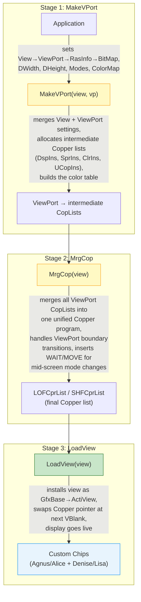
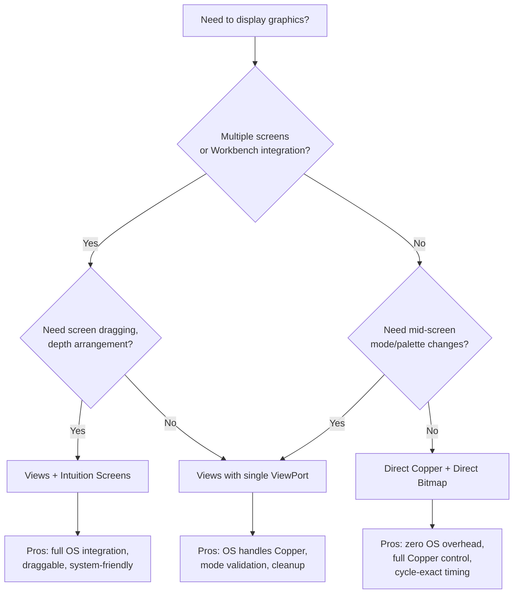

[← Home](../README.md) · [Graphics](README.md)

# Views and ViewPorts — Display Construction

## Overview

Drawing a frame on the Amiga isn't like drawing on a modern GPU where you fill a framebuffer and flip. The Amiga's custom chips demand a **Copper list** — a script of register writes timed to the video beam — before a single pixel appears. The OS provides a 3-stage pipeline that translates a high-level description of your screen into that low-level Copper program: `MakeVPort` → `MrgCop` → `LoadView`.

The pipeline is a compiler, in the literal sense. You give it a `View` (a chain of `ViewPort` descriptors, each pointing to a `BitMap` and a `ColorMap`), and it generates the Copper instructions that tell Agnus/Alice which bitplanes to fetch, when to switch palettes mid-screen, where to place sprites, and how to scroll. The result is a display that can mix resolutions, color depths, and scroll offsets on different horizontal bands — a feature no consumer OS would replicate for over a decade.

This system is what makes the Amiga's draggable screens possible. Each screen is a `View`, and Workbench can slide them up and down by changing scroll offsets in the Copper list — no framebuffer copy, no blit, just a register write.

---

## The 3-Stage Pipeline



### Stage 1: `MakeVPop(View, ViewPort)` — Compile the ViewPort

`MakeVPort` is the per-ViewPort compiler. For each `ViewPort` in the `View`'s chain, it:

1. **Validates mode combinations** — HAM + Dual Playfield? Rejected. SuperHires on OCS? Silently downgraded.
2. **Allocates Copper instruction buffers** — `DspIns` (display setup: bitplane pointers, modulo, BPLCON registers), `SprIns` (sprite DMA control), `ClrIns` (palette loads), `UCopIns` (user Copper list, if provided).
3. **Builds the color table** — maps `ColorMap` entries to hardware COLOR registers. For each color register touched by this ViewPort, generates `CMOVE` instructions that load it at the top of the ViewPort's vertical region.
4. **Computes display window** — from `DWidth`, `DHeight`, `DxOffset`, `DyOffset`, and mode flags, calculates `DIWSTRT`/`DIWSTOP`/`DDFSTRT`/`DDFSTOP` values.

> [!NOTE]
> `MakeVPort` does **not** generate the final Copper list. It produces intermediate `CopList` structures — one per ViewPort. These are raw sequences of `CMOVE`/`CWAIT` macros that know about their own ViewPort's vertical range but not about other ViewPorts. `MrgCop` handles the merge.

### Stage 2: `MrgCop(View)` — Merge into One Copper Program

`MrgCop` is the linker. It takes all the intermediate `CopList`s from every ViewPort and stitches them into a single Copper program — the `LOFCprList` (long-frame) and, for interlaced displays, `SHFCprList` (short-frame). This is where the system decides:

- **ViewPort ordering** — ViewPorts with lower `DyOffset` appear higher on screen. The Copper list inserts WAIT instructions at each ViewPort boundary.
- **Mid-screen mode changes** — if ViewPort 0 is lores 5-bitplanes and ViewPort 1 is hires 4-bitplanes, `MrgCop` generates the `BPLCON0`/`BPLCON1` switch instructions at the transition line.
- **Color register conflicts** — if two ViewPorts use the same hardware color register, `MrgCop` inserts reload instructions at the boundary so each ViewPort sees its own palette.
- **Copper list overflow protection** — if the combined Copper list exceeds the hardware's ~2.5 KB instruction limit (roughly 312 instructions), `MrgCop` uses a "loop-back" technique: the short-frame list renders half the ViewPorts, the long-frame list renders the other half, alternating per field. This is why interlaced screens with many ViewPorts flicker.

The output is stored in `view->LOFCprList` and `view->SHFCprList` as raw `struct cprlist` nodes — exactly the format the Copper hardware expects.

### Stage 3: `LoadView(View)` — Activate at VBlank

`LoadView` is deceptively simple. It:

1. **Waits for the vertical blank** — the Copper reloads its program pointer at the start of each frame
2. **Swaps Copper pointers** — atomically (from the Copper's perspective) switches the hardware's COP1LC register to point at the new `LOFCprList`
3. **Sets `GfxBase->ActiView`** — marks this View as the active display
4. **Returns immediately** — the new Copper list takes effect on the next scanline

This is why `LoadView` must always be followed by `WaitTOF()` (or two, for interlaced displays). Without the wait, your code may try to free the old View's resources before the Copper has stopped reading them.

> [!WARNING]
> Calling `LoadView` mid-frame (without waiting for VBlank) **will tear** — the Copper switches lists partway through a frame, producing a split image with the top half from the old View and the bottom half from the new one. `LoadView` itself does not wait; it's your responsibility to synchronize.

---

## Key Structures

```c
/* graphics/view.h — NDK39 */
struct View {
    struct ViewPort *ViewPort;  /* first viewport in chain */
    struct cprlist  *LOFCprList; /* long-frame copper list */
    struct cprlist  *SHFCprList; /* short-frame copper list */
    WORD            DyOffset;   /* vertical scroll offset */
    WORD            DxOffset;   /* horizontal scroll offset */
    UWORD           Modes;      /* display mode flags */
};

struct ViewPort {
    struct ViewPort *Next;       /* next viewport in chain */
    struct ColorMap *ColorMap;   /* palette for this viewport */
    struct CopList  *DspIns;     /* display copper instructions */
    struct CopList  *SprIns;     /* sprite copper instructions */
    struct CopList  *ClrIns;     /* color copper instructions */
    struct CopList  *UCopIns;    /* user copper instructions */
    WORD            DWidth;      /* display width */
    WORD            DHeight;     /* display height */
    WORD            DxOffset;
    WORD            DyOffset;
    UWORD           Modes;       /* HIRES, LACE, HAM, EHB, etc. */
    UBYTE           SpritePriorities;
    UBYTE           ExtendedModes;
    struct RasInfo  *RasInfo;    /* linked bitmap info */
};

struct RasInfo {
    struct RasInfo *Next;        /* for dual-playfield */
    struct BitMap  *BitMap;      /* the actual bitmap */
    WORD           RxOffset;     /* horizontal scroll within bitmap */
    WORD           RyOffset;     /* vertical scroll within bitmap */
};
```

---

## Display Mode Flags

```c
/* graphics/view.h */
#define HIRES       0x8000   /* 640 pixel mode */
#define LACE        0x0004   /* interlaced */
#define HAM         0x0800   /* Hold-And-Modify (4096 colors) */
#define EXTRA_HALFBRITE 0x0080 /* Extra Half-Brite (64 colors) */
#define DUALPF      0x0400   /* dual playfield */
#define PFBA        0x0040   /* playfield B has priority */
#define SUPERHIRES  0x0020   /* 1280 pixel mode (ECS+) */
#define VP_HIDE     0x2000   /* viewport is hidden */
```

---

## Building a Display

```c
struct View view;
struct ViewPort vp;
struct RasInfo ri;
struct BitMap *bm = AllocBitMap(320, 256, 5, BMF_DISPLAYABLE|BMF_CLEAR, NULL);

InitView(&view);
InitVPort(&vp);
view.ViewPort = &vp;
vp.RasInfo = &ri;
ri.BitMap = bm;
vp.DWidth = 320;
vp.DHeight = 256;
vp.Modes = 0;   /* lores */

/* Build color map: */
vp.ColorMap = GetColorMap(32);

/* Compile to copper: */
MakeVPort(&view, &vp);
MrgCop(&view);

/* Activate: */
LoadView(&view);
WaitTOF();

/* Cleanup: */
LoadView(GfxBase->ActiView);  /* restore system view */
FreeVPortCopLists(&vp);
FreeCprList(view.LOFCprList);
FreeColorMap(vp.ColorMap);
FreeBitMap(bm);
```

---

## ViewPort Chaining — Split Screens

The `ViewPort->Next` pointer chains multiple ViewPorts vertically, producing the Amiga's signature split-screen effect. Each ViewPort occupies a horizontal band with its own resolution, color depth, palette, and scroll offset:

```
┌────────────────────────────────┐  ← Top of display
│  ViewPort 0: 320×100, 32-color │  DyOffset = 0
│  5 bitplanes, palette 0        │
├────────────────────────────────┤
│  ViewPort 1: 640×100, 4-color  │  DyOffset = 100
│  2 bitplanes, palette 1        │
├────────────────────────────────┤
│  ViewPort 2: 320×56, HAM6      │  DyOffset = 200
│  6 bitplanes, palette 2        │
└────────────────────────────────┘  ← Bottom of display (256 lines)
```

```c
/* Three-ViewPort split screen: */
struct View view;
struct ViewPort vp[3];
struct RasInfo ri[3];
struct BitMap *bm[3];

InitView(&view);
view.ViewPort = &vp[0];          /* chain start */

for (int i = 0; i < 3; i++) {
    InitVPort(&vp[i]);
    vp[i].RasInfo = &ri[i];
    ri[i].BitMap = bm[i];
    vp[i].DWidth  = 320;
    vp[i].DHeight = (i == 2) ? 56 : 100;
    vp[i].DyOffset = i * 100;    /* 0, 100, 200 */
    vp[i].ColorMap = GetColorMap(32);
    vp[i].Next = (i < 2) ? &vp[i+1] : NULL;

    MakeVPort(&view, &vp[i]);
}
MrgCop(&view);                    /* merge all three into one Copper list */
LoadView(&view);
WaitTOF();
```

**How the Copper handles it.** `MrgCop` inserts `WAIT` instructions at each ViewPort boundary (lines 100 and 200). When the beam reaches line 100, the Copper hits a `WAIT` for ViewPort 1, which triggers a `MOVE` sequence that reloads `BPLCON0` (new bitplane count), `BPL1PTH`/`BPL1PTL` (new bitplane pointers), and `COLOR00`–`COLOR31` (new palette). The display changes resolution and color depth mid-frame with no CPU involvement.

**Constraints:**
- Maximum ~16 ViewPorts practical (Copper list size limit)
- Each ViewPort increase consumes ~20–40 Copper instructions for mode/palette setup
- OCS: maximum 6 bitplanes total across all ViewPorts (sum of bitplane counts). ECS/AGA: up to 6 or 8 respectively per ViewPort
- Dual playfield ViewPorts cannot be chained — only one dual-playfield ViewPort per View

---

## ColorMap & LoadRGB4

The `ColorMap` connects logical color indices (0–31 for OCS/ECS, 0–255 for AGA) to hardware color registers and their 12-bit or 24-bit RGB values:

```c
struct ColorMap *cm = GetColorMap(32);            /* request 32 color registers */
vp.ColorMap = cm;

/* Load a palette — each entry is (R,G,B) in 4-bit (0–15) per channel: */
UWORD palette[32];
palette[0] = 0x000;    /* black */
palette[1] = 0xF00;    /* red (R=15, G=0, B=0) */
palette[2] = 0x0F0;    /* green */
palette[3] = 0x00F;    /* blue */
palette[4] = 0xFFF;    /* white */
/* ... etc ... */

LoadRGB4(&vp, palette, 32);   /* load 32 colors into color table */

/* After LoadRGB4, you must rebuild: */
MakeVPort(&view, &vp);
MrgCop(&view);
/* LoadView not needed if view already active — Copper reloads palette
   at the top of the ViewPort automatically */
```

**Color register sharing.** On OCS/ECS, there are only 32 hardware color registers (`COLOR00`–`COLOR31`). If three ViewPorts each request 32 colors, `MrgCop` must arbitrate. Two ViewPorts can share registers if their palettes are identical at those indices; otherwise, `MrgCop` reloads the conflicting registers at the ViewPort boundary. On AGA, with 256 color registers (`COLOR00`–`COLOR255`), register conflicts are rare and the Copper reload overhead diminishes.

> [!NOTE]
> `LoadRGB4` only updates the color table in RAM. The actual Copper register loads happen when the beam reaches the ViewPort's vertical region — `MrgCop` generated those instructions at compile time. This means palette changes mid-frame (via Copper-driven color cycling) are possible by modifying the Copper list directly, bypassing `LoadRGB4`.

---

## Named Antipatterns

### 1. "The Ghost Screen" — Freeing While Displayed

**Broken:**
```c
LoadView(&myView);
WaitTOF();
/* ... user clicks "close" ... */
FreeVPortCopLists(&vp);
FreeCprList(myView.LOFCprList);
FreeColorMap(vp.ColorMap);
FreeBitMap(bm);
/* The Copper is STILL reading LOFCprList! Next frame = crash or garbage. */
```

**Why it fails.** `LoadView` told the Copper to start using `myView.LOFCprList`. Freeing those Copper lists while the Copper is actively executing them produces random custom chip register writes — colors flicker, bitplane pointers go wild, and the system can hang.

**Fixed:**
```c
LoadView(GfxBase->ActiView);  /* restore system View FIRST */
WaitTOF();                     /* wait for Copper to switch */
WaitTOF();                     /* double-wait for interlace safety */
/* NOW safe to free: */
FreeVPortCopLists(&vp);
FreeCprList(myView.LOFCprList);
```

### 2. "The Half-Screen Haunt" — Missing WaitTOF After LoadView

**Broken:**
```c
LoadView(&myView);
/* immediately start drawing into the bitmap */
SetRast(&rp, 0);
RectFill(&rp, 0, 0, 319, 255);   /* drawing while Copper may be in mid-frame */
```

**Why it fails.** `LoadView` returns immediately — the Copper is still executing the *previous* frame's list partway through the current frame. If you start drawing into the bitmap before the VBlank, your rendering may appear on the old frame, the new frame, or half of each (tearing). The Copper doesn't synchronize with `LoadView`'s return.

**Fixed:**
```c
LoadView(&myView);
WaitTOF();          /* wait until the new Copper list begins executing */
/* NOW draw into the bitmap — will appear on the next frame */
```

### 3. "The Color Clash" — ViewPorts Fighting Over Palette Registers

**Broken:**
```c
/* ViewPort 0 uses COLOR00–COLOR15 at lines 0–100 */
/* ViewPort 1 uses COLOR00–COLOR15 at lines 100–200 */
/* Both call LoadRGB4 with DIFFERENT palettes for COLOR00 */
```

**Why it fails.** `MrgCop` detects the conflict and inserts reload instructions at line 100 — which works if both ViewPorts go through `MrgCop` together. But if ViewPort 1 calls `LoadRGB4` *after* `MrgCop`, the color table is updated in RAM but the Copper list still has the old values. ViewPort 0's COLOR00 bleeds into ViewPort 1's region.

**Fixed:**
```c
/* Load palettes, then rebuild the entire pipeline: */
LoadRGB4(&vp[0], palette0, 16);
LoadRGB4(&vp[1], palette1, 16);
MakeVPort(&view, &vp[0]);
MakeVPort(&view, &vp[1]);
MrgCop(&view);
/* Palette changes are now baked into a fresh Copper list */
```

---

## Pitfalls

### 1. Scroll Offsets Are Cumulative

`View.DxOffset`/`View.DyOffset` and `ViewPort.DxOffset`/`ViewPort.DyOffset` are **added together** to produce the final scroll value. If you set both to non-zero, the screen scrolls by the sum — which is usually unintentional.

```c
view.DyOffset = 10;      /* "scroll whole display down 10" */
vp.DyOffset  = 20;       /* "scroll this ViewPort down 20" */
/* Result: this ViewPort scrolls by 30. Probably not what you meant. */
```

### 2. FreeVPortCopLists vs FreeCprList

`FreeVPortCopLists(&vp)` frees the intermediate CopLists inside a ViewPort (`DspIns`, `SprIns`, `ClrIns`, `UCopIns`). `FreeCprList(view.LOFCprList)` frees the final merged Copper program. You must call both — in the correct order — and you must call `FreeVPortCopLists` for **every** ViewPort in the chain:

```c
/* Correct cleanup order: */
for (struct ViewPort *v = view.ViewPort; v; v = v->Next)
    FreeVPortCopLists(v);
FreeCprList(view.LOFCprList);
if (view.SHFCprList) FreeCprList(view.SHFCprList);
```

### 3. BMF_DISPLAYABLE Is Required but Not Checked

`AllocBitMap()` with `BMF_DISPLAYABLE` ensures the bitmap lives in Chip RAM and is aligned for DMA. The ViewPort system does **not** validate this — if your bitmap is in Fast RAM, `MakeVPort` succeeds silently, and the display shows random Chip RAM contents (or nothing).

### 4. Interleaved Bitmaps Need Correct Modulo

If you allocated the bitmap yourself (not via `AllocBitMap()`), you must set `BitMap->BytesPerRow` correctly. For a 320-pixel wide, 5-bitplane screen, that's `320/8 = 40` bytes per row per bitplane. The modulo register (`BPL1MOD`) is computed from this — incorrect values produce diagonal scrolling or garbage.

---

## When to Use Views vs Direct Copper



| Criterion | Views + ViewPort | Direct Copper |
|---|---|---|
| OS integration | Full — works with Intuition screens, Workbench | None — you own the hardware |
| Copper list management | Automatic via MakeVPort/MrgCop | Manual — you write every WAIT/MOVE |
| Mode validation | HAM+DualPF rejected, OCS limits enforced | None — you can program illegal modes (may crash) |
| Palette management | ColorMap + LoadRGB4 handles conflicts | Manual — you track COLOR register usage |
| Split screens | Yes — ViewPort chaining | Yes — direct WAIT + register rewrites |
| CPU overhead | Moderate — pipeline rebuild on change | Zero — static Copper list |
| Recommended for | Applications, utilities, multi-screen setups | Games, demos, full-screen effects |

---

## Best Practices

1. **Always double-WaitTOF after LoadView** — once to switch Copper lists, once for interlace safety
2. **Restore `GfxBase->ActiView` before freeing your View** — never free a View the Copper is still using
3. **Call `FreeVPortCopLists` for every ViewPort, then `FreeCprList` on the merged lists** — in that order
4. **Use `AllocBitMap()` with `BMF_DISPLAYABLE`** — don't hand-allocate bitplane memory for Views
5. **Call `MakeVPort` and `MrgCop` after ANY ViewPort property change** — DWidth, DHeight, DyOffset, ColorMap, or mode flags
6. **Re-`MrgCop` after adding/removing ViewPorts from the chain** — the Copper merge is not incremental
7. **For Intuition screens, use `screen->ViewPort`** — don't create a parallel View hierarchy; let Intuition manage it

---

## Historical Context

### The 1985 Landscape

| Platform | Screen Setup | Resolution Switching | Multiple Screens |
|---|---|---|---|
| **Amiga (Views)** | Copper list compiled from ViewPort descriptors | Mid-screen, per-scanline | Yes — draggable, with priority |
| **Macintosh (1984)** | Fixed framebuffer at `$1A7000` | One resolution per boot | No — single screen |
| **IBM PC (CGA/EGA)** | BIOS mode set + direct VRAM | Full-screen mode change only | No |
| **Atari ST** | Fixed framebuffer + shifter | One resolution per boot (mono/color switch) | No |
| **Acorn Archimedes (1987)** | VIDC register block | Limited — one mode per frame | No |

**What made Views unique.** Every other platform in 1985 had a single framebuffer at a fixed address with a single resolution. If you wanted to change modes, you blanked the screen and reprogrammed the video hardware — a 1–2 second blackout. The Amiga's View system could switch from 320×200×32-color to 640×200×4-color at a specific scanline with zero blanking — the Copper handled the transition, and the user never saw it. This was the hardware foundation for the Amiga's draggable screens.

### The Long Catch-Up — How the Industry Reinvented Compositing

The Amiga shipped with a hardware-composited, multi-resolution desktop in 1985. Then the rest of the industry spent two decades catching up. Here's the timeline:

| Year | Platform | Milestone |
|---|---|---|
| **1985** | Amiga (Workbench 1.0) | Hardware-composited desktop: multiple screens at different resolutions, mid-screen Copper mode switches, draggable with priority layering |
| **1985** | Windows 1.0 | **GDI** (Graphics Device Interface) — a 2D API for lines, rectangles, text. Pure software rendering to a single framebuffer. No compositing, no acceleration |
| **1990** | Windows 3.0 | GDI adds printer support, color management, but still software-only. Screen "windows" are stored as occlusion regions — dragging a window leaves a hole that other apps must redraw into |
| **1995** | Windows 95 | GDI unchanged architecturally. The "desktop" is still a single flat surface; overlapping windows are not independently composited layers |
| **1996** | DirectX 1.0 | Hardware-accelerated 3D and 2D — but only for full-screen games. The desktop itself does not use it |
| **2001** | Mac OS X 10.0 | **Quartz Compositor** — the first modern compositing window manager since the Amiga. Every window is an independent OpenGL-backed texture. Windows can be transparent, shadows are real, no more redraw holes. 16 years after the Amiga |
| **2001** | Windows XP | GDI+ arrives — anti-aliased 2D, alpha blending, gradient brushes. But the desktop is still software-composited; no GPU acceleration for window management |
| **2005** | Mac OS X 10.4 | **Quartz Composer** — a visual programming tool for real-time GPU-accelerated compositions. Core Image brings GPU shader pipelines to the desktop |
| **2006** | Windows Vista | **Desktop Window Manager (DWM)** — finally, a hardware-composited desktop on Windows. Every window is a Direct3D texture. GDI apps render to off-screen surfaces; DWM composites with the GPU. **21 years** after the Amiga |
| **2008** | Compiz / KDE 4 | Linux gets GPU-composited desktops. KWin and Compiz use OpenGL to composite windows with effects (wobbly windows, desktop cube) |
| **2011** | Qt 5 | QPainter gains an OpenGL paint engine. Qt 4 had introduced a software rasterizer (replacing native GDI/X11 backends); Qt 5 made GPU rendering the default path |
| **2013** | Wayland 1.0 | The compositor becomes the display server. Every frame goes through the GPU. Windows are client-rendered buffers; the compositor arranges them — conceptually identical to the Amiga's Copper merging ViewPorts, 28 years later |

**The Amiga was 16–21 years ahead.** Every modern technique on that timeline — independent window layers, GPU compositing, zero-copy buffer passing, per-layer mode switching — was present in AmigaOS 1.0, implemented in hardware. The Copper merged ViewPorts at the scanline level. `MrgCop` compiled layer transitions. `LoadView` atomically swapped display lists. The rest of the industry had to wait for 3D GPUs with enough fill rate to composite the desktop in real time before they could replicate what Agnus and Denise did in silicon.

> [!NOTE]
> The key difference between the Amiga's approach and modern compositors is **where the merge happens**. Amiga: the Copper merges ViewPorts into a single hardware display list — the CRT receives one signal, no framebuffer blending. Modern: the GPU renders each window to an off-screen texture, then composites them into a final framebuffer — the display receives the blended result. The Amiga's approach was bandwidth-efficient (no off-screen memory) but inflexible (no transparency between ViewPorts). The modern approach is flexible but memory-hungry. The Amiga got there first, with a fraction of the transistor budget.

### Modern Analogies

| Amiga Concept | Modern Equivalent |
|---|---|
| View + ViewPort chain | Display configuration + CRTC mode list |
| MakeVPort | Shader/GPU command buffer compilation |
| MrgCop | GPU command buffer linking/merging |
| LoadView | `vkQueuePresentKHR` / `SwapBuffers` with V-Sync |
| Copper list | Display list / GPU command stream |
| ViewPort chaining | Multi-monitor spanning / MPV (multiple planes within one display) |
| ColorMap + LoadRGB4 | GPU descriptor set with palette binding |
| UCopIns | User-defined GPU commands inserted into system command stream |

---

## References

- NDK39: `graphics/view.h` — `struct View`, `struct ViewPort`, `struct RasInfo`, `struct ColorMap`
- NDK39: `graphics/gfxbase.h` — `ActiView`, `copinit`, system Copper list pointers
- ADCD 2.1: `InitView`, `InitVPort`, `MakeVPort`, `MrgCop`, `LoadView`, `LoadRGB4`, `FreeVPortCopLists`, `FreeCprList`, `GetColorMap`, `FreeColorMap`
- HRM: *Amiga Hardware Reference Manual* — Display Construction chapter, Copper chapter
- See also: [GfxBase — Graphics Library Global State](gfx_base.md) — View lifecycle, ActiView, system Copper lists
- See also: [Copper — Coprocessor Instructions and UCopList](copper.md) — `CMOVE`/`CWAIT` macros, UCopList construction, instruction format
- See also: [Copper Programming — Deep Dive](copper_programming.md) — gradient effects, raster bars, mid-frame palette changes
- See also: [Display Modes](display_modes.md) — ModeID system, resolution/color-depth combinations, DMA slot budget
- See also: [BitMap](bitmap.md) — planar allocation, interleaved layout, `BMF_DISPLAYABLE`
- See also: [Screens — Intuition](screens.md) — OS-managed screen lifecycle built on Views
