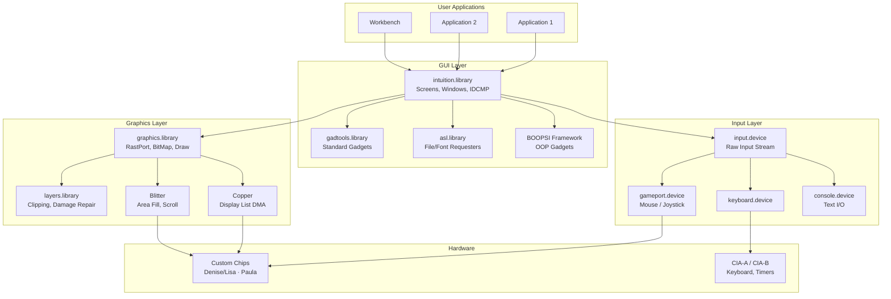
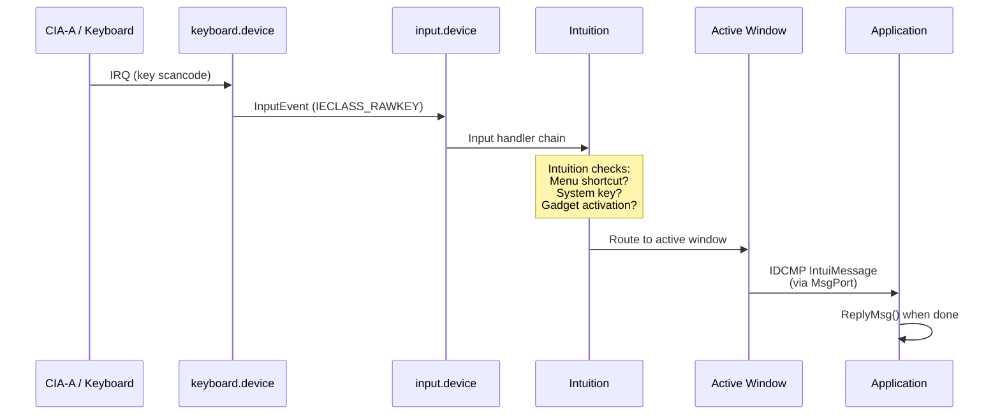
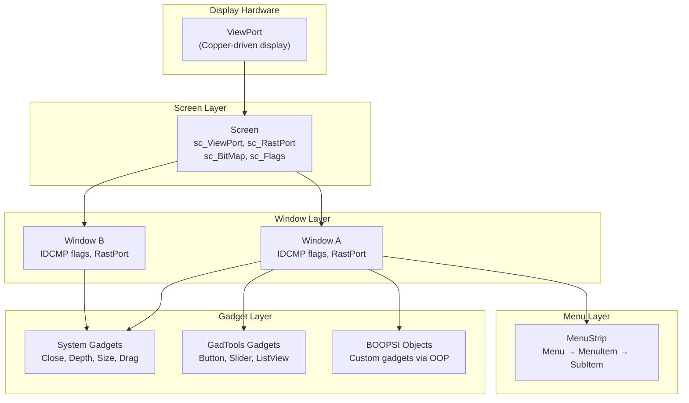
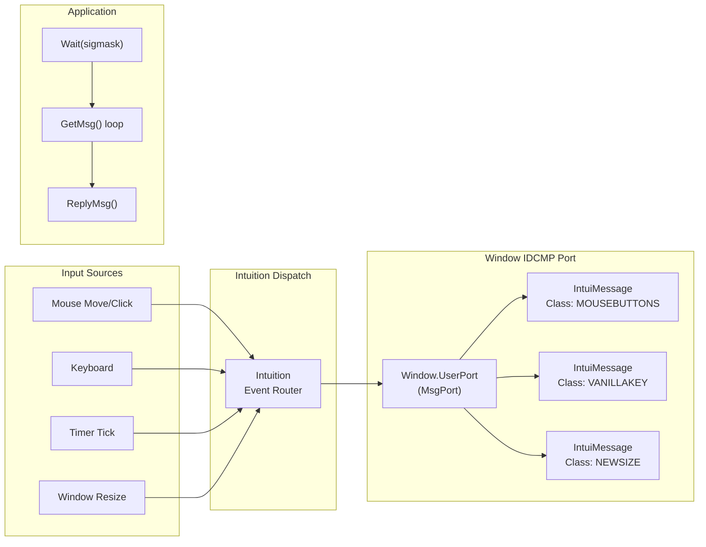
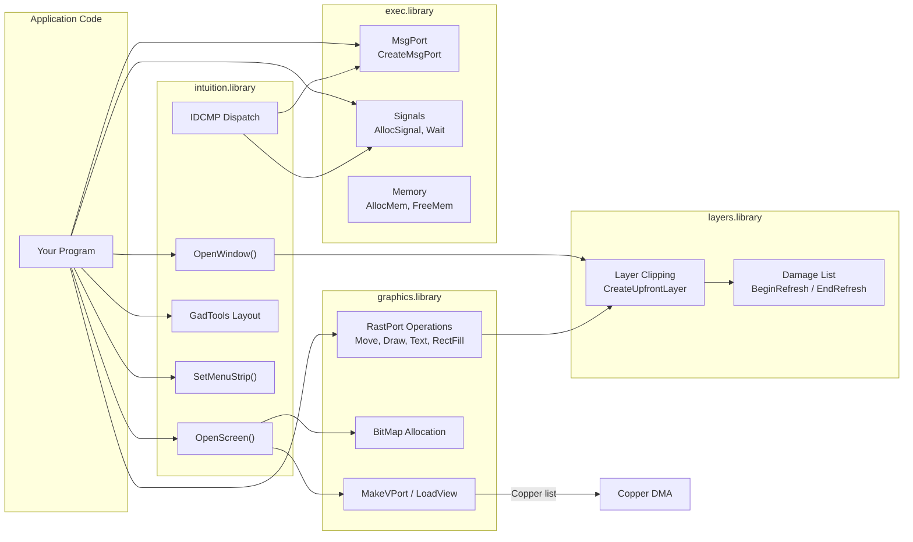
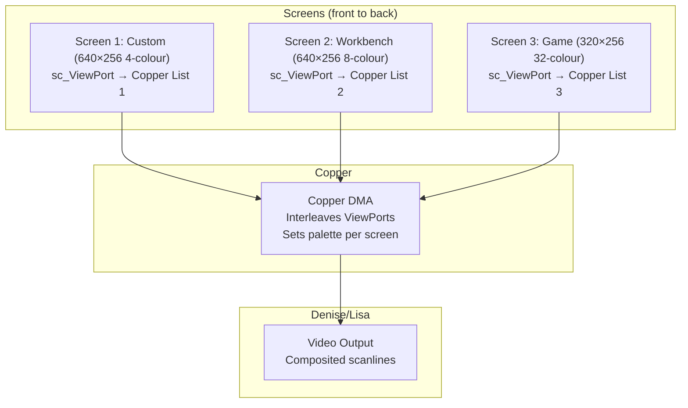
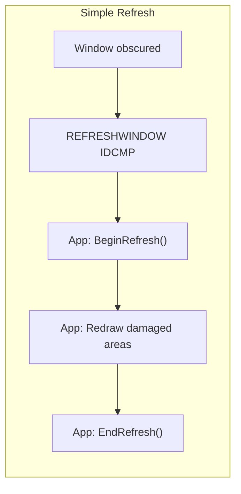

[← Home](../README.md)

# Intuition — GUI Subsystem Overview

Intuition is the AmigaOS windowing system and user interface manager. It sits between applications and the low-level graphics/input hardware, providing screens, windows, gadgets, menus, and an event-driven message passing system. Unlike modern desktop GUIs, Intuition operates with **zero memory protection** and **cooperative multitasking** — every application directly shares hardware resources.

## Section Index

| File | Description |
|---|---|
| [intuition_base.md](intuition_base.md) | IntuitionBase — library versioning, global state fields, ViewLord, LockIBase, function overview |
| [screens.md](screens.md) | Screens — Copper mechanics, display modes (OCS/ECS/AGA/RTG), dragging, resolution tables |
| [windows.md](windows.md) | Windows — WA_ tags, refresh modes, window types, coordinate system, lifecycle |
| [gadgets.md](gadgets.md) | Gadgets — GadTools creation, raw struct Gadget, prop/string gadgets, runtime updates |
| [menus.md](menus.md) | Menus — GadTools NewMenu, event handling, multi-select, checkmarks, keyboard shortcuts |
| [requesters.md](requesters.md) | Requesters — EasyRequest, ASL file/font/screenmode dialogs, non-blocking pattern |
| [idcmp.md](idcmp.md) | IDCMP — event architecture, class reference, shared ports, antipatterns, use-case cookbook |
| [boopsi.md](boopsi.md) | BOOPSI — OOP dispatcher model, ICA interconnection, custom class tutorial, class hierarchy |
| [input_events.md](input_events.md) | Input Events — handler chain, QoS/priority, Commodities, latency analysis, game input |
| **[frameworks/](frameworks/)** | **GUI Frameworks: MUI, ReAction, BGUI** |

---

## System Architecture — Where Intuition Fits



---

## Data Flow — From Keypress to Application



---

## Screen / Window / Gadget Hierarchy



### Ownership Rules

| Object | Owned By | Lifetime |
|---|---|---|
| **Screen** | Creator task (or Workbench) | Until `CloseScreen()` — all windows must close first |
| **Window** | Creator task | Until `CloseWindow()` — must drain IDCMP port first |
| **Gadget** | Window | Attached via `AddGList()`, removed before window close |
| **Menu** | Window | Attached via `SetMenuStrip()`, cleared via `ClearMenuStrip()` |
| **RastPort** | Window/Screen | Borrowed reference — never free directly |

---

## IDCMP — The Event System

**Intuition Direct Communication Message Port** is the core event mechanism. Each window has a `UserPort` (MsgPort) that receives `IntuiMessage` structs:



### Critical IDCMP Classes

| Class | Hex | Meaning |
|---|---|---|
| `CLOSEWINDOW` | `$0200` | User clicked close gadget |
| `MOUSEBUTTONS` | `$0008` | Mouse button press/release |
| `MOUSEMOVE` | `$0010` | Mouse moved (requires `REPORTMOUSE`) |
| `GADGETUP` | `$0040` | Gadget released (RELVERIFY) |
| `GADGETDOWN` | `$0020` | Gadget pressed |
| `MENUPICK` | `$0100` | Menu item selected |
| `VANILLAKEY` | `$00200000` | Cooked keystroke (ASCII) |
| `RAWKEY` | `$0400` | Raw keyboard scancode |
| `NEWSIZE` | `$0002` | Window resized |
| `REFRESHWINDOW` | `$0004` | Damage — app must redraw |
| `INTUITICKS` | `$00400000` | ~10Hz timer for UI updates |

---

## Library Interactions — Who Calls Whom



---

## Screen Types and Display Pipeline



The Copper hardware makes Amiga's multi-screen system possible — each screen gets its own palette, resolution, and scroll position, all managed by a single Copper list that switches parameters mid-frame at the correct scanline.

---

## GadTools vs BOOPSI — Gadget Frameworks

| Aspect | GadTools (OS 2.0+) | BOOPSI (OS 2.0+) |
|---|---|---|
| **Philosophy** | Wrapper functions around Intuition gadgets | True OOP with classes, methods, inheritance |
| **Creation** | `CreateGadget(kind, prev, newgad, tags)` | `NewObject(class, NULL, tags)` |
| **Layout** | Manual X/Y positioning with font scaling | Manual or custom layout classes |
| **Event model** | IDCMP `GADGETUP` + `GT_GetIMsg()` | `OM_NOTIFY` → target chain |
| **Extensibility** | Fixed set: BUTTON, STRING, SLIDER, etc. | Unlimited custom classes |
| **Typical use** | Preferences panels, simple tools | MUI internals, complex UIs |
| **Complexity** | Low — 5 functions to learn | High — requires understanding class dispatch |

---

## Refresh Modes — How Windows Repaint

| Mode | Flag | Description | Trade-off |
|---|---|---|---|
| **Simple Refresh** | `WFLG_SIMPLE_REFRESH` | App must redraw on `REFRESHWINDOW` IDCMP | Minimum memory, maximum app work |
| **Smart Refresh** | `WFLG_SMART_REFRESH` | Layers saves/restores obscured regions | Uses RAM for damage bitmaps, less app work |
| **Super Bitmap** | `WFLG_SUPER_BITMAP` | Full off-screen bitmap, auto-restored | Highest RAM use, zero redraw work |
| **Backdrop** | `WFLG_BACKDROP` | Window behind all others, fills screen | Used by Workbench |



---

## Common Patterns

### Minimal Window Event Loop

```c
struct Window *win = OpenWindowTags(NULL,
    WA_Title,  "My Window",
    WA_Width,  320, WA_Height, 200,
    WA_IDCMP,  IDCMP_CLOSEWINDOW | IDCMP_VANILLAKEY,
    WA_Flags,  WFLG_CLOSEGADGET | WFLG_DRAGBAR | WFLG_DEPTHGADGET | WFLG_ACTIVATE,
    TAG_DONE);

BOOL running = TRUE;
while (running) {
    Wait(1L << win->UserPort->mp_SigBit);
    struct IntuiMessage *msg;
    while ((msg = GT_GetIMsg(win->UserPort))) {
        switch (msg->Class) {
            case IDCMP_CLOSEWINDOW:
                running = FALSE;
                break;
            case IDCMP_VANILLAKEY:
                /* msg->Code = ASCII key */
                break;
        }
        GT_ReplyIMsg(msg);
    }
}
CloseWindow(win);
```

### Shared IDCMP Port (Multiple Windows)

```c
/* Create one port, share across windows */
struct MsgPort *sharedPort = CreateMsgPort();

win1 = OpenWindowTags(NULL, ..., WA_IDCMP, 0, TAG_DONE);
win1->UserPort = sharedPort;
ModifyIDCMP(win1, IDCMP_CLOSEWINDOW);

win2 = OpenWindowTags(NULL, ..., WA_IDCMP, 0, TAG_DONE);
win2->UserPort = sharedPort;
ModifyIDCMP(win2, IDCMP_CLOSEWINDOW);

/* Single Wait() handles both windows */
/* Check msg->IDCMPWindow to identify source */
```


---

## References

- RKRM: *Libraries Manual* — Intuition chapter
- RKRM: *Libraries Manual* — GadTools chapter  
- RKRM: *Libraries Manual* — BOOPSI chapter
- NDK39: `intuition/intuition.h`, `intuition/screens.h`, `intuition/gadgetclass.h`
- ADCD 2.1: Intuition Autodocs — `OpenWindow`, `OpenScreen`, `ModifyIDCMP`
