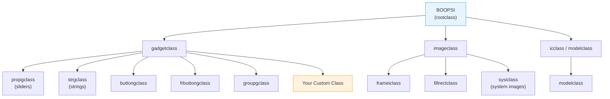
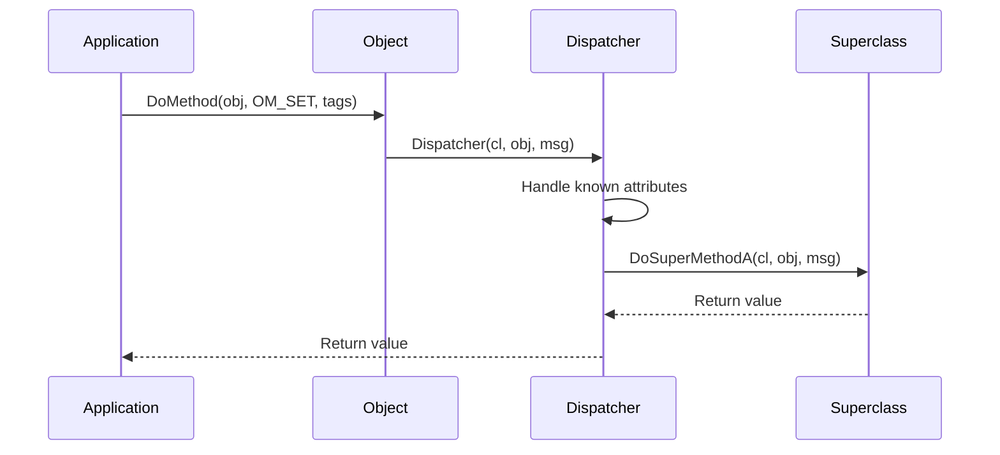
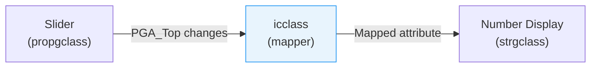

[← Home](../README.md) · [Intuition](README.md)

# BOOPSI — Basic Object-Oriented Programming System for Intuition

## What Is BOOPSI?

BOOPSI is AmigaOS's built-in object-oriented framework for creating reusable, interconnectable UI components. Introduced in OS 2.0 (1990), it predates Java, Qt's signal/slot system, and COM — yet implements many of the same patterns: **inheritance, encapsulation, message-based dispatch, and reactive property binding**.

BOOPSI is the foundation on which all modern Amiga GUI frameworks are built:



### Why BOOPSI Matters

| Problem | Before BOOPSI | With BOOPSI |
|---|---|---|
| Custom gadgets | Rewrite rendering, hit-testing, state from scratch | Inherit from `gadgetclass` — get all behavior free |
| Gadget communication | Application must manually shuttle values between gadgets | ICA interconnection — gadgets notify each other directly |
| Consistent look | Every app draws gadgets differently | Inherit standard imagery and behavior |
| Extensibility | Requires source code modification | Subclass and override only what you need |

---

## Core Concepts

### 1. Classes, Objects, and Methods

| Concept | Amiga BOOPSI | C++ Analog | Qt Analog |
|---|---|---|---|
| **Class** | `struct IClass` | `class` definition | `QObject` subclass |
| **Object** | `Object *` (opaque) | Class instance | `QObject *` |
| **Method** | `DoMethod(obj, MethodID, ...)` | `obj->method()` | `QMetaObject::invokeMethod()` |
| **Attribute** | `SetAttrs(obj, TAG_ID, value)` | `obj->setX(val)` | `obj->setProperty("x", val)` |
| **Superclass** | `DoSuperMethod(cl, obj, msg)` | Base class call | `QObject::event()` chain |
| **Instance data** | `INST_DATA(cl, obj)` | `this->member` | `d_ptr` (Pimpl) |
| **Interconnection** | `ICA_TARGET` + `ICA_MAP` | Observer pattern | `connect(signal, slot)` |

### 2. The Dispatcher

Every class has a single **dispatcher function** — the equivalent of a virtual method table compressed into a switch statement:

```c
ULONG MyDispatcher(struct IClass *cl, Object *obj, Msg msg)
{
    switch (msg->MethodID)
    {
        case OM_NEW:     return MyNew(cl, obj, (struct opSet *)msg);
        case OM_DISPOSE: return MyDispose(cl, obj, msg);
        case OM_SET:     return MySet(cl, obj, (struct opSet *)msg);
        case OM_GET:     return MyGet(cl, obj, (struct opGet *)msg);
        case OM_UPDATE:  return MySet(cl, obj, (struct opSet *)msg);
        default:         return DoSuperMethodA(cl, obj, msg);
    }
}
```

### 3. Method Dispatch Flow



---

## Standard Methods

### Object Lifecycle

| Method | Message Struct | When Called | Your Job |
|---|---|---|---|
| `OM_NEW` | `struct opSet` | Object creation (`NewObject()`) | Allocate resources, parse initial tags, call super first |
| `OM_DISPOSE` | `Msg` (base) | Object destruction (`DisposeObject()`) | Free your resources, then call super |

### Attribute Access

| Method | Message Struct | When Called | Your Job |
|---|---|---|---|
| `OM_SET` | `struct opSet` | `SetAttrs()` / `SetGadgetAttrs()` | Parse tag list, update internal state, notify if changed |
| `OM_GET` | `struct opGet` | `GetAttr()` | Check `opg_AttrID`, store value in `*opg_Storage` |
| `OM_UPDATE` | `struct opUpdate` | ICA notification from another object | Same as OM_SET, but check `opu_Flags` for interim updates |
| `OM_NOTIFY` | `struct opUpdate` | Internal — trigger notifications to ICA targets | Called by your OM_SET handler when attributes change |

### Gadget-Specific Methods

| Method | When Called | Your Job |
|---|---|---|
| `GM_RENDER` | Intuition needs gadget redrawn | Draw the gadget using the provided `GadgetInfo` |
| `GM_HITTEST` | Mouse click — is it inside your gadget? | Return `GMR_GADGETHIT` or 0 |
| `GM_GOACTIVE` | Gadget becomes active (clicked) | Begin interaction; return `GMR_MEACTIVE` to stay active |
| `GM_HANDLEINPUT` | Mouse/key events while active | Process input; return `GMR_MEACTIVE`, `GMR_NOREUSE`, or `GMR_REUSE` |
| `GM_GOINACTIVE` | Gadget deactivated | Clean up interaction state |

---

## Creating Objects

### Using Built-in Classes

```c
/* Create a proportional gadget (slider) */
Object *slider = NewObject(NULL, "propgclass",
    GA_ID,        1,
    GA_Left,      20,
    GA_Top,       40,
    GA_Width,     200,
    GA_Height,    16,
    GA_RelVerify, TRUE,
    PGA_Freedom,  FREEHORIZ,
    PGA_Total,    100,
    PGA_Top,      0,
    PGA_Visible,  10,
    TAG_DONE);

/* Add to window */
AddGadget(win, (struct Gadget *)slider, -1);
RefreshGList((struct Gadget *)slider, win, NULL, 1);

/* Read current position */
LONG pos;
GetAttr(PGA_Top, slider, (ULONG *)&pos);

/* Update position */
SetGadgetAttrs((struct Gadget *)slider, win, NULL,
    PGA_Top, 50,
    TAG_DONE);

/* Destroy */
RemoveGadget(win, (struct Gadget *)slider);
DisposeObject(slider);
```

### Using a Class Pointer

```c
/* When you have a Class * instead of a name */
struct IClass *myClass = MakeMyClass();
Object *obj = NewObject(myClass, NULL,
    MY_Attribute, value,
    TAG_DONE);
```

---

## ICA — Interconnection Architecture

The most powerful BOOPSI feature: **reactive data binding between objects** without application intervention.

### Direct Connection (icclass)



```c
/* Map slider position to string gadget value */
struct TagItem sliderToReadout[] = {
    { PGA_Top, STRINGA_LongVal },
    { TAG_DONE, 0 }
};

/* Create interconnection */
SetAttrs(slider,
    ICA_TARGET, readout,          /* Target object */
    ICA_MAP,    sliderToReadout,  /* Attribute mapping */
    TAG_DONE);

/* Now when slider moves, readout updates automatically! */
```

### Broadcast (modelclass)

For one-to-many notifications:

```c
/* Create a model (data source) */
Object *model = NewObject(NULL, "modelclass",
    ICA_TARGET, ICTARGET_IDCMP,  /* Also notify application */
    TAG_DONE);

/* Add multiple views */
DoMethod(model, OM_ADDMEMBER, slider);
DoMethod(model, OM_ADDMEMBER, readout);
DoMethod(model, OM_ADDMEMBER, gauge);

/* Update the model — all views update automatically */
SetAttrs(model, MY_VALUE, 42, TAG_DONE);
```

### ICA → IDCMP Bridge

When `ICA_TARGET` is `ICTARGET_IDCMP`, attribute changes generate `IDCMP_IDCMPUPDATE` messages:

```c
SetAttrs(slider,
    ICA_TARGET, ICTARGET_IDCMP,
    TAG_DONE);

/* In event loop: */
case IDCMP_IDCMPUPDATE:
{
    struct TagItem *tags = (struct TagItem *)msg->IAddress;
    LONG value = GetTagData(PGA_Top, 0, tags);
    UpdateApplication(value);
    break;
}
```

---

## Writing a Custom Class

### Step 1: Define Instance Data

```c
struct MyGadgetData {
    LONG  value;
    LONG  minVal;
    LONG  maxVal;
    UWORD fgPen;
    UWORD bgPen;
    BOOL  active;
};
```

### Step 2: Implement the Dispatcher

```c
ULONG MyGadgetDispatcher(struct IClass *cl, Object *obj, Msg msg)
{
    struct MyGadgetData *data;

    switch (msg->MethodID)
    {
        case OM_NEW:
        {
            /* Let superclass create the object first */
            Object *newObj = (Object *)DoSuperMethodA(cl, obj, msg);
            if (!newObj) return 0;

            data = INST_DATA(cl, newObj);
            data->value  = 0;
            data->minVal = 0;
            data->maxVal = 100;
            data->fgPen  = 1;
            data->bgPen  = 0;
            data->active = FALSE;

            /* Parse initial tags */
            struct TagItem *tags = ((struct opSet *)msg)->ops_AttrList;
            struct TagItem *tag;
            while ((tag = NextTagItem(&tags)))
            {
                switch (tag->ti_Tag)
                {
                    case MYGA_Value:  data->value  = tag->ti_Data; break;
                    case MYGA_Min:    data->minVal = tag->ti_Data; break;
                    case MYGA_Max:    data->maxVal = tag->ti_Data; break;
                }
            }

            return (ULONG)newObj;
        }

        case OM_SET:
        case OM_UPDATE:
        {
            data = INST_DATA(cl, obj);
            struct TagItem *tags = ((struct opSet *)msg)->ops_AttrList;
            struct TagItem *tag;
            BOOL refresh = FALSE;

            while ((tag = NextTagItem(&tags)))
            {
                switch (tag->ti_Tag)
                {
                    case MYGA_Value:
                        if (data->value != tag->ti_Data)
                        {
                            data->value = tag->ti_Data;
                            refresh = TRUE;
                        }
                        break;
                }
            }

            /* Propagate to superclass */
            DoSuperMethodA(cl, obj, msg);

            /* Notify ICA targets of changes */
            if (refresh)
            {
                struct TagItem notify[] = {
                    { MYGA_Value, data->value },
                    { TAG_DONE, 0 }
                };
                DoSuperMethod(cl, obj, OM_NOTIFY, notify,
                    ((struct opSet *)msg)->ops_GInfo, 0);
            }

            return refresh;
        }

        case OM_GET:
        {
            data = INST_DATA(cl, obj);
            struct opGet *opg = (struct opGet *)msg;

            switch (opg->opg_AttrID)
            {
                case MYGA_Value:
                    *opg->opg_Storage = data->value;
                    return TRUE;
                default:
                    return DoSuperMethodA(cl, obj, msg);
            }
        }

        case GM_RENDER:
        {
            data = INST_DATA(cl, obj);
            struct gpRender *gpr = (struct gpRender *)msg;
            struct RastPort *rp = gpr->gpr_RPort;
            struct Gadget *g = (struct Gadget *)obj;

            /* Draw the gadget */
            SetAPen(rp, data->bgPen);
            RectFill(rp, g->LeftEdge, g->TopEdge,
                     g->LeftEdge + g->Width - 1,
                     g->TopEdge + g->Height - 1);

            /* Draw value bar */
            LONG barWidth = (data->value - data->minVal) *
                            g->Width / (data->maxVal - data->minVal);
            SetAPen(rp, data->fgPen);
            RectFill(rp, g->LeftEdge, g->TopEdge,
                     g->LeftEdge + barWidth - 1,
                     g->TopEdge + g->Height - 1);

            return TRUE;
        }

        case GM_HITTEST:
        {
            /* Simple rectangular hit test — already handled by gadgetclass */
            return GMR_GADGETHIT;
        }

        default:
            return DoSuperMethodA(cl, obj, msg);
    }
}
```

### Step 3: Register the Class

```c
struct IClass *MyGadgetClass = NULL;

struct IClass *InitMyGadgetClass(void)
{
    MyGadgetClass = MakeClass(
        NULL,                          /* Public name (NULL = private) */
        "gadgetclass",                 /* Superclass name */
        NULL,                          /* Superclass pointer (alt.) */
        sizeof(struct MyGadgetData),   /* Instance data size */
        0                              /* Flags */
    );

    if (MyGadgetClass)
        MyGadgetClass->cl_Dispatcher.h_Entry = (HOOKFUNC)MyGadgetDispatcher;

    return MyGadgetClass;
}

/* For a public class (usable by other programs): */
struct IClass *pubClass = MakeClass(
    "mygadget.class",     /* Public name */
    "gadgetclass",
    NULL,
    sizeof(struct MyGadgetData),
    0
);
AddClass(pubClass);       /* Register with Intuition */
```

### Step 4: Use Your Class

```c
struct IClass *cl = InitMyGadgetClass();

Object *gauge = NewObject(cl, NULL,
    GA_Left,    20,
    GA_Top,     60,
    GA_Width,   200,
    GA_Height,  20,
    MYGA_Value, 50,
    MYGA_Min,   0,
    MYGA_Max,   100,
    TAG_DONE);

/* Connect slider to gauge via ICA */
SetAttrs(slider,
    ICA_TARGET, gauge,
    ICA_MAP,    sliderToGauge,
    TAG_DONE);
```

---

## Built-in Class Hierarchy

| Class | Superclass | Purpose |
|---|---|---|
| `rootclass` | — | Base of all BOOPSI objects |
| `imageclass` | `rootclass` | Base for all images |
| `frameiclass` | `imageclass` | Recessed/raised 3D frames |
| `sysiclass` | `imageclass` | System images (arrows, checkmarks) |
| `fillrectclass` | `imageclass` | Filled rectangles with patterns |
| `gadgetclass` | `rootclass` | Base for all gadgets |
| `propgclass` | `gadgetclass` | Proportional (slider) gadgets |
| `strgclass` | `gadgetclass` | String input gadgets |
| `buttongclass` | `gadgetclass` | Push buttons |
| `frbuttongclass` | `gadgetclass` | Framed push buttons |
| `groupgclass` | `gadgetclass` | Container for gadget groups |
| `icclass` | `rootclass` | Interconnection (1-to-1 binding) |
| `modelclass` | `icclass` | Interconnection (1-to-many broadcast) |

---

## Pitfalls

### 1. Forgetting DoSuperMethodA

If you handle `OM_NEW` without calling `DoSuperMethodA()` first, the object is never properly allocated. If you handle `OM_DISPOSE` without calling super last, the base class never frees its memory.

### 2. OM_SET Without OM_NOTIFY

If you update internal state in `OM_SET` but don't call `OM_NOTIFY`, ICA connections are silently broken — connected objects never update.

### 3. Wrong INST_DATA Timing

In `OM_NEW`, you must call `DoSuperMethodA()` **before** `INST_DATA()`. The superclass allocates the memory that `INST_DATA()` points to.

### 4. Modifying Gadget Attrs Without Window

`SetGadgetAttrs()` requires a window pointer to trigger a visual refresh. `SetAttrs()` alone updates internal state but doesn't redraw.

### 5. ICA Map Memory Management

The `ICA_MAP` tag list must persist for the lifetime of the connection. If you pass a stack-allocated array, it becomes garbage when the function returns.

---

## Best Practices

1. **Always call `DoSuperMethodA()`** for methods you partially handle — let the superclass do its job
2. **Use `NextTagItem()`** to iterate tag lists — it handles `TAG_SKIP`, `TAG_MORE`, etc.
3. **Send `OM_NOTIFY`** whenever a settable attribute changes — this drives ICA
4. **Keep dispatch fast** — complex rendering should be deferred to `GM_RENDER`
5. **Use `ICA_TARGET = ICTARGET_IDCMP`** when the application needs to know about changes
6. **Allocate `ICA_MAP` arrays statically** or in instance data — not on the stack
7. **Private classes** (NULL name) are simpler and sufficient for most applications
8. **Use `modelclass`** for MVC patterns — it's the Amiga's built-in observer

---

## References

- NDK 3.9: `intuition/classes.h`, `intuition/classusr.h`, `intuition/gadgetclass.h`, `intuition/imageclass.h`, `intuition/icclass.h`
- ADCD 2.1: `NewObject()`, `DisposeObject()`, `SetAttrs()`, `GetAttr()`, `DoMethod()`
- AmigaOS Reference Manual (RKRM): Libraries, Chapter 8 — BOOPSI
- See also: [Gadgets](gadgets.md), [MUI Framework](frameworks/mui/README.md)
