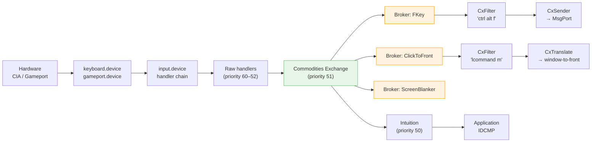
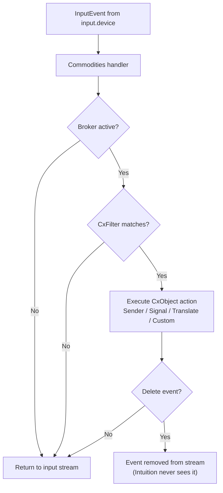

[← Home](../README.md) · [Intuition](README.md)

# Commodities Exchange — Background Input Filtering and Hotkey System

## Overview

The Commodities Exchange system, introduced in AmigaOS 2.0 (V37), provides a safe, standardized framework for installing background input handlers that monitor, filter, translate, or respond to user input across all applications. Rather than installing a raw `input.device` handler — which risks priority conflicts, antisocial behavior, and system instability — a commodity registers a **broker** with `commodities.library`. The library maintains a single input handler just before Intuition in the handler chain and routes matching events through a tree of **CxObjects** (Commodities Exchange Objects) attached to each broker. This design allows multiple hotkey utilities, screen blankers, mouse enhancers, and macro tools to coexist without fighting over the input stream. The system includes the **Exchange** controller utility (OS 3.0+) that lets users enable, disable, or kill running commodities from a single interface. For developers, Commodities Exchange is the only supported method for global hotkeys and input filtering; raw input handlers should be reserved for games and system-level tools that genuinely need priority access.

> **Key constraint**: A commodity is a background utility, not an application. Using the Commodities framework merely to give a normal application a keyboard shortcut is an architectural misuse.

---

## Architecture

### Where Commodities Sits in the Input Chain



### CxObject Types

A commodity is constructed by linking CxObjects into a tree under a broker:

| Type | Creator | Purpose |
|---|---|---|
| **Broker** | `CxBroker()` | Root object; registers the commodity with the Exchange network |
| **Filter** | `CxFilter()` | Matches input events based on description string or `IX` structure |
| **Sender** | `CxSender()` | Sends a `CxMsg` to a user-supplied `MsgPort` |
| **Signal** | `CxSignal()` | Signals a task when a matching event arrives |
| **Translate** | `CxTranslate()` | Replaces the matched input event with a different event |
| **Custom** | `CxCustom()` | Calls a user-supplied callback function |
| **Debug** | `CxDebug()` | Sends debug info to the serial port |

### Message Flow



---

## Data Structures

### NewBroker

```c
/* libraries/commodities.h — NDK 3.9 */
struct NewBroker {
    BYTE             nb_Version;          /* NB_VERSION */
    BYTE             nb_Pad;
    STRPTR           nb_Name;             /* Name shown in Exchange */
    STRPTR           nb_Title;            /* Window title (if applicable) */
    STRPTR           nb_Descr;            /* Description shown in Exchange */
    SWORD            nb_Unique;           /* NBU_* uniqueness flags */
    SWORD            nb_Flags;            /* NB_* flags */
    BYTE             nb_Pri;              /* Broker priority (-128 to 127) */
    BYTE             nb_Pad2;
    struct MsgPort * nb_Port;             /* Port for CXCMD_* messages */
    WORD             nb_ReservedChannel;  /* Must be zero */
};
```

### Uniqueness Flags

| Flag | Value | Meaning |
|---|---|---|
| `NBU_DUPLICATE` | 0 | Allow multiple instances |
| `NBU_UNIQUE` | 1 | Only one instance; subsequent `CxBroker()` calls fail |
| `NBU_NOTIFY` | 2 | If unique and duplicate starts, send `CXCMD_UNIQUE` to existing instance |
| `NBU_FIXED` | 4 | Fixed priority — Exchange cannot change it |

### Broker Error Codes

| Code | Name | Meaning |
|---|---|---|
| `CBERR_OK` | 0 | Success |
| `CBERR_SYSERR` | 1 | System error (out of memory) |
| `CBERR_DUP` | 2 | Uniqueness violation |
| `CBERR_VERSION` | 3 | `nb_Version` mismatch |

### IX — Input Expression Structure

For programmatic filter construction without parsing a string:

```c
struct IX {
    UBYTE ix_Version;       /* IX_VERSION */
    UBYTE ix_Class;         /* IECLASS_* to match */
    UWORD ix_Code;          /* Code mask (e.g., rawkey scancode) */
    UWORD ix_CodeMask;      /* Bits that must match in ix_Code */
    WORD  ix_CodeLess;      /* Match if code <= this */
    WORD  ix_CodeGreater;   /* Match if code >= this */
    UWORD ix_Qualifier;     /* Qualifier mask (Shift, Alt, etc.) */
    UWORD ix_QualMask;      /* Bits that must match in ix_Qualifier */
    UWORD ix_QualSame;      /* Bits that must be identical (both set or both clear) */
    LONG  ix_QualLess;      /* Not typically used */
    LONG  ix_QualGreater;   /* Not typically used */
};
```

---

## API Reference

### Broker Lifecycle

```c
#include <libraries/commodities.h>
#include <proto/commodities.h>

/* Create and register a broker */
CxObj *CxBroker(struct NewBroker *nb, LONG *error);

/* Activate or deactivate a CxObject (including broker) */
void ActivateCxObj(CxObj *co, LONG true);

/* Delete a single CxObject */
void DeleteCxObj(CxObj *co);

/* Delete a CxObject and all objects attached to it (tree walk) */
void DeleteCxObjAll(CxObj *co);
```

### CxObject Creators

```c
/* Filter: match input events by description string */
CxObj *CxFilter(STRPTR description);

/* Filter: match by IX structure */
CxObj *CxFilterIX(struct IX *ix);

/* Sender: send CxMsg to a MsgPort */
CxObj *CxSender(struct MsgPort *port, LONG id);

/* Signal: signal a task */
CxObj *CxSignal(struct Task *task, LONG signal);

/* Translate: replace event with a new InputEvent chain */
CxObj *CxTranslate(struct InputEvent *ie);

/* Custom: call user function */
CxObj *CxCustom(VOID (*func)(CxMsg *msg, CxObj *co), LONG id);

/* Debug: dump to serial port */
CxObj *CxDebug(LONG id);
```

### Object Tree Manipulation

```c
/* Attach co to parent's list (appended) */
void AttachCxObj(CxObj *parent, CxObj *co);

/* Insert co at head of parent's list */
void InsertCxObj(CxObj *parent, CxObj *co);

/* Enqueue co by priority */
void EnqueueCxObj(CxObj *parent, CxObj *co);

/* Remove co from its parent (does not free) */
void RemoveCxObj(CxObj *co);

/* Set an error code on a CxObject */
void SetCxObjErr(CxObj *co, LONG error);

/* Get error code from a CxObject */
LONG GetCxObjErr(CxObj *co);
```

### Message Inspection

```c
/* Get the type of a CxMsg */
ULONG CxMsgType(CxMsg *cxm);

/* Get the ID of a CxMsg */
LONG CxMsgID(CxMsg *cxm);

/* Get the associated InputEvent (for CXM_IEVENT) */
struct InputEvent *CxMsgData(CxMsg *cxm);

/* Get the blurred/fuzzed qualifier (for wildcard matching) */
ULONG CxMsgQualifier(CxMsg *cxm);
```

### CxMsg Types

| Type | Description |
|---|---|
| `CXM_IEVENT` | Derived from an input event (reaches Filter → Sender/Signal/Translate) |
| `CXM_COMMAND` | Control command from Exchange or another controller |

### Controller Commands (CXM_COMMAND IDs)

| Command | Description |
|---|---|
| `CXCMD_DISABLE` | Deactivate the commodity |
| `CXCMD_ENABLE` | Activate the commodity |
| `CXCMD_KILL` | Shut down the commodity |
| `CXCMD_UNIQUE` | Another instance tried to start (only with `NBU_NOTIFY`) |
| `CXCMD_APPEAR` | Show the commodity's window (if it has one) |
| `CXCMD_DISAPPEAR` | Hide the commodity's window |

### Convenience Function

```c
/* Create a complete hotkey triad: Filter + Sender, attached to broker */
CxObj *HotKey(STRPTR description, struct MsgPort *port, LONG id);
```

> **Note**: `HotKey()` is a convenience — it creates a `CxFilter`, a `CxSender`, links them, and attaches to the broker in one call. Most simple hotkey commodities should use it.

---

## Filter Description String Syntax

The description string passed to `CxFilter()` or `HotKey()` describes the input event to match.

| Component | Syntax | Matches |
|---|---|---|
| **Key + modifiers** | `"ctrl alt d"` | Ctrl+Alt+D |
| **Raw key** | `"rawkey f1"` | F1 function key |
| **Raw key + modifiers** | `"rawkey lshift rshift escape"` | Both Shifts + Escape |
| **Upstroke** | `"-upstroke rawkey capslock"` | Key release (not press) |
| **Suppress repeat** | `"alt -repeat a"` | Alt+A, ignoring auto-repeat |
| **Mouse buttons** | `"ctrl selectdown"` | Ctrl + left mouse button down |
| **Qualifier-only** | `"ctrl"` | Any event while Ctrl is held |
| **Wildcard** | `"rawkey"` | Any raw key event |

### Modifier Keywords

| Keyword | Key |
|---|---|
| `lshift`, `rshift`, `shift` | Shift keys |
| `lalt`, `ralt`, `alt` | Alt keys |
| `lcommand`, `rcommand`, `command` | Amiga keys |
| `ctrl` | Control key |
| `capslock` | Caps Lock |
| `numericpad` | Numeric pad |

---

## Practical Examples

### Example 1: Minimal Hotkey Commodity

```c
#include <exec/types.h>
#include <libraries/commodities.h>
#include <proto/commodities.h>
#include <proto/exec.h>

struct Library *CxBase;
struct MsgPort *cxPort;
CxObj *broker;

BOOL InitCommodity(void)
{
    CxBase = OpenLibrary("commodities.library", 37);
    if (!CxBase) return FALSE;

    cxPort = CreateMsgPort();
    if (!cxPort) return FALSE;

    struct NewBroker nb = {
        NB_VERSION,
        "MyHotKey",               /* Name */
        "My HotKey Tool",         /* Title */
        "Global hotkey utility",  /* Description */
        NBU_UNIQUE | NBU_NOTIFY,  /* One instance, notify on dup */
        0,
        0,                        /* Priority */
        cxPort,
        0
    };

    broker = CxBroker(&nb, NULL);
    if (!broker) return FALSE;

    /* Create hotkey: Ctrl+Alt+H */
    CxObj *hotkey = HotKey("ctrl alt h", cxPort, 1);
    if (hotkey)
    {
        AttachCxObj(broker, hotkey);
    }

    ActivateCxObj(broker, TRUE);
    return TRUE;
}

void RunCommodity(void)
{
    ULONG cxSig = 1L << cxPort->mp_SigBit;
    BOOL running = TRUE;

    while (running)
    {
        ULONG received = Wait(cxSig | SIGBREAKF_CTRL_C);

        if (received & SIGBREAKF_CTRL_C) running = FALSE;

        if (received & cxSig)
        {
            CxMsg *msg;
            while ((msg = (CxMsg *)GetMsg(cxPort)))
            {
                ULONG type = CxMsgType(msg);
                LONG  id   = CxMsgID(msg);
                ReplyMsg((struct Message *)msg);

                if (type == CXM_IEVENT && id == 1)
                {
                    /* Ctrl+Alt+H was pressed */
                    HandleHotkeyAction();
                }
                else if (type == CXM_COMMAND)
                {
                    switch (id)
                    {
                        case CXCMD_DISABLE:
                            ActivateCxObj(broker, FALSE);
                            break;
                        case CXCMD_ENABLE:
                            ActivateCxObj(broker, TRUE);
                            break;
                        case CXCMD_KILL:
                            running = FALSE;
                            break;
                        case CXCMD_UNIQUE:
                            /* Another instance tried to start */
                            ShowPopup("Already running!");
                            break;
                    }
                }
            }
        }
    }
}

void CleanupCommodity(void)
{
    DeleteCxObjAll(broker);   /* Frees entire tree */
    DeleteMsgPort(cxPort);
    CloseLibrary(CxBase);
}
```

### Example 2: Screen Blanker Pattern

```c
/* A screen blanker monitors all input and resets a timer.
   After N seconds of inactivity, it blanks the screen. */

CxObj *blankerBroker;
struct MsgPort *blankerPort;
ULONG blankerSig;

BOOL InitBlanker(void)
{
    blankerPort = CreateMsgPort();
    blankerSig  = 1L << blankerPort->mp_SigBit;

    struct NewBroker nb = {
        NB_VERSION,
        "ScreenBlanker",
        "Screen Blanker",
        "Blanks screen after inactivity",
        NBU_UNIQUE, 0, 0, blankerPort, 0
    };

    blankerBroker = CxBroker(&nb, NULL);
    if (!blankerBroker) return FALSE;

    /* Match ALL input events to detect activity */
    CxObj *filter = CxFilter("");  /* Empty string = match everything */
    CxObj *sender = CxSender(blankerPort, EVT_BLANKER_ACTIVITY);
    AttachCxObj(filter, sender);
    AttachCxObj(blankerBroker, filter);

    ActivateCxObj(blankerBroker, TRUE);
    return TRUE;
}
```

### Example 3: Key Remapping with CxTranslate

```c
/* Remap Caps Lock to Escape — useful for some text editors */
CxObj *remapBroker;

BOOL InitRemap(void)
{
    struct NewBroker nb = { NB_VERSION, "KeyRemap", "Key Remap",
                            "Remaps Caps Lock to Escape",
                            NBU_UNIQUE, 0, 0, NULL, 0 };
    remapBroker = CxBroker(&nb, NULL);
    if (!remapBroker) return FALSE;

    /* Filter: Caps Lock press */
    CxObj *filter = CxFilter("rawkey capslock");

    /* Translate: replace with Escape press */
    struct InputEvent ie;
    ie.ie_NextEvent    = NULL;
    ie.ie_Class        = IECLASS_RAWKEY;
    ie.ie_SubClass     = 0;
    ie.ie_Code         = 0x45;       /* Escape scancode */
    ie.ie_Qualifier    = 0;
    ie.ie_X            = 0;
    ie.ie_Y            = 0;

    CxObj *translate = CxTranslate(&ie);
    AttachCxObj(filter, translate);
    AttachCxObj(remapBroker, filter);

    ActivateCxObj(remapBroker, TRUE);
    return TRUE;
}
```

### Example 4: Custom CxObject Callback

```c
/* Advanced: intercept events with a custom function */
void MyCustomHandler(CxMsg *msg, CxObj *co)
{
    struct InputEvent *ie = CxMsgData(msg);

    /* Log the event to console */
    Printf("Event: class=%ld code=$%04lx qual=$%04lx\n",
           ie->ie_Class, ie->ie_Code, ie->ie_Qualifier);

    /* Do NOT delete the message — let it continue to Intuition */
}

/* Usage: */
CxObj *custom = CxCustom(MyCustomHandler, 0);
AttachCxObj(broker, custom);
```

---

## Decision Guide

| Approach | Input Handler Direct | Commodities Exchange | IDCMP |
|---|---|---|---|
| **When to use** | Games, system tools needing priority | Global hotkeys, screen blankers, input filters | Normal application input |
| **Priority** | Any (can preempt Intuition) | Fixed at 51 (just before Intuition) | 50 (Intuition) |
| **Safety** | Dangerous — conflicts with other handlers | Safe — managed by commodities.library | Safe — standard window events |
| **Exchange control** | No | Yes — user can disable/kill | No |
| **Event consumption** | Yes — can remove events from stream | Yes — via Translate or Custom | No — app sees only its window's events |
| **Complexity** | High — manual IE chain management | Medium — CxObject tree setup | Low — standard IDCMP loop |
| **Coexistence** | Poor — load-order dependent | Excellent — multiple brokers coexist | N/A |

---

## Historical Context & Modern Analogies

### The 1990 Problem: Input Handler Anarchy

Before Commodities Exchange (pre-1990), developers who wanted global hotkeys installed raw `input.device` handlers directly. This created a "wild west" environment:

| Problem | Cause |
|---|---|
| **Load-order sensitivity** | Handlers installed later had higher priority; tools fought to be last |
| **Event starvation** | A greedy handler could consume all input, freezing Intuition |
| **No user control** | Once installed, only the owning program could remove a handler |
| **Incompatibility** | Two hotkey tools often crashed when both were active |

Commodities Exchange solved this by providing a **single, system-managed handler** at priority 51 that all tools share. The framework handles coexistence, activation/deactivation, and graceful shutdown.

### Modern Analogies

| Commodities Concept | Modern Equivalent | Shared Concept |
|---|---|---|
| `CxBroker` | **Windows Service / macOS LaunchAgent** | Background process registered with the OS |
| `CxFilter` + `CxSender` | **Global hotkey API** (RegisterHotKey, `MASShortcut`) | System-wide keybinding that sends message to app |
| `CxTranslate` | **Karabiner-Elements / AutoHotkey remap** | Intercept and replace input events at system level |
| `Exchange` utility | **Activity Monitor / Task Manager** | Central UI to manage background utilities |
| `CXCMD_DISABLE/ENABLE` | **Launchctl load/unload** | Administrator control over background services |
| `NBU_UNIQUE` | **Singleton pattern enforced by OS** | Only one instance of a service allowed |

### Where Analogies Break Down

- **No sandboxing**: Commodities run in the same address space as everything else. A buggy commodity can crash the system.
- **No modern security model**: Any program can open `commodities.library` and install a broker. There is no privilege escalation or user confirmation.
- **Polling-based event loop**: Unlike modern event-driven frameworks, the commodity must `Wait()` on a signal bit and drain its port — there is no callback thread pool.
- **Cooperative only**: A commodity cannot forcefully prevent another commodity from seeing events. Priority ordering within the broker list determines precedence, but all brokers at the same priority see the same events.

---

## When to Use / When NOT to Use

### When to Use Commodities Exchange

| Scenario | Why Commodities Works |
|---|---|
| **Global hotkeys** | `HotKey()` provides a 5-line solution; Exchange lets users disable conflicts |
| **Screen/mouse blankers** | Monitor all input via empty-string `CxFilter()`; reset idle timer |
| **Input event logging** | `CxCustom()` callback sees every keystroke and mouse move |
| **Key remapping** | `CxTranslate()` replaces events transparently to applications |
| **Macro tools** | Capture a trigger, then inject synthetic events back into the stream |
| **Window management tools** | ClickToFront-style utilities — detect click+modifier, call Intuition |

### When NOT to Use Commodities Exchange

| Scenario | Problem | Better Alternative |
|---|---|---|
| **Normal application shortcuts** | Misuse of the framework; steals input from other apps | IDCMP `IDCMP_VANILLAKEY` in your window |
| **Per-window hotkeys** | Commodities are global; you don't need global scope | Register gadgets with `GA_RelVerify` |
| **High-frequency input sampling** | The CxMessage queue adds latency | Raw `input.device` handler at priority 52+ |
| **Game input** | Games need low latency and often take over the screen | Direct `input.device` or hardware polling |
| **Secure input (passwords)** | Any commodity can log keystrokes | There is no secure input path on AmigaOS |

---

## Best Practices & Antipatterns

### Best Practices

1. **Always use `NBU_UNIQUE | NBU_NOTIFY`** for hotkey tools — prevents multiple instances and alerts the user.
2. **Call `DeleteCxObjAll(broker)` on shutdown** — this walks the entire tree and frees all attached CxObjects.
3. **Reply to every `CxMsg`** — even command messages must be `ReplyMsg()`'d back to the system.
4. **Handle `CXCMD_KILL` immediately** — when Exchange tells you to die, clean up and exit.
5. **Use `HotKey()` for simple cases** — it saves ~10 lines of boilerplate.
6. **Set a meaningful `nb_Descr`** — users see this in Exchange and need to know what your tool does.
7. **Consume events sparingly** — removing input from the stream prevents other apps from receiving it. Only consume what you genuinely need.
8. **Test with multiple commodities active** — verify your tool plays nicely with FKey, ClickToFront, etc.
9. **Use `CxFilterIX()` for complex matching** — when description strings are insufficient, build an `IX` struct.
10. **Never call `OpenLibrary("commodities.library", 0)`** — always specify `37` or higher to ensure Exchange compatibility.

### Antipatterns

#### 1. The Greedy Filter

```c
/* ANTIPATTERN — matching ALL events and not letting them through */
CxObj *filter = CxFilter("");  /* Match everything */
CxObj *sender = CxSender(myPort, 0);
AttachCxObj(filter, sender);
/* No Translate to regenerate the event → ALL input is consumed! */

/* RESULT: System appears frozen because no input reaches Intuition. */

/* CORRECT — if you only need to monitor, use CxCustom and do NOT
   delete the message. Or use Translate to pass the event through. */
CxObj *filter = CxFilter("");
CxObj *custom = CxCustom(MyMonitor, 0);
AttachCxObj(filter, custom);
/* MyMonitor does NOT delete the CxMsg → event continues to Intuition */
```

#### 2. The Application-in-Disguise

```c
/* ANTIPATTERN — using commodities just to show/hide an app window */
struct NewBroker nb = { ... };
CxObj *broker = CxBroker(&nb, NULL);
/* App runs as a commodity purely to get a hotkey that brings up UI */

/* CORRECT — use IDCMP for app shortcuts; commodities are for
   background utilities that operate across all applications. */
```

#### 3. The Memory Leak Tree

```c
/* ANTIPATTERN — deleting the broker but not its children */
DeleteCxObj(broker);   /* Only frees the broker! */
/* Children (Filter, Sender, etc.) are leaked. */

/* CORRECT — use DeleteCxObjAll to free the entire tree */
DeleteCxObjAll(broker);
```

#### 4. The Unreplied Message

```c
/* ANTIPATTERN — GetMsg without ReplyMsg in error path */
CxMsg *msg = (CxMsg *)GetMsg(cxPort);
if (CxMsgType(msg) == CXM_IEVENT)
    HandleIt(msg);
/* Missing ReplyMsg! System message pool exhausts. */

/* CORRECT — always reply, even if you don't handle the type */
CxMsg *msg;
while ((msg = (CxMsg *)GetMsg(cxPort)))
{
    /* Process... */
    ReplyMsg((struct Message *)msg);  /* Always! */
}
```

---

## Pitfalls & Common Mistakes

### 1. Priority Inversion with Intuition

```c
/* PITFALL — setting nb_Pri too high */
nb.nb_Pri = 100;  /* Above Intuition! */

/* Commodities handler is at priority 51. Setting broker priority
   above this does not change the handler priority — it only affects
   ordering among brokers. However, documenting an incorrect priority
   confuses maintainers. Valid range: -128 to 127. */
```

### 2. CxTranslate Event Ownership

```c
/* PITFALL — passing a stack-allocated InputEvent to CxTranslate */
struct InputEvent ie;   /* on stack */
ie.ie_Class = IECLASS_RAWKEY;
ie.ie_Code  = 0x45;
CxObj *xlate = CxTranslate(&ie);
/* The translated event may outlive this stack frame → CRASH. */

/* CORRECT — allocate the InputEvent in static or heap memory */
static struct InputEvent ie_escape = {
    NULL, IECLASS_RAWKEY, 0, 0x45, 0, 0, 0
};
CxObj *xlate = CxTranslate(&ie_escape);
```

### 3. Signal Collision

```c
/* PITFALL — CxSignal uses a signal bit that conflicts with your app */
CxObj *sig = CxSignal(FindTask(NULL), SIGBREAKF_CTRL_F);
/* If your app also Wait()s on SIGBREAKF_CTRL_F, both wake up and
   you cannot tell whether it was the commodity or something else. */

/* CORRECT — allocate a private signal bit with AllocSignal() */
BYTE sigBit = AllocSignal(-1);
CxObj *sig = CxSignal(FindTask(NULL), 1L << sigBit);
/* Now you can distinguish commodity signals from other sources. */
```

### 4. Empty Filter String Misunderstanding

```c
/* PITFALL — "" matches EVERYTHING, including mouse movement */
CxObj *filter = CxFilter("");

/* A screen blanker wants this, but a hotkey tool does NOT.
   Mouse movement at 60 Hz will flood your message port. */

/* CORRECT — be specific about what you want to match */
CxObj *filter = CxFilter("ctrl alt d");   /* Only this combo */
```

### 5. Exchange Compatibility

```c
/* PITFALL — not creating a MsgPort for the broker */
nb.nb_Port = NULL;

/* Exchange cannot send CXCMD_DISABLE/KILL to your commodity.
   The user must use Break or kill the process externally. */

/* CORRECT — always provide a port if you want Exchange control */
nb.nb_Port = CreateMsgPort();
```

---

## Use Cases

### Real-World Commodities

| Commodity | Function | CxObjects Used |
|---|---|---|
| **FKey** | Assign function keys to launch programs, scripts, or ARexx macros | `HotKey()` (Filter + Sender) |
| **ClickToFront** | Click a window while holding Amiga key to bring it to front | `CxFilter`, `CxCustom` |
| **ScreenBlanker** | Blank screen after idle timeout; wake on any input | `CxFilter(""), CxSender` |
| **MagicMenu** | Pop-up menus triggered by right-mouse-hold | `CxFilter`, `CxCustom` |
| **MouseBlanker** | Hide mouse pointer after idle timeout | `CxFilter(""), CxCustom` |
| **MultiCX** | Framework for chaining multiple small commodities | Multiple brokers |
| **RawKey** | Low-level key event monitoring and logging | `CxFilter`, `CxCustom` |

### Integration Patterns

**Pattern A: Hotkey → ARexx → Application**
```
Commodity: HotKey("ctrl alt r", port, CMD_RUN)
On event: Send ARexx command to application's port
Application: Receives command and performs action
Result: Global hotkey controls a running application
```

**Pattern B: Idle Detector → Signal → Timer**
```
Commodity: CxFilter("") + CxSignal(task, idleBit)
Application: Wait(idleBit | timerBit)
On idleBit: Reset timer
On timer timeout: Blank screen / start screensaver
```

**Pattern C: Input Logger → Custom → Disk**
```
Commodity: CxFilter("") + CxCustom(LogInput, 0)
Custom function: Writes InputEvent details to log file
Use case: Debugging input routing, accessibility tools
```

---

## FAQ

**Q: Why does my commodity work alone but break when FKey is also running?**
> Check if both commodities consume the same events. If your `CxTranslate` or `CxCustom` deletes the `CxMsg`, the event never reaches other brokers at the same priority. Use non-destructive monitoring unless you genuinely need to block the event.

**Q: Can a commodity generate synthetic input events?**
> Yes, but not directly through the Commodities API. Use `input.device` with `IND_WRITEEVENT` to inject events into the stream. Some commodities use this for macro playback.

**Q: How do I debug a commodity that isn't triggering?**
> 1. Verify `ActivateCxObj(broker, TRUE)` was called. 2. Check that your filter string syntax is valid. 3. Temporarily replace your filter with `""` to match everything. 4. Add a `CxDebug()` object to trace events to the serial port.

**Q: Can I change a commodity's hotkey at runtime?**
> Not dynamically. You must delete the filter object and create a new one with `CxFilter()` or `HotKey()`, then reattach it to the broker. Some commodities destroy and rebuild their entire CxObject tree on configuration changes.

**Q: What's the difference between `CxSender` and `CxSignal`?**
> `CxSender` sends a `CxMsg` to a `MsgPort` (queued, can carry data). `CxSignal` sends a signal to a task (fast, no queue, just a bit flip). Use `CxSender` when you need event details; use `CxSignal` for simple wakeups.

**Q: Is Commodities Exchange available on OS 1.3?**
> No. It requires OS 2.0 (V37) or later. On 1.3, raw `input.device` handlers are the only option for global input monitoring.

---

## References

- NDK 3.9: `libraries/commodities.h`, `devices/inputevent.h`
- ADCD 2.1: `commodities.library` autodocs — `CxBroker`, `CxFilter`, `HotKey`, `CxSender`, `CxTranslate`, `CxCustom`, `CxSignal`
- *Amiga ROM Kernel Reference Manual: Libraries* — Chapter 23: Commodities Exchange
- See also: [input_events.md](input_events.md) — Input handler chain, latency analysis, and raw input handling
- See also: [boopsi.md](boopsi.md) — BOOPSI object system (Exchange UI uses GadTools/BOOPSI)
- See also: [rexxsyslib.md](../11_libraries/rexxsyslib.md) — ARexx scripting for commodity-to-application communication
- See also: [tasks_processes.md](../06_exec_os/tasks_processes.md) — Signal handling and task structure used by `CxSignal`
