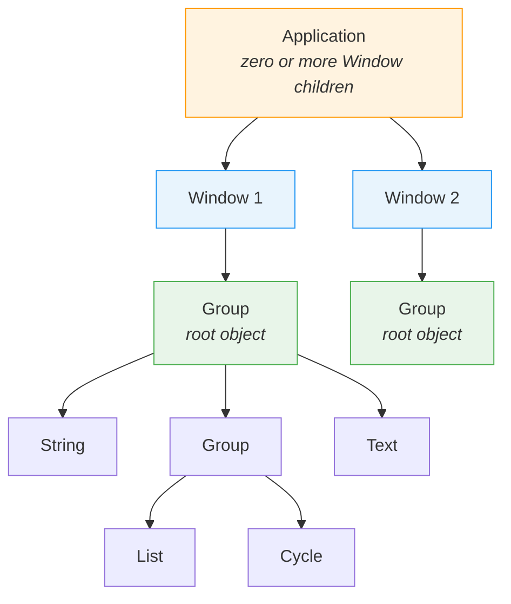
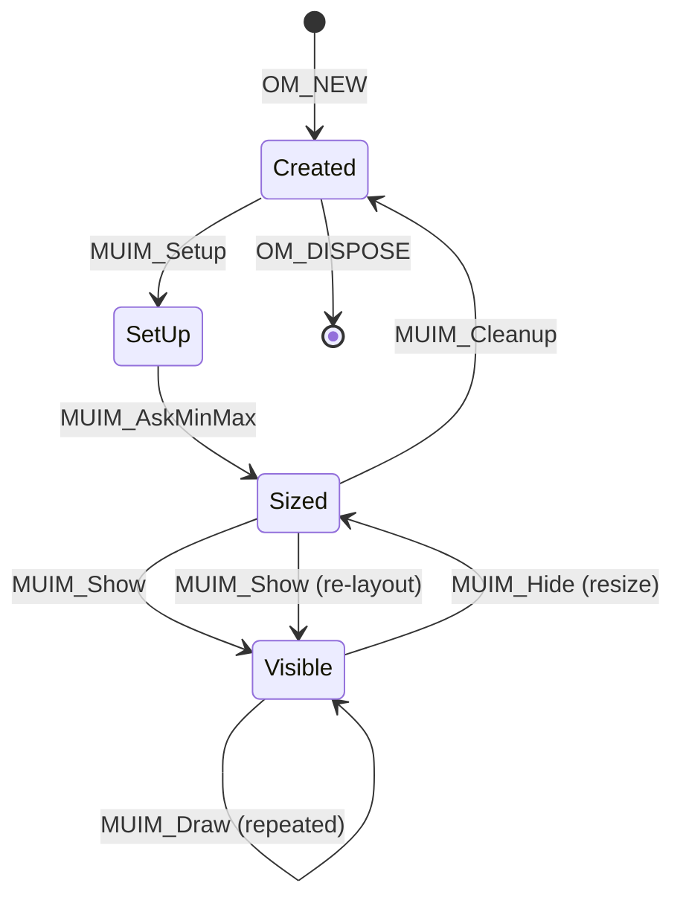
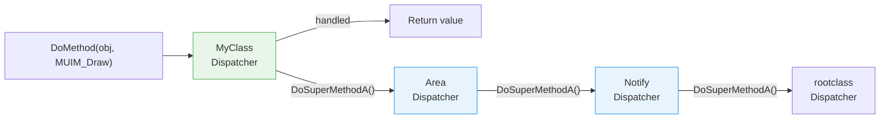
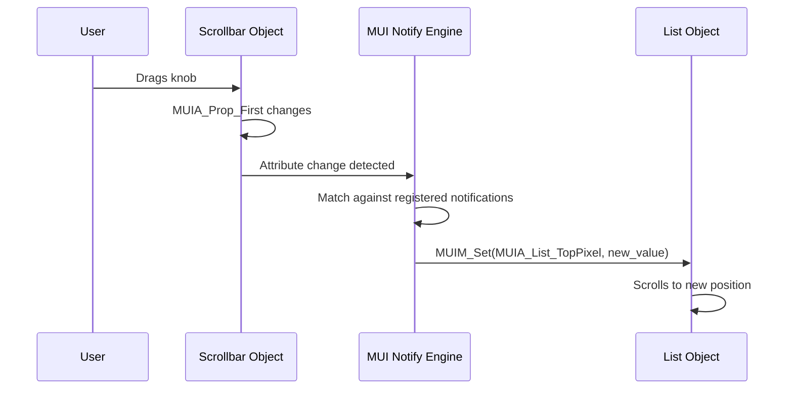
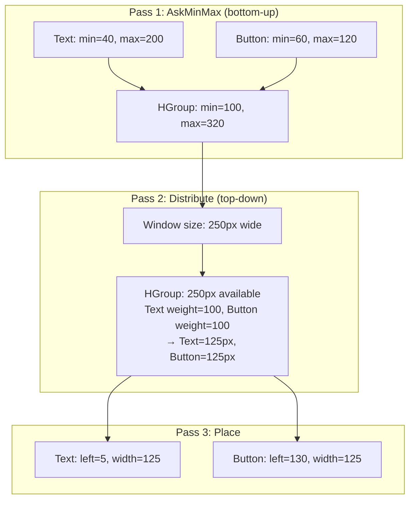
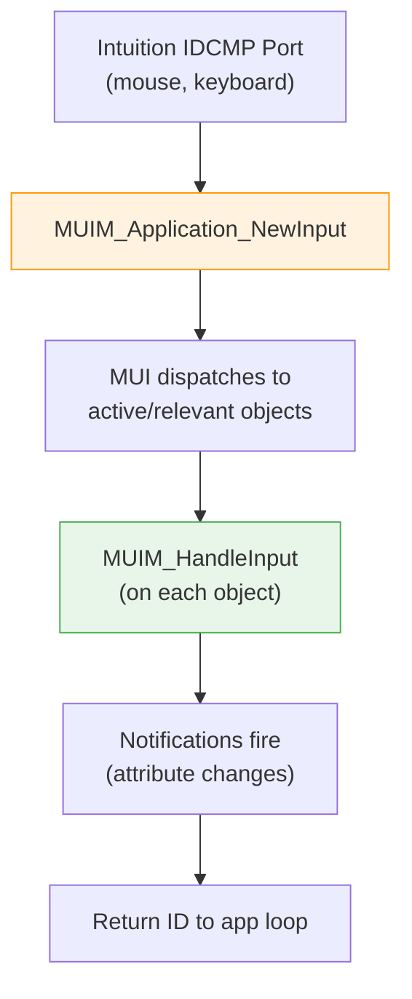

[← Home](../../../README.md) · [Intuition](../../README.md) · [Frameworks](../README.md) · [MUI](./)

# Architecture

This document describes MUI's internal architecture derived from the official MUI 3.8 SDK (`MUIdev.guide`, autodocs, and `libraries/mui.h`).

---

## BOOPSI Foundation

MUI is built on BOOPSI, AmigaOS's Basic Object-Oriented Programming System for Intuition. BOOPSI provides:

- **Classes** — type definitions containing a dispatcher function and default attributes
- **Objects** — instances of classes created with `NewObject()`
- **Methods** — operations invoked on objects via `DoMethod()`
- **Attributes** — properties set with `SetAttrs()` and read with `GetAttr()`

MUI extends BOOPSI with its own class hierarchy, layout engine, and notification system while remaining fully compatible with the underlying mechanism. Every MUI object is a valid BOOPSI object; every MUI class is a BOOPSI `IClass`.

### How MUI Extends BOOPSI

| BOOPSI Primitive | MUI Extension |
|---|---|
| `NewObject(class, ...)` | `MUI_NewObject(MUIC_name, ...)` — auto-loads disk-resident classes |
| `DoMethod(obj, methodID, ...)` | Same — MUI adds 60+ new method IDs (MUIM_*) |
| `SetAttrs(obj, tag, val, ...)` | `set(obj, attr, val)` macro — same mechanism, convenience wrapper |
| `GetAttr(attr, obj, &store)` | `get(obj, attr, &store)` macro |
| `DisposeObject(obj)` | `MUI_DisposeObject(obj)` — cascading disposal of entire object tree |

---

## Class Hierarchy

The canonical class tree from `libraries/mui.h`:

```
rootclass (BOOPSI's base class)
|
+-- Notify                   (implements notification mechanism)
|   |
|   +-- Family               (handles multiple children)
|   |   |
|   |   +-- Menustrip        (describes a complete menu strip)
|   |   +-- Menu             (describes a single menu)
|   |   \-- Menuitem         (describes a single menu item)
|   |
|   +-- Application          (main class for all applications)
|   |
|   +-- Window               (main class for all windows)
|   |   \-- Aboutmui         (About window of MUI preferences)
|   |
|   +-- Area                 (base class for all GUI elements)
|       |
|       +-- Rectangle        (spacing object)
|       +-- Balance          (balancing separator bar)
|       +-- Image            (image display)
|       +-- Bitmap           (draws bitmaps)
|       |   \-- Bodychunk    (makes bitmap from ILBM body chunk)
|       +-- Text             (text display)
|       +-- Gadget           (base class for intuition gadgets)
|       |   |
|       |   +-- String       (string gadget)
|       |   +-- Boopsi       (interface to BOOPSI gadgets)
|       |   \-- Prop         (proportional gadget)
|       |
|       +-- Gauge            (fuel gauge)
|       +-- Scale            (percentage scale)
|       +-- Colorfield       (field with changeable color)
|       |
|       +-- List             (line-oriented list)
|       |   |
|       |   +-- Floattext    (special list with floating text)
|       |   +-- Volumelist   (special list with volumes)
|       |   +-- Scrmodelist  (special list with screen modes)
|       |   \-- Dirlist      (special list with files)
|       |
|       +-- Numeric          (base class for slider gadgets)
|       |   |
|       |   +-- Knob         (turning knob)
|       |   +-- Levelmeter   (level display)
|       |   +-- Numericbutton (space saving popup slider)
|       |   \-- Slider       (traditional slider)
|       |
|       +-- Group            (groups other GUI elements)
|           |
|           +-- Register     (handles page groups with titles)
|           +-- Virtgroup    (handles virtual groups)
|           +-- Scrollgroup  (virtual groups with scrollbars)
|           +-- Scrollbar    (traditional scrollbar)
|           +-- Listview     (listview)
|           +-- Radio        (radio button)
|           +-- Cycle        (cycle gadget)
|           +-- Coloradjust  (several gadgets to adjust a color)
|           +-- Palette      (complete palette gadget)
|           |
|           +-- Popstring    (base class for popup objects)
|               |
|               +-- Popobject (popup anything in a separate window)
|               |   |
|               |   +-- Poplist   (popup a simple listview)
|               |   \-- Popscreen (popup a list of public screens)
|               |
|               \-- Popasl    (popup an asl requester)
|
+-- Semaphore                (semaphore equipped objects)
    |
    +-- Applist              (private)
    +-- Dataspace            (handles general purpose data spaces)
        \-- Configdata       (private)
```

### Class Role Summary

| Branch | Root | Responsibility |
|---|---|---|
| **Notify** | `rootclass → Notify` | Attribute observation, inter-object messaging |
| **Application** | `Notify → Application` | Program root, event loop, ARexx, Commodities |
| **Window** | `Notify → Window` | Intuition window lifecycle, IDCMP multiplexing |
| **Area** | `Notify → Area` | Visual base — sizing, rendering, input, frames |
| **Group** | `Area → Group` | Layout container — child arrangement |
| **Semaphore** | `Notify → Semaphore` | Thread-safe data containers |

---

## Application Object Tree

A MUI application forms a tree at runtime. Only three class types may have children:



| Parent | Allowed Children | Count |
|---|---|---|
| **Application** | Window objects only | 0..N |
| **Window** | Any Area subclass (usually Group) | Exactly 1 |
| **Group** | Any Area subclass (including nested Groups) | 1..N |

Error handling is cascading: if any child creation fails (returns `NULL`), the parent automatically disposes all previously created siblings and returns `NULL` itself. A successful `ApplicationObject` guarantees the entire tree was created. A single `MUI_DisposeObject(app)` destroys everything.

---

## Object Lifecycle

Every MUI object passes through a strict sequence of constructor/destructor pairs. The SDK documents this as the fundamental contract:

```
OM_NEW          — parse initial taglist, allocate instance data
{
   MUIM_Setup      — display environment known (screen, fonts, DrawInfo)
   MUIM_AskMinMax  — report min/max/default dimensions
   [ window opens ]
   {
      MUIM_Show       — object added to window (AddGadget for Intuition types)
      {
         MUIM_Draw      — render content (may be called multiple times)
      }
      MUIM_Hide       — object removed from window (RemGadget)
   }
   [ window closes ]
   MUIM_Cleanup    — free display-dependent resources
}
OM_DISPOSE      — free all resources, destroy object
```

### Lifecycle as State Machine



### Three Levels of Resource Binding

| Level | Constructor | Destructor | Available Information |
|---|---|---|---|
| **Object** | `OM_NEW` | `OM_DISPOSE` | Nothing — only taglist parsing |
| **Display** | `MUIM_Setup` | `MUIM_Cleanup` | Screen, fonts, DrawInfo, pens |
| **Window** | `MUIM_Show` | `MUIM_Hide` | Intuition Window, RastPort, position/size |

Each level may repeat independently. You may receive multiple Setup/Cleanup cycles (e.g., screen mode change) and multiple Show/Hide cycles within a single Setup (e.g., window resize).

---

## Method Dispatch Model

Every MUI class has a **dispatcher function** — a single entry point that receives all method calls. This is the standard BOOPSI dispatch pattern:

```c
ULONG MyDispatcher(struct IClass *cl, Object *obj, Msg msg)
{
    switch (msg->MethodID)
    {
        case OM_NEW        : return mNew(cl, obj, (APTR)msg);
        case OM_DISPOSE    : return mDispose(cl, obj, (APTR)msg);
        case OM_SET        : return mSet(cl, obj, (APTR)msg);
        case OM_GET        : return mGet(cl, obj, (APTR)msg);
        case MUIM_Setup    : return mSetup(cl, obj, (APTR)msg);
        case MUIM_Cleanup  : return mCleanup(cl, obj, (APTR)msg);
        case MUIM_AskMinMax: return mAskMinMax(cl, obj, (APTR)msg);
        case MUIM_Draw     : return mDraw(cl, obj, (APTR)msg);
        case MUIM_HandleInput: return mHandleInput(cl, obj, (APTR)msg);
    }

    /* Unknown methods → pass to superclass */
    return DoSuperMethodA(cl, obj, msg);
}
```

### Dispatch Chain



Key rules:
- **Always call `DoSuperMethodA()`** for unrecognized methods — MUI sends undocumented internal methods
- **Never render in `OM_SET`** — call `MUI_Redraw(obj, flag)` instead; MUI will invoke `MUIM_Draw`
- The dispatcher receives `struct IClass *cl` (the class pointer), `Object *obj`, and `Msg msg` in registers `a0`, `a2`, `a1` respectively

---

## Notification System

The central mechanism for controlling a MUI application. Notification creates **declarative reactive bindings** between objects.

### How It Works

Every MUI object has attributes that reflect its current state. Attributes change either programmatically (`SetAttrs()`) or through user interaction. Notification watches for these changes and automatically invokes methods on target objects.



### Registration

```c
DoMethod(source, MUIM_Notify,
    watched_attribute,    /* which attribute to observe */
    trigger_value,        /* MUIV_EveryTime or specific value */
    target_object,        /* destination object */
    param_count,          /* number of following parameters */
    target_method, ...);  /* method + arguments to invoke */
```

### Notification Suppression

When setting attributes programmatically, you may want to suppress notifications to avoid loops:

```c
/* Normal set — triggers any registered notifications */
set(slider, MUIA_Slider_Level, 50);

/* Suppressed set — no notifications fire */
SetAttrs(slider, MUIA_NoNotify, TRUE,
    MUIA_Slider_Level, 50, TAG_DONE);
```

`MUIA_NoNotify` is a one-shot attribute — it only applies to the current `SetAttrs()` call.

### Deregistration

```c
/* Remove all notifications on a specific attribute */
DoMethod(source, MUIM_KillNotify, MUIA_Slider_Level);

/* Remove notification targeting a specific object */
DoMethod(source, MUIM_KillNotifyObj, MUIA_Slider_Level, target);
```

---

## Layout Engine Internals

MUI's layout engine uses a **three-pass constraint system** that runs before window open and on every resize.

### Pass 1: AskMinMax (Bottom-Up)

Every object reports its minimum, maximum, and default dimensions. Leaf objects (Text, String, etc.) report fixed values based on content and font. Group objects aggregate their children:

**Horizontal Group:**
- Min width = sum of all children's min widths
- Max width = sum of all children's max widths
- Min height = largest child min height
- Max height = smallest child max height

**Vertical Group:**
- Min height = sum of all children's min heights
- Max height = sum of all children's max heights
- Min width = largest child min width
- Max width = smallest child max width

### Pass 2: Size Distribution (Top-Down)

Starting from the window's current size, the root group distributes available space among children. Extra space (beyond minimum) is distributed proportionally according to **weight** attributes (`MUIA_Weight`, default 100).

### Pass 3: Placement

Each object receives its final rectangle `(left, top, width, height)` and records it in instance data accessible via macros:

| Macro | Returns |
|---|---|
| `_mleft(obj)` | Left edge of content area (inside frame) |
| `_mtop(obj)` | Top edge of content area |
| `_mright(obj)` | Right edge of content area |
| `_mbottom(obj)` | Bottom edge of content area |
| `_mwidth(obj)` | Content area width |
| `_mheight(obj)` | Content area height |
| `_rp(obj)` | RastPort pointer for rendering |

### Layout Flow



---

## Input Handling

MUI multiplexes Intuition IDCMP messages through the Application object's event loop.

### Event Flow



### IDCMP Subscription

Custom classes request specific IDCMP events dynamically:

```c
/* During MUIM_HandleInput — request mouse move tracking */
MUI_RequestIDCMP(obj, IDCMP_MOUSEMOVE);

/* Stop tracking when done */
MUI_RejectIDCMP(obj, IDCMP_MOUSEMOVE);
```

MUI translates raw IDCMP events into higher-level `MUIKEY_*` constants for keyboard navigation:

| MUIKEY Constant | Meaning |
|---|---|
| `MUIKEY_PRESS` | Confirm / activate |
| `MUIKEY_TOGGLE` | Toggle selection |
| `MUIKEY_UP/DOWN/LEFT/RIGHT` | Directional navigation |
| `MUIKEY_PAGEUP/PAGEDOWN` | Page scrolling |
| `MUIKEY_TOP/BOTTOM` | Jump to extremes |
| `MUIKEY_WORDLEFT/WORDRIGHT` | Word-level navigation |

---

## Dynamic Object Linking

MUI supports **late binding** — adding and removing children after the initial tree is created.

```c
/* Add a window to a running application */
DoMethod(app, OM_ADDMEMBER, new_window);
set(new_window, MUIA_Window_Open, TRUE);

/* Remove and dispose when done */
set(new_window, MUIA_Window_Open, FALSE);
DoMethod(app, OM_REMMEMBER, new_window);
MUI_DisposeObject(new_window);  /* manual disposal required */
```

For groups, the window must be **closed** before modifying children:

```c
set(window, MUIA_Window_Open, FALSE);
DoMethod(group, MUIM_Group_InitChange);    /* begin modification */
DoMethod(group, OM_ADDMEMBER, new_child);
DoMethod(group, MUIM_Group_ExitChange);    /* end — triggers re-layout */
set(window, MUIA_Window_Open, TRUE);
```

---

## Rendering Model

MUI uses **retained-mode rendering** — the framework maintains the object tree and handles all damage repair.

### Draw Flags

| Flag | Meaning |
|---|---|
| `MADF_DRAWOBJECT` | Complete redraw of the object |
| `MADF_DRAWUPDATE` | Incremental update (optimization) |

Custom classes call `MUI_Redraw(obj, flag)` to request a redraw. MUI calls `MUIM_Draw` with appropriate flags. Inside `MUIM_Draw`, the class can check which type of redraw is needed:

```c
case MUIM_Draw:
{
    struct MUIP_Draw *msg = (struct MUIP_Draw *)msg;
    DoSuperMethodA(cl, obj, msg);  /* let Area draw background + frame */

    if (msg->flags & MADF_DRAWOBJECT)
    {
        /* Full redraw — render everything */
    }
    else if (msg->flags & MADF_DRAWUPDATE)
    {
        /* Partial update — only changed elements */
    }
    return 0;
}
```

### Rendering Rules

1. **Never draw outside `MUIM_Draw`** — not in `OM_SET`, not in `MUIM_HandleInput`
2. **Always call `DoSuperMethodA()` first** — Area class draws background and frame
3. **Only draw within `_mleft()` / `_mtop()` / `_mright()` / `_mbottom()`** — the content rectangle inside the frame
4. **Use `_rp(obj)`** to get the RastPort — never cache it across Show/Hide cycles

---

## Tag ID Namespace

MUI uses the AmigaOS `TagItem` system for all attributes and methods. The namespace is partitioned:

| Range | Owner |
|---|---|
| `0x80420000 – 0x8042FFFF` | MUI built-in classes (reserved) |
| `TAG_USER \| (serial << 16) \| offset` | Registered third-party classes |

Each registered MUI developer received a unique serial number. All their class attributes and methods are prefixed with `TAG_USER | (serial << 16)` to avoid tag collisions across the MCC ecosystem.

---

## Key Architectural Files

| File | Purpose |
|---|---|
| `libraries/mui.h` | Main header — class names, method IDs, attribute tags, macros, class tree |
| `clib/muimaster_protos.h` | C prototypes for `muimaster.library` functions |
| `proto/muimaster.h` | Compiler-specific prototype wrappers |
| `pragma/muimaster_lib.h` | SAS/C library call pragmas |
| `muimaster.library` | Runtime — object creation, layout, event handling, preferences |
| `MUI_<Class>.doc` | Per-class autodoc reference (66 files) |
| `MUIdev.guide` | Official developer guide — architecture, custom classes, style guide |

---

Previous: [Introduction](01-introduction.md)
Next: [Getting Started](03-getting-started.md)
