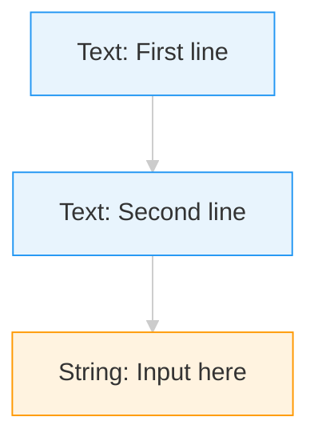
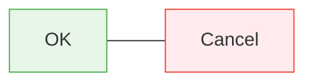
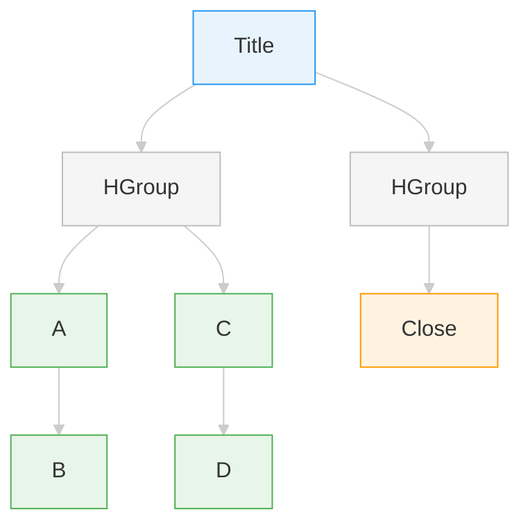
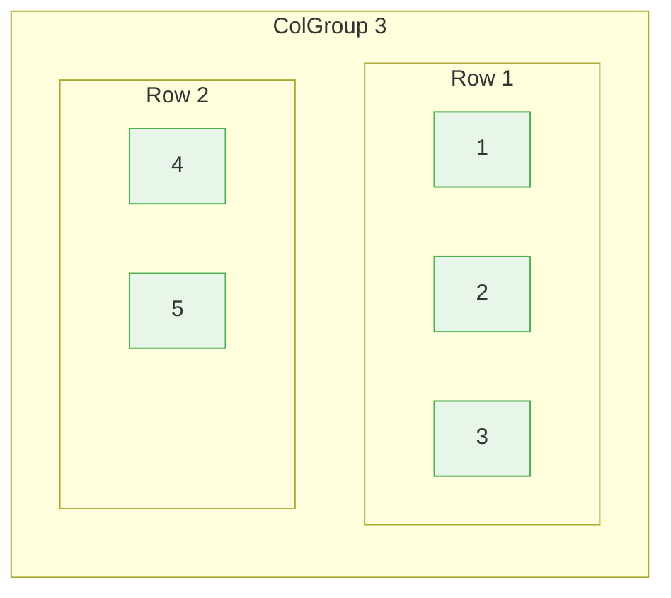
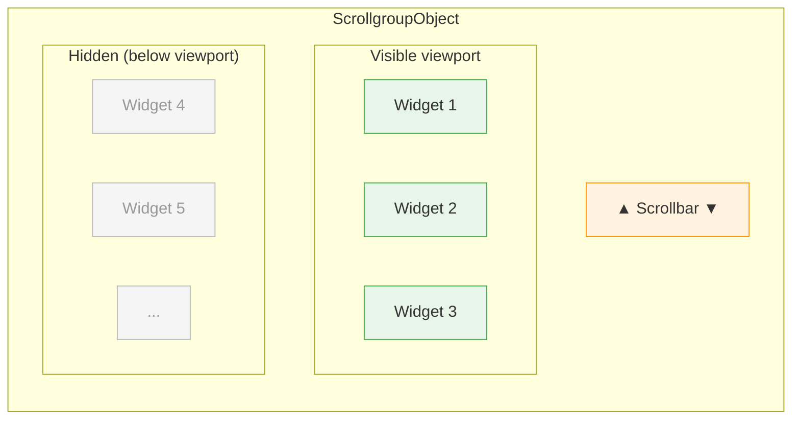
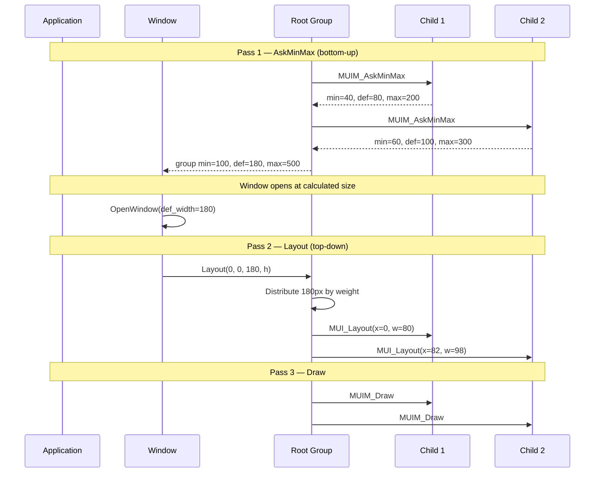
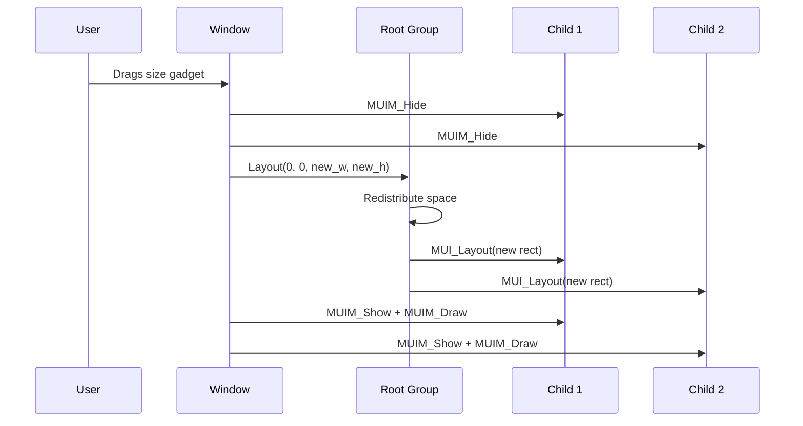
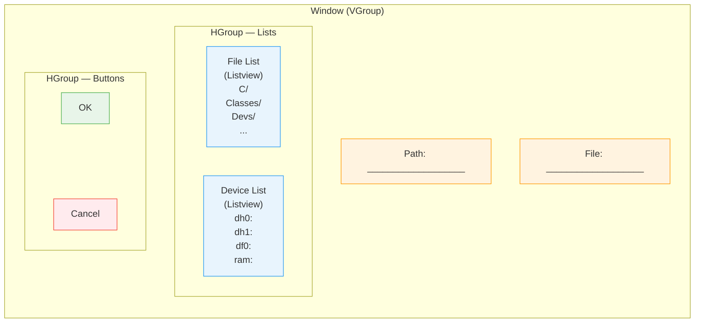

[← Home](../../../README.md) · [Intuition](../../README.md) · [Frameworks](../README.md)

# Layout System

## Overview

MUI handles widget positioning automatically through its Group classes. Rather than specifying absolute coordinates, you declare the structure of your UI and MUI computes sizes and positions based on:

- Each widget's minimum, default, and maximum size requirements
- Group direction (horizontal or vertical)
- Spacing, framing, and balancing hints
- User preferences from the MUI settings program

## Group Classes

Groups are containers that arrange their children. There are three primary group macros:

| Macro | Direction | Description |
|-------|-----------|-------------|
| `VGroup` | Vertical | Stacks children top-to-bottom |
| `HGroup` | Horizontal | Stacks children left-to-right |
| `GroupObject` | Configurable | Defaults to vertical; can be changed with `MUIA_Group_Horiz` |

### Basic Vertical Layout

```c
WindowContents, VGroup,
    Child, TextObject,
        MUIA_Text_Contents, "First line",
        End,
    Child, TextObject,
        MUIA_Text_Contents, "Second line",
        End,
    Child, StringObject,
        StringFrame,
        MUIA_String_Contents, "Input here",
        End,
    End,
```

**Visual result:**



> VGroup stacks children **top-to-bottom**. Each child gets the full window width.

### Basic Horizontal Layout

```c
WindowContents, HGroup,
    Child, SimpleButton("OK"),
    Child, SimpleButton("Cancel"),
    End,
```

**Visual result:**



> HGroup arranges children **left-to-right**. Both buttons share available width equally.

### Nested Groups

Complex layouts are built by nesting groups:

```c
WindowContents, VGroup,
    Child, TextObject,
        TextFrame,
        MUIA_Background, MUII_TextBack,
        MUIA_Text_Contents, "\33cTitle",
        End,

    Child, HGroup,
        Child, VGroup,
            Child, SimpleButton("A"),
            Child, SimpleButton("B"),
            End,
        Child, VGroup,
            Child, SimpleButton("C"),
            Child, SimpleButton("D"),
            End,
        End,

    Child, HGroup,
        Child, HSpace(0),
        Child, SimpleButton("Close"),
        Child, HSpace(0),
        End,

    End,
```

**Visual result:**



> The outer VGroup stacks Title → HGroup → Close vertically. The HGroup lays out VGroup1 and VGroup2 side-by-side. A and B stack within VGroup1; C and D within VGroup2.

## Spacing Objects

### Rectangle

A Rectangle is an invisible spacing object. Use it to create fixed or flexible gaps.

```c
Child, RectangleObject,
    MUIA_Rectangle_HMin, 20,
    MUIA_Rectangle_VMin, 10,
    End,
```

### Balance

A Balance object is a draggable separator that divides space between adjacent children. Users can drag it to resize the areas.

```c
Child, ListviewObject,
    MUIA_Listview_List, myList,
    End,
Child, BalanceObject, End,
Child, TextObject,
    MUIA_Text_Contents, "Details pane",
    End,
```

### HSpace and VSpace

Quick macros for adding flexible spacing:

```c
Child, HSpace(0),   /* expands to fill available horizontal space */
Child, VSpace(0),   /* expands to fill available vertical space */
```

Use these to push widgets to the edges or center them.

## Frames and Backgrounds

Frames are visual borders around objects. MUI provides frame macros that set both the frame style and background:

| Macro | Appearance |
|-------|------------|
| `TextFrame` | Standard text field frame |
| `StringFrame` | Input field frame |
| `GroupFrame` | Group border with optional title |
| `ReadListFrame` | Listview frame |
| `ButtonFrame` | Button frame |

Usage:

```c
Child, TextObject,
    TextFrame,
    MUIA_Background, MUII_TextBack,
    MUIA_Text_Contents, "Framed text",
    End,
```

Backgrounds can be specified with standard MUI images:

| Constant | Meaning |
|----------|---------|
| `MUII_BACKGROUND` | Standard background |
| `MUII_SHADOW` | Shadow color |
| `MUII_SHINE` | Highlight color |
| `MUII_FILL` | Fill pattern |
| `MUII_TEXTBACK` | Text background |
| `MUII_BUTTONBACK` | Button background |

## Group Attributes

### Same Size

Force all children to have the same size:

```c
HGroup, MUIA_Group_SameSize, TRUE,
    Child, SimpleButton("Short"),
    Child, SimpleButton("A much longer label"),
    End,
```

Both buttons will expand to fit the widest label.

### Columns

Arrange children in a grid with a fixed number of columns:

```c
GroupObject, MUIA_Group_Columns, 3,
    Child, SimpleButton("1"),
    Child, SimpleButton("2"),
    Child, SimpleButton("3"),
    Child, SimpleButton("4"),
    Child, SimpleButton("5"),
    End,
```

**Visual result (3-column grid, 5 children):**



### Horiz

Make a Group horizontal instead of vertical:

```c
GroupObject, MUIA_Group_Horiz, TRUE,
    ...
    End,
```

## Custom Layout Hooks

For complex layouts that MUI's built-in groups cannot express, you can provide a custom layout hook. The hook receives layout messages and positions children manually.

### Hook Structure

```c
SAVEDS ULONG __asm LayoutFunc(REG(a0) struct Hook *h,
                               REG(a2) Object *obj,
                               REG(a1) struct MUI_LayoutMsg *lm)
{
    switch (lm->lm_Type)
    {
        case MUILM_MINMAX:
            /* Calculate and return min/max/default sizes */
            lm->lm_MinMax.MinWidth  = ...;
            lm->lm_MinMax.MinHeight = ...;
            lm->lm_MinMax.DefWidth  = ...;
            lm->lm_MinMax.DefHeight = ...;
            lm->lm_MinMax.MaxWidth  = MUI_MAXMAX;
            lm->lm_MinMax.MaxHeight = MUI_MAXMAX;
            return 0;

        case MUILM_LAYOUT:
            /* Position each child with MUI_Layout() */
            Object *cstate = (Object *)lm->lm_Children->mlh_Head;
            Object *child;

            while (child = NextObject(&cstate))
            {
                if (!MUI_Layout(child, left, top, width, height, 0))
                    return FALSE;
            }
            return TRUE;
    }
    return MUILM_UNKNOWN;
}
```

### Attaching the Hook

```c
static struct Hook LayoutHook = { {0,0}, LayoutFunc, NULL, NULL };

...

GroupObject,
    MUIA_Group_LayoutHook, &LayoutHook,
    Child, ...,
    Child, ...,
    End,
```

### Important Notes

- In `MUILM_MINMAX`, the children's min/max values are already calculated. You can use them to derive your group's size.
- In `MUILM_LAYOUT`, you must call `MUI_Layout()` for every child. The rectangle you are given is `(0, 0, width-1, height-1)`.
- Return `MUILM_UNKNOWN` for any message type you do not handle.
- Avoid errors during layout; MUI does not handle them gracefully.

## Virtual Groups and Scroll Groups

When content exceeds available space, use a virtual group with scrollbars:

```c
Child, ScrollgroupObject,
    MUIA_Scrollgroup_Contents, VirtgroupObject,
        Child, /* lots of widgets */,
        Child, /* lots of widgets */,
        End,
    End,
```

The `Virtgroup` creates a virtual canvas. The `Scrollgroup` adds scrollbars as needed.

**Scrollgroup structure:**



## Layout Algorithm



### On Window Resize



### File Requester — Real-World Layout Example

From the official MUI SDK, a file requester demonstrates nested group layout:



**Corresponding MUI code:**

```c
VGroup,
    Child, HGroup,
        Child, FileListview(),
        Child, DeviceListview(),
        End,
    Child, PathGadget(),
    Child, FileGadget(),
    Child, HGroup,
        Child, OkayButton(),
        Child, HSpace(0),
        Child, CancelButton(),
        End,
    End;
```

---

Previous: [Core Concepts](04-core-concepts.md)
Next: [Widgets Overview](06-widgets-overview.md)
