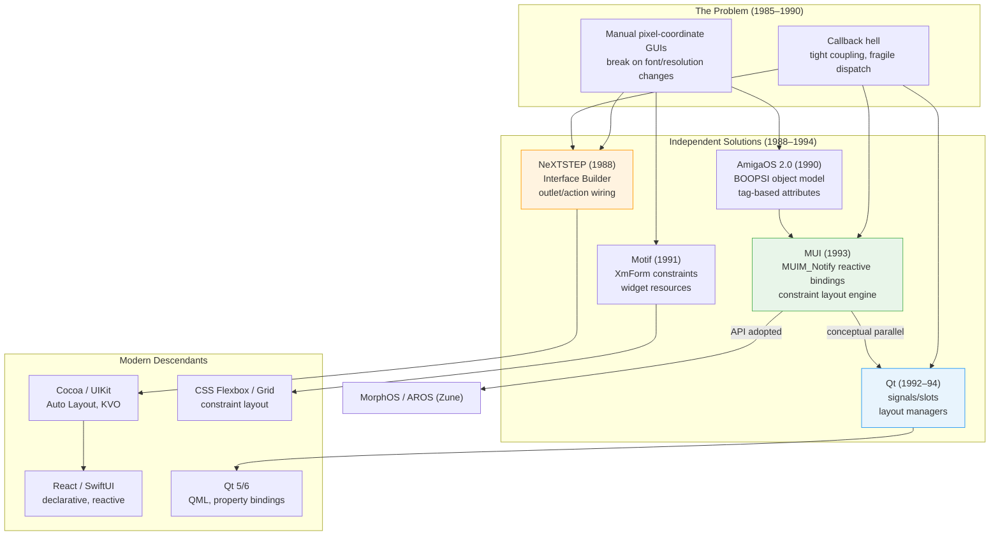
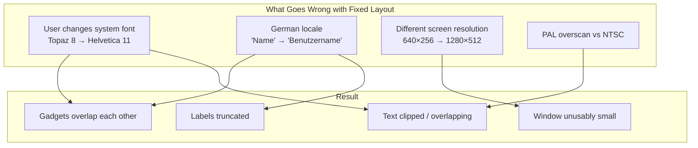
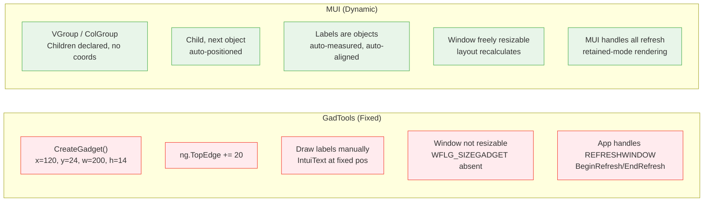
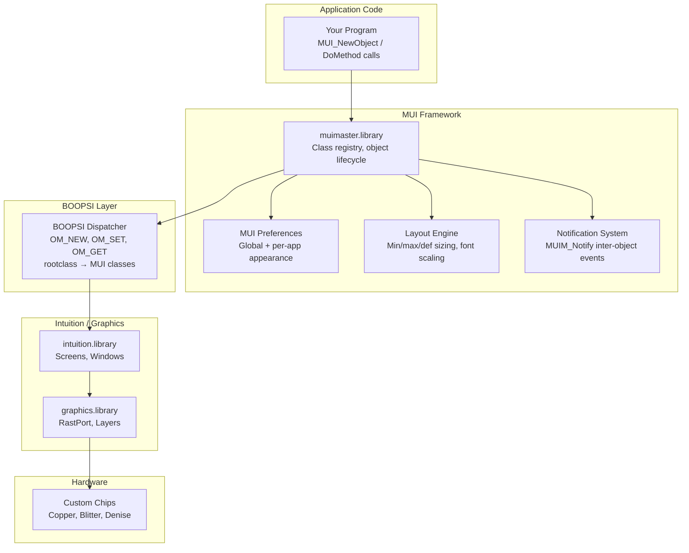
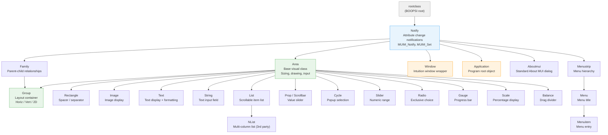
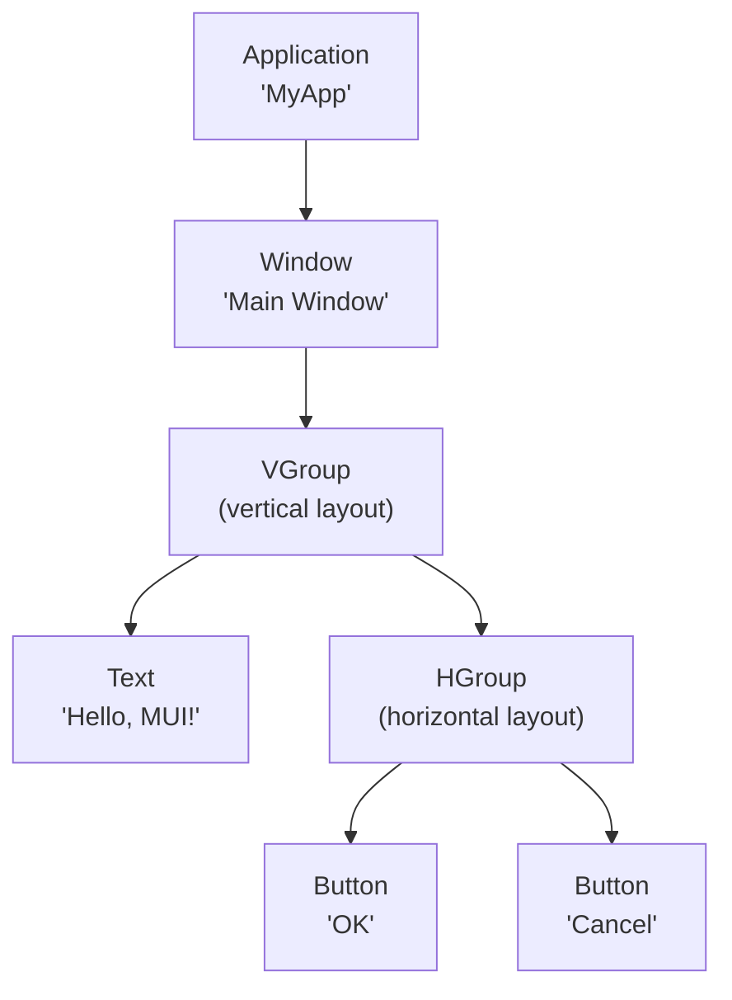
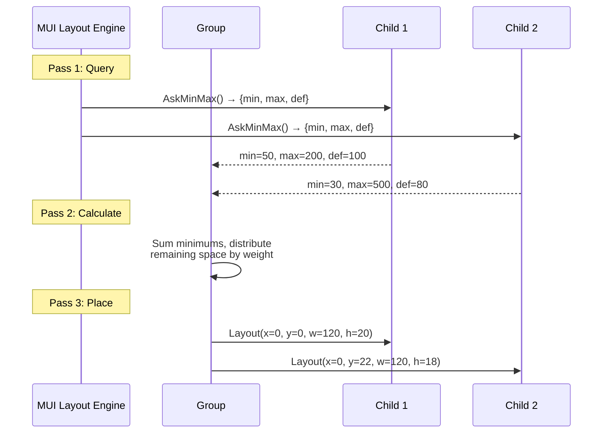
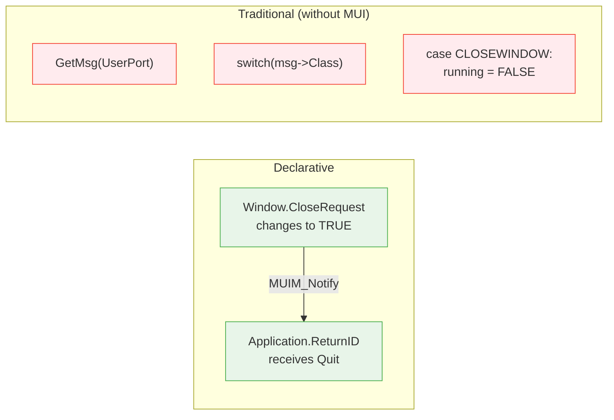
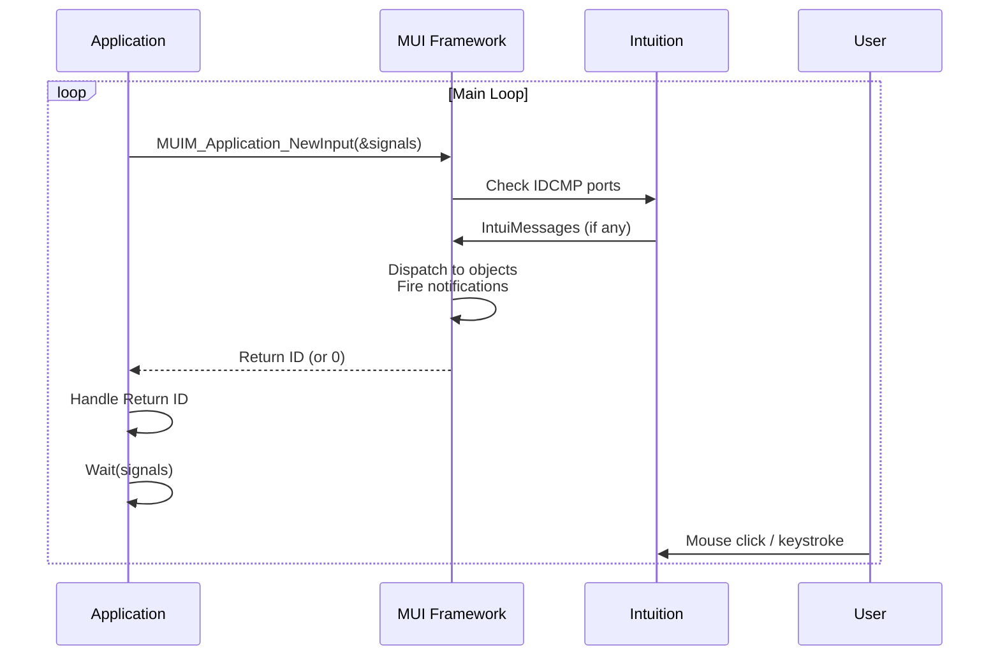
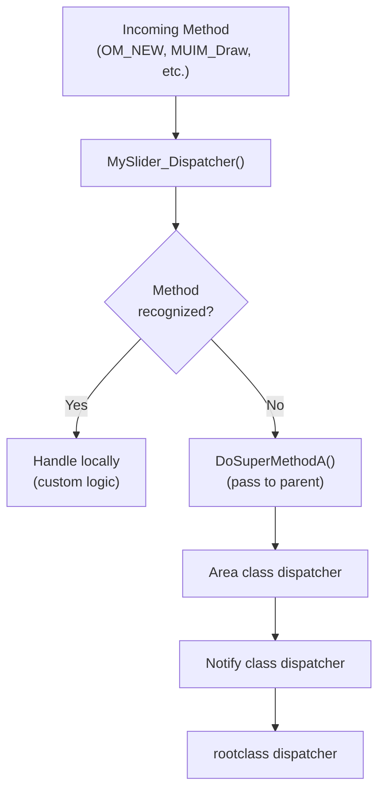

[← Home](../../../README.md) · [Intuition](../../README.md) · [GUI Frameworks](../README.md)

# MUI — Magic User Interface

## Overview

In 1985, AmigaOS shipped with **Intuition** — a windowing system that was years ahead of its time. Multiple screens, depth-arranged windows, real-time dragging — features that competing platforms wouldn't match for a decade. But Intuition had a fundamental limitation baked into its DNA: **every pixel was the programmer's responsibility**. Gadgets had fixed coordinates. Fonts were hardcoded. Layouts were brittle. If the user changed their system font from Topaz 8 to Helvetica 11, half the applications on their Workbench became unusable — text clipped, gadgets overlapping, windows too small to function.

By the early 1990s, this was no longer acceptable. The Amiga had evolved from a single-resolution PAL/NTSC machine into a platform supporting everything from 320×200 interlace to 1280×1024 RTG displays. Localization was becoming critical as the European market — Germany, Scandinavia, the UK — drove the majority of Amiga sales. A German label that reads "Datei" in English might be "Dateiverzeichnis" — and there was simply no way to handle that with `ng_LeftEdge = 120`.

**MUI** (Magic User Interface), created by **Stefan Stuntz** and first released in **1993**, was the answer. It didn't just patch the problem — it fundamentally redefined how Amiga GUI programming worked. MUI introduced a **declarative, object-oriented, layout-managed** paradigm that replaced the pixel-coordinate imperative model entirely. The developer no longer tells the system *where* to place a gadget. Instead, the developer describes *what* the interface contains — its structure, its relationships, its behavior — and MUI decides *where* and *how* to render everything at runtime.

### The Paradigm Shift

MUI's arrival on the Amiga platform represented something analogous to what CSS Flexbox would later do for web development, or what Auto Layout would do for iOS — but in 1993, on a 7 MHz 68000 with 512 KB of RAM. The core insight was deceptively simple: **separate structure from presentation**.

This wasn't just an API improvement. It was a philosophical break:

- **Imperative → Declarative.** Instead of `CreateGadget(STRING_KIND, gad, &ng, ...)` with manual X/Y/W/H, you write `Child, StringObject, StringFrame, End`. No coordinates. No font measurements. No pixel arithmetic.

- **Programmer-controlled → User-controlled.** MUI ships with a comprehensive **Preferences application** that lets end users control fonts, colors, frame styles, spacing, backgrounds, and scrollbar appearance — for every MUI application, globally. Two users running the same binary can have completely different visual experiences, and both are pixel-perfect.

- **Monolithic event loop → Reactive notification.** Traditional Intuition programming requires a central `while(GetMsg())` loop that manually dispatches every IDCMP message to every gadget. MUI replaces this with `MUIM_Notify` — a declarative binding system where objects notify each other directly. The event loop shrinks to three lines.

- **Fixed rendering → Retained-mode rendering.** In raw Intuition, the application is responsible for every pixel of damage repair. MUI maintains a complete object tree and handles all refresh, resize, and clipping internally. The developer's custom rendering code only needs to paint the widget's content; MUI handles the rest.

### Built on BOOPSI

MUI is not a standalone system. It is built on top of **BOOPSI** (Basic Object-Oriented Programming System for Intuition), the native object system introduced in AmigaOS 2.0. BOOPSI provides the foundational infrastructure — class registration, object instantiation via `NewObject()`, method dispatch via `DoMethod()`, and single inheritance. Every MUI object is a BOOPSI object. Every MUI class is registered in the BOOPSI class tree.

What MUI adds on top of BOOPSI is substantial:

| BOOPSI Provides | MUI Adds |
|---|---|
| Class registry (`AddClass`, `FindClass`) | 40+ built-in widget classes |
| Object lifecycle (`NewObject`, `DisposeObject`) | Declarative tree construction with macros |
| Method dispatch (`DoMethod`, `DoSuperMethod`) | Notification system (`MUIM_Notify`) |
| Attribute system (`OM_SET`, `OM_GET`) | Extended attribute naming (MUIA_*, I/S/G flags) |
| Single inheritance | Layout engine (constraint-based sizing) |
| *Nothing for layout* | Automatic font-sensitive positioning |
| *Nothing for user prefs* | Full preference system with per-app overrides |

### Evolution and Adoption

MUI evolved through several major releases, all authored solely by **Stefan Stuntz** until the AmigaOS 4 continuation:

| Version | Year | Author | Milestone |
|---|---|---|---|
| **1.0** | 1993 | Stefan Stuntz | Initial release. Core class tree, layout engine, notification system |
| **2.0** | 1994 | Stefan Stuntz | Virtual groups, popup classes, improved preferences |
| **3.0** | 1995 | Stefan Stuntz | Custom class API (`MUI_CreateCustomClass`), drag & drop |
| **3.8** | 1997 | Stefan Stuntz | Final public developer release. Definitive API for classic AmigaOS |
| **4.0** | 2005+ | Thore Böckelmann | AmigaOS 4 continuation, maintained under license from Stuntz |

By the mid-1990s, MUI had become the **de-facto standard** for serious Amiga applications. Programs like **YAM** (Yet Another Mailer), **IBrowse**, **AmiTradeCenter**, **SimpleMail**, and **Odyssey** were all built with MUI. The Aminet archive accumulated hundreds of third-party **MCC** (MUI Custom Class) libraries — NList for multi-column lists, TextEditor for full text editing, HTMLview for web rendering — creating an ecosystem that no other Amiga GUI framework could match.

MUI's influence extended beyond AmigaOS. **MorphOS** adopted MUI as its native GUI toolkit. **AROS** created **Zune**, an API-compatible reimplementation. The core architectural patterns — declarative layout, reactive notification, user-controlled theming — anticipated design principles that wouldn't become mainstream on other platforms until years later.

### Distribution and Licensing

MUI was distributed as **shareware** — a licensing model common in the Amiga ecosystem of the 1990s. The split worked as follows:

| Component | License | Distribution |
|---|---|---|
| **Runtime** (`muimaster.library` + prefs app) | Freeware | Aminet `util/libs/mui38usr.lha` — freely redistributable |
| **Developer SDK** (headers, autodocs, examples) | Shareware | Aminet `dev/mui/mui38dev.lha` — registration requested |
| **Source code** | Proprietary | Never released; MUI remained closed-source |

Unregistered users saw periodic **nag requesters** reminding them to register — a friction point that contributed to some community resistance, though most serious developers registered.

**Version 3.8** (1997) was the **last release for classic AmigaOS** (68K). Stefan Stuntz ceased active development of the classic branch after this version. The 3.8 API became the frozen reference point that all classic AmigaOS, MorphOS, and AROS (Zune) implementations target. No further features or bug fixes were issued for the 68K codebase.

The library was not included in AmigaOS ROM — it installed as a disk-resident library at `LIBS:muimaster.library` (~300 KB). This external dependency was MUI's primary competitive disadvantage against ROM-resident alternatives like GadTools, but the overwhelming superiority of the programming model made it the dominant choice regardless.

### Historical Context — Parallel Evolution of GUI Paradigms

MUI did not emerge in isolation. The early 1990s saw an industry-wide reckoning with the limitations of manual, pixel-coordinate GUI programming. Several platforms arrived at remarkably similar solutions independently — a convergent evolution driven by the same underlying problem.

**The Timeline of Innovation:**

| Year | Platform | Innovation |
|---|---|---|
| **1988** | **NeXTSTEP** | Interface Builder + AppKit: visual declarative layout, outlet/action connections, `.nib` serialization |
| **1990** | **Amiga OS 2.0** | BOOPSI: object-oriented gadget system with `NewObject()`, `DoMethod()`, tag-based attributes |
| **1991** | **Motif / Xt** | Widget constraint resources, XmForm constraint-based layout |
| **1992** | **Qt (conception)** | Eirik Chambe-Eng invents the **signals and slots** paradigm at Trolltech |
| **1993** | **MUI 1.0** | MUIM_Notify reactive bindings, constraint-based layout engine, user preference system |
| **1994** | **Qt 0.90** | First public Qt release. MOC-generated signals/slots, widget hierarchy |
| **1997** | **MUI 3.8** | Definitive classic API — drag & drop, custom classes, virtual groups |
| **1998** | **Qt 2.0** | Layout managers (`QHBoxLayout`, `QVBoxLayout`), style engines |

**MUI's `MUIM_Notify` and Qt's Signals/Slots** are conceptually parallel solutions to the same problem: *how do objects communicate in a loosely-coupled, event-driven GUI?*

| Concept | MUI (1993) | Qt (1994) |
|---|---|---|
| **Binding declaration** | `DoMethod(src, MUIM_Notify, attr, val, dst, n, method, ...)` | `connect(src, SIGNAL(sig()), dst, SLOT(slot()))` |
| **Trigger** | Attribute change matches a value | Signal emission |
| **Target** | Any object, any method | Any QObject, any slot |
| **Coupling** | Source knows nothing about target's implementation | Source knows nothing about receiver |
| **Value passing** | `MUIV_TriggerValue` forwards the changed value | Signal parameters forwarded to slot |
| **Implementation** | Runtime tag dispatch, no preprocessor | MOC-generated metaobject tables |

There is no documented evidence that Qt's signal/slot system was directly derived from MUI's notification model — they were invented independently within months of each other. However, the architectural convergence is striking. Both abandoned the callback-function-pointer pattern that dominated C and C++ GUI programming in favor of a declarative, loosely-coupled observer model.

**NeXTSTEP's influence** is easier to trace. Steve Jobs' NeXT platform introduced the *outlet/action* pattern in 1988 — a visual wiring system where Interface Builder connected UI objects to code without explicit callback registration. MUI's notification system solves the same problem from a different angle: NeXTSTEP used visual wiring in a builder tool; MUI used declarative code-level bindings. Both eliminated the monolithic event-dispatch loop.

**The broader pattern:**



What made MUI remarkable was not just *what* it did — other platforms were solving similar problems — but *when* and *where* it did it. MUI delivered a fully declarative, reactive, user-themeable GUI framework in **1993**, on a **7 MHz 68000** with **512 KB of RAM**, in **pure C** without a preprocessor, a visual builder, or a garbage collector. The same concepts that would later require the MOC preprocessor in Qt, the Objective-C runtime on NeXT, or a JavaScript virtual DOM — MUI achieved with tag arrays and BOOPSI dispatchers.

### What Developers Actually Valued

Community feedback from forums (Amiga.org, EAB/English Amiga Board, Reddit r/amiga) and developer testimonials consistently highlights these qualities:

- **"Install MUI first"** — setting up a working Amiga Workbench without MUI was considered incomplete. It was the single most essential third-party package.
- **Rapid development** — developers report that complex UIs that would take hundreds of lines of GadTools code compress to 30–50 lines of MUI macros.
- **"It just works on every screen"** — the font/resolution independence meant software worked from 320×200 interlace to 1280×1024 RTG without any code changes.
- **The MCC ecosystem** — third-party classes like NList, TextEditor, and TheBar turned MUI into a comprehensive widget toolkit rivalling contemporary commercial frameworks.
- **User empowerment** — end users valued MUI because *they* controlled how their desktop looked. The MUI Preferences application was as important to the Amiga user experience as the applications themselves.

The primary criticisms — resource weight on 68000, shareware nag screens, and external dependency — were valid trade-offs that the community overwhelmingly accepted in exchange for the programming model.

### Why MUI Matters

| Before MUI | With MUI |
|---|---|
| Manual X/Y coordinates for every gadget | Automatic layout with groups |
| Fixed fonts break layout | Font-sensitive, resolution-independent |
| No standard look across apps | Consistent, user-customizable appearance |
| Complex IDCMP event loop | Declarative notification system |
| Programmer handles all refresh | Framework handles damage repair |
| Each app reinvents scrollbars, lists | Rich built-in widget set |

---

## The Fundamental Problem MUI Solves

### Intuition's Fixed-Layout Model

Traditional Intuition/GadTools programming requires the developer to specify **exact pixel coordinates** for every gadget. This creates a fragile layout that breaks when any environmental variable changes:

```c
/* Traditional GadTools — hardcoded coordinates */
struct NewGadget ng = {
    .ng_LeftEdge   = 120,    /* absolute X position */
    .ng_TopEdge    = 24,     /* absolute Y position */
    .ng_Width      = 200,    /* fixed width in pixels */
    .ng_Height     = 14,     /* fixed height in pixels */
    .ng_GadgetText = "Name:",
    .ng_TextAttr   = &topaz8,  /* hardcoded font */
};
gad = CreateGadget(STRING_KIND, gad, &ng, ...);

/* Next gadget — manually calculated position */
ng.ng_TopEdge += 20;  /* hope 20 pixels is enough... */
ng.ng_GadgetText = "Address:";
gad = CreateGadget(STRING_KIND, gad, &ng, ...);
```

This breaks in the following common scenarios:



### How MUI Fixes It

MUI replaces absolute coordinates with a **constraint-based layout model**. The developer declares the *structure* of the interface, and MUI calculates positions at runtime:

```c
/* MUI — same dialog, no coordinates anywhere */
WindowContents, VGroup,
    Child, ColGroup(2),
        Child, Label2("Name:"),
        Child, StringObject, StringFrame, End,

        Child, Label2("Address:"),
        Child, StringObject, StringFrame, End,
    End,

    Child, HGroup,
        Child, SimpleButton("_OK"),
        Child, SimpleButton("_Cancel"),
    End,
End,
```

MUI automatically:
- Measures label widths in the **current font** and aligns columns
- Adapts when the user switches from Topaz 8 to any proportional font
- Accommodates longer text in localized versions (German, French)
- Respects the screen's available area and overscan settings
- Makes the window **resizable** — gadgets stretch proportionally

### Side-by-Side Comparison



---

## Key Capabilities Deep Dive

### 1. Automatic Layout Management

MUI's layout engine works in three passes for every window open/resize:

| Pass | Name | Action |
|---|---|---|
| **1** | `AskMinMax` | Each object reports minimum, maximum, and default size |
| **2** | Calculate | Groups sum child minimums, distribute remaining space by weight |
| **3** | Place | Each object receives its final `(x, y, w, h)` rectangle |

This means:
- A `VGroup` stacks children vertically, distributing vertical space
- An `HGroup` arranges children horizontally, distributing horizontal space  
- A `ColGroup(n)` creates an n-column grid with automatic column alignment
- Weights (`MUIA_Weight`) control how extra space is divided — a weight-200 object gets twice the space of a weight-100 sibling
- `HVSpace` objects act as springs, pushing siblings apart

### 2. Full User Customization

MUI ships with a **Preferences application** (`MUI:MUI`) that lets end users control:

| Category | What Users Control | Developer Impact |
|---|---|---|
| **Fonts** | Every text element: lists, buttons, labels, titles | App looks right in any font |
| **Frames** | Border style: none, button, string, group, etc. | No hardcoded `DrawBevelBox()` |
| **Backgrounds** | Fill pattern, color, gradient, image per object type | No hardcoded `SetAPen/RectFill` |
| **Spacing** | Inner/outer margins, group spacing | No magic pixel constants |
| **Scrollbars** | Look, feel, arrow buttons | No custom scrollbar code |
| **Windows** | Snap positions, remember sizes, screen type | No `OpenWindowTags()` tuning |
| **Keyboard** | Tab cycling, default gadget, shortcut handling | Auto keyboard navigation |

> This means two users running the same MUI application can have it look **completely different** — one with a minimalist look, another with textured backgrounds and 3D frames — and both layouts are pixel-perfect because MUI recalculates everything.

### 3. Object-to-Object Notification

Traditional Intuition requires a central event loop that explicitly checks every gadget:

```c
/* Traditional: monolithic event loop */
while ((msg = GT_GetIMsg(win->UserPort))) {
    switch (msg->Class) {
        case IDCMP_GADGETUP:
            switch (((struct Gadget *)msg->IAddress)->GadgetID) {
                case GAD_SLIDER:
                    /* manually read slider value */
                    /* manually update text display */
                    /* manually update other dependent gadgets */
                    break;
                case GAD_CHECK:
                    /* manually check state */
                    /* manually enable/disable other gadgets */
                    break;
            }
            break;
    }
    GT_ReplyIMsg(msg);
}
```

MUI replaces this with **declarative reactive bindings**:

```c
/* MUI: declare relationships once, framework handles updates */

/* Slider value → text display (automatic, no main loop code) */
DoMethod(slider, MUIM_Notify,
    MUIA_Slider_Level, MUIV_EveryTime,
    text, 4, MUIM_Set, MUIA_Text_Contents, MUIV_TriggerValue);

/* Checkbox → enable/disable button (automatic) */
DoMethod(checkbox, MUIM_Notify,
    MUIA_Selected, MUIV_EveryTime,
    button, 3, MUIM_Set, MUIA_Disabled, MUIV_NotTriggerValue);

/* The main loop is now trivially simple: */
while (DoMethod(app, MUIM_Application_NewInput, &sigs) 
       != MUIV_Application_ReturnID_Quit)
    if (sigs) sigs = Wait(sigs | SIGBREAKF_CTRL_C);
```

### 4. Retained-Mode Rendering

| Approach | How It Works | Developer Burden |
|---|---|---|
| **Intuition (immediate mode)** | App draws directly to RastPort. On damage, app must redraw everything. | High — manage damage rectangles, `BeginRefresh`/`EndRefresh`, clip regions |
| **MUI (retained mode)** | MUI knows the object tree and each object's visual state. Redraws automatically. | Zero — framework handles `REFRESHWINDOW`, window resize, screen depth changes |

The developer's `MUIM_Draw` method in a custom class only needs to draw the widget's content. MUI handles:
- Background erasure (using user-selected pattern)
- Frame drawing
- Clip rectangles for damage repair
- Partial redraws (`MADF_DRAWUPDATE` vs `MADF_DRAWOBJECT`)

### 5. Drag & Drop

MUI provides built-in drag & drop between objects:

```c
/* Enable drag on source */
set(source_list, MUIA_Draggable, TRUE);

/* Enable drop on target */
set(target_list, MUIA_Dropable, TRUE);

/* MUI handles the visual feedback (ghost image) and
   calls MUIM_DragQuery / MUIM_DragDrop on the target */
```

No custom input handling, no manual image compositing, no Intuition layer manipulation needed.

### 6. Keyboard Navigation

MUI automatically implements:
- **Tab cycling** between gadgets (with visual highlight)
- **Underscored shortcut keys** (the `_O` in `_OK` becomes Alt+O)
- **Return key** on default button
- **Escape key** to cancel/close
- **Cursor keys** in lists and cycle gadgets

None of this requires any developer code beyond the `_` prefix in label strings.

### 7. Context Menus

```c
/* Attach a context menu to any MUI object */
set(myObject, MUIA_ContextMenu, menustrip);

/* MUI handles right-click detection, popup positioning,
   and menu item dispatch — zero IDCMP code needed */
```

### 8. Application and Window State Persistence

```c
/* Give the window a unique ID */
MUIA_Window_ID, MAKE_ID('M','A','I','N'),

/* MUI automatically saves and restores:
   - Window position and size
   - Column widths in lists
   - Splitter positions
   - Active page in RegisterGroups (tabs)
   
   Stored in ENV:MUI/<appname>.cfg */
```

---

## Pros and Cons

### ✅ Advantages

| Advantage | Detail |
|---|---|
| **Font independence** | Layout adapts to any font — essential for localization |
| **Resolution independence** | Same binary works on 640×200 PAL and 1280×1024 RTG |
| **Resizable windows** | Every MUI window can be resized; layout recalculates automatically |
| **User customization** | End users control appearance without modifying the application |
| **Minimal boilerplate** | A complete app with window, gadgets, and event handling in ~50 lines |
| **Notification model** | Eliminates most event loop complexity |
| **Rich widget set** | Lists, trees, text editors, toolbars available as MCCs |
| **Retained mode** | No manual damage repair — framework handles all refresh |
| **Drag & drop** | Built-in, with visual feedback |
| **State persistence** | Window positions and sizes remembered automatically |
| **Cross-platform** | Code runs on MorphOS and AROS (Zune) with minimal changes |
| **Active ecosystem** | Large MCC (custom class) library on Aminet |

### ❌ Disadvantages

| Disadvantage | Detail |
|---|---|
| **External dependency** | `muimaster.library` must be installed (not in ROM) — ~300 KB |
| **Memory overhead** | MUI objects consume more RAM than raw GadTools gadgets (~2–5× per widget) |
| **Startup time** | Loading and initialising the MUI class tree adds noticeable delay on 68000 |
| **Learning curve** | OOP concepts in C (dispatchers, TagItems, method IDs) are unfamiliar to many |
| **Complex debugging** | Object tree issues (wrong parent, missing End) cause cryptic crashes |
| **Shareware stigma** | Early MUI was shareware with nag screens — some users avoided it |
| **Overkill for simple tools** | A CLI utility with one requester doesn't need MUI's overhead |
| **Black box rendering** | Custom drawing requires understanding MUIM_Draw, `_rp()`, `_mleft()` macros |

### When to Use What

| Scenario | Recommendation |
|---|---|
| Full-featured GUI application | **MUI** — automatic layout, user prefs, rich widgets |
| OS preferences editor | **ReAction** (OS 3.5+) — ships with OS, no external dep |
| Simple one-window tool | **GadTools** — lightweight, always available in ROM |
| Game or demo UI | **Custom Intuition** — direct control over rendering |
| OS 1.3 compatibility required | **Raw Intuition** — no GadTools, no BOOPSI |
| Cross-platform (MorphOS/AROS) | **MUI** — Zune on AROS is API-compatible |

---

## Architecture



### Key Insight: The Library as Abstraction

MUI applications link against `muimaster.library`. This single library:
- Contains all built-in classes (Application, Window, Group, Button, String, List, etc.)
- Manages the BOOPSI class tree
- Implements the layout engine
- Handles the preference system
- Provides the event loop (`MUIM_Application_NewInput`)

The application never calls `OpenWindow()`, `DrawImage()`, or `ModifyIDCMP()` directly. MUI handles all Intuition interactions internally.

---

## Class Hierarchy



### Class Responsibilities

| Class | Role | Key Attributes |
|---|---|---|
| **Notify** | Base for all MUI objects. Handles attribute change notifications | `MUIM_Notify`, `MUIM_Set`, `MUIM_Get` |
| **Area** | Base for all *visual* objects. Handles size negotiation, rendering, input | `MUIA_Frame`, `MUIA_Background`, `MUIA_Weight` |
| **Group** | Container that arranges children horizontally, vertically, or in pages | `MUIA_Group_Horiz`, `MUIA_Group_Columns`, `MUIA_Group_PageMode` |
| **Window** | Wraps an Intuition window. Contains exactly one root Group | `MUIA_Window_Title`, `MUIA_Window_Open`, `MUIA_Window_CloseRequest` |
| **Application** | Top-level program object. Owns all windows, drives event loop | `MUIA_Application_Title`, `MUIA_Application_Author` |
| **List** | Scrollable list with construct/destruct/display hooks | `MUIA_List_Format`, `MUIA_List_ConstructHook` |
| **String** | Single-line text input | `MUIA_String_Contents`, `MUIA_String_Accept` |
| **Cycle** | Dropdown selection (popup menu) | `MUIA_Cycle_Entries`, `MUIA_Cycle_Active` |
| **Text** | Multi-line formatted text display | `MUIA_Text_Contents`, `MUIA_Text_PreParse` |

---

## The MUI Object Model

### Object Creation — Declarative Tree

MUI applications build the entire GUI as a **nested object tree** using macros that expand to `MUI_NewObject()` calls:

```c
#include <libraries/mui.h>

Object *app = ApplicationObject,
    MUIA_Application_Title,    "MyApp",
    MUIA_Application_Version,  "$VER: MyApp 1.0 (23.04.2026)",
    MUIA_Application_Author,   "Developer Name",

    SubWindow, WindowObject,
        MUIA_Window_Title, "Main Window",
        MUIA_Window_ID,    MAKE_ID('M','A','I','N'),

        WindowContents, VGroup,
            Child, TextObject,
                MUIA_Text_Contents, "\033cHello, MUI!",
                MUIA_Text_PreParse, "\033b",   /* bold */
            End,

            Child, HGroup,
                Child, bt_ok = SimpleButton("_OK"),
                Child, bt_cancel = SimpleButton("_Cancel"),
            End,
        End,
    End,
End;
```

### Object Tree Visualized



---

## Layout Engine

MUI's layout engine is one of its most powerful features. It uses a **three-pass constraint system**:

### Sizing Protocol



### Weight System

Objects within a Group can have different **weights** that control how extra space is distributed:

```c
Child, HGroup,
    /* Left panel: takes 30% of space */
    Child, ListviewObject,
        MUIA_Weight, 30,
    End,

    /* Right panel: takes 70% of space */
    Child, TextObject,
        MUIA_Weight, 70,
    End,
End,
```

### Group Types

| Type | Macro | Behaviour |
|---|---|---|
| Vertical | `VGroup` | Stack children top-to-bottom |
| Horizontal | `HGroup` | Arrange children left-to-right |
| Page | `RegisterGroup(titles)` | Tabbed pages (only one visible) |
| Columns | `ColGroup(n)` | n-column grid layout |
| Virtual | `VGroupV` / `ScrollgroupObject` | Scrollable content area |

---

## Notification System — Event-Driven Programming

MUI's notification system replaces the traditional Intuition event loop. Instead of polling for IDCMP messages, you **declare relationships between objects**:



### MUIM_Notify Syntax

```c
DoMethod(source, MUIM_Notify,
    attribute,          /* which attribute to watch */
    trigger_value,      /* value that triggers action (or MUIV_EveryTime) */
    target,             /* object to receive the action */
    param_count,        /* number of following parameters */
    method, ...args     /* method + arguments to invoke on target */
);
```

### Common Notification Patterns

```c
/* Close window → quit application */
DoMethod(window, MUIM_Notify,
    MUIA_Window_CloseRequest, TRUE,
    app, 2,
    MUIM_Application_ReturnID, MUIV_Application_ReturnID_Quit);

/* Slider changes → update numeric display */
DoMethod(slider, MUIM_Notify,
    MUIA_Slider_Level, MUIV_EveryTime,
    text, 4,
    MUIM_Set, MUIA_Text_Contents, MUIV_TriggerValue);

/* Checkbox toggles → enable/disable button */
DoMethod(checkbox, MUIM_Notify,
    MUIA_Selected, MUIV_EveryTime,
    button, 3,
    MUIM_Set, MUIA_Disabled, MUIV_NotTriggerValue);

/* Button pressed → call custom hook function */
DoMethod(button, MUIM_Notify,
    MUIA_Pressed, FALSE,          /* FALSE = on release */
    app, 2,
    MUIM_CallHook, &myHook);

/* List double-click → call application method */
DoMethod(list, MUIM_Notify,
    MUIA_Listview_DoubleClick, TRUE,
    app, 2,
    MUIM_Application_ReturnID, ID_EDIT);
```

### Trigger Value Constants

| Constant | Meaning |
|---|---|
| `MUIV_EveryTime` | Trigger on any change |
| `MUIV_TriggerValue` | Pass the new attribute value as argument |
| `MUIV_NotTriggerValue` | Pass the logical NOT of the new value |
| `TRUE` / `FALSE` | Trigger only on specific boolean value |

---

## The Event Loop

MUI's event loop is minimal compared to traditional Intuition programming:

```c
/* Traditional MUI main loop */
ULONG signals = 0;
BOOL running = TRUE;

while (running) {
    ULONG id = DoMethod(app, MUIM_Application_NewInput, &signals);

    switch (id) {
        case MUIV_Application_ReturnID_Quit:
            running = FALSE;
            break;

        case ID_OPEN:
            /* handle custom action */
            break;
    }

    if (running && signals)
        signals = Wait(signals | SIGBREAKF_CTRL_C);

    if (signals & SIGBREAKF_CTRL_C)
        running = FALSE;
}
```

### Event Flow



---

## Custom Classes

MUI's extensibility comes from its custom class system. You create new widget types by subclassing existing MUI classes.

### Anatomy of a Custom Class

```c
/* Private instance data */
struct MySliderData {
    LONG value;
    LONG min, max;
    Object *label;
};

/* Dispatcher function */
IPTR MySlider_Dispatcher(struct IClass *cl, Object *obj, Msg msg)
{
    switch (msg->MethodID) {
        case OM_NEW:
        {
            /* Initialise object */
            obj = (Object *)DoSuperMethodA(cl, obj, msg);
            if (obj) {
                struct MySliderData *data = INST_DATA(cl, obj);
                data->value = GetTagData(MUIA_MySlider_Value, 0,
                    ((struct opSet *)msg)->ops_AttrList);
                data->min = 0;
                data->max = 100;
            }
            return (IPTR)obj;
        }

        case OM_SET:
        {
            /* Handle attribute changes */
            struct TagItem *tags = ((struct opSet *)msg)->ops_AttrList;
            struct TagItem *tag;
            struct MySliderData *data = INST_DATA(cl, obj);

            while ((tag = NextTagItem(&tags))) {
                switch (tag->ti_Tag) {
                    case MUIA_MySlider_Value:
                        data->value = tag->ti_Data;
                        MUI_Redraw(obj, MADF_DRAWUPDATE);
                        break;
                }
            }
            return DoSuperMethodA(cl, obj, msg);
        }

        case MUIM_Draw:
        {
            /* Render the widget */
            struct MySliderData *data = INST_DATA(cl, obj);
            DoSuperMethodA(cl, obj, msg);  /* draw background first */

            /* Custom rendering using _rp(obj), _mleft(obj), _mtop(obj), etc. */
            struct RastPort *rp = _rp(obj);
            LONG x = _mleft(obj);
            LONG y = _mtop(obj);
            LONG w = _mwidth(obj);
            LONG h = _mheight(obj);

            /* Draw slider track and knob... */
            SetAPen(rp, _pens(obj)[MPEN_SHINE]);
            RectFill(rp, x, y, x + w - 1, y + h - 1);

            return 0;
        }

        case MUIM_AskMinMax:
        {
            /* Report size requirements */
            struct MUI_MinMax *mi = (struct MUI_MinMax *)msg;
            DoSuperMethodA(cl, obj, msg);
            mi->MinWidth  += 50;
            mi->MinHeight += 12;
            mi->DefWidth  += 100;
            mi->DefHeight += 16;
            mi->MaxWidth  += MUI_MAXMAX;
            mi->MaxHeight += 20;
            return 0;
        }
    }

    /* Unknown method → pass to parent class */
    return DoSuperMethodA(cl, obj, msg);
}

/* Class creation */
struct MUI_CustomClass *mcc_MySlider;

mcc_MySlider = MUI_CreateCustomClass(NULL,
    MUIC_Area,                    /* parent class */
    NULL,                         /* not from a library */
    sizeof(struct MySliderData),  /* instance data size */
    MySlider_Dispatcher);         /* dispatcher function */

/* Usage */
Object *slider = NewObject(mcc_MySlider->mcc_Class, NULL,
    MUIA_MySlider_Value, 50,
    TAG_DONE);

/* Cleanup */
MUI_DeleteCustomClass(mcc_MySlider);
```

### Custom Class Dispatch Flow



---

## MUI Preferences System

One of MUI's defining features: the **end user** controls the application's appearance.

### Preference Levels

| Level | Scope | Location |
|---|---|---|
| **Global** | All MUI applications | `ENV:MUI/` |
| **Per-class** | All instances of a class | `ENV:MUI/<classname>.mcp` |
| **Per-application** | Single application | `ENV:MUI/<appname>.cfg` |
| **Object-level** | Code-specified defaults | `MUIA_*` tags in source |

### What Users Can Customise

- Fonts (all text elements)
- Frame types and thickness
- Background patterns / images
- Colors and pens
- Window/gadget spacing
- Scrollbar appearance
- Button behavior (press/release vs. toggle)
- Keyboard shortcuts

This means a well-written MUI application looks **native** on every user's system, regardless of their visual preferences.

---

## Complete Application Example

```c
#include <proto/exec.h>
#include <proto/intuition.h>
#include <proto/muimaster.h>
#include <libraries/mui.h>

struct Library *MUIMasterBase;

int main(void)
{
    Object *app, *window, *bt_ok, *bt_cancel, *str_name;

    if (!(MUIMasterBase = OpenLibrary("muimaster.library", 19)))
        return 20;

    app = ApplicationObject,
        MUIA_Application_Title,       "MUI Demo",
        MUIA_Application_Version,     "$VER: MUI Demo 1.0",
        MUIA_Application_Description, "Demonstrates MUI basics",
        MUIA_Application_Base,        "MUIDEMO",

        SubWindow, window = WindowObject,
            MUIA_Window_Title, "Enter Your Name",
            MUIA_Window_ID,    MAKE_ID('M','A','I','N'),

            WindowContents, VGroup,
                Child, HGroup,
                    Child, Label2("Name:"),
                    Child, str_name = StringObject,
                        StringFrame,
                        MUIA_String_MaxLen, 80,
                    End,
                End,

                Child, HGroup,
                    Child, bt_ok     = SimpleButton("_OK"),
                    Child, bt_cancel = SimpleButton("_Cancel"),
                End,
            End,
        End,
    End;

    if (!app) {
        CloseLibrary(MUIMasterBase);
        return 20;
    }

    /* Notifications */
    DoMethod(window, MUIM_Notify,
        MUIA_Window_CloseRequest, TRUE,
        app, 2, MUIM_Application_ReturnID,
        MUIV_Application_ReturnID_Quit);

    DoMethod(bt_cancel, MUIM_Notify,
        MUIA_Pressed, FALSE,
        app, 2, MUIM_Application_ReturnID,
        MUIV_Application_ReturnID_Quit);

    DoMethod(bt_ok, MUIM_Notify,
        MUIA_Pressed, FALSE,
        app, 2, MUIM_Application_ReturnID, 1);

    /* Open window */
    set(window, MUIA_Window_Open, TRUE);

    /* Event loop */
    ULONG signals = 0;
    BOOL running = TRUE;

    while (running) {
        ULONG id = DoMethod(app, MUIM_Application_NewInput, &signals);

        switch (id) {
            case MUIV_Application_ReturnID_Quit:
                running = FALSE;
                break;
            case 1:
            {
                char *name = NULL;
                get(str_name, MUIA_String_Contents, &name);
                MUI_Request(app, window, 0, "Hello",
                    "*_OK", "Hello, %s!", name);
                break;
            }
        }

        if (running && signals)
            signals = Wait(signals | SIGBREAKF_CTRL_C);
        if (signals & SIGBREAKF_CTRL_C)
            running = FALSE;
    }

    MUI_DisposeObject(app);
    CloseLibrary(MUIMasterBase);
    return 0;
}
```

---

## MUI vs Other Frameworks

| Feature | MUI | GadTools | BOOPSI | ReAction (OS 3.5+) |
|---|---|---|---|---|
| **Layout engine** | ✅ Automatic | ❌ Manual X/Y | ❌ Manual | ✅ Automatic |
| **User prefs** | ✅ Full customization | ❌ None | ❌ None | ⚠ Limited |
| **OOP model** | ✅ Deep class hierarchy | ❌ Procedural | ✅ Basic OOP | ✅ Class-based |
| **Custom classes** | ✅ MUI_CreateCustomClass | ❌ N/A | ✅ MakeClass | ✅ MakeClass |
| **Notification** | ✅ MUIM_Notify | ❌ IDCMP only | ⚠ OM_NOTIFY | ✅ Notification |
| **3rd party widgets** | ✅ Huge ecosystem | ❌ None | ⚠ Few | ⚠ Some |
| **Availability** | Aminet (free runtime) | ROM (built-in) | ROM (built-in) | OS 3.5+ only |
| **Platforms** | AmigaOS 3.x, MorphOS, AROS | AmigaOS 2.0+ | AmigaOS 2.0+ | AmigaOS 3.5+ |

---

## Popular Third-Party MUI Classes (MCCs)

| MCC | Aminet | Purpose |
|---|---|---|
| `NList.mcc` | `dev/mui/MCC_NList.lha` | Multi-column sortable list |
| `TextEditor.mcc` | `dev/mui/MCC_TextEditor.lha` | Full text editor widget |
| `HTMLview.mcc` | `dev/mui/MCC_HTMLview.lha` | HTML rendering widget |
| `TheBar.mcc` | `dev/mui/MCC_TheBar.lha` | Toolbar with icons |
| `BetterString.mcc` | `dev/mui/MCC_BetterString.lha` | Enhanced string gadget |
| `Lamp.mcc` | `dev/mui/MCC_Lamp.lha` | Status indicator light |
| `Busy.mcc` | `dev/mui/MCC_Busy.lha` | Busy/progress animation |
| `Calendar.mcc` | `dev/mui/MCC_Calendar.lha` | Date picker |

---

## References

- MUI SDK: GitHub `amiga-mui/muidev`
- Stefan Stuntz: *MUI Autodocs* (included in SDK)
- RKRM: *Libraries Manual* — BOOPSI chapter (foundation for MUI)
- Aminet: `dev/mui/` — MUI SDK, MCCs, examples
- MUI runtime: Aminet `util/libs/mui38usr.lha`

---

## Developer Guide — Sections

Each section below builds on the previous one with working code examples derived from the official MUI 3.8 SDK.

| # | Section | Topic |
|---|---|---|
| 1 | [Introduction](01-introduction.md) | BOOPSI foundation, Intuition relationship, version history |
| 2 | [Architecture](02-architecture.md) | Full class tree from `libraries/mui.h`, object model |
| 3 | [Getting Started](03-getting-started.md) | Compiler setup, includes, Hello MUI, `demo.h` pattern |
| 4 | [Core Concepts](04-core-concepts.md) | Naming conventions (MUIC/MUIM/MUIA), I/S/G attributes, lifecycle |
| 5 | [Layout System](05-layout-system.md) | Groups, spacing, frames, custom layout hooks, virtual groups |
| 6 | [Widgets Overview](06-widgets-overview.md) | Text, String, Button, List, Slider, Cycle, Radio, Gauge, Popup |
| 7 | [Windows & Applications](07-windows-and-applications.md) | Application object, SubWindow, AppWindows, iconification |
| 8 | [Menus](08-menus.md) | GadTools NewMenu bridge, dynamic menus, radio/checkmark items |
| 9 | [Custom Classes](09-custom-classes.md) | Instance data, dispatchers, AskMinMax, Draw, rendering macros |
| 10 | [Events & Notifications](10-events-and-notifications.md) | Input loops, Return IDs, hooks, register conventions |
| 11 | [Advanced Patterns](11-advanced-patterns.md) | Drag & drop, subtasks, settings persistence, BOOPSI integration |
| 12 | [Reference Snippets](12-reference-snippets.md) | Copy-paste templates for every common pattern |

*Source material: Official MUI 3.8 developer release — 66 autodocs, 22 C examples, `libraries/mui.h`*
