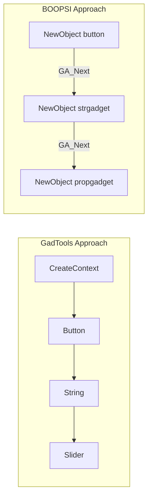
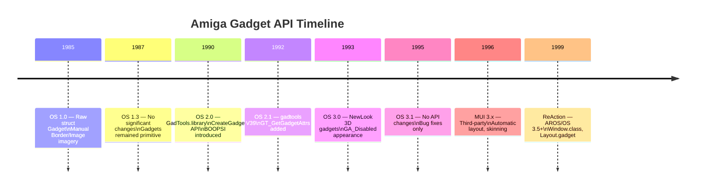

[← Home](../README.md) · [Intuition](README.md)

# Gadgets

## What Is a Gadget?

A gadget is Intuition's fundamental interactive UI element — the Amiga equivalent of a widget, control, or component. Every button, checkbox, slider, text field, and scrollbar in an Amiga application is a gadget. Gadgets handle their own rendering, hit-testing, and state management, delivering results to the application via [IDCMP](idcmp.md) messages.

The gadget system evolved through three major generations:

| Generation | Era | API | Key Feature |
|---|---|---|---|
| **Raw Intuition** | 1985 (OS 1.x) | `struct Gadget` + manual imagery | Full control, maximum boilerplate |
| **GadTools** | 1990 (OS 2.0) | `CreateGadget()` + `NewGadget` | Standard OS look-and-feel with minimal code |
| **[BOOPSI](boopsi.md)** | 1990 (OS 2.0) | `NewObject()` + OOP dispatchers | Object-oriented, interconnectable, extensible |

Most applications should use **GadTools** for standard UI or **BOOPSI** for custom behavior. Raw Intuition gadgets are only necessary for OS 1.x compatibility or extreme customization.

---

## Gadget Types

### System Gadgets

Built into every window — controlled by `WA_Flags`:

| Gadget | Flag | IDCMP Event | Description |
|---|---|---|---|
| Close | `WFLG_CLOSEGADGET` | `IDCMP_CLOSEWINDOW` | "×" button — window close request |
| Depth | `WFLG_DEPTHGADGET` | — (handled by Intuition) | Front/back toggle |
| Zoom | `WFLG_HASZOOM` | — | Alternate-size toggle (OS 2.0+) |
| Drag | `WFLG_DRAGBAR` | — | Title bar drag area |
| Size | `WFLG_SIZEGADGET` | `IDCMP_NEWSIZE` | Resize handle |

### Application Gadgets

Created by the application and attached to windows:

| Type | GadTools Kind | Description | IDCMP |
|---|---|---|---|
| **Button** | `BUTTON_KIND` | Click action | `IDCMP_GADGETUP` |
| **Checkbox** | `CHECKBOX_KIND` | Boolean toggle | `IDCMP_GADGETUP` |
| **Cycle** | `CYCLE_KIND` | Drop-down selector (cycles through options) | `IDCMP_GADGETUP` |
| **Integer** | `INTEGER_KIND` | Numeric text field | `IDCMP_GADGETUP` |
| **ListView** | `LISTVIEW_KIND` | Scrollable list of items | `IDCMP_GADGETUP` |
| **MX** (Mutual Exclude) | `MX_KIND` | Radio button group | `IDCMP_GADGETUP` |
| **Number** | `NUMBER_KIND` | Read-only numeric display | — |
| **Palette** | `PALETTE_KIND` | Color picker from screen palette | `IDCMP_GADGETUP` |
| **Scroller** | `SCROLLER_KIND` | Scrollbar | `IDCMP_GADGETUP` / `MOUSEMOVE` |
| **Slider** | `SLIDER_KIND` | Horizontal/vertical value slider | `IDCMP_GADGETUP` / `MOUSEMOVE` |
| **String** | `STRING_KIND` | Text input field | `IDCMP_GADGETUP` |
| **Text** | `TEXT_KIND` | Read-only text display | — |

---

## GadTools — Standard Gadget Creation (OS 2.0+)

### Setup

GadTools requires a **VisualInfo** handle (ties gadgets to a specific screen's look):

```c
#include <libraries/gadtools.h>
#include <proto/gadtools.h>

struct Library *GadToolsBase = OpenLibrary("gadtools.library", 39);
struct Screen *scr = LockPubScreen(NULL);
APTR vi = GetVisualInfo(scr, TAG_DONE);
```

### Creating a Gadget List

GadTools gadgets are created in a **linked list** using a context pointer:

```c
struct Gadget *glist = NULL;
struct Gadget *gad;

/* Initialize the context — creates a hidden "anchor" gadget */
gad = CreateContext(&glist);

/* Define gadget layout */
struct NewGadget ng = {
    .ng_LeftEdge   = 20,
    .ng_TopEdge    = 30,
    .ng_Width      = 200,
    .ng_Height     = 14,
    .ng_GadgetText = "Name:",
    .ng_TextAttr   = &topaz8,
    .ng_GadgetID   = GAD_NAME,
    .ng_Flags      = PLACETEXT_LEFT,
    .ng_VisualInfo = vi,
};

/* String gadget */
gad = CreateGadget(STRING_KIND, gad, &ng,
    GTST_MaxChars, 64,
    GTST_String,   "Default",
    TAG_DONE);

/* Button below it */
ng.ng_TopEdge += 20;
ng.ng_GadgetText = "OK";
ng.ng_GadgetID = GAD_OK;
ng.ng_Flags = PLACETEXT_IN;

gad = CreateGadget(BUTTON_KIND, gad, &ng, TAG_DONE);

/* Attach to window */
struct Window *win = OpenWindowTags(NULL,
    WA_Title,    "GadTools Demo",
    WA_Gadgets,  glist,       /* Attach gadget list */
    WA_IDCMP,    IDCMP_CLOSEWINDOW | IDCMP_GADGETUP |
                 IDCMP_REFRESHWINDOW,
    WA_Flags,    WFLG_CLOSEGADGET | WFLG_DRAGBAR |
                 WFLG_DEPTHGADGET | WFLG_ACTIVATE |
                 WFLG_SMART_REFRESH,
    TAG_DONE);

/* Render gadget borders (required for GadTools!) */
GT_RefreshWindow(win, NULL);
```

### Event Handling

```c
struct IntuiMessage *msg;
while ((msg = GT_GetIMsg(win->UserPort)))
{
    ULONG class = msg->Class;
    UWORD code  = msg->Code;
    struct Gadget *gad = (struct Gadget *)msg->IAddress;

    GT_ReplyIMsg(msg);

    switch (class)
    {
        case IDCMP_GADGETUP:
            switch (gad->GadgetID)
            {
                case GAD_NAME:
                {
                    /* Read string value */
                    STRPTR name;
                    GT_GetGadgetAttrs(gad, win, NULL,
                        GTST_String, &name, TAG_DONE);
                    Printf("Name: %s\n", name);
                    break;
                }
                case GAD_OK:
                    running = FALSE;
                    break;
            }
            break;

        case IDCMP_REFRESHWINDOW:
            GT_BeginRefresh(win);
            GT_EndRefresh(win, TRUE);
            break;
    }
}
```

### Cleanup

```c
/* Order matters: window first, then gadgets, then visual info */
CloseWindow(win);
FreeGadgets(glist);
FreeVisualInfo(vi);
UnlockPubScreen(NULL, scr);
CloseLibrary(GadToolsBase);
```

---

## Updating Gadget State at Runtime

### GadTools Gadgets

```c
/* Update a slider value */
GT_SetGadgetAttrs(sliderGad, win, NULL,
    GTSL_Level, 75,
    TAG_DONE);

/* Disable a button */
GT_SetGadgetAttrs(okGad, win, NULL,
    GA_Disabled, TRUE,
    TAG_DONE);

/* Read current value */
LONG level;
GT_GetGadgetAttrs(sliderGad, win, NULL,
    GTSL_Level, &level,
    TAG_DONE);
```

### Raw Intuition Gadgets

For non-GadTools gadgets, you must manually remove/re-add to avoid rendering glitches:

```c
/* Remove gadget from window */
UWORD pos = RemoveGadget(win, myGadget);

/* Modify gadget fields */
myGadget->Flags |= GFLG_DISABLED;

/* Re-add at same position */
AddGadget(win, myGadget, pos);

/* Refresh the display */
RefreshGList(myGadget, win, NULL, 1);
```

---

## Raw Intuition Gadgets (struct Gadget)

For cases where GadTools or BOOPSI are insufficient — direct hardware-level control:

### struct Gadget

```c
struct Gadget {
    struct Gadget  *NextGadget;     /* Linked list */
    WORD            LeftEdge, TopEdge;
    WORD            Width, Height;
    UWORD           Flags;          /* GFLG_* */
    UWORD           Activation;     /* GACT_* */
    UWORD           GadgetType;     /* GTYP_* */
    APTR            GadgetRender;   /* Image or Border for normal state */
    APTR            SelectRender;   /* Image or Border for selected state */
    struct IntuiText *GadgetText;   /* Label */
    LONG            MutualExclude;
    APTR            SpecialInfo;    /* StringInfo, PropInfo, etc. */
    UWORD           GadgetID;       /* Application-defined ID */
    APTR            UserData;       /* Application-defined pointer */
};
```

### Gadget Flags (GFLG_*)

| Flag | Value | Description |
|---|---|---|
| `GFLG_GADGHCOMP` | `0x0000` | Highlight by complementing select box |
| `GFLG_GADGHBOX` | `0x0001` | Highlight by drawing box around gadget |
| `GFLG_GADGHIMAGE` | `0x0002` | Use `SelectRender` image when selected |
| `GFLG_GADGHNONE` | `0x0003` | No highlighting |
| `GFLG_GADGIMAGE` | `0x0004` | `GadgetRender` is `struct Image *`, not `struct Border *` |
| `GFLG_RELBOTTOM` | `0x0008` | Position relative to bottom edge |
| `GFLG_RELRIGHT` | `0x0010` | Position relative to right edge |
| `GFLG_RELWIDTH` | `0x0020` | Width relative to window width |
| `GFLG_RELHEIGHT` | `0x0040` | Height relative to window height |
| `GFLG_SELECTED` | `0x0080` | Gadget is currently selected |
| `GFLG_DISABLED` | `0x0100` | Gadget is grayed out / inactive |

### Activation Flags (GACT_*)

| Flag | Value | Description |
|---|---|---|
| `GACT_RELVERIFY` | `0x0001` | Send `IDCMP_GADGETUP` only if mouse released inside |
| `GACT_IMMEDIATE` | `0x0002` | Send `IDCMP_GADGETDOWN` on press |
| `GACT_ENDGADGET` | `0x0004` | Deactivate requester when gadget released |
| `GACT_FOLLOWMOUSE` | `0x0008` | Report mouse while gadget is active |
| `GACT_TOGGLESELECT` | `0x0100` | Toggle selected state on each click |
| `GACT_LONGINT` | `0x0800` | String gadget contains a long integer |

### Gadget Types (GTYP_*)

| Type | Value | SpecialInfo | Description |
|---|---|---|---|
| `GTYP_BOOLGADGET` | `0x0001` | — | Simple click button |
| `GTYP_STRGADGET` | `0x0004` | `struct StringInfo *` | Text input field |
| `GTYP_PROPGADGET` | `0x0003` | `struct PropInfo *` | Proportional (slider/scrollbar) |
| `GTYP_CUSTOMGADGET` | `0x0005` | Class-specific | BOOPSI custom class |

---

## Proportional (Slider) Gadgets

Prop gadgets are used for scrollbars and sliders. They have their own state structure:

```c
struct PropInfo {
    UWORD  Flags;        /* AUTOKNOB, FREEHORIZ, FREEVERT */
    UWORD  HorizPot;     /* Horizontal position (0–0xFFFF) */
    UWORD  VertPot;      /* Vertical position (0–0xFFFF) */
    UWORD  HorizBody;    /* Horizontal knob size (0–0xFFFF) */
    UWORD  VertBody;     /* Vertical knob size (0–0xFFFF) */
    /* ... internal fields ... */
};

/* Calculate body size for a scrollbar:
   visible = number of visible items
   total   = total number of items */
UWORD body = (visible >= total) ? MAXBODY
           : (UWORD)((ULONG)MAXBODY * visible / total);

/* Calculate pot (position) from current top item:
   top = first visible item index */
UWORD pot = (total <= visible) ? 0
          : (UWORD)((ULONG)MAXPOT * top / (total - visible));
```

---

## String Gadgets

Text input gadgets use `StringInfo`:

```c
UBYTE buffer[128] = "Default text";
UBYTE undoBuffer[128];

struct StringInfo si = {
    .Buffer      = buffer,
    .UndoBuffer  = undoBuffer,
    .BufferPos   = 0,
    .MaxChars    = sizeof(buffer),
};

/* Read the result after GADGETUP: */
Printf("User entered: %s\n", si.Buffer);
```

With GadTools, this is much simpler:

```c
gad = CreateGadget(STRING_KIND, gad, &ng,
    GTST_MaxChars, 128,
    GTST_String,   "Default text",
    TAG_DONE);
```

---

## Relative Positioning

Gadgets can be positioned relative to window edges — they automatically move when the window resizes:

```c
/* Scrollbar on the right edge */
myGadget.LeftEdge = -16;    /* 16 pixels from right */
myGadget.TopEdge  = 0;
myGadget.Width    = 16;
myGadget.Height   = -16;    /* Extends to 16px from bottom */
myGadget.Flags    = GFLG_RELRIGHT | GFLG_RELHEIGHT;
```

| Flag | Effect |
|---|---|
| `GFLG_RELRIGHT` | `LeftEdge` is offset from right edge (use negative values) |
| `GFLG_RELBOTTOM` | `TopEdge` is offset from bottom edge |
| `GFLG_RELWIDTH` | `Width` is added to window width |
| `GFLG_RELHEIGHT` | `Height` is added to window height |

---

## Pitfalls

### 1. Forgetting GT_RefreshWindow

GadTools gadgets won't render properly without the initial `GT_RefreshWindow(win, NULL)` call. The window appears to have no gadgets.

### 2. Using GetMsg Instead of GT_GetIMsg

GadTools internally sends messages for gadget sub-events (e.g., ListView scrolling). Using `GetMsg()` directly breaks GadTools' internal state machine.

### 3. Modifying Gadgets Without Remove/Add

Changing a raw gadget's position, flags, or imagery while it's attached to a window causes rendering corruption. Always `RemoveGadget()` → modify → `AddGadget()` → `RefreshGList()`.

### 4. Not Setting GACT_RELVERIFY

Without `GACT_RELVERIFY`, the application never receives `IDCMP_GADGETUP`. The gadget appears to "eat" clicks silently.

### 5. String Gadget Buffer Overrun

The `MaxChars` field includes the null terminator. If your buffer is 64 bytes, set `MaxChars` to 64 (not 63). The gadget handles null termination.

---

## Best Practices

1. **Use GadTools** for standard UI — it provides the correct OS look-and-feel automatically
2. **Use `GT_GetIMsg()`/`GT_ReplyIMsg()`** — never mix raw `GetMsg()` with GadTools
3. **Always call `GT_RefreshWindow()`** after opening a window with GadTools gadgets
4. **Free in reverse order**: `CloseWindow()` → `FreeGadgets()` → `FreeVisualInfo()` → `UnlockPubScreen()`
5. **Use `GA_Disabled`** to gray out gadgets instead of removing them — maintains layout stability
6. **Set `PLACETEXT_LEFT/RIGHT/ABOVE`** for label placement — don't hardcode text positions
7. **Handle `IDCMP_REFRESHWINDOW`** with `GT_BeginRefresh()`/`GT_EndRefresh()`
8. **Give every gadget a unique `GadgetID`** — this is how you identify the source in `IDCMP_GADGETUP`
9. **Always check `CreateGadget()` return** — a NULL return means the list is broken; you must free everything
10. **Create GadTools gadgets in order** — the linked list must be contiguous; skipping one breaks the chain
11. **Use `GTMN_NewLookMenus, TRUE`** when calling `CreateMenus()` — consistent 3D look
12. **Use `GA_Immediate` / `GA_RelVerify`** on raw gadgets — without both, you miss press/release events

---

## Named Antipatterns

### "The Invisible Gadget" — Forgetting GT_RefreshWindow

```c
/* BAD: GadTools gadgets need an explicit render pass after window open.
   Without it, the gadget structures exist but nothing is drawn. */
struct Window *win = OpenWindowTags(NULL,
    WA_Gadgets, glist,
    TAG_DONE);
/* User sees an empty window — gadgets are invisible! */
```

```c
/* CORRECT: Always call GT_RefreshWindow after opening */
struct Window *win = OpenWindowTags(NULL,
    WA_Gadgets, glist,
    TAG_DONE);
GT_RefreshWindow(win, NULL);  /* renders all gadget borders and labels */
```

### "The Message Mangler" — Mixing GetMsg with GadTools

```c
/* BAD: Using exec.library GetMsg() instead of GT_GetIMsg().
   GadTools internally injects messages for sub-events (ListView scrolling,
   slider dragging). GetMsg() doesn't route through GadTools' filter,
   so internal state desynchronizes — gadgets stop responding. */
struct IntuiMessage *msg;
while ((msg = GetMsg(win->UserPort)))  /* WRONG */
{
    HandleMessage(msg);
    ReplyMsg(msg);  /* ALSO WRONG — must use GT_ReplyIMsg */
}
```

```c
/* CORRECT: Always use the GT_ pair */
struct IntuiMessage *msg;
while ((msg = GT_GetIMsg(win->UserPort)))
{
    HandleMessage(msg);
    GT_ReplyIMsg(msg);
}
```

### "The Orphaned Chain" — Not Checking CreateGadget Return

```c
/* BAD: If CreateGadget() returns NULL, the linked list is broken.
   Continuing to use 'gad' as context for subsequent calls creates
   a corrupted gadget list — crash or silent malfunction. */
gad = CreateGadget(BUTTON_KIND, gad, &ng, TAG_DONE);
/* No NULL check! If this failed, gad is NULL... */
gad = CreateGadget(STRING_KIND, gad, &ng, TAG_DONE);  /* undefined behavior */
```

```c
/* CORRECT: Check every CreateGadget return */
gad = CreateGadget(BUTTON_KIND, gad, &ng, TAG_DONE);
if (!gad) goto cleanup;

gad = CreateGadget(STRING_KIND, gad, &ng, TAG_DONE);
if (!gad) goto cleanup;
/* ... */
cleanup:
    FreeGadgets(glist);  /* frees everything created so far */
```

### "The Hot-Swap Hazard" — Modifying Gadgets In-Place

```c
/* BAD: Changing a raw gadget's position while it's attached.
   Intuition may be in the middle of rendering the gadget when
   you change its coordinates — screen corruption. */
myGadget->LeftEdge = 50;   /* LIVE MODIFICATION — DANGEROUS */
myGadget->Width    = 200;
```

```c
/* CORRECT: Remove → modify → re-add → refresh */
UWORD pos = RemoveGadget(win, myGadget);
myGadget->LeftEdge = 50;
myGadget->Width    = 200;
AddGadget(win, myGadget, pos);
RefreshGList(myGadget, win, NULL, 1);
```

> [!TIP]
> For GadTools gadgets, use `GT_SetGadgetAttrs()` instead — it handles the remove/modify/add/refresh cycle internally.

### "The Silent Button" — Missing GACT_RELVERIFY

```c
/* BAD: Without GACT_RELVERIFY, Intuition never sends IDCMP_GADGETUP.
   The user clicks the button, sees it highlight, but nothing happens. */
struct Gadget myButton = {
    .Flags      = GFLG_GADGHCOMP,
    .Activation = GACT_IMMEDIATE,  /* only sends GADGETDOWN, not GADGETUP */
    .GadgetType = GTYP_BOOLGADGET,
};
```

```c
/* CORRECT: Set both IMMEDIATE and RELVERIFY */
struct Gadget myButton = {
    .Flags      = GFLG_GADGHCOMP,
    .Activation = GACT_IMMEDIATE | GACT_RELVERIFY,
    .GadgetType = GTYP_BOOLGADGET,
};
/* Now you get both IDCMP_GADGETDOWN (press) and IDCMP_GADGETUP (release) */
```

---

## GadTools → BOOPSI Migration Guide

GadTools is built on top of raw `struct Gadget`. BOOPSI gadgets (`GTYP_CUSTOMGADGET`) are a different system. Here's when and how to migrate:

### When to Stick with GadTools

- Standard buttons, checkboxes, sliders, string fields
- Application targets OS 2.0–3.1
- No custom gadget rendering needed
- Quick prototyping

### When to Move to BOOPSI

- Custom gadget appearance or behavior
- Inter-gadget communication (slider auto-updates label)
- Reusable components across projects
- Need `layouthook`-based auto-positioning

### Quick-Reference: Same Gadget, Two APIs

| Task | GadTools | BOOPSI (ReAction/MUI) |
|------|----------|-----------------------|
| Create button | `CreateGadget(BUTTON_KIND, ...)` | `NewObject(NULL, "button.gadget", ...)` |
| Set value | `GT_SetGadgetAttrs(gad, win, NULL, TAG_DONE)` | `SetAttrs(obj, TAG_DONE)` |
| Get value | `GT_GetGadgetAttrs(gad, win, NULL, TAG_DONE)` | `GetAttr(attr, obj, &val)` |
| Disable | `GT_SetGadgetAttrs(gad, win, NULL, GA_Disabled, TRUE, TAG_DONE)` | `SetAttrs(obj, GA_Disabled, TRUE, TAG_DONE)` |
| Event | `IDCMP_GADGETUP`, check `GadgetID` | `IDCMP_GADGETUP`, check `GadgetID` or `GA_ID` |
| Free | `FreeGadgets(glist)` | `DisposeObject(obj)` |

### Key Differences

```c
/* GadTools: all gadgets share one linked list, created sequentially */
gad = CreateContext(&glist);
gad = CreateGadget(BUTTON_KIND, gad, &ng1, TAG_DONE);
gad = CreateGadget(STRING_KIND, gad, &ng2, TAG_DONE);
/* glist points to the head — contains all gadgets */

/* BOOPSI: each gadget is an independent object */
Object *btn = NewObject(NULL, "button.gadget",
    GA_ID, 1,
    TAG_DONE);
Object *str = NewObject(NULL, "strgadget",
    GA_ID, 2,
    TAG_DONE);
/* Must manually build into a gadget list or use a group */
```



---

## Practical Cookbook: Form with Mixed Gadgets

```c
#include <proto/exec.h>
#include <proto/intuition.h>
#include <proto/gadtools.h>
#include <libraries/gadtools.h>

enum {
    GAD_NAME = 1,
    GAD_AGE,
    GAD_COLOR,
    GAD_OK,
    GAD_CANCEL
};

static const STRPTR colorLabels[] = { "Red", "Green", "Blue", NULL };

struct AppGadgets {
    struct Gadget *glist;
    struct Gadget *gadName;
    struct Gadget *gadAge;
    struct Gadget *gadColor;
    struct Gadget *gadOk;
};

struct AppGadgets CreateFormGadgets(APTR vi, struct TextAttr *topaz8)
{
    struct AppGadgets ag = {0};
    struct Gadget *gad;
    struct NewGadget ng = {0};

    gad = CreateContext(&ag.glist);

    /* --- Name string gadget --- */
    ng.ng_LeftEdge   = 80;
    ng.ng_TopEdge    = 20;
    ng.ng_Width      = 200;
    ng.ng_Height     = 16;
    ng.ng_GadgetText = "Name:";
    ng.ng_TextAttr   = topaz8;
    ng.ng_VisualInfo = vi;
    ng.ng_Flags      = PLACETEXT_LEFT;

    ag.gadName = gad = CreateGadget(STRING_KIND, gad, &ng,
        GTST_MaxChars, 63,
        GTST_String,   "",
        GA_ID, GAD_NAME,
        TAG_DONE);

    /* --- Age integer gadget --- */
    ng.ng_TopEdge   += 24;
    ng.ng_GadgetText = "Age:";
    ng.ng_GadgetID   = GAD_AGE;

    ag.gadAge = gad = CreateGadget(INTEGER_KIND, gad, &ng,
        GTIN_MaxChars, 4,
        GA_ID, GAD_AGE,
        TAG_DONE);

    /* --- Color cycle gadget --- */
    ng.ng_TopEdge   += 24;
    ng.ng_Width      = 200;
    ng.ng_GadgetText = "Color:";
    ng.ng_GadgetID   = GAD_COLOR;

    ag.gadColor = gad = CreateGadget(CYCLE_KIND, gad, &ng,
        GTCY_Labels, colorLabels,
        GA_ID, GAD_COLOR,
        TAG_DONE);

    /* --- OK / Cancel buttons --- */
    ng.ng_TopEdge   += 30;
    ng.ng_LeftEdge   = 120;
    ng.ng_Width      = 80;
    ng.ng_Height     = 20;
    ng.ng_GadgetText = "_OK";
    ng.ng_Flags      = PLACETEXT_IN;

    ag.gadOk = gad = CreateGadget(BUTTON_KIND, gad, &ng,
        GA_ID, GAD_OK,
        TAG_DONE);

    ng.ng_LeftEdge  += 90;
    ng.ng_GadgetText = "_Cancel";
    ng.ng_GadgetID   = GAD_CANCEL;

    gad = CreateGadget(BUTTON_KIND, gad, &ng,
        GA_ID, GAD_CANCEL,
        TAG_DONE);

    return ag;
}

void ReadFormValues(struct AppGadgets *ag, struct Window *win)
{
    STRPTR name;
    LONG   age;
    USHORT colorIdx;

    GT_GetGadgetAttrs(ag->gadName, win, NULL,
        GTST_String, &name, TAG_DONE);

    GT_GetGadgetAttrs(ag->gadAge, win, NULL,
        GTIN_Number, &age, TAG_DONE);

    GT_GetGadgetAttrs(ag->gadColor, win, NULL,
        GTCY_Active, &colorIdx, TAG_DONE);

    Printf("Name=%s Age=%ld Color=%s\n",
        name, age, colorLabels[colorIdx]);
}
```

---

## Historical Context & Modern Analogies

### Competitive Landscape

| Platform | Gadget System | Custom Classes | Layout Engine | Inter-Gadget Communication |
|----------|-------------|---------------|--------------|--------------------------|
| **AmigaOS GadTools** | `CreateGadget()` + `NewGadget` | No — fixed gadget types | Manual coordinates | Via application event loop |
| **AmigaOS BOOPSI** | `NewObject()` + dispatcher | Yes — subclass rootclass | Manual or layout hook | ICA interconnection (observer) |
| **Amiga MUI** | `NewObject("mui.class")` | Yes — subclass MUI classes | Automatic (group/layout) | Notification hooks |
| **Mac OS (Classic)** | Control Manager + CNTL resources | Yes (via CDEF) | Manual or dialog resources | Application event routing |
| **Windows 3.x** | `CreateWindow()` + `WNDCLASS` | Yes (via WNDPROC) | Manual or dialog templates | `WM_COMMAND` / `SendDlgItemMessage()` |
| **X11/Motif** | `XtCreateWidget()` + `XmCreate*` | Yes (via Xt class) | `XmForm` constraints | `XtAddCallback()` |

### Evolution of Amiga Gadget Systems



### Modern Analogies

| Amiga Concept | Modern Equivalent | Notes |
|--------------|-------------------|-------|
| `struct Gadget` | `GtkWidget` / `QWidget` / `NSView` | Base widget type |
| `GadgetID` | `gtk_buildable_get_name()` / Qt `objectName` | Widget identification |
| `CreateGadget(KIND, ...)` | `gtk_button_new_with_label()` / Qt `QPushButton(tr("..."))` | Factory creation |
| `GT_SetGadgetAttrs()` | `gtk_widget_set_property()` / Qt `setProperty()` | Runtime update |
| `GT_GetGadgetAttrs()` | `gtk_widget_get_property()` / Qt `property()` | Runtime query |
| `GA_Disabled` | `gtk_widget_set_sensitive()` / Qt `setEnabled()` | Gray out |
| `GFLG_RELWIDTH/RELHEIGHT` | GTK `hexpand` / Qt `sizePolicy` | Responsive sizing |
| `CreateContext(&glist)` | GtkBuilder `.ui` file / Qt `.ui` file | Container for widget tree |
| `GT_RefreshWindow()` | Not needed — modern toolkits auto-render | Amiga requires explicit refresh |
| `PropInfo` (HorizPot/VertPot) | `gtk_adjustment_set_value()` / Qt `QSlider::setValue()` | Scrollbar/slider state |
| `RemoveGadget()` / `AddGadget()` | `gtk_container_remove()` / `gtk_container_add()` | Dynamic widget management |
| `PLACETEXT_LEFT/RIGHT` | GTK `GtkLabel` + `GtkBox` / Qt `QFormLayout` | Label positioning |

---

## Use Cases

| Application | Gadget Types Used | Notable Patterns |
|-------------|------------------|-----------------|
| **Workbench** | System gadgets (close, depth, drag, size) | All windows use the same system gadget set |
| **Prefs programs** | Cycle, slider, palette, button | Cycle for screen mode, slider for frequency, palette for colors |
| **File requesters (ASL)** | ListView, string, button, scroller | ListView for file list, string for filename input |
| **Text editors** | String, button, scroller | String for find/replace dialogs, scroller for document view |
| **Image editors (DPaint)** | Cycle, palette, button, custom gadgets | Palette for color selection, custom gadgets for tool options |
| **Audio trackers** | Integer, slider, button, listview | Integer for BPM/tempo, slider for volume, listview for patterns |
| **Installer scripts** | Button, checkbox, string | Checkbox for options, string for install path |
| **Game launchers** | Cycle, button, checkbox, slider | Cycle for resolution, slider for volume, checkbox for fullscreen |

---

## FAQ

**Q: What's the difference between GadTools and BOOPSI gadgets?**
A: GadTools is a convenience wrapper that creates raw `struct Gadget` objects with pre-built rendering and behavior. BOOPSI gadgets (`GTYP_CUSTOMGADGET`) use `DoMethod()` dispatch and support inheritance and ICA interconnection. GadTools gadgets are simpler but limited to fixed types; BOOPSI gadgets are extensible but require more boilerplate.

**Q: Can I mix GadTools and BOOPSI gadgets in the same window?**
A: Yes — both ultimately become `struct Gadget` nodes in the same linked list. However, you must use the correct API for each type: `GT_SetGadgetAttrs()` for GadTools, `SetAttrs()` for BOOPSI. Event handling (`IDCMP_GADGETUP`) works the same for both.

**Q: Why does my slider only send `IDCMP_GADGETUP` on release?**
A: By default, sliders only report the final value. To get continuous updates while dragging, set `GA_FollowMouse` in `CreateGadget()`. This causes `IDCMP_MOUSEMOVE` events with the slider gadget as `IAddress` while the user drags.

**Q: How do I create a scrollable list that updates dynamically?**
A: Use `LISTVIEW_KIND` with `GT_SetGadgetAttrs()` and `GTLV_Labels` to update the string array. The listview redraws automatically. Remember the label array must remain valid (static or heap-allocated) for the lifetime of the gadget.

**Q: Can gadgets span multiple windows?**
A: No — a gadget can only be attached to one window at a time. To create the same gadget in multiple windows, create separate gadget instances for each.

**Q: What happens to gadget input during menu mode?**
A: Intuition freezes all gadget input while the menu strip is active (right mouse button held). No `IDCMP_GADGETDOWN`/`IDCMP_GADGETUP` events are delivered until the menu closes.

---

## References

### NDK Headers

- `intuition/intuition.h` — `struct Gadget`, `struct PropInfo`, `struct StringInfo`, `GFLG_*`/`GACT_*`/`GTYP_*` flags
- `intuition/gadgetclass.h` — BOOPSI gadget class attributes (`GA_*`)
- `libraries/gadtools.h` — `struct NewGadget`, gadget kinds (`*_KIND`), `GTST_*`/`GTSL_*`/`GTCY_*` tags

### Autodocs

- ADCD 2.1: `CreateGadget()`, `CreateContext()`, `GT_SetGadgetAttrs()`, `GT_GetGadgetAttrs()`, `FreeGadgets()`
- ADCD 2.1: `GT_GetIMsg()`, `GT_ReplyIMsg()`, `GT_RefreshWindow()`, `GT_BeginRefresh()`, `GT_EndRefresh()`
- ADCD 2.1: `AddGadget()`, `RemoveGadget()`, `RefreshGList()`

### Related Knowledge Base Articles

- [BOOPSI](boopsi.md) — object-oriented gadget system, ICA interconnection
- [IDCMP](idcmp.md) — `IDCMP_GADGETUP`/`IDCMP_GADGETDOWN` event handling
- [Windows](windows.md) — windows host gadget lists
- [Screens](screens.md) — VisualInfo ties gadgets to screen appearance
- [Intuition Base](intuition_base.md) — Intuition's global state and rendering
