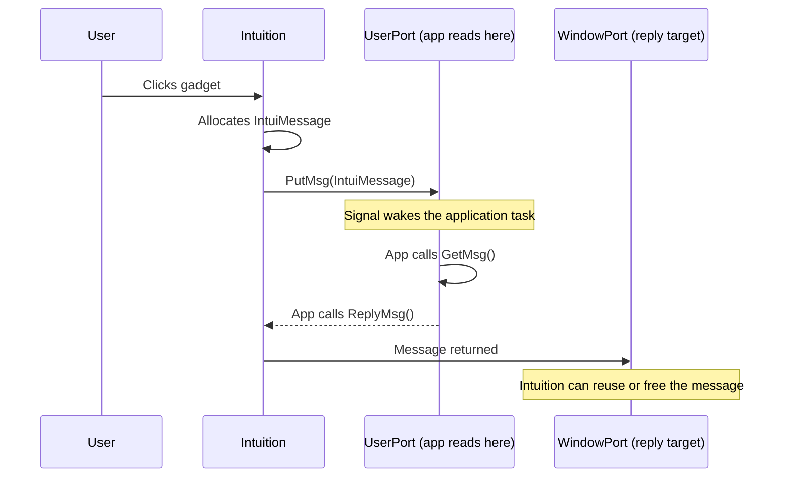
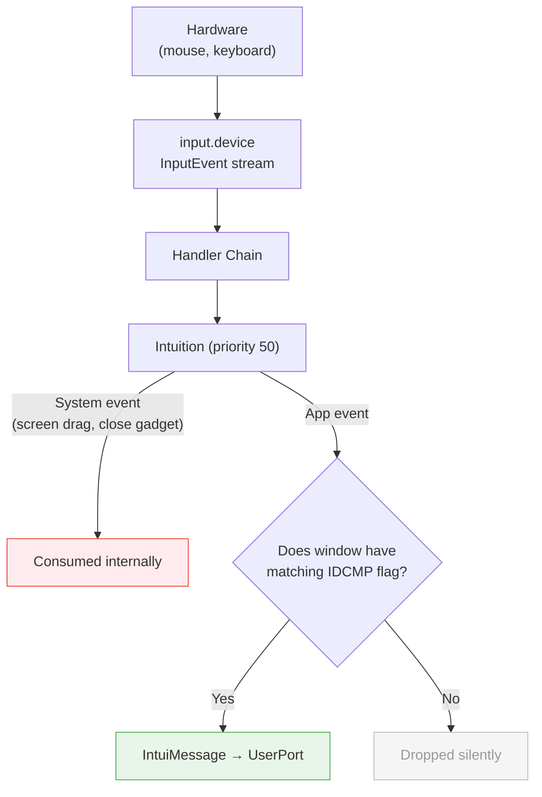
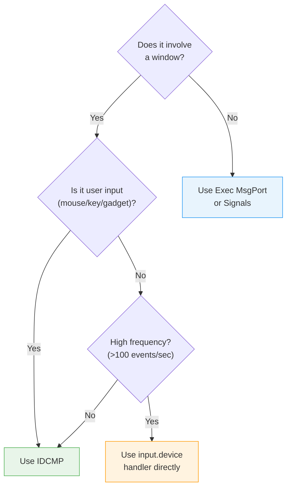

[← Home](../README.md) · [Intuition](README.md)

# IDCMP — Intuition Direct Communication Message Ports

## What Is IDCMP?

IDCMP is the mechanism by which Intuition delivers user-interface events to applications. Rather than polling for input, an Amiga application **sleeps** — consuming zero CPU — until Intuition sends a message saying "the user clicked a button" or "the window was resized."

IDCMP is built on top of Exec's standard **message passing** system. This means it is:

- **Asynchronous** — events queue up; the application processes them at its own pace
- **Zero-cost idle** — `Wait()` suspends the task completely; no busy-looping
- **Type-safe** — each message carries a class, code, qualifier, and optional address
- **Cooperative** — the application must `ReplyMsg()` every message to release it back to Intuition

This design is fundamental to why AmigaOS could multitask smoothly on a 7 MHz 68000 with 512 KB of RAM.

---

## Architecture

### The Two Ports

Every IDCMP-enabled window has two Exec message ports:



| Port | Owner | Purpose |
|---|---|---|
| **`Window->UserPort`** | Application | Where Intuition delivers events — the app calls `GetMsg()` here |
| **`Window->WindowPort`** | Intuition | Where replied messages return — Intuition uses this for cleanup |

### How Events Flow



Key principle: **a window only receives events it explicitly requests** via IDCMP flags. If you don't set `IDCMP_RAWKEY`, you never see keyboard events.

---

## struct IntuiMessage

The message structure delivered to your `UserPort`:

```c
/* intuition/intuition.h — NDK 3.9 */
struct IntuiMessage {
    struct Message   ExecMessage;    /* Standard Exec message header */
    ULONG            Class;          /* IDCMP_* event class */
    UWORD            Code;           /* Class-specific code (key, menu, button) */
    UWORD            Qualifier;      /* Modifier key/button state bitmask */
    APTR             IAddress;       /* Class-specific pointer (Gadget*, etc.) */
    WORD             MouseX;         /* Mouse X relative to window top-left */
    WORD             MouseY;         /* Mouse Y relative to window top-left */
    ULONG            Seconds;        /* Timestamp (seconds since boot) */
    ULONG            Micros;         /* Timestamp (microseconds within second) */
    struct Window   *IDCMPWindow;    /* Which window received this event */
    struct IntuiMessage *SpecialLink; /* Used internally by Intuition */
};
```

### Field Reference

| Field | Type | Size | Description | Values / Range | Notes |
|---|---|---|---|---|---|
| `ExecMessage` | `struct Message` | 20 bytes | Standard Exec message header containing reply port, node linkage, and message length | System-managed | **Never modify directly.** Contains `mn_ReplyPort` (points to `WindowPort`) and `mn_Length`. Used by `ReplyMsg()` to return the message to Intuition |
| `Class` | `ULONG` | 4 bytes | Event class — identifies what happened | Any `IDCMP_*` constant (see tables below) | Always a single bit set — never a combination. Test with `switch(msg->Class)`, not bitmask `&` |
| `Code` | `UWORD` | 2 bytes | Class-specific event code | **RAWKEY**: scancode `0x00`–`0x7F` (down), `0x80`–`0xFF` (up). **VANILLAKEY**: ASCII `0x00`–`0xFF`. **MOUSEBUTTONS**: `SELECTDOWN` (0x68), `SELECTUP` (0xe8), `MENUDOWN` (0x69), `MENUUP` (0xe9), `MIDDLEDOWN` (0x6a), `MIDDLEUP` (0xea). **MENUPICK**: packed menu/item/sub number — decode with `MENUNUM()`, `ITEMNUM()`, `SUBNUM()`. **NEWSIZE**: 0. **CLOSEWINDOW**: 0 | For `MENUPICK`, `MENUNULL` (0xFFFF) means menu was opened but nothing selected |
| `Qualifier` | `UWORD` | 2 bytes | Bitmask of modifier keys and mouse buttons held at event time | `IEQUALIFIER_*` flags OR'd together (see Qualifier Flags section) | Valid for input events (RAWKEY, VANILLAKEY, MOUSEBUTTONS, MOUSEMOVE). Undefined for window management events (NEWSIZE, CLOSEWINDOW) |
| `IAddress` | `APTR` | 4 bytes | Class-specific pointer to the object that generated the event | **GADGETUP/DOWN**: `struct Gadget *`. **MENUPICK**: `struct MenuItem *` (OS 3.0+). **IDCMPUPDATE**: `struct TagItem *` array from BOOPSI gadget. **RAWKEY**: `APTR` to dead-key translation data (or NULL) | Cast to the appropriate type based on `Class`. **Never dereference after `ReplyMsg()`** — the pointed-to object may be freed |
| `MouseX` | `WORD` | 2 bytes | Mouse X position relative to window's top-left corner | `-32768` to `32767`; typically `0` to `Window->Width` | Can be negative if the mouse is to the left of the window. Relative to window origin, not screen |
| `MouseY` | `WORD` | 2 bytes | Mouse Y position relative to window's top-left corner | `-32768` to `32767`; typically `0` to `Window->Height` | Can be negative if the mouse is above the window. For `DELTAMOVE`, contains relative delta instead of absolute |
| `Seconds` | `ULONG` | 4 bytes | Timestamp — seconds since system boot | `0` to `2^32` (~136 years) | Compare two messages' `Seconds`/`Micros` with `DoubleClick()` to detect double-clicks. Wraps at ~136 years — not a real-world concern |
| `Micros` | `ULONG` | 4 bytes | Timestamp — microseconds within current second | `0` to `999999` | Used with `Seconds` for sub-second timing. Resolution depends on the system timer (~20ms on OCS/ECS, ~2ms on A1200+) |
| `IDCMPWindow` | `struct Window *` | 4 bytes | Pointer to the window that received this event | Valid `Window *` | **Essential for shared-port setups** — use this to identify which window the event belongs to. Valid only until `ReplyMsg()` |
| `SpecialLink` | `struct IntuiMessage *` | 4 bytes | Internal linked-list pointer used by Intuition | System-managed | **Never read or modify.** Used by Intuition to chain messages internally during verify handshakes |

### Field Usage by Event Class

| Field | MOUSEBUTTONS | RAWKEY | VANILLAKEY | GADGETUP | MENUPICK | CLOSEWINDOW |
|---|---|---|---|---|---|---|
| `Class` | `0x0008` | `0x0400` | `0x200000` | `0x0040` | `0x0100` | `0x0200` |
| `Code` | `SELECTDOWN/UP` | Scancode | ASCII char | Gadget ID | Menu number | — |
| `Qualifier` | Modifier state | Modifier state | Modifier state | — | — | — |
| `IAddress` | — | — | — | `Gadget *` | `MenuItem *` | — |
| `MouseX/Y` | Position | Position | Position | Position | Position | — |

---

## IDCMP Class Constants — Complete Reference

### Input Events

| Constant | Value | Description | Code Field |
|---|---|---|---|
| `IDCMP_MOUSEBUTTONS` | `0x00000008` | Mouse button press/release | `SELECTDOWN`, `SELECTUP`, `MENUDOWN`, `MENUUP`, `MIDDLEDOWN`, `MIDDLEUP` |
| `IDCMP_MOUSEMOVE` | `0x00000010` | Mouse moved (requires `WFLG_REPORTMOUSE` or active gadget) | — |
| `IDCMP_DELTAMOVE` | `0x00100000` | Relative mouse movement (delta X/Y instead of absolute) | — |
| `IDCMP_RAWKEY` | `0x00000400` | Raw keyboard scancode (up and down events) | Scancode; bit 7 set = key up |
| `IDCMP_VANILLAKEY` | `0x00200000` | Translated ASCII character (key down only, no dead keys) | ASCII value |
| `IDCMP_INTUITICKS` | `0x00400000` | ~10 Hz timer tick while window is active | — |

### Gadget Events

| Constant | Value | Description | IAddress |
|---|---|---|---|
| `IDCMP_GADGETDOWN` | `0x00000020` | Gadget selected (button pressed) | `Gadget *` |
| `IDCMP_GADGETUP` | `0x00000040` | Gadget released (button released) | `Gadget *` |
| `IDCMP_IDCMPUPDATE` | `0x00800000` | BOOPSI gadget notification (`ICA_TARGET = ICTARGET_IDCMP`) | `TagItem *` |

### Window Events

| Constant | Value | Description | Notes |
|---|---|---|---|
| `IDCMP_CLOSEWINDOW` | `0x00000200` | User clicked close gadget | No data — just the signal |
| `IDCMP_NEWSIZE` | `0x00000002` | Window was resized | Read new `Window->Width/Height` |
| `IDCMP_CHANGEWINDOW` | `0x02000000` | Window moved or resized (OS 3.0+) | More general than NEWSIZE |
| `IDCMP_REFRESHWINDOW` | `0x00000004` | Simple-refresh window needs redraw | Must call `BeginRefresh()`/`EndRefresh()` |
| `IDCMP_ACTIVEWINDOW` | `0x00040000` | This window became active | — |
| `IDCMP_INACTIVEWINDOW` | `0x00080000` | This window lost focus | — |
| `IDCMP_SCREENPOSITION` | — | Screen was dragged (OS 3.0+) | — |

### Menu Events

| Constant | Value | Description | Code Field |
|---|---|---|---|
| `IDCMP_MENUPICK` | `0x00000100` | Menu item selected | Packed menu number (use `MENUNUM()`, `ITEMNUM()`, `SUBNUM()` macros) |

### Verify Events (Synchronous — Require Immediate Reply)

| Constant | Value | Description | Hazard |
|---|---|---|---|
| `IDCMP_SIZEVERIFY` | `0x00000001` | Window is **about** to be resized | Intuition blocks until you reply |
| `IDCMP_MENUVERIFY` | `0x00002000` | Menu is **about** to open | Intuition blocks until you reply |
| `IDCMP_REQVERIFY` | `0x00000800` | Requester is **about** to open | Intuition blocks until you reply |

> **Warning**: Verify events create a synchronous handshake. Intuition sends the message and **waits for your `ReplyMsg()`** before proceeding. If your application is blocked on I/O, a semaphore, or any other wait — you create a **deadlock**. The entire Intuition system freezes.

### System Events

| Constant | Value | Description |
|---|---|---|
| `IDCMP_DISKINSERTED` | `0x00008000` | Disk inserted into a drive |
| `IDCMP_DISKREMOVED` | `0x00010000` | Disk removed from a drive |
| `IDCMP_NEWPREFS` | `0x00004000` | System preferences changed |
| `IDCMP_REQSET` | `0x00000080` | Requester activated in window |
| `IDCMP_REQCLEAR` | `0x00001000` | Requester deactivated |

---

## Qualifier Flags

The `Qualifier` field is a bitmask of modifier keys and mouse buttons held at the time of the event:

| Constant | Value | Description |
|---|---|---|
| `IEQUALIFIER_LSHIFT` | `0x0001` | Left Shift |
| `IEQUALIFIER_RSHIFT` | `0x0002` | Right Shift |
| `IEQUALIFIER_CAPSLOCK` | `0x0004` | Caps Lock |
| `IEQUALIFIER_CONTROL` | `0x0008` | Control |
| `IEQUALIFIER_LALT` | `0x0010` | Left Alt |
| `IEQUALIFIER_RALT` | `0x0020` | Right Alt |
| `IEQUALIFIER_LCOMMAND` | `0x0040` | Left Amiga key |
| `IEQUALIFIER_RCOMMAND` | `0x0080` | Right Amiga key |
| `IEQUALIFIER_NUMERICPAD` | `0x0100` | Key is on numeric pad |
| `IEQUALIFIER_REPEAT` | `0x0200` | Key repeat (auto-repeat) |
| `IEQUALIFIER_INTERRUPT` | `0x0400` | Event from interrupt |
| `IEQUALIFIER_MULTIBROADCAST` | `0x0800` | Broadcast to all windows |
| `IEQUALIFIER_MIDBUTTON` | `0x1000` | Middle mouse button |
| `IEQUALIFIER_RBUTTON` | `0x2000` | Right mouse button (3-button mouse) |
| `IEQUALIFIER_LEFTBUTTON` | `0x4000` | Left mouse button |
| `IEQUALIFIER_RELATIVEMOUSE` | `0x8000` | Mouse coordinates are relative |

### Testing Qualifiers

```c
/* Check if Shift was held during a key event */
if (msg->Qualifier & (IEQUALIFIER_LSHIFT | IEQUALIFIER_RSHIFT))
{
    /* Shift+key combination */
}

/* Check if Ctrl+C was pressed */
if (msg->Class == IDCMP_VANILLAKEY && msg->Code == 3)
{
    /* Ctrl+C (ASCII 3) */
}
```

---

## The Event Loop

### Minimal Single-Window Loop

```c
#include <intuition/intuition.h>
#include <proto/intuition.h>
#include <proto/exec.h>

struct Window *win = OpenWindowTags(NULL,
    WA_Title,    "IDCMP Demo",
    WA_Width,    400,
    WA_Height,   200,
    WA_IDCMP,    IDCMP_CLOSEWINDOW | IDCMP_GADGETUP |
                 IDCMP_RAWKEY | IDCMP_MOUSEBUTTONS,
    WA_Flags,    WFLG_CLOSEGADGET | WFLG_DRAGBAR |
                 WFLG_DEPTHGADGET | WFLG_ACTIVATE,
    TAG_DONE);

if (!win) { /* handle error */ }

ULONG signals = 1L << win->UserPort->mp_SigBit;
BOOL running = TRUE;

while (running)
{
    ULONG received = Wait(signals);  /* Sleep — zero CPU usage */

    if (received & signals)
    {
        struct IntuiMessage *msg;
        while ((msg = (struct IntuiMessage *)GetMsg(win->UserPort)))
        {
            ULONG class     = msg->Class;
            UWORD code      = msg->Code;
            UWORD qualifier = msg->Qualifier;
            WORD  mx        = msg->MouseX;
            WORD  my        = msg->MouseY;

            ReplyMsg((struct Message *)msg);  /* Reply FIRST */

            switch (class)
            {
                case IDCMP_CLOSEWINDOW:
                    running = FALSE;
                    break;

                case IDCMP_RAWKEY:
                    if (!(code & 0x80))  /* Key down (bit 7 clear) */
                        HandleKeyDown(code, qualifier);
                    break;

                case IDCMP_MOUSEBUTTONS:
                    HandleMouse(code, mx, my);
                    break;

                case IDCMP_GADGETUP:
                    HandleGadget((struct Gadget *)msg->IAddress);
                    break;
            }
        }
    }
}

CloseWindow(win);
```

### Why Reply Before Processing?

The example above replies **before** switching on the class. This is the recommended pattern because:

1. The `IntuiMessage` belongs to Intuition — after `ReplyMsg()`, the pointer becomes invalid
2. By copying fields to locals first, you avoid accessing freed memory
3. For verify events, replying immediately prevents deadlocks
4. If your processing is slow, Intuition can reuse the message slot for new events

---

## Multi-Window Shared Port

When your application has multiple windows, sharing a single `UserPort` reduces signal overhead and simplifies the event loop:

```c
/* Create a shared port */
struct MsgPort *sharedPort = CreateMsgPort();
if (!sharedPort) { /* error */ }

/* Open windows with NO automatic IDCMP */
struct Window *win1 = OpenWindowTags(NULL,
    WA_Title, "Window 1",
    WA_IDCMP, 0,           /* No automatic port! */
    /* ... */
    TAG_DONE);

struct Window *win2 = OpenWindowTags(NULL,
    WA_Title, "Window 2",
    WA_IDCMP, 0,
    /* ... */
    TAG_DONE);

/* Assign shared port */
win1->UserPort = sharedPort;
win2->UserPort = sharedPort;

/* NOW enable IDCMP flags */
ModifyIDCMP(win1, IDCMP_CLOSEWINDOW | IDCMP_GADGETUP);
ModifyIDCMP(win2, IDCMP_CLOSEWINDOW | IDCMP_RAWKEY);

/* Event loop — use IDCMPWindow to identify source */
ULONG signals = 1L << sharedPort->mp_SigBit;
BOOL running = TRUE;

while (running)
{
    Wait(signals);
    struct IntuiMessage *msg;
    while ((msg = (struct IntuiMessage *)GetMsg(sharedPort)))
    {
        struct Window *source = msg->IDCMPWindow;
        ULONG class = msg->Class;
        ReplyMsg((struct Message *)msg);

        if (class == IDCMP_CLOSEWINDOW)
        {
            if (source == win1) running = FALSE;
            if (source == win2) CloseOneWindow(&win2, sharedPort);
        }
    }
}
```

### Safe Shutdown with Shared Port

Closing a window that shares a port requires a specific protocol to avoid crashes:

```c
void CloseOneWindow(struct Window **winPtr, struct MsgPort *port)
{
    struct Window *win = *winPtr;
    if (!win) return;

    /* Step 1: Prevent Intuition from sending new messages */
    Forbid();

    /* Step 2: Strip all pending messages for this window from the port */
    struct Node *node = port->mp_MsgList.lh_Head;
    struct Node *succ;
    while ((succ = node->ln_Succ))
    {
        struct IntuiMessage *imsg = (struct IntuiMessage *)node;
        if (imsg->IDCMPWindow == win)
        {
            Remove(node);
            ReplyMsg((struct Message *)imsg);
        }
        node = succ;
    }

    /* Step 3: Detach the shared port BEFORE closing */
    win->UserPort = NULL;

    /* Step 4: Disable IDCMP (cleans up WindowPort) */
    ModifyIDCMP(win, 0);

    Permit();

    /* Step 5: Now safe to close */
    CloseWindow(win);
    *winPtr = NULL;
}
```

> **Critical**: If you skip the `Forbid()`/`Permit()` and message stripping, Intuition may queue a message to the port *after* you close the window. When you later `ReplyMsg()` that message, it will crash — the `WindowPort` no longer exists.

---

## ModifyIDCMP — Dynamic Event Subscription

You can change which events a window receives at any time:

```c
/* Start receiving mouse movement */
ModifyIDCMP(win, win->IDCMPFlags | IDCMP_MOUSEMOVE);

/* Stop receiving mouse movement */
ModifyIDCMP(win, win->IDCMPFlags & ~IDCMP_MOUSEMOVE);

/* Disable all IDCMP (tears down the port) */
ModifyIDCMP(win, 0);
```

### When to Use

| Scenario | Action |
|---|---|
| User starts dragging an object | Add `IDCMP_MOUSEMOVE` |
| User releases mouse button | Remove `IDCMP_MOUSEMOVE` |
| About to perform blocking I/O | Remove `IDCMP_SIZEVERIFY` / `IDCMP_MENUVERIFY` |
| I/O complete | Re-add verify flags |
| Window uses shared port | Use `ModifyIDCMP()` instead of `WA_IDCMP` |

---

## GadTools Integration

When using GadTools (the standard OS 2.0+ gadget toolkit), you must use GadTools-aware message handling:

```c
#include <libraries/gadtools.h>
#include <proto/gadtools.h>

/* Use GT_GetIMsg instead of GetMsg */
struct IntuiMessage *msg;
while ((msg = GT_GetIMsg(win->UserPort)))
{
    ULONG class = msg->Class;
    UWORD code  = msg->Code;

    GT_ReplyIMsg(msg);  /* Use GT_ReplyIMsg instead of ReplyMsg */

    switch (class)
    {
        case IDCMP_GADGETUP:
            /* GadTools has pre-processed the gadget event */
            break;
    }
}
```

**Why?** GadTools internally sends its own messages for gadget updates (e.g., scrolling a ListView). `GT_GetIMsg()` filters these internal messages out and only returns messages intended for the application. Using raw `GetMsg()` with GadTools gadgets will cause mysterious misbehavior.

---

## RAWKEY vs VANILLAKEY

Two ways to receive keyboard input, serving different purposes:

| | RAWKEY | VANILLAKEY |
|---|---|---|
| **What you get** | Hardware scancode | Translated ASCII character |
| **Key-up events** | Yes (bit 7 set) | No (key-down only) |
| **Dead keys** | Raw sequence | Pre-combined (é, ü, etc.) |
| **Function keys** | Yes | No |
| **Keymap aware** | No — you must call `MapRawKey()` | Yes — already mapped |
| **Use case** | Games, keyboard shortcuts, key-up detection | Text input, editors |

### RAWKEY Processing

```c
case IDCMP_RAWKEY:
{
    BOOL keyDown = !(code & 0x80);
    UWORD scancode = code & 0x7F;

    if (keyDown)
    {
        /* Convert to text if needed */
        struct InputEvent ie;
        ie.ie_Class = IECLASS_RAWKEY;
        ie.ie_SubClass = 0;
        ie.ie_Code = code;
        ie.ie_Qualifier = qualifier;

        UBYTE buffer[8];
        LONG len = MapRawKey(&ie, buffer, sizeof(buffer), NULL);
        if (len > 0)
        {
            /* buffer contains translated characters */
        }
    }
    break;
}
```

---

## REFRESHWINDOW Handling

Simple-refresh windows require explicit handling when exposed areas need redrawing:

```c
case IDCMP_REFRESHWINDOW:
    BeginRefresh(win);
    /* Redraw window contents here */
    /* Only the damaged regions are actually rendered */
    EndRefresh(win, TRUE);  /* TRUE = damage is fully repaired */
    break;
```

**Rules:**
- Always bracket refresh rendering with `BeginRefresh()`/`EndRefresh()`
- `BeginRefresh()` installs a clipping region covering only the damaged area
- `EndRefresh(win, TRUE)` clears the damage list
- `EndRefresh(win, FALSE)` keeps the damage — you'll get another `IDCMP_REFRESHWINDOW`

---

## Performance Considerations

### MOUSEMOVE Bandwidth

`IDCMP_MOUSEMOVE` generates a message for **every pixel** of mouse movement. On a 68000 at 7 MHz, this can easily saturate the event loop:

| Mouse speed | Messages/sec | CPU impact |
|---|---|---|
| Slow movement | ~30 | Negligible |
| Normal use | ~100–200 | Noticeable on 68000 |
| Fast drag | ~500+ | Can starve other tasks |

**Mitigation strategies:**

```c
/* Strategy 1: Only enable during drag operations */
case IDCMP_MOUSEBUTTONS:
    if (code == SELECTDOWN && InMyArea(mx, my))
    {
        ModifyIDCMP(win, win->IDCMPFlags | IDCMP_MOUSEMOVE);
        dragging = TRUE;
    }
    else if (code == SELECTUP)
    {
        ModifyIDCMP(win, win->IDCMPFlags & ~IDCMP_MOUSEMOVE);
        dragging = FALSE;
    }
    break;

/* Strategy 2: Use INTUITICKS for polling (~10 Hz) */
WA_IDCMP, IDCMP_INTUITICKS,

case IDCMP_INTUITICKS:
    /* Read current mouse position from Window->MouseX/MouseY */
    UpdateDisplay(win->MouseX, win->MouseY);
    break;
```

### Message Reply Latency

Intuition allocates message blocks from system memory. If your application processes slowly and doesn't reply:

1. Messages accumulate in the port — each one ~40 bytes
2. Memory consumption grows unbounded
3. Eventually, `AllocMem()` fails and Intuition can't send new messages
4. The system becomes unresponsive

**Rule**: Always drain the port completely in each loop iteration and reply immediately.

---

## Pitfalls and Hazards

### 1. Verify Deadlock

The most dangerous IDCMP hazard. Verify events (`SIZEVERIFY`, `MENUVERIFY`, `REQVERIFY`) create a **synchronous handshake** — Intuition blocks until you reply:

```c
/* DEADLOCK — performing I/O while holding a verify message */
case IDCMP_SIZEVERIFY:
    SaveFileToDisk();     /* This takes 2 seconds */
    ReplyMsg(msg);        /* Too late — Intuition is already frozen */
    break;

/* SAFE — reply immediately, defer work */
case IDCMP_SIZEVERIFY:
    ReplyMsg(msg);        /* Unblock Intuition immediately */
    /* The resize will now proceed — handle it in IDCMP_NEWSIZE */
    break;
```

> If you don't need verify events, **don't request them**. They exist only for rare cases where you must veto an operation.

### 2. Accessing Message After Reply

```c
/* BUG — msg is invalid after ReplyMsg */
ReplyMsg((struct Message *)msg);
ULONG class = msg->Class;          /* Use-after-free! */

/* CORRECT — copy fields first */
ULONG class = msg->Class;
UWORD code  = msg->Code;
struct Gadget *gad = (struct Gadget *)msg->IAddress;
ReplyMsg((struct Message *)msg);   /* Now safe to reply */
```

### 3. Forgetting to Handle REFRESHWINDOW

If you request `IDCMP_REFRESHWINDOW` but never call `BeginRefresh()`/`EndRefresh()`, the damage list accumulates. Eventually, every rendering operation becomes clipped to nothing — your window appears blank.

### 4. Signal Collision

If you `Wait()` on multiple signal sources (IDCMP + timer + DOS), make sure to handle **all** signaled sources in each iteration:

```c
ULONG idcmpSig = 1L << win->UserPort->mp_SigBit;
ULONG timerSig = 1L << timerPort->mp_SigBit;

ULONG received = Wait(idcmpSig | timerSig);

/* Must check ALL sources — signals are edge-triggered, not level */
if (received & idcmpSig)  HandleIDCMP(win);
if (received & timerSig)  HandleTimer(timerPort);
```

### 5. Closing Window Without Draining

```c
/* BUG — messages still in the port reference this window */
CloseWindow(win);

/* CORRECT — drain first */
struct IntuiMessage *msg;
while ((msg = (struct IntuiMessage *)GetMsg(win->UserPort)))
    ReplyMsg((struct Message *)msg);
CloseWindow(win);
```

---

## Use-Case Cookbook

### Double-Click Detection

```c
ULONG lastSec = 0, lastMic = 0;

case IDCMP_MOUSEBUTTONS:
    if (code == SELECTDOWN)
    {
        if (DoubleClick(lastSec, lastMic, msg->Seconds, msg->Micros))
        {
            HandleDoubleClick(mx, my);
        }
        else
        {
            HandleSingleClick(mx, my);
        }
        lastSec = msg->Seconds;
        lastMic = msg->Micros;
    }
    break;
```

### Rubber-Band Selection (Drag Rectangle)

```c
BOOL dragging = FALSE;
WORD startX, startY;

case IDCMP_MOUSEBUTTONS:
    if (code == SELECTDOWN)
    {
        dragging = TRUE;
        startX = mx; startY = my;
        /* Start tracking mouse movement */
        ModifyIDCMP(win, win->IDCMPFlags | IDCMP_MOUSEMOVE);
        /* Set complement draw mode for XOR rubber-band */
        SetDrMd(win->RPort, COMPLEMENT);
    }
    else if (code == SELECTUP && dragging)
    {
        dragging = FALSE;
        ModifyIDCMP(win, win->IDCMPFlags & ~IDCMP_MOUSEMOVE);
        /* Erase last rubber band (XOR again) */
        DrawRubberBand(win->RPort, startX, startY, lastX, lastY);
        SetDrMd(win->RPort, JAM1);
        /* Process selection rectangle */
        HandleSelection(startX, startY, mx, my);
    }
    break;

case IDCMP_MOUSEMOVE:
    if (dragging)
    {
        /* Erase previous, draw new (XOR mode) */
        DrawRubberBand(win->RPort, startX, startY, lastX, lastY);
        DrawRubberBand(win->RPort, startX, startY, mx, my);
        lastX = mx; lastY = my;
    }
    break;
```

### Multi-Signal Event Loop (IDCMP + Timer + ARexx)

```c
ULONG idcmpSig = 1L << win->UserPort->mp_SigBit;
ULONG timerSig = 1L << timerPort->mp_SigBit;
ULONG arexxSig = 1L << arexxPort->mp_SigBit;
ULONG allSigs  = idcmpSig | timerSig | arexxSig;

BOOL running = TRUE;
while (running)
{
    ULONG received = Wait(allSigs);

    /* Always check ALL signaled sources — signals coalesce */
    if (received & idcmpSig)
    {
        struct IntuiMessage *msg;
        while ((msg = GT_GetIMsg(win->UserPort)))
        {
            ULONG class = msg->Class;
            GT_ReplyIMsg(msg);
            if (class == IDCMP_CLOSEWINDOW) running = FALSE;
        }
    }

    if (received & timerSig)
    {
        /* Handle timer — animation frame, autosave, etc. */
        WaitIO((struct IORequest *)timerReq);
        UpdateAnimation();
        SendTimerRequest(timerReq, 0, 50000);  /* Next tick: 50ms */
    }

    if (received & arexxSig)
    {
        /* Handle ARexx command */
        struct RexxMsg *rmsg;
        while ((rmsg = (struct RexxMsg *)GetMsg(arexxPort)))
            HandleARexxCommand(rmsg);
    }
}
```

### Menu Selection with Multi-Select

```c
case IDCMP_MENUPICK:
{
    UWORD menuCode = code;
    /* Walk the selection chain — user may have multi-selected */
    while (menuCode != MENUNULL)
    {
        struct MenuItem *item = ItemAddress(menuStrip, menuCode);
        UWORD menuNum = MENUNUM(menuCode);
        UWORD itemNum = ITEMNUM(menuCode);

        switch (menuNum)
        {
            case 0: /* Project menu */
                switch (itemNum)
                {
                    case 0: NewFile();   break;
                    case 1: OpenFile();  break;
                    case 3: running = FALSE; break; /* Quit */
                }
                break;
        }

        menuCode = item->NextSelect;  /* Next multi-selected item */
    }
    break;
}
```

### BOOPSI Gadget Notification via IDCMP

```c
/* When creating a BOOPSI gadget, target IDCMP for notifications */
Object *slider = NewObject(NULL, "propgclass",
    GA_ID,        GAD_SLIDER,
    GA_Left,      20,
    GA_Top,       40,
    GA_Width,     200,
    GA_Height,    16,
    PGA_Freedom,  FREEHORIZ,
    PGA_Total,    100,
    PGA_Visible,  10,
    ICA_TARGET,   ICTARGET_IDCMP,  /* Send updates to IDCMP */
    TAG_DONE);

/* In event loop: */
case IDCMP_IDCMPUPDATE:
{
    struct TagItem *tags = (struct TagItem *)msg->IAddress;
    LONG value;
    if (GetTagData(PGA_Top, 0, tags))
    {
        value = GetTagData(PGA_Top, 0, tags);
        UpdateScrollPosition(value);
    }
    break;
}
```

---

## When to Use IDCMP — and When Not To

### IDCMP Is the Right Choice When:

| Scenario | Why IDCMP Works |
|---|---|
| GUI event handling | It's literally designed for this — mouse, keyboard, gadgets, menus |
| Single-task applications | One event loop handles everything cleanly |
| Moderate event rates | Mouse clicks, key presses, gadget interactions — all fine |
| Cooperative multitasking | `Wait()` yields CPU properly |

### Consider Alternatives When:

| Scenario | Problem with IDCMP | Better Alternative |
|---|---|---|
| **High-frequency data** (audio, network) | IDCMP message overhead per event is too high | Direct `input.device` handler or dedicated device I/O |
| **Inter-process communication** | IDCMP is window-bound — no window, no messages | Exec message ports (`CreateMsgPort()` + custom messages) |
| **Background tasks** | Cannot `Wait()` on IDCMP from a non-owning task | Exec signals (`Signal()` / `Wait()`) between tasks |
| **Real-time input** (games) | IDCMP adds latency; message allocation has jitter | Read hardware registers directly or use `input.device` at high priority |
| **Streaming data** between processes | Message-per-datum is wasteful | Shared memory with signaling, or `pipe:` handler |

### The Decision Flowchart



---

## Antipatterns

### 1. The Kitchen Sink

```c
/* ANTIPATTERN — requesting everything "just in case" */
WA_IDCMP, 0xFFFFFFFF,

/* CORRECT — request only what you handle */
WA_IDCMP, IDCMP_CLOSEWINDOW | IDCMP_GADGETUP | IDCMP_RAWKEY,
```

Every flag adds message traffic. `IDCMP_MOUSEMOVE` alone can generate hundreds of messages per second.

### 2. The Blocking Handler

```c
/* ANTIPATTERN — blocking inside the event loop */
case IDCMP_GADGETUP:
    if (gadget->GadgetID == GAD_SAVE)
    {
        SaveLargeFile();    /* Takes 5 seconds — system feels frozen */
    }
    break;

/* CORRECT — defer, or at minimum show busy pointer */
case IDCMP_GADGETUP:
    if (gadget->GadgetID == GAD_SAVE)
    {
        SetWindowPointer(win, WA_BusyPointer, TRUE, TAG_DONE);
        /* Remove verify flags to prevent deadlocks during save */
        ModifyIDCMP(win, win->IDCMPFlags & ~(IDCMP_SIZEVERIFY | IDCMP_MENUVERIFY));
        SaveLargeFile();
        ModifyIDCMP(win, win->IDCMPFlags | IDCMP_SIZEVERIFY | IDCMP_MENUVERIFY);
        SetWindowPointer(win, WA_Pointer, NULL, TAG_DONE);
    }
    break;
```

### 3. The Phantom Gadget

```c
/* ANTIPATTERN — dereferencing IAddress after ReplyMsg */
case IDCMP_GADGETUP:
    ReplyMsg((struct Message *)msg);
    UWORD id = ((struct Gadget *)msg->IAddress)->GadgetID;  /* CRASH! */

/* CORRECT — copy before reply */
case IDCMP_GADGETUP:
{
    struct Gadget *gad = (struct Gadget *)msg->IAddress;
    UWORD id = gad->GadgetID;
    ReplyMsg((struct Message *)msg);
    HandleGadget(id);
    break;
}
```

### 4. The Signal Swallower

```c
/* ANTIPATTERN — only checking one signal source */
Wait(idcmpSig | timerSig);
HandleIDCMP(win);
/* Timer events accumulate, never processed! */

/* CORRECT — check all sources */
ULONG received = Wait(idcmpSig | timerSig);
if (received & idcmpSig)  HandleIDCMP(win);
if (received & timerSig)  HandleTimer(timerPort);
```

### 5. The Single-Shot Reader

```c
/* ANTIPATTERN — reading only one message per signal */
Wait(idcmpSig);
msg = (struct IntuiMessage *)GetMsg(win->UserPort);
if (msg) { /* process */ ReplyMsg(msg); }
/* More messages may still be queued! */

/* CORRECT — drain completely */
Wait(idcmpSig);
while ((msg = (struct IntuiMessage *)GetMsg(win->UserPort)))
{
    /* process */
    ReplyMsg((struct Message *)msg);
}
```

---

## Memory Safety Checklist

IDCMP-related memory leaks and corruption follow predictable patterns:

| Risk | Cause | Prevention |
|---|---|---|
| **Message leak** | `GetMsg()` without `ReplyMsg()` | Always reply — even in error paths |
| **Use-after-free** | Accessing `msg` fields after `ReplyMsg()` | Copy all needed fields to locals first |
| **Dangling port** | `CloseWindow()` with messages still in port | Drain port before close; for shared ports use `Forbid()`/strip protocol |
| **Memory growth** | High-frequency events (MOUSEMOVE) not drained fast enough | Disable events you don't currently need; use INTUITICKS |
| **Verify deadlock** | Blocking I/O while holding a verify message | Reply immediately; remove verify flags before blocking |
| **Cross-task crash** | Replying to a message from a different task than the window owner | Only the owning task should handle its window's IDCMP |
| **GadTools corruption** | Using `GetMsg()` instead of `GT_GetIMsg()` with GadTools gadgets | Always use `GT_GetIMsg()`/`GT_ReplyIMsg()` |

### Defensive Event Loop Template

```c
/* Robust event loop that handles all edge cases */
BOOL running = TRUE;
ULONG waitSigs = 1L << win->UserPort->mp_SigBit;

while (running)
{
    ULONG received = Wait(waitSigs | SIGBREAKF_CTRL_C);

    /* Handle Ctrl+C for clean abort */
    if (received & SIGBREAKF_CTRL_C)
    {
        running = FALSE;
        continue;
    }

    if (received & waitSigs)
    {
        struct IntuiMessage *msg;
        while ((msg = GT_GetIMsg(win->UserPort)))
        {
            /* Copy ALL fields before replying */
            ULONG  class     = msg->Class;
            UWORD  code      = msg->Code;
            UWORD  qualifier = msg->Qualifier;
            APTR   iaddr     = msg->IAddress;
            WORD   mx        = msg->MouseX;
            WORD   my        = msg->MouseY;
            ULONG  secs      = msg->Seconds;
            ULONG  mics      = msg->Micros;

            GT_ReplyIMsg(msg);  /* Reply BEFORE processing */

            switch (class)
            {
                case IDCMP_CLOSEWINDOW:
                    running = FALSE;
                    break;

                case IDCMP_REFRESHWINDOW:
                    GT_BeginRefresh(win);
                    RedrawContents(win);
                    GT_EndRefresh(win, TRUE);
                    break;

                case IDCMP_GADGETUP:
                    HandleGadget(((struct Gadget *)iaddr)->GadgetID, code);
                    break;

                case IDCMP_VANILLAKEY:
                    HandleKey(code, qualifier);
                    break;

                case IDCMP_NEWSIZE:
                    RecalcLayout(win);
                    RedrawContents(win);
                    break;
            }
        }
    }
}

/* Clean shutdown */
{
    struct IntuiMessage *msg;
    while ((msg = GT_GetIMsg(win->UserPort)))
        GT_ReplyIMsg(msg);
}
CloseWindow(win);
```

---

## Best Practices

1. **Request only events you handle** — each IDCMP flag you add increases message traffic
2. **Reply immediately** — copy fields to locals, reply, then process
3. **Drain the port completely** — `while (GetMsg())`, not `if (GetMsg())`; signals are not queued
4. **Avoid verify events** unless you genuinely need to veto operations
5. **Use `IDCMP_VANILLAKEY`** for text input, `IDCMP_RAWKEY` for game controls and shortcuts
6. **Enable `IDCMP_MOUSEMOVE` only during drag** — disable it on button release
7. **Use `IDCMP_INTUITICKS`** (~10 Hz) instead of `IDCMP_MOUSEMOVE` for periodic updates
8. **Handle `IDCMP_REFRESHWINDOW`** if you use simple-refresh windows — always call `BeginRefresh()`/`EndRefresh()`
9. **Use shared ports** for multi-window apps — follow the `Forbid()`/strip/detach/`Permit()` shutdown protocol
10. **Use `GT_GetIMsg()`/`GT_ReplyIMsg()`** when mixing GadTools gadgets with raw IDCMP

---

## Comparison with Modern Event Systems

| Concept | Amiga IDCMP | Windows (Win32) | X11 | macOS (Cocoa) | Qt |
|---|---|---|---|---|---|
| **Delivery** | Message port (`GetMsg`) | Message queue (`GetMessage`) | Event queue (`XNextEvent`) | Run loop (`NSEvent`) | Signal/slot + `QEvent` |
| **Idle** | `Wait()` — true sleep | `GetMessage()` — blocks | `XNextEvent()` — blocks | `CFRunLoopRun()` — blocks | `QEventLoop::exec()` — blocks |
| **Subscription** | IDCMP flags per window | Window class + filter | Event mask per window | Responder chain | `connect()` per signal; `installEventFilter()` |
| **Synchronous gates** | Verify events | `WM_CLOSE` + return value | `ClientMessage` | `windowShouldClose:` | `QCloseEvent::ignore()` |
| **Shared ports** | Explicit manual setup | One queue per thread | One queue per display | One run loop per thread | One event loop per thread |
| **Reactive binding** | `IDCMP_IDCMPUPDATE` (BOOPSI) | `WM_NOTIFY` | — | KVO / Bindings | Signal/slot (closest to BOOPSI ICA) |

---

## References

- NDK 3.9: `intuition/intuition.h`, `devices/inputevent.h`
- ADCD 2.1: `OpenWindowTagList()`, `ModifyIDCMP()`, `GT_GetIMsg()`, `GT_ReplyIMsg()`
- AmigaOS Reference Manual (RKRM): Libraries, Chapter 5 — Intuition Input and IDCMP
- See also: [Screens](screens.md) — input routing across multiple screens
