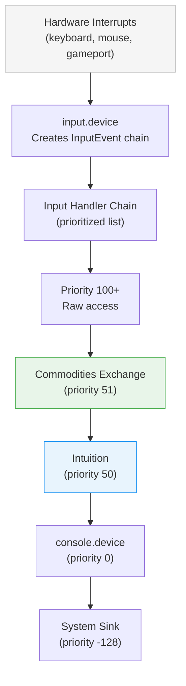
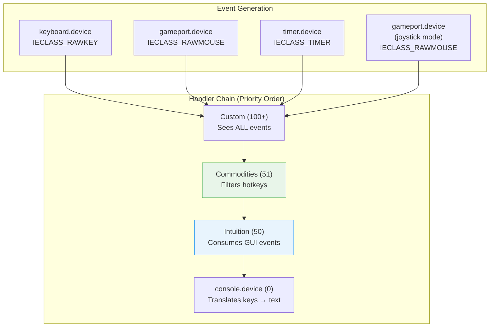
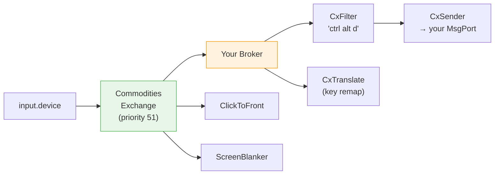
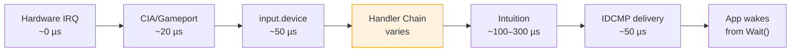

[← Home](../README.md) · [Intuition](README.md)

# Input Events

## What Are Input Events?

Input events are the lowest-level representation of user activity in AmigaOS. Before Intuition sees a mouse click or key press, before [IDCMP](idcmp.md) delivers an `IntuiMessage` — there is the **input event pipeline**. Understanding this layer is essential for:

- Writing input handlers (hotkey daemons, key remappers, accessibility tools)
- Building Commodities (Exchange-compatible background utilities)
- Implementing game input that bypasses Intuition's overhead
- Debugging input routing issues

---

## Architecture



### The Handler Chain

Input handlers are registered at specific priorities. Each handler receives the full event chain and can:

| Action | Effect |
|---|---|
| **Pass through** | Return events unmodified — next handler sees them |
| **Consume** | Set `ie_Class = IECLASS_NULL` — event is swallowed |
| **Modify** | Change event fields (remap keys, adjust coordinates) |
| **Inject** | Add new synthetic events to the chain |

### Priority Conventions

| Priority | Owner | Purpose |
|---|---|---|
| 100+ | Custom raw handlers | Hardware monitoring, accessibility |
| 51 | Commodities Exchange | Hotkeys, screen blankers, popup tools |
| 50 | Intuition | GUI event processing (screens, windows, gadgets) |
| 20–49 | Application handlers | Game input, custom input processing |
| 0 | console.device | Terminal/shell input translation |
| -128 | System sink | Catches anything nobody else wanted |

### Event Class Routing and QoS

The handler chain is the Amiga's equivalent of a **Quality-of-Service** pipeline. Priority determines who sees events first, but event *class* determines what happens at each stage:



#### What Intuition Consumes vs Passes

This is critical: Intuition does **not** consume all events. It acts as a selective filter:

| Event Class | Intuition's Action | Survives to console.device? |
|---|---|---|
| `IECLASS_RAWKEY` | Checks for screen/window shortcuts (Left-Amiga combos). Passes others through as IDCMP + to console | **Yes** (unless consumed by Amiga shortcut) |
| `IECLASS_RAWMOUSE` | Hit-tests gadgets, menus, screen drag. Consumes clicks on UI elements | **Partially** — movement passes, clicks on gadgets consumed |
| `IECLASS_TIMER` | Uses for INTUITICKS (~10 Hz), key repeat | **Yes** |
| `IECLASS_DISKINSERTED/REMOVED` | Passes to active window via IDCMP | **Yes** |
| `IECLASS_NEWPOINTERPOS` | Updates pointer position | **Consumed** |

#### Priority as QoS: Who Gets First Refusal

The priority system creates an implicit QoS hierarchy:

| QoS Tier | Priority Range | Guarantee | Trade-off |
|---|---|---|---|
| **Real-time** | 100+ | First access to raw events; can block everything below | Must be extremely fast — delays entire system |
| **System services** | 51–99 | Sees events before Intuition; can intercept and remap | Runs for every single event, even irrelevant ones |
| **Intuition** | 50 | Full GUI routing — menus, gadgets, window management | Fixed; cannot be moved |
| **Application** | 1–49 | Only sees events Intuition didn't consume | Misses GUI clicks but gets everything else |
| **Console** | 0 | Terminal text translation | Only gets keyboard events that survived |
| **Sink** | Negative | Last resort — error logging, debugging | Gets whatever nobody wanted |

#### Key Insight: No Selective Subscription

Unlike [IDCMP](idcmp.md) where you subscribe to specific event classes, **input handlers receive ALL events regardless of class**. The handler must filter by `ie_Class` internally:

```c
/* Handler receives EVERYTHING — filter for what you care about */
for (ev = events; ev; ev = ev->ie_NextEvent)
{
    switch (ev->ie_Class)
    {
        case IECLASS_RAWKEY:
            /* Handle keyboard */
            break;
        /* Ignore RAWMOUSE, TIMER, etc. — just pass through */
    }
}
```

This means a handler at priority 100 that does expensive processing on every event will delay **all** mouse movement, **all** key presses, and **all** timer events for the entire system. This is why handler performance is critical — there is no OS-level event filtering.

#### lowlevel.library — Bypassing the Chain

For CD32 and game-oriented applications, `lowlevel.library` provides interrupt-driven input that sidesteps the handler chain entirely:

```c
#include <libraries/lowlevel.h>
#include <proto/lowlevel.h>

struct Library *LowLevelBase = OpenLibrary("lowlevel.library", 40);

/* Read joystick — bypasses input.device entirely */
ULONG portState = ReadJoyPort(1);  /* Port 1 */

if (portState & JPF_BUTTON_RED)   /* Fire button */
if (portState & JP_DIRECTION_MASK) /* Directional input */
{
    if (portState & JPF_JOY_UP)    /* Up */
    if (portState & JPF_JOY_DOWN)  /* Down */
    if (portState & JPF_JOY_LEFT)  /* Left */
    if (portState & JPF_JOY_RIGHT) /* Right */
}

/* Keyboard interrupt — not in handler chain */
APTR kbInt = AddKBInt(MyKeyHandler, myData);
/* ... */
RemKBInt(kbInt);

CloseLibrary(LowLevelBase);
```

**Trade-off**: `lowlevel.library` is fast and simple but completely bypasses the OS input infrastructure. Intuition never sees these events, so GUI applications cannot use it. It's strictly for games and demos that own the display.

---

## struct InputEvent

```c
/* devices/inputevent.h — NDK 3.9 */
struct InputEvent {
    struct InputEvent *ie_NextEvent;   /* Linked list — events arrive in chains */
    UBYTE   ie_Class;                  /* IECLASS_* — event type */
    UBYTE   ie_SubClass;               /* Subclass (usually 0) */
    UWORD   ie_Code;                   /* Key scancode or button code */
    UWORD   ie_Qualifier;              /* IEQUALIFIER_* modifier bitmask */
    union {
        struct {
            WORD ie_x;                 /* Mouse X (absolute or relative) */
            WORD ie_y;                 /* Mouse Y (absolute or relative) */
        } ie_xy;
        APTR   ie_addr;               /* Dead key data or other pointer */
        struct {
            UBYTE ie_prev1DownCode;    /* Previous key 1 (for dead keys) */
            UBYTE ie_prev1DownQual;
            UBYTE ie_prev2DownCode;    /* Previous key 2 */
            UBYTE ie_prev2DownQual;
        } ie_dead;
    } ie_position;
    struct timeval ie_TimeStamp;       /* When the event occurred */
};
```

### Field Reference

| Field | Type | Description |
|---|---|---|
| `ie_NextEvent` | `InputEvent *` | Next event in chain — handlers process linked lists |
| `ie_Class` | `UBYTE` | Event type (see table below) |
| `ie_SubClass` | `UBYTE` | Typically 0; for `IECLASS_NEWPOINTERPOS` indicates format |
| `ie_Code` | `UWORD` | **Keyboard**: scancode (0x00–0x7F = down, 0x80+ = up). **Mouse**: `IECODE_LBUTTON`, `IECODE_RBUTTON`, `IECODE_MBUTTON` + `IECODE_UP_PREFIX` for release |
| `ie_Qualifier` | `UWORD` | Same `IEQUALIFIER_*` flags as in [IDCMP IntuiMessage](idcmp.md#qualifier-flags) |
| `ie_xy.ie_x/y` | `WORD` | Mouse position or delta |
| `ie_addr` | `APTR` | Dead-key translation data (for key events) |
| `ie_TimeStamp` | `struct timeval` | Seconds and microseconds since boot |

---

## Event Classes

| Class | Value | Source | Description |
|---|---|---|---|
| `IECLASS_NULL` | `0x00` | System | No-op — consumed/swallowed event |
| `IECLASS_RAWKEY` | `0x01` | Keyboard | Key press/release (raw scancode) |
| `IECLASS_RAWMOUSE` | `0x02` | Mouse | Button press/release and movement |
| `IECLASS_EVENT` | `0x03` | Intuition | Cooked event (post-Intuition processing) |
| `IECLASS_POINTERPOS` | `0x04` | System | Absolute pointer position update |
| `IECLASS_TIMER` | `0x06` | Timer | Periodic timer event (for input polling) |
| `IECLASS_GADGETDOWN` | `0x07` | Intuition | Gadget pressed |
| `IECLASS_GADGETUP` | `0x08` | Intuition | Gadget released |
| `IECLASS_REQUESTER` | `0x09` | Intuition | Requester activated |
| `IECLASS_MENULIST` | `0x0A` | Intuition | Menu list activated |
| `IECLASS_CLOSEWINDOW` | `0x0B` | Intuition | Close gadget clicked |
| `IECLASS_SIZEWINDOW` | `0x0C` | Intuition | Window resized |
| `IECLASS_REFRESHWINDOW` | `0x0D` | Intuition | Window refresh needed |
| `IECLASS_NEWPREFS` | `0x0E` | System | Preferences changed |
| `IECLASS_DISKREMOVED` | `0x0F` | System | Disk removed |
| `IECLASS_DISKINSERTED` | `0x10` | System | Disk inserted |
| `IECLASS_ACTIVEWINDOW` | `0x11` | Intuition | Window activated |
| `IECLASS_INACTIVEWINDOW` | `0x12` | Intuition | Window deactivated |
| `IECLASS_NEWPOINTERPOS` | `0x13` | System | New pointer position (extended format) |
| `IECLASS_MENUHELP` | `0x14` | Intuition | Help key pressed on menu item |
| `IECLASS_CHANGEWINDOW` | `0x15` | Intuition | Window moved/resized |

### Key Codes (RAWKEY)

| Scancode | Key | Scancode | Key |
|---|---|---|---|
| `0x00–0x31` | Alphanumeric (row by row) | `0x40` | Space |
| `0x41` | Backspace | `0x42` | Tab |
| `0x43` | Enter (keypad) | `0x44` | Return |
| `0x45` | Escape | `0x46` | Delete |
| `0x4C` | Cursor Up | `0x4D` | Cursor Down |
| `0x4E` | Cursor Right | `0x4F` | Cursor Left |
| `0x50–0x59` | F1–F10 | `0x60` | Left Shift |
| `0x61` | Right Shift | `0x62` | Caps Lock |
| `0x63` | Control | `0x64` | Left Alt |
| `0x65` | Right Alt | `0x66` | Left Amiga |
| `0x67` | Right Amiga | `0x68–0x77` | (Reserved) |

Key-up events have bit 7 set: scancode `0x45` (ESC down), `0xC5` (ESC up).

### Mouse Codes

| Code | Constant | Description |
|---|---|---|
| `0x68` | `IECODE_LBUTTON` | Left button down |
| `0xE8` | `IECODE_LBUTTON \| IECODE_UP_PREFIX` | Left button up |
| `0x69` | `IECODE_RBUTTON` | Right button down |
| `0xE9` | `IECODE_RBUTTON \| IECODE_UP_PREFIX` | Right button up |
| `0x6A` | `IECODE_MBUTTON` | Middle button down |
| `0xEA` | `IECODE_MBUTTON \| IECODE_UP_PREFIX` | Middle button up |

---

## Installing an Input Handler

### Registration

```c
#include <devices/input.h>

/* Open input.device */
struct MsgPort *inputPort = CreateMsgPort();
struct IOStdReq *inputReq = (struct IOStdReq *)
    CreateIORequest(inputPort, sizeof(struct IOStdReq));
OpenDevice("input.device", 0, (struct IORequest *)inputReq, 0);

/* Create handler */
struct Interrupt handler;
handler.is_Code         = (APTR)MyInputHandler;
handler.is_Data         = myPrivateData;
handler.is_Node.ln_Pri  = 51;     /* Above Intuition */
handler.is_Node.ln_Name = "MyHandler";
handler.is_Node.ln_Type = NT_INTERRUPT;

/* Install */
inputReq->io_Command = IND_ADDHANDLER;
inputReq->io_Data    = &handler;
DoIO((struct IORequest *)inputReq);
```

### The Handler Function

Input handlers run in the **input.device task context** — not your application's context. They must follow strict rules:

```c
struct InputEvent * __saveds MyInputHandler(
    struct InputEvent *events __asm("a0"),
    APTR data __asm("a1"))
{
    struct InputEvent *ev;

    for (ev = events; ev; ev = ev->ie_NextEvent)
    {
        /* Example: Remap Caps Lock to Control */
        if (ev->ie_Class == IECLASS_RAWKEY)
        {
            UWORD code = ev->ie_Code & ~IECODE_UP_PREFIX;
            if (code == 0x62)  /* Caps Lock scancode */
            {
                ev->ie_Code = (ev->ie_Code & IECODE_UP_PREFIX) | 0x63; /* Control */
            }
        }

        /* Example: Swallow middle mouse button */
        if (ev->ie_Class == IECLASS_RAWMOUSE &&
            (ev->ie_Code & ~IECODE_UP_PREFIX) == IECODE_MBUTTON)
        {
            ev->ie_Class = IECLASS_NULL;  /* Consume the event */
        }
    }

    return events;  /* Always return the chain! */
}
```

### Handler Rules

| Rule | Reason | Correct Approach |
|---|---|---|
| **Never call Intuition functions** | You're in the input task — Intuition may `Wait()` internally → deadlock | `Signal()` your main task; call Intuition there |
| **Never call DOS functions** | DOS is not reentrant from this context | `Signal()` your main task; call DOS there |
| **Never allocate memory** | `AllocMem()` may need to `Wait()` — forbidden in handler | Pre-allocate all buffers before installing the handler |
| **Always return the event chain** | Returning NULL kills **all input** for all applications | Return `events` even if you consumed some (set them to `IECLASS_NULL`) |
| **Keep it fast** | You're blocking all input for the entire system | Filter by `ie_Class` early; skip irrelevant events immediately |
| **Use `Signal()` for communication** | Only safe IPC from handler context | Set a flag + Signal; process in your event loop |

#### The Signal Pattern (Proper Handler → Application Communication)

```c
/* --- Data shared between handler and main task --- */
struct HandlerData {
    struct Task *mainTask;      /* Pre-resolved with FindTask(NULL) */
    ULONG        signalMask;    /* Pre-allocated with AllocSignal() */
    volatile BOOL escapePressed; /* Flag set by handler */
    volatile UWORD lastRawKey;   /* Last keycode seen */
};

/* --- Handler (runs in input.device context) --- */
struct InputEvent * __saveds MyHandler(
    struct InputEvent *events __asm("a0"),
    APTR data __asm("a1"))
{
    struct HandlerData *hd = (struct HandlerData *)data;
    struct InputEvent *ev;

    for (ev = events; ev; ev = ev->ie_NextEvent)
    {
        if (ev->ie_Class == IECLASS_RAWKEY &&
            !(ev->ie_Code & IECODE_UP_PREFIX))  /* Key down only */
        {
            hd->lastRawKey = ev->ie_Code;

            if (ev->ie_Code == 0x45)  /* Escape */
                hd->escapePressed = TRUE;

            /* Wake main task — it will read the flags */
            Signal(hd->mainTask, hd->signalMask);
        }
    }

    return events;  /* ALWAYS return the chain */
}

/* --- Main task setup --- */
struct HandlerData hd;
hd.mainTask = FindTask(NULL);
BYTE sigBit = AllocSignal(-1);
hd.signalMask = 1L << sigBit;
hd.escapePressed = FALSE;
hd.lastRawKey = 0;

/* Install handler ... (as shown above) */

/* --- Main task event loop --- */
ULONG handlerSig = hd.signalMask;
ULONG idcmpSig   = 1L << win->UserPort->mp_SigBit;

while (running)
{
    ULONG received = Wait(handlerSig | idcmpSig | SIGBREAKF_CTRL_C);

    if (received & handlerSig)
    {
        /* NOW safe to call Intuition, DOS, anything */
        if (hd.escapePressed)
        {
            hd.escapePressed = FALSE;
            DisplayBeep(NULL);          /* Intuition call — safe here! */
            running = FALSE;
        }
    }

    if (received & idcmpSig)
    {
        /* Handle normal IDCMP messages */
    }
}

/* Cleanup: remove handler, then free signal */
/* ... IND_REMHANDLER ... */
FreeSignal(sigBit);
```

### Removal

```c
inputReq->io_Command = IND_REMHANDLER;
inputReq->io_Data    = &handler;
DoIO((struct IORequest *)inputReq);

CloseDevice((struct IORequest *)inputReq);
DeleteIORequest(inputReq);
DeleteMsgPort(inputPort);
```

---

## Commodities Exchange

The **Commodities** system (OS 2.0+) provides a high-level, safe alternative to raw input handlers. Commodities are background utilities that can filter, respond to, and generate input events without the dangers of direct handler installation.

### Architecture



### Creating a Commodity

```c
#include <libraries/commodities.h>
#include <proto/commodities.h>

struct Library *CxBase = OpenLibrary("commodities.library", 37);
struct MsgPort *cxPort = CreateMsgPort();

/* Broker description */
struct NewBroker nb = {
    NB_VERSION,
    "MyTool",                 /* Name (shown in Exchange) */
    "My Utility Tool v1.0",   /* Title */
    "Hotkey utility for ...", /* Description */
    NBU_UNIQUE | NBU_NOTIFY,  /* Only one instance */
    0,                        /* Flags */
    0,                        /* Priority */
    cxPort,                   /* Message port */
    0                         /* Reserved */
};

CxObj *broker = CxBroker(&nb, NULL);
```

### Hotkey Detection

```c
/* Create a hotkey filter */
CxObj *filter = CxFilter("ctrl alt d");
if (filter)
{
    CxObj *sender = CxSender(cxPort, EVT_HOTKEY);
    if (sender)
    {
        AttachCxObj(filter, sender);
    }
    AttachCxObj(broker, filter);
}

/* Activate the broker */
ActivateCxObj(broker, TRUE);
```

### Hotkey String Syntax

| Syntax | Description | Example |
|---|---|---|
| `"ctrl alt d"` | Modifier + key | Ctrl+Alt+D |
| `"rawkey lshift rshift escape"` | Raw key with modifiers | Both Shifts + Esc |
| `"rawkey f1"` | Function key | F1 |
| `"-upstroke rawkey capslock"` | Key release event | Caps Lock released |
| `"alt -repeat a"` | Alt+A, suppress auto-repeat | Single trigger |

### Event Loop

```c
ULONG cxSig = 1L << cxPort->mp_SigBit;
BOOL running = TRUE;

while (running)
{
    ULONG received = Wait(cxSig | SIGBREAKF_CTRL_C);

    if (received & SIGBREAKF_CTRL_C) running = FALSE;

    if (received & cxSig)
    {
        CxMsg *msg;
        while ((msg = (CxMsg *)GetMsg(cxPort)))
        {
            ULONG type = CxMsgType(msg);
            ULONG id   = CxMsgID(msg);
            ReplyMsg((struct Message *)msg);

            switch (type)
            {
                case CXM_IEVENT:
                    if (id == EVT_HOTKEY)
                    {
                        /* Hotkey was pressed — open window, etc. */
                        HandleHotkey();
                    }
                    break;

                case CXM_COMMAND:
                    switch (id)
                    {
                        case CXCMD_DISABLE:
                            ActivateCxObj(broker, FALSE);
                            break;
                        case CXCMD_ENABLE:
                            ActivateCxObj(broker, TRUE);
                            break;
                        case CXCMD_KILL:
                            running = FALSE;
                            break;
                        case CXCMD_UNIQUE:
                            /* Another instance tried to start — popup */
                            HandlePopup();
                            break;
                    }
                    break;
            }
        }
    }
}

/* Cleanup */
DeleteCxObjAll(broker);
DeleteMsgPort(cxPort);
CloseLibrary(CxBase);
```

### Key Remapping with CxTranslate

```c
/* Remap Caps Lock to Escape */
CxObj *filter = CxFilter("rawkey capslock");
InputEvent newEvent = { 0 };
newEvent.ie_Class = IECLASS_RAWKEY;
newEvent.ie_Code  = 0x45;  /* Escape scancode */
CxObj *translate = CxTranslate(&newEvent);
AttachCxObj(filter, translate);
AttachCxObj(broker, filter);
```

---

## Injecting Synthetic Events

You can inject events as if they came from hardware:

```c
/* Synthesize a key press */
struct InputEvent ie = { 0 };
ie.ie_Class     = IECLASS_RAWKEY;
ie.ie_Code      = 0x23;       /* 'D' key down */
ie.ie_Qualifier = IEQUALIFIER_CONTROL;  /* With Ctrl held */

inputReq->io_Command = IND_WRITEEVENT;
inputReq->io_Data    = &ie;
inputReq->io_Length  = sizeof(struct InputEvent);
DoIO((struct IORequest *)inputReq);
```

> **Warning**: Injected events go through the entire handler chain — including Intuition. They are indistinguishable from real input.

---

## Latency Analysis

### The Input Pipeline Timing Budget

Every input event travels through a chain of processing stages. On a stock 68000 at 7.09 MHz (PAL), the latency budget is tight:



| Stage | Typical Latency (68000) | Typical Latency (68040) | Notes |
|---|---|---|---|
| Hardware interrupt | < 1 µs | < 1 µs | CIA or gameport triggers IRQ |
| Device driver | ~20 µs | ~5 µs | Reads hardware registers, builds InputEvent |
| input.device processing | ~50 µs | ~10 µs | Timestamps, links events into chain |
| Handler chain (per handler) | 10–500 µs | 2–100 µs | **Your handler's budget** |
| Intuition processing | 100–300 µs | 20–60 µs | Hit-testing, screen routing, layer locking |
| IDCMP message allocation | ~50 µs | ~10 µs | AllocMem + PutMsg to UserPort |
| Task switch to application | ~100 µs | ~20 µs | Exec scheduler latency |
| **Total (IDCMP path)** | **~500–1000 µs** | **~70–200 µs** | One to two frames at 50 Hz |

### Key Insight: Frames vs Microseconds

At 50 Hz PAL (20 ms per frame), the total IDCMP path on a 68000 consumes **2.5–5% of a frame**. This is fine for GUI applications. For games targeting 50 fps with heavy rendering, this overhead matters.

### Input Strategy Comparison

| Strategy | Latency | CPU Cost | Complexity | Best For |
|---|---|---|---|---|
| **IDCMP** | ~1 ms (68000) | Zero when idle | Low | GUI applications, editors, utilities |
| **Commodities filter** | ~0.5 ms | Zero when idle | Medium | Hotkey daemons, popup tools |
| **Custom input handler** (pri > 50) | ~0.1 ms | Handler runs for every event | High | Key remappers, accessibility tools |
| **Custom input handler** (pri < 50) | ~0.4 ms | Handler runs for every event | High | Post-Intuition filtering |
| **Direct hardware read** | ~0 ms | Polled every frame | Low | Games, demos, real-time apps |
| **gameport.device** | ~0.3 ms | Event-driven | Medium | Joystick/mouse in non-game apps |

---

## Game Input Patterns

For games and demos where latency matters, the IDCMP path is often too slow or too unpredictable. Several alternative patterns exist:

### Direct Hardware Polling

Read CIA and custom chip registers directly — zero latency, but requires careful synchronization:

```c
/* Read joystick port 1 (JOY1DAT register) */
#define JOY1DAT  (*(volatile UWORD *)0xDFF00C)
#define CIAAPRA  (*(volatile UBYTE *)0xBFE001)

void ReadJoystick(BOOL *up, BOOL *down, BOOL *left, BOOL *right, BOOL *fire)
{
    UWORD joy = JOY1DAT;

    *right = (joy & 0x0002) ? TRUE : FALSE;
    *left  = (joy & 0x0200) ? TRUE : FALSE;
    *down  = ((joy >> 1) ^ joy) & 0x0001;
    *up    = ((joy >> 1) ^ joy) & 0x0100;

    /* Fire button is active-low on CIA-A PRA bit 7 (port 2) or bit 6 (port 1) */
    *fire  = !(CIAAPRA & 0x0080);  /* Port 1 fire */
}
```

### Keyboard via CIA

Read the keyboard register directly for games that need immediate key state:

```c
#define CIAAICR  (*(volatile UBYTE *)0xBFED01)
#define CIAASDR  (*(volatile UBYTE *)0xBFEC01)

/* Note: the keyboard sends inverted scancodes, MSB first */
UBYTE ReadRawKey(void)
{
    if (CIAAICR & 0x08)  /* SP interrupt flag — key data ready */
    {
        UBYTE raw = ~CIAASDR;     /* Invert */
        UBYTE code = (raw >> 1) | (raw << 7);  /* Rotate right 1 bit */

        /* Handshake: pulse SP line */
        CIAASDR = 0xFF;  /* Drive SP high briefly */
        /* Brief delay */
        CIAASDR = 0x00;  /* Release */

        return code;
    }
    return 0xFF;  /* No key */
}
```

> **Warning**: Direct hardware access bypasses the operating system entirely. If the OS is still running (not taken over), you'll conflict with `input.device`. Use this only in system-takeover scenarios.

### Cooperative Hybrid: Handler + Signal

The best approach for games that still want OS-friendly behavior:

```c
/* Global state updated from input handler */
volatile UWORD g_KeyState[8];   /* 128-bit key state bitmap */
volatile WORD  g_MouseDX, g_MouseDY;
volatile UWORD g_MouseButtons;

struct InputEvent * __saveds GameInputHandler(
    struct InputEvent *events __asm("a0"),
    APTR data __asm("a1"))
{
    struct InputEvent *ev;
    for (ev = events; ev; ev = ev->ie_NextEvent)
    {
        if (ev->ie_Class == IECLASS_RAWKEY)
        {
            UWORD code = ev->ie_Code & 0x7F;
            UWORD word = code >> 4;
            UWORD bit  = 1 << (code & 0x0F);

            if (ev->ie_Code & 0x80)
                g_KeyState[word] &= ~bit;  /* Key up */
            else
                g_KeyState[word] |= bit;   /* Key down */
        }
        else if (ev->ie_Class == IECLASS_RAWMOUSE)
        {
            g_MouseDX += ev->ie_position.ie_xy.ie_x;
            g_MouseDY += ev->ie_position.ie_xy.ie_y;
            g_MouseButtons = ev->ie_Code;
        }
    }
    return events;  /* Pass through — Intuition still works */
}

/* In game loop — read state directly, zero latency */
BOOL IsKeyDown(UWORD scancode)
{
    return (g_KeyState[scancode >> 4] & (1 << (scancode & 0x0F))) != 0;
}
```

This gives near-zero latency reads in the game loop while keeping the OS alive — Intuition, CLI, and Workbench all continue to function.

---

## Input Handler Performance Guidelines

### Keep Your Handler Under Budget

Every microsecond in your handler delays **all** input for **all** applications:

```c
/* BAD — string comparison in handler (slow) */
if (strcmp(someString, "pattern") == 0) { ... }

/* GOOD — numeric comparison (fast) */
if (ev->ie_Code == 0x45 && (ev->ie_Qualifier & IEQUALIFIER_CONTROL)) { ... }
```

### Signal Instead of Processing

```c
/* BAD — complex processing in handler context */
struct InputEvent * __saveds MyHandler(
    struct InputEvent *events __asm("a0"), APTR data __asm("a1"))
{
    /* DON'T: open windows, update files, draw graphics */
    OpenWindow(...);    /* DEADLOCK! */
    return events;
}

/* GOOD — signal your task, process in main loop */
struct InputEvent * __saveds MyHandler(
    struct InputEvent *events __asm("a0"), APTR data __asm("a1"))
{
    struct MyData *md = (struct MyData *)data;
    struct InputEvent *ev;
    for (ev = events; ev; ev = ev->ie_NextEvent)
    {
        if (ev->ie_Class == IECLASS_RAWKEY && ev->ie_Code == 0x45)
        {
            md->escapePressed = TRUE;
            Signal(md->mainTask, md->signalMask);  /* Wake main task */
        }
    }
    return events;
}
```

### Event Batching

Input events arrive in chains, not one at a time. A single handler invocation may process 1–20 events:

```c
/* The input chain can look like:
   RAWKEY(down) → RAWMOUSE(move) → RAWMOUSE(move) → RAWKEY(up)
   
   Process the entire chain in one pass — don't copy events! */
```

---

## Pitfalls

### 1. Handler Never Returns Events

If your handler returns NULL instead of the event chain, **all input to the entire system stops**. The only recovery is a reboot.

### 2. Allocating Memory in Handler

`AllocMem()` may need to `Wait()` internally, which is forbidden in the input handler context. Pre-allocate everything.

### 3. Calling Intuition from Handler

Intuition functions require the calling task's context. Input handlers run in `input.device`'s task. Calling `OpenWindow()` from a handler causes an immediate deadlock.

### 4. Priority Conflicts

Two handlers at the same priority have undefined ordering. Always use distinct priorities.

### 5. Forgetting to Remove Handler

If your program exits without `IND_REMHANDLER`, the handler function pointer becomes a dangling reference. The next input event crashes the system.

---

## Best Practices

1. **Use Commodities** for hotkeys and simple input filtering — safer and simpler than raw handlers
2. **Use IDCMP** for normal GUI input — it's designed for application-level events
3. **Raw handlers only** when you need to intercept events before Intuition (key remapping, accessibility)
4. **Always `Signal()` from handlers** — process events in your main task, not in the handler
5. **Pre-allocate all memory** before installing a handler
6. **Test with IND_REMHANDLER** — ensure clean removal in every exit path (including crashes)
7. **Handle `CXCMD_KILL`** in Commodities — the Exchange program sends this to quit your commodity
8. **Use `NBU_UNIQUE`** to prevent multiple instances of the same commodity

---

## References

- NDK 3.9: `devices/inputevent.h`, `devices/input.h`, `libraries/commodities.h`
- ADCD 2.1: `CxBroker()`, `CxFilter()`, `CxSender()`, `CxTranslate()`, `IND_ADDHANDLER`
- AmigaOS Reference Manual (RKRM): Devices, Chapter 1 — Input Device
- AmigaOS Reference Manual (RKRM): Libraries, Chapter 11 — Commodities Exchange
- See also: [IDCMP](idcmp.md), [Screens](screens.md)
