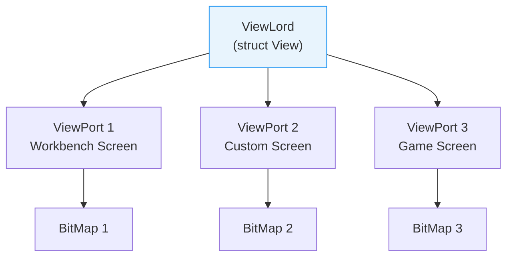

[← Home](../README.md) · [Intuition](README.md)

# IntuitionBase — Global GUI State

## What Is IntuitionBase?

`IntuitionBase` is the library base structure for `intuition.library` — the heart of the Amiga's graphical user interface. Unlike modern systems where the window manager is a separate process, Intuition is a **shared library** loaded into the system's address space. `IntuitionBase` contains the global state for all screens, windows, and input routing.

Every Amiga GUI program begins by opening this library:

```c
struct IntuitionBase *IntuitionBase;
IntuitionBase = (struct IntuitionBase *)OpenLibrary("intuition.library", 39);
if (!IntuitionBase)
{
    /* Running on a system older than OS 3.0 — exit gracefully */
    return RETURN_FAIL;
}
```

### Version Requirements

| Version | OS Release | Key Features Added |
|---|---|---|
| 33 | 1.2 | Original Intuition |
| 36 | 2.0 | TagList APIs, public screens, BOOPSI, GadTools |
| 37 | 2.04 | Improved memory handling |
| 39 | 3.0 | New-look menus, enhanced DrawInfo, `ChangeWindowBox()` |
| 40 | 3.1 | AppWindow/AppIcon improvements |
| 47 | 3.2 | OS 3.2 additions (enhanced backfill, new screen tags) |
| 50+ | 3.2.x | Continued 3.2 line improvements |

---

## struct IntuitionBase

```c
/* intuition/intuitionbase.h — NDK 3.9 */
struct IntuitionBase {
    struct Library  LibNode;          /* Standard library node */
    struct View     ViewLord;         /* Master graphics View */
    struct Window  *ActiveWindow;     /* Currently active window */
    struct Screen  *ActiveScreen;     /* Currently active screen */
    struct Screen  *FirstScreen;      /* Head of screen linked list */
    ULONG           Flags;            /* Internal state flags */
    WORD            MouseY, MouseX;   /* Current mouse position */
    ULONG           Seconds, Micros;  /* Current timestamp */
    /* ... many private/internal fields follow ... */
};
```

### Field Reference

| Field | Type | Description | Safe to Read? |
|---|---|---|---|
| `LibNode` | `struct Library` | Standard Exec library header — version, open count, etc. | Yes |
| `ViewLord` | `struct View` | Master `View` structure — controls the entire display through the Copper | **No** — use graphics.library functions |
| `ActiveWindow` | `struct Window *` | Pointer to the currently active window | Yes (with `Forbid()`/`Permit()`) |
| `ActiveScreen` | `struct Screen *` | Pointer to the currently active screen | Yes (with `Forbid()`/`Permit()`) |
| `FirstScreen` | `struct Screen *` | Head of the screen list (front-to-back order) | Yes (with `Forbid()`/`Permit()`) |
| `Flags` | `ULONG` | Internal state flags | **No** — private |
| `MouseY`, `MouseX` | `WORD` | Absolute mouse position on active screen | Yes |
| `Seconds`, `Micros` | `ULONG` | System timestamp of last input event | Yes |

> **Warning**: Fields beyond those listed above are **private** and change between OS versions. Accessing undocumented fields will break your program on different OS releases.

---

## Using IntuitionBase

### Reading the Active Window

```c
/* Must protect with Forbid/Permit — ActiveWindow can change asynchronously */
Forbid();
struct Window *active = IntuitionBase->ActiveWindow;
if (active)
{
    /* Read what you need while protected */
    STRPTR title = active->Title;
    /* ... */
}
Permit();
```

### Walking the Screen List

```c
Forbid();
struct Screen *scr = IntuitionBase->FirstScreen;
while (scr)
{
    Printf("Screen: %s (%ldx%ld)\n",
        scr->Title ? scr->Title : "(no title)",
        scr->Width, scr->Height);
    scr = scr->NextScreen;
}
Permit();
```

### Reading Mouse Position

```c
/* Global mouse position (relative to active screen) */
WORD mx = IntuitionBase->MouseX;
WORD my = IntuitionBase->MouseY;

/* For window-relative position, use Window->MouseX/MouseY instead */
```

---

## The ViewLord

`IntuitionBase->ViewLord` is the master `struct View` — the top-level graphics structure that controls the entire display. Intuition builds a Copper list from this View to render all screens.



You should **never** modify the ViewLord directly. Use `MakeScreen()`, `RethinkDisplay()`, or `RemakeDisplay()`:

```c
/* After changing a screen's ViewPort (e.g., palette): */
MakeScreen(scr);        /* Rebuild this screen's Copper list */
RethinkDisplay();       /* Rebuild the entire display from ViewLord */

/* Or the combined version: */
RemakeDisplay();        /* MakeScreen + RethinkDisplay for all screens */
```

---

## Library Functions Overview

### Screen Management

| Function | Description |
|---|---|
| `OpenScreenTagList()` | Open a new screen with tag-based configuration |
| `CloseScreen()` | Close a screen (all windows must be closed first) |
| `LockPubScreen()` | Lock a public screen by name (prevents closing) |
| `UnlockPubScreen()` | Release a public screen lock |
| `PubScreenStatus()` | Set public screen state (available / private) |
| `GetScreenDrawInfo()` | Get pen and font information for a screen |
| `FreeScreenDrawInfo()` | Release DrawInfo |
| `ScreenToFront()` / `ScreenToBack()` | Change screen depth order |
| `MoveScreen()` | Move screen vertically |

### Window Management

| Function | Description |
|---|---|
| `OpenWindowTagList()` | Open a new window with tag-based configuration |
| `CloseWindow()` | Close a window |
| `ActivateWindow()` | Make a window active |
| `WindowToFront()` / `WindowToBack()` | Change window depth |
| `MoveWindow()` / `SizeWindow()` | Adjust window position/size |
| `ChangeWindowBox()` | Set absolute position and size |
| `SetWindowTitles()` | Change window and screen titles |
| `SetWindowPointer()` | Set custom or busy pointer |

### Gadget Management

| Function | Description |
|---|---|
| `AddGadget()` / `RemoveGadget()` | Add/remove gadgets from windows |
| `RefreshGList()` | Redraw gadget(s) |
| `SetGadgetAttrs()` | Set BOOPSI gadget attributes |
| `ModifyIDCMP()` | Change IDCMP flags dynamically |

### Menu Management

| Function | Description |
|---|---|
| `SetMenuStrip()` | Attach menu strip to window |
| `ClearMenuStrip()` | Remove menu strip from window |
| `OnMenu()` / `OffMenu()` | Enable/disable menu items |
| `ItemAddress()` | Get MenuItem pointer from packed menu number |

### Requesters and Dialogs

| Function | Description |
|---|---|
| `EasyRequest()` | Show a simple message dialog |
| `BuildEasyRequest()` | Create a non-blocking requester |
| `SysReqHandler()` | Poll a non-blocking requester |
| `FreeSysRequest()` | Free a non-blocking requester |
| `AutoRequest()` | Legacy two-button dialog (OS 1.x) |

### Rendering Support

| Function | Description |
|---|---|
| `DrawBorder()` | Draw a `struct Border` |
| `PrintIText()` | Draw `struct IntuiText` |
| `BeginRefresh()` / `EndRefresh()` | Simple-refresh window support |
| `LockIBase()` / `UnlockIBase()` | Lock IntuitionBase for multi-field reads |

---

## LockIBase — Safe Multi-Field Access

When reading multiple IntuitionBase fields that must be consistent, use `LockIBase()`:

```c
ULONG lock = LockIBase(0);

struct Window *active = IntuitionBase->ActiveWindow;
struct Screen *screen = IntuitionBase->ActiveScreen;
/* Both refer to the same moment in time */

UnlockIBase(lock);
```

Without the lock, `ActiveWindow` could change between reading it and reading `ActiveScreen` — giving you a window on a different screen than expected.

> `LockIBase()` is heavier than `Forbid()`/`Permit()` — use it only when you need atomic multi-field reads. For single field access, `Forbid()`/`Permit()` is sufficient.

---

## Pitfalls

### 1. Not Checking Library Version

Opening `intuition.library` version 0 succeeds on any system, but tag-based functions (`OpenWindowTags`, `OpenScreenTags`) require version 36+. Always specify the minimum version you need.

### 2. Reading Private Fields

Many tools and examples from the late '80s directly access internal IntuitionBase fields (like internal semaphores or the gadget environment). These fields **moved between OS versions** — code that worked on 1.3 crashed on 2.0, and code that worked on 3.1 crashes on 3.2.

### 3. Writing to IntuitionBase

Never write to IntuitionBase fields directly. Use the provided API functions. Direct writes bypass Intuition's internal state management and cause corruption.

### 4. Forgetting Forbid/Permit

`ActiveWindow`, `ActiveScreen`, and `FirstScreen` can change at any time (multitasking). Reading without `Forbid()`/`Permit()` or `LockIBase()` creates a race condition.

---

## Best Practices

1. **Open with the minimum version you need** — e.g., `OpenLibrary("intuition.library", 39)` for OS 3.0 features
2. **Use `LockIBase()`** for atomic multi-field reads from IntuitionBase
3. **Use `Forbid()`/`Permit()`** for quick single-field reads
4. **Never access undocumented fields** — they change between OS versions
5. **Never modify IntuitionBase** — use API functions
6. **Close the library** when done — `CloseLibrary((struct Library *)IntuitionBase)`
7. **Check the library pointer** before using any functions — it may be NULL on pre-2.0 systems

---

## References

- NDK 3.9: `intuition/intuitionbase.h`, `intuition/intuition.h`
- ADCD 2.1: `OpenLibrary()`, `LockIBase()`, `UnlockIBase()`
- AmigaOS Reference Manual (RKRM): Libraries, Chapter 2 — Intuition Overview
- See also: [Screens](screens.md), [Windows](windows.md), [IDCMP](idcmp.md)
