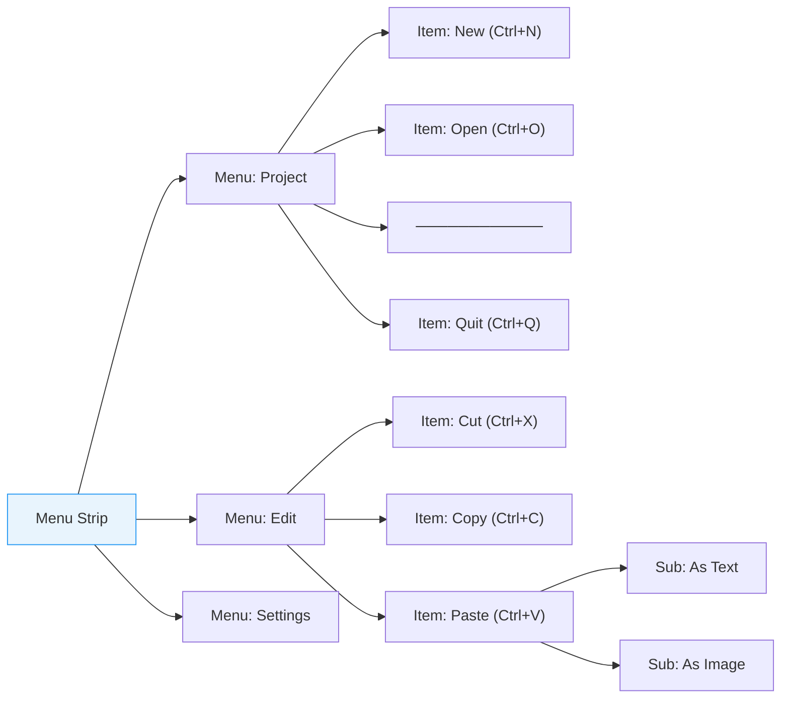
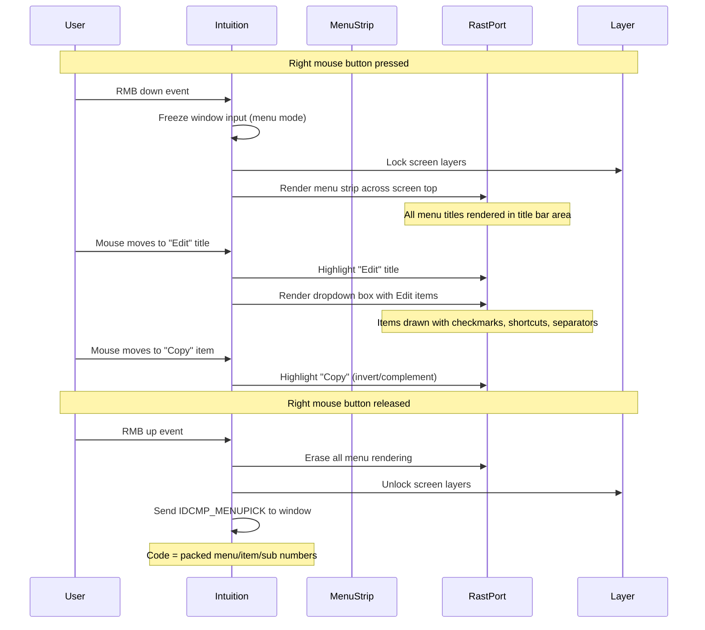

[← Home](../README.md) · [Intuition](README.md)

# Menus

## What Are Menus?

Menus are Intuition's pull-down command system. When the user presses the **right mouse button**, Intuition displays a menu strip attached to the active window's screen title bar. Menus are the primary mechanism for accessing application commands that don't warrant dedicated gadgets.

The menu system has three levels:



| Level | Structure | Max Count | Description |
|---|---|---|---|
| **Menu** | `struct Menu` | 31 | Top-level categories (Project, Edit, etc.) |
| **Item** | `struct MenuItem` | 63 | Commands within a menu |
| **Sub-Item** | `struct MenuItem` | 31 | Nested commands within an item |

---

## GadTools Menu Creation (OS 2.0+)

The preferred way to create menus — handles layout, keyboard shortcuts, and the OS look-and-feel automatically:

### Defining the Menu Structure

```c
#include <libraries/gadtools.h>
#include <proto/gadtools.h>

/* Menu IDs — use an enum for clarity */
enum {
    MENU_NEW = 1, MENU_OPEN, MENU_SAVE, MENU_SAVEAS, MENU_QUIT,
    MENU_CUT, MENU_COPY, MENU_PASTE, MENU_SELECTALL,
    MENU_BOLD, MENU_ITALIC, MENU_UNDERLINE
};

struct NewMenu nm[] = {
    { NM_TITLE,  "Project",       NULL,  0, 0, NULL },
    {  NM_ITEM,  "New",           "N",   0, 0, (APTR)MENU_NEW },
    {  NM_ITEM,  "Open...",       "O",   0, 0, (APTR)MENU_OPEN },
    {  NM_ITEM,  "Save",          "S",   0, 0, (APTR)MENU_SAVE },
    {  NM_ITEM,  "Save As...",    "A",   0, 0, (APTR)MENU_SAVEAS },
    {  NM_ITEM,  NM_BARLABEL,    NULL,  0, 0, NULL },   /* Separator */
    {  NM_ITEM,  "Quit",          "Q",   0, 0, (APTR)MENU_QUIT },

    { NM_TITLE,  "Edit",          NULL,  0, 0, NULL },
    {  NM_ITEM,  "Cut",           "X",   0, 0, (APTR)MENU_CUT },
    {  NM_ITEM,  "Copy",          "C",   0, 0, (APTR)MENU_COPY },
    {  NM_ITEM,  "Paste",         "V",   0, 0, (APTR)MENU_PASTE },
    {  NM_ITEM,  NM_BARLABEL,    NULL,  0, 0, NULL },
    {  NM_ITEM,  "Select All",    "A",   NM_COMMANDSTRING, 0, (APTR)MENU_SELECTALL },

    { NM_TITLE,  "Style",         NULL,  0, 0, NULL },
    {  NM_ITEM,  "Bold",          "B",   CHECKIT|MENUTOGGLE, 0, (APTR)MENU_BOLD },
    {  NM_ITEM,  "Italic",        "I",   CHECKIT|MENUTOGGLE, 0, (APTR)MENU_ITALIC },
    {  NM_ITEM,  "Underline",     "U",   CHECKIT|MENUTOGGLE, 0, (APTR)MENU_UNDERLINE },

    { NM_END,    NULL,            NULL,  0, 0, NULL }
};
```

### NewMenu Field Reference

| Field | Description |
|---|---|
| `nm_Type` | `NM_TITLE`, `NM_ITEM`, `NM_SUB`, or `NM_END` |
| `nm_Label` | Text label, or `NM_BARLABEL` for separator |
| `nm_CommKey` | Keyboard shortcut character (Right-Amiga + key) |
| `nm_Flags` | `CHECKIT`, `CHECKED`, `MENUTOGGLE`, `NM_COMMANDSTRING`, `NM_ITEMDISABLED` |
| `nm_MutualExclude` | Bitmask of items that can't be checked simultaneously |
| `nm_UserData` | Application-defined value — typically a menu command ID |

### Creating and Attaching

```c
/* Get VisualInfo for the screen */
struct Screen *scr = LockPubScreen(NULL);
APTR vi = GetVisualInfo(scr, TAG_DONE);

/* Create the menu structure */
struct Menu *menuStrip = CreateMenus(nm, TAG_DONE);
if (!menuStrip) { /* error */ }

/* Layout the menus (calculates positions/sizes) */
if (!LayoutMenus(menuStrip, vi, GTMN_NewLookMenus, TRUE, TAG_DONE))
{
    FreeMenus(menuStrip);
    /* error */
}

/* Attach to window */
SetMenuStrip(win, menuStrip);

/* Cleanup (in reverse order): */
ClearMenuStrip(win);
FreeMenus(menuStrip);
FreeVisualInfo(vi);
UnlockPubScreen(NULL, scr);
```

---

## Handling Menu Events

### Basic Event Loop

Menu selections arrive as `IDCMP_MENUPICK` events. The `Code` field contains a **packed menu number**:

```c
case IDCMP_MENUPICK:
{
    UWORD menuCode = code;

    while (menuCode != MENUNULL)
    {
        struct MenuItem *item = ItemAddress(menuStrip, menuCode);

        /* Decode menu/item/sub numbers */
        UWORD menuNum = MENUNUM(menuCode);
        UWORD itemNum = ITEMNUM(menuCode);
        UWORD subNum  = SUBNUM(menuCode);

        /* Use UserData for command dispatch (cleaner than numbers) */
        APTR userData = GTMENUITEM_USERDATA(item);

        switch ((ULONG)userData)
        {
            case MENU_NEW:    NewDocument();   break;
            case MENU_OPEN:   OpenDocument();  break;
            case MENU_SAVE:   SaveDocument();  break;
            case MENU_QUIT:   running = FALSE; break;
            case MENU_CUT:    CutSelection();  break;
            case MENU_COPY:   CopySelection(); break;
            case MENU_PASTE:  PasteClipboard(); break;

            case MENU_BOLD:
                /* Check if item is now checked or unchecked */
                if (item->Flags & CHECKED)
                    EnableBold();
                else
                    DisableBold();
                break;
        }

        /* Multi-select: user may have selected multiple items
           by holding the right button while clicking */
        menuCode = item->NextSelect;
    }
    break;
}
```

### Menu Number Encoding

Menu selections are encoded as a single `UWORD`:

```c
/* Decode macros */
#define MENUNUM(code)   ((code) & 0x1F)           /* Bits 0–4:  menu (0–31) */
#define ITEMNUM(code)   (((code) >> 5) & 0x3F)    /* Bits 5–10: item (0–63) */
#define SUBNUM(code)    (((code) >> 11) & 0x1F)   /* Bits 11–15: sub (0–31) */

/* Encode macro */
#define FULLMENUNUM(m, i, s) ((m) | ((i) << 5) | ((s) << 11))

/* No selection */
#define MENUNULL  0xFFFF
```

### Multi-Select

The Amiga supports **multi-select**: the user can hold the right button and select multiple items in sequence. Each selected item's `NextSelect` field points to the next selection in the chain. You **must** walk this chain — otherwise, multi-selected items are silently dropped.

---

## Checkmark and Mutual Exclusion

### Toggle Menus

Items with `CHECKIT | MENUTOGGLE` act as toggles:

```c
{  NM_ITEM,  "Word Wrap",  NULL,  CHECKIT | MENUTOGGLE | CHECKED,  0, (APTR)MENU_WORDWRAP },
```

- `CHECKED` — item starts checked
- `MENUTOGGLE` — clicking toggles between checked/unchecked
- Without `MENUTOGGLE`, `CHECKIT` items are one-way (once checked, stay checked)

### Mutual Exclusion

Force radio-button behavior by setting `nm_MutualExclude` to a bitmask of incompatible items:

```c
/* Only one tab size can be active at a time */
{  NM_ITEM, "Tab: 2",  NULL, CHECKIT|CHECKED, ~1, (APTR)MENU_TAB2 },  /* Excludes items 1,2 */
{  NM_ITEM, "Tab: 4",  NULL, CHECKIT,         ~2, (APTR)MENU_TAB4 },  /* Excludes items 0,2 */
{  NM_ITEM, "Tab: 8",  NULL, CHECKIT,         ~4, (APTR)MENU_TAB8 },  /* Excludes items 0,1 */
```

The bitmask uses **item positions within the menu** (not IDs). Bit 0 = first item, bit 1 = second item, etc. `~1` means "exclude all except item 0."

---

## Sub-Menus

```c
{ NM_TITLE,  "Export",    NULL,  0, 0, NULL },
{  NM_ITEM,  "Image",     NULL,  0, 0, NULL },
{   NM_SUB,  "PNG",       NULL,  0, 0, (APTR)MENU_PNG },
{   NM_SUB,  "JPEG",      NULL,  0, 0, (APTR)MENU_JPEG },
{   NM_SUB,  "IFF ILBM",  NULL,  0, 0, (APTR)MENU_ILBM },
{  NM_ITEM,  "Text",      "T",   0, 0, (APTR)MENU_TEXT },
```

Sub-menus appear as a cascading menu to the right when the user hovers over the parent item. Only one level of sub-menus is supported.

---

## Dynamic Menu Modification

### Disabling/Enabling Items at Runtime

```c
/* Disable "Save" when no document is open */
OffMenu(win, FULLMENUNUM(0, 2, NOSUB));   /* Menu 0, Item 2 */

/* Enable "Paste" when clipboard has content */
OnMenu(win, FULLMENUNUM(1, 2, NOSUB));    /* Menu 1, Item 2 */
```

### Checking/Unchecking Items

```c
struct MenuItem *item = ItemAddress(menuStrip,
    FULLMENUNUM(2, 0, NOSUB));

/* Check programmatically */
item->Flags |= CHECKED;

/* Uncheck */
item->Flags &= ~CHECKED;
```

### Replacing the Entire Menu Strip

```c
ClearMenuStrip(win);
/* Modify or rebuild menuStrip */
SetMenuStrip(win, menuStrip);
```

---

## Keyboard Shortcuts

### Standard Single-Character Shortcuts

The `nm_CommKey` field accepts a single character. Intuition displays it as "Amiga+X" in the menu:

```c
{  NM_ITEM,  "Open...",  "O",  0, 0, (APTR)MENU_OPEN },
/* Displayed as:  Open...     ⌂O  */
```

### Multi-Character Shortcuts (NM_COMMANDSTRING)

For longer key descriptions (non-standard shortcuts):

```c
{  NM_ITEM,  "Find Next", "F3", NM_COMMANDSTRING, 0, (APTR)MENU_FINDNEXT },
/* NM_COMMANDSTRING tells GadTools to display the full string as-is */
```

> **Note**: `NM_COMMANDSTRING` only changes the display text. You must still handle the actual key detection in your `IDCMP_RAWKEY` handler — GadTools does not intercept arbitrary key combinations.

---

## Menu Imagery (Advanced)

Menu items can contain images instead of text:

```c
/* Image-based menu item */
struct Image *icon = /* ... your image ... */;

struct MenuItem imgItem = {
    .NextItem    = NULL,
    .LeftEdge    = 0,
    .TopEdge     = 0,
    .Width       = icon->Width,
    .Height      = icon->Height,
    .Flags       = ITEMTEXT | ITEMENABLED | HIGHCOMP,
    .MutualExclude = 0,
    .ItemFill    = (APTR)icon,
    .SelectFill  = NULL,
    .Command     = 0,
    .SubItem     = NULL,
    .NextSelect  = MENUNULL,
};
```

However, GadTools' `CreateMenus()` does not support image items — this requires manual `struct Menu`/`MenuItem` construction.

---

## Pitfalls

### 1. Not Walking NextSelect

```c
/* BUG — only handles first selection, drops multi-select */
struct MenuItem *item = ItemAddress(menuStrip, code);
HandleItem(item);
/* Missing: code = item->NextSelect; loop */
```

### 2. ClearMenuStrip Before Closing Window

If you call `CloseWindow()` without `ClearMenuStrip()` first, Intuition may access freed menu memory during the close process.

```c
/* CORRECT order */
ClearMenuStrip(win);
CloseWindow(win);
FreeMenus(menuStrip);
```

### 3. LayoutMenus with Wrong VisualInfo

The VisualInfo must match the screen the window is on. Using a VisualInfo from a different screen causes corrupted menu rendering.

### 4. Modifying Menu Strip While Active

Never modify `struct MenuItem` fields while the menu strip is attached to a window. Always `ClearMenuStrip()` first, modify, then `SetMenuStrip()` again.

### 5. Shortcut Key Collisions

Intuition automatically intercepts Right-Amiga+key combinations matching menu shortcuts. If two items share the same shortcut letter, only the first match is triggered.

---

## Best Practices

1. **Use `GTMENUITEM_USERDATA()`** for command dispatch — more robust than position-based menu/item numbers
2. **Always walk `NextSelect`** to handle multi-select properly
3. **Use `NM_BARLABEL`** to visually group related items with separators
4. **Follow platform conventions**: Project menu first, Quit at bottom with separator, Edit menu second
5. **Use `MENUTOGGLE`** for boolean settings — users expect toggle behavior
6. **Disable items** with `OffMenu()` when they don't apply — don't hide them
7. **Clean up in order**: `ClearMenuStrip()` → `CloseWindow()` → `FreeMenus()` → `FreeVisualInfo()`
8. **Use `GTMN_NewLookMenus, TRUE`** for the modern 3D menu appearance (OS 3.0+)
9. **Keep menus shallow** — max 3 levels (menu → item → sub-item); deeper nesting confuses users
10. **Disable rather than remove** — users learn where commands live; removing them breaks spatial memory
11. **Use keyboard shortcuts for the top 10 commands** — the rest don't need them
12. **Never modify menu structs while attached** — always `ClearMenuStrip()` first

---

## Menu Render Chain

When the user presses the right mouse button, Intuition renders the menu system through a specific pipeline:



### Render Details

| Phase | What Intuition Does | Memory Impact |
|-------|--------------------|---------------|
| **Strip rendering** | Draws all menu titles across the screen title bar | Backing store saved for Smart Refresh windows obscured by strip |
| **Dropdown** | Draws a filled rectangle with items inside | Obscures part of the window beneath |
| **Highlight** | `HIGHCOMP` = XOR complement, `HIGHBOX` = draw rectangle | Non-destructive — can be undone by same operation |
| **Cleanup** | Restores all obscured content from backing store | Smart refresh handles this automatically |

> [!NOTE]
> While the menu is active, Intuition **freezes input** to the window. No `IDCMP_RAWKEY`, `IDCMP_MOUSEBUTTONS`, or gadget events are delivered until the menu closes. The application cannot draw during menu mode because Intuition holds the layer lock.

---

## Named Antipatterns

### "The Multi-Select Ghost" — Ignoring NextSelect

```c
/* BAD: Only processes the first item selected.
   If the user multi-selects (hold RMB, click several items),
   only the first one is handled — the rest silently vanish. */
case IDCMP_MENUPICK:
{
    struct MenuItem *item = ItemAddress(menuStrip, code);
    HandleCommand(GTMENUITEM_USERDATA(item));
    break;  /* BUG: drops all subsequent selections */
}
```

```c
/* CORRECT: Walk the NextSelect chain */
case IDCMP_MENUPICK:
{
    UWORD menuCode = code;
    while (menuCode != MENUNULL)
    {
        struct MenuItem *item = ItemAddress(menuStrip, menuCode);
        HandleCommand(GTMENUITEM_USERDATA(item));
        menuCode = item->NextSelect;
    }
    break;
}
```

### "The Stale Menu" — Modifying Items While Attached

```c
/* BAD: Modifying MenuItem flags while the menu strip is active.
   If the user opens the menu at exactly this moment, Intuition
   reads partially-modified state — corrupted rendering or crash. */
struct MenuItem *item = ItemAddress(menuStrip, FULLMENUNUM(0, 2, NOSUB));
item->Flags |= CHECKED;  /* RACE CONDITION */
```

```c
/* CORRECT: Detach, modify, reattach */
ClearMenuStrip(win);
struct MenuItem *item = ItemAddress(menuStrip, FULLMENUNUM(0, 2, NOSUB));
item->Flags |= CHECKED;
SetMenuStrip(win, menuStrip);
```

> [!TIP]
> For simple enable/disable or check/uncheck, use `OnMenu()`/`OffMenu()` instead — these are safe to call while the menu is attached.

### "The Cleanup Reversal" — Wrong Free Order

```c
/* BAD: Freeing menus before clearing from window — Intuition
   may access freed memory on the next menu open attempt. */
FreeMenus(menuStrip);      /* freed while still attached */
ClearMenuStrip(win);       /* too late — dangling pointer */
CloseWindow(win);
```

```c
/* CORRECT: ClearMenuStrip → CloseWindow → FreeMenus */
ClearMenuStrip(win);
CloseWindow(win);
FreeMenus(menuStrip);      /* now safe — no window references it */
FreeVisualInfo(vi);
UnlockPubScreen(NULL, scr);
```

### "The Shortcut Collision" — Duplicate CommKey Letters

```c
/* BAD: Two items in the same menu share shortcut "S".
   Only the first match fires — "Save As" is unreachable via keyboard. */
{  NM_ITEM,  "Save",       "S",  0, 0, (APTR)MENU_SAVE },
{  NM_ITEM,  "Save As...", "S",  0, 0, (APTR)MENU_SAVEAS },
```

```c
/* CORRECT: Each shortcut must be unique within its menu */
{  NM_ITEM,  "Save",       "S",  0, 0, (APTR)MENU_SAVE },
{  NM_ITEM,  "Save As...", "A",  0, 0, (APTR)MENU_SAVEAS },
```

### "The Phantom VisualInfo" — Wrong Screen

```c
/* BAD: Getting VisualInfo from one screen, opening window on another.
   LayoutMenus calculates positions for the wrong font/resolution. */
struct Screen *scr1 = LockPubScreen(NULL);
APTR vi = GetVisualInfo(scr1, TAG_DONE);
/* ... later, open window on a DIFFERENT screen ... */
struct Screen *scr2 = /* custom screen */;
struct Window *win = OpenWindowTags(NULL, WA_CustomScreen, scr2, TAG_DONE);
SetMenuStrip(win, menuStrip);  /* WRONG VI — menu positions are for scr1 */
```

```c
/* CORRECT: Get VisualInfo from the SAME screen the window uses */
struct Screen *scr = /* the screen your window is on */;
APTR vi = GetVisualInfo(scr, TAG_DONE);
```

---

## Practical Cookbook: Complete Menu Lifecycle

```c
#include <proto/exec.h>
#include <proto/intuition.h>
#include <proto/gadtools.h>
#include <libraries/gadtools.h>

enum { MENU_QUIT = 1, MENU_NEW, MENU_OPEN, MENU_CUT, MENU_COPY, MENU_PASTE };

struct NewMenu menuDef[] = {
    { NM_TITLE,  "Project",     NULL, 0, 0, NULL },
    {  NM_ITEM,  "New",         "N",  0, 0, (APTR)MENU_NEW },
    {  NM_ITEM,  "Open...",     "O",  0, 0, (APTR)MENU_OPEN },
    {  NM_ITEM,  NM_BARLABEL,   NULL, 0, 0, NULL },
    {  NM_ITEM,  "Quit",        "Q",  0, 0, (APTR)MENU_QUIT },
    { NM_TITLE,  "Edit",        NULL, 0, 0, NULL },
    {  NM_ITEM,  "Cut",         "X",  0, 0, (APTR)MENU_CUT },
    {  NM_ITEM,  "Copy",        "C",  0, 0, (APTR)MENU_COPY },
    {  NM_ITEM,  "Paste",       "V",  0, 0, (APTR)MENU_PASTE },
    { NM_END,    NULL,           NULL, 0, 0, NULL }
};

struct Menu *CreateAndAttachMenus(struct Window *win)
{
    struct Screen *scr = win->WScreen;
    APTR vi = GetVisualInfo(scr, TAG_DONE);
    if (!vi) return NULL;

    struct Menu *menuStrip = CreateMenus(menuDef, TAG_DONE);
    if (!menuStrip) { FreeVisualInfo(vi); return NULL; }

    if (!LayoutMenus(menuStrip, vi,
        GTMN_NewLookMenus, TRUE,
        TAG_DONE))
    {
        FreeMenus(menuStrip);
        FreeVisualInfo(vi);
        return NULL;
    }

    SetMenuStrip(win, menuStrip);
    FreeVisualInfo(vi);  /* safe to free after LayoutMenus + SetMenuStrip */
    return menuStrip;
}

void ProcessMenuPick(struct Window *win, struct Menu *menuStrip, UWORD code)
{
    while (code != MENUNULL)
    {
        struct MenuItem *item = ItemAddress(menuStrip, code);
        ULONG cmd = (ULONG)GTMENUITEM_USERDATA(item);

        switch (cmd)
        {
            case MENU_NEW:    NewDocument();   break;
            case MENU_OPEN:   OpenDocument();  break;
            case MENU_CUT:    CutSelection();  break;
            case MENU_COPY:   CopySelection(); break;
            case MENU_PASTE:  PasteClipboard(); break;
            case MENU_QUIT:   /* signal main loop to exit */ break;
        }
        code = item->NextSelect;
    }
}

void CleanupMenus(struct Window *win, struct Menu *menuStrip)
{
    ClearMenuStrip(win);
    FreeMenus(menuStrip);
}
```

---

## Historical Context & Modern Analogies

### Competitive Landscape

| Platform | Menu System | Keyboard Shortcuts | Dynamic Modification | Sub-Menus | Notes |
|----------|------------|-------------------|---------------------|-----------|-------|
| **AmigaOS Intuition** | Right-click pull-down | Right-Amiga+key | `OnMenu()`/`OffMenu()`, `SetMenuStrip()` | 1 level only | Multi-select is unique — no other platform supports it |
| **Mac OS (Classic)** | Click-and-hold in menu bar | Command+key | `EnableMenuItem()`/`DisableMenuItem()` | Cascading | First platform with standard menu bar |
| **Windows 3.x** | Click on menu bar | Alt+letter, Ctrl+key | `EnableMenuItem()` | Cascading | Menu bar in each window |
| **Atari ST GEM** | Click on menu bar | Alt+key | Limited | No | Very basic — no checkmarks, no radio groups |
| **X11/Motif** | Click on menu bar | Alt+key (motif) | `XtSetSensitive()` | Cascading | Server-side rendering |

The Amiga's **right-click-to-activate** menu system was unique. Every other platform used a left-click menu bar. The right-click approach meant menus never interfered with left-click window operations, but it confused users coming from Mac/Windows.

**Multi-select** (holding right button while clicking multiple items) was an Amiga-exclusive feature. No other platform supported selecting Cut, Copy, and Paste in a single menu interaction.

### Modern Analogies

| Amiga Concept | Modern Equivalent | Notes |
|--------------|-------------------|-------|
| Right-click menu activation | Right-click context menu (all platforms) | Amiga: right-click = global menu bar; Modern: right-click = context menu |
| `struct NewMenu[]` array | XUL `<menubar>` / GTK `GtkUIManager` / Qt `QMenuBar` | Declarative menu definition |
| `CreateMenus()` + `LayoutMenus()` | `gtk_menu_bar_new_from_model()` / Qt Designer | Build + layout in one step |
| `SetMenuStrip()` | `gtk_application_set_menubar()` / macOS `NSMenu` | Attach to window |
| `GTMENUITEM_USERDATA()` | `gtk_buildable_get_name()` / Qt `QObject::property()` | User data for dispatch |
| `IDCMP_MENUPICK` | `activate` signal (GTK) / `triggered` (Qt) / `@IBAction` (macOS) | Selection event |
| `MENUNUM/ITEMNUM/SUBNUM` | None — modern APIs pass the menu item object directly | Amiga packs 3 levels into one UWORD |
| `NextSelect` chain | None — modern menus fire one event per selection | Amiga's multi-select is unique |
| `OnMenu()`/`OffMenu()` | `gtk_widget_set_sensitive()` / `NSMenuItem.enabled` | Enable/disable |
| `NM_BARLABEL` separator | GTK `gtk_separator_menu_item_new()` / Qt `addSeparator()` | Visual divider |

---

## Use Cases

| Application | Menu Structure | Notable Features |
|-------------|---------------|-----------------|
| **Workbench** | System (disk operations), Special (snapshot, cleanup) | Backdrop menu — menus available from Workbench screen |
| **Word processors (Final Writer, WordWorth)** | Project, Edit, Format, Tools, Print | Mutual exclusion for font size, toggle for bold/italic |
| **Image editors (Deluxe Paint)** | Picture, Brush, Mode,Prefs | Dynamic menus — mode options change with tool |
| **Terminal emulators** | Connect, Edit, Settings | Menu-only commands — no toolbar |
| **IDE / dev tools (SAS/C, DevPac)** | Project, Edit, Search, Run, Debug, Options | Extensive menus with many disabled states |
| **Games with GUI frontends** | Game, Options, Help | Simple 2-3 menu strip; menus disabled during gameplay |
| **File managers (Directory Opus)** | File, Edit, View, Tools, Settings | Heavily customized menus with gadget-driven alternatives |

---

## FAQ

**Q: Can I have more than 31 menus?**
A: No — the menu number is packed into 5 bits (0–31). In practice, no application needs more than 10–12 top-level menus. The Mac's Human Interface Guidelines recommend 5–7.

**Q: Can menus use custom fonts?**
A: No — Intuition renders menus using the screen's default font (set via Font Preferences). GadTools' `LayoutMenus()` uses the screen's `Font` field for sizing. There is no per-menu font override.

**Q: What happens if the user opens a menu while I'm drawing?**
A: Intuition freezes input and locks the screen's layers during menu mode. Your drawing calls will block until the menu interaction completes (user releases right mouse button). This is why long drawing operations should be done in a separate task.

**Q: Can I add images/icons to menu items?**
A: Yes — by manually constructing `struct MenuItem` with `ItemFill` pointing to a `struct Image`. GadTools' `CreateMenus()` does not support image items. This is rarely done in practice.

**Q: How do I detect keyboard shortcuts in my event loop?**
A: Intuition automatically handles Right-Amiga+key combinations matching `nm_CommKey` and generates `IDCMP_MENUPICK`. You do NOT need to handle them in `IDCMP_RAWKEY` — in fact, Intuition intercepts those key combinations before your window sees them.

**Q: What is `NOSUB` in `FULLMENUNUM`?**
A: `NOSUB` (value 0) indicates that the item has no sub-item. Use it when constructing menu numbers for `OnMenu()`/`OffMenu()` on regular (non-sub) items.

---

## References

### NDK Headers

- `intuition/intuition.h` — `struct Menu`, `struct MenuItem`, `MENUNUM/ITEMNUM/SUBNUM` macros
- `libraries/gadtools.h` — `struct NewMenu`, `NM_*` types/flags, `GTMENUITEM_USERDATA()`

### Autodocs

- ADCD 2.1: `CreateMenus()`, `LayoutMenus()`, `SetMenuStrip()`, `ClearMenuStrip()`, `FreeMenus()`
- ADCD 2.1: `ItemAddress()`, `OnMenu()`, `OffMenu()`, `GetVisualInfoA()`, `FreeVisualInfo()`

### Related Knowledge Base Articles

- [IDCMP](idcmp.md) — `IDCMP_MENUPICK` event delivery
- [Windows](windows.md) — windows host menu strips
- [Gadgets](gadgets.md) — GadTools creates both gadgets and menus
- [Screens](screens.md) — menu bar renders in the screen title area
- [Intuition Base](intuition_base.md) — Intuition's global state
