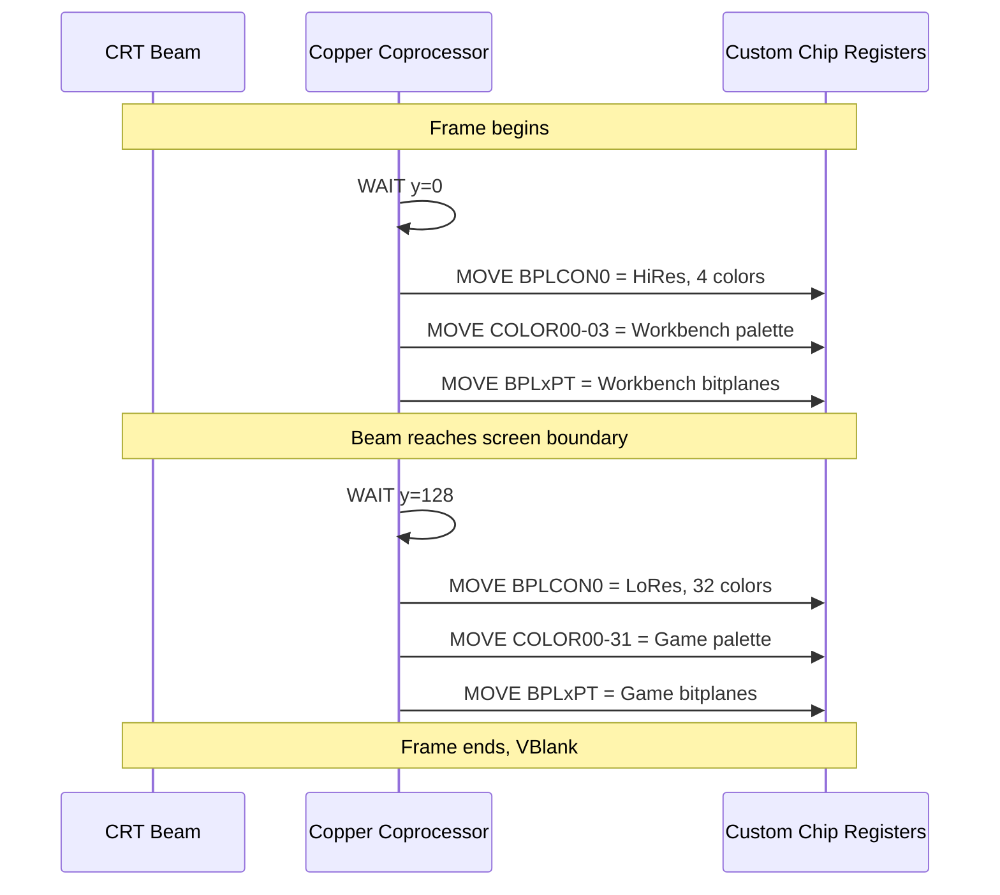
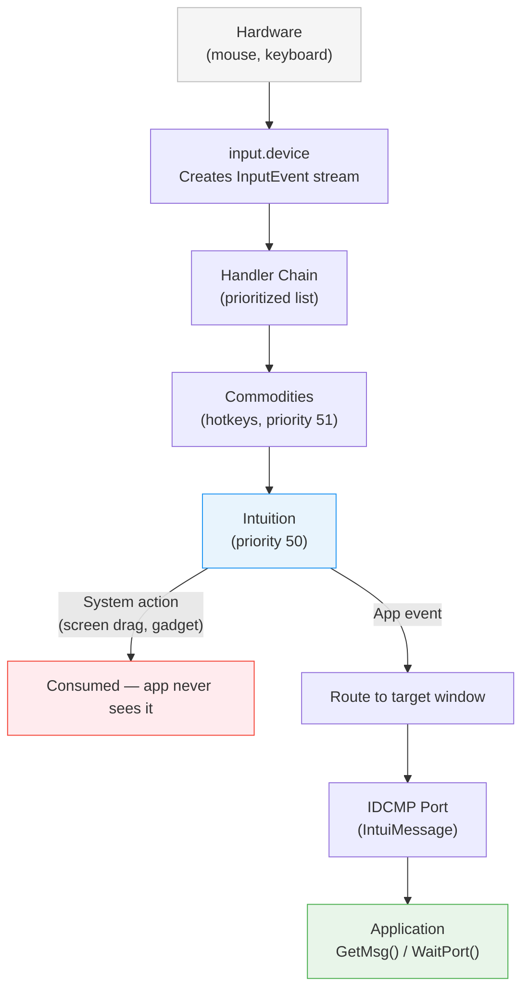

[← Home](../README.md) · [Intuition](README.md)

# Screens

## Overview

An Amiga **Screen** is a complete, independent display context. Each screen owns its own `ViewPort`, `BitMap`, color palette, resolution, and refresh rate. Unlike modern desktops where all applications share a single framebuffer, the Amiga allows **multiple screens with different resolutions and color depths to coexist simultaneously** — and the user can drag them up and down to reveal each other in real time.

This is one of the defining features of the Amiga. No other mainstream personal computer of the 1985–1995 era offered anything comparable.

---

## How Screens Work — The Copper Connection

The hardware trick that makes Amiga screens possible is the **[Copper](../08_graphics/copper.md)** (coprocessor), a DMA-driven programmable sequencer inside the Agnus/Alice chip. The Copper executes a list of instructions synchronized to the CRT electron beam position (see also: [Copper Programming](../08_graphics/copper_programming.md), [OCS Copper](../01_hardware/ocs_a500/copper.md), [AGA Copper](../01_hardware/aga_a1200_a4000/aga_copper.md)):

| Instruction | Action |
|---|---|
| **WAIT** | Pause until the beam reaches a specific `(x, y)` position |
| **MOVE** | Write a value to a custom chip register (palette, bitplane pointers, resolution) |
| **SKIP** | Conditional branch based on beam position |

When multiple screens are open, Intuition builds a **Copper list** that changes display parameters at the scanline boundary between screens. The screen on top uses one set of registers (resolution, palette, bitplane pointers), and when the beam crosses into the next screen's area, the Copper switches registers mid-frame. This is why:

- A 640×256 4-color Workbench screen can sit above a 320×256 32-color game screen
- Dragging a screen changes the Copper's `WAIT` coordinates — the boundary moves in real time
- There is **zero CPU cost** for maintaining multiple screens — the Copper handles it via DMA



---

## Screen Types

| Type | Constant | Description |
|---|---|---|
| **Workbench** | `WBENCHSCREEN` | The default desktop screen — always exists while Workbench is running |
| **Custom** | `CUSTOMSCREEN` | Application-owned, private screen — only the creating program uses it |
| **Public** | `PUBLICSCREEN` | Named screen that any application can open windows on |

### Workbench Screen

The Workbench screen is the system's home screen. It defaults to the user's configured resolution (typically HiRes 640×256 PAL or 640×200 NTSC with 4 colors). Users can change the Workbench screen mode through the **ScreenMode** Preferences editor.

### Custom Screens

Applications that need specific display characteristics — games, paint programs, video editors — open their own custom screen. The application controls the resolution, depth, palette, and lifetime. Only that application's windows appear on it.

### Public Screens

Introduced in AmigaOS 2.0, public screens solve the memory waste of every application opening its own screen. An application can:

1. Open a screen and register it with a name (`SA_PubName`)
2. Other applications can discover and open windows on it via `LockPubScreen()`
3. The Workbench screen itself is the default public screen

---

## Display Modes and Resolutions

### Chipset Generations

| Chipset | Era | Machines | Key Display Features |
|---|---|---|---|
| **OCS** | 1985 | A1000, A500, A2000 | LoRes/HiRes, 32 colors from 4,096 (12-bit), HAM, EHB |
| **ECS** | 1990 | A500+, A600, A3000 | + SuperHires, Productivity mode (31kHz VGA), improved genlock |
| **AGA** | 1992 | A1200, A4000, CD32 | 256 colors from 16.7M (24-bit), HAM-8, mode promotion |
| **RTG** | 1994+ | Zorro/PCI cards | True-color (16/24/32-bit), arbitrary resolutions via CyberGraphX / Picasso96 |

### Native Resolution Table

| Mode | NTSC (60 Hz) | PAL (50 Hz) | Bitplanes | Colors |
|---|---|---|---|---|
| **LoRes** | 320 × 200 | 320 × 256 | 1–5 | 2–32 |
| **LoRes Interlaced** | 320 × 400 | 320 × 512 | 1–5 | 2–32 |
| **HiRes** | 640 × 200 | 640 × 256 | 1–4 | 2–16 |
| **HiRes Interlaced** | 640 × 400 | 640 × 512 | 1–4 | 2–16 |
| **SuperHires** (ECS+) | 1280 × 200 | 1280 × 256 | 1–2 | 2–4 |
| **SuperHires Interlaced** (ECS+) | 1280 × 400 | 1280 × 512 | 1–2 | 2–4 |
| **Productivity** (ECS+) | 640 × 480 | 640 × 480 | 1–4 | 2–16 |
| **AGA LoRes** | 320 × 200 | 320 × 256 | 1–8 | 2–256 |
| **AGA HiRes** | 640 × 200 | 640 × 256 | 1–8 | 2–256 |

### Special Modes

| Mode | Description |
|---|---|
| **HAM** (Hold-And-Modify) | OCS/ECS: displays all 4,096 colors. Each pixel modifies one RGB component of its neighbor |
| **HAM-8** | AGA: displays ~262,000 colors simultaneously using 8 bitplanes |
| **EHB** (Extra Half-Brite) | 64 colors — 32 programmer-defined + 32 at half brightness |
| **DBLPAL / DBLNTSC** | AGA doubled scan rates for flicker-free interlaced-resolution output |

### Display IDs

The graphics library maintains a **display database**. Each mode is identified by a 32-bit **Display ID** (also called ModeID):

```c
/* Common Display IDs from <graphics/displayinfo.h> */
#define LORES_KEY           0x00000000
#define HIRES_KEY           0x00008000
#define SUPER_KEY           0x00008020
#define HAM_KEY             0x00000800
#define LORESLACE_KEY       0x00000004
#define HIRESLACE_KEY       0x00008004
#define SUPERLACE_KEY       0x00008024
#define LORESDPF_KEY        0x00000400   /* Dual Playfield */

/* PAL variants add PAL_MONITOR_ID (0x00021000) */
#define PAL_MONITOR_ID      0x00021000
```

Applications query available modes with `NextDisplayInfo()` and `GetDisplayInfoData()`. The ScreenMode preferences editor lets users browse all available modes.

### RTG — Breaking Free of Native Hardware

With graphics cards (Picasso II, CyberVision 64, etc.), RTG libraries (CyberGraphX, Picasso96) register additional Display IDs. These enable:

- **Arbitrary resolutions**: 800×600, 1024×768, 1280×1024, etc.
- **True color**: 15-bit, 16-bit, 24-bit, 32-bit
- **No Copper involvement** — the graphics card has its own framebuffer
- Applications using standard `OpenScreenTags()` with an RTG DisplayID work transparently

```c
/* Open an 800x600 16-bit screen on a graphics card */
struct Screen *scr = OpenScreenTags(NULL,
    SA_Width,     800,
    SA_Height,    600,
    SA_Depth,     16,
    SA_DisplayID, 0x50041000,   /* Picasso96 mode ID */
    SA_Title,     "RTG Screen",
    SA_Type,      CUSTOMSCREEN,
    SA_Pens,      (ULONG)~0,
    TAG_DONE);
```

---

## Screen Dragging — User Interaction

### How It Works

Every screen has a **drag bar** (the title bar area). The user clicks and drags it to slide the screen vertically:

- **Drag down** — reveals the screen behind it
- **Drag up** — hides the screen behind it
- **Left-Amiga + mouse drag** — drags even if the title bar is obscured by windows

When the user drags, Intuition updates the Copper list's `WAIT` coordinates in real time. The "seam" between two screens moves smoothly without any redrawing — the bitplanes never change, only the vertical offset in the display list changes.

### Screen Depth Arrangement

| Action | Keyboard Shortcut | Effect |
|---|---|---|
| Screen to front | Left-Amiga + M (or depth gadget) | Moves screen to top of stack |
| Screen to back | Left-Amiga + N (or depth gadget) | Moves screen to bottom of stack |
| Drag screen | Left-Amiga + mouse drag | Slides screen vertically |

### Real-World Usage Patterns

**Pattern 1: Workbench + Game**

The most common Amiga experience. The user launches a game that opens a 320×256 32-color custom screen. The Workbench (640×256 4-color) sits behind it. The user can drag the game screen down to check the Workbench clock, read a README in a shell, or access a file manager — while the game continues running.

**Pattern 2: Productivity Multi-Screen**

A developer in 1994 might have:
- Screen 1: **CygnusEd** (text editor) on HiRes 640×512 interlaced, 8 colors
- Screen 2: **Deluxe Paint** on LoRes 320×256, 32 colors
- Screen 3: **Workbench** with shell windows, file manager

Each screen has exactly the resolution and color depth it needs. Dragging between them is instant.

**Pattern 3: Video Production**

Amiga video professionals (Babylon 5, MTV, Weather Channel) routinely used:
- A **genlock** screen for video overlay compositing
- A **HAM** screen in Deluxe Paint for photorealistic image editing
- The Workbench screen for file management

All three coexist and are draggable.

**Pattern 4: Public Screen Sharing**

An email client (YAM) opens a MUI public screen. The user configures their address book, text editor, and web browser (IBrowse) to all open windows on the same public screen — sharing a single set of bitplanes instead of each application consuming ~300 KB for its own screen.

---

## Opening a Screen (OS 2.0+ TagList)

```c
struct Screen *scr = OpenScreenTags(NULL,
    SA_Width,       640,
    SA_Height,      256,
    SA_Depth,       4,           /* 16 colors */
    SA_DisplayID,   HIRES_KEY,
    SA_Title,       "My Screen",
    SA_ShowTitle,   TRUE,
    SA_Type,        CUSTOMSCREEN,
    SA_Pens,        (ULONG)~0,  /* use 3D pen defaults */
    SA_Font,        &topaz8,
    TAG_DONE);
```

### Common SA_ Tags

| Tag | Type | Description |
|---|---|---|
| `SA_Width`, `SA_Height` | `UWORD` | Screen dimensions in pixels |
| `SA_Depth` | `UWORD` | Bitplane count (1–8 native, 15/16/24 RTG) |
| `SA_DisplayID` | `ULONG` | ModeID from display database |
| `SA_Title` | `STRPTR` | Title bar text |
| `SA_ShowTitle` | `BOOL` | Show/hide title bar |
| `SA_Type` | `UWORD` | `CUSTOMSCREEN`, `PUBLICSCREEN` |
| `SA_Behind` | `BOOL` | Open behind other screens |
| `SA_Quiet` | `BOOL` | No title bar at all |
| `SA_AutoScroll` | `BOOL` | Allow autoscrolling when screen > display |
| `SA_Overscan` | `ULONG` | `OSCAN_TEXT`, `OSCAN_STANDARD`, `OSCAN_MAX`, `OSCAN_VIDEO` |
| `SA_Pens` | `UWORD *` | DrawInfo pen array for 3D look (terminate with `~0`) |
| `SA_Interleaved` | `BOOL` | Use interleaved bitmap (better blitter performance) |
| `SA_Colors32` | `ULONG *` | 32-bit RGB color palette (AGA/RTG) |
| `SA_PubName` | `STRPTR` | Public screen name for `LockPubScreen()` |
| `SA_Font` | `struct TextAttr *` | Screen default font |
| `SA_SysFont` | `UWORD` | Use system default font (0 = fixed, 1 = proportional) |
| `SA_MinimizeISG` | `BOOL` | Minimize inter-screen gap during dragging |

### Overscan Modes

| Constant | Description |
|---|---|
| `OSCAN_TEXT` | Maximum area that can display text clearly |
| `OSCAN_STANDARD` | Default overscan — fits most monitors |
| `OSCAN_MAX` | Maximum hardware overscan — may clip on some monitors |
| `OSCAN_VIDEO` | Full video overscan for broadcast/genlock use |

---

## Closing a Screen

```c
/* All windows on this screen must be closed first! */
if (CloseScreen(scr))
{
    /* Screen closed successfully */
}
else
{
    /* Failed — a window is still open on this screen,
       or another application has locked it */
}
```

For public screens, you must also call `PubScreenStatus(scr, PSNF_PRIVATE)` before closing to prevent new windows from opening on it.

---

## Public Screens

```c
/* === Creating a public screen === */
struct Screen *pub = OpenScreenTags(NULL,
    SA_Type,      PUBLICSCREEN,
    SA_PubName,   "MYAPP",
    SA_Title,     "My Application Screen",
    SA_Depth,     4,
    SA_DisplayID, HIRES_KEY,
    SA_Pens,      (ULONG)~0,
    TAG_DONE);

/* Make it visible to other applications */
PubScreenStatus(pub, 0);

/* === Opening a window on someone else's public screen === */
struct Screen *found = LockPubScreen("MYAPP");
if (found)
{
    struct Window *win = OpenWindowTags(NULL,
        WA_PubScreen,  found,
        WA_Title,      "Guest Window on MYAPP",
        WA_InnerWidth, 300,
        WA_InnerHeight, 200,
        TAG_DONE);

    UnlockPubScreen(NULL, found);

    /* ... use window ... */

    CloseWindow(win);
}
```

### Default Public Screen

If `LockPubScreen(NULL)` is called with a `NULL` name, it returns the **default public screen** — normally the Workbench screen. Applications that don't need their own screen should open windows on the default public screen:

```c
struct Screen *wb = LockPubScreen(NULL);  /* Get Workbench */
/* open windows on wb */
UnlockPubScreen(NULL, wb);
```

---

## Screen Data Structures

### Key Fields of `struct Screen`

| Field | Type | Description |
|---|---|---|
| `LeftEdge`, `TopEdge` | `WORD` | Screen position (TopEdge changes during dragging) |
| `Width`, `Height` | `WORD` | Screen dimensions |
| `RastPort` | `struct RastPort` | Drawing context for the screen |
| `BitMap` | `struct BitMap *` | The screen's bitmap (bitplanes) |
| `ViewPort` | `struct ViewPort` | Display configuration (mode, colors) |
| `Title` | `UBYTE *` | Title bar string |
| `Font` | `struct TextFont *` | Default font |
| `FirstWindow` | `struct Window *` | Linked list of windows on this screen |

### Querying Screen Properties

```c
/* Get DrawInfo for 3D pen colors */
struct DrawInfo *dri = GetScreenDrawInfo(scr);
ULONG textpen  = dri->dri_Pens[TEXTPEN];
ULONG shinepen = dri->dri_Pens[SHINEPEN];
ULONG shadowpen = dri->dri_Pens[SHADOWPEN];
/* ... */
FreeScreenDrawInfo(scr, dri);
```

---

## Input Event Routing

Understanding how mouse and keyboard events flow through the system is critical when working with multiple screens.

### The Input Pipeline



### How It Works

1. **`input.device`** gathers raw hardware events (mouse position, button state, key scancodes) and packages them as `InputEvent` structures
2. Events pass through a **prioritized handler chain** — each handler can consume, modify, or pass events
3. **Intuition** sits at priority 50. It intercepts system-level actions:
   - Screen dragging (Left-Amiga + mouse)
   - Window depth/sizing/closing gadgets
   - Menu activation (right mouse button)
4. Events that Intuition doesn't consume are routed to the **active window** based on mouse position
5. The window only receives events matching its **IDCMP flags** — everything else is dropped

### IDCMP — Intuition Direct Communication Message Port

Each window specifies which events it wants via IDCMP flags at creation time:

```c
struct Window *win = OpenWindowTags(NULL,
    WA_IDCMP, IDCMP_MOUSEBUTTONS | IDCMP_RAWKEY |
              IDCMP_GADGETUP | IDCMP_CLOSEWINDOW |
              IDCMP_CHANGEWINDOW,
    /* ... */
    TAG_DONE);
```

| IDCMP Flag | Event |
|---|---|
| `IDCMP_MOUSEBUTTONS` | Mouse button press/release |
| `IDCMP_MOUSEMOVE` | Mouse position changes (high bandwidth — use sparingly) |
| `IDCMP_RAWKEY` | Raw keyboard scancodes |
| `IDCMP_VANILLAKEY` | Translated ASCII characters |
| `IDCMP_GADGETUP/DOWN` | Gadget interaction |
| `IDCMP_CLOSEWINDOW` | User clicked close gadget |
| `IDCMP_CHANGEWINDOW` | Window moved, resized, or screen changed |
| `IDCMP_ACTIVEWINDOW` | This window became the active window |
| `IDCMP_INACTIVEWINDOW` | This window lost focus |
| `IDCMP_SCREENPOSITION` | Screen was dragged (OS 3.0+) |

### Events During Screen Dragging

When the user drags a screen (Left-Amiga + mouse select), **Intuition consumes the input entirely**:

- The application does **not** receive `IDCMP_MOUSEBUTTONS` for the select-down
- The application does **not** receive `IDCMP_MOUSEMOVE` during the drag
- If the window has `IDCMP_CHANGEWINDOW` set, it receives a notification **after** the drag completes
- `IDCMP_SCREENPOSITION` (OS 3.0+) notifies windows that their screen moved — useful for applications that cache screen coordinates

### Keyboard Shortcuts and Screen Control

Intuition intercepts certain key combinations before applications see them:

| Shortcut | Action | Consumed by |
|---|---|---|
| Left-Amiga + M | Screen to front | Intuition |
| Left-Amiga + N | Screen to back | Intuition |
| Left-Amiga + mouse drag | Drag screen vertically | Intuition |
| Left-Amiga + left/right | Cycle between screens | Intuition (OS 3.0+) |
| Right-Amiga + keys | Application shortcuts | Application (via `IDCMP_RAWKEY`) |

> **Key insight**: Left-Amiga combinations are reserved for system use. Applications should use Right-Amiga for their own shortcuts to avoid conflicts.

### Event Routing Across Screens

When multiple screens are visible, mouse events are routed to the **frontmost screen under the pointer**:

- If the pointer is in the visible area of Screen A, events go to Screen A's active window
- If the user drags Screen A down and the pointer enters Screen B's visible area, events switch to Screen B
- Keyboard events always go to the **active window on the active screen**, regardless of pointer position

---

## Pitfalls and Hazards

### 1. CloseScreen Deadlock

`CloseScreen()` will **fail silently** if any window is still open on the screen:

```c
/* WRONG — will fail if visitor windows exist */
CloseScreen(myScreen);

/* RIGHT — check for visitor windows first */
if (!CloseScreen(myScreen))
{
    /* Screen still has open windows!
       Either wait, or set PSNF_PRIVATE to block new visitors */
    PubScreenStatus(myScreen, PSNF_PRIVATE);
    /* Try again after all visitors close */
}
```

For public screens, always transition to `PSNF_PRIVATE` before attempting to close.

### 2. IDCMP Message Leak

Every `IntuiMessage` received via `GetMsg()` **must** be replied with `ReplyMsg()`. Failure to reply causes:

- Intuition's message pool to fill up
- Eventually, the system hangs — Intuition blocks waiting for message slots

```c
/* WRONG — message leak */
struct IntuiMessage *msg = (struct IntuiMessage *)GetMsg(win->UserPort);
ULONG class = msg->Class;
/* forgot ReplyMsg! */

/* RIGHT — always reply */
struct IntuiMessage *msg;
while (msg = (struct IntuiMessage *)GetMsg(win->UserPort))
{
    ULONG class = msg->Class;
    UWORD code  = msg->Code;
    ReplyMsg((struct Message *)msg);  /* Reply BEFORE processing */
    
    switch(class) { /* ... */ }
}
```

### 3. Layer Lock Deadlock

Never call Intuition functions while holding a layer lock:

```c
/* DEADLOCK — Intuition needs the layer lock internally */
LockLayerInfo(&scr->LayerInfo);
OpenWindow(...);    /* Intuition tries to lock the same LayerInfo → deadlock */
```

### 4. Screen Pointer Invalidation

Screen pointers can become invalid during iconification or if another process closes the screen:

```c
/* HAZARD — cached screen pointer may be stale */
struct Screen *scr = LockPubScreen("MYAPP");
UnlockPubScreen(NULL, scr);
/* ... time passes ... */
/* scr may no longer be valid! */

/* SAFE — re-lock when needed */
struct Screen *scr = LockPubScreen("MYAPP");
if (scr)
{
    /* use scr */
    UnlockPubScreen(NULL, scr);
}
```

### 5. Interlaced Flicker

Interlaced modes (400/512 vertical lines) flicker badly on CRT monitors when adjacent lines have high contrast. Mitigation:

- Use a **flicker fixer** (hardware scan doubler) like the A3000's built-in deinterlacer
- Avoid pure black/white adjacent lines in interlaced UIs
- **AGA mode promotion** can convert interlaced modes to flicker-free doubled-scan output on VGA monitors

### 6. MOUSEMOVE Flooding

Requesting `IDCMP_MOUSEMOVE` generates an event for **every pixel** the mouse moves. This can overwhelm slow applications:

```c
/* Use IDCMP_INTUITICKS instead for periodic polling */
WA_IDCMP, IDCMP_INTUITICKS,  /* ~10 Hz timer, much lighter */

/* Or use WFLG_REPORTMOUSE only on specific gadgets */
```

### 7. Hardcoded Display IDs

Never hardcode Display IDs for screen modes. The user's hardware determines available modes:

```c
/* WRONG — assumes PAL HiRes exists */
SA_DisplayID, 0x00029000,

/* RIGHT — query the display database */
ULONG modeID = BestModeID(
    BIDTAG_NominalWidth,  640,
    BIDTAG_NominalHeight, 256,
    BIDTAG_Depth,         4,
    TAG_DONE);

if (modeID != INVALID_ID)
    SA_DisplayID, modeID,
```

---

## Best Practices

1. **Prefer public screens** over custom screens — saves memory and lets users consolidate
2. **Always use `SA_Pens`** with `(ULONG)~0` to get proper 3D look under OS 2.0+
3. **Query the display database** with `BestModeID()` rather than hardcoding resolutions
4. **Handle `CloseScreen()` failure** — visitor windows may still be open
5. **Use `SA_AutoScroll`** for screens larger than the display — common for interlaced DTP work
6. **Lock/Unlock public screens properly** — `LockPubScreen()` prevents the screen from closing while you reference it
7. **Reply all IDCMP messages** — even during shutdown; drain the port before closing windows
8. **Never hold layer locks** while calling Intuition functions
9. **Use Right-Amiga** for application shortcuts — Left-Amiga is reserved for system use
10. **Test with multiple screens** at different resolutions to verify your input handling works correctly

---

## References

- NDK 3.9: `intuition/screens.h`, `intuition/intuition.h`
- ADCD 2.1: `OpenScreenTagList()`, `CloseScreen()`, `LockPubScreen()`, `PubScreenStatus()`
- AmigaOS Reference Manual (RKRM): Libraries, Chapter 3 — Intuition Screens
- AmigaOS Reference Manual (RKRM): Libraries, Chapter 5 — Intuition Input and IDCMP
- Hardware Reference Manual: Custom Chip Register Map, Copper List Programming
