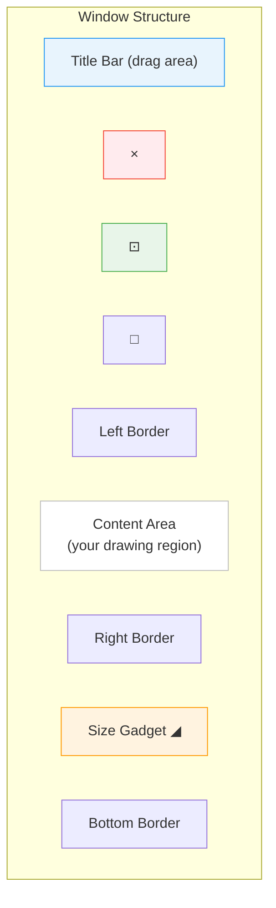
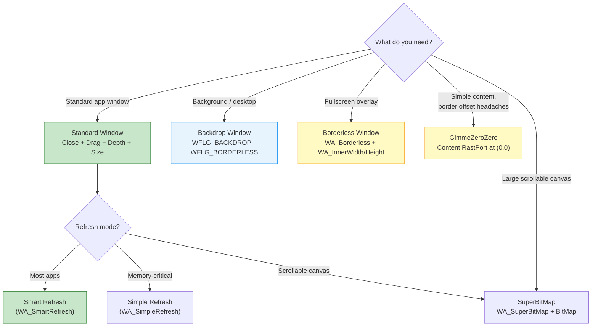

[← Home](../README.md) · [Intuition](README.md)

# Windows

## What Is a Window?

A window is Intuition's fundamental unit of user interaction. Every GUI element — gadgets, menus, text, graphics — lives inside a window. A window belongs to exactly one [screen](screens.md), receives user input through [IDCMP](idcmp.md), and is managed by the system's layered display architecture.

Unlike modern windowing systems where windows are heavyweight objects backed by compositor surfaces, Amiga windows are **lightweight wrappers around Layers** — the graphics.library's clipping and damage-tracking mechanism. This is why a 7 MHz 68000 can manage dozens of overlapping windows smoothly.

---

## Window Anatomy



| Element | System Gadget | Purpose |
|---|---|---|
| **Close** | `WFLG_CLOSEGADGET` | Sends `IDCMP_CLOSEWINDOW` |
| **Depth** | `WFLG_DEPTHGADGET` | Moves window front/back |
| **Zoom** | `WFLG_HASZOOM` (OS 2.0+) | Toggles between two sizes |
| **Drag Bar** | `WFLG_DRAGBAR` | User drags the window |
| **Size** | `WFLG_SIZEGADGET` | Resize handle (bottom-right) |
| **Borders** | Automatic | Visual frame; width depends on screen resolution |

---

## Opening a Window

### Modern Pattern (OS 2.0+ TagList)

```c
struct Window *win = OpenWindowTags(NULL,
    WA_Left,          100,
    WA_Top,           50,
    WA_InnerWidth,    400,       /* Content area width */
    WA_InnerHeight,   300,       /* Content area height */
    WA_Title,         "My Window",
    WA_ScreenTitle,   "Status bar text when this window is active",
    WA_IDCMP,         IDCMP_CLOSEWINDOW | IDCMP_GADGETUP |
                      IDCMP_RAWKEY | IDCMP_NEWSIZE,
    WA_Flags,         WFLG_CLOSEGADGET | WFLG_DRAGBAR |
                      WFLG_DEPTHGADGET | WFLG_SIZEGADGET |
                      WFLG_ACTIVATE | WFLG_SMART_REFRESH,
    WA_MinWidth,      200,
    WA_MinHeight,     100,
    WA_MaxWidth,      -1,        /* No maximum (screen width) */
    WA_MaxHeight,     -1,        /* No maximum (screen height) */
    WA_PubScreen,     NULL,      /* Default public screen (Workbench) */
    TAG_DONE);

if (!win) { /* Handle failure — screen may be locked or out of memory */ }
```

### Legacy Pattern (struct NewWindow)

```c
/* Pre-OS 2.0 — avoid in new code */
struct NewWindow nw = {
    100, 50, 400, 300,           /* Left, Top, Width, Height */
    0, 1,                        /* DetailPen, BlockPen */
    IDCMP_CLOSEWINDOW,           /* IDCMPFlags */
    WFLG_CLOSEGADGET | WFLG_DRAGBAR | WFLG_ACTIVATE,
    NULL, NULL,                  /* FirstGadget, CheckMark */
    "My Window",                 /* Title */
    NULL, NULL,                  /* Screen, BitMap */
    200, 100, -1, -1,            /* Min/Max Width/Height */
    WBENCHSCREEN                 /* Type */
};
struct Window *win = OpenWindow(&nw);
```

---

## Common WA_ Tags

### Position and Size

| Tag | Type | Description |
|---|---|---|
| `WA_Left`, `WA_Top` | `WORD` | Window position (outer edge) |
| `WA_Width`, `WA_Height` | `WORD` | Total window size (including borders) |
| `WA_InnerWidth`, `WA_InnerHeight` | `WORD` | Content area size (excluding borders) — preferred |
| `WA_MinWidth`, `WA_MinHeight` | `WORD` | Minimum resize dimensions |
| `WA_MaxWidth`, `WA_MaxHeight` | `WORD` | Maximum resize dimensions; `-1` = screen size |
| `WA_Zoom` | `WORD[4]` | Alternate position/size for zoom gadget |

### Appearance

| Tag | Type | Description |
|---|---|---|
| `WA_Title` | `STRPTR` | Title bar text |
| `WA_ScreenTitle` | `STRPTR` | Screen title shown when this window is active |
| `WA_Borderless` | `BOOL` | No borders or system gadgets |
| `WA_GimmeZeroZero` | `BOOL` | Inner content area starts at (0,0) — adds extra layer |
| `WA_NoCareRefresh` | `BOOL` | Ignore REFRESHWINDOW — Intuition handles it (may cause glitches) |

### Screen Placement

| Tag | Type | Description |
|---|---|---|
| `WA_PubScreen` | `struct Screen *` | Open on a public screen (`NULL` = default/Workbench) |
| `WA_CustomScreen` | `struct Screen *` | Open on a custom (private) screen |
| `WA_PubScreenName` | `STRPTR` | Open on named public screen; falls back to default |
| `WA_PubScreenFallBack` | `BOOL` | If named screen unavailable, use default |

### Behavior

| Tag | Type | Description |
|---|---|---|
| `WA_Activate` | `BOOL` | Window becomes active immediately on open |
| `WA_Backdrop` | `BOOL` | Always stays behind all normal windows |
| `WA_SmartRefresh` | `BOOL` | Intuition saves obscured content automatically |
| `WA_SimpleRefresh` | `BOOL` | Application must redraw on expose (less memory) |
| `WA_SuperBitMap` | `struct BitMap *` | Application provides full off-screen buffer |
| `WA_AutoAdjust` | `BOOL` | Auto-adjust position/size to fit screen |
| `WA_NewLookMenus` | `BOOL` | OS 3.0+ 3D menu appearance |

---

## Refresh Modes

How Intuition handles window content when areas are obscured and then revealed:

| Mode | Flag | Memory Cost | App Responsibility | Best For |
|---|---|---|---|---|
| **Simple Refresh** | `WFLG_SIMPLE_REFRESH` | Lowest | Must handle `IDCMP_REFRESHWINDOW` — redraw exposed areas | Text editors, games (redraw every frame anyway) |
| **Smart Refresh** | `WFLG_SMART_REFRESH` | Medium | Intuition saves/restores obscured areas automatically | Most applications — recommended default |
| **SuperBitMap** | `WFLG_SUPER_BITMAP` | Highest | Application provides full-size `BitMap`; Intuition copies from it | CAD, paint programs with large canvases |

### Simple Refresh Handler

```c
case IDCMP_REFRESHWINDOW:
    BeginRefresh(win);
    /* Redraw only the damaged region — clipping is set automatically */
    RedrawWindowContents(win);
    EndRefresh(win, TRUE);   /* TRUE = damage fully repaired */
    break;
```

### Smart Refresh Memory Cost

Smart Refresh allocates off-screen buffers proportional to the **obscured area**. If a 640×400 window is 50% covered by other windows, Smart Refresh consumes ~128 KB (at 4 bitplanes). On a 512 KB A500, this is significant.

---

## Window Types

### Standard Window

The default — has borders, title bar, and system gadgets:

```c
WA_Flags, WFLG_CLOSEGADGET | WFLG_DRAGBAR |
          WFLG_DEPTHGADGET | WFLG_SIZEGADGET | WFLG_ACTIVATE,
```

### Backdrop Window

Stays behind all other windows. Commonly used for:
- Desktop manager backgrounds
- Full-screen applications that want to coexist with Workbench windows

```c
WA_Flags,      WFLG_BACKDROP | WFLG_BORDERLESS | WFLG_ACTIVATE,
WA_IDCMP,      IDCMP_MOUSEBUTTONS | IDCMP_RAWKEY,
```

### Borderless Window

No system gadgets or decorations — the application draws everything:

```c
WA_Borderless, TRUE,
WA_Flags,      WFLG_ACTIVATE | WFLG_RMBTRAP,  /* Trap right-click too */
```

### GimmeZeroZero Window

Creates a separate layer for window borders. The content area's `RastPort` starts at (0,0) regardless of border width:

```c
WA_Flags, WFLG_GIMMEZEROZERO | WFLG_CLOSEGADGET | WFLG_DRAGBAR,
```

**Trade-off**: Uses an extra layer (memory + blitter operations) but simplifies rendering code since you don't need to account for border offsets.

### Sizing Constraints

```c
WA_MinWidth,   200,
WA_MinHeight,  100,
WA_MaxWidth,   -1,      /* Screen width */
WA_MaxHeight,  -1,      /* Screen height */
WA_SizeGadget, TRUE,
WA_SizeBRight, TRUE,    /* Size gadget on right border */
WA_SizeBBottom, TRUE,   /* Size gadget on bottom border */
```

---

## Window Coordinates

### Border Offsets

The content area does NOT start at (0,0) in a normal window. You must account for borders:

```c
WORD contentLeft   = win->BorderLeft;
WORD contentTop    = win->BorderTop;
WORD contentWidth  = win->Width - win->BorderLeft - win->BorderRight;
WORD contentHeight = win->Height - win->BorderTop - win->BorderBottom;

/* Draw at content origin */
Move(win->RPort, contentLeft, contentTop + baseline);
Text(win->RPort, "Hello", 5);
```

With `WFLG_GIMMEZEROZERO`, the window provides a separate `GZZWidth`/`GZZHeight` and a content `RastPort` where (0,0) is the content origin.

---

## Closing a Window

### Simple Case

```c
CloseWindow(win);
```

### Safe Shutdown (Drain Messages First)

```c
/* Drain any pending IDCMP messages */
struct IntuiMessage *msg;
while ((msg = (struct IntuiMessage *)GetMsg(win->UserPort)))
    ReplyMsg((struct Message *)msg);

CloseWindow(win);
```

### With Shared Port

See [IDCMP — Multi-Window Shared Port](idcmp.md#multi-window-shared-port) for the full `Forbid()`/strip/detach protocol.

---

## Modifying a Window

### Move and Resize

```c
MoveWindow(win, deltaX, deltaY);           /* Relative move */
SizeWindow(win, deltaWidth, deltaHeight);  /* Relative resize */
ChangeWindowBox(win, left, top, w, h);     /* Absolute reposition + resize */
WindowToFront(win);
WindowToBack(win);
ActivateWindow(win);
```

### Change Title

```c
SetWindowTitles(win, "New Title", "New Screen Title");
/* Pass (UBYTE *)-1 to leave unchanged */
SetWindowTitles(win, "New Title", (UBYTE *)-1);
```

### Busy Pointer

```c
/* OS 3.0+ — show busy pointer */
SetWindowPointer(win, WA_BusyPointer, TRUE, TAG_DONE);

/* Restore normal pointer */
SetWindowPointer(win, WA_Pointer, NULL, TAG_DONE);
```

---

## struct Window — Key Fields

| Field | Type | Description |
|---|---|---|
| `LeftEdge`, `TopEdge` | `WORD` | Position on screen |
| `Width`, `Height` | `WORD` | Total size (including borders) |
| `BorderLeft/Right/Top/Bottom` | `BYTE` | Border thickness (pixels) |
| `RPort` | `struct RastPort *` | Drawing context for this window |
| `UserPort` | `struct MsgPort *` | IDCMP message port |
| `IDCMPFlags` | `ULONG` | Currently active IDCMP flags |
| `Flags` | `ULONG` | Window flags (`WFLG_*`) |
| `Title` | `UBYTE *` | Title string |
| `WScreen` | `struct Screen *` | Screen this window belongs to |
| `FirstGadget` | `struct Gadget *` | Head of gadget list |
| `MouseX`, `MouseY` | `WORD` | Current mouse position (relative to window) |
| `GZZWidth`, `GZZHeight` | `WORD` | Inner dimensions (GimmeZeroZero only) |
| `MinWidth/Height`, `MaxWidth/Height` | `WORD` | Size constraints |

---

## Pitfalls

### 1. Using WA_Width Instead of WA_InnerWidth

`WA_Width` includes borders. On different screen resolutions, border width varies. Always use `WA_InnerWidth`/`WA_InnerHeight` for predictable content area sizing.

### 2. Drawing Outside Content Area

Drawing at (0,0) in a non-GZZ window overwrites the border:
```c
/* WRONG — draws over title bar */
Move(win->RPort, 0, 10);

/* CORRECT — offset by borders */
Move(win->RPort, win->BorderLeft, win->BorderTop + 10);
```

### 3. Forgetting MinWidth/MinHeight

Without size constraints, users can resize the window to 1×1 pixel, causing division-by-zero in layout code.

### 4. Not Handling NEWSIZE

If your window is resizable, you must redraw content when `IDCMP_NEWSIZE` arrives — the old content is clipped or garbage.

### 5. Opening on a Closed Screen

If you cache a screen pointer and it becomes invalid, `OpenWindowTags()` will crash. Always `LockPubScreen()` → open window → `UnlockPubScreen()`.

---

## Best Practices

1. **Use `WA_InnerWidth`/`WA_InnerHeight`** for predictable content dimensions
2. **Use Smart Refresh** unless you have a specific reason not to
3. **Always set `WA_MinWidth`/`WA_MinHeight`** for resizable windows
4. **Handle `IDCMP_NEWSIZE`** — recalculate and redraw layout
5. **Use `WA_PubScreen, NULL`** to open on the default public screen
6. **Drain IDCMP messages** before calling `CloseWindow()`
7. **Show a busy pointer** during long operations — it prevents user confusion
8. **Use `WA_AutoAdjust, TRUE`** to handle cases where the window doesn't fit the screen
9. **Use `WA_NewLookMenus, TRUE`** on OS 3.0+ for consistent 3D appearance
10. **Never modify `struct Window` fields directly** — use the API functions
11. **Lock the screen before opening a window** — `LockPubScreen(NULL)` prevents the screen from closing mid-open
12. **Handle `IDCMP_CLOSEWINDOW` immediately** — don't defer shutdown if user expectations are involved

---

## Named Antipatterns

### "The Border Collision" — Drawing at (0,0) in a Normal Window

```c
/* BAD: (0,0) is the top-left corner of the BORDER, not the content area.
   This overwrites the title bar and close gadget. */
Move(win->RPort, 0, 0);
RectFill(win->RPort, 0, 0, 100, 50);
```

```c
/* CORRECT: Offset all drawing by the border widths */
WORD x0 = win->BorderLeft;
WORD y0 = win->BorderTop;
Move(win->RPort, x0, y0);
RectFill(win->RPort, x0, y0, x0 + 100, y0 + 50);
```

> [!TIP]
> If you find yourself adding border offsets everywhere, consider `WFLG_GIMMEZEROZERO` — the content RastPort starts at (0,0). But it costs an extra layer.

### "The Unresponsive Close" — Ignoring IDCMP_CLOSEWINDOW

```c
/* BAD: No handler for IDCMP_CLOSEWINDOW — clicking close does nothing.
   The user thinks the application is frozen. */
ULONG signals = Wait(1L << win->UserPort->mp_SigBit);
struct IntuiMessage *msg;
while ((msg = (struct IntuiMessage *)GetMsg(win->UserPort)))
{
    /* Handle gadgets, keys, but NO close event... */
    ReplyMsg((struct Message *)msg);
}
/* Window never closes. User is stuck. */
```

```c
/* CORRECT: Always handle IDCMP_CLOSEWINDOW */
while ((msg = (struct IntuiMessage *)GetMsg(win->UserPort)))
{
    ULONG class = msg->Class;
    ReplyMsg((struct Message *)msg);  /* reply FIRST */

    switch (class)
    {
        case IDCMP_CLOSEWINDOW:
            running = FALSE;  /* exit the event loop */
            break;
        case IDCMP_GADGETUP:
            /* ... handle gadget ... */
            break;
    }
}
```

### "The Leaked Message" — Accessing IntuiMessage After ReplyMsg

```c
/* BAD: Reading fields from the message AFTER replying.
   ReplyMsg() may free the message immediately — the pointer is stale. */
struct IntuiMessage *msg = (struct IntuiMessage *)GetMsg(win->UserPort);
ReplyMsg((struct Message *)msg);  /* may invalidate msg */
UWORD code = msg->Code;  /* UNDEFINED BEHAVIOR — msg may be freed */
APTR iaddr = msg->IAddress;  /* ALSO DANGEROUS */
```

```c
/* CORRECT: Copy what you need BEFORE replying */
struct IntuiMessage *msg = (struct IntuiMessage *)GetMsg(win->UserPort);
ULONG class = msg->Class;
UWORD code = msg->Code;
APTR iaddr = msg->IAddress;
WORD mouseX = msg->MouseX;
WORD mouseY = msg->MouseY;
ReplyMsg((struct Message *)msg);  /* NOW it's safe to reply */

/* Use the saved copies */
```

### "The Refresh Loop" — Drawing Outside BeginRefresh/EndRefresh

```c
/* BAD: Drawing on every REFRESHWINDOW without BeginRefresh().
   Drawing into the full layer (not just damaged areas) causes NEW damage,
   which triggers another REFRESHWINDOW, which draws again... infinite loop. */
case IDCMP_REFRESHWINDOW:
    RedrawEverything(win);  /* redraws entire window, causes new damage */
    break;
```

```c
/* CORRECT: Scope the redraw to damaged regions only */
case IDCMP_REFRESHWINDOW:
    BeginRefresh(win);
    RedrawEverything(win);  /* ClipRects restricted to damaged areas */
    EndRefresh(win, TRUE);  /* TRUE = fully repaired, clear damage list */
    break;
```

### "The Phantom Window" — Using a Screen Pointer After It Closes

```c
/* BAD: Caching a screen pointer between operations.
   Another application can close the screen between your cache and use. */
struct Screen *screen = LockPubScreen(NULL);
UnlockPubScreen(NULL, screen);
/* ... later ... */
OpenWindowTags(NULL, WA_PubScreen, screen, TAG_DONE);  /* screen may be gone! */
```

```c
/* CORRECT: Lock, open, unlock — all in sequence */
struct Screen *screen = LockPubScreen(NULL);
if (screen) {
    struct Window *win = OpenWindowTags(NULL,
        WA_PubScreen, screen,
        WA_InnerWidth, 400,
        WA_InnerHeight, 300,
        TAG_DONE);
    UnlockPubScreen(NULL, screen);
    /* win is now valid — Intuition holds its own reference to the screen */
}
```

---

## Window Type Decision Guide



---

## Practical Cookbooks

### Cookbook: Resizable Window with Proper Relayout

```c
#include <proto/exec.h>
#include <proto/intuition.h>
#include <proto/graphics.h>
#include <intuition/intuition.h>

void RunResizableWindow(void)
{
    struct Screen *screen = LockPubScreen(NULL);
    if (!screen) return;

    struct Window *win = OpenWindowTags(NULL,
        WA_PubScreen,     screen,
        WA_InnerWidth,     400,
        WA_InnerHeight,    300,
        WA_Title,          "Resizable",
        WA_IDCMP,          IDCMP_CLOSEWINDOW | IDCMP_NEWSIZE |
                           IDCMP_REFRESHWINDOW,
        WA_Flags,          WFLG_CLOSEGADGET | WFLG_DRAGBAR |
                           WFLG_DEPTHGADGET | WFLG_SIZEGADGET |
                           WFLG_SMART_REFRESH | WFLG_ACTIVATE,
        WA_MinWidth,       200,
        WA_MinHeight,      100,
        WA_MaxWidth,       -1,
        WA_MaxHeight,      -1,
        TAG_DONE);
    UnlockPubScreen(NULL, screen);

    if (!win) return;

    BOOL running = TRUE;
    while (running)
    {
        ULONG sigs = Wait(1L << win->UserPort->mp_SigBit);
        struct IntuiMessage *msg;

        while ((msg = (struct IntuiMessage *)GetMsg(win->UserPort)))
        {
            ULONG class = msg->Class;
            ReplyMsg((struct Message *)msg);

            switch (class)
            {
                case IDCMP_CLOSEWINDOW:
                    running = FALSE;
                    break;

                case IDCMP_NEWSIZE:
                case IDCMP_REFRESHWINDOW:
                    if (class == IDCMP_REFRESHWINDOW)
                        BeginRefresh(win);

                    /* Recalculate layout and redraw */
                    {
                        WORD w = win->Width - win->BorderLeft - win->BorderRight;
                        WORD h = win->Height - win->BorderTop - win->BorderBottom;
                        SetRast(win->RPort, 0);  /* clear */
                        /* ... your layout code using w, h ... */
                    }

                    if (class == IDCMP_REFRESHWINDOW)
                        EndRefresh(win, TRUE);
                    break;
            }
        }
    }

    CloseWindow(win);
}
```

### Cookbook: Full-Screen Borderless Overlay

```c
/* Open a borderless window covering the entire screen —
   useful for games, demos, or presentations */
struct Screen *scr = LockPubScreen(NULL);
struct Window *overlay = OpenWindowTags(NULL,
    WA_PubScreen,     scr,
    WA_Left,           0,
    WA_Top,            0,
    WA_Width,          scr->Width,
    WA_Height,         scr->Height,
    WA_Borderless,     TRUE,
    WA_SimpleRefresh,  TRUE,
    WA_NoCareRefresh,  TRUE,
    WA_RMBTrap,        TRUE,    /* capture right-click (no menu bar) */
    WA_Activate,       TRUE,
    WA_IDCMP,          IDCMP_RAWKEY | IDCMP_MOUSEBUTTONS |
                       IDCMP_MOUSEMOVE,
    TAG_DONE);
UnlockPubScreen(NULL, scr);

/* Draw directly at (0,0) — no borders */
SetAPen(overlay->RPort, 1);
RectFill(overlay->RPort, 0, 0, scr->Width - 1, scr->Height - 1);
```

### Cookbook: Multi-Window Shared Message Port

```c
/* For applications with many windows, sharing one MsgPort is more
   efficient than creating a port per window.
   See idcmp.md for the full explanation. */

struct MsgPort *sharedPort = CreateMsgPort();

/* Window A */
struct Window *winA = OpenWindowTags(NULL,
    WA_Title,    "Window A",
    WA_InnerWidth,  300, WA_InnerHeight, 200,
    WA_Flags,    WFLG_CLOSEGADGET | WFLG_DRAGBAR | WFLG_ACTIVATE,
    WA_IDCMP,    IDCMP_CLOSEWINDOW | IDCMP_RAWKEY,
    TAG_DONE);

/* Window B */
struct Window *winB = OpenWindowTags(NULL,
    WA_Title,    "Window B",
    WA_InnerWidth,  300, WA_InnerHeight, 200,
    WA_Flags,    WFLG_CLOSEGADGET | WFLG_DRAGBAR,
    WA_IDCMP,    IDCMP_CLOSEWINDOW | IDCMP_RAWKEY,
    TAG_DONE);

/* Redirect both to the shared port */
winA->UserPort = sharedPort;
winB->UserPort = sharedPort;
ModifyIDCMP(winA, IDCMP_CLOSEWINDOW | IDCMP_RAWKEY);
ModifyIDCMP(winB, IDCMP_CLOSEWINDOW | IDCMP_RAWKEY);

/* Event loop processes both windows from one port */
BOOL running = TRUE;
while (running)
{
    Wait(1L << sharedPort->mp_SigBit);
    struct IntuiMessage *msg;
    while ((msg = (struct IntuiMessage *)GetMsg(sharedPort)))
    {
        struct Window *src = msg->IDCMPWindow;  /* which window? */
        ULONG class = msg->Class;
        ReplyMsg((struct Message *)msg);

        if (class == IDCMP_CLOSEWINDOW)
        {
            if (src == winA) { CloseWindow(winA); winA = NULL; }
            if (src == winB) { CloseWindow(winB); winB = NULL; }
            if (!winA && !winB) running = FALSE;
        }
    }
}
DeleteMsgPort(sharedPort);
```

> [!WARNING]
> When closing a window with a shared port, you **must** drain its messages, detach the port, and strip pending messages. See [idcmp.md](idcmp.md#multi-window-shared-port) for the full `Forbid()` protocol.

---

## Historical Context & Modern Analogies

### Competitive Landscape

| Platform | Overlapping Windows | Clipping System | Backing Store | Notes |
|----------|---------------------|-----------------|---------------|-------|
| **AmigaOS Intuition** | Yes — layered | layers.library ClipRect | Smart Refresh | Lightweight — just a Layer + RastPort |
| **Mac OS (Classic)** | Yes — via Window Manager | Region-based | Window buffer (optional) | Heavyweight GrafPort per window |
| **Windows 1.x** | No — tiled only | Rectangle clip | None | Could not overlap |
| **Windows 2.x–3.x** | Yes — overlapping | Region clip | None (app redraws) | `WM_PAINT` driven |
| **Atari ST GEM** | No — tiled (AES limits) | Rectangle only | None | Max 8 windows, no true overlap |
| **X11** | Yes — server-side | Server region clip | Backing store (optional) | Remote protocol overhead |

The Amiga was the **only consumer platform in 1985** with true overlapping windows backed by automatic damage repair (Smart Refresh). The Mac had overlapping windows but required the application to handle all redraw until System 7 (1991).

### Modern Analogies

| Amiga Concept | Modern Equivalent | Notes |
|--------------|-------------------|-------|
| `OpenWindowTags()` | `CreateWindowEx()` (Win32) / `NSWindow()` (macOS) / `gtk_window_new()` | Tag-based extensible API was ahead of its time |
| `struct Window` | `NSWindow` / `GtkWidget` / `wl_surface` | Amiga's is read-only; modern objects have methods |
| `WA_InnerWidth/Height` | `contentRect` (macOS) / `client area` (Win32) | Same concept — content area minus chrome |
| Smart Refresh | Compositor shadow buffer (Wayland) / `CA_LAYER` (macOS) | OS saves obscured content automatically |
| Simple Refresh | `WM_PAINT` (Win32) / `expose-event` (X11/GTK2) | App must redraw damaged areas |
| `IDCMP_CLOSEWINDOW` | `WM_CLOSE` (Win32) / `windowWillClose:` (macOS) | User clicked the close button |
| `IDCMP_NEWSIZE` | `WM_SIZE` (Win32) / `resize-event` (GTK) | Window dimensions changed |
| `WA_RMBTrap` | `button-press-event` right button (GTK) | Capture right-click instead of menu activation |
| `SetWindowTitles()` | `window.title =` (macOS/GTK) | Change title at runtime |
| `SetWindowPointer(WA_BusyPointer)` | `NSCursor.operationSetCursor()` / `gtk_window_set_cursor(GDK_WATCH)` | Hourglass / spinning beach ball |

The key architectural difference: Amiga windows are **immediate-mode** — you draw directly to the screen bitmap via the window's RastPort. Modern windows are **retained-mode** — you describe what to draw, and the compositor renders it off-screen, then presents it. This is why Amiga windows could be so lightweight — no compositor, no texture memory, just rectangle math.

---

## Use Cases

| Software Type | Window Style | Refresh Mode | Notes |
|--------------|-------------|--------------|-------|
| Word processor (Final Writer) | Standard + gadgets | Smart | Full gadget toolbar, resizable |
| Drawing program (Deluxe Paint) | Borderless or standard | SuperBitMap | Canvas in off-screen bitmap |
| Terminal emulator (Term) | Standard | Smart | Scrollback via ClipBlit |
| Spreadsheet (MaxiPlan) | Standard + lots of gadgets | Smart | Grid layout, cell gadgets |
| Game (Lemmings) | Full-screen borderless | Simple | Full redraw every frame anyway |
| Demo scene intro | Borderless + RMBTrap | Simple | No system gadgets, raw key input |
| Workbench background | Backdrop + borderless | Simple | Behind everything, draws desktop pattern |
| File requester (ASL) | Standard + borderless | Smart | Modal dialog pattern |
| System monitor (SysMon) | Standard, small | Smart | Periodic timer-driven redraw |

---

## FAQ

**Q: What happens if `OpenWindowTags()` returns `NULL`?**
A: Either the screen is locked by another application, the system is out of memory (Chip RAM for Smart refresh), or the requested flags are contradictory. Check `IoErr()` for the specific error.

**Q: Can I open a window without a screen?**
A: No — every window must belong to a screen. Use `WA_PubScreen, NULL` for the default (Workbench) screen, or `WA_CustomScreen, myScreen` for your own.

**Q: What's the minimum set of IDCMP flags I should request?**
A: At minimum: `IDCMP_CLOSEWINDOW` (if you have a close gadget) + `IDCMP_GADGETUP` (if you have gadgets). Never request all flags — it floods your message port with mouse move events.

**Q: How do I make a window that can't be moved?**
A: Don't set `WFLG_DRAGBAR`. The window will have no title bar drag area.

**Q: What is GimmeZeroZero good for?**
A: It creates a separate layer for borders so your content RastPort starts at (0,0) — no need to add `BorderLeft`/`BorderTop` offsets to every draw call. The cost is an extra layer (memory + blitter overhead). Useful for applications with complex drawing that don't want to track border offsets.

**Q: Can I change the refresh mode after opening?**
A: No — the refresh mode is determined at open time by the `WFLG_SMART_REFRESH` / `WFLG_SIMPLE_REFRESH` / `WFLG_SUPER_BITMAP` flags. You must close and reopen the window to change it.

**Q: What is `WA_AutoAdjust`?**
A: If the requested window dimensions don't fit on the screen, `WA_AutoAdjust, TRUE` tells Intuition to shrink or reposition the window to make it fit. Without it, `OpenWindowTags()` may fail if the window is too large.

---

## References

### NDK Headers

- `intuition/intuition.h` — `struct Window`, `struct NewWindow`, `WA_*` tags, `WFLG_*` flags
- `intuition/screens.h` — `LockPubScreen()`, `UnlockPubScreen()`
- `intuition/intuitionbase.h` — IntuitionBase

### Autodocs

- ADCD 2.1: `OpenWindowTagList()`, `CloseWindow()`, `MoveWindow()`, `SizeWindow()`, `ChangeWindowBox()`
- ADCD 2.1: `SetWindowTitles()`, `SetWindowPointer()`, `WindowToFront()`, `WindowToBack()`
- ADCD 2.1: `ModifyIDCMP()`, `RefreshWindowFrame()`

### Related Knowledge Base Articles

- [IDCMP](idcmp.md) — event delivery mechanism, shared message port protocol
- [Screens](screens.md) — screen architecture, Copper-based display switching
- [Gadgets](gadgets.md) — button, string, slider, and custom BOOPSI gadgets
- [Menus](menus.md) — menu bar structure and event handling
- [Layers](../11_libraries/layers.md) — the clipping engine behind every window
- [RastPort](../08_graphics/rastport.md) — drawing context, the window's `RPort`
- [Requesters](requesters.md) — modal and async dialog boxes
