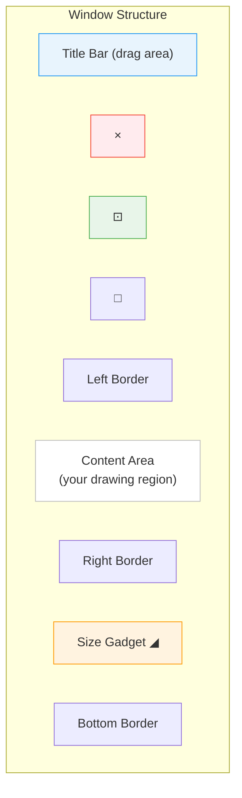

[← Home](../README.md) · [Intuition](README.md)

# Windows

## What Is a Window?

A window is Intuition's fundamental unit of user interaction. Every GUI element — gadgets, menus, text, graphics — lives inside a window. A window belongs to exactly one [screen](screens.md), receives user input through [IDCMP](idcmp.md), and is managed by the system's layered display architecture.

Unlike modern windowing systems where windows are heavyweight objects backed by compositor surfaces, Amiga windows are **lightweight wrappers around Layers** — the graphics.library's clipping and damage-tracking mechanism. This is why a 7 MHz 68000 can manage dozens of overlapping windows smoothly.

---

## Window Anatomy



| Element | System Gadget | Purpose |
|---|---|---|
| **Close** | `WFLG_CLOSEGADGET` | Sends `IDCMP_CLOSEWINDOW` |
| **Depth** | `WFLG_DEPTHGADGET` | Moves window front/back |
| **Zoom** | `WFLG_HASZOOM` (OS 2.0+) | Toggles between two sizes |
| **Drag Bar** | `WFLG_DRAGBAR` | User drags the window |
| **Size** | `WFLG_SIZEGADGET` | Resize handle (bottom-right) |
| **Borders** | Automatic | Visual frame; width depends on screen resolution |

---

## Opening a Window

### Modern Pattern (OS 2.0+ TagList)

```c
struct Window *win = OpenWindowTags(NULL,
    WA_Left,          100,
    WA_Top,           50,
    WA_InnerWidth,    400,       /* Content area width */
    WA_InnerHeight,   300,       /* Content area height */
    WA_Title,         "My Window",
    WA_ScreenTitle,   "Status bar text when this window is active",
    WA_IDCMP,         IDCMP_CLOSEWINDOW | IDCMP_GADGETUP |
                      IDCMP_RAWKEY | IDCMP_NEWSIZE,
    WA_Flags,         WFLG_CLOSEGADGET | WFLG_DRAGBAR |
                      WFLG_DEPTHGADGET | WFLG_SIZEGADGET |
                      WFLG_ACTIVATE | WFLG_SMART_REFRESH,
    WA_MinWidth,      200,
    WA_MinHeight,     100,
    WA_MaxWidth,      -1,        /* No maximum (screen width) */
    WA_MaxHeight,     -1,        /* No maximum (screen height) */
    WA_PubScreen,     NULL,      /* Default public screen (Workbench) */
    TAG_DONE);

if (!win) { /* Handle failure — screen may be locked or out of memory */ }
```

### Legacy Pattern (struct NewWindow)

```c
/* Pre-OS 2.0 — avoid in new code */
struct NewWindow nw = {
    100, 50, 400, 300,           /* Left, Top, Width, Height */
    0, 1,                        /* DetailPen, BlockPen */
    IDCMP_CLOSEWINDOW,           /* IDCMPFlags */
    WFLG_CLOSEGADGET | WFLG_DRAGBAR | WFLG_ACTIVATE,
    NULL, NULL,                  /* FirstGadget, CheckMark */
    "My Window",                 /* Title */
    NULL, NULL,                  /* Screen, BitMap */
    200, 100, -1, -1,            /* Min/Max Width/Height */
    WBENCHSCREEN                 /* Type */
};
struct Window *win = OpenWindow(&nw);
```

---

## Common WA_ Tags

### Position and Size

| Tag | Type | Description |
|---|---|---|
| `WA_Left`, `WA_Top` | `WORD` | Window position (outer edge) |
| `WA_Width`, `WA_Height` | `WORD` | Total window size (including borders) |
| `WA_InnerWidth`, `WA_InnerHeight` | `WORD` | Content area size (excluding borders) — preferred |
| `WA_MinWidth`, `WA_MinHeight` | `WORD` | Minimum resize dimensions |
| `WA_MaxWidth`, `WA_MaxHeight` | `WORD` | Maximum resize dimensions; `-1` = screen size |
| `WA_Zoom` | `WORD[4]` | Alternate position/size for zoom gadget |

### Appearance

| Tag | Type | Description |
|---|---|---|
| `WA_Title` | `STRPTR` | Title bar text |
| `WA_ScreenTitle` | `STRPTR` | Screen title shown when this window is active |
| `WA_Borderless` | `BOOL` | No borders or system gadgets |
| `WA_GimmeZeroZero` | `BOOL` | Inner content area starts at (0,0) — adds extra layer |
| `WA_NoCareRefresh` | `BOOL` | Ignore REFRESHWINDOW — Intuition handles it (may cause glitches) |

### Screen Placement

| Tag | Type | Description |
|---|---|---|
| `WA_PubScreen` | `struct Screen *` | Open on a public screen (`NULL` = default/Workbench) |
| `WA_CustomScreen` | `struct Screen *` | Open on a custom (private) screen |
| `WA_PubScreenName` | `STRPTR` | Open on named public screen; falls back to default |
| `WA_PubScreenFallBack` | `BOOL` | If named screen unavailable, use default |

### Behavior

| Tag | Type | Description |
|---|---|---|
| `WA_Activate` | `BOOL` | Window becomes active immediately on open |
| `WA_Backdrop` | `BOOL` | Always stays behind all normal windows |
| `WA_SmartRefresh` | `BOOL` | Intuition saves obscured content automatically |
| `WA_SimpleRefresh` | `BOOL` | Application must redraw on expose (less memory) |
| `WA_SuperBitMap` | `struct BitMap *` | Application provides full off-screen buffer |
| `WA_AutoAdjust` | `BOOL` | Auto-adjust position/size to fit screen |
| `WA_NewLookMenus` | `BOOL` | OS 3.0+ 3D menu appearance |

---

## Refresh Modes

How Intuition handles window content when areas are obscured and then revealed:

| Mode | Flag | Memory Cost | App Responsibility | Best For |
|---|---|---|---|---|
| **Simple Refresh** | `WFLG_SIMPLE_REFRESH` | Lowest | Must handle `IDCMP_REFRESHWINDOW` — redraw exposed areas | Text editors, games (redraw every frame anyway) |
| **Smart Refresh** | `WFLG_SMART_REFRESH` | Medium | Intuition saves/restores obscured areas automatically | Most applications — recommended default |
| **SuperBitMap** | `WFLG_SUPER_BITMAP` | Highest | Application provides full-size `BitMap`; Intuition copies from it | CAD, paint programs with large canvases |

### Simple Refresh Handler

```c
case IDCMP_REFRESHWINDOW:
    BeginRefresh(win);
    /* Redraw only the damaged region — clipping is set automatically */
    RedrawWindowContents(win);
    EndRefresh(win, TRUE);   /* TRUE = damage fully repaired */
    break;
```

### Smart Refresh Memory Cost

Smart Refresh allocates off-screen buffers proportional to the **obscured area**. If a 640×400 window is 50% covered by other windows, Smart Refresh consumes ~128 KB (at 4 bitplanes). On a 512 KB A500, this is significant.

---

## Window Types

### Standard Window

The default — has borders, title bar, and system gadgets:

```c
WA_Flags, WFLG_CLOSEGADGET | WFLG_DRAGBAR |
          WFLG_DEPTHGADGET | WFLG_SIZEGADGET | WFLG_ACTIVATE,
```

### Backdrop Window

Stays behind all other windows. Commonly used for:
- Desktop manager backgrounds
- Full-screen applications that want to coexist with Workbench windows

```c
WA_Flags,      WFLG_BACKDROP | WFLG_BORDERLESS | WFLG_ACTIVATE,
WA_IDCMP,      IDCMP_MOUSEBUTTONS | IDCMP_RAWKEY,
```

### Borderless Window

No system gadgets or decorations — the application draws everything:

```c
WA_Borderless, TRUE,
WA_Flags,      WFLG_ACTIVATE | WFLG_RMBTRAP,  /* Trap right-click too */
```

### GimmeZeroZero Window

Creates a separate layer for window borders. The content area's `RastPort` starts at (0,0) regardless of border width:

```c
WA_Flags, WFLG_GIMMEZEROZERO | WFLG_CLOSEGADGET | WFLG_DRAGBAR,
```

**Trade-off**: Uses an extra layer (memory + blitter operations) but simplifies rendering code since you don't need to account for border offsets.

### Sizing Constraints

```c
WA_MinWidth,   200,
WA_MinHeight,  100,
WA_MaxWidth,   -1,      /* Screen width */
WA_MaxHeight,  -1,      /* Screen height */
WA_SizeGadget, TRUE,
WA_SizeBRight, TRUE,    /* Size gadget on right border */
WA_SizeBBottom, TRUE,   /* Size gadget on bottom border */
```

---

## Window Coordinates

### Border Offsets

The content area does NOT start at (0,0) in a normal window. You must account for borders:

```c
WORD contentLeft   = win->BorderLeft;
WORD contentTop    = win->BorderTop;
WORD contentWidth  = win->Width - win->BorderLeft - win->BorderRight;
WORD contentHeight = win->Height - win->BorderTop - win->BorderBottom;

/* Draw at content origin */
Move(win->RPort, contentLeft, contentTop + baseline);
Text(win->RPort, "Hello", 5);
```

With `WFLG_GIMMEZEROZERO`, the window provides a separate `GZZWidth`/`GZZHeight` and a content `RastPort` where (0,0) is the content origin.

---

## Closing a Window

### Simple Case

```c
CloseWindow(win);
```

### Safe Shutdown (Drain Messages First)

```c
/* Drain any pending IDCMP messages */
struct IntuiMessage *msg;
while ((msg = (struct IntuiMessage *)GetMsg(win->UserPort)))
    ReplyMsg((struct Message *)msg);

CloseWindow(win);
```

### With Shared Port

See [IDCMP — Multi-Window Shared Port](idcmp.md#multi-window-shared-port) for the full `Forbid()`/strip/detach protocol.

---

## Modifying a Window

### Move and Resize

```c
MoveWindow(win, deltaX, deltaY);           /* Relative move */
SizeWindow(win, deltaWidth, deltaHeight);  /* Relative resize */
ChangeWindowBox(win, left, top, w, h);     /* Absolute reposition + resize */
WindowToFront(win);
WindowToBack(win);
ActivateWindow(win);
```

### Change Title

```c
SetWindowTitles(win, "New Title", "New Screen Title");
/* Pass (UBYTE *)-1 to leave unchanged */
SetWindowTitles(win, "New Title", (UBYTE *)-1);
```

### Busy Pointer

```c
/* OS 3.0+ — show busy pointer */
SetWindowPointer(win, WA_BusyPointer, TRUE, TAG_DONE);

/* Restore normal pointer */
SetWindowPointer(win, WA_Pointer, NULL, TAG_DONE);
```

---

## struct Window — Key Fields

| Field | Type | Description |
|---|---|---|
| `LeftEdge`, `TopEdge` | `WORD` | Position on screen |
| `Width`, `Height` | `WORD` | Total size (including borders) |
| `BorderLeft/Right/Top/Bottom` | `BYTE` | Border thickness (pixels) |
| `RPort` | `struct RastPort *` | Drawing context for this window |
| `UserPort` | `struct MsgPort *` | IDCMP message port |
| `IDCMPFlags` | `ULONG` | Currently active IDCMP flags |
| `Flags` | `ULONG` | Window flags (`WFLG_*`) |
| `Title` | `UBYTE *` | Title string |
| `WScreen` | `struct Screen *` | Screen this window belongs to |
| `FirstGadget` | `struct Gadget *` | Head of gadget list |
| `MouseX`, `MouseY` | `WORD` | Current mouse position (relative to window) |
| `GZZWidth`, `GZZHeight` | `WORD` | Inner dimensions (GimmeZeroZero only) |
| `MinWidth/Height`, `MaxWidth/Height` | `WORD` | Size constraints |

---

## Pitfalls

### 1. Using WA_Width Instead of WA_InnerWidth

`WA_Width` includes borders. On different screen resolutions, border width varies. Always use `WA_InnerWidth`/`WA_InnerHeight` for predictable content area sizing.

### 2. Drawing Outside Content Area

Drawing at (0,0) in a non-GZZ window overwrites the border:
```c
/* WRONG — draws over title bar */
Move(win->RPort, 0, 10);

/* CORRECT — offset by borders */
Move(win->RPort, win->BorderLeft, win->BorderTop + 10);
```

### 3. Forgetting MinWidth/MinHeight

Without size constraints, users can resize the window to 1×1 pixel, causing division-by-zero in layout code.

### 4. Not Handling NEWSIZE

If your window is resizable, you must redraw content when `IDCMP_NEWSIZE` arrives — the old content is clipped or garbage.

### 5. Opening on a Closed Screen

If you cache a screen pointer and it becomes invalid, `OpenWindowTags()` will crash. Always `LockPubScreen()` → open window → `UnlockPubScreen()`.

---

## Best Practices

1. **Use `WA_InnerWidth`/`WA_InnerHeight`** for predictable content dimensions
2. **Use Smart Refresh** unless you have a specific reason not to
3. **Always set `WA_MinWidth`/`WA_MinHeight`** for resizable windows
4. **Handle `IDCMP_NEWSIZE`** — recalculate and redraw layout
5. **Use `WA_PubScreen, NULL`** to open on the default public screen
6. **Drain IDCMP messages** before calling `CloseWindow()`
7. **Show a busy pointer** during long operations — it prevents user confusion
8. **Use `WA_AutoAdjust, TRUE`** to handle cases where the window doesn't fit the screen

---

## References

- NDK 3.9: `intuition/intuition.h`, `intuition/screens.h`
- ADCD 2.1: `OpenWindowTagList()`, `CloseWindow()`, `ModifyIDCMP()`
- AmigaOS Reference Manual (RKRM): Libraries, Chapter 4 — Intuition Windows
- See also: [IDCMP](idcmp.md), [Screens](screens.md), [Gadgets](gadgets.md)
