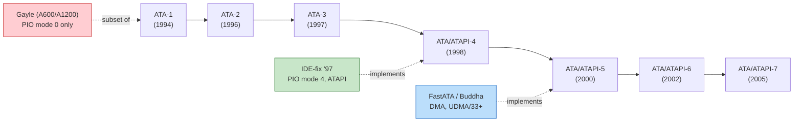
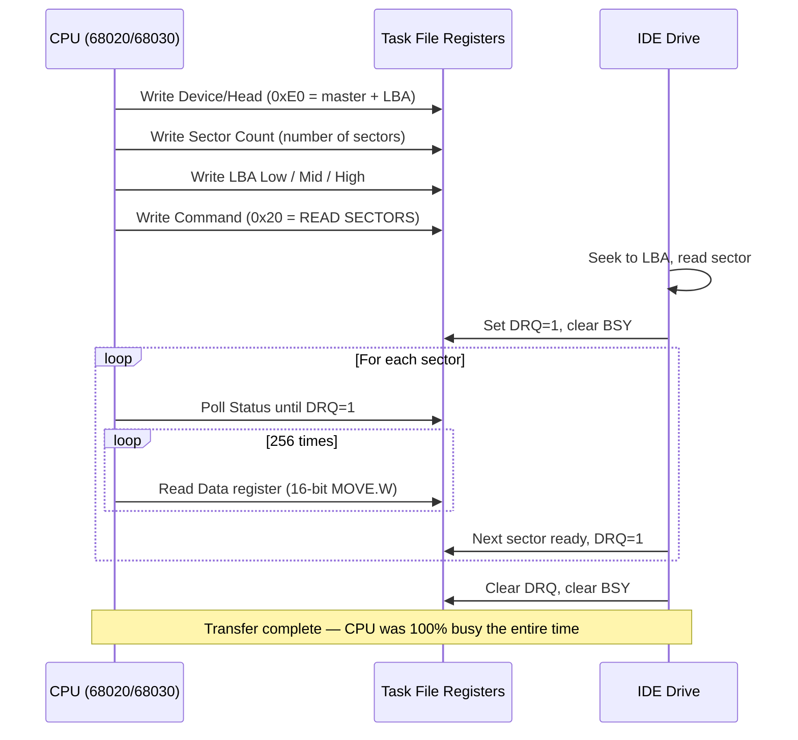
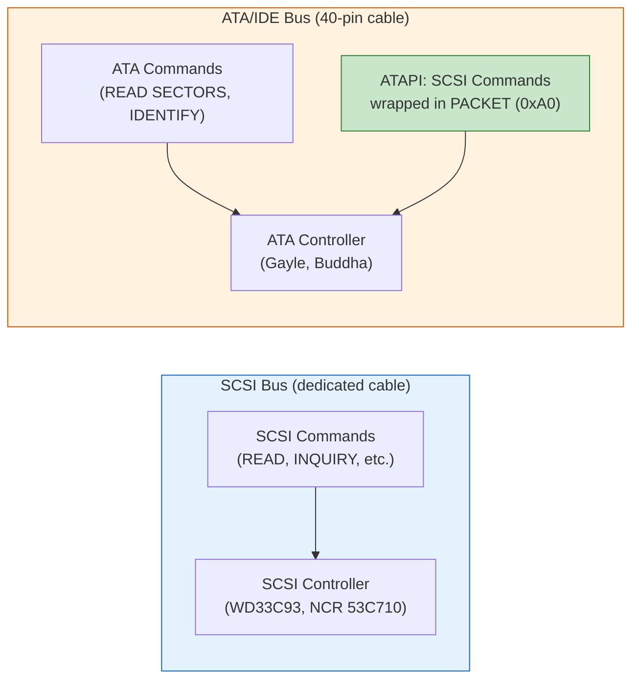
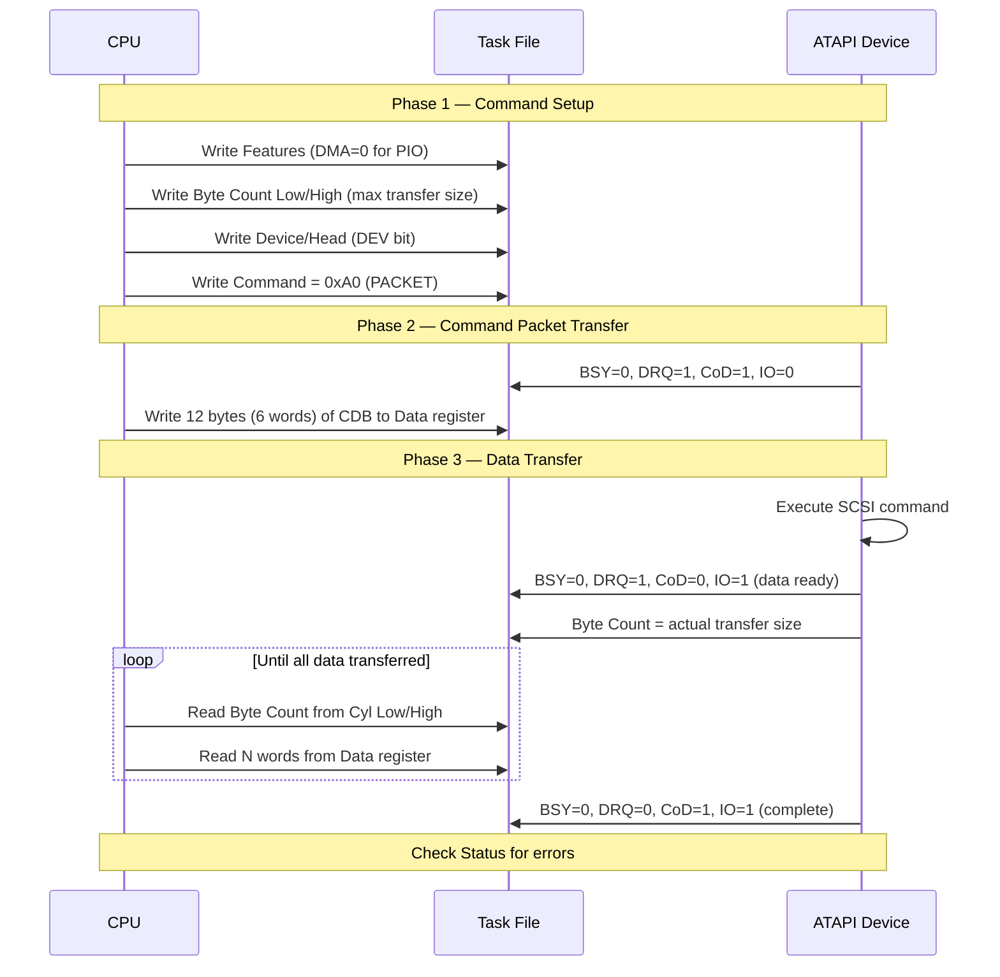
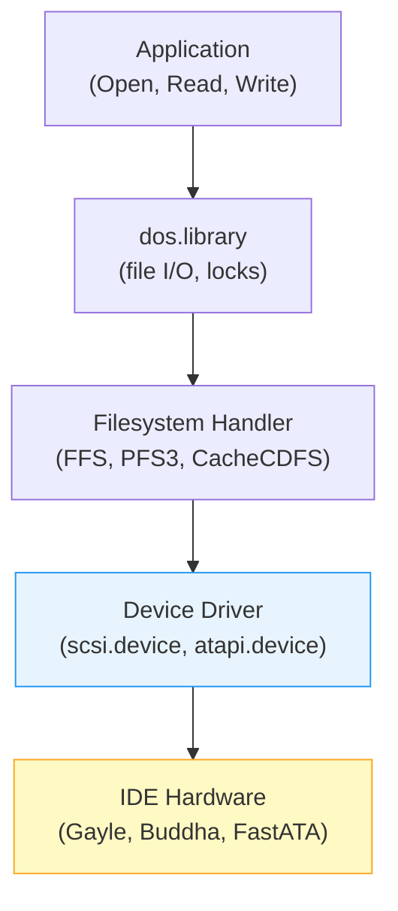
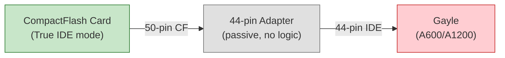

[← Home](../README.md) · [Devices](README.md)

# ATA/ATAPI — IDE Protocol, Packet Commands, and Storage Media

## Overview

In 1991, Commodore put an IDE port on the A600 and called it done. No DMA engine, no interrupt coalescing, no multiword transfer modes — just a Gayle gate array that could shuffle **one word at a time** between the CPU and a hard drive. The 68000 had to babysit every single 16-bit transfer with a `MOVE.W` loop, burning **100% CPU** while the disk moved data at a leisurely **1.5 MB/s**. The PC world was already shipping ATA-2 with PIO mode 4 and multiword DMA. Commodore shipped PIO mode 0 — the slowest mode in the spec — and then went bankrupt.

That gap defined the next decade of Amiga storage. The community built everything Commodore left out: DMA-capable Zorro IDE cards (Buddha, FastATA), enhanced drivers that bolted on TD64/NSD for drives over 4 GB, and eventually ATAPI support for CD-ROMs and removable media that the stock OS never anticipated. Today, most Amiga hard drives are actually CompactFlash cards plugged into 44-pin adapters — solid-state storage running through a protocol designed for spinning rust in 1986.

This article documents the **ATA and ATAPI wire protocols** as they apply to the Amiga: task file registers, PIO transfer mechanics, ATAPI packet commands for optical and removable media, the driver ecosystem that makes it all work, and the practical reality of using IDE storage on classic hardware. For the AmigaOS API perspective (`HD_SCSICMD`, `CMD_READ`, `IORequest` patterns), see [scsi.md](scsi.md). For the Gayle chip's register map and interrupt routing, see [Gayle IDE & PCMCIA](../01_hardware/common/gayle_ide_pcmcia.md).

---

## Standards Evolution — From IDE to ATA/ATAPI-7

The Amiga's IDE interface predates the formal ATA standard. Commodore implemented what was essentially a **pre-standard IDE interface** based on the Compaq/Western Digital specification from 1986. The industry then spent a decade standardizing, extending, and accelerating the protocol — while Amiga hardware stayed frozen at the starting line.

### ATA/ATAPI Standards Timeline

| Standard | ANSI/INCITS | Year | Key Features | Amiga Relevance |
|---|---|---|---|---|
| **ATA-1** | ANSI X3.221-1994 | 1994 | PIO modes 0–2, single-word DMA, CHS addressing, 28-bit LBA | **This is what Gayle implements** (PIO mode 0 subset) |
| **ATA-2** | ANSI X3.279-1996 | 1996 | PIO modes 3–4, multiword DMA 0–2, LBA mandatory, Block Transfer | IDE-fix and third-party controllers add PIO mode 4 support |
| **ATA-3** | ANSI X3.298-1997 | 1997 | S.M.A.R.T., security (password lock), reliability improvements | S.M.A.R.T. generally unused on Amiga; CF cards may lock |
| **ATA/ATAPI-4** | INCITS 317-1998 | 1998 | **ATAPI formally merged**, Ultra DMA modes 0–2 (UDMA/33), HPA | First standard to include ATAPI; IDE-fix supports ATAPI from here |
| **ATA/ATAPI-5** | INCITS 340-2000 | 2000 | Ultra DMA modes 3–4 (UDMA/66), 80-conductor cable requirement | FastATA and some Zorro cards support UDMA |
| **ATA/ATAPI-6** | INCITS 361-2002 | 2002 | **48-bit LBA** (>128 GB), UDMA/100, Streaming commands | 48-bit LBA relevant for large CF cards with modern drivers |
| **ATA/ATAPI-7** | INCITS 397-2005 | 2005 | SATA 1.0 added as transport, UDMA/133, multi-volume standard | SATA irrelevant to classic Amiga; marks end of parallel ATA era |

### SFF Committee Specifications

The Small Form Factor (SFF) Committee developed the key ATAPI specifications *before* they were merged into the ATA standard at revision 4:

| SFF Spec | Title | Scope |
|---|---|---|
| **SFF-8020i** | ATA Packet Interface for CD-ROMs | Defines ATAPI protocol for optical drives — the basis for all Amiga CD-ROM IDE support |
| **SFF-8070i** | ATAPI Removable Rewritable Media | Extends ATAPI to Zip drives, LS-120 SuperDisk, and similar removable media |
| **SFF-8038i** | EIDE Bus Master Interface | Defines DMA engine registers for bus-mastering IDE controllers (not applicable to Gayle) |

> [!NOTE]
> The Amiga CDTV and CD32 use **SCSI** for their CD-ROM drives, not ATAPI. ATAPI CD-ROM support on the Amiga is exclusively a **desktop add-on** scenario — an IDE or PCMCIA CD-ROM drive connected to an A600, A1200, or A4000. See [CDTV Hardware](../01_hardware/ocs_a500/cdtv_hardware.md) and [Akiko — CD32](../01_hardware/aga_a1200_a4000/akiko_cd32.md) for the SCSI-based platforms.

### Where Does the Amiga Sit?



---

## ATA Task File Registers

The ATA interface communicates through a set of 8-bit and 16-bit registers collectively called the **Task File**. These are split into two groups: the **Command Block** (primary registers for issuing commands and transferring data) and the **Control Block** (device control and alternate status).

### Command Block Registers

| Offset | Register (Read) | Register (Write) | Width | ATAPI Alias |
|---|---|---|---|---|
| +0 | **Data** | **Data** | 16-bit | Data |
| +1 | **Error** | **Features** | 8-bit | Error / Features |
| +2 | **Sector Count** | **Sector Count** | 8-bit | **Interrupt Reason** |
| +3 | **Sector Number** | **Sector Number** | 8-bit | Reserved |
| +4 | **Cylinder Low** | **Cylinder Low** | 8-bit | **Byte Count Low** |
| +5 | **Cylinder High** | **Cylinder High** | 8-bit | **Byte Count High** |
| +6 | **Device/Head** | **Device/Head** | 8-bit | Device Select |
| +7 | **Status** | **Command** | 8-bit | Status / Command |

### Control Block Registers

| Offset | Register (Read) | Register (Write) | Width |
|---|---|---|---|
| +6 | **Alternate Status** | **Device Control** | 8-bit |

> [!IMPORTANT]
> Reading the **Status** register (offset +7) clears any pending interrupt. Reading the **Alternate Status** register (control block offset +6) does **not** clear the interrupt. Use Alternate Status when polling without disturbing interrupt state.

### Gayle Address Mapping

On the Amiga, the task file registers are memory-mapped through the Gayle chip. The base address is `$DA0000`, but the **byte-lane mapping differs between A600 and A1200**:

| ATA Offset | A600 Address | A1200 Address | Register |
|---|---|---|---|
| +0 (Data) | `$DA0000` | `$DA0000` | Data (16-bit) |
| +1 (Error/Features) | `$DA0004` | `$DA0005` | Error / Features |
| +2 (Sector Count) | `$DA0008` | `$DA0009` | Sector Count / Interrupt Reason |
| +3 (Sector Number) | `$DA000C` | `$DA000D` | Sector Number |
| +4 (Cylinder Low) | `$DA0010` | `$DA0011` | Cylinder Low / Byte Count Low |
| +5 (Cylinder High) | `$DA0014` | `$DA0015` | Cylinder High / Byte Count High |
| +6 (Device/Head) | `$DA0018` | `$DA0019` | Device/Head |
| +7 (Status/Command) | `$DA001C` | `$DA001D` | Status / Command |
| Control +6 | `$DA101C` | `$DA101D` | Alt Status / Device Control |

See [Gayle IDE & PCMCIA](../01_hardware/common/gayle_ide_pcmcia.md) for the full register map, interrupt routing, and PCMCIA interface details.

### Status Register Bits

```c
/* ATA Status Register — read from Command Block offset +7 */
#define ATA_STATUS_BSY   0x80  /* Busy — no other bits valid when set       */
#define ATA_STATUS_DRDY  0x40  /* Drive Ready — device can accept commands  */
#define ATA_STATUS_DF    0x20  /* Device Fault (ATA) / DWF (legacy)         */
#define ATA_STATUS_DSC   0x10  /* Drive Seek Complete (legacy, ignored)     */
#define ATA_STATUS_DRQ   0x08  /* Data Request — data transfer pending      */
#define ATA_STATUS_CORR  0x04  /* Corrected data (legacy, ignored)          */
#define ATA_STATUS_IDX   0x02  /* Index (legacy, ignored)                   */
#define ATA_STATUS_ERR   0x01  /* Error — check Error register for details  */
```

> [!WARNING]
> **BSY must be checked first.** When `BSY` is set, all other status bits are undefined. Any driver that reads `DRQ` or `ERR` without first confirming `BSY=0` is broken. This is the single most common ATA driver bug.

### Error Register Bits

```c
/* ATA Error Register — read from Command Block offset +1 (valid when ERR=1) */
#define ATA_ERR_BBK    0x80  /* Bad Block detected (legacy)                 */
#define ATA_ERR_UNC    0x40  /* Uncorrectable data error                    */
#define ATA_ERR_MC     0x20  /* Media Changed                               */
#define ATA_ERR_IDNF   0x10  /* ID Not Found (sector doesn't exist)         */
#define ATA_ERR_MCR    0x08  /* Media Change Request                        */
#define ATA_ERR_ABRT   0x04  /* Command Aborted (invalid command or state)  */
#define ATA_ERR_TK0NF  0x02  /* Track 0 Not Found (legacy, recalibrate)     */
#define ATA_ERR_AMNF   0x01  /* Address Mark Not Found (legacy)             */
```

### Device/Head Register

```c
/* Device/Head Register — Command Block offset +6 */
/*   Bit 7:   1 (reserved, must be 1)             */
/*   Bit 6:   LBA mode (1=LBA, 0=CHS)             */
/*   Bit 5:   1 (reserved, must be 1)             */
/*   Bit 4:   DEV — device select (0=master, 1=slave) */
/*   Bits 3-0: Head number (CHS) or LBA bits 27:24    */
#define ATA_DEV_LBA    0x40  /* Use LBA addressing                          */
#define ATA_DEV_DEV1   0x10  /* Select device 1 (slave)                     */
/* Always OR with 0xA0: bits 7 and 5 must be set */
```

### ATAPI Interrupt Reason Register

For ATAPI devices, the Sector Count register (offset +2) is repurposed as the **Interrupt Reason** register during packet command execution:

```c
/* ATAPI Interrupt Reason — Command Block offset +2 (during packet commands) */
#define ATAPI_IR_CoD   0x01  /* 1=Command packet expected, 0=Data transfer  */
#define ATAPI_IR_IO    0x02  /* 1=Transfer TO host, 0=Transfer FROM host    */
/* Bit 2 is RELEASE (overlap/queuing, not used on Amiga) */
```

| CoD | IO | Meaning |
|---|---|---|
| 1 | 0 | Device expects the **command packet** from host |
| 0 | 0 | Device expects **data write** from host |
| 0 | 1 | Device has **data to send** to host |
| 1 | 1 | **Command complete** — no more data |

---

## ATA Protocol — Hard Drive Commands

### Device Detection and Identification

When the system boots (or a driver initializes), it must determine what's connected to each IDE channel. The detection sequence:

1. **Select device**: Write `0xA0` (master) or `0xB0` (slave) to Device/Head register
2. **Wait for BSY=0**: Poll Status register until device is ready
3. **Check signature**: After a reset, ATA and ATAPI devices leave different signatures in the task file:

| Register | ATA Device (HDD) | ATAPI Device (CD-ROM) |
|---|---|---|
| Sector Count | `0x01` | `0x01` |
| Sector Number | `0x01` | `0x01` |
| Cylinder Low | `0x00` | **`0x14`** |
| Cylinder High | `0x00` | **`0xEB`** |

4. **Issue IDENTIFY**: Send `IDENTIFY DEVICE` (`0xEC`) for ATA, or `IDENTIFY PACKET DEVICE` (`0xA1`) for ATAPI
5. **Read 256 words**: The device returns a 512-byte identification block with model name, capabilities, supported modes, and capacity

```c
/* Detect and identify an ATA/ATAPI device */
void IdentifyDevice(volatile UBYTE *base, UBYTE dev)
{
    UWORD ident[256];
    UBYTE cl, ch;

    /* Select device */
    *(base + ATA_REG_DEVHEAD) = (dev == 0) ? 0xA0 : 0xB0;
    WaitBSYClear(base);

    /* Read signature */
    cl = *(base + ATA_REG_CYLLOW);
    ch = *(base + ATA_REG_CYLHIGH);

    if (cl == 0x14 && ch == 0xEB) {
        /* ATAPI device — use IDENTIFY PACKET DEVICE */
        *(base + ATA_REG_COMMAND) = 0xA1;
    } else {
        /* ATA device — use IDENTIFY DEVICE */
        *(base + ATA_REG_COMMAND) = 0xEC;
    }

    WaitDRQ(base);

    /* Read 256 words of identification data */
    for (int i = 0; i < 256; i++)
        ident[i] = *(volatile UWORD *)base;  /* Data register */

    /* ident[27..46] = model string (40 chars, byte-swapped) */
    /* ident[60..61] = total LBA sectors (28-bit)            */
    /* ident[49]     = capabilities (bit 9 = LBA supported)  */
    /* ident[88]     = UDMA modes supported                  */
}
```

> [!NOTE]
> The IDENTIFY data block is **byte-swapped** on string fields (model, serial, firmware revision). Each 16-bit word has its bytes transposed relative to the ASCII order. Swap bytes before displaying.

### ATA Command Reference

| Opcode | Name | Type | Description |
|---|---|---|---|
| `0x20` | READ SECTORS | PIO In | Read 1–256 sectors (28-bit LBA) |
| `0x24` | READ SECTORS EXT | PIO In | Read sectors (48-bit LBA) — ATA-6+ |
| `0x30` | WRITE SECTORS | PIO Out | Write 1–256 sectors (28-bit LBA) |
| `0x34` | WRITE SECTORS EXT | PIO Out | Write sectors (48-bit LBA) — ATA-6+ |
| `0xC4` | READ MULTIPLE | PIO In | Read multiple sectors per interrupt (block mode) |
| `0xC5` | WRITE MULTIPLE | PIO Out | Write multiple sectors per interrupt |
| `0xC6` | SET MULTIPLE MODE | Non-data | Set block transfer count for READ/WRITE MULTIPLE |
| `0xC8` | READ DMA | DMA In | Read sectors via DMA (requires DMA engine — **not Gayle**) |
| `0xCA` | WRITE DMA | DMA Out | Write sectors via DMA |
| `0xE7` | FLUSH CACHE | Non-data | Flush volatile write cache to media |
| `0xEA` | FLUSH CACHE EXT | Non-data | Flush cache (48-bit LBA devices) |
| `0xEC` | IDENTIFY DEVICE | PIO In | Return 512-byte device identification block |
| `0xEF` | SET FEATURES | Non-data | Enable/disable features (transfer mode, write cache, APM) |
| `0xE0` | STANDBY IMMEDIATE | Non-data | Spin down immediately |
| `0xE1` | IDLE IMMEDIATE | Non-data | Transition to idle state |
| `0xE5` | CHECK POWER MODE | Non-data | Returns power state in Sector Count register |
| `0xF8` | READ NATIVE MAX | Non-data | Return true device capacity (before HPA clipping) |
| `0x91` | INITIALIZE DEVICE PARAMETERS | Non-data | Set CHS geometry (legacy) |
| `0x08` | DEVICE RESET | Non-data | Software reset (ATAPI devices only) |
| `0x90` | EXECUTE DEVICE DIAGNOSTIC | Non-data | Self-test; returns diagnostic code |
| `0xB0` | S.M.A.R.T. | Varies | Self-Monitoring, Analysis, and Reporting — ATA-3+ |
| `0xA0` | PACKET | Packet | **ATAPI only** — send command packet (see next section) |
| `0xA1` | IDENTIFY PACKET DEVICE | PIO In | **ATAPI only** — return identification block |

### Amiga ATA Command Support Matrix

Not every ATA command works on every Amiga configuration. This table shows what is available on stock hardware, what requires third-party upgrades, and what is physically impossible:

| Command Category | Stock Gayle (A600/A1200) | With IDE-fix / Enhanced Driver | With DMA Controller (FastATA) | Impossible on Classic Amiga |
|---|---|---|---|---|
| **READ/WRITE SECTORS** (PIO, 28-bit LBA) | ✅ | ✅ | ✅ | — |
| **READ/WRITE SECTORS EXT** (48-bit LBA) | ❌ Driver doesn't support | ✅ With TD64/NSD | ✅ | — |
| **READ/WRITE MULTIPLE** (block mode) | ❌ Not used by ROM driver | ✅ IDE-fix uses this | ✅ | — |
| **READ/WRITE DMA** | ❌ **No DMA engine in Gayle** | ❌ Still no hardware | ✅ FastATA only | ❌ On Gayle hardware |
| **IDENTIFY DEVICE** | ✅ | ✅ | ✅ | — |
| **SET FEATURES** (PIO mode) | ❌ ROM doesn't use | ✅ IDE-fix sets PIO 4 | ✅ | — |
| **SET FEATURES** (DMA mode) | ❌ **Dangerous — causes hang** | ❌ | ✅ | ❌ On Gayle hardware |
| **PACKET** (ATAPI) | ❌ Not implemented | ✅ `atapi.device` | ✅ | — |
| **IDENTIFY PACKET DEVICE** | ❌ Not implemented | ✅ | ✅ | — |
| **FLUSH CACHE** | ❌ ROM doesn't use | ✅ | ✅ | — |
| **S.M.A.R.T.** | ❌ Not implemented | ❌ Rarely implemented | ❌ | Not useful (CF cards) |
| **STANDBY/IDLE** | ❌ Not implemented | ✅ Some drivers | ✅ | — |
| **DEVICE RESET** (`0x08`) | ❌ | ✅ | ✅ | — |
| **Ultra DMA transfers** | ❌ | ❌ | ✅ UDMA/33 (FastATA) | ❌ On Gayle hardware |
| **SATA** | ❌ | ❌ | ❌ | ❌ No SATA hardware exists |
| **NCQ (Native Command Queuing)** | ❌ | ❌ | ❌ | ❌ ATA/ATAPI-7+ only |

> [!IMPORTANT]
> The three categories of "impossible" on classic Amiga:
> 1. **Hardware-impossible on Gayle**: DMA transfers, UDMA modes — Gayle has no DMA engine, period. No software can fix this.
> 2. **Protocol-impossible**: SATA, NCQ — require hardware that was never manufactured for the Amiga bus.
> 3. **Software-possible but not implemented**: Everything else can theoretically work with the right driver. The ATA task file is fully accessible; the limitation is always the driver, not the hardware (except DMA).

### CHS vs LBA Addressing

ATA supports two addressing modes. **LBA is mandatory for any drive made after ~1996** and is the only mode relevant to modern CF cards.

| Mode | Registers Used | Max Capacity | When to Use |
|---|---|---|---|
| **CHS** | Cylinder (16-bit) + Head (4-bit) + Sector (8-bit) | 504 MB (1024×16×63) | Legacy drives pre-ATA-2. Never use on Amiga unless forced. |
| **28-bit LBA** | LBA 27:24 in Device/Head, LBA 23:16 in Cyl High, LBA 15:8 in Cyl Low, LBA 7:0 in Sector Number | **128 GB** (2²⁸ × 512) | Standard for all Amiga IDE. Set `ATA_DEV_LBA` bit in Device/Head. |
| **48-bit LBA** | Extended registers (ATA-6+) | 128 PB | Large CF cards. Requires driver support (TD64/NSD). |

### PIO Data Transfer Sequence

This is how every IDE read on a stock A600/A1200 works — no DMA, no shortcuts:



The critical performance insight: on a stock Gayle system, the CPU cannot do **anything else** during an IDE transfer. Every byte passes through a CPU register. This is why the Amiga community invested so heavily in DMA-capable third-party controllers.

### PIO Read in 68000 Assembly

```asm
; Read one sector (512 bytes) from Gayle IDE on A1200
; a0 = destination buffer
; Assumes command already issued, DRQ is set

    lea     $DA0000, a1         ; IDE Data register
    move.w  #255, d0            ; 256 words = 512 bytes
.read_loop:
    move.w  (a1), (a0)+         ; Read 16-bit word from IDE
    dbf     d0, .read_loop      ; Decrement and branch
    ; Total: 256 iterations × ~8 cycles = ~2048 cycles
    ; At 14 MHz: ~146 µs per sector
    ; Throughput: ~3.4 MB/s theoretical (bus-limited to ~1.5 MB/s)
```

---

## ATAPI Packet Protocol — Optical and Removable Media

### SCSI, ATA, and ATAPI — How They Relate

These three acronyms confuse everyone. Here's the relationship:

**SCSI** (Small Computer System Interface) is a **command set** — a vocabulary of operations like READ(10), INQUIRY, MODE SENSE, and TEST UNIT READY. It was originally designed in the early 1980s for devices connected to a dedicated SCSI bus with its own cables, terminators, and controller chips (WD33C93, NCR 53C710, etc.). On the Amiga, SCSI controllers appear in the A3000, A4000T, CDTV, and Zorro expansion cards.

**ATA** (AT Attachment) is a **transport interface** — a 40-pin ribbon cable with a simple set of 8-bit registers (the task file). It was designed exclusively for hard drives. ATA has its own command set (`READ SECTORS`, `WRITE SECTORS`, `IDENTIFY DEVICE`) that is completely separate from SCSI.

**ATAPI** (ATA Packet Interface) is the **bridge** between them. When the industry wanted to connect CD-ROMs and removable media to the cheap, ubiquitous ATA/IDE cable instead of expensive SCSI controllers, they needed a way to send SCSI commands over ATA wires. ATAPI solves this by defining a single ATA command — `PACKET` (`0xA0`) — that tells the device: "the next 12 bytes I send through the Data register are a SCSI CDB. Execute it."



In short: **ATAPI is SCSI commands tunneled through ATA**. An ATAPI CD-ROM speaks the same SCSI command language as a SCSI CD-ROM — the only difference is the physical bus it's connected to. This is why AmigaOS drivers like `atapi.device` can present ATAPI devices through the same `HD_SCSICMD` interface that native SCSI devices use.

### How ATAPI Differs from ATA

| Aspect | ATA (Hard Drives) | ATAPI (Optical/Removable) |
|---|---|---|
| **Commands** | ATA-native (READ SECTORS, etc.) | SCSI CDB wrapped in PACKET command |
| **Identify** | `IDENTIFY DEVICE` (`0xEC`) | `IDENTIFY PACKET DEVICE` (`0xA1`) |
| **Reset signature** | Cyl Low=`0x00`, Cyl High=`0x00` | Cyl Low=**`0x14`**, Cyl High=**`0xEB`** |
| **Data transfer size** | Fixed 512-byte sectors | Variable (device sets Byte Count) |
| **Sector Count register** | Number of sectors | **Interrupt Reason** (CoD/IO bits) |
| **Cylinder Low/High** | LBA address bits | **Byte Count** (transfer size) |
| **Media removal** | N/A | PREVENT/ALLOW MEDIUM REMOVAL command |
| **Eject** | N/A | START/STOP UNIT command with LoEj bit |

### ATAPI Device Signature

After a hardware or software reset, ATAPI devices identify themselves by writing a specific signature into the task file registers:

```c
/* After reset, read these registers to detect device type: */
UBYTE sector_count = *(base + ATA_REG_SECTORCNT);  /* 0x01 */
UBYTE sector_num   = *(base + ATA_REG_SECTOR);     /* 0x01 */
UBYTE cyl_low      = *(base + ATA_REG_CYLLOW);     /* 0x14 = ATAPI */
UBYTE cyl_high     = *(base + ATA_REG_CYLHIGH);    /* 0xEB = ATAPI */

if (cyl_low == 0x14 && cyl_high == 0xEB) {
    /* ATAPI device detected */
}
```

### Packet Command Sequence

The ATAPI packet command protocol has three phases:



### ATAPI Packet Command in C

```c
/* Send an ATAPI PACKET command (PIO mode) */
LONG ATAPIPacketCommand(volatile UBYTE *base, UBYTE *cdb,
                        UBYTE *data, ULONG maxLen, UBYTE direction)
{
    UWORD *wdata = (UWORD *)data;
    UWORD *wcdb  = (UWORD *)cdb;
    UWORD byteCount;
    UBYTE status, ireason;
    LONG  transferred = 0;

    /* Phase 1: Setup */
    *(base + ATA_REG_FEATURES) = 0x00;      /* PIO mode */
    *(base + ATA_REG_CYLLOW)   = maxLen & 0xFF;        /* Byte Count Low */
    *(base + ATA_REG_CYLHIGH)  = (maxLen >> 8) & 0xFF; /* Byte Count High */
    *(base + ATA_REG_DEVHEAD)  = 0xA0;      /* Master device */
    *(base + ATA_REG_COMMAND)  = 0xA0;      /* PACKET command */

    /* Wait for device to request command packet */
    WaitBSYClear(base);
    status = *(base + ATA_REG_STATUS);
    if (!(status & ATA_STATUS_DRQ))
        return -1;  /* Device didn't request packet */

    /* Phase 2: Send 12-byte CDB (6 words) */
    volatile UWORD *dataReg = (volatile UWORD *)base;
    for (int i = 0; i < 6; i++)
        *dataReg = wcdb[i];

    /* Phase 3: Data transfer loop */
    for (;;) {
        WaitBSYClear(base);
        status  = *(base + ATA_REG_STATUS);
        ireason = *(base + ATA_REG_SECTORCNT);

        if (!(status & ATA_STATUS_DRQ)) {
            /* No more data — command complete */
            break;
        }

        /* Read byte count for this transfer */
        byteCount = *(base + ATA_REG_CYLLOW) |
                    (*(base + ATA_REG_CYLHIGH) << 8);

        /* Transfer data */
        UWORD words = (byteCount + 1) / 2;
        if (ireason & ATAPI_IR_IO) {
            /* Device -> Host (read) */
            for (UWORD w = 0; w < words; w++)
                wdata[w] = *dataReg;
        } else {
            /* Host -> Device (write) */
            for (UWORD w = 0; w < words; w++)
                *dataReg = wdata[w];
        }

        wdata += words;
        transferred += byteCount;
    }

    return (status & ATA_STATUS_ERR) ? -1 : transferred;
}
```

### ATAPI Command Reference

These are SCSI-style commands sent inside the 12-byte CDB via the PACKET protocol. The opcodes come from the SCSI Primary Commands (SPC), SCSI Multimedia Commands (MMC), and SFF-8020i/SFF-8070i specifications.

#### Mandatory Commands (All ATAPI Devices)

| Opcode | Name | CDB Size | Description |
|---|---|---|---|
| `0x00` | TEST UNIT READY | 12 | Check if device is ready (media present, spun up) |
| `0x03` | REQUEST SENSE | 12 | Retrieve error information after a failed command |
| `0x12` | INQUIRY | 12 | Return device type, vendor, model, revision |
| `0x1A` | MODE SENSE(6) | 12 | Read device parameters (page-based) |
| `0x1B` | START/STOP UNIT | 12 | Start/stop motor, load/eject media |
| `0x1E` | PREVENT/ALLOW MEDIUM REMOVAL | 12 | Lock/unlock disc tray |
| `0x5A` | MODE SENSE(10) | 12 | Read device parameters (10-byte variant) |

#### Optical Drive Commands (SFF-8020i / MMC)

| Opcode | Name | CDB Size | Description |
|---|---|---|---|
| `0x25` | READ CAPACITY | 12 | Return last LBA and block size |
| `0x28` | READ(10) | 12 | Read data sectors (2048-byte blocks for Mode 1) |
| `0x2B` | SEEK(10) | 12 | Seek to specified LBA |
| `0x42` | READ SUB-CHANNEL | 12 | Read current position, media catalog number, ISRC |
| `0x43` | READ TOC/PMA/ATIP | 12 | Read Table of Contents, session info |
| `0x44` | READ HEADER | 12 | Read sector header for specified LBA |
| `0x45` | PLAY AUDIO(10) | 12 | Play audio from starting LBA for N blocks |
| `0x47` | PLAY AUDIO MSF | 12 | Play audio using Minute/Second/Frame addressing |
| `0x4B` | PAUSE/RESUME | 12 | Pause or resume audio playback |
| `0x4E` | STOP PLAY/SCAN | 12 | Stop audio playback |
| `0x46` | GET CONFIGURATION | 12 | Return feature profiles (MMC-2+) |
| `0x4A` | GET EVENT STATUS NOTIFICATION | 12 | Poll for media change events (MMC-2+) |
| `0x51` | READ DISC INFORMATION | 12 | Session/track count, disc status (MMC) |
| `0x52` | READ TRACK INFORMATION | 12 | Per-track details (MMC) |
| `0xA8` | READ(12) | 12 | Read sectors (12-byte CDB variant) |
| `0xBB` | SET CD SPEED | 12 | Set read/write speed |
| `0xBE` | READ CD | 12 | Read CD sector with format control (raw, user data, subchannel) |

#### Removable Media Commands (SFF-8070i)

| Opcode | Name | CDB Size | Description |
|---|---|---|---|
| `0x04` | FORMAT UNIT | 12 | Format removable media (Zip, LS-120) |
| `0x2A` | WRITE(10) | 12 | Write data sectors |
| `0x2E` | WRITE AND VERIFY(10) | 12 | Write sectors with verification read-back |
| `0x2F` | VERIFY(10) | 12 | Verify data integrity without transfer |
| `0x55` | MODE SELECT(10) | 12 | Set device parameters |
| `0x23` | READ FORMAT CAPACITIES | 12 | List supported format capacities |

See [CD-ROM Filesystems](../07_dos/cdfs.md) for how CDFS handlers use these commands to mount and read optical media.

---

## Amiga ATA/ATAPI Driver Ecosystem

The Amiga's stock IDE support is minimal. Everything beyond basic PIO hard drive access requires third-party software or hardware. Understanding what `atapi.device` is — and where it comes from — is essential.

### What is `atapi.device`?

`atapi.device` is an **AmigaOS Exec device driver** that implements the ATAPI packet protocol described in the previous section. It translates standard AmigaOS `IORequest` commands (including `HD_SCSICMD` with SCSI CDBs) into ATAPI task file register operations on the IDE bus.

Without `atapi.device` (or an equivalent), the Amiga has **no way to talk to ATAPI devices** — the stock `scsi.device` in ROM only understands native ATA commands for hard drives. It does not implement the `PACKET` (`0xA0`) command protocol.

`atapi.device` is **not a standalone download**. It is a component of the **IDE-fix** commercial software suite. There is no official free version of this specific driver, though alternatives exist (see below).

### Driver Stack



### Stock Commodore/Hyperion Drivers

| Driver | Ships With | Capabilities | Limitations |
|---|---|---|---|
| `scsi.device` (ROM) | Kickstart 2.0+ | ATA PIO mode 0, 28-bit LBA, master/slave | No ATAPI, no DMA, 4 GB limit, PIO mode 0 only |
| `ata.device` / `ide.device` | Some OS versions | Same as above with A1200 byte-lane fix | Still no ATAPI |
| `scsi.device` (OS 3.1.4) | AmigaOS 3.1.4 | Improved LBA, better error handling | Limited ATAPI awareness |
| `scsi.device` (OS 3.2) | AmigaOS 3.2 | Improved LBA, CD-ROM filesystem bundled | Native ATAPI support improved; may still need patching for some devices |

> [!NOTE]
> **AmigaOS 3.2** includes a built-in multi-threaded CD-ROM filesystem with Rock Ridge, Joliet, UDF, and HFS support. For many setups with a standard master/slave IDE configuration, OS 3.2 eliminates the need for IDE-fix entirely. However, 4-way IDE adapters and some exotic ATAPI devices may still require additional driver support.

### IDE-fix '97 / IDE-max — The Commercial Suite

**IDE-fix** was developed by **Elaborate Bytes** (the same company behind CloneCD). It was the single most important piece of Amiga IDE software throughout the late 1990s and 2000s, transforming the stock Gayle interface from a basic PIO hard drive port into a full-featured storage system.

**What IDE-fix actually is:** A commercial software suite (not a single driver) that installs multiple components:

| Component | Type | Purpose |
|---|---|---|
| `atapi.device` | Exec device driver | ATAPI packet protocol implementation — the core driver that lets the OS talk to CD-ROMs, Zip drives, and other ATAPI devices on the IDE bus |
| `IDEfix.library` | Shared library | Core engine: enhanced IDE port access, PIO mode optimization, TD64/NSD 64-bit addressing |
| `CacheCDFS` | DOS handler | High-performance CD filesystem: ISO 9660, Rock Ridge, Joliet, HFS, multisession |
| `IDEfix97` / `IDEfix Prefs` | GUI tool | Configuration: transfer mode selection, device detection, drive setup |
| `PlayCD` | Application | Audio CD player utility |
| `CD32 emulator` | Application | Runs CD32 game titles on desktop Amiga + CD-ROM |
| `DOSDrivers/CD0` | Mount entry | Mountlist for the first ATAPI CD-ROM drive |

**Installed file layout:**

```
DEVS:
+-- atapi.device          ; ATAPI packet protocol driver
+-- IDEfix.library        ; Core library
LIBS:
+-- IDEfix.library        ; (sometimes installed here instead)
SYS:
+-- IDEfix97              ; Configuration tool
DEVS:DOSDrivers/
+-- CD0                   ; Mount entry for first CD-ROM
```

**Current status:** IDE-fix is **abandonware**. Elaborate Bytes ceased Amiga development years ago. Registration is no longer possible. The unregistered version displays a nag screen on boot. Despite this, it remains widely used because no complete open-source replacement for `atapi.device` exists.

### Alternatives to IDE-fix

| Solution | Type | Source | What It Provides |
|---|---|---|---|
| **AmigaOS 3.2** | OS upgrade | Hyperion | Built-in CD-ROM filesystem, improved `scsi.device`, may handle ATAPI natively for basic CD-ROM setups |
| **AtapiMagic** | Free utility | Aminet (`driver/media/AtapiMagic.lha`) | Lightweight ATAPI bridge — placed in `LIBS:modules`, provides basic ATAPI device support without IDE-fix |
| **Controller-specific drivers** | Hardware-bundled | Various | Buddha (`buddha.device`), FastATA (`fastatahd.device`), etc. — include their own ATAPI support |
| **lide.device** | Open source | Community (Apollo/Vampire) | IDE driver for Vampire/Apollo accelerators with ATAPI support |

> [!TIP]
> **For new setups in 2024+:** Start with AmigaOS 3.2's native support. If that doesn't detect your ATAPI device, try AtapiMagic from Aminet. Only fall back to IDE-fix '97 if the above options fail — it is commercial abandonware with a boot nag screen.

### Third-Party Controller Drivers

| Controller | Bus | Driver | DMA | Key Features |
|---|---|---|---|---|
| **Buddha** | Zorro II | `buddha.device` | No | 2x IDE ports, clock port, CF-friendly, NSD/TD64 |
| **FastATA / 4xEIDE** | Zorro II | `fastatahd.device` | Yes | Up to UDMA/33, DMA frees CPU, fastest classic IDE |
| **Catweasel Mk-III** | Zorro II | `catweasel.device` | No | IDE + floppy controller, 2x IDE channels |
| **GVP Series II** | Zorro II | `gvpscsi.device` | Yes (SCSI) | SCSI DMA, not IDE — included for comparison |
| **A4091** | Zorro III | `2nd.scsi.device` | Yes (SCSI) | NCR 53C710 SCSI, fastest stock controller |
| **Subway** | Clock port | `subway.device` | No | USB 2.0 via clock port (mass storage class) |
| **Rapid Road** | Clock port | `poseidon.device` | No | USB 2.0 with mass storage support |

### Driver Comparison Matrix

| Feature | Stock ROM | IDE-fix '97 | OS 3.2 | AtapiMagic | Buddha | FastATA |
|---|---|---|---|---|---|---|
| **ATA PIO** | Mode 0 | Mode 0-4 | Mode 0 | Mode 0 | Mode 0-4 | Mode 0-4 |
| **DMA** | No | No (Gayle) | No | No | No | UDMA/33 |
| **ATAPI** | No | Full | Partial | Basic | Yes | Yes |
| **TD64/NSD** | No | Yes | Yes | No | Yes | Yes |
| **>4 GB drives** | No | Yes | Yes | No | Yes | Yes |
| **CD-ROM** | No | Yes + CacheCDFS | Yes (built-in) | Yes | Yes | Yes + AllegroCDFS |
| **Removable media** | No | Yes | No | No | No | Yes |
| **Cost** | Free (ROM) | Commercial (abandonware) | Included | Free (Aminet) | Card purchase | Card purchase |

---

## CompactFlash — The Modern HDD Replacement

CompactFlash cards implement the **ATA command set natively** in their "True IDE" mode. A CF card with a passive 44-pin adapter behaves exactly like a 2.5" IDE hard drive — no controller logic required. This makes CF the **ideal storage medium for classic Amigas**: silent, shock-resistant, low-power, and fast enough to saturate the Gayle interface.

### How CF Works as ATA



A CF card in True IDE mode:
- Appears as a standard ATA device to `scsi.device`
- Responds to `IDENTIFY DEVICE` (`0xEC`)
- Supports LBA addressing
- Has no mechanical seek latency — random access is effectively instant
- Draws power from the IDE connector (no external supply needed on 44-pin)

### Practical Setup

| Parameter | Recommended Setting |
|---|---|
| **Card brand** | SanDisk Ultra/Extreme (most compatible); avoid cheap unbranded cards |
| **Adapter type** | 44-pin for A600/A1200 (powers from IDE); 40-pin+power for A4000 |
| **Filesystem** | **PFS3-AIO** (Professional File System) — handles large partitions safely |
| **MaxTransfer** | `0x1FE00` (130,560 bytes) — required for many CF cards to avoid corruption |
| **Mask** | `0x7FFFFFFE` — standard for IDE devices |
| **Partition limit** | 4 GB per partition with stock `scsi.device`; larger with TD64/NSD |
| **Total capacity** | Up to 4 GB with stock driver; up to 128 GB with ATA-6 drivers; use PFS3 for >4 GB |

### Pre-Imaging with WinUAE

The easiest way to prepare a CF card:

1. **Create an HDF** in WinUAE with your desired configuration
2. **Install AmigaOS** into the HDF using WinUAE
3. **Write the HDF** to the CF card using `Win32DiskImager` or `HDD Raw Copy Tool`
4. **Insert CF** into 44-pin adapter and plug into Amiga — boots immediately

Alternatively, partition and format the CF card directly on the Amiga using `HDToolBox` or `MediaToolBox`, but the WinUAE method is faster and allows recovery if something goes wrong.

### CF Card Compatibility Issues

Not all CF cards work reliably in Amiga systems:

| Issue | Cause | Solution |
|---|---|---|
| **Card not detected** | Card doesn't support True IDE mode | Use SanDisk Ultra/Extreme or industrial-grade CF |
| **Data corruption** | MaxTransfer too high | Set `MaxTransfer = 0x1FE00` in mountlist |
| **Boot failure** | Card has HPA (Host Protected Area) | Disable HPA using PC utility before use |
| **Slow performance** | Card running in PIO mode 0 | Expected with Gayle; use IDE-fix for PIO mode 4 |
| **Partition not visible** | >4 GB partition with stock driver | Use PFS3 + TD64/NSD-capable driver |

---

## Removable Media — Zip, Jaz, SyQuest, MO, and More

The 1990s were the golden age of removable media. The Amiga supports most of these devices — but the interface matters enormously. **SCSI removable drives are plug-and-play; ATAPI/IDE removable drives require special driver support.**

### Removable Media Comparison

| Drive | Interface | Capacity | Amiga Support | Notes |
|---|---|---|---|---|
| **Iomega Zip 100** | SCSI / IDE / Parallel | 100 MB | SCSI excellent; IDE needs IDE-fix | SCSI version is the gold standard |
| **Iomega Zip 250** | SCSI / IDE | 250 MB | SCSI excellent; IDE with IDE-fix | Reads Zip 100 disks too |
| **Iomega Jaz** | SCSI | 1 GB / 2 GB | Excellent | Acts as a standard SCSI removable disk |
| **SyQuest EZ135** | SCSI / IDE | 135 MB | SCSI excellent | IDE version rare and problematic |
| **SyQuest EZ230** | SCSI | 230 MB | Excellent | Popular in DTP workflows |
| **SyQuest SyJet** | SCSI | 1.5 GB | Good | High capacity, fast, but unreliable media |
| **LS-120 SuperDisk** | ATAPI | 120 MB | Requires IDE-fix | Rare on Amiga; reads standard 1.44 MB floppies too |
| **MO (Magneto-Optical)** | SCSI | 230-640 MB | SCSI only | See dedicated section below |

### SCSI Removable Drives — Plug and Play

SCSI removable drives work immediately on any Amiga with a SCSI controller (A3000, A4000T, or Zorro SCSI card). The Amiga OS treats them as standard SCSI disks:

1. Connect drive to SCSI chain with unique ID (0-6)
2. Terminate SCSI bus at both ends
3. Use `HDToolBox` or `RDB-Salv` to partition and format
4. Create a DOSDrivers mount entry for auto-mounting

```
/* DEVS:DOSDrivers/MO0 — example mount entry for SCSI MO drive */
FileSystem   = L:FastFileSystem
Device       = scsi.device
Unit         = 5
Flags        = 0
Surfaces     = 1
BlocksPerTrack = 1
Reserved     = 2
LowCyl       = 0
HighCyl      = 445838
MaxTransfer  = 0x1FE00
Mask         = 0x7FFFFFFE
BufMemType   = 1
Interleave   = 0
DosType      = 0x444F5301
StackSize    = 4000
```

### Magneto-Optical Drives — The Archival Medium

MO drives occupy a special niche: they combine the random-access speed of a hard drive with the **removability of a floppy** and the **archival longevity of optical media** (30+ year rated lifespan). They were popular in professional Amiga setups, particularly in video production and DTP.

**Supported capacities:**

| Format | Capacity | Sector Size | Standard |
|---|---|---|---|
| 3.5" MO (ISO) | 128 MB | 512 bytes | ISO/IEC 10090 |
| 3.5" MO (ISO) | 230 MB | 512 bytes | ISO/IEC 13549 |
| 3.5" MO (ISO) | 540 MB | 512 bytes | ISO/IEC 15041 |
| 3.5" MO (ISO) | 640 MB | 2048 bytes | ISO/IEC 15041 |
| 3.5" MO (GIGAMO) | 1.3 GB | 2048 bytes | ISO/IEC 17346 |
| 5.25" MO (ISO) | 650 MB-9.1 GB | Varies | Various ISO/IEC |

> [!WARNING]
> **Use SCSI MO drives only.** ATAPI MO drives exist but are documented as problematic on the Amiga — community reports include hardware configuration failures and data corruption. The SFF-8070i removable media command set used by ATAPI MO drives is not reliably supported by Amiga ATAPI drivers. Stick to SCSI interfaces (A3000, GVP, Blizzard, A2091).

**MO on the Amiga:**
- Uses standard SCSI removable disk commands — no special driver needed
- Mount files available on Aminet (`docs/help/Amiga_MO_FAQ.lha`)
- Partition with `HDToolBox` like a regular hard drive
- Higher-capacity drives (640 MB+) read lower-capacity media (backward compatible)
- Fujitsu and Sony 3.5" drives are the most commonly used models

### ATAPI Removable Media (IDE-fix Required)

For ATAPI removable devices (IDE Zip drives, LS-120), the stock Amiga OS has **no support**. You need:

1. **IDE-fix '97** installed with `atapi.device`
2. A properly configured DOSDrivers entry
3. CrossDOS if you need to read PC-formatted (FAT) cartridges

### Modern SCSI Emulators

The original removable drives are aging and media is becoming scarce. Modern alternatives emulate SCSI devices using SD cards:

| Emulator | Interface | Features |
|---|---|---|
| **SCSI2SD** | SCSI (50/68-pin) | Multiple LUN support, configurable via USB |
| **BlueSCSI** | SCSI (50/68-pin) | Open source, drop-in replacement, affordable |
| **ZuluSCSI** | SCSI (50/68-pin) | High compatibility, RP2040-based, active development |

These devices plug into the same SCSI port used by MO/Zip/Jaz drives and present virtual disks from image files on the SD card. They are the recommended path for anyone needing removable storage functionality today.

---

## Pitfalls

### 1. The Byte-Lane Trap

The A600 and A1200 use **different byte-lane mappings** for 8-bit ATA registers. The A600 places registers on even byte offsets; the A1200 uses odd offsets. A driver that hardcodes either set of addresses will work on one machine and corrupt data or hang on the other.

```c
/* WRONG — hardcoded A1200 offsets: */
status = *(volatile UBYTE *)0xDA001D;  /* Works on A1200, crashes A600 */

/* RIGHT — check Gayle ID first: */
UBYTE gayle_id = *(volatile UBYTE *)0xDA8000;
ULONG reg_offset = (gayle_id == 0xD1) ? 0x1D : 0x1C;
status = *(volatile UBYTE *)(0xDA0000 + reg_offset);
```

### 2. The 4 GB Cliff

The Amiga's `IOStdReq.io_Offset` field is a `ULONG` (32-bit unsigned), limiting addressable space to **4 GB**. With modern CF cards routinely exceeding this, any partition boundary crossing 4 GB causes silent data corruption — writes land at `offset mod 2³²`.

**Fix:** Use TD64 or NSD 64-bit commands (`NSCMD_TD_READ64` / `NSCMD_TD_WRITE64`) with `io_Actual` carrying the high 32 bits. Always check device capability with `NSCMD_DEVICEQUERY` first.

### 3. The False CF

Some CompactFlash cards — particularly cheap consumer-grade cards — do not implement **True IDE mode**. They present as memory-mapped storage (PC Card ATA) but fail to respond to standard ATA task file commands. The Gayle controller expects a genuine ATA device.

**Symptoms:** Card detected but returns garbage from IDENTIFY DEVICE; random read errors; bus timeout.

**Fix:** Use SanDisk Ultra/Extreme, Transcend industrial, or cards explicitly rated for "True IDE" or "Fixed Disk" mode. If in doubt, test the card in a PC IDE adapter first.

### 4. The DMA Mirage

The Gayle chip has **no DMA engine**. Drivers that attempt to set DMA transfer mode via SET FEATURES (`0xEF`, subcommand `0x03`) will either have the command silently ignored by the drive (harmless) or cause the drive to expect DMA handshaking that Gayle cannot provide (hang).

```c
/* WRONG — attempting DMA on Gayle: */
*(base + ATA_REG_SECTORCNT) = 0x20;  /* Multiword DMA mode 0 */
*(base + ATA_REG_FEATURES)  = 0x03;  /* Set Transfer Mode */
*(base + ATA_REG_COMMAND)   = 0xEF;  /* SET FEATURES */
/* Drive now expects DMA handshaking — Gayle can't deliver. System hangs. */

/* RIGHT — only set PIO modes on Gayle: */
*(base + ATA_REG_SECTORCNT) = 0x08;  /* PIO mode 0 */
*(base + ATA_REG_FEATURES)  = 0x03;  /* Set Transfer Mode */
*(base + ATA_REG_COMMAND)   = 0xEF;  /* SET FEATURES */
```

### 5. The ATAPI Timeout

ATAPI devices (especially CD-ROMs) can take **several seconds** to become ready after a media change or spin-up. Polling BSY without a timeout will hang the system indefinitely if the drive fails to respond (cable disconnect, power loss, mechanical failure).

```c
/* WRONG — infinite poll: */
while (*(base + ATA_REG_STATUS) & ATA_STATUS_BSY)
    ;  /* Hangs forever if drive dies */

/* RIGHT — bounded poll with timeout: */
ULONG timeout = 5000;  /* 5 seconds, in milliseconds */
while ((*(base + ATA_REG_ALTSTATUS) & ATA_STATUS_BSY) && timeout > 0) {
    Delay(1);     /* AmigaOS: wait 1 tick (~20ms) */
    timeout -= 20;
}
if (timeout <= 0)
    return IOERR_UNITBUSY;  /* Drive not responding */
```

### 6. The Master/Slave Mismatch

The DEV bit (bit 4) in the Device/Head register selects between master (0) and slave (1). Forgetting to set this bit before issuing a command sends the command to the **wrong device** — potentially writing data to the wrong drive.

```c
/* WRONG — no device selection: */
*(base + ATA_REG_COMMAND) = 0xEC;  /* IDENTIFY — but which device? */

/* RIGHT — always select device first: */
*(base + ATA_REG_DEVHEAD) = 0xA0 | (unit << 4);  /* 0xA0=master, 0xB0=slave */
WaitBSYClear(base);
*(base + ATA_REG_COMMAND) = 0xEC;  /* IDENTIFY the selected device */
```

---

## Historical Context & Modern Analogies

### The Invention of IDE

In 1986, Compaq and Western Digital had a problem: SCSI controllers were expensive, and ST-506/MFM interfaces were slow and required complex cabling. Their solution was radical — move the controller **onto the drive itself**. The Integrated Drive Electronics (IDE) interface was born: a simple 40-pin connector carrying the ATA task file registers directly from the drive's onboard controller to the host bus.

Commodore adopted this interface for the A600 in 1991 — five years after IDE's invention but before the first formal ATA standard was published (1994). They implemented the minimum viable hardware: a Gayle gate array that decoded the address lines and provided a single interrupt. No DMA. No buffering. No speed optimization.

### Amiga vs PC IDE Timeline

| Year | PC World | Amiga World |
|---|---|---|
| 1986 | Compaq ships first IDE drive | Amiga 2000 relies on Zorro SCSI cards |
| 1991 | ATA-1 draft, PIO modes 0-2 | **A600 ships with Gayle IDE** (PIO mode 0) |
| 1992 | — | **A1200 ships** (same Gayle, different byte-lanes) |
| 1994 | ATA-1 standardized (ANSI X3.221) | Commodore goes bankrupt |
| 1996 | ATA-2: PIO mode 4, DMA | Community develops IDE-fix patches |
| 1997 | ATA-3: S.M.A.R.T. | **IDE-fix '97** ships (ATAPI, TD64) |
| 1998 | ATA/ATAPI-4: UDMA/33 | Elbox FastATA brings DMA to Amiga |
| 2000 | ATA/ATAPI-5: UDMA/66 | Buddha IDE controller released |
| 2002 | ATA/ATAPI-6: 48-bit LBA, UDMA/100 | CF cards begin replacing HDDs in Amigas |
| 2005 | ATA/ATAPI-7: SATA 1.0 | Amiga IDE development effectively complete |
| 2021 | NVMe dominates | **AmigaOS 3.2** improves stock IDE driver |

### Why Commodore Chose PIO-Only Gayle

The answer is **cost**. A DMA engine requires:
- Address counters and bus arbitration logic (significant die area)
- Buffer SRAM or FIFO (adds a chip or increases Gayle die size)
- More complex interrupt handling

Commodore was in financial trouble by 1991. The A600 was designed as a **budget machine** to replace the A500. Every transistor counted. Gayle's IDE implementation was the cheapest possible — a simple address decoder and interrupt latch that let the CPU do all the work.

The irony: by saving a few cents on Gayle silicon, Commodore condemned every A600 and A1200 user to **100% CPU utilization during disk I/O** for the next three decades.

### Modern Parallels

| ATA/ATAPI Concept | Modern Equivalent | How They Compare |
|---|---|---|
| **ATA Task File** | SATA FIS (Frame Information Structure) | Task file registers are packed into 20-byte frames sent over serial link |
| **ATAPI Packet Protocol** | USB Mass Storage (SCSI over USB) | Same principle: SCSI commands wrapped in a transport protocol |
| **PIO data transfer** | CPU-driven MMIO (legacy) | Modern systems use DMA exclusively; PIO is a fallback only |
| **DMA transfer** | PCIe DMA / NVMe queues | Modern storage bypasses CPU entirely; NVMe uses submission/completion queue pairs |
| **IDENTIFY DEVICE** | NVMe Identify Controller/Namespace | Same concept: device self-description during enumeration |
| **CompactFlash (True IDE)** | SD card in SPI/SDIO mode | Solid-state media presenting a block device interface |
| **IDE-fix '97** | Linux `libata` / Windows `StorAHCI` | Third-party driver filling gaps in the stock OS driver |
| **SCSI2SD / BlueSCSI** | USB thumb drive | Modern removable solid-state storage |

---

## FAQ

### Q: Can I use a SATA drive on my Amiga?

**No.** SATA uses a completely different physical and electrical interface. There are no SATA-to-PATA bridges that work reliably with Gayle. Use CompactFlash or a native IDE/SCSI drive.

### Q: What's the maximum drive size my A1200 can use?

With the **stock ROM `scsi.device`**: 4 GB (32-bit `io_Offset` limit). With **IDE-fix or PFS3 + NSD**: up to 128 GB (28-bit LBA limit). With a **48-bit LBA capable driver**: theoretically unlimited, though drives >128 GB are rare in IDE/CF form factor.

### Q: Do I need IDE-fix if I only use a CF card as a hard drive?

**Not necessarily.** The stock `scsi.device` handles basic ATA read/write fine for CF cards under 4 GB. You need IDE-fix (or equivalent) if you want: ATAPI CD-ROM support, drives >4 GB, or optimized transfer speeds.

### Q: Can I connect an ATAPI CD-ROM to the A1200's internal IDE?

**Yes**, but only as a slave device (the CF/HDD must be master). You need IDE-fix installed to provide `atapi.device`. The stock `scsi.device` does not understand ATAPI.

### Q: Why does my CF card corrupt data?

Almost always a **MaxTransfer** problem. Set `MaxTransfer = 0x1FE00` in your mountlist. Some CF cards cannot handle the default 128 KB transfer size and return garbage after the first 64 KB.

### Q: Are SD cards supported on the Amiga's IDE port?

**Not directly.** SD cards use the SPI or SDIO protocol, not ATA. You need a dedicated SD-to-IDE adapter (which contains a microcontroller emulating ATA) or a clock-port USB solution. CF cards with passive adapters are simpler and more reliable.

### Q: Can I hot-swap CF cards?

**No.** The Gayle IDE interface does not support hot-swap. Inserting or removing a CF card while the system is powered will likely cause filesystem corruption. The PCMCIA slot supports hot-swap (for PCMCIA cards only), but the internal IDE does not.

### Q: What's the difference between `scsi.device` and `atapi.device`?

`scsi.device` is Commodore's stock ATA driver — it handles hard drives using native ATA commands. `atapi.device` (from IDE-fix) adds the ATAPI packet protocol layer, allowing SCSI-style commands to be sent to optical and removable media devices over the same IDE bus.

---

## References

### Formal Standards

- **ANSI X3.221-1994** — AT Attachment Interface (ATA-1)
- **ANSI X3.279-1996** — AT Attachment Interface with Extensions (ATA-2)
- **ANSI X3.298-1997** — AT Attachment-3 Interface (ATA-3)
- **INCITS 317-1998** — AT Attachment with Packet Interface - 4 (ATA/ATAPI-4)
- **INCITS 340-2000** — AT Attachment with Packet Interface - 5 (ATA/ATAPI-5)
- **INCITS 361-2002** — AT Attachment with Packet Interface - 6 (ATA/ATAPI-6)
- **INCITS 397-2005** — AT Attachment with Packet Interface - 7 (ATA/ATAPI-7)
- **SFF-8020i** — ATA Packet Interface for CD-ROMs (SFF Committee)
- **SFF-8070i** — ATAPI Removable Rewritable Media Devices (SFF Committee)
- **SFF-8038i** — EIDE Bus Master Programming Interface (SFF Committee)

### ISO Standards (Magneto-Optical)

- **ISO/IEC 10090** — 90 mm optical disk cartridges, rewritable and read-only, 128 MB
- **ISO/IEC 13549** — 90 mm optical disk cartridges, rewritable, 230 MB
- **ISO/IEC 15041** — 90 mm optical disk cartridges, rewritable, 540/640 MB
- **ISO/IEC 17346** — 90 mm optical disk cartridges, rewritable, 1.3 GB (GIGAMO)

### NDK / Amiga-Specific

- NDK39: `devices/scsidisk.h`, `devices/trackdisk.h`
- ADCD 2.1: `scsi.device` / `ata.device` Autodocs
- IDE-fix '97 documentation (Oliver Kastl)
- Aminet: `docs/help/Amiga_MO_FAQ.lha` — Magneto-Optical drive FAQ and mount files

### See Also

- [scsi.device](scsi.md) — AmigaOS device driver API for SCSI and IDE hard drives
- [trackdisk.device](trackdisk.md) — Floppy disk I/O (shares the same IORequest API model)
- [CD-ROM Filesystems](../07_dos/cdfs.md) — CDFS handler deep-dive: ISO 9660, Rock Ridge, Joliet, UDF, handler comparison
- [Gayle IDE & PCMCIA](../01_hardware/common/gayle_ide_pcmcia.md) — A600/A1200 IDE controller hardware, register map, interrupt routing
- [Akiko — CD32](../01_hardware/aga_a1200_a4000/akiko_cd32.md) — CD32 CD-ROM controller (non-ATAPI)
- [CDTV Hardware](../01_hardware/ocs_a500/cdtv_hardware.md) — DMAC/WD33C93 SCSI CD-ROM controller
- [Gary — A3000](../01_hardware/ecs_a600_a3000/gary_system_controller.md) — A3000 SDMAC/WD33C93 SCSI integration
- [pcmciacd.device Case Study](../05_reversing/case_studies/pcmciacd_device_debug.md) — Forensic analysis of an ATAPI-over-PCMCIA bridge driver
- [Bus Architecture](../01_hardware/common/bus_architecture.md) — CPU bus cycles, register access patterns, IDE PIO timing context

