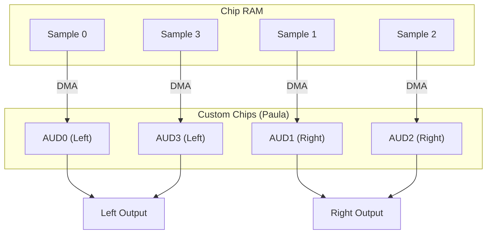
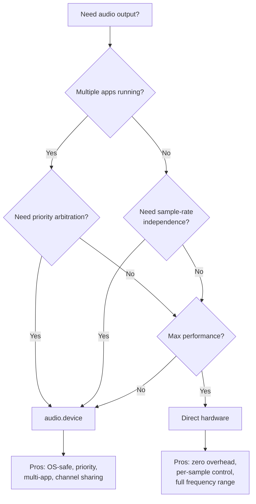

[← Home](../README.md) · [Devices](README.md)

# audio.device — DMA Audio Channels

## Overview

In 1985, every competing computer could beep. The Apple II clicked a speaker with a software timing loop. The C64 had one SID voice doing square-wave synthesis, which was musical but not sampled. The IBM PC had a PC speaker — period.

The Amiga didn't beep. It streamed **four independent channels of 8-bit signed PCM audio** directly from RAM through a DAC, without the CPU touching a single sample byte after initialization.

The chip doing this was **Paula** (MOS 8364) — part DMA controller, part DAC, part interrupt generator. She pulled sample words from Chip RAM on her own bus cycles, converted them to analog voltages at a programmable rate, and pinged the CPU only when a buffer ran dry. The 68000 could draw sprites, run game logic, read the floppy disk, and the audio kept playing. This was genuinely unprecedented in a consumer computer.

`audio.device` wraps Paula in an OS-level API: channel allocation with priority arbitration, `CMD_WRITE` for playback, double-buffering for continuous streams, and interrupt-driven buffer callbacks. Games and demos typically bypass it for direct register writes — but every MOD player, every tracker, every sample-based application depends on the same four-channel DMA architecture underneath.

---

## Audio Hardware Architecture



### Channel Stereo Assignment

| Channel | Default Panning | Hardware Register Base |
|---|---|---|
| 0 | **Left** | `$DFF0A0` |
| 1 | **Right** | `$DFF0B0` |
| 2 | **Right** | `$DFF0C0` |
| 3 | **Left** | `$DFF0D0` |

This is fixed in hardware — you cannot reassign channels to different outputs. Software panning requires mixing samples before playback.

### DMA Slot Budget — How Much Audio the Machine Can Handle

Paula's audio DMA doesn't run for free. Each sample word (one per channel, when due) consumes one DMA slot — a bus cycle on the custom chip side. Understanding this budget determines whether your audio will coexist with a high-color screen, a busy Blitter, or heavy CPU work.

**The clock.** Paula's DMA clock is the system color clock divided by 2: ~1.77 MHz on both PAL and NTSC machines (3.55 MHz / 2 for PAL, 3.58 MHz / 2 for NTSC). Each color clock cycle is one opportunity for a DMA transfer. The custom chips allocate even cycles to bitplane/Copper/Blitter and odd cycles to audio/disk/sprites.

**Per-channel cost.** One sample word = one DMA slot. With 4 channels running at the standard MOD rate of ~8,287 Hz (period 428 PAL):

| What | Calculation | Result |
|---|---|---|
| DMA slots per channel per second | Same as sample rate | ~8,287 |
| DMA slots for 4 channels | 4 × 8,287 | ~33,150/sec |
| Total DMA slots available per second | ~1,773,000 (PAL) | 100% |
| Audio DMA budget consumed | 33,150 / 1,773,000 | **~1.9%** |

At standard sample rates, audio is a trivial load. The problem starts when you push toward maximum quality:

| Scenario | Period | Sample Rate | 4-Channel Slots/sec | % of DMA Budget |
|---|---|---|---|---|
| MOD default (8.3 kHz) | 428 | 8,287 Hz | ~33,150 | 1.9% |
| Low-quality speech (11 kHz) | 322 | 11,020 Hz | ~44,080 | 2.5% |
| Near-CD (22 kHz) | 161 | 22,030 Hz | ~88,120 | 5.0% |
| Maximum safe (28.8 kHz) | 123 | 28,830 Hz | ~115,320 | 6.5% |
| Theoretical max (period 1) | 1 | 3,546,895 Hz | — | Destroys everything |

**What the percentages actually mean.** DMA slots alternate with CPU cycles. At 1.9% audio load, the 68000 barely notices. At 5% (22 kHz × 4 channels), the CPU loses roughly 5% of its bus cycles to audio DMA — measurable but not disruptive. At 6.5% with a 16-color hires screen (which itself consumes ~50% of even-cycle DMA), the machine is running near its bus ceiling, and Blitter operations will visibly slow.

> [!NOTE]
> In practice, almost no Amiga application ever ran all 4 channels at 28 kHz. The sweet spot was 8–16 kHz for music (leaving headroom for effects that briefly spike), or 1–2 channels at 22 kHz for sampled speech while music continued at lower rates. The audio budget was rarely the bottleneck — bitplane DMA was almost always the limiting factor.

---

## Channel Registers

Each channel has 5 registers (10 bytes):

| Offset | Register | Size | Description |
|---|---|---|---|
| +$00 | `AUDxLCH` | WORD | Pointer high — bits 18:16 of sample address |
| +$02 | `AUDxLCL` | WORD | Pointer low — bits 15:1 of sample address |
| +$04 | `AUDxLEN` | WORD | Length in **words** (not bytes). Min=1, Max=65535 |
| +$06 | `AUDxPER` | WORD | Period (DMA clock divider). Lower = faster = higher frequency |
| +$08 | `AUDxVOL` | WORD | Volume: 0 (silent) to 64 (max). Values >64 produce distortion on some models |

### Period ↔ Frequency Conversion

```c
/* Period = clock_constant / desired_frequency */
/* PAL:  clock = 3546895 Hz */
/* NTSC: clock = 3579545 Hz */

#define PAL_CLOCK   3546895
#define NTSC_CLOCK  3579545

UWORD period_from_hz(ULONG freq, BOOL isPAL) {
    return (isPAL ? PAL_CLOCK : NTSC_CLOCK) / freq;
}

ULONG hz_from_period(UWORD period, BOOL isPAL) {
    return (isPAL ? PAL_CLOCK : NTSC_CLOCK) / period;
}
```

| Frequency | Period (PAL) | Period (NTSC) | Quality |
|---|---|---|---|
| 8287 Hz | 428 | 432 | Amiga standard (MOD default) |
| 11025 Hz | 322 | 325 | Low-quality speech |
| 16726 Hz | 212 | 214 | CD/4 quality |
| 22050 Hz | 161 | 162 | Near-CD quality |
| 28867 Hz | 123 | 124 | Maximum safe rate |

> [!WARNING]
> Periods below ~124 cause DMA contention with other chip resources (sprites, bitplanes). The hardware minimum is period=1, but anything below ~124 steals so many DMA cycles that display and other I/O suffers.

---

## Channel Allocation via audio.device

The OS manages channel allocation to prevent conflicts between applications:

```c
/* Request channels: */
#include <devices/audio.h>

/* Allocation map: which channels we want, in preference order */
UBYTE allocMap[] = {
    0x01,  /* channel 0 only */
    0x02,  /* channel 1 only */
    0x04,  /* channel 2 only */
    0x08,  /* channel 3 only */
    0x03,  /* channels 0+1 */
    0x05,  /* channels 0+2 (both left) */
    0x0A,  /* channels 1+3 (both right) */
    0x0F   /* all four channels */
};

struct MsgPort *audioPort = CreateMsgPort();
struct IOAudio *aio = (struct IOAudio *)
    CreateIORequest(audioPort, sizeof(struct IOAudio));

aio->ioa_Request.io_Message.mn_Node.ln_Pri = 0;  /* priority */
aio->ioa_Data   = allocMap;
aio->ioa_Length = sizeof(allocMap);

BYTE err = OpenDevice("audio.device", 0, (struct IORequest *)aio, 0);
if (err == 0)
{
    /* aio->ioa_AllocKey = unique key for this allocation */
    UWORD allocKey = aio->ioa_AllocKey;
    /* ioa_Request.io_Unit bits indicate which channel was allocated */
}
```

### Priority System

| Priority | User |
|---|---|
| +127 | System critical (alerts) |
| +100 | Music player (dedicated) |
| 0 | Normal application |
| −128 | Background / optional |

Higher-priority requests can **steal** channels from lower-priority holders. The displaced holder receives an `ADCMD_ALLOCATE` signal.

---

## Playing a Sample

```c
/* After successful OpenDevice: */
aio->ioa_Request.io_Command = CMD_WRITE;
aio->ioa_Request.io_Flags   = ADIOF_PERVOL;  /* set period and volume */
aio->ioa_Data    = sampleData;    /* MUST be in Chip RAM! */
aio->ioa_Length  = sampleLength;  /* in bytes (must be even) */
aio->ioa_Period  = 428;           /* ~8287 Hz (PAL) */
aio->ioa_Volume  = 64;           /* 0–64 */
aio->ioa_Cycles  = 1;            /* 0 = loop forever, N = play N times */
BeginIO((struct IORequest *)aio);
/* Returns immediately — DMA plays in background */
/* Wait for completion: */
WaitIO((struct IORequest *)aio);
```

> [!IMPORTANT]
> Sample data **must** be in Chip RAM (`MEMF_CHIP`). The DMA hardware can only read from the first 2 MB of address space. Passing a Fast RAM pointer results in silence or random noise.

### Double-Buffering (Continuous Playback)

```c
/* Use two IOAudio requests for gapless audio: */
struct IOAudio *aio_a = /* ... */;
struct IOAudio *aio_b = /* ... */;

/* Start first buffer: */
aio_a->ioa_Data   = buffer_a;
aio_a->ioa_Length = BUFFER_SIZE;
aio_a->ioa_Cycles = 1;
BeginIO((struct IORequest *)aio_a);

/* Queue second buffer immediately: */
aio_b->ioa_Data   = buffer_b;
aio_b->ioa_Length = BUFFER_SIZE;
aio_b->ioa_Cycles = 1;
BeginIO((struct IORequest *)aio_b);

/* When aio_a completes, fill buffer_a with new data and re-queue: */
WaitIO((struct IORequest *)aio_a);
/* fill buffer_a... */
BeginIO((struct IORequest *)aio_a);
/* When aio_b completes, fill buffer_b... */
```

---

## Audio Interrupts

Each channel generates an interrupt when its DMA period completes (all sample words played):

| Channel | Interrupt Bit | INTENA/INTREQ |
|---|---|---|
| AUD0 | 7 | `INTF_AUD0` ($0080) |
| AUD1 | 8 | `INTF_AUD1` ($0100) |
| AUD2 | 9 | `INTF_AUD2` ($0200) |
| AUD3 | 10 | `INTF_AUD3` ($0400) |

```c
/* Set up audio interrupt: */
struct Interrupt audioInt;
audioInt.is_Node.ln_Type = NT_INTERRUPT;
audioInt.is_Node.ln_Pri  = 0;
audioInt.is_Node.ln_Name = "MyAudioInt";
audioInt.is_Data = myData;
audioInt.is_Code = (APTR)AudioIntHandler;
AddIntServer(INTB_AUD0, &audioInt);

/* Handler — called when channel 0 finishes playing: */
__saveds void AudioIntHandler(void)
{
    /* Reload next sample segment into AUD0LCH/AUD0LCL/AUD0LEN */
    custom->aud[0].ac_ptr = nextSample;
    custom->aud[0].ac_len = nextLength / 2;  /* length in words */
}
```

---

## Modulation Modes

The Amiga audio hardware supports two modulation modes for channels 0+1 and 2+3:

### Amplitude Modulation

Channel `N` modulates the volume of channel `N+1`:

```c
/* Channel 0 data controls channel 1's volume */
custom->adkcon = ADKF_USE0V1;  /* enable AM: ch0 → ch1 volume */
```

### Period Modulation (Frequency Modulation)

Channel `N` modulates the period of channel `N+1`:

```c
/* Channel 0 data controls channel 1's period */
custom->adkcon = ADKF_USE0P1;  /* enable PM: ch0 → ch1 period */
```

These modes are rarely used in practice — they reduce the effective channel count from 4 to 2.

---

## Direct Hardware Access (Bypassing audio.device)

Games and demos often bypass `audio.device` entirely:

```asm
; Direct hardware — play a sample on channel 0:
    LEA     $DFF000, A5          ; custom chip base
    MOVE.L  #sample, $A0(A5)     ; AUD0LC — sample pointer
    MOVE.W  #length/2, $A4(A5)   ; AUD0LEN — length in words
    MOVE.W  #428, $A6(A5)        ; AUD0PER — period (8287 Hz)
    MOVE.W  #64, $A8(A5)         ; AUD0VOL — max volume

    ; Enable DMA for channel 0:
    MOVE.W  #$8201, $96(A5)      ; DMACON — set DMAEN + AUD0EN
```

> **Warning**: Direct access conflicts with any OS audio. Always `OwnBlitter()` / `Forbid()` and disable audio device first if mixing approaches.

---

## Named Antipatterns

Antipatterns are code patterns that compile and sometimes run — until they don't. Each one below has a name, the broken code, an explanation of why it fails, and the fix.

### 1. "The Silent Click" — Fast RAM Sample Buffer

**Broken:**
```c
UBYTE *sample = AllocMem(4096, MEMF_FAST);  /* Fast RAM — fast for CPU, invisible to Paula */
aio->ioa_Data = sample;
BeginIO((struct IORequest *)aio);
/* Output: silence, or a click, or static from whatever data happens to be at the same
   offset in Chip RAM. Paula's DMA bus can only address the first 2 MB. */
```

**Why it fails.** Paula's DMA controller has a 20-bit address bus hardwired to the Chip RAM bus. A pointer to Fast RAM (above $200000) is invisible to the audio DMA — Paula reads whatever is at the corresponding Chip RAM address, if anything.

**Fixed:**
```c
UBYTE *sample = AllocMem(4096, MEMF_CHIP | MEMF_PUBLIC);
/* MEMF_PUBLIC ensures the memory is visible to custom chip DMA on systems with >2 MB Chip */
aio->ioa_Data = sample;
```

### 2. "The Buffer Underscream" — Late Double-Buffer Re-queue

**Broken:**
```c
BeginIO((struct IORequest *)aio_a);
/* do heavy work — decompress audio, seek disk, render frame... */
WaitIO((struct IORequest *)aio_a);  /* buffer finished 20 ms ago */
/* reload aio_a... */
BeginIO((struct IORequest *)aio_a);  /* gap = 20 ms of silence */
```

**Why it fails.** `WaitIO()` only returns *after* the buffer is done. If you then spend 20 ms decompressing the next chunk, Paula has been starved for that entire 20 ms. The output goes to zero — a "scream" of silence between buffers, which sounds like a dropout or a click.

**Fixed:**
```c
/* Pre-queue the second buffer before starting heavy work: */
BeginIO((struct IORequest *)aio_a);
BeginIO((struct IORequest *)aio_b);  /* queued immediately — Paula won't starve */
/* NOW do heavy work while aio_a plays: */
/* ... decompress, seek, render ... */
WaitIO((struct IORequest *)aio_a);   /* by now aio_b is playing */
/* reload aio_a with new data */
BeginIO((struct IORequest *)aio_a);  /* re-queue before aio_b finishes */
WaitIO((struct IORequest *)aio_b);
/* reload aio_b... */
```

The key insight: always keep two requests in flight. When one finishes, immediately refill and re-queue it before waiting on the other.

### 3. "The Deafening Screech" — Period Too Low

**Broken:**
```c
aio->ioa_Period = 80;  /* PAL: ~44 kHz — beyond spec */
BeginIO((struct IORequest *)aio);
/* Output: distorted noise, DMA starvation, display glitching */
```

**Why it fails.** At period 80 (PAL: ~44,335 Hz), the 4 channels together would demand ~177,000 DMA slots/sec — 10% of total bus bandwidth. But the issue isn't just bandwidth: the audio DAC doesn't have time to settle between samples, producing analog distortion, and the DMA controller may miss slots, causing random samples to be skipped.

**Fixed:**
```c
aio->ioa_Period = 124;  /* PAL: ~28.6 kHz — the practical maximum */
/* If you need higher-quality audio, mix at 28 kHz externally and feed the mixer output,
   or use fewer channels at higher rates. */
```

### 4. "The Stolen Channel" — Not Checking AllocKey

**Broken:**
```c
OpenDevice("audio.device", 0, (struct IORequest *)aio, 0);
/* assume we got channels 0 and 1... */
aio->ioa_Request.io_Unit = 0;  /* WRONG — may have gotten channel 2 */
```

**Why it fails.** `OpenDevice()` returns an allocation key (`ioa_AllocKey`) and the actual channel number in `io_Unit`. A higher-priority request can steal your channels at any time. If you hardcode channel numbers from your allocation map, you'll write to the wrong registers.

**Fixed:**
```c
BYTE err = OpenDevice("audio.device", 0, (struct IORequest *)aio, 0);
if (err == 0) {
    UWORD channel = aio->ioa_Request.io_Unit;  /* the actual channel allocated */
    /* AND check periodically: */
    if (aio->ioa_AllocKey != mySavedKey) {
        /* channel was stolen — stop playback, re-request */
    }
}
```

### 5. "The One-Shot Forget" — Freeing a Playing Sample

**Broken:**
```c
aio->ioa_Cycles = 0;  /* loop forever */
BeginIO((struct IORequest *)aio);
/* ... sometime later ... */
FreeMem(sample, 4096);  /* sample is still DMA-active! */
```

**Why it fails.** With `ioa_Cycles = 0`, Paula will read that sample buffer forever. `FreeMem()` marks the memory as available, but Paula's DMA keeps reading it — you'll hear whatever the allocator puts there next (possibly other audio data, possibly nothing). Worse, if the memory gets reused for code or critical data and Paula overwrites it, you'll crash.

**Fixed:**
```c
AbortIO((struct IORequest *)aio);  /* stop DMA first */
WaitIO((struct IORequest *)aio);
/* NOW safe to free: */
FreeMem(sample, 4096);
```

---

## Pitfalls

Pitfalls are subtler than antipatterns — the code appears to work and may work for years until one specific condition triggers the bug.

### 1. Volume > 64 Causes Distortion

The AUDxVOL register is 7 bits (0–64). Values above 64 ($41–$7F) are not clipped internally on all Paula revisions — on early chips they wrap around into distortion. On later chips (A600/A1200), the upper bits are ignored.

```c
/* Safe: */
aio->ioa_Volume = 64;   /* maximum clean volume */
/* Dangerous: */
aio->ioa_Volume = 100;  /* may distort or wrap to 36 on some chips */
```

### 2. Length is in Words, Not Bytes

All AUDxLEN registers count **words** (2 bytes each), while `ioa_Length` counts **bytes**. This mismatch is the single most common audio bug:

```c
/* Byte length in IOAudio: */
aio->ioa_Length = 4096;       /* 4096 bytes */

/* Word length in hardware register: */
custom.aud[0].ac_len = 2048;  /* 4096 / 2 = 2048 words — correct */

/* Common mistake when mixing API and direct register writes: */
custom.aud[0].ac_len = 4096;  /* PAULA PLAYS 8192 BYTES — reads past buffer end! */
```

### 3. Sample Data Must Be Word-Aligned

Paula's DMA fetches samples as 16-bit words and uses only the upper byte on the first access, lower byte on the second (you can configure the order via `ADKCON`'s `MSBSYNC` bit). An odd-aligned sample pointer will cause Paula to read from the wrong address:

```c
UBYTE *sample = AllocMem(4097, MEMF_CHIP);  /* 4097 bytes — why? */
sample++;  /* now odd-aligned */
aio->ioa_Data = sample;  /* silent failure or garbled audio */
```

Always allocate even lengths and keep the base pointer word-aligned.

### 4. CMD_WRITE with `ioa_Cycles=0` Blocks WaitIO Forever

```c
aio->ioa_Cycles = 0;  /* infinite loop */
BeginIO((struct IORequest *)aio);
WaitIO((struct IORequest *)aio);  /* NEVER RETURNS */
```

`WaitIO()` waits for the I/O request to complete. A looping DMA never completes. Use `AbortIO()` to stop it, or check `CheckIO()` in a loop if you need non-blocking status.

### 5. Interleaved vs Non-Interleaved Stereo

The Amiga's stereo wiring is fixed (channels 0+3 = left, 1+2 = right). To play a stereo sample through `audio.device`, you must split the interleaved L/R/R/L data into separate per-channel buffers:

```c
/* Interleaved stereo sample in memory: L0 R0 L1 R1 L2 R2 ... */
/* audio.device expects one monaural buffer per channel:       */

UBYTE *leftBuf  = AllocMem(sampleLen/2, MEMF_CHIP);  /* every other sample */
UBYTE *rightBuf = AllocMem(sampleLen/2, MEMF_CHIP);

for (int i = 0; i < sampleLen/2; i++) {
    leftBuf[i]  = interleaved[i*2];      /* left samples */
    rightBuf[i] = interleaved[i*2 + 1];  /* right samples */
}
/* Then send leftBuf to channel 0 (or 3), rightBuf to channel 1 (or 2) */
```

This is memory-intensive and CPU-intensive. Most real-world Amiga audio was mono for this reason.

---

## Use-Case Cookbook

### Before Any Pattern: Common Initialization

Every cookbook example below depends on the same setup boilerplate. This is the audio.device equivalent of a "hello world" — allocate a message port, create an I/O request, request channels, handle errors:

```c
#include <exec/memory.h>
#include <exec/io.h>
#include <devices/audio.h>

struct MsgPort *audioPort;
struct IOAudio *audioIO;
UBYTE allocMap[] = { 0x01, 0x02, 0x04, 0x08, 0x03, 0x05, 0x0F };
UBYTE allocKey;

BOOL init_audio(void) {
    /* 1. Create message port for I/O completion signals */
    audioPort = CreateMsgPort();
    if (!audioPort) return FALSE;

    /* 2. Create extended I/O request (bigger than standard IOStdReq) */
    audioIO = (struct IOAudio *)CreateIORequest(audioPort, sizeof(struct IOAudio));
    if (!audioIO) {
        DeleteMsgPort(audioPort);
        return FALSE;
    }

    /* 3. Open audio.device with channel request */
    audioIO->ioa_Request.io_Message.mn_Node.ln_Pri = 0;   /* normal priority */
    audioIO->ioa_Data   = allocMap;                        /* channel preference list */
    audioIO->ioa_Length = sizeof(allocMap);

    BYTE err = OpenDevice("audio.device", 0, (struct IORequest *)audioIO, 0);
    if (err != 0) {
        DeleteIORequest((struct IORequest *)audioIO);
        DeleteMsgPort(audioPort);
        return FALSE;
    }

    /* 4. Save the allocation key — needed to detect channel theft */
    allocKey = audioIO->ioa_AllocKey;

    /* 5. The actual channel assigned is in audioIO->ioa_Request.io_Unit */
    return TRUE;
}

void shutdown_audio(void) {
    if (audioIO) {
        AbortIO((struct IORequest *)audioIO);              /* stop any active DMA */
        WaitIO((struct IORequest *)audioIO);
        CloseDevice((struct IORequest *)audioIO);
        DeleteIORequest((struct IORequest *)audioIO);
    }
    if (audioPort) DeleteMsgPort(audioPort);
}
```

**What this gives you.** After `init_audio()` succeeds, you have one allocated audio channel in `audioIO->ioa_Request.io_Unit`. The channel is yours until a higher-priority request steals it (check `allocKey` against `audioIO->ioa_AllocKey` to detect this). All cookbook patterns below assume this initialization ran successfully.

**Why the allocMap has 7 entries.** The map lists your preference order — first choice is channel 0 alone, then channel 1 alone, then 2, then 3, then channel pairs (0+1, 0+2, 1+3), then all four. audio.device walks the list and grants the first available match. If all channels are taken, `OpenDevice()` returns an error.

### One-Shot Sound Effect

The simplest pattern — fire and forget. You hand a sample to audio.device, it plays once, and you never check back. Useful for UI clicks, explosion sounds, voice prompts — anything where timing isn't synchronized to music or animation.

```c
void play_sfx(UBYTE *sample, ULONG len, UWORD period, UWORD volume) {
    struct IOAudio *aio = audioIO;  /* from init_audio() */

    /* Guard: if the previous sound is still playing, skip this one.
       CheckIO() returns NULL if the request is still active (non-NULL = done).
       Without this, BeginIO() would either fail silently or corrupt DMA state. */
    if (CheckIO((struct IORequest *)aio) == NULL)
        return;  /* previous SFX still playing — drop this one */

    /* CMD_WRITE = "play audio from this buffer." ADIOF_PERVOL tells the device
       to use the period and volume we set below, not whatever was left from last time. */
    aio->ioa_Request.io_Command = CMD_WRITE;
    aio->ioa_Request.io_Flags   = ADIOF_PERVOL;
    aio->ioa_Data   = sample;    /* Chip RAM pointer — must be MEMF_CHIP */
    aio->ioa_Length = len;       /* bytes, must be even */
    aio->ioa_Period  = period;   /* DMA clock divider (428 = ~8.3 kHz PAL) */
    aio->ioa_Volume  = volume;   /* 0–64 */
    aio->ioa_Cycles  = 1;        /* play once and stop — no looping */

    /* BeginIO() returns immediately. Paula starts DMA, the function exits,
       and the caller continues drawing frames, reading input, whatever. */
    BeginIO((struct IORequest *)aio);
}
```

**How it works, line by line.** `CheckIO()` is the gate — if the previous SFX hasn't finished, the new one is silently dropped. This is a design choice; you could instead queue it by using a second I/O request, or abort the old one with `AbortIO()` first. `CMD_WRITE` tells audio.device this is a playback command (as opposed to `CMD_READ`, `CMD_RESET`, or `ADCMD_ALLOCATE`). `ADIOF_PERVOL` is critical — without it, the device reuses whatever period and volume were in the I/O request from the last call, which may belong to a completely different sample. `ioa_Cycles = 1` means "play this buffer exactly once and fire the I/O completion signal." `BeginIO()` is asynchronous — it queues the DMA and returns; Paula handles the rest.

**What this pattern is NOT good for.** Any scenario where you need to know when the sound finishes. For that, use `WaitIO()` or a signal-based completion handler. This pattern is strictly fire-and-forget.

### MOD Player Loop — 4 Channels with Double-Buffering

This is the classic tracker pattern — each channel has two alternating buffers, reloaded from pattern data in the VBlank interrupt:

```c
struct MODChannel {
    struct IOAudio aio;      /* I/O request for audio.device */
    UBYTE *buf_a, *buf_b;   /* double-buffer in Chip RAM */
    UBYTE *active;           /* which buffer is currently playing */
    UWORD period, volume;
};

/* Called from VBlank interrupt server: */
void MOD_vblank(struct MODChannel *ch, UBYTE *nextSample, UWORD nextLen) {
    UBYTE *freeBuf = (ch->active == ch->buf_a) ? ch->buf_b : ch->buf_a;
    CopyMem(nextSample, freeBuf, nextLen);  /* fill the non-playing buffer */

    /* Queue it — will play when current buffer finishes: */
    ch->aio.ioa_Request.io_Command = CMD_WRITE;
    ch->aio.ioa_Request.io_Flags   = ADIOF_PERVOL;
    ch->aio.ioa_Data   = freeBuf;
    ch->aio.ioa_Length = nextLen;
    ch->aio.ioa_Period = ch->period;
    ch->aio.ioa_Volume = ch->volume;
    ch->aio.ioa_Cycles = 1;
    BeginIO((struct IORequest *)&ch->aio);

    ch->active = freeBuf;  /* track which buffer is now playing */
}
```

> [!NOTE]
> Real MOD players (Protracker, OctaMED, DigiBooster) bypass `audio.device` and write directly to AUDxLC/AUDxLEN/AUDxPER/AUDxVOL registers in a VBlank interrupt server. This eliminates `BeginIO()`/`WaitIO()` overhead and allows per-row period/volume updates. The `audio.device` approach above is shown for OS-friendly applications; direct hardware is faster but not multitasking-safe.

### Streaming from Disk — Continuous Playback

Play a large 8SVX or raw sample from disk without loading it all into memory:

```c
#define BUF_SIZE 8192
UBYTE *buf_a = AllocMem(BUF_SIZE, MEMF_CHIP);
UBYTE *buf_b = AllocMem(BUF_SIZE, MEMF_CHIP);
BPTR fh = Open("music.raw", MODE_OLDFILE);

/* Prime first buffer: */
Read(fh, buf_a, BUF_SIZE);
aio_a->ioa_Data = buf_a;
aio_a->ioa_Length = BUF_SIZE;
aio_a->ioa_Cycles = 1;
BeginIO((struct IORequest *)aio_a);

/* Prime second: */
Read(fh, buf_b, BUF_SIZE);
aio_b->ioa_Data = buf_b;
aio_b->ioa_Length = BUF_SIZE;
aio_b->ioa_Cycles = 1;
BeginIO((struct IORequest *)aio_b);

/* Loop: refill whichever buffer just finished: */
for (;;) {
    LONG bytes = 0;
    WaitIO((struct IORequest *)aio_a);
    bytes = Read(fh, buf_a, BUF_SIZE);
    if (bytes <= 0) break;
    aio_a->ioa_Length = bytes;
    BeginIO((struct IORequest *)aio_a);

    WaitIO((struct IORequest *)aio_b);
    bytes = Read(fh, buf_b, BUF_SIZE);
    if (bytes <= 0) break;
    aio_b->ioa_Length = bytes;
    BeginIO((struct IORequest *)aio_b);
}
```

### Priority-Based Voice-Over (System Alert)

Play an alert sound that steals a music channel:

```c
/* Music plays at priority 0 on channel 0: */
aio_music->ioa_Request.io_Message.mn_Node.ln_Pri = 0;

/* Alert at priority +127 — will steal channel 0 if needed: */
aio_alert->ioa_Request.io_Message.mn_Node.ln_Pri = 127;
aio_alert->ioa_Data   = alertSample;
aio_alert->ioa_Length = ALERT_LEN;
aio_alert->ioa_Cycles = 1;
BeginIO((struct IORequest *)aio_alert);
/* Alert plays, music on channel 0 stops until alert finishes */
```

---

## When to Use `audio.device` vs Direct Hardware



| Criterion | `audio.device` | Direct Hardware |
|---|---|---|
| Multi-application safe | Yes — priority arbitration prevents conflicts | No — apps will stomp each other's registers |
| CPU overhead | Moderate — `BeginIO()`/`WaitIO()` and message passing | Zero — just register writes |
| Sample rate flexibility | Any period supported (1–65535) | Any period, but no DMA arbitration |
| Channel allocation | Automatic, priority-based, dynamic | Manual — you decide, you conflict |
| Per-sample manipulation | No — DMA handles everything | Yes — write to AUDxDAT for chip-tune effects |
| Recommended for | Utilities, system alerts, music players, streaming apps | Games, demos, trackers, anything that takes over the machine |

> [!NOTE]
> The hybrid approach — allocating channels with audio.device, then accessing them via direct register writes — is technically possible but fragile. If the OS doesn't know you're driving the channel directly, it may re-allocate it to another application. Use only if you also `Forbid()` multitasking or hold the allocation key.

---

## Best Practices

1. **Always double-buffer.** Single-buffering creates a gap at every buffer boundary
2. **Use `MEMF_CHIP` — no exceptions.** No amount of cleverness makes Fast RAM visible to Paula
3. **Set `ioa_Cycles` to 1 for one-shots, 0 for continuous loops (with `AbortIO()` to stop)**
4. **Pre-queue the second buffer before waiting on the first** — keep two I/O requests in flight
5. **Check `CheckIO()` before `BeginIO()`** — don't re-queue a request that's still active
6. **Use period 124–428 for music, 161–322 for speech** — higher rates consume DMA budget
7. **Set `ioa_Volume` to 64 max** — higher values produce distortion on real hardware
8. **Handle `ADCMD_ALLOCATE` signal** — your music player should gracefully mute if channels are stolen

---

## When NOT to Use `audio.device`

| Situation | Reason | Alternative |
|---|---|---|
| Full-screen game or demo | `audio.device` adds message-passing overhead and may conflict with custom Copper/Blitter code | Direct hardware registers |
| Chip-tune synthesis (writing to AUDxDAT directly) | `audio.device` only supports DMA playback, not per-sample register writes | Direct AUDxDAT writes |
| Need >4 virtual channels | `audio.device` allocates physical channels — software mixing required | Mix in software, feed mixed buffer to one channel |
| Exec is disabled or `Forbid()` is active | `audio.device` requires exec message ports | Direct hardware registers |
| Timer.device-based sample playback | Conflict — both want DMA slots on the same bus | Use audio DMA or timer, not both simultaneously |

---

## Historical Context & Cross-Platform Comparison

### The 1985 Landscape

| Platform | Audio Hardware | Voices | Sample Depth | CPU Load |
|---|---|---|---|---|
| **Amiga (OCS)** | Paula DMA | 4 | 8-bit signed PCM | Zero (DMA) |
| **Atari ST** | YM2149 PSG | 3 | Square wave only | CPU-driven |
| **Macintosh 128K** | PWM via VIA | 1 | ~8-bit via software PWM | Heavy CPU |
| **IBM PC (1985)** | PC Speaker | 1 | 1-bit pulse | 100% CPU for anything melodic |
| **C64** | SID 6581 | 3 | 8-bit waveform synthesis | Register writes only |
| **Apple IIgs (1986)** | Ensoniq DOC | 32 (wavetable) | 8-bit PCM | DMA |
| **Arcade (YM2151)** | FM synthesis | 8 | FM operators | Register writes |

**What made the Amiga different.** Every other 1985 consumer computer required CPU intervention to produce sound — either bit-banging a 1-bit speaker (PC, Mac), writing to a PSG every few microseconds (ST), or driving a synthesis chip (C64). The Amiga's Paula was the only one where you set a pointer and a length and walked away. The 68000 could be pegged at 100% rendering 3D and the audio would not glitch. This was the same trick the Amiga used for graphics (Copper, Blitter) — custom silicon does the grunt work, CPU does the logic.

**The IIGS comparison (1986).** Apple's Ensoniq DOC had 32 voices of wavetable synthesis — more channels, better polyphony. But it had **no sample DMA**; you loaded waveforms into the chip's internal RAM and triggered them via MIDI-like commands. The Amiga could stream arbitrary-length samples from main memory, limited only by Chip RAM size. This made the Amiga a sampler, not just a synthesizer.

### Modern Analogies

| Amiga Concept | Modern Equivalent |
|---|---|
| Paula 4-channel DMA | ASIO/CoreAudio hardware buffer with zero-CPU callback |
| `audio.device` priority allocation | PulseAudio/PipeWire stream priority |
| AUDxPER register | Sample rate converter (hardware clock divider) |
| AUDxVOL register | Per-channel gain (pre-mixer fader) |
| Double-buffering | Audio ring buffer / circular buffer |
| Direct AUDxDAT writes | Microphone-class bit-banging (Arduino tone()) |
| ADKCON modulation | Sidechain compression / FM synthesis |

---

## The MOD File Format — Four Channels That Defined a Generation

The MOD file format, born on the Amiga in 1987, is the reason Paula's four channels matter beyond technical curiosity. It wasn't just a file format — it was a cultural earthquake. MOD files turned bedroom coders into musicians, launched the demoscene, and created an entire genre of electronic music (tracker music) that persists today.

### Why MOD Mattered

Before MOD, if you wanted music in a computer program, you had two choices: bleeps and bloops from a square-wave chip (C64 SID, Atari ST YM2149), or a giant WAV file nobody could afford the RAM for. A 3-minute song as raw 8-bit 8 kHz PCM consumed ~1.4 MB — more than the total RAM of a stock A500.

MOD solved this with a simple insight: **music is repetitive**. A bass drum sample plays dozens of times per song. A synth lead loops every bar. Don't store the audio — store the instructions on how to play it. The result: a 3-minute, 4-channel song with dozens of instruments fits in **30–200 KB**. Entire games shipped with MOD soundtracks smaller than a single screen's worth of graphics.

### How a MOD File Is Built

A MOD file contains four things, and nothing else:

```
┌───────────────────────────────────────────────┐
│  Header: song name, length, pattern table     │
├───────────────────────────────────────────────┤
│  Sample data: short 8-bit PCM loops (31 max)  │
│  - kick drum:    800 bytes                    │
│  - snare:       1200 bytes                    │
│  - synth pad:   3200 bytes (looping)          │
│  - bass:        1600 bytes (looping)          │
│  - hi-hat:       400 bytes                    │
│  ... (up to 31 instruments)                   │
├───────────────────────────────────────────────┤
│  Patterns: 64 rows × 4 tracks (channels)      │
│  Each row = [note][sample#][effect][param]    │
├───────────────────────────────────────────────┤
│  Pattern sequence: order list (e.g., 0,1,0,2) │
└───────────────────────────────────────────────┘
```

**Samples.** Each instrument is a short 8-bit signed PCM sample — rarely more than 8 KB, often smaller. A kick drum might be 800 bytes. A guitar power chord might be 2 KB, looped to sustain indefinitely. The format supports repeating loops: a string sample plays its attack once, then the sustained portion loops seamlessly until the note ends. This is how a 1 KB sample can produce a 10-second held chord.

**Patterns.** A pattern is 64 rows (one row per 1/16th note at 125 BPM). Each row contains one event per channel: which note (C-1 to B-3 across 3 octaves), which sample to trigger, what effect to apply, and an effect parameter. Paula plays the note by adjusting the sample's playback rate — lower period = higher pitch. The same kick drum sample at different periods produces different notes, though at the cost of changing the drum's character (higher = chipmunk, lower = sludgy).

**Effects.** This is where MOD transcends a simple sequencer. Each note can have an effect command:

| Effect | Code | What it Does |
|---|---|---|
| Arpeggio | `0xx` | Rapidly alternates between three notes, creating chord illusions on a single channel |
| Portamento | `1xx`/`2xx` | Slides pitch up or down between notes |
| Vibrato | `4xx` | Oscillates pitch for expression — the "singing" lead sound |
| Volume slide | `Axx` | Fades volume up or down per row |
| Pattern break | `Dxx` | Jumps to a different row or pattern — structural control |
| Sample offset | `9xx` | Starts playback from a specific byte in the sample — stutter effects |

Arpeggio is the signature MOD effect. With only 4 channels, you can't play a 3-note chord without consuming 3 channels. Arpeggio cycles through the notes of a chord so fast (once per video frame at 50 Hz) that the ear hears a chord, not a rapid sequence. This single trick is what makes MOD music sound full despite the channel limit.

### How 100 KB Produces 3 Minutes of Music

A concrete example — a typical MOD file:

| Component | Size | Notes |
|---|---|---|
| Header | ~50 bytes | Song name, 31 sample headers (name, length, volume, loop points) |
| 15 instrument samples | ~40 KB total | Short loops: kick 0.8K, snare 1.2K, hi-hat 0.4K, bass 1.6K, pad 3.2K, lead 2K, various hits and FX |
| 20 patterns (64×4) | ~16 KB | 64 rows × 4 channels × 4 bytes = 1 KB per pattern; 20 patterns |
| Pattern sequence | ~128 bytes | Which patterns play in what order |
| **Total** | **~57 KB** | A complete 3-minute song |

That 57 KB song, at 8.3 kHz playback, streams the equivalent of ~5.8 MB of audio — a **100:1 effective compression ratio** that no general-purpose codec of the era could match. The trick is that compression exploits musical structure: repetition, looping, and the fact that a snare drum sounds the same every time you hit it.

### The Cultural Aftershock

MOD files democratized game music. **Karsten Obarski** wrote the original Ultimate Soundtracker in 1987, and within two years, dozens of tracker clones proliferated: **Protracker**, **NoiseTracker**, **OctaMED**, **DigiBooster**. Anyone with an Amiga could download samples from a BBS, sequence them in a tracker, and produce a song that sounded professional — no recording studio, no band, no synthesizer hardware.

This created the **demoscene** — a pan-European subculture of programmers, musicians, and graphic artists who competed to produce the most impressive audiovisual presentations in the smallest possible executable. MOD files were the soundtrack. Composers like **4-mat**, **Jester**, **Lizardking**, **Moby** (yes, that Moby — he started on Amiga trackers), **Purple Motion**, and **Skaven** built careers from 4-channel, 8-bit samples.

The tracker interface itself — a vertical scrolling spreadsheet of notes, numbers, and effects — became the blueprint for modern DAWs like Renoise, FamiTracker, and the tracker mode in FL Studio. The MOD format's DNA survives in XM (FastTracker 2), IT (Impulse Tracker), S3M (ScreamTracker 3), and countless chiptune tools.

> [!NOTE]
> The Amiga's Paula had no hardware MIDI synthesizer, no FM chip, no wavetable ROM. Every sound you hear in a MOD file is a raw 8-bit PCM sample, loaded from the file and pushed through Paula's DMA. The magic is entirely in the sequencing — four voices, 64 rows per pattern, a handful of effects, and the human ear's willingness to be fooled by arpeggios and vibrato.

---

## FPGA / Emulation Impact

### Paula Timing in Emulation

Paula's audio DMA timing is **cycle-exact** — sample fetches happen at precise color-clock boundaries relative to the video beam. Most emulators (WinUAE, FS-UAE) handle this correctly, but cycle-exact mode (CE) vs fastest-possible mode (JIT) can produce different audio timing:

- **Cycle-exact mode:** Audio DMA is locked to the emulated color clock. Latency is correct. Interrupt timing matches real hardware. Period setting produces the exact expected frequency.
- **JIT / fastest-possible mode:** Audio DMA is buffered. Latency may be higher or lower than real hardware. Games that use audio interrupt timing for synchronization (rare but exists — e.g., some Protracker clones) may drift.

### MiSTer / FPGA Implementation

On the MiSTer Minimig core, Paula audio is implemented in the FPGA fabric:

- **DAC output:** The Minimig core uses a sigma-delta DAC (on the DE10-Nano) rather than Paula's original R-2R ladder DAC. The output is functionally identical but has slightly different analog characteristics — the original Paula DAC has a "warm" nonlinearity that FPGA implementations don't reproduce perfectly.
- **DMA timing:** The Minimig core's audio DMA slot allocation matches real hardware exactly. Cycle-exact Paula behavior is a solved problem in FPGA.
- **Volume register:** The DE10-Nano's DAC accepts the full 0–64 range cleanly; values above 64 are clipped silently (unlike real Paula, where they wrap on early revisions)
- **Interpolation:** Some FPGA cores (notably the TC64/Minimig AGA core) add optional linear interpolation between samples. Real Paula does not interpolate — each sample word is held at the DAC output until the next word. This produces a slightly "stepped" waveform at low sample rates that interpolation smooths out. For cycle-exact reproduction, disable interpolation.

### Test Tone for Emulator Validation

A 1 kHz sine wave at period 3547 (PAL) / 3580 (NTSC) should produce a clean tone with no aliasing. If you hear clicks, pops, or frequency drift, the emulator's audio DMA timing is off.

---

## FAQ

### Can the Amiga play 16-bit audio?

No — Paula's DACs are fundamentally 8-bit, and the Amiga has no 16-bit DAC hardware. But a clever trick, discovered in the mid-1990s, effectively doubled the resolution to **~14 bits** by ganging two channels together.

**How the 14-bit trick works.** Two Paula channels play the exact same sample simultaneously on the same stereo side. The first channel carries the upper 8 bits of each 14-bit sample at full volume (64). The second channel carries the lower 6 bits at volume 1 — exactly 1/64th the amplitude. Paula's analog output stage sums the two channels, and the result is a waveform with ~14 bits of effective dynamic range (16,384 levels instead of 256).

```
14-bit sample word:  [b13 b12 b11 b10 b9 b8 b7 b6 b5 b4 b3 b2 b1 b0]
                            │                                          │
               ┌────────────┘                          ┌───────────────┘
               ▼                                       ▼
     Channel A: upper 8 bits (b13–b6)        Channel B: lower 6 bits (b5–b0)
     Volume: 64 (full)                        Volume: 1 (1/64th amplitude)
               │                                       │
               └───────────┬───────────────────────────┘
                           ▼
               Paula analog mixer (L or R output)
                           ▼
                   ~14-bit effective output
```

**The calibration problem.** This works in theory but Paula's DAC is not perfectly linear. Volume 1 doesn't produce exactly 1/64th of volume 64 on every chip — there are manufacturing variations. Without calibration, the upper and lower halves don't align, producing distortion at the boundary. **Christian Buchner** solved this in 1995 with a calibration utility (bundled with Play16 as "Cyber Sound") that measured your specific Paula chip and generated a lookup table mapping each 14-bit value to the correct pair of 8-bit values and volumes. This "14-bit calibrated" mode (often labeled "14c" in players) eliminated the distortion.

**Who used it.** The technique appeared in Play16 (Thomas Wenzel, 1995), then spread to virtually every Amiga audio player of the late 1990s: HippoPlayer, EaglePlayer, DeliTracker, AmigaAmp, and the AHI audio system's `paula.audio` driver ("HiFi 14-bit Stereo++" mode). The calibrated 14-bit mode consumed all 4 hardware channels for stereo (two per side), leaving no channels free for system sounds — but for music playback, the quality improvement was dramatic.

**MP3 playback and the 68040 era.** The 14-bit Paula mode is what made MP3 playback viable on real Amiga hardware. An MP3 decoder (`mpega.library`) handles the decompression math, and the decoded 16-bit PCM is dithered down to 14-bit and fed to the calibrated Paula driver. This required serious CPU horsepower:
- **68040 @ 25 MHz:** Real-time playback of 128 kbps stereo MP3 at ~80–95% CPU utilization. Just barely doable while the machine was otherwise idle.
- **68060 @ 50 MHz:** Comfortable MP3 playback at ~40–60% CPU, leaving headroom for Workbench responsiveness.
- **68030 @ 50 MHz:** Possible only with a heavily optimized `mpega.library` build and mono/downsampled MP3s. Stuttered on complex stereo tracks.

The AmigaAmp player (modeled after WinAmp) became the standard MP3 player for accelerated Amigas. For systems without an 040, the MAS-Player — a hardware MP3 decoder on the parallel port — bypassed the CPU entirely.

**The cost.** 14-bit calibrated stereo consumed all 4 Paula channels. The CPU overhead for 14-bit reconstruction was modest (just a table lookup per sample), but software mixing multiple virtual channels into the 14-bit output was expensive. For simple playback of pre-rendered audio (MP3, WAV, AIFF), the trade-off was worth it — the Amiga suddenly sounded like a 1990s PC sound card rather than a 1980s game console.

### Why does my audio click when I start/stop playback?

Starting DMA with a non-zero sample in AUDxDAT before enabling the channel produces a click — Paula outputs whatever value is in the data register on startup. Silence the first sample word, or set volume to 0, enable DMA, wait one period, then raise volume.

### Can I pan channels in software?

No — the stereo assignment is hardwired (0+3=left, 1+2=right). The only software workaround is to mix two channels into one buffer at different amplitudes before playback. This consumes 2 physical channels for one pannable virtual channel.

### How much Chip RAM does audio need?

At 8,287 Hz mono: ~8 KB/sec/channel. A 4-channel MOD playing a 3-minute song at 8 kHz consumes ~5.8 MB of sample data — but MOD samples are typically short loops, not full-song streams. Real-world Chip RAM requirements for a MOD player with samples: 100–400 KB for samples + 64 KB for pattern data + 16 KB for double-buffers.

### Does `audio.device` work with all Amiga models?

Yes — every Amiga from the A1000 through the A4000 has Paula and an `audio.device`. The CD32 and CDTV also use the same audio hardware. Only third-party sound cards add different audio backends (AHI).

### Can I use audio DMA and floppy disk at the same time?

Yes, but they share odd-cycle DMA slots. Heavy floppy activity + 4-channel high-rate audio can cause brief audio dropouts on OCS machines. Paula arbitrates audio vs. disk DMA automatically; audio wins at the expense of slightly slower disk transfers.

---

## References

- NDK39: `devices/audio.h`, `hardware/custom.h`
- HRM: *Amiga Hardware Reference Manual* — Audio Hardware chapter (Paula registers, DMA, ADKCON)
- ADCD 2.1: `audio.device` autodocs, Include & Autodocs 3 guide
- Motorola: *M68000 Family Programmer's Reference Manual* — interrupt priority levels (IPL 4 for audio)
- See also: [Paula Audio — OCS Hardware](../01_hardware/ocs_a500/paula_audio.md) — hardware register reference, ADKCON modulation bits, non-DMA mode
- See also: [interrupts.md](../06_exec_os/interrupts.md) — interrupt server chain, AddIntServer/RemIntServer
- See also: [memory_types.md](../01_hardware/common/memory_types.md) — Chip RAM allocation requirements for DMA buffers
- See also: [8SVX vs WAV](../11_libraries/datatypes.md) — the IFF 8SVX audio format used by most Amiga sample-based applications
