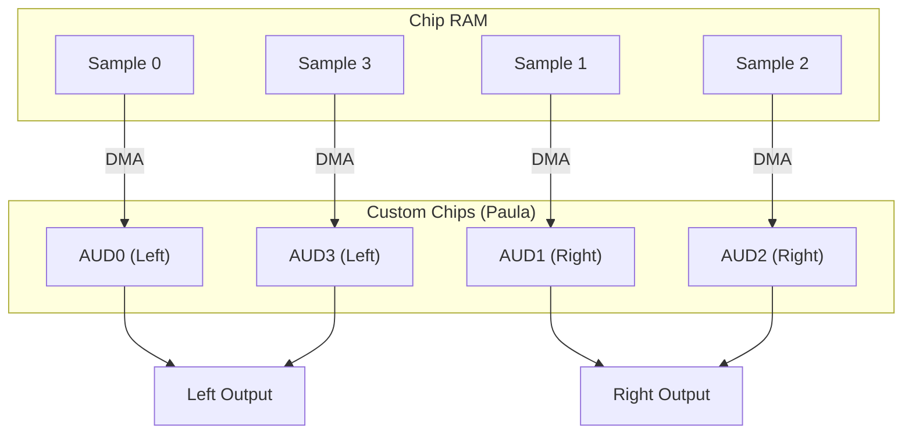

[← Home](../README.md) · [Devices](README.md)

# audio.device — DMA Audio Channels

## Overview

`audio.device` provides access to the Amiga's **4 hardware DMA audio channels**. Each channel plays 8-bit signed PCM samples from Chip RAM at a programmable rate. The hardware supports independent volume, period (sample rate), and unlimited looping. Audio DMA is handled entirely by the custom chips — the CPU is not involved in the actual sample playback.

---

## Audio Hardware Architecture



### Channel Stereo Assignment

| Channel | Default Panning | Hardware Register Base |
|---|---|---|
| 0 | **Left** | `$DFF0A0` |
| 1 | **Right** | `$DFF0B0` |
| 2 | **Right** | `$DFF0C0` |
| 3 | **Left** | `$DFF0D0` |

This is fixed in hardware — you cannot reassign channels to different outputs. Software panning requires mixing samples before playback.

---

## Channel Registers

Each channel has 5 registers (10 bytes):

| Offset | Register | Size | Description |
|---|---|---|---|
| +$00 | `AUDxLCH` | WORD | Pointer high — bits 18:16 of sample address |
| +$02 | `AUDxLCL` | WORD | Pointer low — bits 15:1 of sample address |
| +$04 | `AUDxLEN` | WORD | Length in **words** (not bytes). Min=1, Max=65535 |
| +$06 | `AUDxPER` | WORD | Period (DMA clock divider). Lower = faster = higher frequency |
| +$08 | `AUDxVOL` | WORD | Volume: 0 (silent) to 64 (max). Values >64 produce distortion on some models |

### Period ↔ Frequency Conversion

```c
/* Period = clock_constant / desired_frequency */
/* PAL:  clock = 3546895 Hz */
/* NTSC: clock = 3579545 Hz */

#define PAL_CLOCK   3546895
#define NTSC_CLOCK  3579545

UWORD period_from_hz(ULONG freq, BOOL isPAL) {
    return (isPAL ? PAL_CLOCK : NTSC_CLOCK) / freq;
}

ULONG hz_from_period(UWORD period, BOOL isPAL) {
    return (isPAL ? PAL_CLOCK : NTSC_CLOCK) / period;
}
```

| Frequency | Period (PAL) | Period (NTSC) | Quality |
|---|---|---|---|
| 8287 Hz | 428 | 432 | Amiga standard (MOD default) |
| 11025 Hz | 322 | 325 | Low-quality speech |
| 16726 Hz | 212 | 214 | CD/4 quality |
| 22050 Hz | 161 | 162 | Near-CD quality |
| 28867 Hz | 123 | 124 | Maximum safe rate |

> [!WARNING]
> Periods below ~124 cause DMA contention with other chip resources (sprites, bitplanes). The hardware minimum is period=1, but anything below ~124 steals so many DMA cycles that display and other I/O suffers.

---

## Channel Allocation via audio.device

The OS manages channel allocation to prevent conflicts between applications:

```c
/* Request channels: */
#include <devices/audio.h>

/* Allocation map: which channels we want, in preference order */
UBYTE allocMap[] = {
    0x01,  /* channel 0 only */
    0x02,  /* channel 1 only */
    0x04,  /* channel 2 only */
    0x08,  /* channel 3 only */
    0x03,  /* channels 0+1 */
    0x05,  /* channels 0+2 (both left) */
    0x0A,  /* channels 1+3 (both right) */
    0x0F   /* all four channels */
};

struct MsgPort *audioPort = CreateMsgPort();
struct IOAudio *aio = (struct IOAudio *)
    CreateIORequest(audioPort, sizeof(struct IOAudio));

aio->ioa_Request.io_Message.mn_Node.ln_Pri = 0;  /* priority */
aio->ioa_Data   = allocMap;
aio->ioa_Length = sizeof(allocMap);

BYTE err = OpenDevice("audio.device", 0, (struct IORequest *)aio, 0);
if (err == 0)
{
    /* aio->ioa_AllocKey = unique key for this allocation */
    UWORD allocKey = aio->ioa_AllocKey;
    /* ioa_Request.io_Unit bits indicate which channel was allocated */
}
```

### Priority System

| Priority | User |
|---|---|
| +127 | System critical (alerts) |
| +100 | Music player (dedicated) |
| 0 | Normal application |
| −128 | Background / optional |

Higher-priority requests can **steal** channels from lower-priority holders. The displaced holder receives an `ADCMD_ALLOCATE` signal.

---

## Playing a Sample

```c
/* After successful OpenDevice: */
aio->ioa_Request.io_Command = CMD_WRITE;
aio->ioa_Request.io_Flags   = ADIOF_PERVOL;  /* set period and volume */
aio->ioa_Data    = sampleData;    /* MUST be in Chip RAM! */
aio->ioa_Length  = sampleLength;  /* in bytes (must be even) */
aio->ioa_Period  = 428;           /* ~8287 Hz (PAL) */
aio->ioa_Volume  = 64;           /* 0–64 */
aio->ioa_Cycles  = 1;            /* 0 = loop forever, N = play N times */
BeginIO((struct IORequest *)aio);
/* Returns immediately — DMA plays in background */
/* Wait for completion: */
WaitIO((struct IORequest *)aio);
```

> [!IMPORTANT]
> Sample data **must** be in Chip RAM (`MEMF_CHIP`). The DMA hardware can only read from the first 2 MB of address space. Passing a Fast RAM pointer results in silence or random noise.

### Double-Buffering (Continuous Playback)

```c
/* Use two IOAudio requests for gapless audio: */
struct IOAudio *aio_a = /* ... */;
struct IOAudio *aio_b = /* ... */;

/* Start first buffer: */
aio_a->ioa_Data   = buffer_a;
aio_a->ioa_Length = BUFFER_SIZE;
aio_a->ioa_Cycles = 1;
BeginIO((struct IORequest *)aio_a);

/* Queue second buffer immediately: */
aio_b->ioa_Data   = buffer_b;
aio_b->ioa_Length = BUFFER_SIZE;
aio_b->ioa_Cycles = 1;
BeginIO((struct IORequest *)aio_b);

/* When aio_a completes, fill buffer_a with new data and re-queue: */
WaitIO((struct IORequest *)aio_a);
/* fill buffer_a... */
BeginIO((struct IORequest *)aio_a);
/* When aio_b completes, fill buffer_b... */
```

---

## Audio Interrupts

Each channel generates an interrupt when its DMA period completes (all sample words played):

| Channel | Interrupt Bit | INTENA/INTREQ |
|---|---|---|
| AUD0 | 7 | `INTF_AUD0` ($0080) |
| AUD1 | 8 | `INTF_AUD1` ($0100) |
| AUD2 | 9 | `INTF_AUD2` ($0200) |
| AUD3 | 10 | `INTF_AUD3` ($0400) |

```c
/* Set up audio interrupt: */
struct Interrupt audioInt;
audioInt.is_Node.ln_Type = NT_INTERRUPT;
audioInt.is_Node.ln_Pri  = 0;
audioInt.is_Node.ln_Name = "MyAudioInt";
audioInt.is_Data = myData;
audioInt.is_Code = (APTR)AudioIntHandler;
AddIntServer(INTB_AUD0, &audioInt);

/* Handler — called when channel 0 finishes playing: */
__saveds void AudioIntHandler(void)
{
    /* Reload next sample segment into AUD0LCH/AUD0LCL/AUD0LEN */
    custom->aud[0].ac_ptr = nextSample;
    custom->aud[0].ac_len = nextLength / 2;  /* length in words */
}
```

---

## Modulation Modes

The Amiga audio hardware supports two modulation modes for channels 0+1 and 2+3:

### Amplitude Modulation

Channel `N` modulates the volume of channel `N+1`:

```c
/* Channel 0 data controls channel 1's volume */
custom->adkcon = ADKF_USE0V1;  /* enable AM: ch0 → ch1 volume */
```

### Period Modulation (Frequency Modulation)

Channel `N` modulates the period of channel `N+1`:

```c
/* Channel 0 data controls channel 1's period */
custom->adkcon = ADKF_USE0P1;  /* enable PM: ch0 → ch1 period */
```

These modes are rarely used in practice — they reduce the effective channel count from 4 to 2.

---

## Direct Hardware Access (Bypassing audio.device)

Games and demos often bypass `audio.device` entirely:

```asm
; Direct hardware — play a sample on channel 0:
    LEA     $DFF000, A5          ; custom chip base
    MOVE.L  #sample, $A0(A5)     ; AUD0LC — sample pointer
    MOVE.W  #length/2, $A4(A5)   ; AUD0LEN — length in words
    MOVE.W  #428, $A6(A5)        ; AUD0PER — period (8287 Hz)
    MOVE.W  #64, $A8(A5)         ; AUD0VOL — max volume

    ; Enable DMA for channel 0:
    MOVE.W  #$8201, $96(A5)      ; DMACON — set DMAEN + AUD0EN
```

> **Warning**: Direct access conflicts with any OS audio. Always `OwnBlitter()` / `Forbid()` and disable audio device first if mixing approaches.

---

## References

- NDK39: `devices/audio.h`, `hardware/custom.h`
- HRM: *Amiga Hardware Reference Manual* — Audio DMA chapter
- ADCD 2.1: `audio.device` autodocs
- See also: [interrupts.md](../06_exec_os/interrupts.md) — interrupt server chain
- See also: [memory_types.md](../01_hardware/common/memory_types.md) — audio sample buffers must reside in Chip RAM (Paula DMA)
