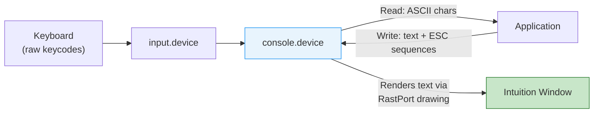

[← Home](../README.md) · [Devices](README.md)

# console.device — Text Terminal I/O

## Overview

`console.device` provides an ANSI-compatible text terminal within Intuition windows. It handles:
- **Input**: translating raw keycodes from `input.device` into ASCII/ANSI characters
- **Output**: rendering text, parsing escape sequences for cursor control, colour, and formatting
- **Clipboard**: cut/copy/paste integration

Every CLI/Shell window is backed by a console.device unit. Applications can open their own console units in any Intuition window for text I/O without implementing their own keyboard translation or cursor rendering.



---

## Opening

```c
struct MsgPort *conPort = CreateMsgPort();
struct IOStdReq *con = (struct IOStdReq *)
    CreateIORequest(conPort, sizeof(struct IOStdReq));

/* Attach to an Intuition window: */
con->io_Data   = (APTR)window;
con->io_Length = sizeof(struct Window);

if (OpenDevice("console.device", CONU_STANDARD, (struct IORequest *)con, 0))
{
    /* error — can't open console */
}
```

### Unit Types

| Unit | Constant | Description |
|---|---|---|
| 0 | `CONU_STANDARD` | Full-feature console with cursor and scrolling |
| 1 | `CONU_CHARMAP` | Character-mapped console (OS 3.0+) — faster for full-screen updates |
| 3 | `CONU_SNIPMAP` | Snip-mapped: supports clipboard cut/paste (OS 3.0+) |
| -1 | `CONU_LIBRARY` | Library mode — no window, just keymap translation |

---

## Writing Text and Escape Sequences

```c
/* Write text to the console window: */
void ConPuts(struct IOStdReq *con, char *str)
{
    con->io_Command = CMD_WRITE;
    con->io_Data    = (APTR)str;
    con->io_Length  = -1;  /* -1 = null-terminated */
    DoIO((struct IORequest *)con);
}

/* Usage: */
ConPuts(con, "Hello, Amiga!\n");
ConPuts(con, "\033[1mBold text\033[0m\n");        /* bold on/off */
ConPuts(con, "\033[33mYellow text\033[0m\n");      /* colour */
ConPuts(con, "\033[10;20HText at row 10 col 20");  /* absolute position */
```

---

## Reading Input

```c
/* Read characters (blocking): */
char buffer[256];
con->io_Command = CMD_READ;
con->io_Data    = (APTR)buffer;
con->io_Length  = sizeof(buffer);
DoIO((struct IORequest *)con);
/* con->io_Actual = number of bytes read */

/* Non-blocking read via SendIO + WaitPort: */
con->io_Command = CMD_READ;
con->io_Data    = (APTR)buffer;
con->io_Length  = 1;  /* read 1 char at a time */
SendIO((struct IORequest *)con);

/* Wait for input alongside other events: */
ULONG consoleSig = 1 << conPort->mp_SigBit;
ULONG windowSig  = 1 << window->UserPort->mp_SigBit;

ULONG sigs = Wait(consoleSig | windowSig);
if (sigs & consoleSig)
{
    WaitIO((struct IORequest *)con);
    char ch = buffer[0];
    /* process character... */
}
```

---

## ANSI Escape Sequences

Console.device supports a rich subset of ANSI/VT100 escape sequences (CSI = `\033[` = ESC + `[`):

### Cursor Movement

| Sequence | Description | Example |
|---|---|---|
| `\033[nA` | Cursor up n lines | `\033[5A` = up 5 |
| `\033[nB` | Cursor down n lines | |
| `\033[nC` | Cursor right n columns | |
| `\033[nD` | Cursor left n columns | |
| `\033[y;xH` | Move to row y, column x (1-based) | `\033[1;1H` = home |
| `\033[H` | Home cursor (top-left) | |
| `\033[6n` | Report cursor position → replies `\033[y;xR` | |
| `\033[s` | Save cursor position | |
| `\033[u` | Restore cursor position | |

### Erasing

| Sequence | Description |
|---|---|
| `\033[J` | Clear from cursor to end of screen |
| `\033[1J` | Clear from start of screen to cursor |
| `\033[2J` | Clear entire screen |
| `\033[K` | Clear from cursor to end of line |
| `\033[1K` | Clear from start of line to cursor |
| `\033[2K` | Clear entire line |

### Text Attributes (SGR)

| Sequence | Effect |
|---|---|
| `\033[0m` | Reset all attributes |
| `\033[1m` | **Bold** (high intensity) |
| `\033[3m` | *Italic* |
| `\033[4m` | <u>Underline</u> |
| `\033[7m` | Inverse video (swap fg/bg) |
| `\033[22m` | Normal intensity (cancel bold) |
| `\033[23m` | Cancel italic |
| `\033[24m` | Cancel underline |

### Colours

| Sequence | Foreground | Background |
|---|---|---|
| `\033[30m` / `\033[40m` | Black | Black |
| `\033[31m` / `\033[41m` | Red | Red |
| `\033[32m` / `\033[42m` | Green | Green |
| `\033[33m` / `\033[43m` | Yellow/Brown | Yellow/Brown |
| `\033[34m` / `\033[44m` | Blue | Blue |
| `\033[35m` / `\033[45m` | Magenta | Magenta |
| `\033[36m` / `\033[46m` | Cyan | Cyan |
| `\033[37m` / `\033[47m` | White | White |
| `\033[39m` / `\033[49m` | Default | Default |

> [!NOTE]
> Colour indices map to the **Intuition pen palette** of the window's screen, not absolute colours. Pen 0 = background, pen 1 = foreground by default.

### Amiga-Specific Extensions

| Sequence | Description |
|---|---|
| `\033[>1h` | Enable auto-scroll |
| `\033[>1l` | Disable auto-scroll |
| `\033[ p` | Enable cursor |
| `\033[0 p` | Disable cursor |
| `\033[t` / `\033[b` | Set top/bottom scroll margins |
| `\033[20h` | Linefeed mode (LF = CR+LF) |

---

## Raw Key Events

In addition to ASCII, console.device reports **special keys** as multi-byte escape sequences:

| Key | Sequence Received |
|---|---|
| Cursor Up | `\033[A` |
| Cursor Down | `\033[B` |
| Cursor Right | `\033[C` |
| Cursor Left | `\033[D` |
| Shift+Up | `\033[T` |
| Shift+Down | `\033[S` |
| F1–F10 | `\033[0~` – `\033[9~` |
| Shift+F1–F10 | `\033[10~` – `\033[19~` |
| Help | `\033[?~` |

---

## Proper Shutdown

```c
/* Must abort any pending read before closing: */
if (!CheckIO((struct IORequest *)con))
{
    AbortIO((struct IORequest *)con);
    WaitIO((struct IORequest *)con);
}
CloseDevice((struct IORequest *)con);
DeleteIORequest((struct IORequest *)con);
DeleteMsgPort(conPort);
```

---

## CON: and RAW: Handlers

The AmigaDOS file handlers `CON:` and `RAW:` are wrappers around console.device:

| Handler | Description |
|---|---|
| `CON:` | Line-buffered console — input is buffered until Enter is pressed. Supports line editing. |
| `RAW:` | Raw console — each keypress is delivered immediately. No line editing. |

```c
/* Open a CON: window from DOS: */
BPTR fh = Open("CON:0/0/640/200/My Window/CLOSE", MODE_OLDFILE);
FPuts(fh, "Type something: ");
char buf[80];
FGets(fh, buf, sizeof(buf));
Close(fh);

/* RAW: for unbuffered key-by-key input: */
BPTR raw = Open("RAW:0/0/640/200/Raw Input", MODE_OLDFILE);
/* Each Read returns immediately with 1 char */
```

---

## References

- NDK39: `devices/conunit.h`, `devices/console.h`
- ADCD 2.1: console.device autodocs
- See also: [keyboard.md](keyboard.md) — raw keycode to console.device pipeline
- See also: [input.md](input.md) — input handler chain
