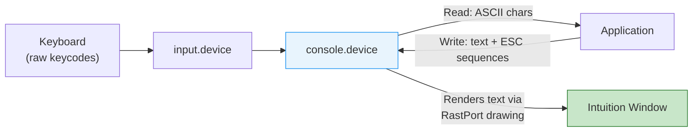
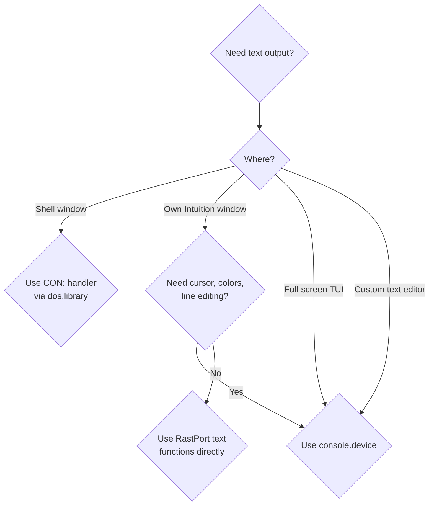

[← Home](../README.md) · [Devices](README.md)

# console.device — Text Terminal I/O

Every CLI/Shell window on the Amiga is powered by `console.device`. It is a software terminal emulator that sits between raw keyboard input and Intuition window rendering: it translates keycodes into ASCII characters, parses ANSI escape sequences for cursor control and color, and renders text through the window's RastPort. If you need a text interface in an Intuition window — a debugger console, a text editor, a terminal emulator — console.device is the foundation.

> [!NOTE]
> For simple file I/O, use [dos.library](../07_dos/file_io.md) with `CON:` windows instead of opening console.device directly. The `CON:` and `RAW:` handlers wrap console.device and provide buffered line editing, window management, and automatic cleanup.



---

## Opening

```c
struct MsgPort *conPort = CreateMsgPort();
struct IOStdReq *con = (struct IOStdReq *)
    CreateIORequest(conPort, sizeof(struct IOStdReq));

/* Attach to an Intuition window: */
con->io_Data   = (APTR)window;
con->io_Length = sizeof(struct Window);

if (OpenDevice("console.device", CONU_STANDARD, (struct IORequest *)con, 0))
{
    /* error — can't open console */
}
```

### Unit Types

| Unit | Constant | Description |
|---|---|---|
| 0 | `CONU_STANDARD` | Full-feature console with cursor and scrolling |
| 1 | `CONU_CHARMAP` | Character-mapped console (OS 3.0+) — faster for full-screen updates |
| 3 | `CONU_SNIPMAP` | Snip-mapped: supports clipboard cut/paste (OS 3.0+) |
| -1 | `CONU_LIBRARY` | Library mode — no window, just keymap translation |

---

## Writing Text and Escape Sequences

```c
/* Write text to the console window: */
void ConPuts(struct IOStdReq *con, char *str)
{
    con->io_Command = CMD_WRITE;
    con->io_Data    = (APTR)str;
    con->io_Length  = -1;  /* -1 = null-terminated */
    DoIO((struct IORequest *)con);
}

/* Usage: */
ConPuts(con, "Hello, Amiga!\n");
ConPuts(con, "\033[1mBold text\033[0m\n");        /* bold on/off */
ConPuts(con, "\033[33mYellow text\033[0m\n");      /* color */
ConPuts(con, "\033[10;20HText at row 10 col 20");  /* absolute position */
```

---

## Reading Input

```c
/* Read characters (blocking): */
char buffer[256];
con->io_Command = CMD_READ;
con->io_Data    = (APTR)buffer;
con->io_Length  = sizeof(buffer);
DoIO((struct IORequest *)con);
/* con->io_Actual = number of bytes read */

/* Non-blocking read via SendIO + WaitPort: */
con->io_Command = CMD_READ;
con->io_Data    = (APTR)buffer;
con->io_Length  = 1;  /* read 1 char at a time */
SendIO((struct IORequest *)con);

/* Wait for input alongside other events: */
ULONG consoleSig = 1 << conPort->mp_SigBit;
ULONG windowSig  = 1 << window->UserPort->mp_SigBit;

ULONG sigs = Wait(consoleSig | windowSig);
if (sigs & consoleSig)
{
    WaitIO((struct IORequest *)con);
    char ch = buffer[0];
    /* process character... */
}
```

---

## ANSI Escape Sequences

Console.device supports a rich subset of ANSI/VT100 escape sequences (CSI = `\033[` = ESC + `[`):

### Cursor Movement

| Sequence | Description | Example |
|---|---|---|
| `\033[nA` | Cursor up n lines | `\033[5A` = up 5 |
| `\033[nB` | Cursor down n lines | |
| `\033[nC` | Cursor right n columns | |
| `\033[nD` | Cursor left n columns | |
| `\033[y;xH` | Move to row y, column x (1-based) | `\033[1;1H` = home |
| `\033[H` | Home cursor (top-left) | |
| `\033[6n` | Report cursor position → replies `\033[y;xR` | |
| `\033[s` | Save cursor position | |
| `\033[u` | Restore cursor position | |

### Erasing

| Sequence | Description |
|---|---|
| `\033[J` | Clear from cursor to end of screen |
| `\033[1J` | Clear from start of screen to cursor |
| `\033[2J` | Clear entire screen |
| `\033[K` | Clear from cursor to end of line |
| `\033[1K` | Clear from start of line to cursor |
| `\033[2K` | Clear entire line |

### Text Attributes (SGR)

| Sequence | Effect |
|---|---|
| `\033[0m` | Reset all attributes |
| `\033[1m` | **Bold** (high intensity) |
| `\033[3m` | *Italic* |
| `\033[4m` | <u>Underline</u> |
| `\033[7m` | Inverse video (swap fg/bg) |
| `\033[22m` | Normal intensity (cancel bold) |
| `\033[23m` | Cancel italic |
| `\033[24m` | Cancel underline |

### Colors

| Sequence | Foreground | Background |
|---|---|---|
| `\033[30m` / `\033[40m` | Black | Black |
| `\033[31m` / `\033[41m` | Red | Red |
| `\033[32m` / `\033[42m` | Green | Green |
| `\033[33m` / `\033[43m` | Yellow/Brown | Yellow/Brown |
| `\033[34m` / `\033[44m` | Blue | Blue |
| `\033[35m` / `\033[45m` | Magenta | Magenta |
| `\033[36m` / `\033[46m` | Cyan | Cyan |
| `\033[37m` / `\033[47m` | White | White |
| `\033[39m` / `\033[49m` | Default | Default |

> [!NOTE]
> Color indices map to the **Intuition pen palette** of the window's screen, not absolute colors. Pen 0 = background, pen 1 = foreground by default.

### Amiga-Specific Extensions

| Sequence | Description |
|---|---|
| `\033[>1h` | Enable auto-scroll |
| `\033[>1l` | Disable auto-scroll |
| `\033[ p` | Enable cursor |
| `\033[0 p` | Disable cursor |
| `\033[t` / `\033[b` | Set top/bottom scroll margins |
| `\033[20h` | Linefeed mode (LF = CR+LF) |

---

## Raw Key Events

In addition to ASCII, console.device reports **special keys** as multi-byte escape sequences:

| Key | Sequence Received |
|---|---|
| Cursor Up | `\033[A` |
| Cursor Down | `\033[B` |
| Cursor Right | `\033[C` |
| Cursor Left | `\033[D` |
| Shift+Up | `\033[T` |
| Shift+Down | `\033[S` |
| F1–F10 | `\033[0~` – `\033[9~` |
| Shift+F1–F10 | `\033[10~` – `\033[19~` |
| Help | `\033[?~` |

---

## Proper Shutdown

```c
/* Must abort any pending read before closing: */
if (!CheckIO((struct IORequest *)con))
{
    AbortIO((struct IORequest *)con);
    WaitIO((struct IORequest *)con);
}
CloseDevice((struct IORequest *)con);
DeleteIORequest((struct IORequest *)con);
DeleteMsgPort(conPort);
```

---

## CON: and RAW: Handlers

The AmigaDOS file handlers `CON:` and `RAW:` are wrappers around console.device:

| Handler | Description |
|---|---|
| `CON:` | Line-buffered console — input is buffered until Enter is pressed. Supports line editing. |
| `RAW:` | Raw console — each keypress is delivered immediately. No line editing. |

```c
/* Open a CON: window from DOS: */
BPTR fh = Open("CON:0/0/640/200/My Window/CLOSE", MODE_OLDFILE);
FPuts(fh, "Type something: ");
char buf[80];
FGets(fh, buf, sizeof(buf));
Close(fh);

/* RAW: for unbuffered key-by-key input: */
BPTR raw = Open("RAW:0/0/640/200/Raw Input", MODE_OLDFILE);
/* Each Read returns immediately with 1 char */
```

---

## References

### NDK Headers

- `devices/conunit.h` — unit type constants (`CONU_STANDARD`, etc.)
- `devices/console.h` — console-specific structures

### Documentation

- ADCD 2.1: console.device autodocs
- *Amiga ROM Kernel Reference Manual: Devices* — console chapter

### Related Knowledge Base Articles

- [keyboard.md](keyboard.md) — raw keycode to console.device pipeline
- [input.md](input.md) — input handler chain
- [cli_shell.md](../07_dos/cli_shell.md) — Shell architecture built on console.device
- [windows.md](../09_intuition/windows.md) — Intuition window management

---

## Decision Guide: How to Render Text



| Approach | Use When | Pros | Cons |
|----------|----------|------|------|
| **CON: / RAW:** | Simple text I/O in a window | Easiest — just `Open()` / `Write()` | Limited control over rendering |
| **console.device** | Full-screen TUI, text editor | ANSI escape sequences, cursor, colors | Must manage I/O requests manually |
| **RastPort text** | Custom text rendering, game UI | Full pixel-level control | No built-in cursor, scrolling, or input handling |
| **Intuition gadgets** | Forms, menus, buttons | Standard UI elements | Not suitable for free-form text |

---

## Use-Case Cookbook

### Full-Screen Text UI (Status Display)

```c
/* con_tui.c — full-screen TUI using console.device */
#include <proto/exec.h>
#include <proto/intuition.h>
#include <proto/dos.h>

void ConPuts(struct IOStdReq *con, const char *str)
{
    con->io_Command = CMD_WRITE;
    con->io_Data    = (APTR)str;
    con->io_Length  = -1;
    DoIO((struct IORequest *)con);
}

void run_tui(struct Window *win, struct IOStdReq *con)
{
    /* Clear screen and draw a frame */
    ConPuts(con, "\033[2J");          /* clear screen */
    ConPuts(con, "\033[1;1H");        /* home cursor */
    ConPuts(con, "\033[7m Status Monitor \033[0m\n");  /* inverse title */
    ConPuts(con, "\033[3;1H\033[33mCPU:  \033[32m7.14 MHz\033[0m");
    ConPuts(con, "\033[4;1H\033[33mChip: \033[32m512 KB\033[0m");
    ConPuts(con, "\033[20;1H\033[7m Press ESC to exit \033[0m");

    /* Main loop — wait for keypress */
    char buf[8];
    con->io_Command = CMD_READ;
    con->io_Data    = (APTR)buf;
    con->io_Length  = sizeof(buf);
    DoIO((struct IORequest *)con);
    /* Check if ESC was pressed (0x1B) */
}
```

### Progress Bar Using Escape Sequences

```c
void DrawProgressBar(struct IOStdReq *con, int row, int percent)
{
    char buf[80];
    int bar_width = 40;
    int filled = (percent * bar_width) / 100;

    /* Move to row, column 10 */
    RawDoFmt("\033[%ld;10H", (RAWARG)&row, NULL, buf);
    ConPuts(con, buf);

    /* Draw filled portion in green, empty in black */
    ConPuts(con, "\033[42m");  /* green background */
    for (int i = 0; i < filled; i++) ConPuts(con, " ");
    ConPuts(con, "\033[40m");  /* black background */
    for (int i = filled; i < bar_width; i++) ConPuts(con, " ");
    ConPuts(con, "\033[0m");   /* reset */

    /* Percentage text */
    RawDoFmt(" %ld%%", (RAWARG)&percent, NULL, buf);
    ConPuts(con, buf);
}
```

---

## Best Practices

1. Use `CON:` via dos.library for simple text I/O — avoid opening console.device directly unless you need escape sequence control
2. Always save/restore cursor position around multi-step output operations
3. Reset all text attributes (`\033[0m`) at the end of every output operation — stale attributes cause rendering bugs
4. Use `CONU_SNIPMAP` (OS 3.0+) for clipboard support in text editors
5. Set scroll margins with `\033[t` / `\033[b` for status bars that stay fixed
6. Always abort pending reads before closing the device — see Proper Shutdown above
7. Handle both ASCII and escape-sequence input when reading — cursor keys arrive as `\033[A` etc.

---

## Named Antipatterns

### "The Leaking Read" — Pending I/O on Shutdown

```c
/* BAD: Pending async read never completed */
con->io_Command = CMD_READ;
con->io_Data    = (APTR)buffer;
con->io_Length  = 256;
SendIO((struct IORequest *)con);

/* ... user closes window ... */
CloseDevice((struct IORequest *)con);  /* CRASH: pending I/O */
```

```c
/* CORRECT: Abort pending I/O before closing */
if (!CheckIO((struct IORequest *)con))
{
    AbortIO((struct IORequest *)con);
    WaitIO((struct IORequest *)con);
}
CloseDevice((struct IORequest *)con);
```

### "The Attribute Leak" — Stale Colors After Output

```c
/* BAD: Set color but never reset — next output inherits it */
ConPuts(con, "\033[31mError!");
/* Next write is still red! */
ConPuts(con, "Normal text");  /* Still red! */
```

```c
/* CORRECT: Always reset attributes */
ConPuts(con, "\033[31mError!\033[0m");
ConPuts(con, "Normal text");  /* Correctly default color */
```

### "The Blocking Shell" — DoIO Read Freezes UI

```c
/* BAD: DoIO on CMD_READ blocks forever if no input comes */
con->io_Command = CMD_READ;
con->io_Length  = 1;
DoIO((struct IORequest *)con);  /* Frozen — can't handle IDCMP events */
```

```c
/* CORRECT: Use SendIO + Wait with IDCMP signals */
con->io_Command = CMD_READ;
con->io_Length  = 1;
SendIO((struct IORequest *)con);

ULONG conSig  = 1 << conPort->mp_SigBit;
ULONG winSig  = 1 << window->UserPort->mp_SigBit;
ULONG sigs = Wait(conSig | winSig);

if (sigs & winSig) {
    /* Handle IDCMP event (close window, etc.) */
    AbortIO((struct IORequest *)con);
    WaitIO((struct IORequest *)con);
}
if (sigs & conSig) {
    WaitIO((struct IORequest *)con);
    /* Process input character */
}
```

---

## Pitfalls & Common Mistakes

### 1. Console Position is 1-Based, Not 0-Based

**Symptom:** Text appears one row/column off from expected position.

**Cause:** ANSI `H` command uses 1-based coordinates: `\033[1;1H` is the top-left corner, not `\033[0;0H`.

**Fix:** Always add 1 to your 0-based coordinates.

### 2. Writing to a Closed Window

**Symptom:** Guru meditation or silent crash.

**Cause:** Console.device renders through the window's RastPort. If the window is closed (user clicked close gadget), writing to the console device dereferences a stale window pointer.

**Fix:** Monitor `IDCMP_CLOSEWINDOW` and abort all console I/O before closing.

### 3. Buffer Overrun on Read

**Symptom:** Memory corruption.

**Cause:** `CMD_READ` returns up to `io_Length` bytes. If you allocated a smaller buffer, the device writes past the end.

**Fix:** Always ensure `io_Length <= sizeof(buffer)`.

---

## FAQ

**Q: What is the difference between CON: and RAW:?**
A: `CON:` is line-buffered — input is collected until the user presses Enter, with line editing (backspace, cursor keys). `RAW:` delivers each keypress immediately with no editing. Use `RAW:` for games and interactive TUIs; use `CON:` for command-line tools.

**Q: Can I use console.device without an Intuition window?**
A: Yes — open with `CONU_LIBRARY` unit type. This gives access to the keymap translation without rendering. Useful for translating raw keycodes to ASCII.

**Q: How do I create a console with a specific font size?**
A: Open the window with the desired font, then open console.device on that window. The console uses the window's RastPort font. Set the font with `SetFont(window->RPort, myFont)` before opening the console.

**Q: Why does my text look wrong after a screen drag?**
A: Console.device renders into the window's RastPort. When the screen is dragged, the console does not automatically redraw. You must handle `IDCMP_NEWSIZE` and redraw the console content.

---
